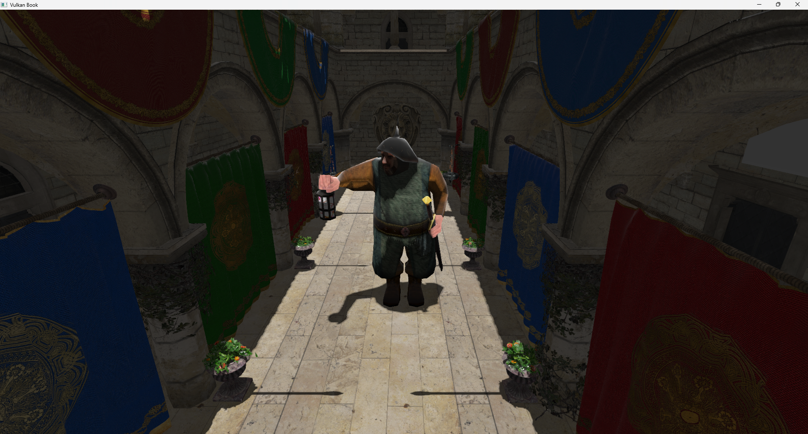

# Vulkan graphics programming in Java

This [online book](bookcontents/) will introduce the main concepts required to write graphics games or any other applications using [Vulkan](https://www.khronos.org/vulkan/) in Java.

We will use [LWJGL](http://www.lwjgl.org/) as the Java library which provides the required bindings to use Vulkan and any other required APIs. This book is the result of my self learning language, that I think it may help the community.

> [!NOTE]
> This is a new version which tries to use modern Vulkan features, such us:
> - Dynamic rendering
> - BDA
> - Ray tracing
> - New Vulkan functions (1.3)
> - ...
>
> Therefore, Vulkan 1.3 is required. If you want to access previous version, just go the [legacy branch](https://github.com/lwjglgamedev/vulkanbook/tree/legacy).

## Book Code

The book itself is also hosted in [GitHub](https://github.com/lwjglgamedev/vulkanbook/tree/test/bookcontents).

## Source Code

The source code of the samples of this book is in [GitHub](https://github.com/lwjglgamedev/vulkanbook/tree/test/booksamples).

## EPUB version

An EPUB verion is automatically gerenated in [GitHub](https://github.com/lwjglgamedev/vulkanbook/tree/master/test/vulkanbook.epub).

## Support

If you like the book you can become a [sponsor](https://github.com/sponsors/lwjglgamedev)

## Comments are welcome

Suggestions and corrections are more than welcome (and if you do like it please rate it with a star). Please send them using the discussion forum and make the corrections you consider in order to improve the book.

If you find something confusing, or you would like something clarified in the book, please [submit an issue](https://github.com/lwjglgamedev/vulkanbook/issues/new/choose) on GitHub.

## Author

Antonio Hernández Bejarano.

## Special Thanks

To all the readers that have contributed with corrections, improvements and ideas. Specifically to (sorry if I forget someone, please feel free to remind that to me):

- [SWinxy](https://github.com/SWinxy)
- [Kai Burjack](https://github.com/httpdigest)
- [Mjrlun](https://github.com/Mjrlun)
- [Rongcui Dong](https://github.com/rongcuid)
- [James Roome](https://github.com/RefuX)
- [Illithidek](https://github.com/Illithidek)
