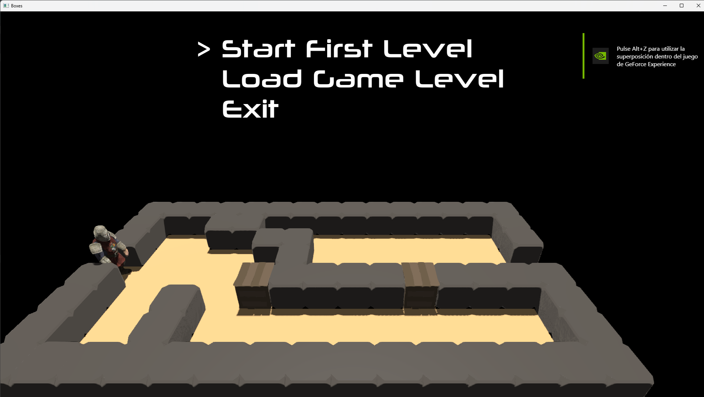

# Appendix 02 - A sample 3D game

In this appendix we will provide a ample 3D game to show how everything fits together. I will not explain the whole set of source code, instead, I will just highlight some changes made to the core source code base and some remarks.

You can find the complete source code for this chapter [here](../../booksamples/appendix-02).

## Overview of the game

The game is inspired by a classic [Sokoban](https://es.wikipedia.org/wiki/Sokoban). In that game you were to push the boxes to its final place in several scenarios acting as puzzles. In this case you will play the rol of a knight which needs to push several boxes to the finish place. You can only push them, pulling is not allowed, therefore making a wrong move can block a maze.

Some remarks:
- The game allows to define multiple levels (using ASCII code to define the contents of each cell) and uses a JSON file to list them (you can make your own puzzles and contribute to the book through a pull request if you want).
- We will need to tweak a little bit the GUI code to use custom fonts. Available fonts will be used defined through a JSON file.
- I think I've gave proper credit for the different models, sounds and fonts used. if there something missing please let me know.

## GUI Modification

In order to use custom fonts we will need to create specific textures for each font family. In order to control that process we will create a new class named `FontsManager` which is defined like this:

```java
package org.vulkanb.boxes;

import com.google.gson.*;
import imgui.*;
import org.tinylog.Logger;

import java.io.IOException;
import java.nio.file.*;
import java.util.*;

public class FontsManager {

    private static final String CONFIG_FILE = "resources/fonts/fonts.json";

    private final Map<String, ImFont> fontsMap;
    private ImFont defaultFont;

    public FontsManager() {
        fontsMap = new HashMap<>();
        Logger.debug("Loading font configuration file {}", CONFIG_FILE);
        try {
            ImGuiIO imGuiIO = ImGui.getIO();
            defaultFont = imGuiIO.getFonts().addFontDefault();

            String cfgFileContents = Files.readString(Path.of(CONFIG_FILE));

            var gson = new GsonBuilder().setFieldNamingPolicy(FieldNamingPolicy.LOWER_CASE_WITH_UNDERSCORES).create();
            List<FontData> fontDataList = new ArrayList<>();
            fontDataList.addAll(Arrays.asList(gson.fromJson(cfgFileContents, FontData[].class)));

            for (FontData fontData : fontDataList) {
                Logger.debug("Loading font [{}]", fontData.ttfFile());
                ImFont font = imGuiIO.getFonts().addFontFromFileTTF(fontData.ttfFile(), fontData.size());
                fontsMap.put(fontData.id(), font);
            }
        } catch (IOException excp) {
            Logger.error("Error loading configuration file {}", CONFIG_FILE, excp);
        }
    }

    public ImFont getDefaultFont() {
        return defaultFont;
    }

    public ImFont getFont(String fontId) {
        ImFont font;
        if (fontsMap.containsKey(fontId)) {
            font = fontsMap.get(fontId);
        } else {
            Logger.warn("Requested unknown font {}", fontId);
            font = defaultFont;
        }
        return font;
    }

    record FontData(String id, String ttfFile, float size) {
    }
}```

As you can see, in the constructor we load the JSON file which defines the fonts available. That file may look like this:

```json
[
    {
      "id": "MAIN",
      "ttf_file": "resources/fonts/neuropolitical_rg.otf",
      "size": 82.0
    }	
]
```

A font entry is defined by an identifier, which will be used later to use it, a path to a True Type Font (TTF) file and a size. Once loaded, we use the Imgui `addFontFromFileTTF` function to create an `ImFont` instance. We will store those instances in a map to later use it. We need to change the code of the `GuiRender` class
to be able to generate a font atlas not coming from the default font. We will remove font set up from the `initUI` method and move it to an new one named `loadFontsTexture`:

```java
public class GuiRender {
    ...
    public GuiRender(EngCtx engCtx, VkCtx vkCtx, Queue queue, Attachment dstAttachment) {
        attInfoColor = createColorAttachmentInfo(dstAttachment);
        renderInfo = createRenderInfo(dstAttachment, attInfoColor);

        ShaderModule[] shaderModules = createShaderModules(vkCtx);
        textDescSetLayout = new DescSetLayout(vkCtx, new DescSetLayout.LayoutInfo(VK_DESCRIPTOR_TYPE_COMBINED_IMAGE_SAMPLER,
                0, 1, VK_SHADER_STAGE_FRAGMENT_BIT));

        pipeline = createPipeline(vkCtx, shaderModules, new DescSetLayout[]{textDescSetLayout});
        Arrays.asList(shaderModules).forEach(s -> s.cleanup(vkCtx));

        buffsVtx = new VkBuffer[VkUtils.MAX_IN_FLIGHT];
        buffsIdx = new VkBuffer[VkUtils.MAX_IN_FLIGHT];

        initUI(vkCtx);
        var textureSamplerInfo = new TextureSamplerInfo(VK_SAMPLER_ADDRESS_MODE_REPEAT,
                VK_BORDER_COLOR_INT_OPAQUE_BLACK, 1, true);
        fontsTextureSampler = new TextureSampler(vkCtx, textureSamplerInfo);

        KeyboardInput ki = engCtx.window().getKeyboardInput();
        ki.setCharCallBack(new GuiUtils.CharCallBack());
        ki.addKeyCallBack(new GuiUtils.KeyCallback());

        guiTexturesMap = new HashMap<>();
    }
    ...
    private static void initUI(VkCtx vkCtx) {
        ImGui.createContext();
        ImGuiIO imGuiIO = ImGui.getIO();
        imGuiIO.setIniFilename(null);
        VkExtent2D swapChainExtent = vkCtx.getSwapChain().getSwapChainExtent();
        imGuiIO.setDisplaySize(swapChainExtent.width(), swapChainExtent.height());
        imGuiIO.setDisplayFramebufferScale(1.0f, 1.0f);
    }

    public void cleanup(VkCtx vkCtx) {
        fontsTextureSampler.cleanup(vkCtx);
        textDescSetLayout.cleanup(vkCtx);
        pipeline.cleanup(vkCtx);
        Arrays.stream(buffsVtx).filter(Objects::nonNull).forEach(b -> b.cleanup(vkCtx));
        Arrays.stream(buffsIdx).filter(Objects::nonNull).forEach(b -> b.cleanup(vkCtx));
        renderInfo.free();
        attInfoColor.free();
    }

    public void loadFontsTexture(VkCtx vkCtx, TextureCache textureCache) {
        ImGuiIO imGuiIO = ImGui.getIO();
        ImInt texWidth = new ImInt();
        ImInt texHeight = new ImInt();
        ByteBuffer buf = imGuiIO.getFonts().getTexDataAsRGBA32(texWidth, texHeight);
        ImageSrc imageSrc = new ImageSrc(buf, texWidth.get(), texHeight.get(), 4);
        Texture fontsTexture = new Texture(vkCtx, "GUI_TEXTURE", imageSrc, VK_FORMAT_R8G8B8A8_SRGB);
        textureCache.addTexture(fontsTexture.getId(), fontsTexture);
        Device device = vkCtx.getDevice();
        DescAllocator descAllocator = vkCtx.getDescAllocator();
        DescSet descSet = descAllocator.addDescSets(device, DESC_ID_TEXT, 1, textDescSetLayout)[0];
        descSet.setImage(device, fontsTexture.getImageView(), fontsTextureSampler, textDescSetLayout.getLayoutInfo().binding());
    }
    ...
}
```

Some things to notice, we will not need to store the fonts texture in the `GuiRender` class, this is managed now in the `FontsMaTextureCachenager` class. Also ww
need to call the new `loadFontsTexture` method in the `Render` class:

```java
public class Render {
    ...
    public void init(EngCtx engCtx, InitData initData) {
        ...
        guiRender.loadFontsTexture(vkCtx, textureCache);
        List<GuiTexture> guiTextures = initData.guiTextures();
        if (guiTextures != null) {
            initData.guiTextures().forEach(e -> textureCache.addTexture(vkCtx, e.texturePath(), e.texturePath(),
                    VK_FORMAT_R8G8B8A8_SRGB));
        }
        ...
    }
    ...
}
```

Now, how do we use the fonts in the code? Prior to using a font we just need to call the `pushFont` function in Imgui, like this:
```java
ImGui.pushFont(fontsManager.getFont("MAIN"));
```

Once we have done with the font we just pop the font:
```java
ImGui.popFont();
```

A sample screenshot of the main screen is shown below.

