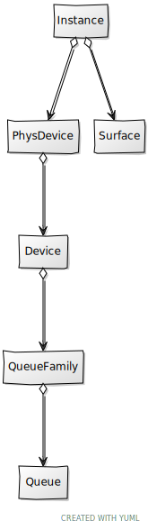

- eng.properties.
- EngCfg
- Render
- VkCtx
- Device
- PhysDevice
- Queue
- Surface

# Chapter 03 - Physical, Logical devices and Surface

In this chapter we will progress in the definition of the Vulkan structures required to render a 3D scene. Specifically, we will setup the Physical and Logical devices and a Surface.

You can find the complete source code for this chapter [here](../../booksamples/chapter-03).

## Physical device selection

A physical device represents any piece of hardware that provides a complete implementation of the Vulkan interface (usually a physical GPU). You can have several Vulkan capable physical devices (you may have more than one GPU), but you will usually just use one (we will not be dealing with multi-GPU rendering here). A side note, as we progress through this book, we will define many concepts. In order to help you in understanding the  relationship between all of them, we will be filling up a class diagram. Here you can find the ones that shows up the elements described so far.


So let's go back to coding and start by encapsulating all the code for selecting and creating a physical device in a new class named `PhysDevice` (in the package `org.vulkanb.eng.graph.vk`). As it has been said before, we may have more than one Vulkan physical devices in our host machine. In order to get the most appropriate one, this class provides a `static` method to do that selection and construct the associated object for us. This method method, named `createPhysicalDevice`, iterates over all the available devices and picks the most suitable one. The method starts like this:

```java
public class PhysDevice {
    ...
    public static PhysDevice createPhysicalDevice(Instance instance, String prefDeviceName) {
        Logger.debug("Selecting physical devices");
        PhysDevice result = null;
        try (var stack = MemoryStack.stackPush()) {
            // Get available devices
            PointerBuffer pPhysicalDevices = getPhysicalDevices(instance, stack);
            int numDevices = pPhysicalDevices.capacity();
        ...
    }
    ...
}
```

We start by getting a pointer with the list of available physical devices, by calling the method `getPhysicalDevices`. That list contains the handles that will allow us to create Vulkan physical devices. After that, we start a loop to iterate over that list and create a `VkPhysicalDevice` instance for each of those handles. `VkPhysicalDevice` class models an opaque handle to the physical device. This is the code for that loop:

```java
public class PhysicalDevice {
    ...
    public static PhysDevice createPhysicalDevice(Instance instance, String prefDeviceName) {
        ...
            // Populate available devices
            var physDevices = new ArrayList<PhysDevice>();
            for (int i = 0; i < numDevices; i++) {
                var vkPhysicalDevice = new VkPhysicalDevice(pPhysicalDevices.get(i), instance.getVkInstance());
                var physDevice = new PhysDevice(vkPhysicalDevice);

                String deviceName = physDevice.getDeviceName();
                if (!physDevice.hasGraphicsQueueFamily()) {
                    Logger.debug("Device [{}] does not support graphics queue family", deviceName);
                    physDevice.cleanup();
                    continue;
                }

                if (!physDevice.supportsExtensions(REQUIRED_EXTENSIONS)) {
                    Logger.debug("Device [{}] does not support required extensions", deviceName);
                    physDevice.cleanup();
                    continue;
                }

                if (prefDeviceName != null && prefDeviceName.equals(deviceName)) {
                    result = physDevice;
                    break;
                }
                if (physDevice.vkPhysicalDeviceProperties.properties().deviceType() == VK_PHYSICAL_DEVICE_TYPE_DISCRETE_GPU) {
                    physDevices.addFirst(physDevice);
                } else {
                    physDevices.add(physDevice);
                }
            }
        ...
    }
    ...
}
```

Each `PhysDevice` instance will retrieve all the properties and features we need to use it and to support the device selection. We need to check for two things:

- That the device supports the graphics queue family. This is done by calling the `hasGraphicsQueueFamily` method.
- That the device is capable of presenting images to a screen. This is done by calling the `hasKHRSwapChainExtension` method.

You may be surprised that this is not part of the core API, but think that you may have GPUs that may be used just for computing or that are not even attached to any display (they may do off-screen rendering). So being this capability optional, we need to be sure that the selected device supports it. We will show later on the implementation of those two methods.

If the device fulfills both conditions, we then check if its name matches the preferred device name (if this has been specified). If so, we already have our candidate and there's no need to continue so we break the loop. If not, we just add that device to the list of potential candidates and continue with the loop. We tend to select discrete GPU devices. that is, non integrated GPUs, so we add them on top of the list to have most priority.

Once we have finished with the loop, if we have not selected a device yet we just pick the first one from the list. You can add more sophistication to this selection process trying to pick the most capable one, but at this moment this approach should be enough. If no device has been selected we throw another `RuntimeException`.

```java
public class PhysDevice {
    ...
    public static PhysDevice createPhysicalDevice(Instance instance, String prefferredDeviceName) {
        ...
            // No preferred device or it does not meet requirements, just pick the first one
            result = result == null && !physDevices.isEmpty() ? physDevices.removeFirst() : result;

            // Clean up non-selected devices
            physDevices.forEach(PhysDevice::cleanup);

            if (result == null) {
                throw new RuntimeException("No suitable physical devices found");
            }
            Logger.debug("Selected device: [{}]", result.getDeviceName());
        }

        return result;
    }
    ...
}
```

The code above is just a potential selection process, you can adapt it to meet your needs. Here's the definition of the `getPhysicalDevices` method used in the code listed above.

```java
public class PhysDevice {
    ...
    protected static PointerBuffer getPhysicalDevices(Instance instance, MemoryStack stack) {
        PointerBuffer pPhysicalDevices;
        // Get number of physical devices
        IntBuffer intBuffer = stack.mallocInt(1);
        vkCheck(vkEnumeratePhysicalDevices(instance.getVkInstance(), intBuffer, null),
                "Failed to get number of physical devices");
        int numDevices = intBuffer.get(0);
        Logger.debug("Detected {} physical device(s)", numDevices);

        // Populate physical devices list pointer
        pPhysicalDevices = stack.mallocPointer(numDevices);
        vkCheck(vkEnumeratePhysicalDevices(instance.getVkInstance(), intBuffer, pPhysicalDevices),
                "Failed to get physical devices");
        return pPhysicalDevices;
    }
    ...
}
```

It is just another static method that enumerates the available physical devices by calling the `vkEnumeratePhysicalDevices` function. This functions receives the Vulkan instance, and an `IntBuffer` where the number of devices will be returned. As in some other cases, we use that call twice the first one to return the number of devices, and the second one, after allocating a `PointerBuffer` for the results, to get a list of pointers to access the data of each of them.

Let's now review the definition of the instance attributes and methods of the `PhysDevice` class itself. Let's start with attributes.

```java
public class PhysDevice {

    private final VkExtensionProperties.Buffer vkDeviceExtensions;
    private final VkPhysicalDeviceMemoryProperties vkMemoryProperties;
    private final VkPhysicalDevice vkPhysicalDevice;
    private final VkPhysicalDeviceFeatures vkPhysicalDeviceFeatures;
    private final VkPhysicalDeviceProperties2 vkPhysicalDeviceProperties;
    private final VkQueueFamilyProperties.Buffer vkQueueFamilyProps;
    ...
}
```

Let's explain the different attributes:

- `vkDeviceExtensions`:  It is a `Buffer` containing a list of supported extensions (name and version).
- `vkMemoryProperties`: It contains information related to the different memory heaps the this device supports.
- `vkPhysicalDevice`: The handle to the Physical Device itself.
- `vkPhysicalDeviceFeatures`: It contains fine grained features supported by this device, such as if it supports depth clamping, certain types of shaders, etc.
- `vkPhysicalDeviceProperties`: It contains the physical device properties, such as the device name, the vendor, its limits, etc.
- `vkQueueFamilyProps`: It is also a `Buffer` which will hold the queue families supported by the device (More on this later on)

The constructor basically populates these structures, with the exception of the `VkPhysicalDevice` which is passed as a parameter:

```java
public class PhysDevice {
    ...
    private PhysDevice(VkPhysicalDevice vkPhysicalDevice) {
        try (var stack = MemoryStack.stackPush()) {
            this.vkPhysicalDevice = vkPhysicalDevice;

            IntBuffer intBuffer = stack.mallocInt(1);

            // Get device properties
            vkPhysicalDeviceProperties = VkPhysicalDeviceProperties2.calloc().sType$Default();
            vkGetPhysicalDeviceProperties2(vkPhysicalDevice, vkPhysicalDeviceProperties);

            // Get device extensions
            vkCheck(vkEnumerateDeviceExtensionProperties(vkPhysicalDevice, (String) null, intBuffer, null),
                    "Failed to get number of device extension properties");
            vkDeviceExtensions = VkExtensionProperties.calloc(intBuffer.get(0));
            vkCheck(vkEnumerateDeviceExtensionProperties(vkPhysicalDevice, (String) null, intBuffer, vkDeviceExtensions),
                    "Failed to get extension properties");

            // Get Queue family properties
            vkGetPhysicalDeviceQueueFamilyProperties(vkPhysicalDevice, intBuffer, null);
            vkQueueFamilyProps = VkQueueFamilyProperties.calloc(intBuffer.get(0));
            vkGetPhysicalDeviceQueueFamilyProperties(vkPhysicalDevice, intBuffer, vkQueueFamilyProps);

            vkPhysicalDeviceFeatures = VkPhysicalDeviceFeatures.calloc();
            vkGetPhysicalDeviceFeatures(vkPhysicalDevice, vkPhysicalDeviceFeatures);

            // Get Memory information and properties
            vkMemoryProperties = VkPhysicalDeviceMemoryProperties.calloc();
            vkGetPhysicalDeviceMemoryProperties(vkPhysicalDevice, vkMemoryProperties);
        }
    }
    ...
}
```

The class provides a `cleanup` method, to free its resources:

```java
public class PhysDevice {
    ...
    public void cleanup() {
        Logger.debug("Destroying physical device [{}]", getDeviceName());
        vkMemoryProperties.free();
        vkPhysicalDeviceFeatures.free();
        vkQueueFamilyProps.free();
        vkDeviceExtensions.free();
        vkPhysicalDeviceProperties.free();
    }
    ...
}
```

Additionally, it also provides the *getters* for the properties described above:

```java
public class PhysDevice {
    ...
    public String getDeviceName() {
        return vkPhysicalDeviceProperties.properties().deviceNameString();
    }

    public VkPhysicalDeviceMemoryProperties getVkMemoryProperties() {
        return vkMemoryProperties;
    }

    public VkPhysicalDevice getVkPhysicalDevice() {
        return vkPhysicalDevice;
    }

    public VkPhysicalDeviceFeatures getVkPhysicalDeviceFeatures() {
        return vkPhysicalDeviceFeatures;
    }

    public VkPhysicalDeviceProperties2 getVkPhysicalDeviceProperties() {
        return vkPhysicalDeviceProperties;
    }

    public VkQueueFamilyProperties.Buffer getVkQueueFamilyProps() {
        return vkQueueFamilyProps;
    }
    ...
}
```

Now we can check the implementation of the method that checks if the device supports the required extensions. At this stage we will just check if it supports the KHR Swapchain extension. That is, the method that checks if this device is capable of rendering images to the screen.
In future chapters we may need to include additional ones, therefore we will store required extension names in a `Set` and in the `supportsExtensions`, we weill just
iterate over `vkDeviceExtensions` checking that all of them are included:

```java
public class PhysDevice {
    protected static final Set<String> REQUIRED_EXTENSIONS;

    static {
        REQUIRED_EXTENSIONS = new HashSet<>();
        REQUIRED_EXTENSIONS.add(KHRSwapchain.VK_KHR_SWAPCHAIN_EXTENSION_NAME);
    }
    ...
    public boolean supportsExtensions(Set<String> extensions) {
        var copyExtensions = new HashSet<>(extensions);
        int numExtensions = vkDeviceExtensions != null ? vkDeviceExtensions.capacity() : 0;
        for (int i = 0; i < numExtensions; i++) {
            String extensionName = vkDeviceExtensions.get(i).extensionNameString();
            copyExtensions.remove(extensionName);
        }

        boolean result = copyExtensions.isEmpty();
        if (!result) {
            Logger.debug("At least [{}] extension is not supported by device [{}]", copyExtensions.iterator().next(),
                    getDeviceName());
        }
        return result;
    }
}
```

## Queue families

Since the only pending method to present now is the one named `hasGraphicsQueueFamily` it is now the moment to talk a little bit about Vulkan queues. In Vulkan, any work is performed by submitting commands buffers through specific queues. We do not command the GPU to immediately draw a specific shape, we submit a command to a queue which contains the instructions to perform a operation like render the vertices that are part of that shape. Commands in those queues are consumed and executed asynchronously. Devices have different types of queues, which are organized in families. Each queue family only accepts a specific set of command types. For example, we may have graphic commands used to render and compute commands, each of these command types may require to be submitted to different types of queue. In our case, we want to be sure that the selected device is capable of handling graphics commands, which is what we check within the `hasGraphicsQueueFamily` method: 

```java
public class PhysicalDevice {
    ...
    private boolean hasGraphicsQueueFamily() {
        boolean result = false;
        int numQueueFamilies = vkQueueFamilyProps != null ? vkQueueFamilyProps.capacity() : 0;
        for (int i = 0; i < numQueueFamilies; i++) {
            VkQueueFamilyProperties familyProps = vkQueueFamilyProps.get(i);
            if ((familyProps.queueFlags() & VK_QUEUE_GRAPHICS_BIT) != 0) {
                result = true;
                break;
            }
        }
        return result;
    }
    ...
}
```

We iterate over the supported queue families, in order to check if they have a flag that shows that this queue family is capable of supporting graphics commands. We will explain in more detail the concepts related to queues and commands as we progress through the book.

## Logical Device

Now that we have a physical device we can start with the logical device. Vulkan separates these two concepts, while a physical device directly maps directly to a physical capable hardware, a logical device represents the actual interface to that hardware. The logical device will store all the resources that we create alongside with their state.

In case you wonder, you may create more than one logical device, it is another layer of abstraction over our GPU (the physical device) that allows us to manage the resources. In any case, here we will stick just with one logical device instance. The next picture shows the class diagram updated.


As in our previous samples, we will create a new class, named `Device` to wrap device creation and some utility methods around it. The `Device` class starts like this:

```java
package org.vulkanb.eng.graph.vk;

import org.lwjgl.PointerBuffer;
import org.lwjgl.system.MemoryStack;
import org.lwjgl.vulkan.*;
import org.tinylog.Logger;

import java.nio.*;
import java.util.*;

import static org.lwjgl.vulkan.KHRPortabilitySubset.VK_KHR_PORTABILITY_SUBSET_EXTENSION_NAME;
import static org.lwjgl.vulkan.VK13.*;
import static org.vulkanb.eng.graph.vk.VkUtils.vkCheck;

public class Device {
    private final VkDevice vkDevice;

    public Device(PhysDevice physDevice) {
        Logger.debug("Creating device");

        try (var stack = MemoryStack.stackPush()) {
            PointerBuffer reqExtensions = createReqExtensions(physDevice, stack);

            // Enable all the queue families
            var queuePropsBuff = physDevice.getVkQueueFamilyProps();
            int numQueuesFamilies = queuePropsBuff.capacity();
            var queueCreationInfoBuf = VkDeviceQueueCreateInfo.calloc(numQueuesFamilies, stack);
            for (int i = 0; i < numQueuesFamilies; i++) {
                FloatBuffer priorities = stack.callocFloat(queuePropsBuff.get(i).queueCount());
                queueCreationInfoBuf.get(i)
                        .sType$Default()
                        .queueFamilyIndex(i)
                        .pQueuePriorities(priorities);
            }

            var deviceCreateInfo = VkDeviceCreateInfo.calloc(stack)
                    .sType$Default()
                    .ppEnabledExtensionNames(reqExtensions)
                    .pQueueCreateInfos(queueCreationInfoBuf);

            PointerBuffer pp = stack.mallocPointer(1);
            vkCheck(vkCreateDevice(physDevice.getVkPhysicalDevice(), deviceCreateInfo, null, pp),
                    "Failed to create device");
            vkDevice = new VkDevice(pp.get(0), physDevice.getVkPhysicalDevice(), deviceCreateInfo);
        }
    }
    ...
}
```

The Vulkan structure `VkDevice` is the one that will hold or Vulkan logical device. We will use that structure for the creation of the resources we will need later on. In the constructor we start the familiar try/catch block to allocate short-lived objects in the LWJGL stack and start by allocating the required extension which will be return by the `createReqExtensions` method (we will see this later). Then we need to enable the queues families that this logical device will use. Later on, when we create queues, we will need to specify the queue family which it belongs to. If that queue family has been not be enabled for the logical device we will get an error.  In this case we will opt for enabling all the supported queues families (which is an structure that we obtained while creating the physical device).

We basically create a `Buffer` of `VkDeviceQueueCreateInfo` structures which will hold the index of each queue family and its priority. The priority is mechanism that allows us to instruct the driver to prioritize the work submitted by using the priorities assigned to each queue family. However, this is prioritization mechanism is not mandated in the specification. Drivers are free to apply the algorithms they consider in order to balance the work. Therefore, in our case we will just set priorities to a fixed value of `0.0` (which is the default value  for the lowest priority, we simply don't care).

However, if you examine the code, for the priorities attribute, we are using a `FloatBuffer`. Why is this? Why we just don't pass a single value? The reason is that when we create a logical device, all the queues that can be used are also pre-created. When later on we will view how to create a queue, you must keep in mind that we are not instantiating it, it is already created, we are just retrieving a handle to it. But, how this is related to the fact that we are using a `FloatBuffer` for priorities? Vulkan specification sets an attribute to set the numbers of queues created which is named `queueCount`. For each of those queues, we need to set up a priority for each of them , this is why we use a `FloatBuffer` for them (which is the equivalent of a pointer to an array of `float`'s) . Therefore, since the length of the priorities should be equal to the number of queues. LWJGL as opted to remove that attribute (`queueCount`) because the total number of queues can be derived from the other data. In our example, we have decided to create as many queues as the queue family supports, which is obtained from the attribute `queueCount` from the `VkQueueFamilyProperties` structure.

With all of the above we can fill up the structure required to create a logical device, which is called `VkDeviceCreateInfo`.

After we are ready to create the logical device by using the `vkCreateDevice` function which will receive the structure we have just created and a pointer to get a handle as the result. Finally, we use all that data to create an instance of the class `VkDevice`.

The method `createReqExtensions` will return the extensions that we will want to use and is defined like this:

```java
public class Device {
    ...
    private static PointerBuffer createReqExtensions(PhysDevice physDevice, MemoryStack stack) {
        Set<String> deviceExtensions = getDeviceExtensions(physDevice);
        boolean usePortability = deviceExtensions.contains(VK_KHR_PORTABILITY_SUBSET_EXTENSION_NAME) && VkUtils.getOS() == VkUtils.OSType.MACOS;

        var extsList = new ArrayList<ByteBuffer>();
        for (String extension : PhysDevice.REQUIRED_EXTENSIONS) {
            extsList.add(stack.ASCII(extension));
        }
        if (usePortability) {
            extsList.add(stack.ASCII(VK_KHR_PORTABILITY_SUBSET_EXTENSION_NAME));
        }

        PointerBuffer requiredExtensions = stack.mallocPointer(extsList.size());
        extsList.forEach(requiredExtensions::put);
        requiredExtensions.flip();

        return requiredExtensions;
    }
    ...
}
```

First we retrieve the supported device extensions by calling the `getDeviceExtensions` (we will see it later). If we are on MacOS and portability subset extension is supported, we need to enable it. Additionally, if you recall, when selecting the physical device we checked if it supported the KHR Swap chain extension, now it is the turn to explicitly say that we are going to use it. In order to define required extensions, we create a `PointerBuffer` which will hold a list of `null` terminated strings. The `getDeviceExtensions` method is similar to the one defined to get instance extensions. We just first call the `vkEnumerateDeviceExtensionProperties` to get the number of extensions,
create a `VkExtensionProperties` buffer to hold all the values and call `vkEnumerateDeviceExtensionProperties` to populate it. After that we just transfer all t he data 
to a `Set` of `String`s:

```java
public class Device {
    ...
    private static Set<String> getDeviceExtensions(PhysDevice physDevice) {
        Set<String> deviceExtensions = new HashSet<>();
        try (var stack = MemoryStack.stackPush()) {
            IntBuffer numExtensionsBuf = stack.callocInt(1);
            vkEnumerateDeviceExtensionProperties(physDevice.getVkPhysicalDevice(), (String) null, numExtensionsBuf, null);
            int numExtensions = numExtensionsBuf.get(0);
            Logger.trace("Device supports [{}] extensions", numExtensions);

            var propsBuff = VkExtensionProperties.calloc(numExtensions, stack);
            vkEnumerateDeviceExtensionProperties(physDevice.getVkPhysicalDevice(), (String) null, numExtensionsBuf, propsBuff);
            for (int i = 0; i < numExtensions; i++) {
                VkExtensionProperties props = propsBuff.get(i);
                String extensionName = props.extensionNameString();
                deviceExtensions.add(extensionName);
                Logger.trace("Supported device extension [{}]", extensionName);
            }
        }
        return deviceExtensions;
    }
    ...
}
```

To complete the `Device` class, here are the rest of the methods:

```java
public class Device {
    ...
    public void cleanup() {
        Logger.debug("Destroying Vulkan device");
        vkDestroyDevice(vkDevice, null);
    }

    public VkDevice getVkDevice() {
        return vkDevice;
    }

    public void waitIdle() {
        vkDeviceWaitIdle(vkDevice);
    }
}
```

As you can see they are basically a *getter* to get the `Device` handle, a `cleanup` method to free resources plus one additional method name `waitIdle` which will be used later on. This method just calls the Vulkan `vkDeviceWaitIdle` function which waits that all the pending operations on any queue for that device complete.

## Surface

Once that we have defined the `PhysDevice` it is time to create a surface to display the rendering results. We have already developed the code for creating a window, but still we need to link it somehow with Vulkan. This is handled through the WSI (Window System Integration) extensions. Remember that Vulkan is a cross-platform API which can be used in different windowing Systems, so in order to link our windows and Vulkan, we need to enable that capability through an extension (no part of the core API). If you recall, in the `Instance` class we already enabled the extensions required to integrate with the GLFW library (by calling the `GLFWVulkan.glfwGetRequiredInstanceExtensions()` method). In my case, the required extensions had this names:

- `VK_KHR_surface`

- `VK_KHR_win32_surface`

In order to create the surface we will create a new class named `Surface`. The following picture updates all the concepts viewed up to now with this new class.


The `Surface` class starts like this:

```java
package org.vulkanb.eng.graph.vk;

import org.lwjgl.glfw.GLFWVulkan;
import org.lwjgl.system.MemoryStack;
import org.lwjgl.vulkan.*;
import org.tinylog.Logger;
import org.vulkanb.eng.wnd.Window;

import java.nio.*;

import static org.lwjgl.vulkan.VK13.VK_FORMAT_B8G8R8A8_SRGB;
import static org.vulkanb.eng.graph.vk.VkUtils.vkCheck;

public class Surface {

    private final VkSurfaceCapabilitiesKHR surfaceCaps;
    private final SurfaceFormat surfaceFormat;
    private final long vkSurface;

    public Surface(Instance instance, PhysDevice physDevice, Window window) {
        Logger.debug("Creating Vulkan surface");
        try (var stack = MemoryStack.stackPush()) {
            LongBuffer pSurface = stack.mallocLong(1);
            GLFWVulkan.glfwCreateWindowSurface(instance.getVkInstance(), window.getHandle(),
                    null, pSurface);
            vkSurface = pSurface.get(0);

            surfaceCaps = VkSurfaceCapabilitiesKHR.calloc();
            vkCheck(KHRSurface.vkGetPhysicalDeviceSurfaceCapabilitiesKHR(physDevice.getVkPhysicalDevice(),
                    vkSurface, surfaceCaps), "Failed to get surface capabilities");

            surfaceFormat = calcSurfaceFormat(physDevice, vkSurface);
        }
    }
    ...
}
```

As you can see we just use the method `glfwCreateWindowSurface` from the `GLFWVulkan` class to create the surface. The handle obtained in this method will be used later on to be able to construct the artifacts required to render something in the screen. We also retrieve the surface capabilities by calling the `vkGetPhysicalDeviceSurfaceCapabilitiesKHR` function. The `Surface`class also provide a `cleanup` methods to free the allocated resources after its usage.

Let's review the definition of the `calcSurfaceFormat` method:

```java
public class Surface {
    ...
    private static SurfaceFormat calcSurfaceFormat(PhysDevice physDevice, long vkSurface) {
        int imageFormat;
        int colorSpace;
        try (var stack = MemoryStack.stackPush()) {
            IntBuffer ip = stack.mallocInt(1);
            vkCheck(KHRSurface.vkGetPhysicalDeviceSurfaceFormatsKHR(physDevice.getVkPhysicalDevice(),
                    vkSurface, ip, null), "Failed to get the number surface formats");
            int numFormats = ip.get(0);
            if (numFormats <= 0) {
                throw new RuntimeException("No surface formats retrieved");
            }

            var surfaceFormats = VkSurfaceFormatKHR.calloc(numFormats, stack);
            vkCheck(KHRSurface.vkGetPhysicalDeviceSurfaceFormatsKHR(physDevice.getVkPhysicalDevice(),
                    vkSurface, ip, surfaceFormats), "Failed to get surface formats");

            imageFormat = VK_FORMAT_B8G8R8A8_SRGB;
            colorSpace = surfaceFormats.get(0).colorSpace();
            for (int i = 0; i < numFormats; i++) {
                VkSurfaceFormatKHR surfaceFormatKHR = surfaceFormats.get(i);
                if (surfaceFormatKHR.format() == VK_FORMAT_B8G8R8A8_SRGB &&
                        surfaceFormatKHR.colorSpace() == KHRSurface.VK_COLOR_SPACE_SRGB_NONLINEAR_KHR) {
                    imageFormat = surfaceFormatKHR.format();
                    colorSpace = surfaceFormatKHR.colorSpace();
                    break;
                }
            }
        }
        return new SurfaceFormat(imageFormat, colorSpace);
    }
    ...
}
```

The first thing we do is retrieve the number of formats our surface supports by calling the `vkGetPhysicalDeviceSurfaceFormatsKHR` Vulkan function.
As with many other Vulkan samples, we first call that function to get the total number of formats supported and then we create a buffer of structures,
`VkSurfaceFormatKHR` in this case, to retrieve the data by calling the same function again. Once we have all that data,
we iterate over the formats trying to check if `VK_FORMAT_B8G8R8A8_SRGB` and SRGB non linear color space are supported. `SurfaceFormat` is just a `record` which stores the image format and the color space:

```java
public class Surface {
    ...
    public record SurfaceFormat(int imageFormat, int colorSpace) {
    }
    ...
}
```

To complete the `Surface` class source code we just add a `cleanup`method and some *getters* for the properties described above:

```java
public class Surface {
    ...
    public void cleanup(Instance instance) {
        Logger.debug("Destroying Vulkan surface");
        surfaceCaps.free();
        KHRSurface.vkDestroySurfaceKHR(instance.getVkInstance(), vkSurface, null);
    }

    public VkSurfaceCapabilitiesKHR getSurfaceCaps() {
        return surfaceCaps;
    }

    public SurfaceFormat getSurfaceFormat() {
        return surfaceFormat;
    }

    public long getVkSurface() {
        return vkSurface;
    }
    ...
}
```

## Queues

As it was introduced before, the way to submit work to our GPU is by submitting command buffers to queues. These command buffers contain the instructions that will be executed when that job is carried on. An important concept to stress out when examining the instructions for commands, is that this will not be executed immediately, we are just recording the commands. Commands need to to be submitted to a queue to ha ve the chance ofg being executed. Once submitted it is up to the GPU to execute them.
We will see later on what is the execution order and which synchronization mechanisms ara available.



We will create a new class which models queue retrieval, named `Queue`. The `Queue` class itself is also very simple:

```java
package org.vulkanb.eng.graph.vk;

import org.lwjgl.PointerBuffer;
import org.lwjgl.system.MemoryStack;
import org.lwjgl.vulkan.*;
import org.tinylog.Logger;

import java.nio.IntBuffer;

import static org.lwjgl.vulkan.VK13.*;

public class Queue {

    private final int queueFamilyIndex;
    private final VkQueue vkQueue;

    public Queue(VkCtx vkCtx, int queueFamilyIndex, int queueIndex) {
        Logger.debug("Creating queue");

        this.queueFamilyIndex = queueFamilyIndex;
        try (var stack = MemoryStack.stackPush()) {
            PointerBuffer pQueue = stack.mallocPointer(1);
            vkGetDeviceQueue(vkCtx.getDevice().getVkDevice(), queueFamilyIndex, queueIndex, pQueue);
            long queue = pQueue.get(0);
            vkQueue = new VkQueue(queue, vkCtx.getDevice().getVkDevice());
        }
    }

    public int getQueueFamilyIndex() {
        return queueFamilyIndex;
    }

    public VkQueue getVkQueue() {
        return vkQueue;
    }

    public void waitIdle() {
        vkQueueWaitIdle(vkQueue);
    }
    ...
}
```

In the `Queue` constructor we just invoke the `vkGetDeviceQueue` function which receives the following parameters:

- The logical device reference.
- The index of the queue family that this queue belongs to. If you remember, when we created the device, we specified the queue families allowed, this index should match one of the indices assigned to those queue families.
- The index of this queue within the queue family itself. When we created the logical device define the queues that were being pre-created. With this parameter which one of those queues we want to get its handle.

After calling this method we will get a handle to our queue. The rest of the code consist on  a *getter* to get that handle, another *getter* for the queue family index and another useful method to wait for the queue to complete all its pending jobs. You may have noticed that the `Queue` class does not provide a `cleanup` method. This again due to the fact, that queues were pre-created when the logical device was instantiated, so there is no need to remove them. When the logical device is cleaned up, their queues will also be destroyed.

In the rest of the code we define an inner class named `GraphicsQueue` which we will use to create queues for submitting render tasks. This class extends the `Queue` class and provides a helper method to select the most appropriate queue family:

```java
public class Queue {
    ...
    public static class GraphicsQueue extends Queue {

        public GraphicsQueue(VkCtx vkCtx, int queueIndex) {
            super(vkCtx, getGraphicsQueueFamilyIndex(vkCtx), queueIndex);
        }

        private static int getGraphicsQueueFamilyIndex(VkCtx vkCtx) {
            int index = -1;
            var queuePropsBuff = vkCtx.getPhysDevice().getVkQueueFamilyProps();
            int numQueuesFamilies = queuePropsBuff.capacity();
            for (int i = 0; i < numQueuesFamilies; i++) {
                VkQueueFamilyProperties props = queuePropsBuff.get(i);
                boolean graphicsQueue = (props.queueFlags() & VK_QUEUE_GRAPHICS_BIT) != 0;
                if (graphicsQueue) {
                    index = i;
                    break;
                }
            }

            if (index < 0) {
                throw new RuntimeException("Failed to get graphics Queue family index");
            }
            return index;
        }
    }
    ...
}
```

The `GraphicsQueue`class just calls its parent constructor (`Queue` class) with the appropriate queue family index. That index is obtained through the call to the `getGraphicsQueueFamilyIndex`method. In this method, we iterate over the queue families to check if the queue family has the `VK_QUEUE_GRAPHICS_BIT` flag. 

## Render modifications

Now that we have finished our `PhysDevice`, `Device`, `Surface` and `Queue` classes, we will instantiate them in the `VkCtx` class:

```java
package org.vulkanb.eng.graph.vk;

import org.vulkanb.eng.EngCfg;
import org.vulkanb.eng.wnd.Window;

public class VkCtx {

    private final Device device;
    private final Instance instance;
    private final PhysDevice physDevice;
    private Surface surface;

    public VkCtx(Window window) {
        var engCfg = EngCfg.getInstance();
        instance = new Instance(engCfg.isVkValidate());
        physDevice = PhysDevice.createPhysicalDevice(instance, engCfg.getPhysDeviceName());
        device = new Device(physDevice);
        surface = new Surface(instance, physDevice, window);
    }

    public void cleanup() {
        surface.cleanup(instance);
        device.cleanup();
        physDevice.cleanup();
        instance.cleanup();
    }

    public Device getDevice() {
        return device;
    }

    public PhysDevice getPhysDevice() {
        return physDevice;
    }

    public Surface getSurface() {
        return surface;
    }
}
```

We added a new configuration variable in the `EngCfg` class that allows us to select a specific GPU by name:

```java
public class EngCfg {
    ...
    private String physDeviceName;
    ...
    private EngCfg() {
        ...
        try (InputStream stream = EngCfg.class.getResourceAsStream("/" + FILENAME)) {
            ...
            physDeviceName = props.getProperty("physDeviceName");            
        } catch (IOException excp) {
            Logger.error("Could not read [{}] properties file", FILENAME, excp);
        }
    }
    ...
    public String getPhysDeviceName() {
        return physDeviceName;
    }
    ...
}
```

You will need to add a new property to the `eng.properties` file to include the `physDeviceName` property selecting your preferred GPU
(you can skip this step, and then, the GPU selection logic we have described above should also work)

Since we now need to have access to the `Window` instance in the `VkCtx` class we need to update the `Render` class:

```java
public class Render {
    ...
    public Render(EngCtx engCtx) {
        vkCtx = new VkCtx(engCtx.window());
    }
    ...
}
```

That's all for this chapter, we are slowly defining the classes that we need in order to render something. We have still a long road ahead of us, but I hope the pieces will start to make sense soon.

[Next chapter](../chapter-04/chapter-04.md)