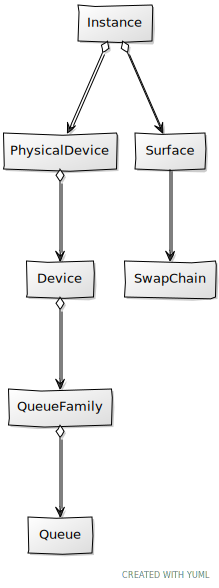
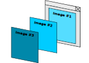
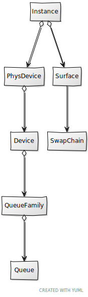

# Chapter 04 - Swap chain

In this chapter we will continue our road to render on the screen. We will describe in detail a concept that has been mentioned in previous chapters, the swap chain.

You can find the complete source code for this chapter [here](../../booksamples/chapter-04).

## Swap chain

If you recall from previous chapters, rendering to the screen is an optional feature in Vulkan. The capability to present rendering results to a surface is provided by the swap chain. A swap chain is basically an array of images that can be use as the destination of render operations and that can be presented on a surface.

As you may already have guessed, swap chain creation will be encapsulated in a class named `SwapChain`. This the class diagram updated.



Let's start with its attributes and the constructor for the `SwapChain` class:

```java
package org.vulkanb.eng.graph.vk;

import org.lwjgl.system.*;
import org.lwjgl.vulkan.*;
import org.tinylog.Logger;
import org.vulkanb.eng.wnd.Window;

import java.nio.*;
import java.util.Arrays;

import static org.lwjgl.vulkan.VK13.*;
import static org.vulkanb.eng.graph.vk.VkUtils.vkCheck;

public class SwapChain {

    private final ImageView[] imageViews;
    private final int numImages;
    private final VkExtent2D swapChainExtent;
    private final long vkSwapChain;

    public SwapChain(Window window, Device device, Surface surface, int requestedImages, boolean vsync) {
        Logger.debug("Creating Vulkan SwapChain");
        try (var stack = MemoryStack.stackPush()) {
            VkSurfaceCapabilitiesKHR surfaceCaps = surface.getSurfaceCaps();

            int reqImages = calcNumImages(surfaceCaps, requestedImages);
            swapChainExtent = calcSwapChainExtent(window, surfaceCaps);

            Surface.SurfaceFormat surfaceFormat = surface.getSurfaceFormat();
            var vkSwapchainCreateInfo = VkSwapchainCreateInfoKHR.calloc(stack)
                    .sType$Default()
                    .surface(surface.getVkSurface())
                    .minImageCount(reqImages)
                    .imageFormat(surfaceFormat.imageFormat())
                    .imageColorSpace(surfaceFormat.colorSpace())
                    .imageExtent(swapChainExtent)
                    .imageArrayLayers(1)
                    .imageUsage(VK_IMAGE_USAGE_COLOR_ATTACHMENT_BIT)
                    .preTransform(surfaceCaps.currentTransform())
                    .compositeAlpha(KHRSurface.VK_COMPOSITE_ALPHA_OPAQUE_BIT_KHR)
                    .clipped(true);
            if (vsync) {
                vkSwapchainCreateInfo.presentMode(KHRSurface.VK_PRESENT_MODE_FIFO_KHR);
            } else {
                vkSwapchainCreateInfo.presentMode(KHRSurface.VK_PRESENT_MODE_IMMEDIATE_KHR);
            }

            LongBuffer lp = stack.mallocLong(1);
            vkCheck(KHRSwapchain.vkCreateSwapchainKHR(device.getVkDevice(), vkSwapchainCreateInfo, null, lp),
                    "Failed to create swap chain");
            vkSwapChain = lp.get(0);

            imageViews = createImageViews(stack, device, vkSwapChain, surfaceFormat.imageFormat());
            numImages = imageViews.length;
        }
    }
    ...
}
```

We will be identifying the purpose of the different arguments of the constructor while we go through the code. The first thing we do to calculate the number of images that our swap chain will have bu calling the `calcNumImages` method. You may be wondering why do we need more than one image? The answer is to increase performance, while an image is being presented, we may be using another one to render the results of the next frame. We need to have several in order to parallelize the tasks and use both the CPU and GPU at their maximum capacity. The most common use cases employ two images (double buffering) or three (triple buffering), as in the figure below.



The figure above represents the triple buffer case. While image #1 is used for presentation we have ready another one, image #2, ready to be presented. In parallel, we are using image #3 for rendering. Triple buffering is commonly used to avoid frame rate dropout, when we cannot guarantee that a frame will be ready between v-syncs (You can read more about this [here](https://github.com/KhronosGroup/Vulkan-Samples/blob/master/samples/performance/swapchain_images/swapchain_images_tutorial.md)).

Our `SwapChain` class constructor has a parameter named `requestedImages` which is used to express the desired number of images our swap chain should have. The `calcNumImages` method tries to accommodate that request to the surface limits defined by the surface capabilities that we obtained at the beginning of the constructor. We will see the definition later on.

The next thing to do in the constructor is to calculate the swp chain extent, width and size of the images that compose it, by calling the `calcSwapChainExtent` method
(we will see it later). We are now ready to create the swap chain by filling up the `VkSwapchainCreateInfoKHR` structure. Let's review the attributes of that structure:

- `surface`: A reference to our surface.
- `minImageCount`: The minimum number of images that this swap chain should use. This is the value that we have got calling the `calcNumImages` method.
- `imageFormat`: The format of the images of this swap chain (for example RGB with 8 bits per channel). 
- `imageColorSpace`: The color space of the images of this swap chain (for example sRGB).
- `imageExtent`: The size (width and height in pixels)  of the images of this swap chain.
- `imageArrayLayers`: The number of views in a multi-view / stereo surface. In our case, since we are not creating a stereoscopic-3D application, this will set to `1`.
- `imageUsage`: Bitmask of `VkImageUsageFlagBits` describing the intended usage of the (acquired) swap chain images. That is, what operations we will be doing with them. In our case we will be rendering these images to the surface, so we will use the `VK_IMAGE_USAGE_COLOR_ATTACHMENT_BIT` flag. That is, we will be outputting colors. There are other usages such as the ones used for depth buffers or for transferring operations.
- `imageSharingMode`: This controls how the images can be accessed from queues. Remember that in Vulkan we will record the render operations to be executed in `CommandBuffer`''s  that will be queued. Those commands will be de-queued for being executed asynchronously. There are two possible modes:
  - `VK_SHARING_MODE_CONCURRENT`: Multiple queue families can access the images concurrently.  
  - `VK_SHARING_MODE_EXCLUSIVE`: Only one queue family can access the images at a time. This is the most performant mode. Since we will be using graphics queue families we will using this mode.
- `preTransform`: Describes the transform, relative to the presentation engine’s natural orientation, applied to the image content prior to presentation (such as rotation of certain angles). In our case, we will use the current transformation mode.
- `compositeAlpha`: Indicates the alpha compositing mode to use when this surface is composited together with other surfaces on certain window systems. In our case we will use the `VK_COMPOSITE_ALPHA_OPAQUE_BIT_KHR` value.  This basically ignores the alpha component when compositing (no transparencies to be used for the surface).
- `clippped`: Specifies whether the Vulkan implementation is allowed to discard rendering operations that affect regions of the surface that are not visible. It is recommended to set this to parameter to `true`.
- `presentMode`: Specifies the presentation mode the Swap chain will use.

Presentation modes need to be explained in detail. Vulkan defines the following presentation modes:

- `VK_PRESENT_MODE_IMMEDIATE_KHR`: The generated images are transferred immediate to the screen without waiting for a vertical blanking period. This may produce tearing in some cases.
- `VK_PRESENT_MODE_FIFO_KHR`: Images are presented when a vertical blanking occurs. Images ready to be presented are internally queued using a FIFO schema (First Int First Out), which means that new images are appended to the end of the queue. This is the only mode that is guaranteed to be supported. If the queue is full, the application blocks. Tearing is not observed in this case.
- `VK_PRESENT_MODE_FIFO_RELAXED_KHR`: Similar to the previous mode. In the case that the queue fills up, the application waits, but the queued images during this waiting period are presented without waiting for the vertical blanking. This may produce tearing in some cases.
- `VK_PRESENT_MODE_MAILBOX_KHR`:  Similar to the `VK_PRESENT_MODE_IMMEDIATE_KHR` mode, but in the case that the queue is full, the last image queued is overwritten by the new one.

In our case, the `Swapchain` class constructor receives a parameter, named `vsync` which we will use to specify if we want to wait for the vertical blanking or not. If `vsync` is true we will use the `VK_PRESENT_MODE_FIFO_KHR`. In this case our frame rate will be, as a maximum, the maximum refresh rate of our screen. If `vsync` is false we will opt for the `VK_PRESENT_MODE_IMMEDIATE_KHR` presentation mode.

With this structure filled-up we can finally create swap chain by invoking the `vkCreateSwapchainKHR` function, where will struct the pointer to the swap chain instance through a
`LongBuffer`. The last step is to create swap chain image views. Prior to analyze that we will start by showing pending methods already used in the constructor.
Let's tart with the definition of the `calcNumImages`:

```java
public class SwapChain {
    ...
    private static int calcNumImages(VkSurfaceCapabilitiesKHR surfCapabilities, int requestedImages) {
        int maxImages = surfCapabilities.maxImageCount();
        int minImages = surfCapabilities.minImageCount();
        int result = minImages;
        if (maxImages != 0) {
            result = Math.min(requestedImages, maxImages);
        }
        result = Math.max(result, minImages);
        Logger.debug("Requested [{}] images, got [{}] images. Surface capabilities, maxImages: [{}], minImages [{}]",
                requestedImages, result, maxImages, minImages);

        return result;
    }
    ...
}
```

The first thing we do is retrieve the minimum and maximum number of images that our surface supports. If we get a value of `0` for the maximum number of images, this means that there is no limit. The rest of the code is basically to try to stick with the requested value if it's within the maximum-minimum range.

Now it is the turn to show the definition of the `calcSwapChainExtent` method:

```java
public class SwapChain {
    ...
    private static VkExtent2D calcSwapChainExtent(Window window, VkSurfaceCapabilitiesKHR surfCapabilities) {
        var result = VkExtent2D.calloc();
        if (surfCapabilities.currentExtent().width() == 0xFFFFFFFF) {
            // Surface size undefined. Set to the window size if within bounds
            int width = Math.min(window.getWidth(), surfCapabilities.maxImageExtent().width());
            width = Math.max(width, surfCapabilities.minImageExtent().width());

            int height = Math.min(window.getHeight(), surfCapabilities.maxImageExtent().height());
            height = Math.max(height, surfCapabilities.minImageExtent().height());

            result.width(width);
            result.height(height);
        } else {
            // Surface already defined, just use that for the swap chain
            result.set(surfCapabilities.currentExtent());
        }
        return result;
    }
    ...
}
```

If the surface has already defined its extent, we pick that. If it is not defined, we try to set the extent to the window size if it is within the ranges of minimum  and maximum supported sizes.

## Swap chain images

We have seen that the last step in `SwapChain` constructor is to create image views. What are image views? We would need images to render to, but in the specific case of
the swap chain these images have already been created when we created the swap chain. Therefore, why not just retrieve them? Why we need image views?
In Vulkan we cannot just use the images, we need an indirect element to access them. This element is called Image View and basically it states how the image will be accessed. Before going on, it is important to precisely define the concepts involved in handling images in Vulkan. In order to have an image that can be accessed by shaders in Vulkan we need:

- A `Buffer` which contains the raw data of the image, its contents. A `Buffer` is just a linear array of data.
- An `Image` which basically defines the metadata associated to the `Buffer`, yo the raw data. That is, the image format, its dimensions, etc.
- An `Image View`, which specifies how we are going to use an image, which parts of that image can be accessed, which format are we going to use, etc.
We could have several views over the same `Image` instance to restrict the range or event to use different formats while using it, making automatic conversions to the
`Image` format. As its name says, it is just a view over the image.

As it has been said before, the images for our swap chain have already been created, we just need to create the associated image views. In next chapters we will need to create
images for textures and, their associated buffers, but right now, we just need image views. 



The definition of the `createImageViews` at method is as follows:

```java
public class SwapChain {
    ...
    private static ImageView[] createImageViews(MemoryStack stack, Device device, long swapChain, int format) {
        IntBuffer ip = stack.mallocInt(1);
        vkCheck(KHRSwapchain.vkGetSwapchainImagesKHR(device.getVkDevice(), swapChain, ip, null),
                "Failed to get number of surface images");
        int numImages = ip.get(0);

        LongBuffer swapChainImages = stack.mallocLong(numImages);
        vkCheck(KHRSwapchain.vkGetSwapchainImagesKHR(device.getVkDevice(), swapChain, ip, swapChainImages),
                "Failed to get surface images");

        var result = new ImageView[numImages];
        var imageViewData = new ImageView.ImageViewData().format(format).aspectMask(VK_IMAGE_ASPECT_COLOR_BIT);
        for (int i = 0; i < numImages; i++) {
            result[i] = new ImageView(device, swapChainImages.get(i), imageViewData);
        }

        return result;
    }
    ...
}
```

The first thing we do is retrieve the **actual** number of images that our swap chain has. But wait, we had already specified this when we created the swap chain, why we do need to retrieve that again? The answer is that we created the swap chain with a desired number of images, but the Vulkan driver may have returned a different number. This is why we need to call the `vkGetSwapchainImagesKHR` function to retrieve the number of images. This is why we used the length of the returned image views to the `numImages` attribute.
After that, we call that same function again to retrieve the handles to the images themselves.
Now we iterate over the images to create new `ImageView` instances. The `ImageView` class encapsulates the creation and disposal of Vulkan image views. Since the parameters to properly set up image views can be quite lengthy, it defines a build helper class, as an inner class, using a fluent like API style. This way we will increase readability of the code that constructs images, and we will be able to add support for new parameters without breaking existing code.

```java
...
public class ImageView {
    ....
    public static class ImageViewData {
        private int aspectMask;
        private int baseArrayLayer;
        private int format;
        private int layerCount;
        private int mipLevels;
        private int viewType;

        public ImageViewData() {
            this.baseArrayLayer = 0;
            this.layerCount = 1;
            this.mipLevels = 1;
            this.viewType = VK_IMAGE_VIEW_TYPE_2D;
        }

        public ImageView.ImageViewData aspectMask(int aspectMask) {
            this.aspectMask = aspectMask;
            return this;
        }

        public ImageView.ImageViewData baseArrayLayer(int baseArrayLayer) {
            this.baseArrayLayer = baseArrayLayer;
            return this;
        }

        public ImageView.ImageViewData format(int format) {
            this.format = format;
            return this;
        }

        public ImageView.ImageViewData layerCount(int layerCount) {
            this.layerCount = layerCount;
            return this;
        }

        public ImageView.ImageViewData mipLevels(int mipLevels) {
            this.mipLevels = mipLevels;
            return this;
        }

        public ImageView.ImageViewData viewType(int viewType) {
            this.viewType = viewType;
            return this;
        }
    }
    ...
}
```

You will see how all these parameters in the constructor of the `ImageView` class.
```java
...
public class ImageView {
	
    private final int aspectMask;
    private final int mipLevels;
    private final long vkImage;
    private final long vkImageView;

    public ImageView(Device device, long vkImage, ImageViewData imageViewData) {
        this.aspectMask = imageViewData.aspectMask;
        this.mipLevels = imageViewData.mipLevels;
        this.vkImage = vkImage;
        try (var stack = MemoryStack.stackPush()) {
            LongBuffer lp = stack.mallocLong(1);
            var viewCreateInfo = VkImageViewCreateInfo.calloc(stack)
                    .sType$Default()
                    .image(vkImage)
                    .viewType(imageViewData.viewType)
                    .format(imageViewData.format)
                    .subresourceRange(it -> it
                            .aspectMask(aspectMask)
                            .baseMipLevel(0)
                            .levelCount(mipLevels)
                            .baseArrayLayer(imageViewData.baseArrayLayer)
                            .layerCount(imageViewData.layerCount));

            vkCheck(vkCreateImageView(device.getVkDevice(), viewCreateInfo, null, lp),
                    "Failed to create image view");
            vkImageView = lp.get(0);
        }
    }
    ...
}
```

In order to create a Image View we need to fill up a `VkImageViewCreateInfo` structure. This structure is defined by the following attributes:

- `image`: A reference to the image handle that this view refers to. In our case it will be one of the swap chain images.
- `viewType`: The type of image view. In our case they will be 2D images.
- `format`: The format of the image. In this case we just use the format of the underlying swap chain images.
- `subresourceRange`: This parameter allow us to select a specific range of the underlying image. We can select a specific set of mipmap levels or layers (in the case of array of layers). In this case, we can control the maximum mipmap level (through the `mipLevels`argument), and we stick to 1 layer. Regarding the aspects, for this specific case, we will get the color aspect (for example there are some other aspect for depth images).

With the `VkImageViewCreateInfo` structure filled up, we just need to call the `vkCreateImageView` to get a handle to the Image View. The rest of the class is just some *getters* to access main attributes and the `cleanup` method to free the resources.

```java
...
public class ImageView {
    ...
    public void cleanup(Device device) {
        vkDestroyImageView(device.getVkDevice(), vkImageView, null);
    }

    public int getAspectMask() {
        return aspectMask;
    }

    public int getMipLevels() {
        return mipLevels;
    }

    public long getVkImageView() {
        return vkImageView;
    }
    ...
}
```

Going back to the `Swapchain` class we need also to create a `cleanup` method to free the resources and some other *getters*:
```java
public class SwapChain {
    ...
    public void cleanup(Device device) {
        Logger.debug("Destroying Vulkan SwapChain");
        swapChainExtent.free();
        Arrays.asList(imageViews).forEach(i -> i.cleanup(device));
        KHRSwapchain.vkDestroySwapchainKHR(device.getVkDevice(), vkSwapChain, null);
    }

    public long getVkImage() {
        return vkImage;
    }

    public ImageView getImageView(int pos) {
        return imageViews[pos];
    }

    public int getNumImages() {
        return numImages;
    }

    public VkExtent2D getSwapChainExtent() {
        return swapChainExtent;
    }
}
```

Now we can use the `Swapchain` class in our `VkCtx`class:

```java
public class VkCtx {
    ...
    private SwapChain swapChain;

    public VkCtx(Window window) {
        ...
        swapChain = new SwapChain(window, device, surface, engCfg.getRequestedImages(), engCfg.getVSync());
        ...
    }

    public void cleanup() {
        swapChain.cleanup(device);
        ...
    }
    ...
}
```

We have also modified also the `EngineProperties` class to read a new property to configure the usage of vsync and to define the requested number of images for the swap chain:

```java
public class EngCfg {
    ...
    private int requestedImages;
    ...
    private boolean vSync;
    ...
    private EngCfg() {
            ...
            requestedImages = Integer.parseInt(props.getOrDefault("requestedImages", 3).toString());
            vSync = Boolean.parseBoolean(props.getOrDefault("vsync", true).toString());
            ...
    }
    ...
    public int getRequestedImages() {
        return requestedImages;
    }
    ...
    public boolean getVSync() {
        return vSync;
    }
    ...
}        
```

Don't forget to add the changes in the `eng.properties` file:

```
...
requestedImages=3
...
vsync=true
...
```

Ant that is all by now, we are still getting a plain white window, but soon we will be able to render something.

[Next chapter](../chapter-05/chapter-05.md)