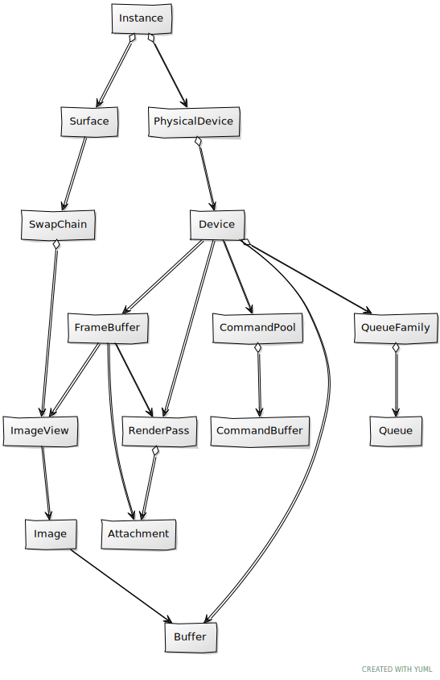

# Clearing the screen

In this chapter we will introduce new concepts that are required to render a scene to the screen. We will finally combine all these new concepts with the elements described in previous chapters to clear the screen. Therefore, it is crucial to understand all of them and how are they related in order to be able to progress in the book.

You can find the complete source code for this chapter [here](../../booksamples/chapter-05).

## Render pass

So let's start by defining what is a render pass. A render pass is the way used by Vulkan to precisely define how rendering should be done. In order to render anything, we need a to know in advance a set of things such as where we will be rendering to (that is, the target which can be an image, a depth buffer, etc.), the inputs we are going to use and what we will do with the outputs after rendering is complete. This is all specified in a render pass. A render pass can also have subpasses and we can establish definition between them. A render pass shall always contain at least one subpass. 

We will first review the structures required to create a render pass, so we can get a more precise knowledge about what is this all about. As you can imagine at this stage, in order to create a render pass, we need to fill up a structure with the creation information. This structure is named `VkRenderPassCreateInfo`. This structure requires us to fill up three main attributes:

- A list of attachments.
- A list of subpasses.
- A list of dependencies between subpasses.

But what are these attributes? Let's first start with attachments. Attachments can be of two types: input attachments and output attachments. Output attachments are essentially images which we use to render into. Input attachments are data sources that can be used while rendering (they are not textures, they are usually the output of a previous stage). For example, when using deferred rendering, you will first render several aspects of the scene to different attachments (outputs) such as the albedo, material properties, etc. After that, you will use that data as input attachments to render the final scene, which will be the output attachment (another image).

As it has been said before, render passes are composed of subpasses. Each subpass defines what will be used as an input and as an ouput. We can also establish dependencies between the subpasses, which basically let us specify how transitions between subpasses should be done. That is, if a subpass needs the result of the previous subpass we can define the synchronization mechanisms required for that transition. Let's see how is all works together in the source code.

We will encapsulate render pass creation which will use as an output  the `SwapChain` images in a new class named `SwapChainRenderPass`. The constructor starts like this:

```java
public SwapChainRenderPass(SwapChain swapChain) {
    this.swapChain = swapChain;

    try (MemoryStack stack = MemoryStack.stackPush()) {
        VkAttachmentDescription.Buffer attachments = VkAttachmentDescription.callocStack(1, stack);

        // Color attachment
        attachments.get(0)
                .format(swapChain.getSurfaceFormat().imageFormat())
                .samples(VK_SAMPLE_COUNT_1_BIT)
                .loadOp(VK_ATTACHMENT_LOAD_OP_CLEAR)
                .storeOp(VK_ATTACHMENT_STORE_OP_STORE)
                .initialLayout(VK_IMAGE_LAYOUT_UNDEFINED)
                .finalLayout(KHRSwapchain.VK_IMAGE_LAYOUT_PRESENT_SRC_KHR);
```

The class receives as a parameter a `SwapChain` instance, and it first allocates space for describing the render pass attachments using a `Buffer` of `VkAttachmentDescription` structures. In this specific case, we will only be rendering color information to the already created `SwapChain` images, so we just need one attachment. Once the space has been allocated, we can start filling up the structures (single one in this case), by setting up the following attributes:

- `format`: Specifies the format of the image to be used. In our case, it should match the format of the images of the `SwapChain`.
- `samples`: The number of the samples of the image, in our case, just one bit.
- `loadOp`: Specifies what will happen to the contents of this attachment when the subpass where it is used starts. In our case we want to clear the contents so we use the `VK_ATTACHMENT_LOAD_OP_CLEAR` value. Other possible values are `VK_ATTACHMENT_LOAD_OP_LOAD` to preserve the contents of the attachment (from a previous pass) or `VK_ATTACHMENT_LOAD_OP_DONT_CARE` if just simply don't care (for example, we may be sure that we are going to fill up again the attachment contents and we do not want to waste tim ein clearing it).
- `storeOp`: Specifies what will happen to the contents of this attachment when subpass where it is used finishes. In our case, we want the contents to be presented on the screen so we want to preserve them so we use the `VK_ATTACHMENT_STORE_OP_STORE`. Another option is to use the `VK_ATTACHMENT_STORE_OP_DONT_CARE` value if we just simply don`t care.
- `initialLayout`: It specifies what should be the layout of the image of this attachment when the subpass where it is used starts. But what is an image layout? Images can be used for many different purposes, they can be used to render into them, to use them as samplers for textures, or in copy operations. Each of these purposes require a different layout in memory. Therefore,  when setting up the layout we need to check that is compatible with the usage that it s going to have. We will explain this in more detail later on. By now, in this the case, we don't care about the image initial layout since we are clearing the attachment, so we just set it to: `VK_IMAGE_LAYOUT_UNDEFINED`.
- `finalLayout`:  It specifies the layout of the image of the image of this attachment when the subpass where it is used finished. In this case, when we are done with rendering we want it to be presented, so the desired `finalLayout` is `VK_IMAGE_LAYOUT_PRESENT_SRC_KHR`.  Any swap chain image must be in that state before presenting it.
  As you can see we are not linking the attachment description to a specific `SwapChain` image. We are just defining the properties of the attachment. The link to those resources will be done later on using a `FrameBuffer`.

Let's go back to the `SwapChainRenderPass` constructor, the next thing we will do is to create the render sub pass:

```java
        VkAttachmentReference.Buffer colorReference = VkAttachmentReference.callocStack(1, stack)
            .attachment(0)    
            .layout(VK_IMAGE_LAYOUT_COLOR_ATTACHMENT_OPTIMAL);

        VkSubpassDescription.Buffer subPass = VkSubpassDescription.calloc(1)
                .pipelineBindPoint(VK_PIPELINE_BIND_POINT_GRAPHICS)
                .colorAttachmentCount(colorReference.remaining())
                .pColorAttachments(colorReference);
```

We allocate a `Buffer` of `VkAttachmentReference` structures to define the color attachments that we are going to use. In our case, we are using a single attachment which is also a color attachment, so we just need to allocate space for one structure. The attachments described in the `VkAttachmentDescription.Buffer` constitute the whole set of attachments that will be used in the whole render pass. Here we will reference the ones that will be used for this subpass using their index (their position) in the `VkAttachmentDescription.Buffer`. Since we only have one attachment, the `attachment` property is set to `0` (the attachment that occupies the position `0` in the global `VkAttachmentDescription.Buffer`). In  addition to selecting the attachment, we need to set up the layout used during the subpass. Don't confuse this layout with the initial and final layouts that we were talking above, this layout will be used when this specific subpass is started. The associated attachment image will be transitioned automatically to that layout when the subpass starts. We have a color attachment here, so the most appropriate layout will be `VK_IMAGE_LAYOUT_COLOR_ATTACHMENT_OPTIMAL`. 

With that information we are ready to complete the definition of the subpass, by filling up a `Buffer` of `VkSubpassDescription` structures. A subpass defines the color, depth resolve and in output attachments. In our case we are only dealing with one output color attachments which is referenced by the `pcolorAttachments` property. We set up also the `pipelineBindPoint` to  `VK_PIPELINE_BIND_POINT_GRAPHICS` since we are using this subpass to render graphics.

Now we can create the render pass and finish the constructor:

```java
        VkRenderPassCreateInfo renderPassInfo = VkRenderPassCreateInfo.calloc()
                .sType(VK_STRUCTURE_TYPE_RENDER_PASS_CREATE_INFO)
                .pAttachments(attachments)
                .pSubpasses(subPass);

        LongBuffer lp = stack.mallocLong(1);
        vkCheck(vkCreateRenderPass(swapChain.getDevice().getVkDevice(), renderPassInfo, null, lp),
             "Failed to create render pass");
        this.vkRenderPass = lp.get(0);
    }
}
```

As in most of other cases, we need to setup a creation information structure, named `VkRenderPassCreateInfo` in this case where we reference the whole set of attachments (color, depth, etc.) and the subpasses. With that structure we create the render pass by invoking the `vkCreateRenderPass` function and store the handle. Finally, we add a `cleanUp` method to release resources and another one to get the render pass handle:

```java
public void cleanUp() {
    vkDestroyRenderPass(this.swapChain.getDevice().getVkDevice(), this.vkRenderPass, null);
}

public long getVkRenderPass() {
    return this.vkRenderPass;
}
```


## Framebuffer

Taking back from previous section, we have just set up the render pass and described the attachments that will be part of it. The attachments will be the swap chain images, but we still have not linked those attachment descriptors with the specific resources (the swap chain images). The glue will do the link is another construct named Framebuffer. A Framebuffer is nothing more than the collection of the specific attachments that a render pass can use (Remember that previously we just described them). As in the previous cases, we will encapsulate the code used for that under a new class named `FrameBuffer`, which is defined like this:

```java
package org.vulkanb.eng.graph.vk;

import org.lwjgl.system.MemoryStack;
import org.lwjgl.vulkan.VkFramebufferCreateInfo;

import java.nio.LongBuffer;

import static org.lwjgl.vulkan.VK10.*;
import static org.vulkanb.eng.graph.vk.VulkanUtils.vkCheck;

public class FrameBuffer {
    private Device device;
    private long vkFrameBuffer;

    public FrameBuffer(Device device, int width, int height, LongBuffer pAttachments, long renderPass) {
        this.device = device;
        try (MemoryStack stack = MemoryStack.stackPush()) {
            VkFramebufferCreateInfo fci = VkFramebufferCreateInfo.callocStack(stack)
                    .sType(VK_STRUCTURE_TYPE_FRAMEBUFFER_CREATE_INFO)
                    .pAttachments(pAttachments)
                    .width(width)
                    .height(height)
                    .layers(1)
                    .renderPass(renderPass);

            LongBuffer lp = stack.mallocLong(1);
            vkCheck(vkCreateFramebuffer(device.getVkDevice(), fci, null, lp),
                    "Failed to create FrameBuffer");
            this.vkFrameBuffer = lp.get(0);
        }
    }

    public void cleanUp() {
        vkDestroyFramebuffer(this.device.getVkDevice(), this.vkFrameBuffer, null);
    }

    public long getVkFrameBuffer() {
        return this.vkFrameBuffer;
    }

}
```

In the constructor, we setup an initialization structure named `VkFramebufferCreateInfo`, in which we set the height and with of the attachments and the attachments themselves. We will see later on, but these attachments will hold the handles of the `SwapChain` images. We also need to include a reference to the render pass. This is how the render pass and the real attachments are linked together. The class is completed with a `cleanUp` method to release resources and another one to get the Framebuffer handle.


## Command Buffers

When we talked about queues we already mentioned that in Vulkan, work is submitted by recording commands (stored in a command buffer), and submitting them to a queue.  It is time now to implement the support for these elements. Command buffers new to be instantiated through a command pool. Therefore, let's encapsulate Command pool creation in a class named `CommandPool`. It's definition is quite simple:

```java
package org.vulkanb.eng.graph.vk;

import org.apache.logging.log4j.LogManager;
import org.apache.logging.log4j.Logger;
import org.lwjgl.system.MemoryStack;
import org.lwjgl.vulkan.VkCommandPoolCreateInfo;

import java.nio.LongBuffer;

import static org.lwjgl.vulkan.VK10.*;
import static org.vulkanb.eng.graph.vk.VulkanUtils.vkCheck;

public class CommandPool {
    private static final Logger LOGGER = LogManager.getLogger();
    private Device device;
    private long vkCommandPool;

    public CommandPool(Device device, int queueFamilyIndex) {
        LOGGER.debug("Creating Vulkan CommandPool");

        this.device = device;
        try (MemoryStack stack = MemoryStack.stackPush()) {
            VkCommandPoolCreateInfo cmdPoolInfo = VkCommandPoolCreateInfo.callocStack(stack)
                    .sType(VK_STRUCTURE_TYPE_COMMAND_POOL_CREATE_INFO)
                    .flags(VK_COMMAND_POOL_CREATE_RESET_COMMAND_BUFFER_BIT)
                    .queueFamilyIndex(queueFamilyIndex);

            LongBuffer lp = stack.mallocLong(1);
            vkCheck(vkCreateCommandPool(device.getVkDevice(), cmdPoolInfo, null, lp),
                    "Failed to create command pool");

            this.vkCommandPool = lp.get(0);
        }
    }

    public void cleanUp() {
        vkDestroyCommandPool(this.device.getVkDevice(), this.vkCommandPool, null);
    }

    public Device getDevice() {
        return this.device;
    }

    public long getVkCommandPool() {
        return this.vkCommandPool;
    }
}
```

Creating a command pool is pretty straightforward, we just set up an initialization structure, named `VkCommandPoolCreateInfo` which has the following main parameters:

- `flags`:  Specifies the behavior of the command pool. In our case we use the `VK_COMMAND_POOL_CREATE_RESET_COMMAND_BUFFER_BIT` which indicates that the commands can be reset individually. Resetting allows reusing command buffers after they have been recorded. This allows us to re-record them. If this is not enabled, we would need to create new commands and free the ones that could not be reused any more.
- `queueFamilyIndex`: Selects the queue family index where the commands created in this pool can be submitted to. 

The rest of the methods of the class, as usual, are a `cleanUp` method to release resources, a utility method to get access to the device and another one to get the command pool handle.

Now that are able to create command pools, let's review the class that will allow us to instantiate command buffers, which as you can image it's named `CommandBuffer`. This is the constructor code:

```java
public CommandBuffer(CommandPool commandPool, boolean primary, boolean oneTimeSubmit) {
    LOGGER.trace("Creating command buffer");
    this.commandPool = commandPool;
    this.oneTimeSubmit = oneTimeSubmit;
    VkDevice vkDevice = this.commandPool.getDevice().getVkDevice();

    try (MemoryStack stack = MemoryStack.stackPush()) {
       VkCommandBufferAllocateInfo cmdBufAllocateInfo = VkCommandBufferAllocateInfo.calloc()
                .sType(VK_STRUCTURE_TYPE_COMMAND_BUFFER_ALLOCATE_INFO)
                .commandPool(commandPool.getVkCommandPool())
                .level(primary ? VK_COMMAND_BUFFER_LEVEL_PRIMARY : VK_COMMAND_BUFFER_LEVEL_SECONDARY)
                .commandBufferCount(1);
        PointerBuffer pb = stack.mallocPointer(1);
        vkCheck(vkAllocateCommandBuffers(vkDevice, cmdBufAllocateInfo, pb),
                "Failed to allocate render command buffer");

        this.vkCommandBuffer = new VkCommandBuffer(pb.get(0), vkDevice);
    }
}
```

The constructor receives, as it first parameter, the command pool where this command buffer will be allocated to. The second parameter specifies if it is a primary or a secondary command buffer. Primary command buffers are submitted to queues for their execution and can contain several secondary command buffers. Secondary command buffers cannot be submitted directly to a queue, they always need to be included into a primary buffer. A use case for secondary buffers is command reuse. With secondary command buffers we can record some commands that may be shared between multiple primary command buffers. This way we can define "fixed" commands into secondary command buffers and combine them in primary buffers with other varying commands, reducing the workload. Keep in mind that you should not use too many secondary buffers, since they may affect performance. Use them with care. Finally, the last parameter is a `boolean` that indicates if the command buffer recordings will be submitted just once or if they can be submitted multiple times (we will see later on what this implies). We need to fill a structure named `VkCommandBufferAllocateInfo`. The parameters are:

- `commandPool`: Handle to the command pool which will be used to allocate the command buffer.
- `level`: Indicates the level of the command buffer (primary or secondary).
- `commandBufferCount`: The number of command buffers to allocate.

To finalize the constructor, once that structure is being set, we allocate the command buffer by creating a new `VkCommandBuffer` instance.
The next method of the `CommandBuffer` class, named `beginRecording`, should be invoked when we want to start recording for that command buffer:

```java
public void beginRecording() {
    try (MemoryStack stack = MemoryStack.stackPush()) {
        VkCommandBufferBeginInfo cmdBufInfo = VkCommandBufferBeginInfo.callocStack(stack)
                .sType(VK_STRUCTURE_TYPE_COMMAND_BUFFER_BEGIN_INFO);
        if (this.oneTimeSubmit) {
            cmdBufInfo.flags(VK_COMMAND_BUFFER_USAGE_ONE_TIME_SUBMIT_BIT);
        }
        vkCheck(vkBeginCommandBuffer(this.vkCommandBuffer, cmdBufInfo), "Failed to begin command buffer");
    }
}
```

To start recording we need to create a `VkCommandBufferBeginInfo` structure and invoke the `vkBeginCommandBuffer` function. If we are submitting a short lived command, we can signal that using the flag `VK_COMMAND_BUFFER_USAGE_ONE_TIME_SUBMIT_BIT`. In this case, the driver may not try to optimize that command buffer since it will only be used one time. The next methods are the usual `cleanUp` for releasing resources, to finalize the recording and another one to get the command buffer Vulkan instance.

```java
public void cleanUp() {
    LOGGER.trace("Destroying command buffer");
    vkFreeCommandBuffers(this.commandPool.getDevice().getVkDevice(), this.commandPool.getVkCommandPool(),
            this.vkCommandBuffer);
}

public void endRecording() {
    vkCheck(vkEndCommandBuffer(this.vkCommandBuffer), "Failed to end command buffer");
}

public VkCommandBuffer getVkCommandBuffer() {
    return this.vkCommandBuffer;
}
```

The last method of the `CommandBuffer` class will be used to reset the command Buffer. That is, to throw up all the previously recorded commands (stored in that buffer) so can start recording again. Resetting is a good approach if your recordings change from frame to frame and you do not want to create a new command buffer every time.

```java
public void reset() {
    vkResetCommandBuffer(this.vkCommandBuffer, VK_COMMAND_BUFFER_RESET_RELEASE_RESOURCES_BIT);
}
```

The `CommandBuffer` class is now complete, but, one very important concept to remember is that any recorded draw operation can only happen inside a render pass. We will see later on how this can be done. However, this fact is another reason to use secondary command buffers, they can be recorded independently of any render pass, and thus, the can be reused in multiple primary command buffers.



## Synchronization

We are getting closer to render something on the screen, but prior to that, we need to address a fundamental topic in Vulkan: synchronization. In Vulkan we will be in charge of properly control the synchronization of the resources. This imposes certain complexity but allows us to have a full control about how operations will be done. In this section we well address two main mechanisms involved in Vulkan synchronization: semaphores and fences. There are some other elements such as barriers or events but since they are not required at this moment we will not develop the code for them. 

Fences are the mechanisms used in Vulkan to synchronize operations between the GPU and the CPU (our application). Semaphores are used to synchronize operations inside the GPU (GPU to GPU synchronization), and are frequently used to synchronize queue submissions. These elements are used to block the execution until a signal is performed. Once a signal is received  execution is resumed. It is important to note, that signalling is always done in the GPU side. In the case of fences, our application can block (waiting in the CPU) until the GPU signals that execution can go on, but we cannot trigger the signalling from the CPU. In the case of semaphores, since they are internal to the GPU, waiting can only happen in the GPU.

Before using these elements, we will define some classes to manage them. We will firs start with the `Semaphore` class:

```java
package org.vulkanb.eng.graph.vk;

import org.lwjgl.system.MemoryStack;
import org.lwjgl.vulkan.VkSemaphoreCreateInfo;

import java.nio.LongBuffer;

import static org.lwjgl.vulkan.VK10.*;
import static org.vulkanb.eng.graph.vk.VulkanUtils.vkCheck;

public class Semaphore {

    private Device device;
    private long vkSemaphore;

    public Semaphore(Device device) {
        this.device = device;
        try (MemoryStack stack = MemoryStack.stackPush()) {
            VkSemaphoreCreateInfo semaphoreCreateInfo = VkSemaphoreCreateInfo.callocStack(stack)
                    .sType(VK_STRUCTURE_TYPE_SEMAPHORE_CREATE_INFO);

            LongBuffer lp = stack.mallocLong(1);
            vkCheck(vkCreateSemaphore(device.getVkDevice(), semaphoreCreateInfo, null, lp),
                    "Failed to create semaphore");
            this.vkSemaphore = lp.get(0);
        }
    }

    public void cleanUp() {
        vkDestroySemaphore(this.device.getVkDevice(), this.vkSemaphore, null);
    }

    public long getVkSemaphore() {
        return this.vkSemaphore;
    }
}
```

In this case we are modelling what is called a binary semaphore, which can be in two states: signaled and signaled. Usually the GPUs signals the end of operations where other activities are waiting to complete. We say that these activities are waiting for the semaphore to be signaled. Creating a semaphore is easy, just define a `VkSemaphoreCreateInfo`  and call the `vkCreateSemaphore` function. The rest of the methods are the usual ones, one for cleaning up the resources and another one to get the semaphore handle.

Now it's turn for the `Fence`class:

```java
package org.vulkanb.eng.graph.vk;

import org.lwjgl.system.MemoryStack;
import org.lwjgl.vulkan.VkFenceCreateInfo;

import java.nio.LongBuffer;

import static org.lwjgl.vulkan.VK10.*;
import static org.vulkanb.eng.graph.vk.VulkanUtils.vkCheck;

public class Fence {

    private Device device;
    private long vkFence;

    public Fence(Device device) {
        this.device = device;
        try (MemoryStack stack = MemoryStack.stackPush()) {
            VkFenceCreateInfo fenceCreateInfo = VkFenceCreateInfo.callocStack(stack)
                    .sType(VK_STRUCTURE_TYPE_FENCE_CREATE_INFO)
                    .flags(VK_FENCE_CREATE_SIGNALED_BIT);

            LongBuffer lp = stack.mallocLong(1);
            vkCheck(vkCreateFence(device.getVkDevice(), fenceCreateInfo, null, lp),
                    "Failed to create semaphore");
            this.vkFence = lp.get(0);
        }
    }

    public void cleanUp() {
        vkDestroyFence(this.device.getVkDevice(), this.vkFence, null);
    }

    public void fenceWait() {
        vkWaitForFences(this.device.getVkDevice(), this.vkFence, true, Long.MAX_VALUE);
    }

    public long getVkFence() {
        return this.vkFence;
    }

    public void reset() {
        vkResetFences(this.device.getVkDevice(), this.vkFence);
    }

}
```

As in the `Semaphore` class, the `Fence` class is also very simple. We also need to fill up an initialization structure named `VkFenceCreateInfo`. In this case, we can set (through a constructor argument), if the fence should be already signaled when created or not. Besides the cleaning method and the one for getting the handle we have one method called `fenceWait` which waits waits for the fence to be signaled (waits in the CPU the signal raised by the GPU). We have another one named `reset` which resets the fence to unsignaled state by calling the `vkResetFences` function.


## Putting it all up together

The next figure shows how a typical render loop looks like.


The first step is optional, depending on your case you can pre-record your commands once and use them in your render loop. However, if your scene is complex and the commands may change, it is acceptable to record them in the render loop (you can optimize this by reusing secondary command buffers or using several threads). Then, we need to acquire the swap chain image that we are going to use, submit the previous recorded commands and finally present the image. To encapsulate the forward rendering tasks we will create a new class named `ForwardRenderActivity`. This class will handle the commands required to perform forward rendering and the frame buffer management. Before, going into this class definition let's see how the `Render` class should be modified to start using all the concepts defined above, specially and how the render loop will look like.

```java
public class Render {
    ...
    private CommandPool commandPool;
    ...
    private Queue.PresentQueue presentQueue;
    ..
    private ForwardRenderActivity fwdRenderActivity;

    public void cleanUp() {
        this.presentQueue.waitIdle();
        ...
        this.fwdRenderActivity.cleanUp();
        this.commandPool.cleanUp();
        ...
    }

    public void init(Window window) {
        ...
        this.presentQueue = new Queue.PresentQueue(this.device, this.surface, 0);
        ...
        this.commandPool = new CommandPool(this.device, this.graphQueue.getQueueFamilyIndex());
        this.fwdRenderActivity = new ForwardRenderActivity(this.swapChain, this.commandPool);
    }
```

As you can see, in the `init` method, we create a `CommandPool` instance which will be used to allocate all the command buffers. We also create a new instance of the `ForwardRenderActivity` class. These new resources are also freed in the `cleanUp` method as usual. We also create another queue which will be used to en-queue the swap chain images which are ready to be presented. For this queue we use a specific queue family which is used just for presentation. This is the definition of the `Queue.PresentQueue` (very similar to the `GraphicsQueue`):

```java
public static class PresentQueue extends Queue {

    public PresentQueue(Device device, Surface surface, int queueIndex) {
        super(device, getPresentQueueFamilyIndex(device, surface), queueIndex);
    }

    private static int getPresentQueueFamilyIndex(Device device, Surface surface) {
        int index = -1;
        try (MemoryStack stack = MemoryStack.stackPush()) {
            PhysicalDevice physicalDevice = device.getPhysicalDevice();
            VkQueueFamilyProperties.Buffer queuePropsBuff = physicalDevice.getVkQueueFamilyProps();
            int numQueuesFamilies = queuePropsBuff.capacity();
            IntBuffer intBuff = stack.mallocInt(1);
            for (int i = 0; i < numQueuesFamilies; i++) {
                VkQueueFamilyProperties props = queuePropsBuff.get(i);
                KHRSurface.vkGetPhysicalDeviceSurfaceSupportKHR(physicalDevice.getVkPhysicalDevice(),
                        i, surface.getVkSurface(), intBuff);
                boolean supportsPresentation = intBuff.get(0) == VK_TRUE;
                if (supportsPresentation) {
                    index = i;
                    break;
                }
            }
        }

        if (index < 0) {
            throw new RuntimeException("Failed to get Presentation Queue family index");
        }
        return index;
    }
}
```

We could the same queue used to submit graphics commands, in that case we would need to check for both graphics and presentation capabilities. Let's get back to the `Render` class and review the the definition of the `render` method:

```java
public void render(Window window, Scene scene) {
    this.swapChain.acquireNextImage();

    this.fwdRenderActivity.submit(this.presentQueue);

    this.swapChain.presentImage(this.graphQueue);
}
```

As you can see it matches the render loop figure presented above. The `SwapChain` class defines two new methods to acquire and present the used images. Let's review the changes of this class. First of all, in the constructor we create as many semaphores as images we have for the swap chain:

```java
...
private int currentFrame;
private SyncSemaphores[] syncSemaphoresList;
...

public SwapChain(Device device, Surface surface, Window window, int requestedImages, boolean vsync) {
    ...
        this.syncSemaphoresList = new SyncSemaphores[numImages];
        for (int i = 0; i < numImages; i++) {
            this.syncSemaphoresList[i] = new SyncSemaphores(new Semaphore(device), new Semaphore(device));
        }
        this.currentFrame = 0;
    }
}
```

We create to types of semaphores:

- `imgAcquisitionSemaphores`: They will be used to signal image acquisition.

- `renderCompleteSemaphores`: They will be used to signal that the command submitted have been completed. 
  These semaphores are stored together under a record:
  
  ```java
  public record SyncSemaphores(Semaphore imgAcquisitionSemaphores, Semaphore renderCompleteSemaphores) {
  }
  ```
  
  But, why we need one semaphore per swap chain image? Because we need to be properly signaled when an image is freed an not being presented. Besides that, we have defined a new attribute named `currentFrame` that will be used to store the image index that should be used for acquisition. When acquired it should be read as the image index currently acquired. Let's review the new method for image acquisition named `acquireNextImage`:
  
  ```java
  public boolean acquireNextImage() {
    boolean resize = false;
    try (MemoryStack stack = MemoryStack.stackPush()) {
        IntBuffer ip = stack.mallocInt(1);
        int err = KHRSwapchain.vkAcquireNextImageKHR(this.device.getVkDevice(), this.vkSwapChain, ~0L,
                this.syncSemaphoresList[currentFrame].imgAcquisitionSemaphores().getVkSemaphore(), MemoryUtil.NULL, ip);
        if (err == KHRSwapchain.VK_ERROR_OUT_OF_DATE_KHR) {
            resize = true;
        } else if (err == KHRSwapchain.VK_SUBOPTIMAL_KHR) {
            // Not optimal but swapchain can still be used
        } else if (err != VK_SUCCESS) {
            throw new RuntimeException("Failed to acquire image: " + err);
        }
        this.currentFrame = ip.get(0);
    }
  
    return resize;
  }
  ```
  
  In order to acquire a image we need to call the function `vkAcquireNextImageKHR`. The parameters for this function are:

- `device`: The handle to the Vulkan logical device. 

- `swapchain`: The handle to the Vulkan swap chain.

- `timeout`: It specifies the maximum time to get blocked in this call (in nanoseconds). If the value is greater than `0` and we are not able to get an image in that time, we will get a `VK_TIMEOUT` error. In our case, we just want to block indefinitely. 

- `semaphore`: If it is not a null handle (`VK_NULL_HANDLE`) it must point to a valid semaphore. The semaphore will be signaled when the GPU is done with the acquired image.

- `fence`: The purpose is the same as in the `semaphore` attribute but using a `Fence`.  In our case we do not need this type of synchronization so we just pass a null.

- `pImageIndex`: It is a return value attribute, It contains the index of the image acquired.

The function can return different error values, but we are interested in a specific value: `VK_ERROR_OUT_OF_DATE_KHR`. If this value is returned, it means that the window has been resized. If so, we need to handle that and recreate some resources. By now, we will not be defining the code for detecting that event, and we will return if resizing is required in the `acquireNextImage` method.

Let's review the new method for image presentation named `presentImage`:

```java
public boolean presentImage(Queue queue) {
    boolean resize = false;
    try (MemoryStack stack = MemoryStack.stackPush()) {
        VkPresentInfoKHR present = VkPresentInfoKHR.callocStack(stack)
                .sType(KHRSwapchain.VK_STRUCTURE_TYPE_PRESENT_INFO_KHR)
                .pWaitSemaphores(stack.longs(
                        this.syncSemaphoresList[this.currentFrame].renderCompleteSemaphores().getVkSemaphore()))
                .swapchainCount(1)
                .pSwapchains(stack.longs(this.vkSwapChain))
                .pImageIndices(stack.ints(this.currentFrame));

        int err = KHRSwapchain.vkQueuePresentKHR(queue.getVkQueue(), present);
        if (err == KHRSwapchain.VK_ERROR_OUT_OF_DATE_KHR) {
            resize = true;
        } else if (err == KHRSwapchain.VK_SUBOPTIMAL_KHR) {
            // Not optimal but swap chain can still be used
        } else if (err != VK_SUCCESS) {
            throw new RuntimeException("Failed to present KHR: " + err);
        }
    }
    this.currentFrame = (this.currentFrame + 1) % this.imageViews.length;
    return resize;
}
```

In order to present an image we need to call the `vkQueuePresentKHR` which receives  two parameters:

- `queue`: The queue to be used to enqueue the image to the presentation engine.
- `pPresentInfo`: A `VkPresentInfoKHR` structure with the information for presenting the image.

The `VkPresentInfoKHR` structure can be used to present more than one image. In this case we will be presenting just once at a time. The `pWaitSemaphores` will hold the list of semaphores that will be used to wait to present the images. Remember that this structure can refer to more than one image. In our case, is the same semaphore that we used for acquiring the image. The rest of attributes refer to the swap chain Vulkan handle and the indices of the images to be presented. As in the case of acquiring the image, if the window has been resize we will get an error: `VK_ERROR_OUT_OF_DATE_KHR`. By now, we just return true if the window has been resized. At the end of the `presentImage`, we advance the index of the next image to be acquired. 

We are almost there, I promise, it is turn now to review code of the `ForwardRenderActivity` class. Let's start with its constructor:

```java
public ForwardRenderActivity(SwapChain swapChain, CommandPool commandPool) {
    this.swapChain = swapChain;
    try (MemoryStack stack = MemoryStack.stackPush()) {
        Device device = swapChain.getDevice();
        VkExtent2D swapChainExtent = swapChain.getSwapChainExtent();
        ImageView[] imageViews = swapChain.getImageViews();
        int numImages = imageViews.length;

        this.renderPass = new SwapChainRenderPass(swapChain);

        LongBuffer pAttachments = stack.mallocLong(1);
        this.frameBuffers = new FrameBuffer[numImages];
        for (int i = 0; i < numImages; i++) {
            pAttachments.put(0, imageViews[i].getVkImageView());
            this.frameBuffers[i] = new FrameBuffer(device, swapChainExtent.width(), swapChainExtent.height(),
                    pAttachments, this.renderPass.getVkRenderPass());
        }

        this.commandBuffers = new CommandBuffer[numImages];
        this.fences = new Fence[numImages];
        for (int i = 0; i < numImages; i++) {
            this.commandBuffers[i] = new CommandBuffer(commandPool, true, false);
            this.fences[i] = new Fence(device, true);
            recordCommandBuffer(this.commandBuffers[i], this.frameBuffers[i], swapChainExtent.width(), swapChainExtent.height());
        }
    }
}
```

This class creates the resources needed for performing forward rendering using some of the elements that we have defined before. In essence, to render a frame, we need at least:

- The definition of the render pass, that an instance of the `SwapChainRenderPass` class.
- A command buffer to record the commands.
- A Frame buffer to setup the attachments required for rendering.

If you look at the constructor, we first create an instance of the `SwapChainRenderPass` class. After that we allocate as many instances of `FrameBuffer`s as `SwapChain` images we have. Why we do this? Why we don't just create one render pass per swap chain image? The answer to that is that the render pass is only a definition, we don't set any specific attachment, we just describe them. This linking is done in the `FrameBuffer` class. 

Additionally, we also create as many `CommandBuffer` instances as images in the swap chain. Why we do this in this case? Why don't we use just one? If we were using just one instance of a `CommandBuffer` we should wait until this command has been finished in order to use it again (either to re-record it or to re-submit it to the queue). This would impact performance. Instead, if we have more than one, we can just submit one `CommandBuffer` in one frame and start working in the next one while it is being used by the GPU. In fact, we don't even need to match exactly the number of swap chain images, just two or three would be enough, but we keep it this way (in these examples), to simplify the code. You can read  a great explanation about the inner details [here](https://software.intel.com/content/www/us/en/develop/articles/practical-approach-to-vulkan-part-1.html). For each of these commands we pre-record them (we don't need to record them each frame by now).

We need also to create the synchronization mechanisms associated to each `CommandBuffer` in order to block in the CPU if its still been used by the GPU. Therefore, we create one `Fence` instance per `CommandBuffer`.

The next method is the `cleanUp`:

```java
public void cleanUp() {
    for (FrameBuffer frameBuffer : this.frameBuffers) {
        frameBuffer.cleanUp();
    }
    this.renderPass.cleanUp();
    for (CommandBuffer commandBuffer : this.commandBuffers) {
        commandBuffer.cleanUp();
    }
    for (Fence fence : this.fences) {
        fence.cleanUp();
    }
}
```

The definition of the `recordCommandBuffer` is:

```java
private void recordCommandBuffer(CommandBuffer commandBuffer, FrameBuffer frameBuffer, int width, int height) {
    try (MemoryStack stack = MemoryStack.stackPush()) {
        VkClearValue.Buffer clearValues = VkClearValue.callocStack(1, stack);
        clearValues.apply(0, v -> v.color().float32(0, 0.5f).float32(1, 0.7f).float32(2, 0.9f).float32(3, 1));
        VkRenderPassBeginInfo renderPassBeginInfo = VkRenderPassBeginInfo.callocStack(stack)
                .sType(VK_STRUCTURE_TYPE_RENDER_PASS_BEGIN_INFO)
                .renderPass(this.renderPass.getVkRenderPass())
                .pClearValues(clearValues)
                .renderArea(a -> a.extent().set(width, height))
                .framebuffer(frameBuffer.getVkFrameBuffer());

        commandBuffer.beginRecording();
        vkCmdBeginRenderPass(commandBuffer.getVkCommandBuffer(), renderPassBeginInfo, VK_SUBPASS_CONTENTS_INLINE);
        vkCmdEndRenderPass(commandBuffer.getVkCommandBuffer());
        commandBuffer.endRecording();
    }
}
```

We first define a `VkClearValue.Buffer` which will hold the clear colors to be used. Why we need more than one clear value ? Remember that we may have more than one output attachment, so we need to specify the values for each of them, In our case, we have just one value. All the graphics commands must occur must be placed inside a render pass. Therefore, the first thing we must do is to start one render pass. In order to do that, we need to define that start information through the `VkRenderPassBeginInfo` structure. This structure, receives the specific render pass definition, the clear values, the render area and the frame buffer handle that should be used. 

The recording is done as follows:

1. We need to flag the recording start by calling the `beginRecording` of the `CommandBuffer` class.
2. We start the render pass by calling the `vkCmdBeginRenderPass`function (passing the reference to the `VkRenderPassBeginInfo` structure).
3. We end the render pass by calling the `vkCmdEndRenderPass`.  In this case we are just clearing the screen. If we were actually rendering something, we should define the graphics commands before this step.
4. We finish the recording by calling the `endRecording` of the `CommandBuffer` class.

The last method of this class, named `submit`,  is defined like this:

```java
public void submit(Queue queue) {
    try (MemoryStack stack = MemoryStack.stackPush()) {
        int idx = this.swapChain.getCurrentFrame();
        CommandBuffer commandBuffer = this.commandBuffers[idx];
        Fence currentFence = this.fences[idx];
        currentFence.fenceWait();
        currentFence.reset();
        SwapChain.SyncSemaphores syncSemaphores = this.swapChain.getSyncSemaphoresList()[idx];
        queue.submit(stack.pointers(commandBuffer.getVkCommandBuffer()),
                stack.longs(syncSemaphores.imgAcquisitionSemaphores().getVkSemaphore()),
                stack.ints(VK_PIPELINE_STAGE_BOTTOM_OF_PIPE_BIT),
                stack.longs(syncSemaphores.renderCompleteSemaphores().getVkSemaphore()), currentFence);
    }
}
```

This method, gets the `CommandBuffer` instance that should be used for the frame that we are in (for the image that we are rendering to). It also gets the `Fence`associated to that `CommandBuffer`. We invoke the `fenceAit` and the `reset`  one to prevent submitting a `CommandBuffer` which is still been used. Finally, we submit the command to the queue, retrieving also the semaphore that has been used to signal the acquisition of the current swap chain image. This is done by invoking a new method in the `Queue` class, named `submit`. The meaning of the arguments of this method will be explained when we analyzed its definition:

```java
public void submit(PointerBuffer commandBuffers, LongBuffer waitSemaphores, IntBuffer dstStageMasks,
                   LongBuffer signalSemaphores, Fence fence) {
    try (MemoryStack stack = MemoryStack.stackPush()) {
        VkSubmitInfo submitInfo = VkSubmitInfo.callocStack(stack)
                .sType(VK_STRUCTURE_TYPE_SUBMIT_INFO)
                .pCommandBuffers(commandBuffers)
                .pSignalSemaphores(signalSemaphores);
        if (waitSemaphores != null) {
            submitInfo.waitSemaphoreCount(waitSemaphores.capacity())
                    .pWaitSemaphores(waitSemaphores)
                    .pWaitDstStageMask(dstStageMasks);
        } else {
            submitInfo.waitSemaphoreCount(0);
        }
        long fenceHandle = fence != null ? fence.getVkFence() : VK_NULL_HANDLE;

        vkCheck(vkQueueSubmit(this.vkQueue, submitInfo, fenceHandle),
               "Failed to submit command to queue");
    }
}
```

This method can receive a list of command buffer handles (we can submit more than one at a time) and several synchronization elements. In order to submit a list of command buffers qo a queue we need to setup a `VkSubmitInfo` structure. The attributes of this structure are:

- `sType`: In this case it shall be `VK_STRUCTURE_TYPE_SUBMIT_INFO`. 
- `pCommandBuffers`: The list of the command buffers to submit.
- `pSignalSemaphores`: It holds a list of semaphores that will be signaled when all the commands have finished. Remember that we use semaphores for GPU-GPU synchronization. In this case, we are submitting the semaphore used in the swap chain presentation. This will provoke that the image cannot be presented until the commands have finished.
- `pWaitSemaphores`:  It holds a list of semaphores that we will use to wait before the commands get executed. The execution of the commands will block until the semaphores are signaled. In this case, we are submitting the semaphore that was used for acquiring the swap chain image. This semaphore will be signaled when the image is effectively acquired, blocking the command execution until this happens.
- `waitSemaphoreCount`: It contains the number of semaphores specified in the `pWaitSemaphores`.
- `pWaitDstStageMask`: It states where in the pipeline execution we should wait. We have not talked yet about the pipeline, but we have different steps (vertex, fragments, etc.). In this case we need to wait when generating the output color, so we use the `VK_PIPELINE_STAGE_COLOR_ATTACHMENT_OUTPUT_BIT` value. 

When submitting the command buffers we can also set a handle to a `Fence`. We will use this as a blocking mechanism in our application to prevent re-submitting commands that are still in use. 

We have finished by now! With all that code we are no able to see a wonderful empty  screen with the clear color specified like this:


This chapter is a little bit long, but I think is important to present all these concepts together. Now you are really starting to understand why Vulkan is called an explicit API.  The good news is that, in my opinion, the elements presented here are the harder to get. Although we still need to define some important topics, such as pipelines or data buffers, I think they will be easier to understand once you have made your head around this.

[Next chapter](../chapter-06/chapter-06.md)