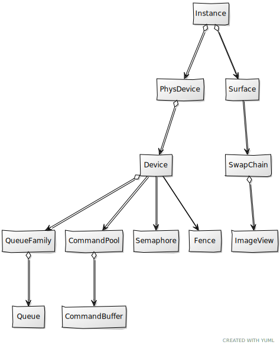

# Chapter 05 - Clearing the screen

In this chapter we will introduce new concepts that are required to render a scene to the screen. We will finally combine all these new concepts with the elements described in previous chapters to clear the screen. Therefore, it is crucial to understand all of them and how are they related in order to be able to progress in the book.

You can find the complete source code for this chapter [here](../../booksamples/chapter-05).

## Command Buffers

When we talked about queues we already mentioned that in Vulkan, work is submitted by recording commands (stored in a command buffer), and submitting them to a queue. It is time now to implement the support for these elements. Command buffers new to be instantiated through a command pool. Therefore, let's encapsulate Command pool creation in a class named `CmdPool`. It's definition is quite simple:

```java
package org.vulkanb.eng.graph.vk;

import org.lwjgl.system.MemoryStack;
import org.lwjgl.vulkan.VkCommandPoolCreateInfo;
import org.tinylog.Logger;

import java.nio.LongBuffer;

import static org.lwjgl.vulkan.VK13.*;
import static org.vulkanb.eng.graph.vk.VkUtils.vkCheck;

public class CmdPool {
    private final long vkCommandPool;

    public CmdPool(VkCtx vkCtx, int queueFamilyIndex, boolean supportReset) {
        Logger.debug("Creating Vulkan command pool");

        try (var stack = MemoryStack.stackPush()) {
            var cmdPoolInfo = VkCommandPoolCreateInfo.calloc(stack)
                    .sType$Default()
                    .queueFamilyIndex(queueFamilyIndex);
            if (supportReset) {
                cmdPoolInfo.flags(VK_COMMAND_POOL_CREATE_RESET_COMMAND_BUFFER_BIT);
            }

            LongBuffer lp = stack.mallocLong(1);
            vkCheck(vkCreateCommandPool(vkCtx.getDevice().getVkDevice(), cmdPoolInfo, null, lp),
                    "Failed to create command pool");

            vkCommandPool = lp.get(0);
        }
    }

    public void cleanup(VkCtx vkCtx) {
        Logger.debug("Destroying Vulkan command pool");
        vkDestroyCommandPool(vkCtx.getDevice().getVkDevice(), vkCommandPool, null);
    }

    public long getVkCommandPool() {
        return vkCommandPool;
    }

    public void reset(VkCtx vkCtx) {
        vkResetCommandPool(vkCtx.getDevice().getVkDevice(), vkCommandPool, 0);
    }
}
```

Creating a command pool is pretty straightforward, we just set up an initialization structure, named `VkCommandPoolCreateInfo` which has the following main parameter:
- `queueFamilyIndex`: Selects the queue family index where the commands created in this pool can be submitted to. 

We have omitted one parameter which you may also see in other Vulkan documentation, the `flags` parameter which allows to specify the behavior of the command pool.
Basically, we have two options, we can get command buffers from the pool and return them whenever we have used them (we have submitted them tio a queue), or we can
reuse them between several submits. In this later case, you need to reset them. In order to do so, you need to explicitly create the command pool to support this behavior,
by setting the `flags` parameter with the `VK_COMMAND_POOL_CREATE_RESET_COMMAND_BUFFER_BIT` value. This will allow commands to be reset individually.
You may think this should be the recommended approach for performance, but in fact it is just the opposite. It is much better to return command to the pool once
we have finished with tem. Therefore, we will not use the `flags`parameter.

The rest of the methods of the class, as usual, are a `cleanup` method to release resources, a utility method to get access to the device and another one to get the command pool handle. We will add a `reset` method, which basically recycles all the resources associated to the command buffers associated to a command pool.
We will use this method to put all allocated command buffers in initial state instead of resetting them individually.

Now that are able to create command pools, let's review the class that will allow us to instantiate command buffers, which as you can image it's named `CmdBuffer`. This is the constructor code:

```java
package org.vulkanb.eng.graph.vk;

import org.lwjgl.PointerBuffer;
import org.lwjgl.system.MemoryStack;
import org.lwjgl.vulkan.*;
import org.tinylog.Logger;

import java.nio.IntBuffer;

import static org.lwjgl.vulkan.VK13.*;
import static org.vulkanb.eng.graph.vk.VkUtils.vkCheck;

public class CmdBuffer {

    private final boolean oneTimeSubmit;
    private final boolean primary;
    private final VkCommandBuffer vkCommandBuffer;

    public CmdBuffer(VkCtx vkCtx, CmdPool cmdPool, boolean primary, boolean oneTimeSubmit) {
        Logger.trace("Creating command buffer");
        this.primary = primary;
        this.oneTimeSubmit = oneTimeSubmit;
        VkDevice vkDevice = vkCtx.getDevice().getVkDevice();

        try (var stack = MemoryStack.stackPush()) {
            var cmdBufAllocateInfo = VkCommandBufferAllocateInfo.calloc(stack)
                    .sType$Default()
                    .commandPool(cmdPool.getVkCommandPool())
                    .level(primary ? VK_COMMAND_BUFFER_LEVEL_PRIMARY : VK_COMMAND_BUFFER_LEVEL_SECONDARY)
                    .commandBufferCount(1);
            PointerBuffer pb = stack.mallocPointer(1);
            vkCheck(vkAllocateCommandBuffers(vkDevice, cmdBufAllocateInfo, pb),
                    "Failed to allocate render command buffer");

            vkCommandBuffer = new VkCommandBuffer(pb.get(0), vkDevice);
        }
    }
    ...
}
```

The constructor receives, as it first parameter, the Vulkan Context, since we need to access the device. The second parameter is the command pool where this command buffer will be allocated to. The third parameter specifies if it is a primary or a secondary command buffer. Primary command buffers are submitted to queues for their execution and can contain several secondary command buffers. Secondary command buffers cannot be submitted directly to a queue, they always need to be included into a primary buffer. A use case for secondary buffers is command reuse. With secondary command buffers we can record some commands that may be shared between multiple primary command buffers. This way we can define "fixed" commands into secondary command buffers and combine them in primary buffers with other varying commands, reducing the workload. Keep in mind that you should not use too many secondary buffers, since they may affect performance. Use them with care. Finally, the last parameter is a `boolean` that indicates if the command buffer recordings will be submitted just once or if they can be submitted multiple times (we will see later on what this implies). We need to fill a structure named `VkCommandBufferAllocateInfo`. The parameters are:

- `commandPool`: Handle to the command pool which will be used to allocate the command buffer.
- `level`: Indicates the level of the command buffer (primary or secondary).
- `commandBufferCount`: The number of command buffers to allocate.

To finalize the constructor, once that structure is being set, we allocate the command buffer by creating a new `VkCommandBuffer` instance.
The next method of the `CmdBuffer` class, named `beginRecording`, should be invoked when we want to start recording for that command buffer:

```java
public class CmdBuffer {
    ...
    public void beginRecording() {
        beginRecording(null);
    }

    public void beginRecording(InheritanceInfo inheritanceInfo) {
        try (var stack = MemoryStack.stackPush()) {
            var cmdBufInfo = VkCommandBufferBeginInfo.calloc(stack).sType$Default();
            if (oneTimeSubmit) {
                cmdBufInfo.flags(VK_COMMAND_BUFFER_USAGE_ONE_TIME_SUBMIT_BIT);
            }
            if (!primary) {
                if (inheritanceInfo == null) {
                    throw new RuntimeException("Secondary buffers must declare inheritance info");
                }
                int numColorFormats = inheritanceInfo.colorFormats.length;
                IntBuffer pColorFormats = stack.callocInt(inheritanceInfo.colorFormats.length);
                for (int i = 0; i < numColorFormats; i++) {
                    pColorFormats.put(0, inheritanceInfo.colorFormats[i]);
                }
                var renderingInfo = VkCommandBufferInheritanceRenderingInfo.calloc(stack)
                        .sType$Default()
                        .depthAttachmentFormat(inheritanceInfo.depthFormat)
                        .pColorAttachmentFormats(pColorFormats)
                        .rasterizationSamples(inheritanceInfo.rasterizationSamples);
                var vkInheritanceInfo = VkCommandBufferInheritanceInfo.calloc(stack)
                        .sType$Default()
                        .pNext(renderingInfo);
                cmdBufInfo.pInheritanceInfo(vkInheritanceInfo);
            }
            vkCheck(vkBeginCommandBuffer(vkCommandBuffer, cmdBufInfo), "Failed to begin command buffer");
        }
    }
    ...
    public record InheritanceInfo(int depthFormat, int[] colorFormats, int rasterizationSamples) {
    }
}
```

We have two methods to start recording, the first one, which receives no parameter is a convenience method which can be used for primary command buffers. The next one receives an `InheritanceInfo` instance which is required for secondary buffers. To start recording we need to create a `VkCommandBufferBeginInfo` structure and invoke the `vkBeginCommandBuffer` function. If we are submitting a short lived command, we can signal that using the flag `VK_COMMAND_BUFFER_USAGE_ONE_TIME_SUBMIT_BIT`. In this case, the driver may not try to optimize that command buffer since it will only be used one time. Secondary buffers need to be instructed which render pass and frame buffer they will need to use since a render pass wil not be started when recording. We need to fill up the `VkCommandBufferInheritanceInfo` structure filled up with the color and depth attachments formats (more on this later). Secondary command buffers can be integrated into primary command buffers by executing the `vkCmdExecuteCommands` function.

The next methods are the usual `cleanup` for releasing resources, to finalize the recording and another one to get the command buffer Vulkan instance.

```java
public class CmdBuffer {
    ...
    public void cleanup(VkCtx vkCtx, CmdPool cmdPool) {
        Logger.trace("Destroying command buffer");
        vkFreeCommandBuffers(vkCtx.getDevice().getVkDevice(), cmdPool.getVkCommandPool(),
                vkCommandBuffer);
    }

    public void endRecording() {
        vkCheck(vkEndCommandBuffer(vkCommandBuffer), "Failed to end command buffer");
    }

    public VkCommandBuffer getVkCommandBuffer() {
        return vkCommandBuffer;
    }
    ...
}
```

The next method of the `CmdBuffer` class will be used to reset the command Buffer. That is, to throw up all the previously recorded commands (stored in that buffer) so can start recording again. As we've mentioned before, we will stick with resetting the command pool instead of resetting each command buffer individually, but you have this method here
in case you want to do it this way.

```java
public class CmdBuffer {
    ...
    public void reset() {
        vkResetCommandBuffer(vkCommandBuffer, VK_COMMAND_BUFFER_RESET_RELEASE_RESOURCES_BIT);
    }
    ...
}
```

The `CmdBuffer` class is now almost complete, there is still one method missing which basically submits ut to a queue and waits it to be processed. But, 
prior to showing that method we need to introduce new concepts.


## Synchronization

Prior to progress in rendering something on the screen, we need to address a fundamental topic in Vulkan: synchronization. In Vulkan we will be in charge of properly control the synchronization of the resources. This imposes certain complexity but allows us to have a full control about how operations will be done. In this section we well address two main mechanisms involved in Vulkan synchronization: semaphores and fences. There are some other elements such as barriers or events, we will explain them once we first use them. 

Fences are the mechanisms used in Vulkan to synchronize operations between the GPU and the CPU (our application). Semaphores are used to synchronize operations inside the GPU (GPU to GPU synchronization), and are frequently used to synchronize queue submissions. These elements are used to block the execution until a signal is performed. Once a signal is received  execution is resumed. It is important to note, that signaling is always done in the GPU side. In the case of fences, our application can block (waiting in the CPU) until the GPU signals that execution can go on, but we cannot trigger the signaling from the CPU. In the case of semaphores, since they are internal to the GPU, waiting can only happen in the GPU.

Before using these elements, we will define some classes to manage them. We will firs start with the `Semaphore` class:

```java
package org.vulkanb.eng.graph.vk;

import org.lwjgl.system.MemoryStack;
import org.lwjgl.vulkan.VkSemaphoreCreateInfo;

import java.nio.LongBuffer;

import static org.lwjgl.vulkan.VK13.*;
import static org.vulkanb.eng.graph.vk.VkUtils.vkCheck;

public class Semaphore {

    private final long vkSemaphore;

    public Semaphore(VkCtx vkCtx) {
        try (var stack = MemoryStack.stackPush()) {
            var semaphoreCreateInfo = VkSemaphoreCreateInfo.calloc(stack).sType$Default();

            LongBuffer lp = stack.mallocLong(1);
            vkCheck(vkCreateSemaphore(vkCtx.getDevice().getVkDevice(), semaphoreCreateInfo, null, lp),
                    "Failed to create semaphore");
            vkSemaphore = lp.get(0);
        }
    }

    public void cleanup(VkCtx vkCtx) {
        vkDestroySemaphore(vkCtx.getDevice().getVkDevice(), vkSemaphore, null);
    }

    public long getVkSemaphore() {
        return vkSemaphore;
    }
}
```

In this case we are modeling what is called a binary semaphore, which can be in two states: signaled and un-signaled. When you create a semaphore is in an un-signaled state. When we submit command we can specify a semaphore to be signaled when the commands complete. If later on, we record some other commands or perform some operation that require those previous commands to be completed, we use the same semaphore to wait. The cycle is like this, the semaphore in the first step is un-signaled, when the operations are completed get signaled and then, commands that are waiting can continue (we say that these second step activities are waiting for the semaphore to be signaled). Creating a semaphore is easy, just define a `VkSemaphoreCreateInfo`  and call the `vkCreateSemaphore` function. The rest of the methods are the usual ones, one for cleaning up the resources and another one to get the semaphore handle.

Now it's turn for the `Fence` class:

```java
package org.vulkanb.eng.graph.vk;

import org.lwjgl.system.MemoryStack;
import org.lwjgl.vulkan.VkFenceCreateInfo;

import java.nio.LongBuffer;

import static org.lwjgl.vulkan.VK13.*;
import static org.vulkanb.eng.graph.vk.VkUtils.vkCheck;

public class Fence {

    private final long vkFence;

    public Fence(VkCtx vkCtx, boolean signaled) {
        try (var stack = MemoryStack.stackPush()) {
            var fenceCreateInfo = VkFenceCreateInfo.calloc(stack)
                    .sType$Default()
                    .flags(signaled ? VK_FENCE_CREATE_SIGNALED_BIT : 0);

            LongBuffer lp = stack.mallocLong(1);
            vkCheck(vkCreateFence(vkCtx.getDevice().getVkDevice(), fenceCreateInfo, null, lp), "Failed to create fence");
            vkFence = lp.get(0);
        }
    }

    public void cleanup(VkCtx vkCtx) {
        vkDestroyFence(vkCtx.getDevice().getVkDevice(), vkFence, null);
    }

    public void fenceWait(VkCtx vkCtx) {
        vkWaitForFences(vkCtx.getDevice().getVkDevice(), vkFence, true, Long.MAX_VALUE);
    }

    public long getVkFence() {
        return vkFence;
    }

    public void reset(VkCtx vkCtx) {
        vkResetFences(vkCtx.getDevice().getVkDevice(), vkFence);
    }
}
```

As in the `Semaphore` class, the `Fence` class is also very simple. We also need to fill up an initialization structure named `VkFenceCreateInfo`. In this case, we can set (through a constructor argument), if the fence should be already signaled when created or not. Besides the cleaning method and the one for getting the handle we have one method called `fenceWait` which waits for the fence to be signaled (waits in the CPU the signal raised by the GPU). We have another one named `reset` which resets the fence to un-signaled state by calling the `vkResetFences` function.



With all of these synchronization elements we can go back to the `Queue` class and add a method to submit command buffers named `submit`:

```java
public class Queue {
    ...
    public void submit(VkCommandBufferSubmitInfo.Buffer commandBuffers, VkSemaphoreSubmitInfo.Buffer waitSemaphores,
                       VkSemaphoreSubmitInfo.Buffer signalSemaphores, Fence fence) {
        try (var stack = MemoryStack.stackPush()) {
            var submitInfo = VkSubmitInfo2.calloc(1, stack)
                    .sType$Default()
                    .pCommandBufferInfos(commandBuffers)
                    .pSignalSemaphoreInfos(signalSemaphores);
            if (waitSemaphores != null) {
                submitInfo.pWaitSemaphoreInfos(waitSemaphores);
            }
            long fenceHandle = fence != null ? fence.getVkFence() : VK_NULL_HANDLE;

            vkCheck(vkQueueSubmit2(vkQueue, submitInfo, fenceHandle), "Failed to submit command to queue");
        }
    }
    ...
}
```

This method can receive a list of command buffer handles (we can submit more than one at a time) and several synchronization elements. In order to submit a list of command buffers to a queue we need to setup a `VkSubmitInfo2` structure. The attributes of this structure are:

- `pCommandBufferInfos`: The list of the command buffers to submit.
- `pSignalSemaphoreInfos`: It holds a list of semaphores that will be signaled when all the commands have finished. Remember that we use semaphores for GPU-GPU synchronization..
- `pWaitSemaphoreInfos`:  It holds a list of semaphores that we will use to wait before the commands get executed. The execution of the commands will block until the semaphores are signaled.

When submitting the command buffers we can also set a handle to a `Fence`. We will use this as a blocking mechanism in our application to prevent re-submitting commands that are still in use. 

Now that we have introduced semaphores, fences, and queue submission it is time to show the pending method in the `CmdBuffer` which is called `submitAndWait`:

```java
public class CmdBuffer {
    ...
    public void submitAndWait(VkCtx vkCtx, Queue queue) {
        Fence fence = new Fence(vkCtx, true);
        fence.reset(vkCtx);
        try (var stack = MemoryStack.stackPush()) {
            var cmds = VkCommandBufferSubmitInfo.calloc(1, stack)
                    .sType$Default()
                    .commandBuffer(vkCommandBuffer);
            queue.submit(cmds, null, null, fence);
        }
        fence.fenceWait(vkCtx);
        fence.cleanup(vkCtx);
    }
    ...
}
```
The method is quite simple. We start by creating a `Fence` instance, which will allows to block CPU execution until all the commands submitted have been processed.
We then just wrap the command buffer handle into a `VkCommandBufferSubmitInfo` structure and use the queue, received as a parameter, to submit it.
Then we just wait for the commands to finish by calling `fenceWait` and `cleanup` resources when everything is completed.
This method will be used in future chapters to wait for the loading of assets (3D models, textures, ...) into the GPU.

## Render loop

Prior to progress on how we render graphics, we will analyze first how what we would need to do that. The first thing that comes to the mind  may be having a 
command buffer and a command pool, of course having a queue to submit the commands and we will need something to do with the image views of the `SwapChain`.
So, let's just create one instance of each and that's it, right? Well, it turns out that is not so easy. We need to make sure that the image we are rendering into
is not in use. Ok, so let's then use a fence and a semaphore to prevent that, and that's all, right? Again, it is not so easy. Remember when we talked about the
`SwapChain` class? We created several image views. We want to be able to perform operations in the CPU while the GPU is working, this is why we tried to use 
triple buffering. So we need to have several resources while processing each frame. How many of them? At first, you may think that you need as many as image views
have the `SwapChain` image views. The reality, however, is that you do not need as many, with just two is enough. The reason is that we do not want the CPU to wait for
the GPU to prevent having latency. We will refer to this number as frames in flight, which shall not be confused with total swap chain image views.
In fact, we will create a new constant in the `VkUtils` class for this:

```java
public class VkUtils {
    ...
    public static final int MAX_IN_FLIGHT = 2;
    ...
}
```

There is an excellent resource [here](https://docs.vulkan.org/tutorial/latest/03_Drawing_a_triangle/03_Drawing/03_Frames_in_flight.html)
which provides additional information.

So then just create as many semaphores and fences as frames in flight an that's all, right? Again is not so easy!. We need to take care with swap chain image presentation.
We will use a semaphore when submitting the work to a queue to be signaled after all the work has been done. We will use an array of semaphores for that, called
`renderCompleteSemphs`. When presenting the acquired swap chain image we will use the proper index `renderCompleteSemphs[i]` when calling the `vkQueuePresentKHR` function
so presentation cannot start until render work has been finished. The issue here is that this will be an asynchronous call that can be processed later on. Imagine that we created as the `renderCompleteSemphs` array is size to contain as many instances as flights in frame, let's say `2` and we will have `3` swap chain images.

- In Frame `#0`:
    - We acquire the first swap chain image (with an index equal to `0`).
    - We submit the work using `renderCompleteSemphs[0]`.
    - We present the swap chain image (that is, call the `vkQueuePresentKHR` function using `renderCompleteSemphs[0]` sempahore).
- In Frame `#1`:
    - We acquire the next swap chain image (with an index equal to `1`).
    - We submit the work using `renderCompleteSemphs[1]`.
    - We present the swap chain image (that is, call the `vkQueuePresentKHR` function using `renderCompleteSemphs[1]` sempahore).
    - Everything is ok up to this point.
- In Frame `#2`:
    - We acquire the next swap chain image (with an index equal to `2`).
    - We have just `2` instances of `renderCompleteSemphs`, so we need to use `renderCompleteSemphs[0]`.
    - The issue here is that presentation for Frame `#0` may not have finished, and thus `renderCompleteSemphs[0]` may still be in use. We may have a synchronization issue here.

But, shouldn't fences help us prevent us from this issue? The answer is now, fences will be used when submitting work to a queue. Therefore, if we wait for a fence,
we will be sure that previous work associated to the same frame in flight index will have finished. The issue is with presentation, when presenting the swap chain
image we just only pass a semaphore to wait to be signaled when the render work is finished, but we cannot signal when the presentation will be finished. Therefore, fence
wait does not know anything about presentation state, The solution for this is to have as many render complete semaphores as swap chain images. The rest of synchronization 
elements and per-frame elements just need to be sized to the maximum number of flight, because they are concerned to just render activities, presentation is not involved
at all.

Let's go now to the `Render` class and see the new attributes that we will need (showing the changes in the constructor and the `cleanup` method):

```java
public class Render {
    ...
    private final CmdBuffer[] cmdBuffers;
    private final CmdPool[] cmdPools;
    private final Fence[] fences;
    private final Queue.GraphicsQueue graphQueue;
    private final Semaphore[] presCompleteSemphs;
    private final Queue.PresentQueue presentQueue;
    private final Semaphore[] renderCompleteSemphs;
    private final ScnRender scnRender;
    private final VkCtx vkCtx;
    private int currentFrame;

    public Render(EngCtx engCtx) {
        vkCtx = new VkCtx(engCtx.window());
        currentFrame = 0;

        graphQueue = new Queue.GraphicsQueue(vkCtx, 0);
        presentQueue = new Queue.PresentQueue(vkCtx, 0);

        cmdPools = new CmdPool[VkUtils.MAX_IN_FLIGHT];
        cmdBuffers = new CmdBuffer[VkUtils.MAX_IN_FLIGHT];
        fences = new Fence[VkUtils.MAX_IN_FLIGHT];
        presCompleteSemphs = new Semaphore[VkUtils.MAX_IN_FLIGHT];
        int numSwapChainImages = vkCtx.getSwapChain().getNumImages();
        renderCompleteSemphs = new Semaphore[numSwapChainImages];
        for (int i = 0; i < VkUtils.MAX_IN_FLIGHT; i++) {
            cmdPools[i] = new CmdPool(vkCtx, graphQueue.getQueueFamilyIndex(), false);
            cmdBuffers[i] = new CmdBuffer(vkCtx, cmdPools[i], true, true);
            presCompleteSemphs[i] = new Semaphore(vkCtx);
            fences[i] = new Fence(vkCtx, true);
        }
        for (int i = 0; i < numSwapChainImages; i++) {
            renderCompleteSemphs[i] = new Semaphore(vkCtx);
        }
        scnRender = new ScnRender(vkCtx);
    }

    public void cleanup() {
        vkCtx.getDevice().waitIdle();

        scnRender.cleanup();

        Arrays.asList(renderCompleteSemphs).forEach(i -> i.cleanup(vkCtx));
        Arrays.asList(presCompleteSemphs).forEach(i -> i.cleanup(vkCtx));
        Arrays.asList(fences).forEach(i -> i.cleanup(vkCtx));
        for (int i = 0; i < cmdPools.length; i++) {
            cmdBuffers[i].cleanup(vkCtx, cmdPools[i]);
            cmdPools[i].cleanup(vkCtx);
        }

        vkCtx.cleanup();
    }
    ...
}
```

We will need:
- An array of command pools, whose size will be equal to the maximum number of flights in flight.
- An array of command buffers, one per frame in flight where will be recording the commands for each of them.
- Synchronization instances, semaphores and fences, as well, as many as frames in flight with the exception of the semaphores that will be signaled when the render process
is completed. 
- One `Queue.GraphicsQueue` since we can use them in multiple frames. Synchronization wil be controlled by fences and semaphores.
- You will see to new classes that have not been defined yet: `Queue.PresentQueue` (which will be used to present swap chain images)
and `ScnRender` (to actually render a scene). We will see their definition later on.
- The attribute `currentFrame` will hold the current frame to be processed. It will be updated in each render loop.

Now let's focus on the render loop. The next figure shows the main steps.


The loop loop main steps are as follows:
- *Wait for fence*: In order to be able to access, from CPU, resources associated to current frame, we need to make sure that they are still not being used by the GPU.
Remember that fences are the way to synchronize between GPU and CPU. When we will submit the work associated to current frame, we will pass the associated fence.
- *Record commands A*: Once we have passed the fence, we can start recording commands in the command buffer associated to the current frame. But Why having two sets of
command "A" and "B" ? The reason for that is that we will have commands that do not depend on the specific swap chain image that we need to acquire ("A commands") and
commands that will perform operations over a specific image view ("B commands"). We can start recording the first step prior to acquiring the swap chain image.
- *Acquire image*: We need to acquire the next swap chain image which will be used to render. In this chapter we will not have "A commands" yet however.
- *Record commands B*: Already explained.
- *Submit commands*: Just submit the commands to a graphical queue.
- *Present Image*.

Remember that, depending on your case, you can pre-record your commands once and use them in your render loop. However, if your scene is complex and the commands may change, it is acceptable to record them in the render loop (you can optimize this by reusing secondary command buffers or using several threads).

Let's see how the code of the render loop (and associated methods) looks like:

```java
public class Render {
    ...
    private void recordingStart(CmdPool cmdPool, CmdBuffer cmdBuffer) {
        cmdPool.reset(vkCtx);
        cmdBuffer.beginRecording();
    }

    private void recordingStop(CmdBuffer cmdBuffer) {
        cmdBuffer.endRecording();
    }

    public void render(EngCtx engCtx) {
        SwapChain swapChain = vkCtx.getSwapChain();

        waitForFence(currentFrame);

        var cmdPool = cmdPools[currentFrame];
        var cmdBuffer = cmdBuffers[currentFrame];

        recordingStart(cmdPool, cmdBuffer);

        int imageIndex = swapChain.acquireNextImage(vkCtx.getDevice(), presCompleteSemphs[currentFrame]);
        if (imageIndex < 0) {
            return;
        }
        scnRender.render(vkCtx, cmdBuffer, imageIndex);

        recordingStop(cmdBuffer);

        submit(cmdBuffer, currentFrame, imageIndex);

        swapChain.presentImage(presentQueue, renderCompleteSemphs[imageIndex], imageIndex);

        currentFrame = (currentFrame + 1) % VkUtils.MAX_IN_FLIGHT;
    }
    ...
    private void waitForFence(int currentFrame) {
        var fence = fences[currentFrame];
        fence.fenceWait(vkCtx);
    }
}
```
The `render` loop performs the following actions:
- We first wait for the fence associated to the current frame.
- After that, we select the command pool and command buffer associated to current frame.
- We then call to `recordingStart` which resets the command pool and sets the command buffer in recording mode. Remember that we will not be resetting the command
buffers but the pool. After this step we could start recording "A commands".
- In our case, since we do not have "A commands" yet", we just acquire next swap chain image. We will see the implementation later on, but this method returns
the index of the image acquired (it may not be just the next image index). The `presCompleteSemphs` array is the semaphore used to synchronize image acquisition
When the image is acquired, this semaphore will be signaled. Any operation depending on this image to be acquired, can use this semaphore as a blocking mechanism.
- If the `acquireNextImage` returns a negative value, this will mean that the operation failed. This could be because the window has been resized. By now, we just return.
- Then we can record "B commands" which we will do by calling `scnRender.render(vkCtx, cmdBuffer, imageIndex);`
- After that we can stop the recording and submit the work to the graphics queue.
- Finally, we just present the image and increase current frame in the range [0-VkUtils.MAX_IN_FLIGHT].

The `submit` method is defined like this:

```java
public class Render {
    ...
    private void submit(CmdBuffer cmdBuff, int currentFrame, int imageIndex) {
        try (var stack = MemoryStack.stackPush()) {
            var fence = fences[currentFrame];
            fence.reset(vkCtx);
            var cmds = VkCommandBufferSubmitInfo.calloc(1, stack)
                    .sType$Default()
                    .commandBuffer(cmdBuff.getVkCommandBuffer());
            VkSemaphoreSubmitInfo.Buffer waitSemphs = VkSemaphoreSubmitInfo.calloc(1, stack)
                    .sType$Default()
                    .stageMask(VK_PIPELINE_STAGE_2_COLOR_ATTACHMENT_OUTPUT_BIT)
                    .semaphore(presCompleteSemphs[currentFrame].getVkSemaphore());
            VkSemaphoreSubmitInfo.Buffer signalSemphs = VkSemaphoreSubmitInfo.calloc(1, stack)
                    .sType$Default()
                    .stageMask(VK_PIPELINE_STAGE_2_BOTTOM_OF_PIPE_BIT)
                    .semaphore(renderCompleteSemphs[imageIndex].getVkSemaphore());
            graphQueue.submit(cmds, waitSemphs, signalSemphs, fence);
        }
    }
    ...
}
```

This method basically delegates in the `Queue.submit` constructing all the required arguments. Let's concentrate on what semaphores we are using:
- `waitSemphs`: It holds a list of semaphores that we will use to wait before the commands get executed. The execution of the commands will block until the semaphores are signaled. In this case, we are submitting the semaphore that was used for acquiring the swap chain image. This semaphore will be signaled when the image is effectively acquired, blocking the command execution until this happens. You will see that we are using a `stageMask` attribute which we set to `VK_PIPELINE_STAGE_2_COLOR_ATTACHMENT_OUTPUT_BIT`. 
You will understand this when we talk about pipelines, but this attribute allow us to fine control when we want to control this wait process. Commands, when 
submitted go through different stages (vertex output, fragment output, ...). In this case we need to wait when generating the output color, so we use the `VK_PIPELINE_STAGE_2_COLOR_ATTACHMENT_OUTPUT_BIT` value. Since we depend on swap chain image view, we want to make sure that the image has been acquired
when we start outputting final colors. 
- `signalSemphs`: It holds a list of semaphores that will be signaled when all the commands have finished. Remember that we use semaphores for GPU-GPU synchronization. In this case, we are submitting the semaphore used in the swap chain presentation. This will provoke that the image cannot be presented until the commands have finished, that is, until
render has finished. This is why we use the `VK_PIPELINE_STAGE_2_BOTTOM_OF_PIPE_BIT`, all the commands need to have finalized their journey through the pipeline.

Please notice that we have different array sizes for the presentation complete semaphores and the render complete semaphores. Later one (`renderCompleteSemphs`) will need to be
accessed with the swap chain acquire image index, while the first one (`presCompleteSemphs`) will just need frame in flight index.

Finally, we use the current `Fence` instance, this way we block the CPU from resetting command buffers that are still in use.

Let's start now by reviewing the missing methods in `SwapChain` class. First method is `acquireNextImage`:

```java
public class SwapChain {
    ...
    public int acquireNextImage(Device device, Semaphore imageAqSem) {
        int imageIndex;
        try (var stack = MemoryStack.stackPush()) {
            IntBuffer ip = stack.mallocInt(1);
            int err = KHRSwapchain.vkAcquireNextImageKHR(device.getVkDevice(), vkSwapChain, ~0L,
                    imageAqSem.getVkSemaphore(), MemoryUtil.NULL, ip);
            if (err == KHRSwapchain.VK_ERROR_OUT_OF_DATE_KHR) {
                return -1;
            } else if (err == KHRSwapchain.VK_SUBOPTIMAL_KHR) {
                // Not optimal but swapchain can still be used
            } else if (err != VK_SUCCESS) {
                throw new RuntimeException("Failed to acquire image: " + err);
            }
            imageIndex = ip.get(0);
        }

        return imageIndex;
    }
    ...
}
```
  
In order to acquire an image we need to call the function `vkAcquireNextImageKHR`. The parameters for this function are:
- `device`: The handle to the Vulkan logical device. 
- `swapchain`: The handle to the Vulkan swap chain.
- `timeout`: It specifies the maximum time to get blocked in this call (in nanoseconds). If the value is greater than `0` and we are not able to get an image in that time, we will get a `VK_TIMEOUT` error. In our case, we just want to block indefinitely. 
- `semaphore`: If it is not a null handle (`VK_NULL_HANDLE`) it must point to a valid semaphore. The semaphore will be signaled when the GPU is done with the acquired image.
In our case, we use the presentation complete semaphore associated to current frame.
- `fence`: The purpose is the same as in the `semaphore` attribute but using a `Fence`. In our case we do not need this type of synchronization so we just pass a null.
- `pImageIndex`: It is a return value attribute, It contains the index of the image acquired. It is important to note that the driver may not return always the next image in the set of swap chain images. This is the reason the `acquireNextImage` method returns the image index that has been acquired.

The function can return different error values, but we are interested in a specific value: `VK_ERROR_OUT_OF_DATE_KHR`. If this value is returned, it means that the window has been resized. If so, we need to handle that and recreate some resources. By now, we will not be defining the code for detecting that event, and we will return if resizing is required in the `acquireNextImage` method. If we cannot acquire an image we just return a negative value.

Let's review the new method for image presentation named `presentImage`:
```java
public class SwapChain {
    ...
    public boolean presentImage(Queue queue, Semaphore renderCompleteSem, int imageIndex) {
        boolean resize = false;
        try (var stack = MemoryStack.stackPush()) {
            VkPresentInfoKHR present = VkPresentInfoKHR.calloc(stack)
                    .sType$Default()
                    .pWaitSemaphores(stack.longs(renderCompleteSem.getVkSemaphore()))
                    .swapchainCount(1)
                    .pSwapchains(stack.longs(vkSwapChain))
                    .pImageIndices(stack.ints(imageIndex));

            int err = KHRSwapchain.vkQueuePresentKHR(queue.getVkQueue(), present);
            if (err == KHRSwapchain.VK_ERROR_OUT_OF_DATE_KHR) {
                resize = true;
            } else if (err == KHRSwapchain.VK_SUBOPTIMAL_KHR) {
                // Not optimal but swap chain can still be used
            } else if (err != VK_SUCCESS) {
                throw new RuntimeException("Failed to present KHR: " + err);
            }
        }
        return resize;
    }
    ...
}
```

In order to present an image we need to call the `vkQueuePresentKHR` which receives  two parameters:

- `queue`: The queue to be used to enqueue the image to the presentation engine.
- `pPresentInfo`: A `VkPresentInfoKHR` structure with the information for presenting the image.

The `VkPresentInfoKHR` structure can be used to present more than one image. In this case we will be presenting just once at a time. The `pWaitSemaphores` will hold the list of semaphores that will be used to wait to present the images. Remember that this structure can refer to more than one image. In our case, is the semaphore that
we use to signal that the render has been completed (we cannot present the image until render has finished). The rest of attributes refer to the swap chain Vulkan handle and the indices of the images to be presented (the `imageIndex` parameter in the method). As in the case of acquiring the image, if the window has been resize we will get an error: `VK_ERROR_OUT_OF_DATE_KHR`. By now, we just return true if the window has been resized.

As we have seen above, we need to create another queue which will be used to en-queue the swap chain images which are ready to be presented. For this queue we use a specific queue family which is used just for presentation. This is the definition of the `Queue.PresentQueue` (very similar to the `GraphicsQueue`):

```java
public class Queue {
    ...
    public static class PresentQueue extends Queue {

        public PresentQueue(VkCtx vkCtx, int queueIndex) {
            super(vkCtx, getPresentQueueFamilyIndex(vkCtx), queueIndex);
        }

        private static int getPresentQueueFamilyIndex(VkCtx vkCtx) {
            int index = -1;
            try (var stack = MemoryStack.stackPush()) {
                var queuePropsBuff = vkCtx.getPhysDevice().getVkQueueFamilyProps();
                int numQueuesFamilies = queuePropsBuff.capacity();
                IntBuffer intBuff = stack.mallocInt(1);
                for (int i = 0; i < numQueuesFamilies; i++) {
                    KHRSurface.vkGetPhysicalDeviceSurfaceSupportKHR(vkCtx.getPhysDevice().getVkPhysicalDevice(),
                            i, vkCtx.getSurface().getVkSurface(), intBuff);
                    boolean supportsPresentation = intBuff.get(0) == VK_TRUE;
                    if (supportsPresentation) {
                        index = i;
                        break;
                    }
                }
            }

            if (index < 0) {
                throw new RuntimeException("Failed to get Presentation Queue family index");
            }
            return index;
        }
    }
}
```

## Dynamic Rendering

In this book we will use Vulkan dynamic rendering vs the traditional approach based on render passes. Dynamic render provides a simpler API win which we just refer
to the attachments (the images) that we want to render to vs having to specify them upfront through render passes and frame buffers. The result is fewer code and
reduced setup steps. Dynamic render provides more flexibility and we can change the target attachments at runtime without recreating the associated elements
(render passes and frame buffers). However, for certain tasks it is a little bit more explicit than the traditional approach. For example, with render passes
you get som implicit image transitions (which basically prepared images from undefined layouts to the proper render one). Dynamic render requires us to explicitly
define layout transitions and synchronization, which requires a little bit m ore of code, but is not so dramatic. In addition, I personally find more clear
the dynamic render approach, where everything is explicit and you do not have to guess what automatic transition or locking is applied.

We will explain how to use dynamic rendering while we define the `ScnRender` class. Let's start by reviewing the constructor:

```java
package org.vulkanb.eng.graph.scn;

import org.lwjgl.system.MemoryStack;
import org.lwjgl.vulkan.*;
import org.vulkanb.eng.graph.vk.*;

import java.util.Arrays;

import static org.lwjgl.vulkan.KHRSwapchain.VK_IMAGE_LAYOUT_PRESENT_SRC_KHR;
import static org.lwjgl.vulkan.KHRSynchronization2.VK_IMAGE_LAYOUT_ATTACHMENT_OPTIMAL_KHR;
import static org.lwjgl.vulkan.VK13.*;

public class ScnRender {

    private final VkClearValue clrValueColor;
    private VkRenderingAttachmentInfo.Buffer[] attInfoColor;
    private VkRenderingInfo[] renderInfo;

    public ScnRender(VkCtx vkCtx) {
        clrValueColor = VkClearValue.calloc().color(
                c -> c.float32(0, 0.5f).float32(1, 0.7f).float32(2, 0.9f).float32(3, 1.0f));
        attInfoColor = createColorAttachmentsInfo(vkCtx, clrValueColor);
        renderInfo = createRenderInfo(vkCtx, attInfoColor);
    }
    ...
}
```

As class attributes we see the following:
- An instance of the `VkClearValue` which will be used to clear the screen with a color.
- An array of color attachments (VkRenderingAttachmentInfo.Buffer[]), which models which will be the target image views that we can render to.
- An array of `VkRenderingInfo` structures, which will be used to setup dynamic render information.

All this attributes are initialized in the constructor. Let's start by defining the `createColorAttachmentsInfo` method:

```java
public class ScnRender {
    ...
    private static VkRenderingAttachmentInfo.Buffer[] createColorAttachmentsInfo(VkCtx vkCtx, VkClearValue clearValue) {
        SwapChain swapChain = vkCtx.getSwapChain();
        int numImages = swapChain.getNumImages();
        var result = new VkRenderingAttachmentInfo.Buffer[numImages];

        for (int i = 0; i < numImages; ++i) {
            var attachments = VkRenderingAttachmentInfo.calloc(1)
                    .sType$Default()
                    .imageView(swapChain.getImageView(i).getVkImageView())
                    .imageLayout(VK_IMAGE_LAYOUT_ATTACHMENT_OPTIMAL_KHR)
                    .loadOp(VK_ATTACHMENT_LOAD_OP_CLEAR)
                    .storeOp(VK_ATTACHMENT_STORE_OP_STORE)
                    .clearValue(clearValue);
            result[i] = attachments;
        }
        return result;
    }
    ...
}
```

Our render attachments will be our swap chain image views, this is why we need to create and array of `VkRenderingAttachmentInfo.Buffer` instances. We need
a buffer because we can have several output image views, by now our buffer will just have one entry. Let's review the fields used by `VkRenderingAttachmentInfo`:

- `imageView`: This is the image view that will be used for rendering. In our case a swap chain image.
- `imageLayout`: The layout that the image will be when rendering. Vulkan image layouts define how the GPU interprets the memory of an image at any given time. Is
like the "mode" into which an image is in in order to read/write data to/from it.
- `loadOp`: Specifies what will happen to the contents of this attachment when the render starts. In our case we want to clear the contents so we use the `VK_ATTACHMENT_LOAD_OP_CLEAR` value. Other possible values are `VK_ATTACHMENT_LOAD_OP_LOAD` to preserve the contents of the attachment (from a previous pass) or `VK_ATTACHMENT_LOAD_OP_DONT_CARE` if just simply don't care (for example, we may be sure that we are going to fill up again the attachment contents and we do not want to waste time in clearing it).
- `storeOp`: Which specify what we will do the contents of the attachment once we have finished rendering. In this case we use `VK_ATTACHMENT_STORE_OP_STORE` which states
that the contents of the attachment will be stored in memory. We want to preserve the contents to be presented on the screen. Another option is to use the `VK_ATTACHMENT_STORE_OP_DONT_CARE` value if we just simply don`t care.

Let's review the `createRenderInfo` method:

```java
public class ScnRender {
    ...
    private static VkRenderingInfo[] createRenderInfo(VkCtx vkCtx, VkRenderingAttachmentInfo.Buffer[] colorAttachments) {
        SwapChain swapChain = vkCtx.getSwapChain();
        int numImages = swapChain.getNumImages();
        var result = new VkRenderingInfo[numImages];

        try (var stack = MemoryStack.stackPush()) {
            VkExtent2D extent = swapChain.getSwapChainExtent();
            var renderArea = VkRect2D.calloc(stack).extent(extent);

            for (int i = 0; i < numImages; ++i) {
                var renderingInfo = VkRenderingInfo.calloc()
                        .sType$Default()
                        .renderArea(renderArea)
                        .layerCount(1)
                        .pColorAttachments(colorAttachments[i]);
                result[i] = renderingInfo;
            }
        }
        return result;
    }
    ...
}
```

This method receives the attachments array created in the `createAttachments` and will also require to create specific render information per swap chain image in the form of
`VkRenderingInfo` instances, which is defined by the following attributes:

- `renderArea`: Is the area of the attachments that we will be using to render.
- `layerCount`: The number of layers rendered in each attachment.
- `pColorAttachments`: The list of color attachments (we may have other types of attachments for example to render depth). In our case it will be the attachments created previously.

We need to add the `cleanup` method to free the resources: 

```java
public class ScnRender {
    ...
    public void cleanup() {
        Arrays.asList(renderInfo).forEach(VkRenderingInfo::free);
        Arrays.asList(attInfoColor).forEach(VkRenderingAttachmentInfo.Buffer::free);
        clrValueColor.free();
    }    
    ...
}
```

Now it is turn for the `render` method, which is defined like this:

```java
public class ScnRender {
    ...
    public void render(VkCtx vkCtx, CmdBuffer cmdBuffer, int imageIndex) {
        try (var stack = MemoryStack.stackPush()) {
            SwapChain swapChain = vkCtx.getSwapChain();

            long swapChainImage = swapChain.getImageView(imageIndex).getVkImage();
            VkCommandBuffer cmdHandle = cmdBuffer.getVkCommandBuffer();

            VkUtils.imageBarrier(stack, cmdHandle, swapChainImage,
                    VK_IMAGE_LAYOUT_UNDEFINED, VK_IMAGE_LAYOUT_COLOR_ATTACHMENT_OPTIMAL,
                    VK_PIPELINE_STAGE_2_COLOR_ATTACHMENT_OUTPUT_BIT, VK_PIPELINE_STAGE_2_COLOR_ATTACHMENT_OUTPUT_BIT,
                    VK_ACCESS_2_NONE, VK_ACCESS_2_COLOR_ATTACHMENT_WRITE_BIT,
                    VK_IMAGE_ASPECT_COLOR_BIT);

            vkCmdBeginRendering(cmdHandle, renderInfo[imageIndex]);

            vkCmdEndRendering(cmdHandle);

            VkUtils.imageBarrier(stack, cmdHandle, swapChainImage,
                    VK_IMAGE_LAYOUT_COLOR_ATTACHMENT_OPTIMAL, VK_IMAGE_LAYOUT_PRESENT_SRC_KHR,
                    VK_PIPELINE_STAGE_2_COLOR_ATTACHMENT_OUTPUT_BIT, VK_PIPELINE_STAGE_2_BOTTOM_OF_PIPE_BIT,
                    VK_ACCESS_2_COLOR_ATTACHMENT_READ_BIT | VK_ACCESS_2_COLOR_ATTACHMENT_WRITE_BIT, VK_PIPELINE_STAGE_2_NONE,
                    VK_IMAGE_ASPECT_COLOR_BIT);
        }
    }
    ...
}
```

The code performs the following steps:

- We  first get the reference to the swap chain image view we should render to (identified by its index, `imageIndex` which comes from acquiring the image view).
- Then we set up an image barrier. This is a new synchronization element that we will use to set up the image view in the proper layout. We will see all the 
attributes in detail later on.
- Then we just start the render process by calling `vkCmdBeginRendering` over the `VkRenderingInfo` associated with current image view.
- After this step we could starting recording drawing commands. We are just clearing the screen right now, which will be done automatically as soon as we start
the rendering, therefore we can just finish it by calling `vkCmdEndRendering`.
- Finally, we add another barrier to transition the layout of the swap chain image to presentation mode.

If you are familiar with render passes, you will notice now, that the amount of code required has been reduced a lot. We need to explicitly control
transitions, but even with that (you will set it in a moment). The code is much more simple.

So what are image barriers? Image barriers are the way to proper synchronize access to images in Vulkan, either for read or write operations and to manage
image layout transitions. A barrier is set in a command buffer to control the execution of next commands. In order to execute them, the conditions
set by the barrier need to be fulfilled. This is why it is called a barrier, because it blocks next commands to be processed.
In order to properly use swap chain images, we need to transition to the proper layout. We need to transition from
`VK_IMAGE_LAYOUT_UNDEFINED` to `VK_IMAGE_LAYOUT_COLOR_ATTACHMENT_OPTIMAL` before rendering, and then to `VK_IMAGE_LAYOUT_PRESENT_SRC_KHR` before presentation.
We will achieve this with memory barriers, and the main purpose of setting them in the `render` method.

Prior to understanding what we are doing, let's present the `imageBarrier` code:

```java
public class VkUtils {
    ...
    public static void imageBarrier(MemoryStack stack, VkCommandBuffer cmdHandle, long image, int oldLayout, int newLayout,
                                    long srcStage, long dstStage, long srcAccess, long dstAccess, int aspectMask) {
        var imageBarrier = VkImageMemoryBarrier2.calloc(1, stack)
                .sType$Default()
                .oldLayout(oldLayout)
                .newLayout(newLayout)
                .srcStageMask(srcStage)
                .dstStageMask(dstStage)
                .srcAccessMask(srcAccess)
                .dstAccessMask(dstAccess)
                .srcQueueFamilyIndex(VK_QUEUE_FAMILY_IGNORED)
                .dstQueueFamilyIndex(VK_QUEUE_FAMILY_IGNORED)
                .subresourceRange(it -> it
                        .aspectMask(aspectMask)
                        .baseMipLevel(0)
                        .levelCount(VK_REMAINING_MIP_LEVELS)
                        .baseArrayLayer(0)
                        .layerCount(VK_REMAINING_ARRAY_LAYERS))
                .image(image);

        VkDependencyInfo depInfo = VkDependencyInfo.calloc(stack)
                .sType$Default()
                .pImageMemoryBarriers(imageBarrier);

        vkCmdPipelineBarrier2(cmdHandle, depInfo);
    }
    ...
}
```

We just create a `VkImageMemoryBarrier2` structure and record it to the command buffer by calling `vkCmdPipelineBarrier2`.
The layout fields of the `VkImageMemoryBarrier2` are:
- `oldLayout` is the old layout in an image layout transition. The layout that we expect to have.
- `newLayout` is the new layout in an image layout transition. The layout that we want to have after the barrier.

Let's talk about a little bit about memory. In the GPU there will be multiple caches, which allow fast access to memory data for the ongoing commands.
As you may guess, having multiple places where data can reside may lead to inconsistencies. Therefore, we need to properly control how we access that.
In Vulkan, when we say that memory is "available" this means that the data is ready in the main cache, so it can be accessed by lower level caches, which will the
ones used by the cores that execute the commands. When the data finally reaches those low level caches we say that is "visible". In order to control
"availability" and "visibility" we use the combination of stage and access masks. With stage masks, we control to which point in the pipeline (think as a set of
steps which command need to transverse) we are referring to, and with access masks we define the purpose (for what, to read to write, etc.).

Let's analyze the first image memory barrier:
- We set the `oldLayout` to the `VK_IMAGE_LAYOUT_UNDEFINED`, which basically says, we do not care about previous layout state
and set `newLayout` to `VK_IMAGE_LAYOUT_COLOR_ATTACHMENT_OPTIMAL` which is is the state we want to perform rendering operations.
- We set `srcStage` mask to `VK_PIPELINE_STAGE_2_COLOR_ATTACHMENT_OUTPUT_BIT` which basically states that all previously submitted commands need to have finished
that state in the pipeline.
- We set `srcAccess` to `VK_ACCESS_2_NONE`, because we do not care an initial layout we do not need to set any special restriction on source access.
- We set `dstStage` to `VK_PIPELINE_STAGE_2_COLOR_ATTACHMENT_OUTPUT_BIT` because we will be accessing this image when outputting color. Any command that
we submit later on dos not need to be affected until it reaches this stage.
- We set `dstAccess` to `VK_ACCESS_2_COLOR_ATTACHMENT_WRITE_BIT` because we want to control write operations, which will only happen in combination with `dstStage`.
- We use  `VK_IMAGE_ASPECT_COLOR_BIT` as `aspectMask` since we are dealing with color information now.

It is the turn now for the second image memory barrier:
- We set the `oldLayout` to the `VK_IMAGE_LAYOUT_COLOR_ATTACHMENT_OPTIMAL`, which is the layout that our swap chain image will be when rendering,
and set `newLayout` to `VK_IMAGE_LAYOUT_PRESENT_SRC_KHR` which is is the state we want to have when presenting the image.
- We set `srcStage` mask to `VK_PIPELINE_STAGE_2_COLOR_ATTACHMENT_OUTPUT_BIT` which basically states that all previously submitted commands need to have finished
that state in the pipeline. All the rendering commands must have passed that stage.
- We set `srcAccess` to `VK_ACCESS_2_COLOR_ATTACHMENT_READ_BIT | VK_ACCESS_2_COLOR_ATTACHMENT_WRITE_BIT`, because we need to wait to any operation which is either reading
or writing to the image.
- We set `dstStage` to `VK_PIPELINE_STAGE_2_BOTTOM_OF_PIPE_BIT` to represent the end of the pipeline and we use to state that no subsequent GPU operations depend on it.
- We set `dstAccess` to `VK_PIPELINE_STAGE_2_NONE` since , again, no subsequent GPU operations depend on it.
- We use  `VK_IMAGE_ASPECT_COLOR_BIT` as `aspectMask` since we are dealing with color information now.

Synchronization is a complex topic. If you want to have goog understanding of it this [video](https://youtu.be/GiKbGWI4M-Y?si=lNfBCfV4w6V7GsD5) is the best one you can find.
I definitely recommend you to watch it.

## Final changes

We still need to perform some additional steps in order to make the code work, in this case in the `Device` class:

```java
public class Device {
    ...
    public Device(PhysDevice physDevice) {
        Logger.debug("Creating device");

        try (var stack = MemoryStack.stackPush()) {
            ...
            // Set up required features
            var features13 = VkPhysicalDeviceVulkan13Features.calloc(stack)
                    .sType$Default()
                    .dynamicRendering(true)
                    .synchronization2(true);

            var features2 = VkPhysicalDeviceFeatures2.calloc(stack).sType$Default();
            features2.pNext(features13.address());

            var deviceCreateInfo = VkDeviceCreateInfo.calloc(stack)
                    .sType$Default()
                    .pNext(features2.address())
                    .ppEnabledExtensionNames(reqExtensions)
                    .pQueueCreateInfos(queueCreationInfoBuf);
            ...
        }
    }
    ...
}
```

In this chapter we are using two new key concepts: dynamic rendering and synchronization (version 2 in this case). We need to enable them as features when creating our logical
device. Features are certain capabilities which can be present or not in your physical device. For the ones that are present we can choose which ones to enable for our logical device. Some features control if compressed textures are enabled or not, if 64 bit floats are supported, etc. We could just simple use the set of features already supported by our physical device but doing this we may affect performance, so we will be enabling them on a case by case as soon as we need them.

In our case, we need to use `VkPhysicalDeviceVulkan13Features` structure to enable them. We will be using in the future features coming from other Vulkan versions, and the proper
way of enabling them is to use `VkPhysicalDeviceFeatures2` and chain them through `pNext`.

We have finished by now! With all that code we are no able to see a wonderful empty  screen with the clear color specified like this:


This chapter is a little bit long, but I think is important to present all these concepts together. Now you are really starting to understand why Vulkan is called an explicit API.  The good news is that, in my opinion, the elements presented here are the harder to get. Although we still need to define some important topics, such as pipelines or data buffers, I think they will be easier to understand once you have made your head around this.

[Next chapter](../chapter-06/chapter-06.md)