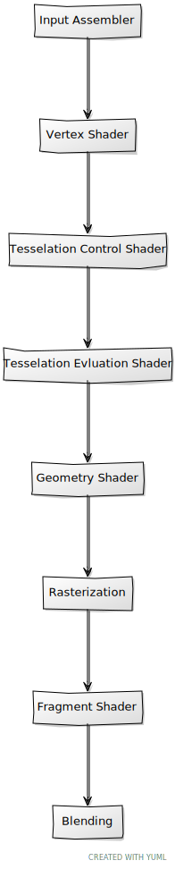
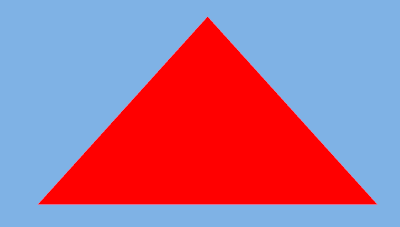

# Chapter 06 - Drawing a triangle

In this chapter we will be finally rendering a shape, developing the required classes to load data to the GPU and using the graphics pipeline. We will start, as in the previous chapters, by explaining the elements that we will need later on to use together to draw something to the screen.

You can find the complete source code for this chapter [here](../../booksamples/chapter-06).

## Buffers

If we want to display 3D models, we need first to load all the vertices information that define them (positions, texture coordinates, indices, etc.). All that information needs to be stored in buffers accessible by the GPU. A buffer in Vulkan is basically a bunch of bytes that can be used for whatever we want, from storing vertices to storing data used for computation. As usual, we will create a new class named `VkBuffer` to manage them. Let's examine the constructor:

```java
public class VkBuffer {
    private final long allocationSize;
    private final long buffer;
    private final long memory;
    private final PointerBuffer pb;
    private final long requestedSize;

    private long mappedMemory;

    public VkBuffer(VkCtx vkCtx, long size, int usage, int reqMask) {
        requestedSize = size;
        mappedMemory = NULL;
        try (var stack = MemoryStack.stackPush()) {
            Device device = vkCtx.getDevice();
            var bufferCreateInfo = VkBufferCreateInfo.calloc(stack)
                    .sType$Default()
                    .size(size)
                    .usage(usage)
                    .sharingMode(VK_SHARING_MODE_EXCLUSIVE);
            LongBuffer lp = stack.mallocLong(1);
            vkCheck(vkCreateBuffer(device.getVkDevice(), bufferCreateInfo, null, lp), "Failed to create buffer");
            buffer = lp.get(0);
            ...
        }
        ...
    }
    ...
}
```

The constructor just receives the `VkCtx` that will be used to create this buffer, its size, a parameter named `usage` which will state what this buffer should be used for and a bit mask. This last parameter is use to set the requested memory properties that the data associated to this buffer should use. We will review how these two last parameters are used later on. In order to create a Buffer we need to setup a structure named `VkBufferCreateInfo`, which defines the following attributes:

- `size`: The number of bytes that the buffer will hold.
- `usage`: It specifies the allowed usages of the buffer. We can specify that this buffer can be used for transfer commands (for example to uses as source in buffer copy operations), as a destination transfer, for uniforms. etc. This will be received in the constructor of the `VulkanBuffer` class through an argument with the same name.
- `sharingMode`: If set to `VK_SHARING_MODE_EXCLUSIVE`, it can only be accessed by a queue family at a time. `VK_SHARING_MODE_CONCURRENT` allows the buffer contents to be accessed by more than one queue family at a time. Concurrent mode incurs on performance penalties, so we will just use exclusive mode.

With that structure we can invoke the `vkCreateBuffer`function to create the buffer handle. It is important to remark, that this call does not allocate the memory for the buffer, we just create the handle, we will need to manually allocate that memory and associate that to the buffer later on. Therefore the next thing we do is to retrieve the memory requirements of the new created buffer, by calling the `vkGetBufferMemoryRequirements` function.

```java
public class VkBuffer {
    ...
    public VkBuffer(VkCtx vkCtx, long size, int usage, int reqMask) {
        ...
            var memReqs = VkMemoryRequirements.calloc(stack);
            vkGetBufferMemoryRequirements(device.getVkDevice(), buffer, memReqs);
        ...
    }
    ...
}
```

The next thing to do is to allocate the memory. Again, in order to achieve that, we need to setup a structure named `VkMemoryAllocateInfo`, which defines the following attributes:

- `allocationSize`: It will hold the size of the memory to be allocated in bytes.
- `memoryTypeIndex`: It will hold the memory type index to be used. The index refers to the memory types available in the device.

```java
public class VulkanBuffer {
    ...
    public VkBuffer(VkCtx vkCtx, long size, int usage, int reqMask) {
        ...
            var memAlloc = VkMemoryAllocateInfo.calloc(stack)
                    .sType$Default()
                    .allocationSize(memReqs.size())
                    .memoryTypeIndex(VkUtils.memoryTypeFromProperties(vkCtx, memReqs.memoryTypeBits(), reqMask));
        ...
    }
    ...
}
```

In order to fill the `memoryTypeIndex` we call the `memoryTypeFromProperties`method from the `VkUtils` class, which is defined like this:

```java
public class VkUtils {
    ...
    public static final int FLOAT_SIZE = 4;
    public static final int INT_SIZE = 4;
    ...
    public static int memoryTypeFromProperties(VkCtx vkCtx, int typeBits, int reqsMask) {
        int result = -1;
        VkMemoryType.Buffer memoryTypes = vkCtx.getPhysDevice().getVkMemoryProperties().memoryTypes();
        for (int i = 0; i < VK_MAX_MEMORY_TYPES; i++) {
            if ((typeBits & 1) == 1 && (memoryTypes.get(i).propertyFlags() & reqsMask) == reqsMask) {
                result = i;
                break;
            }
            typeBits >>= 1;
        }
        if (result < 0) {
            throw new RuntimeException("Failed to find memoryType");
        }
        return result;
    }
    ...
}
```

The `typeBits` attribute is a bit mask which defines the supported memory types of the physical device. A bit set to `1` means that the type of memory (associated to that index) is supported. The `reqMask` attribute is the type of memory that we need (for example if that memory will be accessed only by the GPU or also by the application). This method basically iterates over all the memory types, checking if that memory index (first condition) is supported by the device and if that it meets the requested type (second condition).
You will see we have added some constants that we will use later on to define the size in bytes of `float` and `int` types.

Now we can go back to the `VkBuffer` constructor and invoke the `vkAllocateMemory` to allocate the memory. After that we can get the finally allocated size and get a handle to that chunk of memory. We also allocate a `PointerBuffer` (using `MemoryUtil` class to be more efficient) which will be used in other methods of the class.

```java
public class VkBuffer {
    ...
    public VkBuffer(VkCtx vkCtx, long size, int usage, int reqMask) {
        ...
            vkCheck(vkAllocateMemory(device.getVkDevice(), memAlloc, null, lp), "Failed to allocate memory");
            allocationSize = memAlloc.allocationSize();
            memory = lp.get(0);
            pb = MemoryUtil.memAllocPointer(1);
        ...
    }
    ...
}
```

Now we need to link the allocated memory with the buffer handle, this is done by calling the `vkBindBufferMemory` function:

```java
public class VkBuffer {
    ...
    public VkBuffer(VkCtx vkCtx, long size, int usage, int reqMask) {
       ...
       {
        ...
            vkCheck(vkBindBufferMemory(device.getVkDevice(), buffer, memory, 0), "Failed to bind buffer memory");
        }
    }
    ...
}
```

The constructor is now finished. The next methods are the usual `cleanup` method and some getters for the properties that define the buffer (since the `PointerBuffer` have been allocated using `MemoryUtil` we need to free it manually):

```java
public class VkBuffer {
    ...
    public void cleanup(VkCtx vkCtx) {
        MemoryUtil.memFree(pb);
        VkDevice vkDevice = vkCtx.getDevice().getVkDevice();
        vkDestroyBuffer(vkDevice, buffer, null);
        vkFreeMemory(vkDevice, memory, null);
    }

    public long getBuffer() {
        return buffer;
    }

    public long getRequestedSize() {
        return requestedSize;
    }
    ...
}
```

To complete the class, we define two methods to map and un-map the memory associated to the buffer so it can be accessed from our application (if they have been created with the flag `VK_MEMORY_PROPERTY_HOST_VISIBLE_BIT`, more on this later on). The `map` method just calls the `vkMapMemory` function which returns a handle that can be used to get a buffer to read / write its contents. The `unMap` method just calls the `vkUnmapMemory` to un-map the previously mapped buffer memory:
```java
public class VulkanBuffer {
    ...
    public long map(VkCtx vkCtx) {
        if (mappedMemory == NULL) {
            vkCheck(vkMapMemory(vkCtx.getDevice().getVkDevice(), memory, 0, allocationSize, 0, pb), "Failed to map Buffer");
            mappedMemory = pb.get(0);
        }
        return mappedMemory;
    }

    public void unMap(VkCtx vkCtx) {
        if (mappedMemory != NULL) {
            vkUnmapMemory(vkCtx.getDevice().getVkDevice(), memory);
            mappedMemory = NULL;
        }
    }
}
```

## Vertex description

We have now created the buffers required to hold the data for vertices, the next step is to describe to Vulkan the format of that data. As you can guess, depending on the specific case, the structure of that data may change, we may have just position coordinates, or position with texture coordinates and normals, etc. Some of the vulkan elements that we will define later on, will need a handle to that structure. In order to support this, we will create a class named `VtxBuffStruct` which is defined like this:

```java
package org.vulkanb.eng.graph.scn;

import org.lwjgl.vulkan.*;
import org.vulkanb.eng.graph.vk.VkUtils;

import static org.lwjgl.vulkan.VK13.*;

public class VtxBuffStruct {
    private static final int NUMBER_OF_ATTRIBUTES = 1;
    private static final int POSITION_COMPONENTS = 3;

    private final VkPipelineVertexInputStateCreateInfo vi;
    private final VkVertexInputAttributeDescription.Buffer viAttrs;
    private final VkVertexInputBindingDescription.Buffer viBindings;

    public VtxBuffStruct() {
        viAttrs = VkVertexInputAttributeDescription.calloc(NUMBER_OF_ATTRIBUTES);
        viBindings = VkVertexInputBindingDescription.calloc(1);
        vi = VkPipelineVertexInputStateCreateInfo.calloc();

        int i = 0;
        int offset = 0;
        // Position
        viAttrs.get(i)
                .binding(0)
                .location(i)
                .format(VK_FORMAT_R32G32B32_SFLOAT)
                .offset(offset);

        viBindings.get(0)
                .binding(0)
                .stride(POSITION_COMPONENTS * VkUtils.FLOAT_SIZE)
                .inputRate(VK_VERTEX_INPUT_RATE_VERTEX);

        vi
                .sType$Default()
                .pVertexBindingDescriptions(viBindings)
                .pVertexAttributeDescriptions(viAttrs);
    }

    public void cleanup() {
        viBindings.free();
        viAttrs.free();
    }

    public VkPipelineVertexInputStateCreateInfo getVi() {
        return vi;
    }
}
```

At the beginning of the constructor we create several structures required for Vulkan to understand how our vertices will be used:

- `VkVertexInputAttributeDescription`: It is used to describe each vertex attribute.
- `VkVertexInputBindingDescription`: It is used to specify if the boundaries of each vertex "package" and how it will consumed (per instance or per vertex).
- `VkPipelineVertexInputStateCreateInfo`: This will hold the vertices format that will be used in a Vulkan pipeline (more on this later). It will hold the previous two structures.

We need to fill up as many attribute descriptors as input variables describing the input we will have in our shaders. In our case, by now, we will just use one attribute for the position, so we only include one description. The attributes of `VkVertexInputAttributeDescription` are:

- `binding`: The binding number associated to this vertex description. This will be used later on the shaders so we can use several vertices descriptions independently associated to different binding points. 
- `format`: The format of this attribute, in this case we are saying that we will be using three 32 bit signed floats.
- `offset`: The relative offset in bytes for this attribute when processing one vertex element. The buffer will contain many vertices. Each of them can have different attributes (positions, texture coordinates). This offset refers to the position of this attribute to the beginning of each vertex element. This is the first attribute so it should be `0`.

After that, we will fill up the binding description. The attributes of `VkVertexInputBindingDescription` are:

- `binding`: The same meaning as in the vertices attributes description.
- `stride`: The distance in bytes from two consecutive elements in the buffer. In our case, we are using 32 bit floats for the positions (4 bytes each) and three position components (x, y, z).
- `inputRate`: It specifies the rate at which vertex attributes are pulled from the underlying buffer. It can have two possible values:
  - `VK_VERTEX_INPUT_RATE_VERTEX`: Values will be extracted for each vertex index. That is, when consuming an index we will get one element form the buffer. This is the regular case when drawing a mesh, the vertex data is associated to a specific index and will be consumed accordingly.
  - `VK_VERTEX_INPUT_RATE_INSTANCE`: Values will be extracted for each instance index. This will be the case used for instanced rendering, where with a single buffer defining the common attributes (mesh definition) we can draw many models with a single draw call. The buffer will hold common data for all the models and per-instance data, therefore we will need to combine the two types of input rate.

To finalize the constructor, we glue all the previous structures in the  `VkPipelineVertexInputStateCreateInfo`structure.

The rest of the methods are the usual suspects, the `cleanup` one  to free the resources and another one to get the `VkPipelineVertexInputStateCreateInfo` reference:

```java
public class VtxBuffStruct {
    ...
    public void cleanup() {
        viBindings.free();
        viAttrs.free();
    }

    public VkPipelineVertexInputStateCreateInfo getVi() {
        return vi;
    }
}
```

## Loading the data

We have created the the structures that will hold the data for our models (`VkBuffer`) and the ones that define their format (`VtxBuffStruct`). We are now ready to load the data into the GPU. In essence, we need to load the data into two buffers, one for the positions of the vertices and another one for the indices of the triangle coordinates that wll be used to actually form the triangles. We will define a new class named `VulkanModel` which will hold the information for 3D models. For now, it will hold the buffers for the different meshes that compose a 3D model. In next chapters it will be extended to support richer structures. At this moment a model is just a collection of meshes which will hold the references to buffers that contain positions data and their indices. This class will also define the methods to populate those structures. The basic structure of this class is quite simple:

```java
package org.vulkanb.eng.graph;

import org.vulkanb.eng.graph.vk.VkCtx;

import java.util.*;

public class VulkanModel {

    private final String id;
    private final List<VulkanMesh> vulkanMeshList;

    public VulkanModel(String id) {
        this.id = id;
        vulkanMeshList = new ArrayList<>();
    }

    public void cleanup(VkCtx vkCtx) {
        vulkanMeshList.forEach(mesh -> mesh.cleanup(vkCtx));
    }

    public String getId() {
        return id;
    }

    public List<VulkanMesh> getVulkanMeshList() {
        return vulkanMeshList;
    }
}
```

This class just stores a List of meshes, defined by the `VulkanMesh` record, which contain the buffers associated to the vertices positions and the indices. It provides a method to get the model identifier (it should unique per application), the associated meshes data and a `cleanup` method.

The `VulkanMesh` class is quite simple:

```java
package org.vulkanb.eng.graph;

import org.vulkanb.eng.graph.vk.*;

public record VulkanMesh(String id, VkBuffer verticesBuffer, VkBuffer indicesBuffer, int numIndices) {
    public void cleanup(VkCtx vkCtx) {
        verticesBuffer.cleanup(vkCtx);
        indicesBuffer.cleanup(vkCtx);
    }
}
```

It is just a record which contains the vertices and indices buffers and the number of indices.

We will see later on how we can load that data into the GPU from raw data. That raw data is encapsulated in two classes named `ModelData` and `MeshData` which are defined like this:

```java
package org.vulkanb.eng.model;

import java.util.List;

public record ModelData(String id, List<MeshData> meshes) {
}
```

```java
package org.vulkanb.eng.model;

public record MeshData(String id, float[] positions, int[] indices) {
}
```

As you can see the `ModelData` and `MeshData` are quite simple just records which hold list ¡fo meshes which are arrays of floats and indices. Just raw model data.

Now it is the turn to see how we can pass from raw data to populate the buffers that can be used by the GPU. This will be done in the `ModelsCache` class, which will 
store references to `VulkanModel`s instances by id and will encapsulate all the transformation operations. It starts like this:

```java
package org.vulkanb.eng.graph;

import org.lwjgl.system.MemoryUtil;
import org.vulkanb.eng.graph.vk.Queue;
import org.vulkanb.eng.graph.vk.*;
import org.vulkanb.eng.model.*;

import java.nio.*;
import java.util.*;

import static org.lwjgl.vulkan.VK10.*;

public class ModelsCache {

    private final Map<String, VulkanModel> modelsMap;

    public ModelsCache() {
        modelsMap = new HashMap<>();
    }
    ...
}
```

As you can see all the `VulkanModel`s instances will be stored in a `Map` indexed by its identifier.As it has been shown before, each `VulkanMesh` instance has two buffers, one for positions and another one for the indices. These buffers will be used by the GPU while rendering but we need to access them from the CPU in order to load the data into them. We could use buffers that are accessible from both the CPU and the GPU, but the performance would be worse than buffers that can only used by the GPU. So, how do we solve this? The answer is by using intermediate buffers:

1. We first create an intermediate buffer (or staging buffer) that can be accessed both by the CPU and the GPU. This will be our source buffer.
2. We create another buffer that can be accessed only from the GPU. This will be our destination buffer.
3. We load the data into the source buffer (the intermediate buffer) from our application (CPU).
4. We copy the source buffer into the destination buffer.
5. We destroy the source buffer (the intermediate buffer). It is not needed anymore.

This will be done in the `loadModels` method inside `ModelsCache` class. Keep in mind, that it should be used at the initialization stage as a bulk loading mechanism (more efficient). Copying from one buffer to another implies submitting a transfer command to a queue and waiting for it to complete. Instead of submitting these operations one by one, we can record all these commands into a single `CommandBuffer`, submit them just once and also wait once for the commands to be finished. This will be much more efficient than submitting small commands one at a time.

The `loadModels` method starts like this:

```java
public class ModelsCache {
    ...
    public void loadModels(VkCtx vkCtx, List<ModelData> models, CmdPool cmdPool, Queue queue) {
        List<VkBuffer> stagingBufferList = new ArrayList<>();

        var cmd = new CmdBuffer(vkCtx, cmdPool, true, true);
        cmd.beginRecording();
        ...
    }
    ...
}
```

The method starts by creating a list, named `stagingBufferList`, that will contain the CPU accessible buffers (the staging buffers), so we can destroy them after the copy operations have finished. It also creates a new `CmdBuffer` which will be used to record the copy operations that involve the different buffers used and start the recording. AFter that, we start the recording. The next step is to iterate over the models and their associated meshes:

```java
public class ModelsCache {
    ...
    public void loadModels(VkCtx vkCtx, List<ModelData> models, CmdPool cmdPool, Queue queue) {
        ...
        for (ModelData modelData : models) {
            VulkanModel vulkanModel = new VulkanModel(modelData.id());
            modelsMap.put(vulkanModel.getId(), vulkanModel);

            // Transform meshes loading their data into GPU buffers
            for (MeshData meshData : modelData.meshes()) {
                TransferBuffer verticesBuffers = createVerticesBuffers(vkCtx, meshData);
                TransferBuffer indicesBuffers = createIndicesBuffers(vkCtx, meshData);
                stagingBufferList.add(verticesBuffers.srcBuffer());
                stagingBufferList.add(indicesBuffers.srcBuffer());
                verticesBuffers.recordTransferCommand(cmd);
                indicesBuffers.recordTransferCommand(cmd);

                VulkanMesh vulkanMesh = new VulkanMesh(meshData.id(), verticesBuffers.dstBuffer(),
                        indicesBuffers.dstBuffer(), meshData.indices().length);
                vulkanModel.getVulkanMeshList().add(vulkanMesh);
            }
        }

        cmd.endRecording();
        cmd.submitAndWait(vkCtx, queue);
        cmd.cleanup(vkCtx, cmdPool);

        stagingBufferList.forEach(b -> b.cleanup(vkCtx));
    }
    ...
}
```

For each of these meshes, we get the vertices and the indices and record the commands that will copy from the staging buffer to the destination buffer. The `createVerticesBuffers` method creates the intermediate buffer, loads the positions into it and also creates the final (GPU accessible only) buffer. The source and destination buffers are returned encapsulated into a `record` named `TransferBuffer`. A similar approach is made for indices in the `createIndicesBuffers` method.

The `TransferBuffer` class is defined like this:
```java
package org.vulkanb.eng.graph;

import org.lwjgl.system.MemoryStack;
import org.lwjgl.vulkan.VkBufferCopy;
import org.vulkanb.eng.graph.vk.*;

import static org.lwjgl.vulkan.VK10.vkCmdCopyBuffer;

public record TransferBuffer(VkBuffer srcBuffer, VkBuffer dstBuffer) {

    public void recordTransferCommand(CmdBuffer cmd) {
        try (var stack = MemoryStack.stackPush()) {
            VkBufferCopy.Buffer copyRegion = VkBufferCopy.calloc(1, stack)
                    .srcOffset(0).dstOffset(0).size(srcBuffer.getRequestedSize());
            vkCmdCopyBuffer(cmd.getVkCommandBuffer(), srcBuffer.getBuffer(), dstBuffer.getBuffer(), copyRegion);
        }
    }
}
```

It defines a `recordTransferCommand` method, which first defines a copy region, by filling up a `VkBufferCopy` buffer, which will have the whole size of the staging buffer. Then we record the copy command, by calling the `vkCmdCopyBuffer` function.

Going back to the `ModelsCache` class, Let's review first the `createVerticesBuffers` method:

```java
public class ModelsCache {
    ...
    private static TransferBuffer createVerticesBuffers(VkCtx vkCtx, MeshData meshData) {
        float[] positions = meshData.positions();
        int numElements = positions.length;
        int bufferSize = numElements * VkUtils.FLOAT_SIZE;

        var srcBuffer = new VkBuffer(vkCtx, bufferSize,
                VK_BUFFER_USAGE_TRANSFER_SRC_BIT, VK_MEMORY_PROPERTY_HOST_VISIBLE_BIT | VK_MEMORY_PROPERTY_HOST_COHERENT_BIT);
        var dstBuffer = new VkBuffer(vkCtx, bufferSize,
                VK_BUFFER_USAGE_TRANSFER_DST_BIT | VK_BUFFER_USAGE_VERTEX_BUFFER_BIT, VK_MEMORY_PROPERTY_DEVICE_LOCAL_BIT);

        long mappedMemory = srcBuffer.map(vkCtx);
        FloatBuffer data = MemoryUtil.memFloatBuffer(mappedMemory, (int) srcBuffer.getRequestedSize());

        int rows = positions.length / 3;
        for (int row = 0; row < rows; row++) {
            int startPos = row * 3;
            data.put(positions[startPos]);
            data.put(positions[startPos + 1]);
            data.put(positions[startPos + 2]);
        }

        srcBuffer.unMap(vkCtx);

        return new TransferBuffer(srcBuffer, dstBuffer);
    }
    ...
}
```

The intermediate buffer, `srcBuffer`, is created with the `VK_BUFFER_USAGE_TRANSFER_SRC_BIT` flag as its usage parameter. With this flag we state that this buffer can be used as the source of a transfer command. For the `reqMask` attribute we use the combination of two flags:

- `VK_MEMORY_PROPERTY_HOST_VISIBLE_BIT`: This means that the memory allocated by this buffer can be mapped and accessed by the CPU. This is what we need in order to populate with the mesh data.
- `VK_MEMORY_PROPERTY_HOST_COHERENT_BIT`: This means that we do not need to execute flushing commands when the CPU writes to this buffer or vice versa.

The destination buffer is created with the `VK_BUFFER_USAGE_TRANSFER_DST_BIT` as its usage parameter. With this flag we state that this buffer can used as the destination of a transfer command. We also set the flag `VK_BUFFER_USAGE_VERTEX_BUFFER_BIT` since it will be used for handling vertices data. For the `reqMask` attribute we use the `VK_MEMORY_PROPERTY_DEVICE_LOCAL_BIT` flag which states that the memory allocated by this buffer will be used by the GPU.

Once the buffers have been created we need to populate the source buffer. In order to do that, we need to map that memory in order to get a pointer to it so we can upload the data. This is done by calling the `map` method on the buffer instance. Now we have a pointer to the memory of the buffer which we will use to load the positions. After we have finished copying the data to the source buffer we call the `unMap` method over the buffer.

The definition of the `createIndicesBuffers` is similar:

```java
public class public class ModelsCache {
    ...
    private static TransferBuffer createIndicesBuffers(VkCtx vkCtx, MeshData meshData) {
        int[] indices = meshData.indices();
        int numIndices = indices.length;
        int bufferSize = numIndices * VkUtils.INT_SIZE;

        var srcBuffer = new VkBuffer(vkCtx, bufferSize,
                VK_BUFFER_USAGE_TRANSFER_SRC_BIT, VK_MEMORY_PROPERTY_HOST_VISIBLE_BIT | VK_MEMORY_PROPERTY_HOST_COHERENT_BIT);
        var dstBuffer = new VkBuffer(vkCtx, bufferSize,
                VK_BUFFER_USAGE_TRANSFER_DST_BIT | VK_BUFFER_USAGE_INDEX_BUFFER_BIT, VK_MEMORY_PROPERTY_DEVICE_LOCAL_BIT);

        long mappedMemory = srcBuffer.map(vkCtx);
        IntBuffer data = MemoryUtil.memIntBuffer(mappedMemory, (int) srcBuffer.getRequestedSize());
        data.put(indices);
        srcBuffer.unMap(vkCtx);

        return new TransferBuffer(srcBuffer, dstBuffer);
    }
    ...
}
```
The major difference is that, in this case, the usage flag is `VK_BUFFER_USAGE_INDEX_BUFFER_BIT` for the destination buffer.

The `ModelsCache` class is completed by the `cleanup` method (to free resources) and some *getters* to find a model by its identifier or all the loaded models.

```java
public class public class ModelsCache {
    ...
    public void cleanup(VkCtx vkCtx) {
        modelsMap.forEach((k, t) -> t.cleanup(vkCtx));
        modelsMap.clear();
    }

    public VulkanModel getModel(String modelName) {
        return modelsMap.get(modelName);
    }

    public Map<String, VulkanModel> getModelsMap() {
        return modelsMap;
    }
}
```
## Graphics pipeline overview

A graphics pipeline is a model which describes the steps required to render graphics into a screen. In Vulkan this is modeled using a data structure. You can think on a pipeline as a sequence of stages which are traversed by the recorded commands as they are
executed. Those steps can be classified as fixed and programmable. Fixed steps can only be controlled by setting up some 
parameters at pipeline creation time. Programmable steps are defined by programs called shaders. The following picture depicts Vulkan graphics pipeline.



Description of the stages (NOTE: graphics pipeline in Vulkan can also work in mesh shading mode, in this case we are referring to primitive shading mode. More information in the Vulkan [specification]((https://www.khronos.org/registry/vulkan/specs/1.1-extensions/html/vkspec.html#pipelines):

- Input Assembler: It is the responsible of assembling vertices to form graphics primitives such as triangles.
- Vertex shader: In this stage we transform the vertices received as inputs (positions, normals, texture coordinates, etc.). It is a programmable stage.
- Tesselation and geometry shader stages can generate  multiple primitives form a single input primitive or modify them received from previous stages.  These stages are also programmable through shaders.
- Rasterization: This stage transform primitives into fragments (pixels) that can be displayed on a 2D image.
- Fragment shader: Processes the fragments from the rasterization stage determining the values that will be written into the frame buffer output attachments. This is also a programmable stage which usually outputs the color for each pixel.
- Blending: Controls how different fragments can be mixed over the same pixel handling aspects such as transparencies and color mixing.

One important topic to understand when working with Vulkan pipelines is that they are almost immutable. Unlike OpenGL, we can't modify at run time the properties of a graphics pipeline. Almost any change that we want to make implies the creation of a new pipeline. For example, in OpenGL it is common to modify ay runtime certain parameters that control how transparencies are handled (blending) or if the depth-testing is enabled. In OpenGL we can modify those parameters at run time with no restrictions. (The reality is that under the hood, our driver is switching between pipelines definitions that meet those settings). In Vulkan, however, we will need to define multiple pipelines if we want to change those settings while rendering and switch between them manually. 

## Shaders

Prior to start defining the pipeline we will write the code for handling shaders. As it has just been said above, shaders allow us to control, using code, the pipeline stages that are programmable. If you come from OpenGL, you are used to program the shaders in GLSL language, if you come from DirectX you will use HLSL language. In this case, Vulkan uses a different approach and uses a binary format called SPIR-V. Both GLSL and HLSL are human readable languages, that imposes extra overhead on the drivers that need to parse those formats and convert their instructions into something that can be used by the GPU. Another issue with these formats is the different implementation behaviors that can arise when different vendors perform different assumptions, since the complexity of the parsers required leave room for different interpretations. Vulkan, by using a binary format, reduces the complexity on the drivers, reducing also the time required to load them. As a bonus, you can still develop your shaders in your favorite language (GLSL or HLSL) and transform them to SPIR-V using an external compiler. In this book, we will  use GLSL language, providing specific tools to automatically convert them to SPIR-V.

Shader programs are composed by modules, being a module the shader code to execute in vertex shading stage, fragment shading stage, etc.
In order to manage them, we will create a new class named `ShaderModule` which is defined like this:

```java
package org.vulkanb.eng.graph.vk;

import org.lwjgl.system.MemoryStack;
import org.lwjgl.vulkan.VkShaderModuleCreateInfo;
import org.tinylog.Logger;

import java.io.*;
import java.nio.*;
import java.nio.file.Files;

import static org.lwjgl.vulkan.VK13.*;
import static org.vulkanb.eng.graph.vk.VkUtils.vkCheck;

public class ShaderModule {

    private final long handle;
    private final int shaderStage;

    public ShaderModule(VkCtx vkCtx, int shaderStage, String shaderSpvFile) {
        try {
            byte[] moduleContents = Files.readAllBytes(new File(shaderSpvFile).toPath());
            handle = createShaderModule(vkCtx, moduleContents);
            this.shaderStage = shaderStage;
        } catch (IOException excp) {
            Logger.error("Error reading shader file", excp);
            throw new RuntimeException(excp);
        }
    }

    private static long createShaderModule(VkCtx vkCtx, byte[] code) {
        try (var stack = MemoryStack.stackPush()) {
            ByteBuffer pCode = stack.malloc(code.length).put(0, code);

            var moduleCreateInfo = VkShaderModuleCreateInfo.calloc(stack)
                    .sType$Default()
                    .pCode(pCode);

            LongBuffer lp = stack.mallocLong(1);
            vkCheck(vkCreateShaderModule(vkCtx.getDevice().getVkDevice(), moduleCreateInfo, null, lp),
                    "Failed to create shader module");

            return lp.get(0);
        }
    }

    public void cleanup(VkCtx vkCtx) {
        vkDestroyShaderModule(vkCtx.getDevice().getVkDevice(), handle, null);
    }

    public long getHandle() {
        return handle;
    }

    public int getShaderStage() {
        return shaderStage;
    }
}
```

A shader module, once created is defined by a pointer which is stored in the `handle` attribute.
The constructor receives the Vulkan context, the stage associated to the module (vertex shader, fragment shader) and the path to the
SPIR-V file. It read all the contents of the file and calls the `createShaderModule`, which basically creates the module by
calling the `vkCreateShaderModule` which needs the contents of the SPIR-V file loaded in a `VkShaderModuleCreateInfo` structure.

Now we need to be able to compile from GLSL source code to SPIR-V. We need to add a new dependency to the POM file to use the `shaderc` bindings:

```xml
<?xml version="1.0" encoding="UTF-8"?>
<project xmlns:xsi="http://www.w3.org/2001/XMLSchema-instance"
         xmlns="http://maven.apache.org/POM/4.0.0"
         xsi:schemaLocation="http://maven.apache.org/POM/4.0.0 http://maven.apache.org/xsd/maven-4.0.0.xsd">
...
    <dependencies>
...
        <dependency>
            <groupId>org.lwjgl</groupId>
            <artifactId>lwjgl-shaderc</artifactId>
            <version>${lwjgl.version}</version>
        </dependency>
...
        <dependency>
            <groupId>org.lwjgl</groupId>
            <artifactId>lwjgl-shaderc</artifactId>
            <version>${lwjgl.version}</version>
            <classifier>${native.target}</classifier>
            <scope>runtime</scope>
        </dependency>
...
    </dependencies>
</project>
```

We do not want to compile the whole set of shaders every time we start the application, we just want to compile if the source code changes. We will provide a utility method named `compileShaderIfChanged` in a separate class named `ShaderCompiler` which is defined like this:

```java
package org.vulkanb.eng.graph.vk;

import org.lwjgl.util.shaderc.Shaderc;
import org.tinylog.Logger;
import org.vulkanb.eng.EngCfg;

import java.io.*;
import java.nio.ByteBuffer;
import java.nio.file.Files;

public class ShaderCompiler {

    private ShaderCompiler() {
        // Utility class
    }

    public static byte[] compileShader(String shaderCode, int shaderType) {
        long compiler = 0;
        long options = 0;
        byte[] compiledShader;

        try {
            compiler = Shaderc.shaderc_compiler_initialize();
            options = Shaderc.shaderc_compile_options_initialize();
            if (EngCfg.getInstance().isDebugShaders()) {
                Shaderc.shaderc_compile_options_set_generate_debug_info(options);
                Shaderc.shaderc_compile_options_set_optimization_level(options, 0);
                Shaderc.shaderc_compile_options_set_source_language(options, Shaderc.shaderc_source_language_glsl);
            }

            long result = Shaderc.shaderc_compile_into_spv(
                    compiler,
                    shaderCode,
                    shaderType,
                    "shader.glsl",
                    "main",
                    options
            );

            if (Shaderc.shaderc_result_get_compilation_status(result) != Shaderc.shaderc_compilation_status_success) {
                throw new RuntimeException("Shader compilation failed: " + Shaderc.shaderc_result_get_error_message(result));
            }

            ByteBuffer buffer = Shaderc.shaderc_result_get_bytes(result);
            compiledShader = new byte[buffer.remaining()];
            buffer.get(compiledShader);
        } finally {
            Shaderc.shaderc_compile_options_release(options);
            Shaderc.shaderc_compiler_release(compiler);
        }

        return compiledShader;
    }

    public static void compileShaderIfChanged(String glsShaderFile, int shaderType) {
        byte[] compiledShader;
        try {
            var glslFile = new File(glsShaderFile);
            var spvFile = new File(glsShaderFile + ".spv");
            if (!spvFile.exists() || glslFile.lastModified() > spvFile.lastModified()) {
                Logger.debug("Compiling [{}] to [{}]", glslFile.getPath(), spvFile.getPath());
                var shaderCode = new String(Files.readAllBytes(glslFile.toPath()));

                compiledShader = compileShader(shaderCode, shaderType);
                Files.write(spvFile.toPath(), compiledShader);
            } else {
                Logger.debug("Shader [{}] already compiled. Loading compiled version: [{}]", glslFile.getPath(), spvFile.getPath());
            }
        } catch (IOException excp) {
            throw new RuntimeException(excp);
        }
    }
}
```

The `compileShaderIfChanged` method receives the path to a GLSL file defining a shader model and the shader type. 
It checks if the SPIR-V file exists or if the GLSL file modification date is newer than the one associated to the SPIR-V file.
In that case, it loads the GLSL contents and delegates the compilation itself into the `compileShader` method. Once compiled
it writes the result to a file constructed with the same path but adding the `.spv` extension. 

The `compileShader` method first checks if debugging shader is enabled from global configuration file. If so, we need to setup
some special instructions so we can debug shaders using the original GLSL source code in tools like [Renderdoc](https://renderdoc.org/).
After that, we invokes the `shaderc_result_get_compilation_status` from the `Shaderc` compiler binding provided by LWJGL to
compile GLS into SPIR-V.

## Pipeline

The next step is to write the code that supports graphic pipelines creation. Prior to talking about pipelines specifically, we will talk about the pipeline cache. As mentioned before, while working with Vulkan, it is very common to have multiple pipelines. Pipelines are almost immutable, so any variant on the setup of the different stage requires a new pipeline instance. In order to speed up pipeline creation Vulkan introduces the concept of the Pipeline cache. The cache allows more efficient pipeline creation by reusing the common parts between them and also between application executions. It is possible, for example, to persist the contents of the cache to disk, and load them at startup time in the next run of our application reducing the time required to create them. In our case, we will limit, at this time, the usage of the pipeline cache. For now we will just use it to speed up pipe line re-creation during application execution. We need to create a new class named `PipelineCache` which is defined like this:

```java
package org.vulkanb.eng.graph.vk;

import org.lwjgl.system.MemoryStack;
import org.lwjgl.vulkan.VkPipelineCacheCreateInfo;
import org.tinylog.Logger;

import java.nio.LongBuffer;

import static org.lwjgl.vulkan.VK13.*;
import static org.vulkanb.eng.graph.vk.VkUtils.vkCheck;

public class PipelineCache {
    private final long vkPipelineCache;

    public PipelineCache(Device device) {
        Logger.debug("Creating pipeline cache");
        try (var stack = MemoryStack.stackPush()) {
            var createInfo = VkPipelineCacheCreateInfo.calloc(stack).sType$Default();

            LongBuffer lp = stack.mallocLong(1);
            vkCheck(vkCreatePipelineCache(device.getVkDevice(), createInfo, null, lp),
                    "Error creating pipeline cache");
            vkPipelineCache = lp.get(0);
        }
    }

    public void cleanup(Device device) {
        Logger.debug("Destroying pipeline cache");
        vkDestroyPipelineCache(device.getVkDevice(), vkPipelineCache, null);
    }

    public long getVkPipelineCache() {
        return vkPipelineCache;
    }
}
```

This is a simple class, we just invoke the `vkCreatePipelineCache`to create the cache and provide the usual `getters` and `cleanup` methods. We will instantiate this class in the `VkCtx` class:

```java
public class VkCtx {
    ...
    private final PipelineCache pipelineCache;
    ...
    public VkCtx(Window window) {
        ...
        pipelineCache = new PipelineCache(device);
    }

    public void cleanup() {
        pipelineCache.cleanup(device);
        ...
    }
    ...
    public PipelineCache getPipelineCache() {
        return pipelineCache;
    }
    ...
}
```

Creating a pipeline is a complex process, and it will require us to select multiple parameters. In order to properly control most
of the parameters we will create a class that will contain all the initialization information to create the pipeline.
This class is named `PipelineBuildInfo` and is defined like this:

```java
package org.vulkanb.eng.graph.vk;

import org.lwjgl.vulkan.VkPipelineVertexInputStateCreateInfo;

public class PipelineBuildInfo {

    private final int colorFormat;
    private final ShaderModule[] shaderModules;
    private final VkPipelineVertexInputStateCreateInfo vi;

    public PipelineBuildInfo(ShaderModule[] shaderModules, VkPipelineVertexInputStateCreateInfo vi, int colorFormat) {
        this.shaderModules = shaderModules;
        this.vi = vi;
        this.colorFormat = colorFormat;
    }

    public int getColorFormat() {
        return colorFormat;
    }

    public ShaderModule[] getShaderModules() {
        return shaderModules;
    }

    public VkPipelineVertexInputStateCreateInfo getVi() {
        return vi;
    }
}
```

The class stores:
- The list of shader modules that this pipeline will use.
- The definition of the vertices structure.
- The color format of the color attachments that we will use for the pipeline.

The constructor of the `Pipeline`class starts like this:

```java
package org.vulkanb.eng.graph.vk;

import org.lwjgl.system.MemoryStack;
import org.lwjgl.vulkan.*;
import org.tinylog.Logger;

import java.nio.*;

import static org.lwjgl.vulkan.VK13.*;
import static org.vulkanb.eng.graph.vk.VkUtils.vkCheck;

public class Pipeline {

    private final long vkPipeline;
    private final long vkPipelineLayout;

    public Pipeline(VkCtx vkCtx, PipelineBuildInfo buildInfo) {
        Logger.debug("Creating pipeline");
        Device device = vkCtx.getDevice();
        try (var stack = MemoryStack.stackPush()) {
            LongBuffer lp = stack.mallocLong(1);

            ByteBuffer main = stack.UTF8("main");

            ShaderModule[] shaderModules = buildInfo.getShaderModules();
            int numModules = shaderModules.length;
            var shaderStages = VkPipelineShaderStageCreateInfo.calloc(numModules, stack);
            for (int i = 0; i < numModules; i++) {
                ShaderModule shaderModule = shaderModules[i];
                shaderStages.get(i)
                        .sType$Default()
                        .stage(shaderModule.getShaderStage())
                        .module(shaderModule.getHandle())
                        .pName(main);
            }
            ...
        }
    }
}
```

The first thing we do is to create as many `VkPipelineShaderStageCreateInfo` structures as shader modules we have. For each of them we set the stage that it should be applied to, the handle to the module itself and the name of the entry point of the shader for that stage (`pName`). In our case we will use the `String` `main`.
 Concerning the shader stages, we cannot use the same constants as when compiling the shaders, we need to use Vulkan constant, not the ones defined by `shaderc`. For example for a vertex shader we should use the `VK_SHADER_STAGE_VERTEX_BIT` constant and for fragment shaders we should use the `VK_SHADER_STAGE_FRAGMENT_BIT` value. After that, we set-up the input assembly stage:

```java
public class Pipeline {
    ...
    public Pipeline(VkCtx vkCtx, PipelineBuildInfo buildInfo) {
        ...
            var assemblyStateCreateInfo = VkPipelineInputAssemblyStateCreateInfo.calloc(stack)
                    .sType$Default()
                    .topology(VK_PRIMITIVE_TOPOLOGY_TRIANGLE_LIST);
        ...
    }
    ...
}
```

The input assembly stage take a set of vertices and produces a set of primitives. The primitives to be produced are defined in the `topology` attribute. In our case, we will generate a list of triangles (`VK_PRIMITIVE_TOPOLOGY_TRIANGLE_LIST`). We could generate other types such as points (`VK_PRIMITIVE_TOPOLOGY_POINT_LIST`), lines (`VK_PRIMITIVE_TOPOLOGY_LINE_LIST`), triangle strips (`VK_PRIMITIVE_TOPOLOGY_TRIANGLE_STRIP`), etc. For our examples we can leave that parameter fixed to the `VK_PRIMITIVE_TOPOLOGY_TRIANGLE_LIST` value.

The next step is to define how many view ports and scissors we are going to use. The view port describes the region from the output attachments that we will be using for rendering (normally we will use the whole size of those buffers). The view port defines the transformation from normalized coordinates to screen coordinates. Since it is a transformation, the rendered image will be stretched or enlarged to fit the dimensions of the view port. The scissor defines a rectangle where outputs can be made, any pixel that lays out side that region will be discarded. Scissors are not transformations, they simply cut out regions that do not fit their dimensions. In our case, we will be using just one view port and one scissor (we need at least one). 

```java
public class Pipeline {
    ...
    public Pipeline(VkCtx vkCtx, PipelineBuildInfo buildInfo) {
        ...
            var viewportStateCreateInfo = VkPipelineViewportStateCreateInfo.calloc(stack)
                    .sType$Default()
                    .viewportCount(1)
                    .scissorCount(1);
        ...
    }
    ...
}
```

After that we configure the rasterization stage:

```java
public class Pipeline {
    ...
    public Pipeline(VkCtx vkCtx, PipelineBuildInfo buildInfo) {
        ...
            var rasterizationStateCreateInfo = VkPipelineRasterizationStateCreateInfo.calloc(stack)
                    .sType$Default()
                    .polygonMode(VK_POLYGON_MODE_FILL)
                    .cullMode(VK_CULL_MODE_NONE)
                    .frontFace(VK_FRONT_FACE_CLOCKWISE)
                    .lineWidth(1.0f);
        ...
    }
    ...
}
```

Description of the parameters:

- `polygonMode`: It specifies how triangles should be rendered: In our case we want the triangles to be filled up with the color assigned in the fragments. For example, if we want to draw it as lines (as in OpenGL, the equivalent would be to use this line: `glPolygonMode( GL_FRONT_AND_BACK, GL_LINE )`)  we should use `VK_POLYGON_MODE_LINE`.
- `cullMode`: This is used if we want to apply culling (for example, not drawing triangles that are in the inner parts of models). By now we are not applying culling, but we can activate it according to the orientation of the vertices of the triangles.
- `frontFace`: It specifies how front face for culling is determined. In our case, we set to `VK_FRONT_FACE_CLOCKWISE`, that is, if the vertices are drawn in clockwise order they are considered as clock wise.
- `lineWidth`: It specifies the width of the rasterized fragments.

The next step is to define how multi-sampling will be done. Multi-sampling is used in anti-aliasing to reduce the artifacts produced by the fact that pixels are discrete elements which cannot perfectly model continuous space. By taking multiple samples of adjacent fragments when setting the color of a pixel, borders are smoothed and the quality of the images is often better. This is done by creating a `VkPipelineMultisampleStateCreateInfo` structure. In this case we are not using multiple samples so we just set the number of samples to one bit (`VK_SAMPLE_COUNT_1_BIT`):

```java
public class Pipeline {
    ...
    public Pipeline(VkCtx vkCtx, PipelineBuildInfo buildInfo) {
        ...
            var multisampleStateCreateInfo = VkPipelineMultisampleStateCreateInfo.calloc(stack)
                    .sType$Default()
                    .rasterizationSamples(VK_SAMPLE_COUNT_1_BIT);
        ...
    }
    ...
}
```

We have said before that pipelines are almost immutable, there are only a few things that we can modify once the pipeline has been created. We can change a fixed set of things, such as the view port size, the scissor region size, the blend constants, etc. We need to specify the values that could be changed dynamically. In our case, we do not want to recreate the pipeline if the window is resized, so we need to create a `VkPipelineDynamicStateCreateInfo` structure which sets the dynamic states that will be applied to `VK_DYNAMIC_STATE_VIEWPORT` and `VK_DYNAMIC_STATE_SCISSOR`. By setting this, the view port and scissor dimensions are not set in the pipeline creation and we can change them dynamically.

```java
public class Pipeline {
    ...
    public Pipeline(VkCtx vkCtx, PipelineBuildInfo buildInfo) {
        ...
            VkPipelineDynamicStateCreateInfo vkPipelineDynamicStateCreateInfo =
                    VkPipelineDynamicStateCreateInfo.calloc(stack)
                            .sType(VK_STRUCTURE_TYPE_PIPELINE_DYNAMIC_STATE_CREATE_INFO)
                            .pDynamicStates(stack.ints(
                                    VK_DYNAMIC_STATE_VIEWPORT,
                                    VK_DYNAMIC_STATE_SCISSOR
                            ));
        ...
    }
    ...
}
```

The next step is to configure color blending. This stage allows combining the color of a fragment with the contents that already exists in that buffer. This allows to apply effects like transparencies:

```java
public class Pipeline {
    ...
    public Pipeline(VkCtx vkCtx, PipelineBuildInfo buildInfo) {
        ...
            var blendAttState = VkPipelineColorBlendAttachmentState.calloc(1, stack)
                    .colorWriteMask(VK_COLOR_COMPONENT_R_BIT | VK_COLOR_COMPONENT_G_BIT | VK_COLOR_COMPONENT_B_BIT | VK_COLOR_COMPONENT_A_BIT)
                    .blendEnable(false);
            var colorBlendState = VkPipelineColorBlendStateCreateInfo.calloc(stack)
                    .sType$Default()
                    .pAttachments(blendAttState);

            IntBuffer colorFormats = stack.mallocInt(1);
            colorFormats.put(0, buildInfo.getColorFormat());
            var rendCreateInfo = VkPipelineRenderingCreateInfo.calloc(stack)
                    .sType$Default()
                    .colorAttachmentCount(1)
                    .pColorAttachmentFormats(colorFormats);
        ...
    }
    ...
}
```

We need first to configure the blending options for the output attachment through a buffer of `VkPipelineColorBlendAttachmentState` structures. For now, we will not be playing with the settings that support transparencies, we just need to setup the colors that will be enabled for writing by setting the `colorWriteMask` attribute. In our case we simply enable all the color channels. Then we need to group all those configurations on a `VkPipelineColorBlendStateCreateInfo` structure (this structure also defines other parameters to setup global blending settings).


While rendering we may to pass additional parameters to the shaders (for example by using uniforms), those parameters need to be associated to a binding point. Even though we are still not using those features, we need to create the structure that will hold these definitions:

```java
public class Pipeline {
    ...
    public Pipeline(VkCtx vkCtx, PipelineBuildInfo buildInfo) {
        ...
            var pPipelineLayoutCreateInfo = VkPipelineLayoutCreateInfo.calloc(stack)
                    .sType$Default();

            vkCheck(vkCreatePipelineLayout(device.getVkDevice(), pPipelineLayoutCreateInfo, null, lp),
                    "Failed to create pipeline layout");
            vkPipelineLayout = lp.get(0);
        ...
    }
    ...
}
```

Now we have all the information required to create the pipeline. We just need to set up a buffer in the `VkGraphicsPipelineCreateInfo` structures. It is a buffer, because several pipelines can be created with a single call to the the `vkCreateGraphicsPipelines` function. In our case, we will create them one by one:

```java
public class Pipeline {
    ...
    public Pipeline(VkCtx vkCtx, PipelineBuildInfo buildInfo) {
        ...
        {
            var createInfo = VkGraphicsPipelineCreateInfo.calloc(1, stack)
                    .sType$Default()
                    .renderPass(VK_NULL_HANDLE)
                    .pStages(shaderStages)
                    .pVertexInputState(buildInfo.getVi())
                    .pInputAssemblyState(assemblyStateCreateInfo)
                    .pViewportState(viewportStateCreateInfo)
                    .pRasterizationState(rasterizationStateCreateInfo)
                    .pColorBlendState(colorBlendState)
                    .pMultisampleState(multisampleStateCreateInfo)
                    .pDynamicState(dynamicStateCreateInfo)
                    .layout(vkPipelineLayout)
                    .pNext(rendCreateInfo);
            vkCheck(vkCreateGraphicsPipelines(device.getVkDevice(), vkCtx.getPipelineCache().getVkPipelineCache(), createInfo, null, lp),
                    "Error creating graphics pipeline");
            vkPipeline = lp.get(0);
        }
    }
    ...
}
```

The constructor is now finished. The rest of the methods of the class are the `cleanup` method for destroying the resources and some **getters** to get the pipeline handle and its layout.

```java
public class Pipeline {
    ...
    public void cleanup(VkCtx vkCtx) {
        Logger.debug("Destroying pipeline");
        VkDevice vkDevice = vkCtx.getDevice().getVkDevice();
        vkDestroyPipelineLayout(vkDevice, vkPipelineLayout, null);
        vkDestroyPipeline(vkDevice, vkPipeline, null);
    }

    public long getVkPipeline() {
        return vkPipeline;
    }

    public long getVkPipelineLayout() {
        return vkPipelineLayout;
    }
}
```

## Using the pipeline

We are now ready to put all the pieces together and render something to the screen. We will start from our `Main` class. We will create a sample model in the `init` method which was previously empty:

```java
package org.vulkanb;
...
public class Main implements IAppLogic {
    ...
    @Override
    public InitData init(EngCtx engCtx) {
        var modelId = "TriangleModel";
        MeshData meshData = new MeshData("triangle-mesh", new float[]{
                -0.5f, -0.5f, 0.0f,
                0.0f, 0.5f, 0.0f,
                0.5f, -0.5f, 0.0f},
                new int[]{0, 1, 2});
        List<MeshData> meshDataList = new ArrayList<>();
        meshDataList.add(meshData);
        ModelData modelData = new ModelData(modelId, meshDataList);
        List<ModelData> models = new ArrayList<>();
        models.add(modelData);

        return new InitData(models);
    }
    ...
}
```

We create a new instance of the `MeshData` class that define the vertices and the indices of a triangle. We also cerate a model with a unique identifier, which will be used later on to link entities with the associated model.
In addition, we have modified `init` signature by returning `InitData` which basically just contains the list of models
that we want to load:

```java
package org.vulkanb.eng;

import org.vulkanb.eng.model.ModelData;

import java.util.List;

public record InitData(List<ModelData> models) {
}
```

Therefore, we need to update the `IAppLogic` interface to reflect that change:

```java
public interface IGameLogic {
    ...
    InitData init(EngCtx engCtx);
    ...
}
```

We will modify the `Engine` class to retrieve the `InitData` instance and pass it to the `Render` one:

```java
public class Engine {
    ...
    public Engine(String windowTitle, IGameLogic appLogic) {
        ...
        InitData initData = gameLogic.init(engCtx);
        render.init(initData);
    }
    ...
}
```

We need now to update the `Render` class to instantiate `ModelsCache` class and define the `init` method:

```java
public class Render {
    ...
    private final ModelsCache modelsCache;
    ...
    public Render(EngCtx engCtx) {
        ...
        modelsCache = new ModelsCache();
    }

    public void cleanup() {
        ...
        modelsCache.cleanup(vkCtx);
        ...
    }

    public void init(InitData initData) {
        List<ModelData> models = initData.models();
        Logger.debug("Loading {} model(s)", models.size());
        modelsCache.loadModels(vkCtx, models, cmdPools[0], graphQueue);
        Logger.debug("Loaded {} model(s)", models.size());
    }

    public void render(EngCtx engCtx) {
        ...
        scnRender.render(vkCtx, cmdBuffer, modelsCache, imageIndex);
        ...
    }
}
```

The `render` method has been changed also, we will pass the `ModelsCache` instance to the `SceneRender` instance
so they can be used to render them.

## Rendering the triangle

In order to render a triangle we need to put everything in place in `ScnRender` class. Let's start with the constructor:

```java
public class ScnRender {
    ...
    private static final String FRAGMENT_SHADER_FILE_GLSL = "resources/shaders/scn_frg.glsl";
    private static final String FRAGMENT_SHADER_FILE_SPV = FRAGMENT_SHADER_FILE_GLSL + ".spv";
    private static final String VERTEX_SHADER_FILE_GLSL = "resources/shaders/scn_vtx.glsl";
    private static final String VERTEX_SHADER_FILE_SPV = VERTEX_SHADER_FILE_GLSL + ".spv";
    ...
    private final Pipeline pipeline;
    ...
    public ScnRender(VkCtx vkCtx) {
        clrValueColor = VkClearValue.calloc().color(
                c -> c.float32(0, 0.0f).float32(1, 0.0f).float32(2, 0.0f).float32(3, 0.0f));
        attInfoColor = createColorAttachmentsInfo(vkCtx, clrValueColor);
        renderInfo = createRenderInfo(vkCtx, attInfoColor);

        ShaderModule[] shaderModules = createShaderModules(vkCtx);

        pipeline = createPipeline(vkCtx, shaderModules);
        Arrays.asList(shaderModules).forEach(s -> s.cleanup(vkCtx));
    }
    ...
}
```

We define some constants that will store the path to the vertex and fragment shaders in GLS and SPIR-V format. In the constructor
we change the clear color to black and create the shader modules and the pipeline. Once we have create the pipeline we no longer
need shader modules.

Let's review the `createShaderModules` source code:

```java
public class ScnRender {
    ...
    private static ShaderModule[] createShaderModules(VkCtx vkCtx) {
        if (EngCfg.getInstance().isShaderRecompilation()) {
            ShaderCompiler.compileShaderIfChanged(VERTEX_SHADER_FILE_GLSL, Shaderc.shaderc_glsl_vertex_shader);
            ShaderCompiler.compileShaderIfChanged(FRAGMENT_SHADER_FILE_GLSL, Shaderc.shaderc_glsl_fragment_shader);
        }
        return new ShaderModule[]{
                new ShaderModule(vkCtx, VK_SHADER_STAGE_VERTEX_BIT, VERTEX_SHADER_FILE_SPV),
                new ShaderModule(vkCtx, VK_SHADER_STAGE_FRAGMENT_BIT, FRAGMENT_SHADER_FILE_SPV),
        };
    }
    ...
}
```

We just check if we have enabled shader recompilation, and if do, call `ShaderCompiler.compileShaderIfChanged`. Then we jsut return
`ShaderModule` instances for vertex and fragment shaders. The `createPipeline` method is defined like this:

```java
public class ScnRender {
    ...
    private static Pipeline createPipeline(VkCtx vkCtx, ShaderModule[] shaderModules) {
        var vtxBuffStruct = new VtxBuffStruct();
        var buildInfo = new PipelineBuildInfo(shaderModules, vtxBuffStruct.getVi(),
                vkCtx.getSurface().getSurfaceFormat().imageFormat());
        var pipeline = new Pipeline(vkCtx, buildInfo);
        vtxBuffStruct.cleanup();
        return pipeline;
    }
    ...
}
```

We just create an instance of the `VtxBuffStruct` class which instructs about the structure of the vertices buffer and create an instance of the `Pipeline` class. Once we have created the pipeline we can get rid of `VtxBuffStruct` instance. We need also to update the `cleanup` method to free new class attributes:

```java
public class ScnRender {
    ...
    public void cleanup(VkCtx vkCtx) {
        pipeline.cleanup(vkCtx);
        ...
    }
    ...
}
```

Going back to the `ForwardRenderActivity` constructor, after the code that checks if recompilation is required, we just create a `ShaderProgram` instance with a vertex and a fragment shader modules. As it has been said, in the loop that iterates to create the command buffers, we have removed the pre-recording. The rest is the same.

Now we need to update the `ScnRender` `render` method:

```java
public class ScnRender {
    ...
    public void render(VkCtx vkCtx, CmdBuffer cmdBuffer, ModelsCache modelsCache, int imageIndex) {
        try (var stack = MemoryStack.stackPush()) {
            SwapChain swapChain = vkCtx.getSwapChain();
            long swapChainImage = swapChain.getImageView(imageIndex).getVkImage();
            VkCommandBuffer cmdHandle = cmdBuffer.getVkCommandBuffer();

            VkUtils.imageBarrier(stack, cmdHandle, swapChainImage,
                    VK_IMAGE_LAYOUT_UNDEFINED, VK_IMAGE_LAYOUT_COLOR_ATTACHMENT_OPTIMAL,
                    VK_PIPELINE_STAGE_2_COLOR_ATTACHMENT_OUTPUT_BIT, VK_PIPELINE_STAGE_2_COLOR_ATTACHMENT_OUTPUT_BIT,
                    VK_ACCESS_2_NONE, VK_ACCESS_2_COLOR_ATTACHMENT_WRITE_BIT,
                    VK_IMAGE_ASPECT_COLOR_BIT);

            vkCmdBeginRendering(cmdHandle, renderInfo[imageIndex]);

            vkCmdBindPipeline(cmdHandle, VK_PIPELINE_BIND_POINT_GRAPHICS, pipeline.getVkPipeline());

            VkExtent2D swapChainExtent = swapChain.getSwapChainExtent();
            int width = swapChainExtent.width();
            int height = swapChainExtent.height();
            var viewport = VkViewport.calloc(1, stack)
                    .x(0)
                    .y(height)
                    .height(-height)
                    .width(width)
                    .minDepth(0.0f)
                    .maxDepth(1.0f);
            vkCmdSetViewport(cmdHandle, 0, viewport);

            var scissor = VkRect2D.calloc(1, stack)
                    .extent(it -> it.width(width).height(height))
                    .offset(it -> it.x(0).y(0));
            vkCmdSetScissor(cmdHandle, 0, scissor);

            LongBuffer offsets = stack.mallocLong(1).put(0, 0L);
            LongBuffer vertexBuffer = stack.mallocLong(1);
            var vulkanModels = modelsCache.getModelsMap().values();
            for (VulkanModel vulkanModel : vulkanModels) {
                for (VulkanMesh mesh : vulkanModel.getVulkanMeshList()) {
                    vertexBuffer.put(0, mesh.verticesBuffer().getBuffer());
                    vkCmdBindVertexBuffers(cmdHandle, 0, vertexBuffer, offsets);
                    vkCmdBindIndexBuffer(cmdHandle, mesh.indicesBuffer().getBuffer(), 0, VK_INDEX_TYPE_UINT32);
                    vkCmdDrawIndexed(cmdHandle, mesh.numIndices(), 1, 0, 0, 0);
                }
            }

            vkCmdEndRendering(cmdHandle);

            VkUtils.imageBarrier(stack, cmdHandle, swapChainImage,
                    VK_IMAGE_LAYOUT_COLOR_ATTACHMENT_OPTIMAL, VK_IMAGE_LAYOUT_PRESENT_SRC_KHR,
                    VK_PIPELINE_STAGE_2_COLOR_ATTACHMENT_OUTPUT_BIT, VK_PIPELINE_STAGE_2_BOTTOM_OF_PIPE_BIT,
                    VK_ACCESS_2_COLOR_ATTACHMENT_READ_BIT | VK_ACCESS_2_COLOR_ATTACHMENT_WRITE_BIT, VK_PIPELINE_STAGE_2_NONE,
                    VK_IMAGE_ASPECT_COLOR_BIT);
        }
    }
    ...
}
```

Once we have started recording, we call to the `vkCmdBindPipeline` function. Once bound, the next commands that are recorded will be affected by this pipeline. The `VK_PIPELINE_BIND_POINT_GRAPHICS` specifies that this refers to graphics binding point. Graphic commands will be affected by this biding, but compute commands are only affected by pipelines bound using the `VK_PIPELINE_BIND_POINT_COMPUTE` binding point. Then we define the view port. The `x` and `y` values define the screen coordinates of upper left corner of the view port, which dimensions are completed by specifying its `width` and `height`. The `minDepth` and `maxDepth` values define the range of valid depth values for the view port (any depth value outside that range will be discarded). You may have noted something weird about the view port definition. The upper left corner uses a negative value for the y-axis and the height value is also negative. This is because in Vulkan the origin of coordinates is at the top left and the y axis points downwards (the opposite of OpenGL). Personally, I'm used to the OpenGL coordinates system, the shaders, the models that I use are "adapted" to that coordinate system. This is why I prefer to flip the view port to keep on using models that assume that the y -axis point upwards. You can find more details [here](https://www.saschawillems.de/blog/2019/03/29/flipping-the-vulkan-viewport/).

Another important thing to keep in mind is that the `minDepth` and `maxDepth` values shall be in the range `[0.0,1.0]` unless the extension `VK_EXT_depth_range_unrestricted` is enabled. (This should be addressed when dealing with projection matrices).

After that, we define the scissor, which dimensions are set to the size of the full screen. In this case we do not need to flip anything, the coordinates and dimensions are relative to the view port. After that we can record the rendering of the models.

We iterate over all the models, then over their meshes and start by binding their vertices buffer by calling the `vkCmdBindVertexBuffers`. The next draw calls will use that data as an input. We also bind the buffer that holds the indices by calling the `vkCmdBindIndexBuffer` and finally we record the drawing of the vertices using those indices by calling the `vkCmdDrawIndexed`. After that, we finalize the render pass and the recording.

## Shaders code

There's still a very important task to do to render anything, we need to code the shaders themselves. We will create a vertex and a fragment shaders. The source code of the vertex shader is:

```glsl
#version 450

layout(location = 0) in vec3 inPos;

void main()
{
    gl_Position = vec4(inPos, 1);
}
```

Our vertices just define a single attribute, at location `0`, for the positions, and we just return that.

The source code of the fragment shader is:

```glsl
#version 450

layout(location = 0) out vec4 outFragColor;

void main()
{
    outFragColor = vec4(1, 0, 0, 1);
}
```

By now, we just return a red color.

## Final changes

We need to update the `EngCfg` class to load a property to control shader debugging and shader recompilation:

```java
public class EngCfg {
    ...
    private boolean debugShaders;
    ...
    private boolean shaderRecompilation;
    ...
    private EngCfg() {
        ...
            shaderRecompilation = Boolean.parseBoolean(props.getOrDefault("shaderRecompilation", false).toString());
            debugShaders = Boolean.parseBoolean(props.getOrDefault("debugShaders", false).toString());
        ...
    }
    ...
    public boolean isDebugShaders() {
        return debugShaders;
    }

    public boolean isShaderRecompilation() {
        return shaderRecompilation;
    }
    ...
}
```

With all these changes, after many chapters, we are now able to see a nice triangle on the screen:



[Next chapter](../chapter-07/chapter-07.md)
