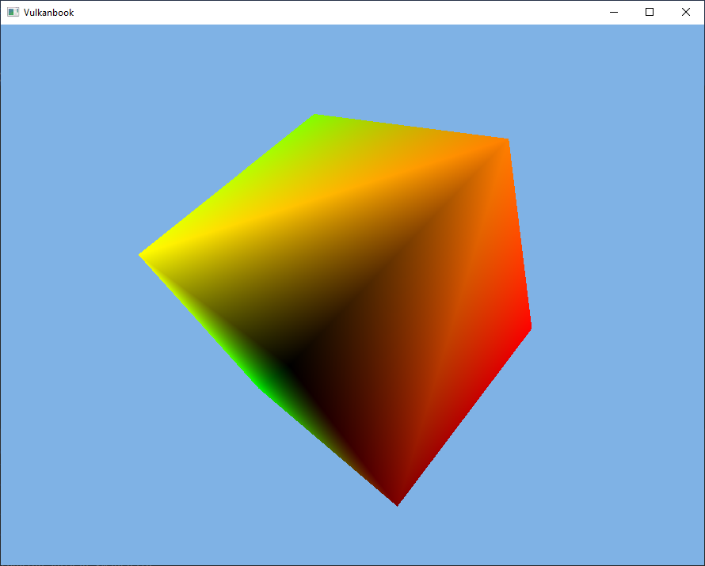

# Chapter 07 - Going 3D

In this chapter we will be rendering a 3D model, a spinning cube. Although our models did already have a z-coordinate, the output attachments we are using only deal with colors, depth values were not handled at all. We need to define a new attachment to store depth information, a depth image. In addition to that, we will add support for window resizing.
You can find the complete source code for this chapter [here](../../booksamples/chapter-07).

## Depth Image

The first thing we must do is create a depth image. In the case of the swap chain, images were already there, we just used an image view to access them. This case is different, we need to allocate the images by ourselves. In order to handle that task we will create a new class named `Image`. Since image creation parameters can be lengthy, we will create first an inner class named `ImageData`, which will act as build helper class using a fluent style API.

```java
package org.vulkanb.eng.graph.vk;
...
public class Image {
    ...
    public static class ImageData {
        private int arrayLayers;
        private int format;
        private int height;
        private int mipLevels;
        private int sampleCount;
        private int usage;
        private int width;

        public ImageData() {
            format = VK_FORMAT_R8G8B8A8_SRGB;
            mipLevels = 1;
            sampleCount = 1;
            arrayLayers = 1;
        }

        public ImageData arrayLayers(int arrayLayers) {
            this.arrayLayers = arrayLayers;
            return this;
        }

        public ImageData format(int format) {
            this.format = format;
            return this;
        }

        public ImageData height(int height) {
            this.height = height;
            return this;
        }

        public ImageData mipLevels(int mipLevels) {
            this.mipLevels = mipLevels;
            return this;
        }

        public ImageData sampleCount(int sampleCount) {
            this.sampleCount = sampleCount;
            return this;
        }

        public ImageData usage(int usage) {
            this.usage = usage;
            return this;
        }

        public ImageData width(int width) {
            this.width = width;
            return this;
        }
    }
}
```
The attributes for creating an image are:

- `width` and `height`: The size of the image.
- `format`:  Describes the format of the texel blocks that compose the image.
- `usage`:  Describes the intended usage that this image will have.
- `mipLevels`:  Describes the levels of detail available for this image (more on this in later chapters).
- `sampleCount`:  Specifies the number of texels per sample (more on this in later chapters).
- `arrayLayers`: Specifies the number of layers of an image (more on this in later chapters).


The constructor of the `Image` class starts like this:

```java
package org.vulkanb.eng.graph.vk;

import org.lwjgl.system.MemoryStack;
import org.lwjgl.vulkan.*;

import java.nio.LongBuffer;

import static org.lwjgl.vulkan.VK13.*;
import static org.vulkanb.eng.graph.vk.VkUtils.vkCheck;

public class Image {

    private final int format;
    private final int mipLevels;
    private final long vkImage;
    private final long vkMemory;

    public Image(VkCtx vkCtx, ImageData imageData) {
        try (var stack = MemoryStack.stackPush()) {
            this.format = imageData.format;
            this.mipLevels = imageData.mipLevels;

            VkImageCreateInfo imageCreateInfo = VkImageCreateInfo.calloc(stack)
                    .sType$Default()
                    .imageType(VK_IMAGE_TYPE_2D)
                    .format(format)
                    .extent(it -> it
                            .width(imageData.width)
                            .height(imageData.height)
                            .depth(1)
                    )
                    .mipLevels(mipLevels)
                    .arrayLayers(imageData.arrayLayers)
                    .samples(imageData.sampleCount)
                    .initialLayout(VK_IMAGE_LAYOUT_UNDEFINED)
                    .sharingMode(VK_SHARING_MODE_EXCLUSIVE)
                    .tiling(VK_IMAGE_TILING_OPTIMAL)
                    .usage(imageData.usage);
            ...
        }
        ...
    }
    ...
}
```


Besides storing some parameters as attributes of the class, the first thing we do is instantiate a structure needed to create an image named `VkImageCreateInfo`. The attributes that we are using are:

- `imageType`:  It specifies the dimensions of the image. In our case we will be using regular 2D dimensions, so we set to the value: `VK_IMAGE_TYPE_2D`. Three dimensions images (`VK_IMAGE_TYPE_3D`) are like a set of slices of 2D textures and are used for volumetric effects or for scientific or medical visualizations (like MRIs). One dimension textures are define by the value `VK_IMAGE_TYPE_1D`.
- `format`: Described above, format of the texel blocks that compose the image.
- `extent`:  It is the size of the image. In this case, the structure needs to support 3D images, so it includes the depth. For 2D images we just set it to `1`.
- `mipLevels`:  Already described in the constructor's parameters description.
- `arrayLayers`:  Images can be an array of layers. This is different than a 3D image. A 3D image contains data that is referred to the three axis. An array of layers are a set of 2D images indexed by a layer number. 
- `samples`: Already described in the constructor's parameters description (`sampleCount`).
- `initialLayout`:  This is the initial layout of the image. We just set it to `VK_IMAGE_LAYOUT_UNDEFINED`. If a transition to another layout is required it will need to be done later on. (This depends on the use case for the image, this is why we do not perform the transition here).
- `sharingMode`: It specifies if this resource will be shared by more than a single queue family at a time (`VK_SHARING_MODE_CONCURRENT`) or not (`VK_SHARING_MODE_EXCLUSIVE`).
- `tiling`: It specifies the tiling arrangement of the texel blocks in memory. In our case, we chose to use the optimal value, so that the texels are laid out in the best format for each GPU.
- `usage`: Already described in the constructor's parameters description.

Now we can create the image by invoking the `vkCreateImage` Vulkan function:

```java
public class Image {
    ...
    public Image(VkCtx vkCtx, ImageData imageData) {
            ...
            Device device = vkCtx.getDevice();
            LongBuffer lp = stack.mallocLong(1);
            vkCheck(vkCreateImage(device.getVkDevice(), imageCreateInfo, null, lp), "Failed to create image");
            vkImage = lp.get(0);
            ...
        ...
    }
    ...
}
```

After that we need to allocate the memory associated to that image. As in the case of buffers, that image is just a handle, we need to manually allocate the memory that will host the contents for the image by ourselves. The first step is to get the memory requirements by calling the `vkGetImageMemoryRequirements` function:

```java
public class Image {
    ...
    public Image(VkCtx vkCtx, ImageData imageData) {
            ...
            // Get memory requirements for this object
            VkMemoryRequirements memReqs = VkMemoryRequirements.calloc(stack);
            vkGetImageMemoryRequirements(device.getVkDevice(), vkImage, memReqs);
            ...
        ...
    }
    ...
}
```

With that information we can populate the `VkMemoryAllocateInfo` structure which contains the information to perform the memory allocation.

```java
public class Image {
    ...
    public Image(VkCtx vkCtx, ImageData imageData) {
            ...
            // Select memory size and type
            var memAlloc = VkMemoryAllocateInfo.calloc(stack)
                    .sType$Default()
                    .allocationSize(memReqs.size())
                    .memoryTypeIndex(VkUtils.memoryTypeFromProperties(vkCtx,
                            memReqs.memoryTypeBits(), 0));
            ...
        ...
    }
    ...
}
```

Again, the code is similar as the one used with the buffers, once we have got the requirements, we set the memory size and select the adequate memory type index (obtained by calling the `memoryTypeFromProperties` from the `VulkanUtils` class). After that we can finally allocate the memory and bind it to the image:

```java
public class Image {
    ...
    public Image(VkCtx vkCtx, ImageData imageData) {
            ...
            // Allocate memory
            vkCheck(vkAllocateMemory(device.getVkDevice(), memAlloc, null, lp), "Failed to allocate memory");
            vkMemory = lp.get(0);

            // Bind memory
            vkCheck(vkBindImageMemory(device.getVkDevice(), vkImage, vkMemory, 0),
                    "Failed to bind image memory");
    }
    ...
}
```

The rest of the methods of this class are the `cleanup` to free resources and some *getters* to obtain the image handle and the format.

```java
public class Image {
    ...
    public void cleanup(VkCtx vkCtx) {
        vkDestroyImage(vkCtx.getDevice().getVkDevice(), vkImage, null);
        vkFreeMemory(vkCtx.getDevice().getVkDevice(), vkMemory, null);
    }

    public int getFormat() {
        return format;
    }

    public int getMipLevels() {
        return mipLevels;
    }
    
    public long getVkImage() {
        return vkImage;
    }
    ...
}
```

## Attachment

In order to use the depth image we will also to setup an `ImageView`. Both the depth `Image` and the associated `ImageView` will constitute an attachment, a depth attachment. Since we will handle both objects together, we will create a new class, named `Attachment`, that will handle their creation and will be handy for next chapters. The definition is quite simple:
```java
package org.vulkanb.eng.graph.vk;

import static org.lwjgl.vulkan.VK13.*;

public class Attachment {

    private final Image image;
    private final ImageView imageView;
    private boolean depthAttachment;

    public Attachment(VkCtx vkCtx, int width, int height, int format, int usage) {
        var imageData = new Image.ImageData().width(width).height(height).usage(usage | VK_IMAGE_USAGE_SAMPLED_BIT).
                format(format);
        image = new Image(vkCtx, imageData);

        int aspectMask = 0;
        if ((usage & VK_IMAGE_USAGE_COLOR_ATTACHMENT_BIT) > 0) {
            aspectMask = VK_IMAGE_ASPECT_COLOR_BIT;
            depthAttachment = false;
        }
        if ((usage & VK_IMAGE_USAGE_DEPTH_STENCIL_ATTACHMENT_BIT) > 0) {
            aspectMask = VK_IMAGE_ASPECT_DEPTH_BIT;
            depthAttachment = true;
        }

        var imageViewData = new ImageView.ImageViewData().format(image.getFormat()).aspectMask(aspectMask);
        imageView = new ImageView(vkCtx.getDevice(), image.getVkImage(), imageViewData);
    }

    public void cleanup(VkCtx vkCtx) {
        imageView.cleanup(vkCtx.getDevice());
        image.cleanup(vkCtx);
    }

    public Image getImage() {
        return image;
    }

    public ImageView getImageView() {
        return imageView;
    }

    public boolean isDepthAttachment() {
        return depthAttachment;
    }
}
```
We just create an image and the associated image view. Depending on the type of image (color or depth image), we setup the aspect mask accordingly. We also have defined a `boolean` attribute, named `depthAttachment` to identify if it is a depth attachment or not.

## Changing vertices structure

In the previous chapter, we defined the structure of our vertices, which basically stated that our vertices were composed by x, y and z positions. Therefore, we would not need anything more to display 3D models. However, displaying a 3D model just using a single color (without shadows or light effects), makes difficult to verify if the model is being loaded property. So, we will add extra components that we will reuse in next chapters, we will add texture coordinates. Although we will not be handling textures in this chapter, we can use those components to pass some color information (at lest for two color channels). We need to modify the `VtxBuffStruct` class in this way:

```java
public class VtxBuffStruct {
    public static final int TEXT_COORD_COMPONENTS = 2;
    private static final int NUMBER_OF_ATTRIBUTES = 2;
    ...
    public VtxBuffStruct() {
        viAttrs = VkVertexInputAttributeDescription.calloc(NUMBER_OF_ATTRIBUTES);
        viBindings = VkVertexInputBindingDescription.calloc(1);
        vi = VkPipelineVertexInputStateCreateInfo.calloc();

        int i = 0;
        int offset = 0;
        // Position
        viAttrs.get(i)
                .binding(0)
                .location(i)
                .format(VK_FORMAT_R32G32B32_SFLOAT)
                .offset(offset);

        // Texture coordinates
        i++;
        offset += POSITION_COMPONENTS * VkUtils.FLOAT_SIZE;
        viAttrs.get(i)
                .binding(0)
                .location(i)
                .format(VK_FORMAT_R32G32_SFLOAT)
                .offset(offset);

        int stride = offset + TEXT_COORD_COMPONENTS * VkUtils.FLOAT_SIZE;
        viBindings.get(0)
                .binding(0)
                .stride(stride)
                .inputRate(VK_VERTEX_INPUT_RATE_VERTEX);

        vi
                .sType$Default()
                .pVertexBindingDescriptions(viBindings)
                .pVertexAttributeDescriptions(viAttrs);
    }
    ...
}
```

We define a new constant named `TEXT_COORD_COMPONENTS`  which states that the texture coordinates will be composed by two elements (two floats). The number of attributes of each vertex will be now two (defined by the constant `NUMBER_OF_ATTRIBUTES`), one for the position components and another one for the texture coordinates. We need to define another attribute for the texture coordinates, therefore the buffer of `VkVertexInputAttributeDescription` will have an extra element. The attribute definition itself is quite similar to the one used for the positions, in this case, the size will be for two floats. Finally, the stride need to be update due to the length increase.

We need to modify the `MeshData` class to include texture coordinates:

```java
package org.vulkanb.eng.model;

public record MeshData(String id, float[] positions, float[] textCoords, int[] indices) {
}
```

And consequently, the way we load vertices in the `ModelsCache` class needs also to be updated:

```java
public class ModelsCache {
    ...
    private static TransferBuffer createVerticesBuffers(VkCtx vkCtx, MeshData meshData) {
        float[] positions = meshData.positions();
        float[] textCoords = meshData.textCoords();
        if (textCoords == null || textCoords.length == 0) {
            textCoords = new float[(positions.length / 3) * 2];
        }
        int numElements = positions.length + textCoords.length;
        int bufferSize = numElements * VkUtils.FLOAT_SIZE;

        var srcBuffer = new VkBuffer(vkCtx, bufferSize,
                VK_BUFFER_USAGE_TRANSFER_SRC_BIT, VK_MEMORY_PROPERTY_HOST_VISIBLE_BIT | VK_MEMORY_PROPERTY_HOST_COHERENT_BIT);
        var dstBuffer = new VkBuffer(vkCtx, bufferSize,
                VK_BUFFER_USAGE_TRANSFER_DST_BIT | VK_BUFFER_USAGE_VERTEX_BUFFER_BIT, VK_MEMORY_PROPERTY_DEVICE_LOCAL_BIT);

        long mappedMemory = srcBuffer.map(vkCtx);
        FloatBuffer data = MemoryUtil.memFloatBuffer(mappedMemory, (int) srcBuffer.getRequestedSize());

        int rows = positions.length / 3;
        for (int row = 0; row < rows; row++) {
            int startPos = row * 3;
            int startTextCoord = row * 2;
            data.put(positions[startPos]);
            data.put(positions[startPos + 1]);
            data.put(positions[startPos + 2]);
            data.put(textCoords[startTextCoord]);
            data.put(textCoords[startTextCoord + 1]);
        }

        srcBuffer.unMap(vkCtx);

        return new TransferBuffer(srcBuffer, dstBuffer);
    }
    ...
}
```

We need to interleave the texture coordinates between the positions. Each vertex defines three float components for the positions and two float components for the texture coordinates.

## Scene changes

If we are going to represent 3D scenes, we need to project from the 3D world into a 2D space (the screen). We will need to use a perspective projection matrix in order to avoid distortions and to represent far away objects smaller than closer ones. We will create a new class that will support its creation and update (due to windows resizing) named `Projection`, which is defined like this:

```java
package org.vulkanb.eng.scene;

import org.joml.Matrix4f;

public class Projection {

    private final float fov;
    private final Matrix4f projectionMatrix;
    private final float zFar;
    private final float zNear;

    public Projection(float fov, float zNear, float zFar, int width, int height) {
        this.fov = fov;
        this.zNear = zNear;
        this.zFar = zFar;
        projectionMatrix = new Matrix4f();
        resize(width, height);
    }

    public float getFov() {
        return fov;
    }

    public Matrix4f getProjectionMatrix() {
        return projectionMatrix;
    }

    public float getZFar() {
        return zFar;
    }

    public float getZNear() {
        return zNear;
    }

    public void resize(int width, int height) {
        projectionMatrix.identity();
        projectionMatrix.perspective(fov, (float) width / (float) height, zNear, zFar, true);
    }
}
```

We are using the [JOML](https://github.com/JOML-CI/JOML) library to create a `Matrix4f` which will hold the projection matrix. The `resize`should be called, at least once, to initialize the parameters of the matrix with the correct parameters (by invoking the `Matrix4f` `Projection`method). The `Projection` method receives the usual arguments, the field of view (in  radians), the aspect ratio and the near and far planes. You may have noticed that it receives an extra argument, which in JOML documentation is named `zZeroToOne`. We have already talked about that Vulkan uses a different coordinate System where y axis point downwards. Vulkan also defines a different range for z coordinates. The Normalized Device Coordinates (NDC), in OpenGL use the range [-1, 1] to represent screen coordinates and also for the z value. Anything outside that range is considered to be out of the field of view and will not be presented. In Vulkan, and also in Direct3D, the NDC range used for the z coordinates is [0, 1]. We need to set the `zZeroToOne` parameter to true to be compliant with Vulkan coordinates System.

The parameters of the perspective matrix can be configured in the `eng.properties` file, so we need to update the `EngCfg` class:
```java
public class EngCfg {
    ...
    private float fov;
    ...
    private float zFar;
    private float zNear;

    private EngCfg() {
        ...
            fov = (float) Math.toRadians(Float.parseFloat(props.getOrDefault("fov", 60.0f).toString()));
            zNear = Float.parseFloat(props.getOrDefault("zNear", 1.0f).toString());
            zFar = Float.parseFloat(props.getOrDefault("zFar", 100.f).toString());
       ...
    }
    ...
    public float getFov() {
        return fov;
    }
    ...
    public float getZFar() {
        return zFar;
    }

    public float getZNear() {
        return zNear;
    }
    ...
}
```

We are going also to introduce a new concept for the engine that will allow to define game entities and use the same `Model` to render multiple elements. Instead of directly rendering models, we will have entities which have some properties, such as their scale, position and rotation and will be associated to a model. They can model a player, NPCs or scene objects and will be managed by a class named `Entity`, which is defined like this:

```java
package org.vulkanb.eng.scene;

import org.joml.*;

public class Entity {

    private final String id;
    private final String modelId;
    private final Matrix4f modelMatrix;
    private final Vector3f position;
    private final Quaternionf rotation;
    private float scale;

    public Entity(String id, String modelId, Vector3f position) {
        this.id = id;
        this.modelId = modelId;
        this.position = position;
        scale = 1;
        rotation = new Quaternionf();
        modelMatrix = new Matrix4f();
        updateModelMatrix();
    }

    public String getId() {
        return id;
    }

    public String getModelId() {
        return modelId;
    }

    public Matrix4f getModelMatrix() {
        return modelMatrix;
    }

    public Vector3f getPosition() {
        return position;
    }

    public Quaternionf getRotation() {
        return rotation;
    }

    public float getScale() {
        return scale;
    }

    public void resetRotation() {
        rotation.x = 0.0f;
        rotation.y = 0.0f;
        rotation.z = 0.0f;
        rotation.w = 1.0f;
    }

    public final void setPosition(float x, float y, float z) {
        position.x = x;
        position.y = y;
        position.z = z;
        updateModelMatrix();
    }

    public void setScale(float scale) {
        this.scale = scale;
        updateModelMatrix();
    }

    public void updateModelMatrix() {
        modelMatrix.translationRotateScale(position, rotation, scale);
    }
}
```

Each `Entity` shall have an identifier which should be unique. It is also linked to the model that will be used to render it through the `modelId` attribute. An `Entity` will have also a position, a rotation (modeled using a quaternion) and a scale. With all that information we are able to construct a model matrix by calling the `updateModelMatrix` from the `Matrix4f` class. The `updateModelMatrix` should be called, each time the position, rotation or scale changes.

Now we can setup the required infrastructure to put the `Projection` and `Entity` classes into work. We will add this to an empty class which has been there since the beginning, the  `Scene` class. The class definition starts like this:

```java
public class Scene {

    private final List<Entity> entities;
    private final Projection projection;

    public Scene(Window window) {
        entities = new ArrayList<>();
        var engCfg = EngCfg.getInstance();
        projection = new Projection(engCfg.getFov(), engCfg.getZNear(), engCfg.getZFar(), window.getWidth(),
                window.getHeight());
    }
    ...
}
```

The constructor receives the a `Window` instance and creates a `Map` of `List`s which will contain `Entity` instances. That map will organized the entities by its `modelId`. The constructor initializes that map and also creates an instance of the `Projection` class, which will hold the perspective matrix. The next methods will be used to add and remove entities and some *getters* to access them and
the projection instance:

```java
public class Scene {
    ...
    public void addEntity(Entity entity) {
        entities.add(entity);
    }

    public List<Entity> getEntities() {
        return entities;
    }

    public Projection getProjection() {
        return projection;
    }

    public void removeAllEntities() {
        entities.clear();
    }

    public void removeEntity(Entity entity) {
        entities.removeIf(entity1 -> entity1.getId().equals(entity.getId()));
    }
    ...
}
```

## Enable depth testing

We need also to modify the pipeline to actually use the depth image for depth testing. Since we may have pipelines that do not use depth testing at all, we will indicate if it's required in the `PipelineBuildInfo` class:

```java
public class PipelineBuildInfo {
    ...
    private int depthFormat;
    private PushConstRange[] pushConstRanges;

    public PipelineBuildInfo(ShaderModule[] shaderModules, VkPipelineVertexInputStateCreateInfo vi, int colorFormat) {
        ...
        depthFormat = VK_FORMAT_UNDEFINED;
    }
    ...
    public int getDepthFormat() {
        return depthFormat;
    }

    public PushConstRange[] getPushConstRanges() {
        return pushConstRanges;
    }
    ...
    public PipelineBuildInfo setDepthFormat(int depthFormat) {
        this.depthFormat = depthFormat;
        return this;
    }

    public PipelineBuildInfo setPushConstRanges(PushConstRange[] pushConstRanges) {
        this.pushConstRanges = pushConstRanges;
        return this;
    }
}
```

You may see also that there's another attribute, named `pushConstRanges`. We will explain its usage later on. Now, in the `Pipeline` class constructor we need to enable the depth stencil state if the `depthFormat` attribute from the `PipelineBuildInfo` class is not equal to `VK_FORMAT_UNDEFINED`.

```java
public class Pipeline {
    ...
    public Pipeline(VkCtx vkCtx, PipelineBuildInfo buildInfo) {
        ...
            VkPipelineDepthStencilStateCreateInfo ds = null;
            if (buildInfo.getDepthFormat() != VK_FORMAT_UNDEFINED) {
                ds = VkPipelineDepthStencilStateCreateInfo.calloc(stack)
                        .sType$Default()
                        .depthTestEnable(true)
                        .depthWriteEnable(true)
                        .depthCompareOp(VK_COMPARE_OP_LESS_OR_EQUAL)
                        .depthBoundsTestEnable(false)
                        .stencilTestEnable(false);
            }
        ...
    }
    ...
}
```

We need to instantiate a `VkPipelineDepthStencilStateCreateInfo` structure which has the following attributes:

- `depthTestEnable`: It controls if depth testing is enabled or not (when rendering it is used to discard fragments which are behind already rendered fragments, values which do not fulfill the test operation will be discarded). This is what we need, so we set it  to `true`. 
- `depthWriteEnable`: This controls if depth writing to the depth attachment is enabled or not. You could enable depth testing but do not want to write depth values, for example if the depth image used as a depth attachment has already been created by another task. This is not our case, we want the depth image to be written while rendering, so we set it to `true`.
- `depthCompareOp`: It defines the operator used for the depth test. In our case, we use the `VK_COMPARE_OP_LESS_OR_EQUAL`, which means that only depth values that are less or equal than the existing value will pass the test. 
- `depthBoundsTestEnable`: This controls if depth values are also tested against a minimum and a maximum bound. This is used to avoid rendering far away objects, that may not be hidden by nearest objects but that it is useless to render.  We are not using this now, so we set it to `false`.
- `stencilTestEnable`: This enables stencil test. Since we are not using stencils at this moment, we set it to false.

This structure will be used later on while creating the pipeline:

```java
public class Pipeline {
    ...
    public Pipeline(VkCtx vkCtx, PipelineBuildInfo buildInfo) {
        ...
            var rendCreateInfo = VkPipelineRenderingCreateInfo.calloc(stack)
                    .sType$Default()
                    .colorAttachmentCount(1)
                    .pColorAttachmentFormats(colorFormats);
            if (ds != null) {
                rendCreateInfo.depthAttachmentFormat(buildInfo.getDepthFormat());
            }
            ...
            var createInfo = VkGraphicsPipelineCreateInfo.calloc(1, stack)
            ...
            if (ds != null) {
                createInfo.pDepthStencilState(ds);
            }
        ....
    ...
}
```

## Passing data to the shaders

We have already talked about defining a projection matrix and creating the model matrices, but we have not addressed how to pass that data to the shaders. In OpenGL this is usually done using uniform buffers, but in Vulkan we have other options also. Vulkan defines several ways to pass this varying data to the shaders, including uniforms. However, using uniforms requires the definition of new concepts such as descriptor pools and descriptor sets, which require careful explanation. Nevertheless, Vulkan introduces a new way to pass data to the buffers which can be used for small sets of data and which is quite easy to set up. These are the so called push constants.

Push constants are small sets of data that can be set while recording command buffers. They do not require to create an underlying buffer nor they require the descriptors used in uniforms. They are a simple mechanism to push data to the shaders in a supposed fast way. How fast they are depends on the hardware. The mechanisms used by the GPU to handle this data are opaque to us, so different vendors choose different strategies which at end affects the performance. The maximum amount of data that we can push is very limited: 128 bytes. This is the minimum required by the specification, some GPUs extend that limit, but, in our case, we will work using that limit.

As it has been said before, push constants are intended to pass small amount of data that can change very frequently. As you can see, 128 bytes is quite small, but we can store there the model matrices for each entity (64 bytes). This will be the regular use case for push constants here. But, we also need to pass the projection matrix (another 64 bytes). In later chapters we will pass that information through uniforms. However, since we have not coded yet the mechanisms required to support uniforms, we will use the available space of push constants to pass also this information. Keep in mind that this is a temporary solution, we will change that in next chapters.

We will first define the `PushConstRange` class:

```java
package org.vulkanb.eng.graph.vk;

public record PushConstRange(int stage, int offset, int size) {
}
```

This class will allow to define what will be the push constants that are going to be used in a pipeline (Remember that it is
already included in the `PipelineBuildInfo` class). We basically define the `stage` where it will be used (vertex, fragment), the
`offset` from the start of the buffer and its size.

We need to include that support in the pipeline layout definition. So, we need to included that in the constructor of the `Pipeline` class like this:

```java
public class Pipeline {
    ...
    public Pipeline(VkCtx vkCtx, PipelineBuildInfo buildInfo) {        ...
            VkPushConstantRange.Buffer vpcr = null;
            PushConstRange[] pushConstRanges = buildInfo.getPushConstRanges();
            int numPushConstants = pushConstRanges != null ? pushConstRanges.length : 0;
            if (numPushConstants > 0) {
                vpcr = VkPushConstantRange.calloc(numPushConstants, stack);
                for (int i = 0; i < numPushConstants; i++) {
                    PushConstRange pushConstRange = pushConstRanges[i];
                    vpcr.get(i)
                            .stageFlags(pushConstRange.stage())
                            .offset(pushConstRange.offset())
                            .size(pushConstRange.size());
                }
            }
            ...
            var pPipelineLayoutCreateInfo = VkPipelineLayoutCreateInfo.calloc(stack)
                    .sType$Default()
                    .pPushConstantRanges(vpcr);
        ...
    }
    ...
}
```

We need to create a push constant range, defined by the structure `VkPushConstantRange`. This will only be done if the new  `pushConstantsSize` attribute of the `PipeLineCreationInfo` class is higher than `0`. The attributes of the `VkPushConstantRange` are:

- `stageFlags`: It is a combination of flags that states the shader stages that will access this range of push constants. We will use this in the vertex buffer so we pass  the `VK_SHADER_STAGE_VERTEX_BIT` value.
- `offset`:  This is the offset from the start where this range starts. In our case, we will simplify this. We provide support for just one push constant and always start on `0`. 
- `size`:  This is the size for this range in bytes. 

Once we have created the ranges, we can include them in the `VkPipelineLayoutCreateInfo` structure using the `pPushConstantRanges`  attribute.

## Putting it all up together

We have coded all the elements required to support the proper rendering of 3D models and pass transformation matrices to the shaders. We now can use them and also support another missing feature: resizing support. Let's start with the changes required in the `Render` class to support resizing.

```java
...
public class Render {
    ...
    private boolean resize;

    public Render(EngCtx engCtx) {
        ...
        resize = false;
        ...
    }
    ...
    public void render(EngCtx engCtx) {
        SwapChain swapChain = vkCtx.getSwapChain();

        waitForFence(currentFrame);

        var cmdPool = cmdPools[currentFrame];
        var cmdBuffer = cmdBuffers[currentFrame];

        recordingStart(cmdPool, cmdBuffer);

        int imageIndex;
        if (resize || (imageIndex = swapChain.acquireNextImage(vkCtx.getDevice(), presCompleteSemphs[currentFrame])) < 0) {
            resize(engCtx);
            return;
        }

        scnRender.render(engCtx, vkCtx, cmdBuffer, modelsCache, imageIndex);

        recordingStop(cmdBuffer);

        submit(cmdBuffer, currentFrame, imageIndex);

        resize = swapChain.presentImage(presentQueue, renderCompleteSemphs[imageIndex], imageIndex);

        currentFrame = (currentFrame + 1) % VkUtils.MAX_IN_FLIGHT;
    }

    private void resize(EngCtx engCtx) {
        Window window = engCtx.window();
        if (window.getWidth() == 0 && window.getHeight() == 0) {
            return;
        }
        resize = false;
        vkCtx.getDevice().waitIdle();

        vkCtx.resize(window);

        Arrays.asList(renderCompleteSemphs).forEach(i -> i.cleanup(vkCtx));
        Arrays.asList(presCompleteSemphs).forEach(i -> i.cleanup(vkCtx));
        for (int i = 0; i < VkUtils.MAX_IN_FLIGHT; i++) {
            presCompleteSemphs[i] = new Semaphore(vkCtx);
        }
        for (int i = 0; i < vkCtx.getSwapChain().getNumImages(); i++) {
            renderCompleteSemphs[i] = new Semaphore(vkCtx);
        }

        VkExtent2D extent = vkCtx.getSwapChain().getSwapChainExtent();
        engCtx.scene().getProjection().resize(extent.width(), extent.height());
        scnRender.resize(vkCtx);
    }
    ...
}
```

In the `render` method, prior to acquiring the swap chain image we check if the `resize` flag has been set to true. This
can happen if presenting the  image fails. If it is not true, we try to acquire the image. If this fails, or  `resize` is `true`
this will mean that we need to handle window resizing and call the `resize` method. You may notice also that the `ScnRender` class
now receives an instance of `EngCtx` also.

The new `resize` method first checks if the window size is equal to zero. This will mean that the window is minimized and makes no sense
in continuing. After that, it resets the `resize` flag and  waits for the device to be idle, calls resize over `VkCtx` instance
and clean ups the synchronization semaphores and creates new ones. It also calls the `resize` method over `ScnRender` class.

Let's view the changes in the `VkCtx` class:

```java
public class VkCtx {
    ...
    public void resize(Window window) {
        swapChain.cleanup(device);
        surface.cleanup(instance);
        var engCfg = EngCfg.getInstance();
        surface = new Surface(instance, physDevice, window);
        swapChain = new SwapChain(window, device, surface, engCfg.getRequestedImages(), engCfg.getVSync());
    }    
}   
```

When resizing just we clean up the swap chain and surface and recreate them again.

Let's review the changes in the `ScnRender` class:

```java
public class ScnRender {

    private static final int DEPTH_FORMAT = VK_FORMAT_D16_UNORM;
    ...
    private final VkClearValue clrValueDepth;
    ...
    private final ByteBuffer pushConstBuff;
    ...
    private Attachment[] attDepth;
    private VkRenderingAttachmentInfo[] attInfoDepth;
    ...
    public ScnRender(VkCtx vkCtx) {
        ...
        clrValueDepth = VkClearValue.calloc().color(c -> c.float32(0, 1.0f));
        attDepth = createDepthAttachments(vkCtx);
        attInfoColor = createColorAttachmentsInfo(vkCtx, clrValueColor);
        attInfoDepth = createDepthAttachmentsInfo(vkCtx, attDepth, clrValueDepth);
        renderInfo = createRenderInfo(vkCtx, attInfoColor, attInfoDepth);
        ...
        pushConstBuff = MemoryUtil.memAlloc(VkUtils.MAT4X4_SIZE * 2);
        ...
    }
    ...
}
```

We need to create new attributes:

- `clrValueDepth`: It will contain the values to clear the depth attachments. It will be initialized to `1.0f` in the constructor (maximum depth value)
- `pushConstBuff`: It will be a buffer that will contain the data used in the push constant (the projection and model
matrices in our case).
- `attDepth`: The attachments that will contain depth data (image view and image). We will need as many attachments as
swap chain images.
- `attInfoDepth`: Rendering information for depth attachments to be used in the dynamic rendering process.

In some other tutorials, you will see that they use a single image and image view for the depth data. The argument used to justify this is, in some cases, that since the depth images are only used internally, while rendering, there's no need to use separate resources. This argument is not correct, render operations in different frames may overlap, so we need to use separate resources or use the proper synchronization mechanisms to prevent that. Probably, the samples used in those tutorial work, because they have a different synchronizations schema that prevent this form happening, but the argument to justify that is not correct. There's an excellent analysis of this in this [Stack overflow](https://stackoverflow.com/questions/62371266/why-is-a-single-depth-buffer-sufficient-for-this-vulkan-swapchain-render-loop) question.


Those attributes are initialized in the constructor by using some new utility methods. Let's review them.
```java
public class ScnRender {
    ...
    private static Attachment[] createDepthAttachments(VkCtx vkCtx) {
        SwapChain swapChain = vkCtx.getSwapChain();
        int numImages = swapChain.getNumImages();
        VkExtent2D swapChainExtent = swapChain.getSwapChainExtent();
        Attachment[] depthAttachments = new Attachment[numImages];
        for (int i = 0; i < numImages; i++) {
            depthAttachments[i] = new Attachment(vkCtx, swapChainExtent.width(), swapChainExtent.height(),
                    DEPTH_FORMAT, VK_IMAGE_USAGE_DEPTH_STENCIL_ATTACHMENT_BIT);
        }

        return depthAttachments;
    }
    ...
}
```

We create as many depth attachments (as many images and image views) as images are in the swap chain. We use the format `VK_FORMAT_D16_UNORM` for the depth values (16-bit unsigned normalized format that has a single 16-bit depth component).
We need also to create rendering information for these attachments:

```java
public class ScnRender {
    ...
    private static VkRenderingAttachmentInfo[] createDepthAttachmentsInfo(VkCtx vkCtx, Attachment[] depthAttachments, VkClearValue clearValue) {
        SwapChain swapChain = vkCtx.getSwapChain();
        int numImages = swapChain.getNumImages();
        var result = new VkRenderingAttachmentInfo[numImages];

        for (int i = 0; i < numImages; ++i) {
            var attachments = VkRenderingAttachmentInfo.calloc()
                    .sType$Default()
                    .imageView(depthAttachments[i].getImageView().getVkImageView())
                    .imageLayout(VK_IMAGE_LAYOUT_DEPTH_STENCIL_ATTACHMENT_OPTIMAL)
                    .loadOp(VK_ATTACHMENT_LOAD_OP_CLEAR)
                    .storeOp(VK_ATTACHMENT_STORE_OP_DONT_CARE)
                    .clearValue(clearValue);
            result[i] = attachments;
        }
        return result;
    }
    ...
}
```

The code is quite similar as the one used for color attachments, but the layout is different: `VK_IMAGE_LAYOUT_DEPTH_STENCIL_ATTACHMENT_OPTIMAL` to state that is for depth values. In this case the store operation can be
`VK_ATTACHMENT_STORE_OP_DONT_CARE` instead of `VK_ATTACHMENT_STORE_OP_STORE` because we do not need to store the results, we just
need a depth attachment to perform depth tests. We do not need to access those results later on.

The `createPipeline` needs to be updated to set the push constants range:

```java
public class ScnRender {
    ...
    private static Pipeline createPipeline(VkCtx vkCtx, ShaderModule[] shaderModules) {
        var vtxBuffStruct = new VtxBuffStruct();
        var buildInfo = new PipelineBuildInfo(shaderModules, vtxBuffStruct.getVi(),
                vkCtx.getSurface().getSurfaceFormat().imageFormat())
                .setDepthFormat(DEPTH_FORMAT)
                .setPushConstRanges(
                        new PushConstRange[]{
                                new PushConstRange(VK_SHADER_STAGE_VERTEX_BIT, 0, VkUtils.MAT4X4_SIZE * 2)
                        });
        var pipeline = new Pipeline(vkCtx, buildInfo);
        vtxBuffStruct.cleanup();
        return pipeline;
    }
    ...
}
```

In the push constants ranges, we are saying that we will be using push constants in the vertex shader (`VK_SHADER_STAGE_VERTEX_BIT`),
that the range will start at offset `0` in the buffer, and it will have the size of two 4x4 matrices. We need to create this 
constant in the `VkUtils` class:

```java
public class VkUtils {
    ...
    public static final int MAT4X4_SIZE = 16 * FLOAT_SIZE;
    ...
}
```

Back to the `ScnRender` class, in the `createRenderInfo` we need to take into consideration the depth attachments, by setting the
`pDepthAttachment` attribute in the `VkRenderingInfo` structure: 

```java
public class ScnRender {
    ...
    private static VkRenderingInfo[] createRenderInfo(VkCtx vkCtx, VkRenderingAttachmentInfo.Buffer[] colorAttachments,
                                                      VkRenderingAttachmentInfo[] depthAttachments) {
        SwapChain swapChain = vkCtx.getSwapChain();
        int numImages = swapChain.getNumImages();
        var result = new VkRenderingInfo[numImages];

        try (var stack = MemoryStack.stackPush()) {
            VkExtent2D extent = swapChain.getSwapChainExtent();
            var renderArea = VkRect2D.calloc(stack).extent(extent);

            for (int i = 0; i < numImages; ++i) {
                var renderingInfo = VkRenderingInfo.calloc()
                        .sType$Default()
                        .renderArea(renderArea)
                        .layerCount(1)
                        .pColorAttachments(colorAttachments[i])
                        .pDepthAttachment(depthAttachments[i]);
                result[i] = renderingInfo;
            }
        }
        return result;
    }
    ...
}
```

The `cleanup`method needs also to be modified to free the new resources:

```java
public class ScnRender {
    ...
    public void cleanup(VkCtx vkCtx) {
        pipeline.cleanup(vkCtx);
        Arrays.asList(renderInfo).forEach(VkRenderingInfo::free);
        Arrays.asList(attInfoDepth).forEach(VkRenderingAttachmentInfo::free);
        Arrays.asList(attInfoColor).forEach(VkRenderingAttachmentInfo.Buffer::free);
        Arrays.asList(attDepth).forEach(a -> a.cleanup(vkCtx));
        MemoryUtil.memFree(pushConstBuff);
        clrValueDepth.free();
        clrValueColor.free();
    }
    ...
}
```

We need also to update the `render` method, which now looks like this:

```java
public class ScnRender {
    ...
    public void render(EngCtx engCtx, VkCtx vkCtx, CmdBuffer cmdBuffer, ModelsCache modelsCache, int imageIndex) {
        try (var stack = MemoryStack.stackPush()) {
            SwapChain swapChain = vkCtx.getSwapChain();
            long swapChainImage = swapChain.getImageView(imageIndex).getVkImage();
            VkCommandBuffer cmdHandle = cmdBuffer.getVkCommandBuffer();

            VkUtils.imageBarrier(stack, cmdHandle, swapChainImage,
                    VK_IMAGE_LAYOUT_UNDEFINED, VK_IMAGE_LAYOUT_COLOR_ATTACHMENT_OPTIMAL,
                    VK_PIPELINE_STAGE_2_COLOR_ATTACHMENT_OUTPUT_BIT, VK_PIPELINE_STAGE_2_COLOR_ATTACHMENT_OUTPUT_BIT,
                    VK_ACCESS_2_NONE, VK_ACCESS_2_COLOR_ATTACHMENT_WRITE_BIT,
                    VK_IMAGE_ASPECT_COLOR_BIT);
            VkUtils.imageBarrier(stack, cmdHandle, attDepth[imageIndex].getImage().getVkImage(),
                    VK_IMAGE_LAYOUT_UNDEFINED, VK_IMAGE_LAYOUT_DEPTH_ATTACHMENT_OPTIMAL,
                    VK_PIPELINE_STAGE_2_EARLY_FRAGMENT_TESTS_BIT | VK_PIPELINE_STAGE_2_LATE_FRAGMENT_TESTS_BIT,
                    VK_PIPELINE_STAGE_2_EARLY_FRAGMENT_TESTS_BIT | VK_PIPELINE_STAGE_2_LATE_FRAGMENT_TESTS_BIT,
                    VK_ACCESS_2_DEPTH_STENCIL_ATTACHMENT_WRITE_BIT, VK_ACCESS_2_DEPTH_STENCIL_ATTACHMENT_READ_BIT | VK_ACCESS_2_DEPTH_STENCIL_ATTACHMENT_WRITE_BIT,
                    VK_IMAGE_ASPECT_DEPTH_BIT);

            vkCmdBeginRendering(cmdHandle, renderInfo[imageIndex]);

            vkCmdBindPipeline(cmdHandle, VK_PIPELINE_BIND_POINT_GRAPHICS, pipeline.getVkPipeline());

            VkExtent2D swapChainExtent = swapChain.getSwapChainExtent();
            int width = swapChainExtent.width();
            int height = swapChainExtent.height();
            var viewport = VkViewport.calloc(1, stack)
                    .x(0)
                    .y(height)
                    .height(-height)
                    .width(width)
                    .minDepth(0.0f)
                    .maxDepth(1.0f);
            vkCmdSetViewport(cmdHandle, 0, viewport);

            var scissor = VkRect2D.calloc(1, stack)
                    .extent(it -> it.width(width).height(height))
                    .offset(it -> it.x(0).y(0));
            vkCmdSetScissor(cmdHandle, 0, scissor);

            LongBuffer offsets = stack.mallocLong(1).put(0, 0L);
            LongBuffer vertexBuffer = stack.mallocLong(1);

            Scene scene = engCtx.scene();
            List<Entity> entities = scene.getEntities();
            int numEntities = entities.size();
            for (int i = 0; i < numEntities; i++) {
                var entity = entities.get(i);
                VulkanModel model = modelsCache.getModel(entity.getModelId());
                List<VulkanMesh> vulkanMeshList = model.getVulkanMeshList();
                int numMeshes = vulkanMeshList.size();
                setPushConstants(cmdHandle, scene.getProjection().getProjectionMatrix(), entity.getModelMatrix());
                for (int j = 0; j < numMeshes; j++) {
                    var vulkanMesh = vulkanMeshList.get(j);
                    vertexBuffer.put(0, vulkanMesh.verticesBuffer().getBuffer());
                    vkCmdBindVertexBuffers(cmdHandle, 0, vertexBuffer, offsets);
                    vkCmdBindIndexBuffer(cmdHandle, vulkanMesh.indicesBuffer().getBuffer(), 0, VK_INDEX_TYPE_UINT32);
                    vkCmdDrawIndexed(cmdHandle, vulkanMesh.numIndices(), 1, 0, 0, 0);
                }
            }

            vkCmdEndRendering(cmdHandle);

            VkUtils.imageBarrier(stack, cmdHandle, swapChainImage,
                    VK_IMAGE_LAYOUT_COLOR_ATTACHMENT_OPTIMAL, VK_IMAGE_LAYOUT_PRESENT_SRC_KHR,
                    VK_PIPELINE_STAGE_2_COLOR_ATTACHMENT_OUTPUT_BIT, VK_PIPELINE_STAGE_2_BOTTOM_OF_PIPE_BIT,
                    VK_ACCESS_2_COLOR_ATTACHMENT_READ_BIT | VK_ACCESS_2_COLOR_ATTACHMENT_WRITE_BIT, VK_PIPELINE_STAGE_2_NONE,
                    VK_IMAGE_ASPECT_COLOR_BIT);
        }
    }
    ...
}
```

We need first to add a new image layout transition using a memory barrier for the depth image. It is quite similar to the one
used for swap chain images, but the stages to consider are now: `VK_PIPELINE_STAGE_2_EARLY_FRAGMENT_TESTS_BIT | VK_PIPELINE_STAGE_2_LATE_FRAGMENT_TESTS_BIT` and the access flags shall be specifically set for depth attachments:
`VK_ACCESS_2_DEPTH_STENCIL_ATTACHMENT_READ_BIT` and `VK_ACCESS_2_DEPTH_STENCIL_ATTACHMENT_WRITE_BIT`.

Instead of looping through the models, we iterate over the entities, and getting the associated model through the `ModelsCache`
instance. For each of the entities, we set, as push constants the model matrix associated to the entity and the projection matrix.
It is not very efficient to update the projection matrix for each entity, but we will change this later on. The drawing commands
are exactly the same, for each entity, though its model, we iterate over their meshes in order to render them.

You may have notices that we do not add another image barrier for the depth attachment once we have finished drawing the meshes.
This is because we do not need to present that. Depth attachments will be used to perform depth comparisons and discard
fragments that are not visible. Therefore, we do not need to perform any layout transition to presentation mode.

Let's examine the `setPushConstants` method:

```java
public class ScnRender {
    ...
    private void setPushConstants(VkCommandBuffer cmdHandle, Matrix4f projMatrix, Matrix4f modelMatrix) {
        projMatrix.get(pushConstBuff);
        modelMatrix.get(VkUtils.MAT4X4_SIZE, pushConstBuff);
        vkCmdPushConstants(cmdHandle, pipeline.getVkPipelineLayout(), VK_SHADER_STAGE_VERTEX_BIT, 0, pushConstBuff);
    }
    ...
}
```

The method receives the projection and model matrices and It just copies the data contained in those matrices into the `pushConstBuff`. Then we call the `vkCmdPushConstants` function to update the values of the push constants.

Finally, in the `resize` method, we just clean render info attributes and recreate them again due to the change in size
of the underlying images.
```java
public class ScnRender {
    ...
    public void resize(VkCtx vkCtx) {
        Arrays.asList(renderInfo).forEach(VkRenderingInfo::free);
        Arrays.asList(attInfoDepth).forEach(VkRenderingAttachmentInfo::free);
        Arrays.asList(attInfoColor).forEach(VkRenderingAttachmentInfo.Buffer::free);
        Arrays.asList(attDepth).forEach(a -> a.cleanup(vkCtx));
        attDepth = createDepthAttachments(vkCtx);
        attInfoColor = createColorAttachmentsInfo(vkCtx, clrValueColor);
        attInfoDepth = createDepthAttachmentsInfo(vkCtx, attDepth, clrValueDepth);
        renderInfo = createRenderInfo(vkCtx, attInfoColor, attInfoDepth);
    }
    ...
}
```

The next step missing now is to modify the `init` method in or `Main` class:

```java
public class Main implements IGameLogic {
    ...
    private final Vector3f rotatingAngle = new Vector3f(1, 1, 1);
    private float angle = 0;
    private Entity cubeEntity;
    ...    
    @Override
    public InitData init(EngCtx engCtx) {
        float[] positions = new float[]{
                -0.5f, 0.5f, 0.5f,
                -0.5f, -0.5f, 0.5f,
                0.5f, -0.5f, 0.5f,
                0.5f, 0.5f, 0.5f,
                -0.5f, 0.5f, -0.5f,
                0.5f, 0.5f, -0.5f,
                -0.5f, -0.5f, -0.5f,
                0.5f, -0.5f, -0.5f,
        };
        float[] textCoords = new float[]{
                0.0f, 0.0f,
                0.5f, 0.0f,
                1.0f, 0.0f,
                1.0f, 0.5f,
                1.0f, 1.0f,
                0.5f, 1.0f,
                0.0f, 1.0f,
                0.0f, 0.5f,
        };
        int[] indices = new int[]{
                // Front face
                0, 1, 3, 3, 1, 2,
                // Top Face
                4, 0, 3, 5, 4, 3,
                // Right face
                3, 2, 7, 5, 3, 7,
                // Left face
                6, 1, 0, 6, 0, 4,
                // Bottom face
                2, 1, 6, 2, 6, 7,
                // Back face
                7, 6, 4, 7, 4, 5,
        };

        var modelId = "CubeModel";
        MeshData meshData = new MeshData("cube-mesh", positions, textCoords, indices);
        List<MeshData> meshDataList = new ArrayList<>();
        meshDataList.add(meshData);
        ModelData modelData = new ModelData(modelId, meshDataList);
        List<ModelData> models = new ArrayList<>();
        models.add(modelData);

        cubeEntity = new Entity("CubeEntity", modelId, new Vector3f(0.0f, 0.0f, -2.0f));
        engCtx.scene().addEntity(cubeEntity);

        return new InitData(models);
    }
    ...
}
```

We are defining the coordinates of a cube, and setting some random texture coordinates to see some changes in the color. After that, we need to create also a new `Entity` instance in order to render the cube. We want the cube to spin, so we use the `update` method, that will be invoked periodically to update that angle:

```java
public class Main implements IGameLogic {
    ...
    @Override
    public void update(EngCtx engCtx, long diffTimeMillis) {
        angle += 1.0f;
        if (angle >= 360) {
            angle = angle - 360;
        }
        cubeEntity.getRotation().identity().rotateAxis((float) Math.toRadians(angle), rotatingAngle);
        cubeEntity.updateModelMatrix();
    }
}
```

The final step is to modify the shaders. The vertex shader will now use the push constants, which is composed by two matrices and use them to transform the entity position from model coordinates system to word coordinate systems (by multiplying by the model matrix) and from world coordinates to normalized screen coordinates by multiplying by the projection matrix. We also pass the texture coordinates to the fragment shader.

```glsl
#version 450

layout(location = 0) in vec3 inPos;
layout(location = 1) in vec2 intTextCoords;

layout(location = 0) out vec2 outTextCoords;

layout(push_constant) uniform matrices {
    mat4 projectionMatrix;
    mat4 modelMatrix;
} push_constants;

void main()
{
    gl_Position = push_constants.projectionMatrix * push_constants.modelMatrix * vec4(inPos, 1);
    outTextCoords = intTextCoords;
}
```

In the fragment shader, we just use the texture coordinates for the R and G channels.

```glsl
#version 450

layout(location = 0) in vec2 inTextCoords;
layout(location = 0) out vec4 outFragColor;

void main()
{
    outFragColor = vec4(inTextCoords.x, inTextCoords.y, 0, 1);
}
```

With all those changes we can now see a nice spinning cube in a window that can be resized.



[Next chapter](../chapter-08/chapter-08.md)
