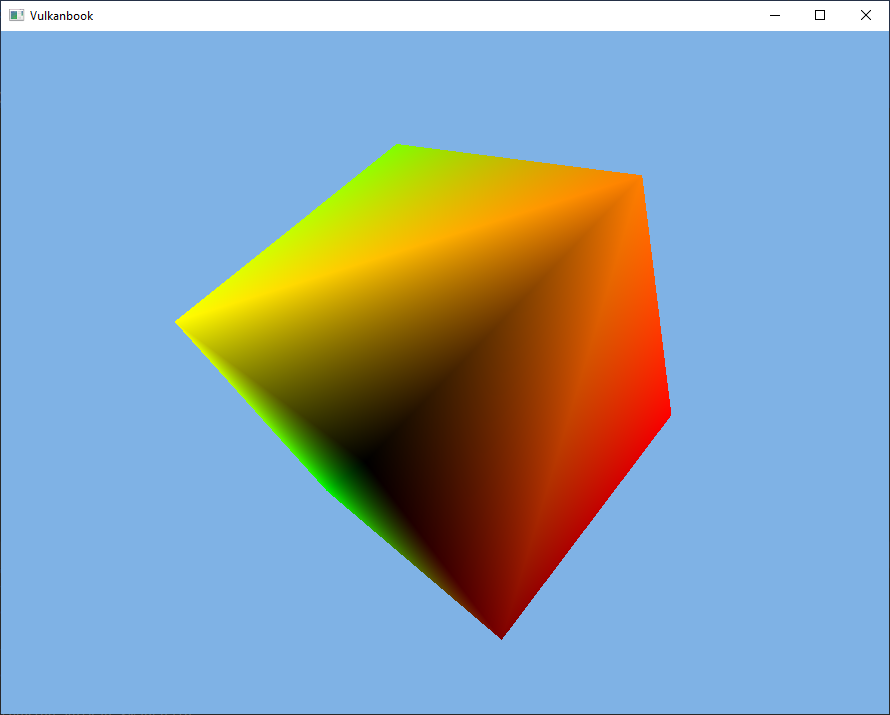

# Going 3D

In this chapter we will be rendering a 3D model, a spinning cube. Although our models did already have a z-coordinate, the output attachments we are using only deal with colors, depth values were not handled at all. We need to define a new attachment to store depth information, a depth image. In addition to that, we will add support for window resizing.
You can find the complete source code for this chapter [here](../../booksamples/chapter-07).

## Depth Image

The first thing we must do is create a depth image. In the case of the swap chain, images were already there, we just used a image view to access them. This case is different, we need to allocate the images by ourselves. In order to handle that task we will create a new class named `Image`. This class can used to manage any type of image, not only images to bee used asd depth attachments. The constructor starts like this:

```java
public class Image {
    ...
    public Image(Device device, int width, int height, int format, int usage, int mipLevels, int sampleCount) {
        this.device = device;
        try (MemoryStack stack = MemoryStack.stackPush()) {
            this.format = format;
            this.mipLevels = mipLevels;

            VkImageCreateInfo imageCreateInfo = VkImageCreateInfo.callocStack(stack)
                    .sType(VK_STRUCTURE_TYPE_IMAGE_CREATE_INFO)
                    .imageType(VK_IMAGE_TYPE_2D)
                    .format(format)
                    .extent(it -> it
                            .width(width)
                            .height(height)
                            .depth(1)
                    )
                    .mipLevels(mipLevels)
                    .arrayLayers(1)
                    .samples(sampleCount)
                    .initialLayout(VK_IMAGE_LAYOUT_UNDEFINED)
                    .sharingMode(VK_SHARING_MODE_EXCLUSIVE)
                    .tiling(VK_IMAGE_TILING_OPTIMAL)
                    .usage(usage);
            ...
        }
        ...
    }
    ...
}
```

The constructor receives the following parameters:

- `width` and `height`: The size of the image.
- `format`:  Describes the format of the texel blocks that compose the image.
- `usage`:  Describes the intended usage that this image will have.
- `mipLevels`:  Describes the levels of detail available for this image (more on this in later chapters).
- `sampleCount`:  Specifies the number of texels per sample (more on this in later chapters).

Besides storing some parameters as attributes of the class, the first thing we do is instantiate a structure needed to create an image named `VkImageCreateInfo`. The attributes that we are using are:

- `sType`:  The classical type attribute of most Vulkan structures. In this case we use the value `VK_STRUCTURE_TYPE_IMAGE_CREATE_INFO`.
- `imageType`:  It specifies the dimensions of the the image. In our case we will be using regular 2D dimensions, so we set to the value: `VK_IMAGE_TYPE_2D`. Three dimensions images (`VK_IMAGE_TYPE_3D`) are like a set of slices of 2D textures and are used for volumetric effects or for scientific or medical visualizations (like MRIs). One dimension textures are define by the value `VK_IMAGE_TYPE_1D`.
- `format`: Described above, format of the texel blocks that compose the image.
- `extent`:  It is the size of the image. In this case, the structure needs to support 3D images, so it includes the depth. For 2D images we just set it to `1`.
- `mipLevels`:  Already described in the constructor's parameters description.
- `arrayLayers`:  Images can be an array of layers. This is different than a 3D image. A 3D image contains data that is referred to the three axis. An array of layers are a set of 2D images indexed by a layer number. In our case we will just set it to `1`. 
- `samples`: Already described in the constructor's parameters description (`sampleCount`).
- `initialLayout`:  This is the initial layout of the image. We just set it to `VK_IMAGE_LAYOUT_UNDEFINED`. If a transition to another layout is required it will need to be done later on. (This depends on the use case for the image, this is why we do not perform the transition here).
- `sharingMode`: It specifies if this resource will be shared by more than a single queue family at a time (`VK_SHARING_MODE_CONCURRENT`) or not (`VK_SHARING_MODE_EXCLUSIVE`).
- `tiling`: It specifies the tiling arrangement of the texel blocks in memory. In our case, we chose to use the optimal value, so that the texels are laid out in the best format for each GPU.
- `usage`: Already described in the constructor's parameters description.

Now we can create the image by invoking the `vkCreateImage` Vulkan function:

```java
public class Image {
    ...
    public Image(Device device, int width, int height, int format, int usage, int mipLevels, int sampleCount) {
            ...
            LongBuffer lp = stack.mallocLong(1);
            vkCheck(vkCreateImage(device.getVkDevice(), imageCreateInfo, null, lp), "Failed to create image");
            vkImage = lp.get(0);
            ...
        }
        ...
    }
    ...
}
```

After that we need to allocate the memory associated to that image. As in the case of buffers, that image is just a handle, we need to manually allocate the memory that will host the contents for the image by ourselves. The first step is to get the memory requirements by calling the `vkGetImageMemoryRequirements` function:

```java
public class Image {
    ...
    public Image(Device device, int width, int height, int format, int usage, int mipLevels, int sampleCount) {
            ...
            // Get memory requirements for this object
            VkMemoryRequirements memReqs = VkMemoryRequirements.callocStack(stack);
            vkGetImageMemoryRequirements(device.getVkDevice(), getVkImage(), memReqs);
            ...
        }
        ...
    }
    ...
}
```

With that information we can populate the `VkMemoryAllocateInfo` structure which contains the information to perform the memory allocation.

```java
public class Image {
    ...
    public Image(Device device, int width, int height, int format, int usage, int mipLevels, int sampleCount) {
            ...
            // Select memory size and type
            VkMemoryAllocateInfo memAlloc = VkMemoryAllocateInfo.callocStack(stack)
                    .sType(VK_STRUCTURE_TYPE_MEMORY_ALLOCATE_INFO)
                    .allocationSize(memReqs.size())
                    .memoryTypeIndex(VulkanUtils.memoryTypeFromProperties(device.getPhysicalDevice(),
                            memReqs.memoryTypeBits(), 0));
            ...
        }
        ...
    }
    ...
}
```

Again, the code is similar as the one used with the buffers, once we have got the requirements, we set the memory size and select the adequate memory type index (obtained by calling the `memoryTypeFromProperties` from the `VulkanUtils` class). After that we can finally allocate the memory and bind it to the image:

```java
public class Image {
    ...
    public Image(Device device, int width, int height, int format, int usage, int mipLevels, int sampleCount) {
            ...
            // Allocate memory
            vkCheck(vkAllocateMemory(device.getVkDevice(), memAlloc, null, lp), "Failed to allocate memory");
            vkMemory = lp.get(0);

            // Bind memory
            vkCheck(vkBindImageMemory(device.getVkDevice(), getVkImage(), getVkMemory(), 0),
                    "Failed to bind image memory");
        }
    }
    ...
}
```

The rest of the methods of this class are the `cleanup` to free resources and some *getters* to obtain the image handle, the associated memory, the format of the image and the mip levels.

```java
public class Image {
    ...
    public void cleanup() {
        vkDestroyImage(device.getVkDevice(), vkImage, null);
        vkFreeMemory(device.getVkDevice(), vkMemory, null);
    }

    public int getFormat() {
        return format;
    }

    public int getMipLevels() {
        return mipLevels;
    }

    public long getVkImage() {
        return vkImage;
    }

    public long getVkMemory() {
        return vkMemory;
    }
    ...
}
```

## Attachment

In order to use the depth image we will also to setup an `ImageView`. Both the depth `Image` and the associated `ImageView` will constitute an attachment, a depth attachment. Since we will handle both objects together, we will create a new class, named `Attachment`, that will handle their creation and will be handy for next chapters. The definition is quite simple:
```java
package org.vulkanb.eng.graph.vk;

import static org.lwjgl.vulkan.VK11.*;

public class Attachment {

    private boolean depthAttachment;
    private Image image;
    private ImageView imageView;

    public Attachment(Device device, int width, int height, int format, int usage) {
        image = new Image(device, width, height, format, usage | VK_IMAGE_USAGE_SAMPLED_BIT, 1, 1);

        int aspectMask = 0;
        if ((usage & VK_IMAGE_USAGE_COLOR_ATTACHMENT_BIT) > 0) {
            aspectMask = VK_IMAGE_ASPECT_COLOR_BIT;
            depthAttachment = false;
        }
        if ((usage & VK_IMAGE_USAGE_DEPTH_STENCIL_ATTACHMENT_BIT) > 0) {
            aspectMask = VK_IMAGE_ASPECT_DEPTH_BIT;
            depthAttachment = true;
        }

        imageView = new ImageView(device, image.getVkImage(), image.getFormat(), aspectMask, 1);
    }

    public void cleanup() {
        imageView.cleanup();
        image.cleanup();
    }

    public Image getImage() {
        return image;
    }

    public ImageView getImageView() {
        return imageView;
    }

    public boolean isDepthAttachment() {
        return depthAttachment;
    }
}
```
We just create and image and the associated image view. Depending on the type of image (color or depth image), we setup the aspect mask accordingly. We also have defined a `boolean` attribute, named `depthAttachment` to identify if it is a depth attachment or not.

## Changing vertices structure

In the previous chapter, we defined the structure of our vertices, which basically stated that our vertices were composed by x, y and z positions. Therefore, we would not need anything more to display 3D models. However, displaying a 3D model just using a single color (without shadows or light effects), makes difficult to verify if the model is being loaded property. So, we will add extra components that we will reuse in next chapters, we will add texture coordinates. Although we will not be handling textures in this chapter, we can use those components to pass some color information (at lest for two color channels). We need to modify the `VertexBufferStructure`  in this way:

```java
public class VertexBufferStructure extends VertexInputStateInfo {

    public static final int TEXT_COORD_COMPONENTS = 2;
    private static final int NUMBER_OF_ATTRIBUTES = 2;
...
    public VertexBufferStructure() {
        viAttrs = VkVertexInputAttributeDescription.calloc(NUMBER_OF_ATTRIBUTES);
        viBindings = VkVertexInputBindingDescription.calloc(1);
        vi = VkPipelineVertexInputStateCreateInfo.calloc();

        int i = 0;
        // Position
        viAttrs.get(i)
                .binding(0)
                .location(i)
                .format(VK_FORMAT_R32G32B32_SFLOAT)
                .offset(0);

        // Texture coordinates
        i++;
        viAttrs.get(i)
                .binding(0)
                .location(i)
                .format(VK_FORMAT_R32G32_SFLOAT)
                .offset(POSITION_COMPONENTS * GraphConstants.FLOAT_LENGTH);

        viBindings.get(0)
                .binding(0)
                .stride(POSITION_COMPONENTS * GraphConstants.FLOAT_LENGTH +
                        TEXT_COORD_COMPONENTS * GraphConstants.FLOAT_LENGTH)
                .inputRate(VK_VERTEX_INPUT_RATE_VERTEX);

        vi
                .sType(VK_STRUCTURE_TYPE_PIPELINE_VERTEX_INPUT_STATE_CREATE_INFO)
                .pVertexBindingDescriptions(viBindings)
                .pVertexAttributeDescriptions(viAttrs);
    }
...
}
```

We define a new constant named `TEXT_COORD_COMPONENTS`  which states that the texture coordinates will be composed by two elements (two floats). The number of attributes of each vertex will be now two (defined by the constant `NUMBER_OF_ATTRIBUTES`), one for the position components and another one for the texture coordinates. We need to define another attribute for the texture coordinates, therefore the buffer of `VkVertexInputAttributeDescription` will have an extra element.  The attribute definition itself is quite similar to the one used for the positions, in this case, the size will be for two floats. Finally, the stride need to be update due to the length increase.

We need to modify the `MeshData` class to include texture coordinates:

```java
package org.vulkanb.eng.scene;

public record MeshData(String id, float[]positions, float[]textCoords, int[]indices) {
}
```

An therefore,  the way we load vertices in the `VulkanMesh`  class needs also to be updated:

```java
public class VulkanMesh {
...
    private static TransferBuffers createVerticesBuffers(Device device, MeshData meshData) {
        float[] positions = meshData.positions();
        float[] textCoords = meshData.textCoords();
        if (textCoords == null || textCoords.length == 0) {
            textCoords = new float[(positions.length / 3) * 2];
        }
        int numElements = positions.length + textCoords.length;
        int bufferSize = numElements * GraphConstants.FLOAT_LENGTH;

        VulkanBuffer srcBuffer = new VulkanBuffer(device, bufferSize,
                VK_BUFFER_USAGE_TRANSFER_SRC_BIT, VK_MEMORY_PROPERTY_HOST_VISIBLE_BIT | VK_MEMORY_PROPERTY_HOST_COHERENT_BIT);
        VulkanBuffer dstBuffer = new VulkanBuffer(device, bufferSize,
                VK_BUFFER_USAGE_TRANSFER_DST_BIT | VK_BUFFER_USAGE_VERTEX_BUFFER_BIT, VK_MEMORY_PROPERTY_DEVICE_LOCAL_BIT);

        try (MemoryStack stack = MemoryStack.stackPush()) {
            PointerBuffer pp = stack.mallocPointer(1);
            vkCheck(vkMapMemory(device.getVkDevice(), srcBuffer.getMemory(), 0, srcBuffer.getAllocationSize(), 0, pp),
                    "Failed to map memory");

            int rows = positions.length / 3;
            FloatBuffer data = pp.getFloatBuffer(0, numElements);
            for (int row = 0; row < rows; row++) {
                int startPos = row * 3;
                int startTextCoord = row * 2;
                data.put(positions[startPos + 0]);
                data.put(positions[startPos + 1]);
                data.put(positions[startPos + 2]);
                data.put(textCoords[startTextCoord + 0]);
                data.put(textCoords[startTextCoord + 1]);
            }

            vkUnmapMemory(device.getVkDevice(), srcBuffer.getMemory());
        }

        return new TransferBuffers(srcBuffer, dstBuffer);
    }
    ...
}
```

We need to interleave the texture coordinates between the positions. Each vertex defines three float components for the positions and two float components for the texture coordinates.

## Modifying the render pass

In order to properly render 3D models we need to store depth information. We need to output that depth data while rendering to a image that will hold depth values. This will allow the GPU to perform depth testing operations. This means, that we need to add another output attachment to the render pass we are using. Therefore, we need to modify the `SwapChainRenderPass` as shown below:

```java
public SwapChainRenderPass(SwapChain swapChain, int depthImageFormat) {
    this.swapChain = swapChain;

    try (MemoryStack stack = MemoryStack.stackPush()) {
        VkAttachmentDescription.Buffer attachments = VkAttachmentDescription.callocStack(2, stack);

        // Color attachment
        ...

        // Depth attachment
        attachments.get(1)
                .format(depthImageFormat)
                .samples(VK_SAMPLE_COUNT_1_BIT)
                .loadOp(VK_ATTACHMENT_LOAD_OP_CLEAR)
                .storeOp(VK_ATTACHMENT_STORE_OP_DONT_CARE)
                .initialLayout(VK_IMAGE_LAYOUT_UNDEFINED)
                .finalLayout(VK_IMAGE_LAYOUT_DEPTH_STENCIL_ATTACHMENT_OPTIMAL);
        ...
        VkAttachmentReference depthReference = VkAttachmentReference.mallocStack(stack)
                .attachment(1)
                .layout(VK_IMAGE_LAYOUT_DEPTH_STENCIL_ATTACHMENT_OPTIMAL);

        VkSubpassDescription.Buffer subPass = VkSubpassDescription.calloc(1)
                .pipelineBindPoint(VK_PIPELINE_BIND_POINT_GRAPHICS)
                .colorAttachmentCount(colorReference.remaining())
                .pColorAttachments(colorReference)
                .pDepthStencilAttachment(depthReference);
       ...
    }
}
```

The constructor, in addition to the swap chain, receives now the format of the image which will be used to store depth values. We need to add a new `VkAttachmentDescription` to describe the new depth attachment. Some remarks about the parameters:

- The format of that attachment is the format of the `depthImage`.
- We are not using multi-sampling, we just pass the `VK_SAMPLE_COUNT_1_BIT`. 
- The value used for the `loadOp` attribute is the same as in the color attachment. We want their contents to be cleared at the start of this render pass. 
- The vale used for the `storeOp` is different than the one used for the color attachment. In this case, we are not going to use the contents of the depth buffer for anything after the render pass finishes. In the case of the color attachment, it need to be preserved to present the contents to the screen. In this case we can use the `VK_ATTACHMENT_STORE_OP_DONT_CARE` to tell the GPU that they contents may be discarded.
- We want also an automatic transition from the initial layout  `VK_IMAGE_LAYOUT_UNDEFINED`) to the final layout (`VK_IMAGE_LAYOUT_DEPTH_STENCIL_ATTACHMENT_OPTIMAL`).

After that we create a reference to the depth attachment (`VkAttachmentReference`) and set it as a depth stencil attachment (`pDepthStencilAttachment`) in the `VkSubpassDescription` structure.

## Scene changes

If we are going to represent 3D scenes, we need to project from the 3D world into a 2D space (the screen). We will need to use a perspective projection matrix in order to avoid distortions and to represent far away objects smaller than closer ones. We will create a new class that will support its creation and update (due to windows resizing) named `Perspective`, which is defined like this:

```java
package org.vulkanb.eng.scene;

import org.joml.Matrix4f;
import org.vulkanb.eng.EngineProperties;

public class Perspective {

    private Matrix4f perspectiveMatrix;

    public Perspective() {
        perspectiveMatrix = new Matrix4f();
    }

    public Matrix4f getPerspectiveMatrix() {
        return perspectiveMatrix;
    }

    public void resize(int width, int height) {
        EngineProperties engProps = EngineProperties.getInstance();
        perspectiveMatrix.identity();
        perspectiveMatrix.perspective(engProps.getFov(), (float) width / (float) height,
                engProps.getZNear(), engProps.getZFar(), true);
    }
}
```

We are using the [JOML](https://github.com/JOML-CI/JOML) library to create a `Matrix4f` which will hold the projection matrix. The `resize`should be called, at least once, to initialize the parameters of the matrix with the correct parameters (by invoking the `Matrix4f` `perspective`method). The `perspective` method receives the usual arguments, the field of view (in  radians), the aspect ratio and the near and far planes. You may have noticed that it receives an extra argument, which in JOML documentation is named `zZeroToOne`. We have already talked about that Vulkan uses a different coordinate System where y axis point downwards. Vulkan also defines a different range for z coordinates. The Normalized Device Coordinates (NDC), in OpenGL use the range [-1, 1] to represent screen coordinates and also for the z value. Anything outside that range is considered to be out of the field of view and will not be presented. In Vulkan, and also in Direct3D, the NDC range used for the z coordinates is [0, 1]. We need to set the `zZeroToOne` parameter to true to be compliant with Vulkan coordinates System.

The parameters of the perspective matrix can be configured in the `eng.properties` file, so we need to update the `EngineProperties` class:
```java
public class EngineProperties {
    private static final float DEFAULT_FOV = 60.0f;
    ...
    private static final float DEFAULT_Z_FAR = 100.f;
    private static final float DEFAULT_Z_NEAR = 1.0f;
    ...
    private EngineProperties() {
        ...
            fov = (float) Math.toRadians(Float.parseFloat(props.getOrDefault("fov", DEFAULT_FOV).toString()));
            zNear = Float.parseFloat(props.getOrDefault("zNear", DEFAULT_Z_NEAR).toString());
            zFar = Float.parseFloat(props.getOrDefault("zFar", DEFAULT_Z_FAR).toString());
       ...
    }
    ...
    public float getFov() {
        return fov;
    }
    ...
    public float getZFar() {
        return zFar;
    }

    public float getZNear() {
        return zNear;
    }
    ...
}
```
We are going also to introduce a new concept for the engine that will allow to define game entities and use the same `Mesh` to render multiple elements. Instead of rendering meshes, we will have entities which have some properties, such as their scale, position and rotation and will be associated to a mesh. They can model a player, NPCs or scene objects and will be managed by a class named `Entity`, which is defined like this:

```java
package org.vulkanb.eng.scene;

import org.joml.*;

public class Entity {

    private String id;
    private String meshId;
    private Matrix4f modelMatrix;
    private Vector3f position;
    private Quaternionf rotation;
    private float scale;

    public Entity(String id, String meshId, Vector3f position) {
        this.id = id;
        this.meshId = meshId;
        this.position = position;
        scale = 1;
        rotation = new Quaternionf();
        modelMatrix = new Matrix4f();
        updateModelMatrix();
    }

    public String getId() {
        return id;
    }

    public String getMeshId() {
        return meshId;
    }

    public Matrix4f getModelMatrix() {
        return modelMatrix;
    }

    public Vector3f getPosition() {
        return position;
    }

    public Quaternionf getRotation() {
        return rotation;
    }

    public float getScale() {
        return scale;
    }

    public final void setPosition(float x, float y, float z) {
        position.x = x;
        position.y = y;
        position.z = z;
        updateModelMatrix();
    }

    public void setScale(float scale) {
        this.scale = scale;
        updateModelMatrix();
    }

    public void updateModelMatrix() {
        modelMatrix.identity().translationRotateScale(position, rotation, scale);
    }
}
```

Each `Entity` shall have an identifier which should be unique. It is also linked to the mesh that will be used to render it through the `meshId` attribute. An `Entity` will have also a position, a rotation (modeled using a  quaternion) and a scale. With all that information we are able to construct a model matrix by calling the `updateModelMatrix` from the `Matrix4f` class. The `updateModelMatrix` should be called, each time the position, rotation or scale changes.

Now we can setup the required infrastructure to put the `Perspective` and `Entity` classes into work. We will add this to an empty class which has been there since the beginning, the  `Scene` class. The class definition starts like this:

```java
public class Scene {

    private Map<String, List<Entity>> entitiesMap;
    private Perspective perspective;

    public Scene(Window window) {
        entitiesMap = new HashMap<>();
        perspective = new Perspective();
        perspective.resize(window.getWidth(), window.getHeight());
    }
    ...
}
```

The constructor receives the a `Window` instance and creates a `Map` of `List`s which will contain `Entity` instances. That map will organized the entities by its `meshId`. The constructor initializes that map and also creates an instance of the `Perspective` class, which will hold the perspective matrix. The next method will be used to add new entities:

```java
public class Scene {
    ...
    public void addEntity(Entity entity) {
        List<Entity> entities = entitiesMap.get(entity.getMeshId());
        if (entities == null) {
            entities = new ArrayList<>();
            entitiesMap.put(entity.getMeshId(), entities);
        }
        entities.add(entity);
    }
    ...
}
```

As it can be seen, the entities are organized by their `meshId`. Those entities which share the same `meshId` will be placed inside a `List` associated to that identifier. This will allow us to organize the rendering later on in an efficient way. Although each entity has different parameters they will share the vertices, textures, etc. defined by the mesh. Organizing the rendering around mesh information will allow us to bind those common resources just once per mesh. The rest of the methods of the `Scene` class, are used to access the entities map, to get and remove specific entities (suing its identifier) and to get the perspective matrix.

```java
public class Scene {
    ...
    public List<Entity> getEntitiesByMeshId(String meshId) {
        return entitiesMap.get(meshId);
    }

    public Map<String, List<Entity>> getEntitiesMap() {
        return entitiesMap;
    }

    public Perspective getPerspective() {
        return perspective;
    }

    public void removeAllEntities() {
        entitiesMap.clear();
    }

    public void removeEntity(Entity entity) {
        List<Entity> entities = entitiesMap.get(entity.getMeshId());
        if (entities != null) {
            entities.removeIf(e -> e.getId().equals(entity.getId()));
        }
    }
}
```

## Enable depth testing

We need also to modify the pipeline to actually use the depth image for depth testing. Since we may have pipelines that do not use depth testing at all, we will indicate if it's required in the `PipeLineCreationInfo` `record`:

```java
public class Pipeline {
    ...
    public record PipeLineCreationInfo(long vkRenderPass, ShaderProgram shaderProgram, int numColorAttachments,
        boolean hasDepthAttachment, int pushConstantsSize,
        VertexInputStateInfo viInputStateInfo) {
        public void cleanup() {
            viInputStateInfo.cleanup();
        }
    }
    ...
}
```

You may see also that there's another attribute, named `pushConstantsSize`. We will explain its usage later on. Now, in the `Pipeline` class constructor we need to enable the depth stencil state if the `hasDepthAttachment`  attribute from the `PipeLineCreationInfo` class is `true`.

```java
public class Pipeline {
    ...
    public Pipeline(PipelineCache pipelineCache, Pipeline.PipeLineCreationInfo pipeLineCreationInfo) {
        ...
            VkPipelineDepthStencilStateCreateInfo ds = null;
            if (pipeLineCreationInfo.hasDepthAttachment()) {
                ds = VkPipelineDepthStencilStateCreateInfo.callocStack(stack)
                        .sType(VK_STRUCTURE_TYPE_PIPELINE_DEPTH_STENCIL_STATE_CREATE_INFO)
                        .depthTestEnable(true)
                        .depthWriteEnable(true)
                        .depthCompareOp(VK_COMPARE_OP_LESS_OR_EQUAL)
                        .depthBoundsTestEnable(false)
                        .stencilTestEnable(false);
            }
        ...
    }
    ...
}
```

We need to instantiate a `VkPipelineDepthStencilStateCreateInfo`  structure which has the following attributes:

- `sType`: In this case it should have the `VK_STRUCTURE_TYPE_PIPELINE_DEPTH_STENCIL_STATE_CREATE_INFO`.
- `depthTestEnable`: It controls if depth testing is enabled or not (when rendering it is used to discard fragments which are behind already rendered fragments, values which do not fulfill the test operation will be discarded). This is what we need, so we set it  to `true`. 
- `depthWriteEnable`: This controls if depth writing to the depth attachment is enabled or not. You could enable depth testing but do not want to write depth values, for example if the depth image used as a depth attachment has already been created by another task. This is not our case, we want the depth image to be written while rendering, so we set it to `true`.
- `depthCompareOp`: It defines the operator used for the depth test. In our case, we use the `VK_COMPARE_OP_LESS_OR_EQUAL`, which means that only depth values that are less or equal than the existing value will pass the test. 
- `depthBoundsTestEnable`: This controls if depth values are also tested against a minimum and a maximum bound. This is used to avoid rendering far away objects, that may not be hidden by nearest objects but that it is useless to render.  We are not using this now, so we set it to `false`.
- `stencilTestEnable`: This enables stencil test. Since we are not using stencils at this moment, we set it to false.

This structure will be used later on while creating the pipeline:

```java
public class Pipeline {
    ...
    public Pipeline(PipelineCache pipelineCache, Pipeline.PipeLineCreationInfo pipeLineCreationInfo) {
        ...
            VkGraphicsPipelineCreateInfo.Buffer pipeline = VkGraphicsPipelineCreateInfo.callocStack(1, stack)
                    .sType(VK_STRUCTURE_TYPE_GRAPHICS_PIPELINE_CREATE_INFO)
            ...
            if (ds != null) {
                pipeline.pDepthStencilState(ds);
            }
            vkCheck(vkCreateGraphicsPipelines(device.getVkDevice(), pipelineCache.getVkPipelineCache(), pipeline, null, lp),
                    "Error creating graphics pipeline");
            vkPipeline = lp.get(0);
        }
    }
    ...
}
```

## Passing data to the shaders

We have already talked about defining a projection matrix and creating the model matrices, but we have not addressed how to pass that data to the shaders. In OpenGL this is usually done using uniform buffers, but in Vulkan we have other options also. Vulkan defines several ways to pass this varying data to the shaders, including uniforms. However, using uniforms requires the definition of new concepts such as descriptor pools and descriptor sets, which require careful explanation. Nevertheless, Vulkan introduces a new way to pass data to the buffers which can be used for small sets of data and which is quite easy to set up. These are the so called push constants.

Push constants are small sets of data that can be set while recording command buffers. They do not require to create an underlying buffer nor they require the descriptors used in uniforms. They are a simple mechanism to push data to the shaders in a supposed fast way. How fast they are depends on the hardware. The mechanisms used by the GPU to handle this data are opaque to us, so different vendors choose different strategies which at end affects the performance. The maximum amount of data that we can push is very limited: 128 bytes. This is the minimum required by the specification, some GPUs extend that limit, but, in our case, we will work using that limit.

As it has been said before, push constants are intended to pass small amount of data that can change very frequently. As you can see, 128 bytes is quite small, but we can store there the model matrices for each entity (64 bytes). This will be the regular use case for push constants here. But, we also need to pass the projection matrix (another 64 bytes). In later chapters we will pass that information through uniforms. However, since we have not coded yet the mechanisms required to support uniforms, we will use the available space of push constants to pass also this information. Keep in mind that this is a temporary solution, we will change that in next chapters.

We need to include that support in the pipeline layout definition. So, we need to included that in the constructor of the `Pipeline` class like this:

```java
public class Pipeline {
    ...
    public Pipeline(PipelineCache pipelineCache, Pipeline.PipeLineCreationInfo pipeLineCreationInfo) {
        ...
            VkPushConstantRange.Buffer vpcr = null;
            if (pipeLineCreationInfo.pushConstantsSize() > 0) {
                vpcr = VkPushConstantRange.callocStack(1, stack)
                        .stageFlags(VK_SHADER_STAGE_VERTEX_BIT)
                        .offset(0)
                        .size(pipeLineCreationInfo.pushConstantsSize());
            }

            VkPipelineLayoutCreateInfo pPipelineLayoutCreateInfo = VkPipelineLayoutCreateInfo.callocStack(stack)
                    .sType(VK_STRUCTURE_TYPE_PIPELINE_LAYOUT_CREATE_INFO)
                    .pPushConstantRanges(vpcr);
        ...
    }
    ...
}
```

We need to create a push constant range, defined by the structure `VkPushConstantRange`. This will only be done if the new  `pushConstantsSize` attribute of the `PipeLineCreationInfo` class is higher than `0`. The attributes of the `VkPushConstantRange` are:

- `stageFlags`: It is a combination of flags that states the shader stages that will access this range of push constants. We will use this in the vertex buffer so we pass  the `VK_SHADER_STAGE_VERTEX_BIT` value.
- `offset`:  This is the offset from the start where this range starts. In our case, we will simplify this. We provide support for just one push constant and always start on `0`. 
- `size`:  This is the size for this range in bytes. 

Once we have created the ranges, we can include them in the `VkPipelineLayoutCreateInfo` structure using the `pPushConstantRanges`  attribute.

## Putting it all up together

We have coded all the elements required to support the proper rendering of 3D models and pass transformation matrices to the shaders. We now can use them and also support another missing feature: resizing support. Let's start with the changes required in the `Render` class.

```java
...
public class Render {
...
    public void render(Window window, Scene scene) {
        if (window.getWidth() <= 0 && window.getHeight() <= 0) {
            return;
        }
        if (window.isResized() || this.swapChain.acquireNextImage()) {
            window.resetResized();
            resize(window);
            scene.getPerspective().resize(window.getWidth(), window.getHeight());
            swapChain.acquireNextImage();
        }

        fwdRenderActivity.recordCommandBuffers(meshList, scene);
        fwdRenderActivity.submit(presentQueue);

        if (swapChain.presentImage(graphQueue)) {
            window.setResized(true);
        }
    }

    private void resize(Window window) {
        EngineProperties engProps = EngineProperties.getInstance();

        device.waitIdle();
        graphQueue.waitIdle();

        swapChain.cleanup();

        swapChain = new SwapChain(device, surface, window, engProps.getRequestedImages(),
                engProps.isvSync());
        fwdRenderActivity.resize(swapChain);
    }
...
}
```

In the `render` method, we first check if the size of the window is `0`. This means that the window has been minimized. In this case we do not render anything. After, we check if the window has been resized or the current swap chain image has not been acquired (because that the size of the window has changed). In this case, we reset the flag that signals that the window has been resized, call the `resize` method and update the projection matrix to adapt it to the new surface dimensions. If we cannot present the image, we just signal the window resize flag and we'll wait for the next loop to perform the process described above.

The new `resize` method, waits for the device and graphics queue to be idle, clean ups the swap chain resources and creates a new one. This implies the creation of new swap chain images adapted to new window size. It also invokes the `resize` method form the `ForwardRenderActivity` class. Let's review the changes required in that class.

We need to create two a new attribute in the `ForwardRenderActivity` class to store the depth attachments:

```java
public class ForwardRenderActivity {
...
    private Attachment[] depthAttachments;
```

In some other tutorials, you will see that they use a single image and image view for the depth data. The argument used to justify this is, in some cases, that since the depth images are only used internally, while rendering, there's no need to use separate resources. This argument is not correct, render operations in different frames may overlap, so we need to use separate resources or use the proper synchronization mechanisms to prevent that. Probably, the samples used in those tutorial work, because they have a different synchronizations schema that prevent this form happening, but the argument to justify that is not correct. There's an excellent analysis of this in this [Stack overflow](https://stackoverflow.com/questions/62371266/why-is-a-single-depth-buffer-sufficient-for-this-vulkan-swapchain-render-loop) question. In that question, a different approach is proposed, use an additional subpass dependency (as in the case for controlling the swap chain images transitions). However by now, we will choose to use  a simpler approach, just use separate resources.

We need also to change the constructor of the `ForwardRenderActivity` class:

```java
public class ForwardRenderActivity {
    ...
    public ForwardRenderActivity(SwapChain swapChain, CommandPool commandPool, PipelineCache pipelineCache) {
        this.swapChain = swapChain;
        this.pipelineCache = pipelineCache;
        this.device = swapChain.getDevice();

        int numImages = swapChain.getImageViews().length;
        createDepthImages();
        renderPass = new SwapChainRenderPass(swapChain, depthAttachments[0].getImage().getFormat());
        createFrameBuffers();
        ...
    }
    ...
}
```

We have created a new method to initialize the depth images and their associated image views named `createDepthImages`.  We also have moved the frame buffer creation to another method named `createFrameBuffers`. The reason for that is that these resources will need to be recreated when the window resizes, if we extract that code to some methods we will be able to reuse them without duplicating code. The `createDepthImages` is defined like this:

```java
public class ForwardRenderActivity {
    ...
    private void createDepthImages() {
        int numImages = swapChain.getNumImages();
        VkExtent2D swapChainExtent = swapChain.getSwapChainExtent();
        depthAttachments = new Attachment[numImages];
        for (int i = 0; i < numImages; i++) {
            depthAttachments[i] = new Attachment(device, swapChainExtent.width(), swapChainExtent.height(),
                    VK_FORMAT_D32_SFLOAT, VK_IMAGE_USAGE_DEPTH_STENCIL_ATTACHMENT_BIT);
        }
    }
    ...
}
```

We create as many depth attachments (as many images and image views) as images are in the swap chain. We use the format `VK_FORMAT_D32_SFLOAT` for the depth values (32 bits signed floats). The code for the frame buffers creation has not been modified, just extracted to the `createFrameBuffers` method:

```java
public class ForwardRenderActivity {
    ...
    private void createFrameBuffers() {
        try (MemoryStack stack = MemoryStack.stackPush()) {
            VkExtent2D swapChainExtent = swapChain.getSwapChainExtent();
            ImageView[] imageViews = swapChain.getImageViews();
            int numImages = imageViews.length;

            LongBuffer pAttachments = stack.mallocLong(2);
            frameBuffers = new FrameBuffer[numImages];
            for (int i = 0; i < numImages; i++) {
                pAttachments.put(0, imageViews[i].getVkImageView());
                pAttachments.put(1, depthAttachments[i].getImageView().getVkImageView());
                frameBuffers[i] = new FrameBuffer(device, swapChainExtent.width(), swapChainExtent.height(),
                        pAttachments, renderPass.getVkRenderPass());
            }
        }
    }
    ...
}
```

The `cleanup`method needs also to be modified to free the depth attachments:

```java
public class ForwardRenderActivity {
    ...
    public void cleanup() {
        ...
        Arrays.stream(depthAttachments).forEach(Attachment::cleanup);
        ...
    }
    ...
}
```

We need also to update the `recordCommandBuffers` method, to take the depth buffer into consideration, to actually use the push constants and to modify how we render to use the game entities. Let's start by the depth buffer:

```java
public class ForwardRenderActivity {
    ...
    public void recordCommandBuffers(List<VulkanMesh> meshes, Scene scene) {
    ...
            VkClearValue.Buffer clearValues = VkClearValue.callocStack(2, stack);
            clearValues.apply(0, v -> v.color().float32(0, 0.5f).float32(1, 0.7f).float32(2, 0.9f).float32(3, 1));
            clearValues.apply(1, v -> v.depthStencil().depth(1.0f));
    ...
    }
    ...
}
```

In previous chapters, we just recorded commands to clear the color attachment. Now we have another one, the depth attachment, that needs to be cleared at the beginning of each frame. Therefore, we need to add a new `VkClearValue` structure to clear it with the maximum depth value allowed `1.0f`. After that, we need to change the loop in which we iterated over the meshes, recording drawing commands for each of them:

```java
public class ForwardRenderActivity {
    ...
    public void recordCommandBuffers(List<VulkanMesh> meshes, Scene scene) {
        ...
            LongBuffer offsets = stack.mallocLong(1);
            offsets.put(0, 0L);
            LongBuffer vertexBuffer = stack.mallocLong(1);
            ByteBuffer pushConstantBuffer = stack.malloc(GraphConstants.MAT4X4_SIZE * 2);
            for (VulkanMesh mesh : meshes) {
                vertexBuffer.put(0, mesh.getVerticesBuffer().getBuffer());
                vkCmdBindVertexBuffers(cmdHandle, 0, vertexBuffer, offsets);
                vkCmdBindIndexBuffer(cmdHandle, mesh.getIndicesBuffer().getBuffer(), 0, VK_INDEX_TYPE_UINT32);

                List<Entity> entities = scene.getEntitiesByMeshId(mesh.getId());
                for (Entity entity : entities) {
                    setPushConstants(cmdHandle, scene.getPerspective().getPerspectiveMatrix(), entity.getModelMatrix(),
                            pushConstantBuffer);
                    vkCmdDrawIndexed(cmdHandle, mesh.getIndicesCount(), 1, 0, 0, 0);
                }
            }
        ...
    }
    ...
}
```

We allocate a `ButeBuffer` to store the information for the push constants. The single loop that iterated over the meshes is now a double loop. We iterate first using the meshes, and for each of them we get the list of entities that have that mesh and iterate over them to render them. The vertex and index buffers are the same, we just need to bind them once per mesh, but for entities, we need to set the push constants for each of them and also record a draw command. Let's examine the `setPushConstants` method:

```java
public class ForwardRenderActivity {
    ...
    private void setPushConstants(VkCommandBuffer cmdHandle, Matrix4f projMatrix, Matrix4f modelMatrix,
                                  ByteBuffer pushConstantBuffer) {
        projMatrix.get(pushConstantBuffer);
        modelMatrix.get(GraphConstants.MAT4X4_SIZE, pushConstantBuffer);
        vkCmdPushConstants(cmdHandle, pipeLine.getVkPipelineLayout(),
                VK_SHADER_STAGE_VERTEX_BIT, 0, pushConstantBuffer);
    }
    ...
}
```

The method receives the projection and model matrices and a buffer. It just copies the data contained in those matrices into the buffer. Then we call the `vkCmdPushConstants` function to update the values of the push constants. Finally, in the `resize` method, we just clean the frame buffers, the depth attachments and recreate them again.

```java
public class ForwardRenderActivity {
    ...
    public void resize(SwapChain swapChain) {
        this.swapChain = swapChain;
        Arrays.stream(frameBuffers).forEach(FrameBuffer::cleanup);
        Arrays.stream(depthAttachments).forEach(Attachment::cleanup);
        createDepthImages();
        createFrameBuffers();
    }
    ...
}
```

The next step missing now is to modify the `init` method in or `Main` class:

```java
public class Main implements IAppLogic {
    ...
    private float angle = 0;
    private Entity cubeEntity;
    private Vector3f rotatingAngle = new Vector3f(1, 1, 1);
    ...    
    @Override
    public void init(Window window, Scene scene, Render render) {
        float[] positions = new float[]{
                -0.5f, 0.5f, 0.5f,
                -0.5f, -0.5f, 0.5f,
                0.5f, -0.5f, 0.5f,
                0.5f, 0.5f, 0.5f,
                -0.5f, 0.5f, -0.5f,
                0.5f, 0.5f, -0.5f,
                -0.5f, -0.5f, -0.5f,
                0.5f, -0.5f, -0.5f,
        };
        float[] textCoords = new float[]{
                0.0f, 0.0f,
                0.5f, 0.0f,
                1.0f, 0.0f,
                1.0f, 0.5f,
                1.0f, 1.0f,
                0.5f, 1.0f,
                0.0f, 1.0f,
                0.0f, 0.5f,
        };
        int[] indices = new int[]{
                // Front face
                0, 1, 3, 3, 1, 2,
                // Top Face
                4, 0, 3, 5, 4, 3,
                // Right face
                3, 2, 7, 5, 3, 7,
                // Left face
                6, 1, 0, 6, 0, 4,
                // Bottom face
                2, 1, 6, 2, 6, 7,
                // Back face
                7, 6, 4, 7, 4, 5,
        };

        String meshId = "CubeMesh";
        MeshData meshData = new MeshData(meshId, positions, textCoords, indices);
        render.loadMeshes(new MeshData[]{meshData});

        cubeEntity = new Entity("CubeEntity", meshId, new Vector3f(0.0f, 0.0f, 0.0f));
        cubeEntity.setPosition(0, 0, -2);
        scene.addEntity(cubeEntity);
    }
    ...
}
```

We are defining the coordinates of a cube, and setting some random texture coordinates to see some changes in the color.  We need to create also a new `Entity` instance in order to render the cube. We want the cube to spin, so we use the `handleInput`method, that will be invoked periodically to update that angle:

```java
public class Main implements IAppLogic {
    ...
    @Override
    public void handleInput(Window window, Scene scene, long diffTimeMilisec) {
        angle += 1.0f;
        if (angle >= 360) {
            angle = angle - 360;
        }
        cubeEntity.getRotation().identity().rotateAxis((float) Math.toRadians(angle), rotatingAngle);
        cubeEntity.updateModelMatrix();
    }
    ...
}
```

The final step is to modify the shaders. The vertex shader will now use the push constants, which is composed by two matrices and use them to transform the entity position from model coordinates system to word coordinate systems (by multiplying by the model matrix) and from world coordinates to normalized screen coordinates by multiplying by the projection matrix. We also pass the texture coordinates to the fragment shader.

```glsl
#version 450

layout(location = 0) in vec3 entityPos;
layout(location = 1) in vec2 entityTextCoords;

layout(location = 0) out vec2 textCoords;

layout(push_constant) uniform matrices {
    mat4 projectionMatrix;
    mat4 modelMatrix;
} push_constants;

void main()
{
    gl_Position = push_constants.projectionMatrix * push_constants.modelMatrix * vec4(entityPos, 1);
    textCoords = entityTextCoords;
}
```

In the fragment shader, we just use the texture coordinates for the R and G channels.

```glsl
#version 450

layout(location = 0) in vec2 textCoords;
layout(location = 0) out vec4 uFragColor;

void main()
{
    uFragColor = vec4(textCoords.x, textCoords.y, 0, 1);
}
```

With all those changes we can now see a nice spinning cube in a window that can be resized.



[Next chapter](../chapter-08/chapter-08.md)