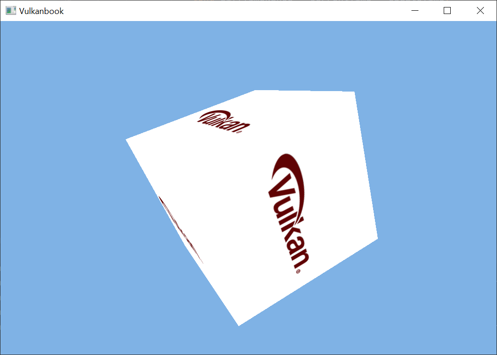

# Complex models and textures

In this chapter we will add support for loading complex 3D models which may include textures.

You can find the complete source code for this chapter [here](../../booksamples/chapter-08).

## Assimp

Up to now, we have been manually defining the 3D models directly in the code. In order to be able to load more complex 3D models we will use the well known Open Asset Import Library ([Assimp](https://www.assimp.org/)). In order to use that library we need to setup a specific dependency in  our `pom.xml` file:

```xml
<?xml version="1.0" encoding="UTF-8"?>
<project xmlns:xsi="http://www.w3.org/2001/XMLSchema-instance"
         xmlns="http://maven.apache.org/POM/4.0.0"
         xsi:schemaLocation="http://maven.apache.org/POM/4.0.0 http://maven.apache.org/xsd/maven-4.0.0.xsd">
...
    <dependencies>
...
        <dependency>
            <groupId>org.lwjgl</groupId>
            <artifactId>lwjgl-assimp</artifactId>
            <version>${lwjgl.version}</version>
        </dependency>
...
        <dependency>
            <groupId>org.lwjgl</groupId>
            <artifactId>lwjgl-assimp</artifactId>
            <version>${lwjgl.version}</version>
            <classifier>${native.target}</classifier>
            <scope>runtime</scope>
        </dependency>
...
    </dependencies>
</project>
```

We will create a new class named `ModelLoader`, which defines a method named `loadModel` to achieve the above mentioned goal:

```java
package org.vulkanb.eng.scene;
    ...
public class ModelLoader {
    ...
    public static ModelData loadModel(String modelId, String modelPath, String texturesDir) {
        return loadModel(modelId, modelPath, texturesDir, aiProcess_GenSmoothNormals | aiProcess_JoinIdenticalVertices |
                aiProcess_Triangulate | aiProcess_FixInfacingNormals | aiProcess_CalcTangentSpace |
                aiProcess_PreTransformVertices);
    }
    ...
}
```

The `loadModel` method receives an identifier associated to the model, the path to the file that contains the data of the model, and the directory where the textures will reside. This method just calls the homonym method in the same class with a  set of flags that will control the post-processing actions that Assimp will perform (it is a basically a utility method to setup the most common used flags). In our case we are using the following flags:

- `aiProcess_GenSmoothNormals`: This will try to generate smooth normals for all the vertices in the mesh.
- `aiProcess_JoinIdenticalVertices`: This will try to identify and combine duplicated vertices.
- `aiProcess_Triangulate`: This will transform each face of the mesh into a triangle (which is why we expect when loading that data into the GPU). If a face is made up of more than three indices, it will split that face into as many triangles as needed.
- `aiProcess_FixInfacingNormals`: This tries to identify normals that point inwards and reverse their direction.
- `aiProcess_CalcTangentSpace`: This calculates the tangents a bitangets for each mesh. We will not use these data immediately, but we will need it when we apply light effects later on.
- `aiProcess_PreTransformVertices`: This removes the node graph and pre-transforms all vertices with the local transformation matrices of their nodes. Keep in mind that this flag cannot be used with animations.

The `loadModel` method version which accepts the flags as a parameter is defined like this:

```java
public class ModelLoader {
    ...
    public static ModelData loadModel(String modelId, String modelPath, String texturesDir, int flags) {
        Logger.debug("Loading model data [{}]", modelPath);
        if (!new File(modelPath).exists()) {
            throw new RuntimeException("Model path does not exist [" + modelPath + "]");
        }
        if (!new File(texturesDir).exists()) {
            throw new RuntimeException("Textures path does not exist [" + texturesDir + "]");
        }

        AIScene aiScene = aiImportFile(modelPath, flags);
        if (aiScene == null) {
            throw new RuntimeException("Error loading model [modelPath: " + modelPath + ", texturesDir:" + texturesDir + "]");
        }

        int numMaterials = aiScene.mNumMaterials();
        List<ModelData.Material> materialList = new ArrayList<>();
        for (int i = 0; i < numMaterials; i++) {
            AIMaterial aiMaterial = AIMaterial.create(aiScene.mMaterials().get(i));
            ModelData.Material material = processMaterial(aiMaterial, texturesDir);
            materialList.add(material);
        }

        int numMeshes = aiScene.mNumMeshes();
        PointerBuffer aiMeshes = aiScene.mMeshes();
        List<ModelData.MeshData> meshDataList = new ArrayList<>();
        for (int i = 0; i < numMeshes; i++) {
            AIMesh aiMesh = AIMesh.create(aiMeshes.get(i));
            ModelData.MeshData meshData = processMesh(aiMesh);
            meshDataList.add(meshData);
        }

        ModelData modelData = new ModelData(modelId, meshDataList, materialList);

        aiReleaseImport(aiScene);
        Logger.debug("Loaded model [{}]", modelPath);
        return modelData;
    }
    ...
}
```

We first check if the path to the 3D model and the texture directory exist. After that, we import the 3D model by invoking the `aiImportFile` Assimp function which will return an `AIScene` structure. Then, we use the `AIScene` structure to load the 3D models materials. We get the total number of materials allocating as many structures of `AIMaterial` as needed. The material will hold information related to the textures and colors for each mesh. For each of the materials we extract the values that we will need by calling the `processMaterial` method. The next step is to load the meshes data by calling the `processMesh` method. As in the case of materials, we get the total number of meshes that the `AIScene` contains and allocate as many `AIMesh` structure as needed. Once we have finished processing the model we just release the `AIScene` and return the array of the meshes present in the model. Let's analyze first the  `processMaterial` method:

```java
public class ModelLoader {
    ...
    private static ModelData.Material processMaterial(AIMaterial aiMaterial, String texturesDir) {
        try (MemoryStack stack = MemoryStack.stackPush()) {
            AIColor4D colour = AIColor4D.create();

            Vector4f diffuse = ModelData.Material.DEFAULT_COLOR;
            int result = aiGetMaterialColor(aiMaterial, AI_MATKEY_COLOR_DIFFUSE, aiTextureType_NONE, 0,
                    colour);
            if (result == aiReturn_SUCCESS) {
                diffuse = new Vector4f(colour.r(), colour.g(), colour.b(), colour.a());
            }
            AIString aiTexturePath = AIString.calloc(stack);
            aiGetMaterialTexture(aiMaterial, aiTextureType_DIFFUSE, 0, aiTexturePath, (IntBuffer) null,
                    null, null, null, null, null);
            String texturePath = aiTexturePath.dataString();
            if (texturePath != null && texturePath.length() > 0) {
                texturePath = texturesDir + File.separator + new File(texturePath).getName();
                diffuse = new Vector4f(0.0f, 0.0f, 0.0f, 0.0f);
            }

            return new ModelData.Material(texturePath, diffuse);
        }
    }
    ...
}
```

We get the the texture associated to the diffuse color of the material by calling the `aiGetMaterialTexture` function. This function receives as a parameter an instance of an `AIString` that will be used to return the texture path. If the path is present (if it is not null or empty) we insert the path where the textures for this model will reside. Many models use absolute paths, which probably won't fit with the path were you store the model. This is the reason why get just the file name, without the possible path (either absolute or relative)that could be used in the model. Once we have got the texture path, we retrieve the material diffuse color by calling the `aiGetMaterialColor` function. All that information is stored in an instance of the `ModelData.Material` class. The constructed instance is appended to the list passed as a parameter that will contain all the materials of the model. The `ModelData` needs to be modified to include the definition of the `ModelData.Material` class and to hold the data for the associated materials:

```java
public class ModelData {
    private List<Material> materialList;
    ...
    public ModelData(String modelId, List<MeshData> meshDataList, List<Material> materialList) {
        ...
        this.materialList = materialList;
    }

    public List<Material> getMaterialList() {
        return materialList;
    }
    ...
    public record Material(String texturePath, Vector4f diffuseColor) {
        public static final Vector4f DEFAULT_COLOR = new Vector4f(1.0f, 1.0f, 1.0f, 1.0f);

        public Material() {
            this(null, DEFAULT_COLOR);
        }
    }
    ...
}
```

Going back to the `ModelLoader` class, the `processMesh` is defined like this:

```java
public class ModelLoader {
    ...
    private static ModelData.MeshData processMesh(AIMesh aiMesh) {
        List<Float> vertices = processVertices(aiMesh);
        List<Float> textCoords = processTextCoords(aiMesh);
        List<Integer> indices = processIndices(aiMesh);

        // Texture coordinates may not have been populated. We need at least the empty slots
        if (textCoords.isEmpty()) {
            int numElements = (vertices.size() / 3) * 2;
            for (int i = 0; i < numElements; i++) {
                textCoords.add(0.0f);
            }
        }

        int materialIdx = aiMesh.mMaterialIndex();
        return new ModelData.MeshData(listFloatToArray(vertices), listFloatToArray(textCoords), listIntToArray(indices),
                materialIdx);
    }
    ...
}
```

This method just delegates the vertices positions, texture coordinates and indices loading to other internal methods named `processVertices`, `processTextCoords` and `processIndices` respectively. Once that data has been loaded, we check if the model defined texture coordinates. If not, we create an empty placeholder for them. The buffers that we will create later on (which structure is defined in the `VertexBufferStructure` class) will assume that all of them will have position and texture coordinates so we need to reserve space for them. After that, we get the the material index associated with this mesh by calling the `mMaterialIndex` method over the `aiMesh` instance we are processing. By using that index, we can later on associate that mesh data to a material. The `ModelData.MeshData` class has been modified to include texture coordinates and material information:

```java
public class ModelData {
    ...
    public record MeshData(float[] positions, float[] textCoords, int[] indices, int materialIdx) {
    }
    ...
```

Going back to the `ModelLoader`class, the remaining methods are quite simple, we just extract the position and texture coordinates and the indices:

```java
public class ModelLoader {
    ...
    protected static List<Integer> processIndices(AIMesh aiMesh) {
        List<Integer> indices = new ArrayList<>();
        int numFaces = aiMesh.mNumFaces();
        AIFace.Buffer aiFaces = aiMesh.mFaces();
        for (int i = 0; i < numFaces; i++) {
            AIFace aiFace = aiFaces.get(i);
            IntBuffer buffer = aiFace.mIndices();
            while (buffer.remaining() > 0) {
                indices.add(buffer.get());
            }
        }
        return indices;
    }
    ...
    private static List<Float> processTextCoords(AIMesh aiMesh) {
        List<Float> textCoords = new ArrayList<>();
        AIVector3D.Buffer aiTextCoords = aiMesh.mTextureCoords(0);
        int numTextCoords = aiTextCoords != null ? aiTextCoords.remaining() : 0;
        for (int i = 0; i < numTextCoords; i++) {
            AIVector3D textCoord = aiTextCoords.get();
            textCoords.add(textCoord.x());
            textCoords.add(1 - textCoord.y());
        }
        return textCoords;
    }

    private static List<Float> processVertices(AIMesh aiMesh) {
        List<Float> vertices = new ArrayList<>();
        AIVector3D.Buffer aiVertices = aiMesh.mVertices();
        while (aiVertices.remaining() > 0) {
            AIVector3D aiVertex = aiVertices.get();
            vertices.add(aiVertex.x());
            vertices.add(aiVertex.y());
            vertices.add(aiVertex.z());
        }
        return vertices;
    }
}
```

The `ModelLoader` class uses some utility methods defied in a new class named `EngineUtils` to convert lists to arrays:

```java
package org.vulkanb.eng;

import java.util.List;

public class EngineUtils {

    private EngineUtils() {
        // Utility class
    }

    public static float[] listFloatToArray(List<Float> list) {
        int size = list != null ? list.size() : 0;
        float[] floatArr = new float[size];
        for (int i = 0; i < size; i++) {
            floatArr[i] = list.get(i);
        }
        return floatArr;
    }

    public static int[] listIntToArray(List<Integer> list) {
        return list.stream().mapToInt((Integer v) -> v).toArray();
    }
}
```

## Textures

We have already created the classes that support images and image views, however, we need to be able to load texture context from image files and to properly copy its contents to a buffer setting up the adequate layout. We will create a new class named `Texture` to support this. To load image files we will use the [stb]([GitHub - nothings/stb: stb single-file public domain libraries for C/C++](https://github.com/nothings/stb)) library, so we need to setup the following dependencies to the `pom.xml` file:

```xml
<?xml version="1.0" encoding="UTF-8"?>
<project xmlns:xsi="http://www.w3.org/2001/XMLSchema-instance"
         xmlns="http://maven.apache.org/POM/4.0.0"
         xsi:schemaLocation="http://maven.apache.org/POM/4.0.0 http://maven.apache.org/xsd/maven-4.0.0.xsd">
...
    <dependencies>
...
        <dependency>
            <groupId>org.lwjgl</groupId>
            <artifactId>lwjgl-stb</artifactId>
            <version>${lwjgl.version}</version>
        </dependency>
...
        <dependency>
            <groupId>org.lwjgl</groupId>
            <artifactId>lwjgl-stb</artifactId>
            <version>${lwjgl.version}</version>
            <classifier>${native.target}</classifier>
            <scope>runtime</scope>
        </dependency>
...
    </dependencies>
</project>
```

The `Texture` class constructor is defined like this:

```java
package org.vulkanb.eng.graph.vk;
    ...
public class Texture {
    ...
    public Texture(Device device, String fileName, int imageFormat) {
        Logger.debug("Creating texture [{}]", fileName);
        recordedTransition = false;
        this.fileName = fileName;
        ByteBuffer buf;
        try (MemoryStack stack = MemoryStack.stackPush()) {
            IntBuffer w = stack.mallocInt(1);
            IntBuffer h = stack.mallocInt(1);
            IntBuffer channels = stack.mallocInt(1);

            buf = stbi_load(fileName, w, h, channels, 4);
            if (buf == null) {
                throw new RuntimeException("Image file [" + fileName + "] not loaded: " + stbi_failure_reason());
            }

            width = w.get();
            height = h.get();
            mipLevels = 1;

            createStgBuffer(device, buf);
            Image.ImageData imageData = new Image.ImageData().width(width).height(height).
                    usage(VK_IMAGE_USAGE_TRANSFER_DST_BIT | VK_IMAGE_USAGE_SAMPLED_BIT).
                    format(imageFormat).mipLevels(mipLevels);
            image = new Image(device, imageData);
            ImageView.ImageViewData imageViewData = new ImageView.ImageViewData().format(image.getFormat()).
                    aspectMask(VK_IMAGE_ASPECT_COLOR_BIT).mipLevels(mipLevels);
            imageView = new ImageView(device, image.getVkImage(), imageViewData);        }

        stbi_image_free(buf);
    }
    ...
}
```

The `Texture` class defines the `recordedTransition` attribute to control if the texture has already been recorder to transition to the final layout or not (more on this later). We use the stb function `stbi_load` to load an image file. This function receives as a parameter the path to the file, three `IntBuffer`s to return the width , the height and the  color components of the image. It also receives the desired number of color components (`4` in our case, which represents RGBA). This function returns a `ByteBuffer` with the contents of the image if it has success and fills up the `IntBuffer` used as output parameters. After that, we create a Vulkan buffer which will be used to transfer the contents to the image. Then, we create a Vulkan image. It is interesting to review the usage flags we are using in in this case:

- `VK_IMAGE_USAGE_TRANSFER_DST_BIT`: The image can be used as a destination of a transfer command. We need this, because in our case, we will copy from a staging buffer to the image.

- `VK_IMAGE_USAGE_SAMPLED_BIT`: The image can be used to occupy a descriptor set (more on this later). In our case, the image needs to be used by a sampler in a fragment shader, so we need to set this flag.

At the end of the constructor we create an `ImageView` associated to the image and call the `stbi_image_free` to free the stb buffer. We can free that buffer because the contents of the image has been already loaded in to a Vulkan buffer in the `createStgBuffer` method:

```java
  public class Texture {
    ...
    private void createStgBuffer(Device device, ByteBuffer data) {
        int size = data.remaining();
        stgBuffer = new VulkanBuffer(device, size, VK_BUFFER_USAGE_TRANSFER_SRC_BIT,
                VK_MEMORY_PROPERTY_HOST_VISIBLE_BIT | VK_MEMORY_PROPERTY_HOST_COHERENT_BIT);
        long mappedMemory = stgBuffer.map();
        ByteBuffer buffer = MemoryUtil.memByteBuffer(mappedMemory, (int) stgBuffer.getRequestedSize());
        buffer.put(data);
        data.flip();
        stgBuffer.unMap();
    }
    ...
  }
```

We just create a new `VulkanBuffer` instance which size will be calculated assuming a RGBA model with one byte per channel. The buffer will be used to transfer the image data, this is why we use the `VK_BUFFER_USAGE_TRANSFER_SRC_BIT` flag and the `VK_MEMORY_PROPERTY_HOST_VISIBLE_BIT` (we will be loading the image from our application). We do not want to perform any flush operation while transferring the data so we also use the `VK_MEMORY_PROPERTY_HOST_COHERENT_BIT` flag. After the buffer has been created, we just map the memory associated to it and copy the image contents.

The `Texture` class defines a `cleanup` method to free the resources and special method named `cleanupStgBuffer` to free the staging buffer when is no longer needed. It also provides some *getters* to get the path to the file used to load the texture and the image view.

```java
public class Texture {
    ...
    public void cleanup() {
        cleanupStgBuffer();
        imageView.cleanup();
        image.cleanup();
    }

    public void cleanupStgBuffer() {
        if (stgBuffer != null) {
            stgBuffer.cleanup();
            stgBuffer = null;
        }
    }
    ...
    public String getFileName() {
        return fileName;
    }

    public ImageView getImageView() {
        return imageView;
    }
    ...
}
```

In order for Vulkan to correctly use the image, we need to transition it to the correct layout an copy the staging buffer contents to the image.This is done in the `recordTextureTransition` method.

```java
public class Texture {
    ...
    public void recordTextureTransition(CommandBuffer cmd) {
        if (stgBuffer != null && !recordedTransition) {
            Logger.debug("Recording transition for texture [{}]", fileName);
            recordedTransition = true;
            try (MemoryStack stack = MemoryStack.stackPush()) {
                recordImageTransition(stack, cmd, VK_IMAGE_LAYOUT_UNDEFINED, VK_IMAGE_LAYOUT_TRANSFER_DST_OPTIMAL);
                recordCopyBuffer(stack, cmd, stgBuffer);
                recordImageTransition(stack, cmd, VK_IMAGE_LAYOUT_TRANSFER_DST_OPTIMAL, VK_IMAGE_LAYOUT_SHADER_READ_ONLY_OPTIMAL);
            }
        } else {
            Logger.debug("Texture [{}] has already been transitioned", fileName);
        }
    }
    ...
}
```

This method first checks that if the texture has already been transitioned (`stgBuffer` will be null) or the command to perform that transition have already been recorded (`recordedTransition` would be true). It is important to keep in mind that models may share the same texture for different areas, so it is important to control this to avoid executing useless commands. If this this not the case, it records the transition of the image layout to one where we can copy the staging buffer contents. That is, we transition from `VK_IMAGE_LAYOUT_UNDEFINED` to `VK_IMAGE_LAYOUT_TRANSFER_DST_OPTIMAL` layout by calling the `recordImageTransition`. After that, it records the commands to copy the staging buffer contents to the image, by calling the `recordCopyBuffer`. Finally, we record the commands to transition the layout from `VK_IMAGE_LAYOUT_TRANSFER_DST_OPTIMAL` to `VK_IMAGE_LAYOUT_SHADER_READ_ONLY_OPTIMAL` by calling again the `recordImageTransition` method. The texture will be used in a shader, no one will be writing to it after we have finished with the staging buffer, therefore, the `VK_IMAGE_LAYOUT_SHADER_READ_ONLY_OPTIMAL` is the appropriate state.

An important issue to highlight is that we are recording commands that can be submitted to a queue. In this way, we can group the commands associated to several textures and submit them using a single call, instead of going one by one. This should  reduce the loading time when dealing with several textures. We can view now the definition of the `recordImageTransition` method:

```java
public class Texture {
    ...
    private void recordImageTransition(MemoryStack stack, CommandBuffer cmd, int oldLayout, int newLayout) {

        VkImageMemoryBarrier.Buffer barrier = VkImageMemoryBarrier.calloc(1, stack)
                .sType(VK_STRUCTURE_TYPE_IMAGE_MEMORY_BARRIER)
                .oldLayout(oldLayout)
                .newLayout(newLayout)
                .srcQueueFamilyIndex(VK_QUEUE_FAMILY_IGNORED)
                .dstQueueFamilyIndex(VK_QUEUE_FAMILY_IGNORED)
                .image(image.getVkImage())
                .subresourceRange(it -> it
                        .aspectMask(VK_IMAGE_ASPECT_COLOR_BIT)
                        .baseMipLevel(0)
                        .levelCount(mipLevels)
                        .baseArrayLayer(0)
                        .layerCount(1));
        ...
    }
    ...
}
```

In order to transition the image layout we will use Vulkan image barriers. Memory barriers in Vulkan are used to specify availability and visibility dependencies over a memory region. For example, we can set up a barrier to ensure that a specific operation, such as image layout, is executed before we write to that image. Memory barriers are another synchronization mechanism that introduces dependencies over memory resources. A memory barrier defines a first set of operations which must finish before the availability operation executes. Only after that availability operation has been completed, the visibility operation can execute. In the case of an image layout transition, the availability operation is the image transition itself. To use a Vulkan image memory barrier we need to create a `VkImageMemoryBarrier` structure, which has the following fields:

- `sType`: The type of structure: `VK_STRUCTURE_TYPE_IMAGE_MEMORY_BARRIER`.
- `oldLayout`: The initial layout.
- `newLayout`: The layout to which we want to transition to.
- `srcQueueFamilyIndex` and `dstQueueFamilyIndex` are only used to transfer the ownership from one queue family to another. We will not using this feature, so we set the `VK_QUEUE_FAMILY_IGNORED` value.
- `image`: The handle to the image to use in this barrier.
- `subresourceRange`: Barriers can be applied to a sub-resource range of an image. We can control if this is applied to specific mip level or an image inside an image array. 

Now we need to control the barrier conditions:

```java
public class Texture {
    ...
    private void recordImageTransition(MemoryStack stack, CommandBuffer cmd, int oldLayout, int newLayout) {
        ...
        int srcStage;
        int srcAccessMask;
        int dstAccessMask;
        int dstStage;

        if (oldLayout == VK_IMAGE_LAYOUT_UNDEFINED && newLayout == VK_IMAGE_LAYOUT_TRANSFER_DST_OPTIMAL) {
            srcStage = VK_PIPELINE_STAGE_TOP_OF_PIPE_BIT;
            srcAccessMask = 0;
            dstStage = VK_PIPELINE_STAGE_TRANSFER_BIT;
            dstAccessMask = VK_ACCESS_TRANSFER_WRITE_BIT;
        } else if (oldLayout == VK_IMAGE_LAYOUT_TRANSFER_DST_OPTIMAL && newLayout == VK_IMAGE_LAYOUT_SHADER_READ_ONLY_OPTIMAL) {
            srcStage = VK_PIPELINE_STAGE_TRANSFER_BIT;
            srcAccessMask = VK_ACCESS_TRANSFER_WRITE_BIT;
            dstStage = VK_PIPELINE_STAGE_FRAGMENT_SHADER_BIT;
            dstAccessMask = VK_ACCESS_SHADER_READ_BIT;
        } else {
            throw new RuntimeException("Unsupported layout transition");
        }

        barrier.srcAccessMask(srcAccessMask);
        barrier.dstAccessMask(dstAccessMask);

        vkCmdPipelineBarrier(cmd.getVkCommandBuffer(), srcStage, dstStage, 0, null, null, barrier);
    }
    ...
}
```

The `srcAccessMask` limits the access to the memory to the first scope of the barrier with that access mask. The `dstAccesMask` limits the execution of the second scope of the barrier to that access mask. In our specific case we will performing two transitions:

1. From undefined layout to a layout where we can transfer the image contents.
2. From that transfer layout to one that will be used by the shader.

In the first case, the first condition of the `if` block will be executed. We will be using the `srcAccessMask` with the `0` value. This means that we do not need to wait for anything, we can start as soon as possible, this is the reason why we use also the `VK_PIPELINE_STAGE_TOP_OF_PIPE_BIT` for the `srcStage`, the earliest possible pipeline stage. To sum up, with these parameters we are no waiting for anything, we want to start the transition as soon is possible. In this case, for the `dstAccessMask` we are using the `VK_ACCESS_TRANSFER_WRITE_BIT`, which means that any operation that will perform that type of access will wait on that barrier, it will wait until the layout transition has been completed. We are using the `VK_PIPELINE_STAGE_TRANSFER_BIT`, which is a specific stage that can be used in copy commands.

In the second case, the second `if` condition will be executed. We use the `VK_ACCESS_TRANSFER_WRITE_BIT` access mask as the `srcAccessMask` and the `VK_PIPELINE_STAGE_TRANSFER_BIT` as the `srcStage`. The purpose of this is to start at the point where the other barrier conditions ended. In this case, we want to block accesses to this image where it will be used, in the fragment shader, so we set the `VK_PIPELINE_STAGE_FRAGMENT_SHADER_BIT` for the `dstStage` attribute. The types of access we want to block until the barrier completes the layout transition are the ones set in the `dstAccessMask`: `VK_ACCESS_SHADER_READ_BIT`, that is reading from a shader.

Once the conditions has been set we record the image pipeline barrier by invoking the `vkCmdPipelineBarrier` function.

The only missing method in t he `Texture` class is the `recordCopyBuffer`:

```java
public class Texture {
    ...
    private void recordCopyBuffer(MemoryStack stack, CommandBuffer cmd, VulkanBuffer bufferData) {

        VkBufferImageCopy.Buffer region = VkBufferImageCopy.calloc(1, stack)
                .bufferOffset(0)
                .bufferRowLength(0)
                .bufferImageHeight(0)
                .imageSubresource(it ->
                        it.aspectMask(VK_IMAGE_ASPECT_COLOR_BIT)
                                .mipLevel(0)
                                .baseArrayLayer(0)
                                .layerCount(1)
                )
                .imageOffset(it -> it.x(0).y(0).z(0))
                .imageExtent(it -> it.width(width).height(height).depth(1));

        vkCmdCopyBufferToImage(cmd.getVkCommandBuffer(), bufferData.getBuffer(), image.getVkImage(),
                VK_IMAGE_LAYOUT_TRANSFER_DST_OPTIMAL, region);
    }
    ...
}
```

This method invokes the `vkCmdCopyBufferToImage` to record the command which will copy the contents of the staging buffer into an image. The parameters are more or less self explanatory, in this case, we are expecting the image to be in the `VK_IMAGE_LAYOUT_TRANSFER_DST_OPTIMAL` layout, this is the reason we need to perform an initial layout transition. This command accepts to restrict the copy to a set of regions, in our case we will use the full extent of the image.

Now that the `Texture` class is complete, we are ready to to use it. In 3D models, it is common that multiple meshes share the same texture file, we want to control that to avoid loading the same resource multiple times. We will create a new class named `TextureCache` to control this:

```java
package org.vulkanb.eng.graph;
    ...
public class TextureCache {

    private final IndexedLinkedHashMap<String, Texture> textureMap;

    public TextureCache() {
        textureMap = new IndexedLinkedHashMap<>();
    }
    ...
}
```

This class will store in a `IndexedLinkedHashMap` the textures indexed by the path to the file use to load them. The reason for this structure is to be able to recover the texture by its path (like in a `Map`) while maintaining the insertion order. Although by now, we will be accessing by path, later on we will need to get the textures by the position they were loaded. The `TextureCache` class defines a method to create a `Texture` named `createTexture`. That method will check if the texture has been already created, to avoid creating multiple textures for the same file. If the texture path passed as a parameter is null or empty, it will return a default texture:

```java
public class TextureCache {
    ...
    public Texture createTexture(Device device, String texturePath, int format) {
        String path = texturePath;
        if (texturePath == null || texturePath.trim().isEmpty()) {
            EngineProperties engProperties = EngineProperties.getInstance();
            path = engProperties.getDefaultTexturePath();
        }
        Texture texture = textureMap.get(path);
        if (texture == null) {
            texture = new Texture(device, path, format);
            textureMap.put(path, texture);
        }
        return texture;
    }
    ...
}
```

Returning a default texture will allow us to assume that every model will have a texture, simplifying the shaders. The default texture will also have a black color, which is useful to combine in a shader when we have models that define a specific color instead of a texture. We need to add a new property to configure the default texture in the `EngineProperties`  class:

```java
public class EngineProperties {
    ...
    private String defaultTexturePath;
    ...    
    private EngineProperties() {
        ...
            defaultTexturePath = props.getProperty("defaultTexturePath");
        ...
    }
    ...
    public String getDefaultTexturePath() {
        return defaultTexturePath;
    }
    ...
}
```

Back to the `TextureCache`  class, the rest of the methods are the classical `cleanup` method to free the images and the `getTexture` method to be able to retrieve one already created `Texture` using is file path and through their position.

```java
public class TextureCache {
    ...
    public void cleanup() {
        textureMap.forEach((k, v) -> v.cleanup());
        textureMap.clear();
    }
    ...
    public List<Texture> getAsList() {
        return new ArrayList<>(textureMap.values());
    }

    public int getPosition(String texturePath) {
        int result = -1;
        if (texturePath != null) {
            result = textureMap.getIndexOf(texturePath);
        }
        return result;
    }

    public Texture getTexture(String texturePath) {
        return textureMap.get(texturePath.trim());
    }
}
```

The `IndexedLinkedHashMap` is defined like this:
```java
package org.vulkanb.eng.graph;

import java.util.*;

public class IndexedLinkedHashMap<K, V> extends LinkedHashMap<K, V> {

    private final List<K> indexList = new ArrayList<>();

    public int getIndexOf(K key) {
        return indexList.indexOf(key);
    }

    public V getValueAtIndex(int i) {
        return super.get(indexList.get(i));
    }

    @Override
    public V put(K key, V val) {
        if (!super.containsKey(key)) indexList.add(key);
        return super.put(key, val);
    }
}
```

The next step is to update the `VulkanModel` class to support material definition. By now, a material will hold a reference to the color of the material and its texture, but it will be modified in the future to define other parameters (such as normal maps, etc.). The same material can be applied to several meshes, so we will organize meshes around them to render efficiently. The modifications are listed below:

```java
public class VulkanModel {
    ...
    private List<VulkanModel.VulkanMaterial> vulkanMaterialList;

    public VulkanModel(String modelId) {
        this.modelId = modelId;
        vulkanMaterialList = new ArrayList<>();
    }
    ...
    public record VulkanMaterial(Vector4f diffuseColor, Texture texture, boolean hasTexture,
                                 List<VulkanMesh> vulkanMeshList) {
    }
    ...
}
```

`VulkanModel` class will no longer store a list of meshes but a list of materials (which will hold references to meshes). Therefore, the `vulkanMaterialList` attribute needs to be removed. We need to change also the `transformModels` method to load the textures:

```java
public class VulkanModel {
    ...
    private static VulkanMaterial transformMaterial(ModelData.Material material, Device device, TextureCache textureCache,
                                                    CommandBuffer cmd, List<Texture> textureList) {
        Texture texture = textureCache.createTexture(device, material.texturePath(), VK_FORMAT_R8G8B8A8_SRGB);
        boolean hasTexture = material.texturePath() != null && material.texturePath().trim().length() > 0;

        if (hasTexture) {
            texture.recordTextureTransition(cmd);
            textureList.add(texture);
        }

        return new VulkanModel.VulkanMaterial(material.diffuseColor(), texture, hasTexture, new ArrayList<>());
    }
    
    public static List<VulkanModel> transformModels(List<ModelData> modelDataList, TextureCache textureCache,
                                                    CommandPool commandPool, Queue queue) {
        ...
        List<Texture> textureList = new ArrayList<>();
        ...
        for (ModelData modelData : modelDataList) {
            VulkanModel vulkanModel = new VulkanModel(modelData.getModelId());
            vulkanModelList.add(vulkanModel);

            // Create textures defined for the materials
            VulkanMaterial defaultVulkanMaterial = null;
            for (ModelData.Material material : modelData.getMaterialList()) {
                VulkanMaterial vulkanMaterial = transformMaterial(material, device, textureCache, cmd, textureList);
                vulkanModel.vulkanMaterialList.add(vulkanMaterial);
            }

            // Transform meshes loading their data into GPU buffers
            for (ModelData.MeshData meshData : modelData.getMeshDataList()) {
                TransferBuffers verticesBuffers = createVerticesBuffers(device, meshData);
                TransferBuffers indicesBuffers = createIndicesBuffers(device, meshData);
                stagingBufferList.add(verticesBuffers.srcBuffer());
                stagingBufferList.add(indicesBuffers.srcBuffer());
                recordTransferCommand(cmd, verticesBuffers);
                recordTransferCommand(cmd, indicesBuffers);

                VulkanModel.VulkanMesh vulkanMesh = new VulkanModel.VulkanMesh(verticesBuffers.dstBuffer(),
                        indicesBuffers.dstBuffer(), meshData.indices().length);

                VulkanMaterial vulkanMaterial;
                int materialIdx = meshData.materialIdx();
                if (materialIdx >= 0 && materialIdx < vulkanModel.vulkanMaterialList.size()) {
                    vulkanMaterial = vulkanModel.vulkanMaterialList.get(materialIdx);
                } else {
                    if (defaultVulkanMaterial == null) {
                        defaultVulkanMaterial = transformMaterial(new ModelData.Material(), device, textureCache, cmd, textureList);
                    }
                    vulkanMaterial = defaultVulkanMaterial;
                }
                vulkanMaterial.vulkanMeshList.add(vulkanMesh);
            }
        }

        cmd.endRecording();
        Fence fence = new Fence(device, true);
        fence.reset();
        try (MemoryStack stack = MemoryStack.stackPush()) {
            queue.submit(stack.pointers(cmd.getVkCommandBuffer()), null, null, null, fence);
        }
        fence.fenceWait();
        fence.cleanup();
        cmd.cleanup();

        stagingBufferList.forEach(VulkanBuffer::cleanup);
        textureList.forEach(Texture::cleanupStgBuffer);

        return vulkanModelList;
    }
    ...
}
```

As you can see, when processing the models, we iterate over the materials of the model. Each material is processed in the `transformMaterial` method in which, we get the path to the texture. We request that texture to the `TextureCache` instance and record the transition and copy commands in the same command buffer that we are using to record the transfer operations for the vertices and the indices (if the texture exists). Back in the `transformModels`, at the end, we can free the staging buffer created in the `Texture` constructor at the same place where we were also releasing the other staging buffer for the vertices and indices. The `cleanup` method needs also to be modified since the meshes, hang now under the material instances:
```java
public class VulkanModel {
    ...
    public void cleanup() {
        vulkanMaterialList.forEach(m -> m.vulkanMeshList.forEach((VulkanMesh::cleanup)));
    }
    ...
}
```

## Descriptors

Descriptors represent shader resources such us buffers, images or samplers. We will need to use descriptors in order to access the textures from the shaders and also for uniforms (in Vulkan uniforms are just the way to access buffers in the shaders). Descriptors are grouped in descriptor sets, whose general structure is defined through descriptor layouts. Descriptors are like handles to access resources from shaders, and they are created through a descriptor pool. So let's start by defining a new class to handle those pools. This is the constructor of the `DescriptorPool` class:

```java
package org.vulkanb.eng.graph.vk;
    ...
public class DescriptorPool {
    ...
    public DescriptorPool(Device device, List<DescriptorTypeCount> descriptorTypeCounts) {
        Logger.debug("Creating descriptor pool");
        this.device = device;
        try (MemoryStack stack = MemoryStack.stackPush()) {
            int maxSets = 0;
            int numTypes = descriptorTypeCounts.size();
            VkDescriptorPoolSize.Buffer typeCounts = VkDescriptorPoolSize.calloc(numTypes, stack);
            for (int i = 0; i < numTypes; i++) {
                maxSets += descriptorTypeCounts.get(i).count();
                typeCounts.get(i)
                        .type(descriptorTypeCounts.get(i).descriptorType())
                        .descriptorCount(descriptorTypeCounts.get(i).count());
            }

            VkDescriptorPoolCreateInfo descriptorPoolInfo = VkDescriptorPoolCreateInfo.calloc(stack)
                    .sType(VK_STRUCTURE_TYPE_DESCRIPTOR_POOL_CREATE_INFO)
                    .flags(VK_DESCRIPTOR_POOL_CREATE_FREE_DESCRIPTOR_SET_BIT)
                    .pPoolSizes(typeCounts)
                    .maxSets(maxSets);

            LongBuffer pDescriptorPool = stack.mallocLong(1);
            vkCheck(vkCreateDescriptorPool(device.getVkDevice(), descriptorPoolInfo, null, pDescriptorPool),
                    "Failed to create descriptor pool");
            vkDescriptorPool = pDescriptorPool.get(0);
        }
    }
    ...
    public record DescriptorTypeCount(int count, int descriptorType) {
    }
}
```

A descriptor pool is just a place holder for descriptor set handles. When it is created, it just allocates different descriptor set according to their types. Vulkan defines several types for the descriptor sets,  uniforms, texture samplers, etc. We can specify how many descriptors we want to pre-create for each type. Therefore, the `DescriptorPool` constructor receives, besides a reference to the device, a list of `DescriptorTypeCount` which specifies how many descriptor sets should be allocated for each type. With that information we will fill up a buffer of `VkDescriptorPoolSize` structures which will be used in `VkDescriptorPoolCreateInfo` structure that requires the `vkCreateDescriptorPool`. One important topic to highlight is that in the `VkDescriptorPoolCreateInfo` we have set the flag `VK_DESCRIPTOR_POOL_CREATE_FREE_DESCRIPTOR_SET_BIT`. This flag will allow us to return descriptor sets to the pool when they are no longer used. They can be returned by calling the `freeDescriptorSet` method:

```java
public class DescriptorPool {
    ...
    public void freeDescriptorSet(long vkDescriptorSet) {
        try (MemoryStack stack = MemoryStack.stackPush()) {
            LongBuffer longBuffer = stack.mallocLong(1);
            longBuffer.put(0, vkDescriptorSet);

            vkCheck(vkFreeDescriptorSets(device.getVkDevice(), vkDescriptorPool, longBuffer),
                    "Failed to free descriptor set");
        }
    }
    ...
}
```

The rest of the methods of this class are the classical cleanup and getter to obtain the descriptor pool handle:

```java
public class DescriptorPool {
    ...
    public void cleanup() {
        Logger.debug("Destroying descriptor pool");
        vkDestroyDescriptorPool(device.getVkDevice(), vkDescriptorPool, null);
    }
    ...    
    public Device getDevice() {
        return device;
    }

    public long getVkDescriptorPool() {
        return vkDescriptorPool;
    }
    ...
}
```

The format of each descriptor set must me defined by a descriptor set layout. The layout will be something very dependent on the specific data structures that we will use in our shaders. However, we will create an abstract class to avoid repeating the cleanup method and to store its handle:

```java
package org.vulkanb.eng.graph.vk;

import org.lwjgl.system.MemoryStack;
import org.lwjgl.vulkan.*;
import org.tinylog.Logger;

import java.nio.LongBuffer;

import static org.lwjgl.vulkan.VK11.*;
import static org.vulkanb.eng.graph.vk.VulkanUtils.vkCheck;

public abstract class DescriptorSetLayout {

    private final Device device;
    
    protected long vkDescriptorLayout;

    protected DescriptorSetLayout(Device device) {
        this.device = device;
    }

    public void cleanup() {
        Logger.debug("Destroying descriptor set layout");
        vkDestroyDescriptorSetLayout(device.getVkDevice(), vkDescriptorLayout, null);
    }

    public long getVkDescriptorLayout() {
        return vkDescriptorLayout;
    }
    ...
}
```

This class wil also hold a base class for creating normal case descriptor set layouts, named `SimpleDescriptorSetLayout`:
```java
public abstract class DescriptorSetLayout {
    ...
    public static class SimpleDescriptorSetLayout extends DescriptorSetLayout {
        ...
        public SimpleDescriptorSetLayout(Device device, int descriptorType, int binding, int stage) {
            super(device);
            try (MemoryStack stack = MemoryStack.stackPush()) {
                VkDescriptorSetLayoutBinding.Buffer layoutBindings = VkDescriptorSetLayoutBinding.calloc(1, stack);
                layoutBindings.get(0)
                        .binding(binding)
                        .descriptorType(descriptorType)
                        .descriptorCount(1)
                        .stageFlags(stage);

                VkDescriptorSetLayoutCreateInfo layoutInfo = VkDescriptorSetLayoutCreateInfo.calloc(stack)
                        .sType(VK_STRUCTURE_TYPE_DESCRIPTOR_SET_LAYOUT_CREATE_INFO)
                        .pBindings(layoutBindings);

                LongBuffer pSetLayout = stack.mallocLong(1);
                vkCheck(vkCreateDescriptorSetLayout(device.getVkDevice(), layoutInfo, null, pSetLayout),
                        "Failed to create descriptor set layout");
                super.vkDescriptorLayout = pSetLayout.get(0);
            }
        }
    }
    ...
}
```
We start by defining the binding point (given a descriptor set, each of the descriptors will be assigned to a unique binding number). This is done by filling up a buffer of `VkDescriptorSetLayoutBinding` structures (one for each type). In our case we will just be using one descriptor, that will be associated to the binding point passed as the `binding` parameter. This binding number shall match the one used in the shader for this specific descriptor. In addition to that, we specify the stage where it will be used. That information is used to create the descriptor set layout by instantiating a `VkDescriptorSetLayoutCreateInfo` structure that will be used in the `vkCreateDescriptorSetLayout` function.

Now we can a define a descriptor set layout that which will be used to access the texture data. This will be a new class named `SamplerDescriptorSetLayout` that will extend the `SimpleDescriptorSetLayout` class:
```java
public abstract class DescriptorSetLayout {
    ...
    public static class SamplerDescriptorSetLayout extends SimpleDescriptorSetLayout {
        public SamplerDescriptorSetLayout(Device device, int binding, int stage) {
            super(device, VK_DESCRIPTOR_TYPE_COMBINED_IMAGE_SAMPLER, binding, stage);
        }
    }
    ...
}
```
This class sets the descriptor layout type to the `VK_DESCRIPTOR_TYPE_COMBINED_IMAGE_SAMPLER` value.  A combined image sampler is a descriptor type which combines an image sampler with an image into a single descriptor set. This is the type that we need when using a `sampler2D` in a shader (more on this later).

Finally, we will define a descriptor set lay out which will be used for uniforms. This will be a new class named `UniformDescriptorSetLayout` that will also extend the `SimpleDescriptorSetLayout` class:

```java
public abstract class DescriptorSetLayout {
    ...
    public static class UniformDescriptorSetLayout extends SimpleDescriptorSetLayout {
        public UniformDescriptorSetLayout(Device device, int binding, int stage) {
            super(device, VK_DESCRIPTOR_TYPE_UNIFORM_BUFFER, binding, stage);
        }
    }
    ...
}
```
This class sets the descriptor layout type to the `VK_DESCRIPTOR_TYPE_UNIFORM_BUFFER` value.

We have just talked about samplers, but what are samplers anyway? Images are not usually accessed directly when used as textures. When we access a texture, we usually want to apply some type of filters, we may have mip levels and maybe specify some repetition patterns. All that is handled through a sampler. We have already created the image and a descriptor set layout which combines an image and a sampler. That combination of image and sampler will be used in our shader, but in our application we need to explicitly create the sampler. Therefore we will create a new class named `TextureSampler`: 

```java
package org.vulkanb.eng.graph.vk;

import org.lwjgl.system.MemoryStack;
import org.lwjgl.vulkan.VkSamplerCreateInfo;

import java.nio.LongBuffer;

import static org.lwjgl.vulkan.VK11.*;
import static org.vulkanb.eng.graph.vk.VulkanUtils.vkCheck;

public class TextureSampler {

    private static final int MAX_ANISOTROPY = 16;
    
    private final Device device;
    private final long vkSampler;

    public TextureSampler(Device device, int mipLevels) {
        this.device = device;
        try (MemoryStack stack = MemoryStack.stackPush()) {
            VkSamplerCreateInfo samplerInfo = VkSamplerCreateInfo.calloc(stack)
                    .sType(VK_STRUCTURE_TYPE_SAMPLER_CREATE_INFO)
                    .magFilter(VK_FILTER_LINEAR)
                    .minFilter(VK_FILTER_LINEAR)
                    .addressModeU(VK_SAMPLER_ADDRESS_MODE_REPEAT)
                    .addressModeV(VK_SAMPLER_ADDRESS_MODE_REPEAT)
                    .addressModeW(VK_SAMPLER_ADDRESS_MODE_REPEAT)
                    .borderColor(VK_BORDER_COLOR_INT_OPAQUE_BLACK)
                    .unnormalizedCoordinates(false)
                    .compareEnable(false)
                    .compareOp(VK_COMPARE_OP_ALWAYS)
                    .mipmapMode(VK_SAMPLER_MIPMAP_MODE_LINEAR)
                    .minLod(0.0f)
                    .maxLod(mipLevels)
                    .mipLodBias(0.0f);
            if (device.isSamplerAnisotropy()) {
                samplerInfo
                        .anisotropyEnable(true)
                        .maxAnisotropy(MAX_ANISOTROPY);
            }

            LongBuffer lp = stack.mallocLong(1);
            vkCheck(vkCreateSampler(device.getVkDevice(), samplerInfo, null, lp), "Failed to create sampler");
            vkSampler = lp.get(0);
        }
    }

    public void cleanup() {
        vkDestroySampler(device.getVkDevice(), vkSampler, null);
    }

    public long getVkSampler() {
        return vkSampler;
    }
}
```

In order to create a sampler, we need to invoke the `vkCreateSampler` function which requires a `VkSamplerCreateInfo` structure, defined by the following fields:

- `sType`: The type of the structure: `VK_STRUCTURE_TYPE_SAMPLER_CREATE_INFO`.
- `magFilter` and `minFilter`: control how magnification and magnification filter work while performing a texture lookup. In this case, we are using a `VK_FILTER_LINEAR` filter, which is the value for a liner filter (for a 2D texture, it combines for values of four pixels weighted). You can use `VK_FILTER_NEAREST` to pickup just the closest value in the lookup or `VK_FILTER_CUBIC_EXT` to apply cubic filtering (it uses 16 values for 2D textures).
- `addressModeU`, `addressModeV` and `addressModeW`: This will control what will be returned for a texture lookup when the coordinates lay out of the texture size. The `U`, `V` and `W` refer to the `x`, `y` and `z` axis (for 3D images). In this case, we specify the `VK_SAMPLER_ADDRESS_MODE_REPEAT` which means that the texture is repeated endlessly over all the axis. There are some other values such as `VK_SAMPLER_ADDRESS_MODE_MIRRORED_REPEAT` or `VK_SAMPLER_ADDRESS_MODE_CLAMP_TO_EDGE` which are similar as the ones used in OpenGL.
- `borderColor`: This sets the color for the border that will be used for texture lookups beyond bounds when `VK_SAMPLER_ADDRESS_MODE_CLAMP_TO_BORDER` is used in the `addressModeX` attributes.
- `unnormalizedCoordinates`: Texture coordinates cover the [0, 1] range. When this parameter is set to `true` the coordinates will cover the ranges [0, width], [0, height].
- `compareEnable`: It enables a comparison when performing texture lookups.
- `compareOp`: It specifies the comparison operation. We will not be using this at this moment.
- `mipmapMode`: This is used to specify the mipmap filter to apply in lookups. We will address that in later chapters.
- `minLod`, `maxLod` and `mipLoadBias`: These parameters are used for mip mapping, so we will review them later on.

Finally, we enable anisotropic filter if the device supports it. With all that information we just call the `vkCreateSampler` function and complete the class with the usual `cleanup` and the getter methods. Anisotropic filtering is used to eliminate aliasing effects when sampling from a texture.

The sampler anisotropy attribute, requires some changes in the `Device` class. We need to first query if sampler anisotropy is supported and then enabled it, storing that capability as an attribute of the `Device` class:

```java
public class Device {
    ...
    private boolean samplerAnisotropy;
    ...
    public Device(PhysicalDevice physicalDevice) {
        ...
            VkPhysicalDeviceFeatures features = VkPhysicalDeviceFeatures.calloc(stack);
            VkPhysicalDeviceFeatures supportedFeatures = this.physicalDevice.getVkPhysicalDeviceFeatures();
            samplerAnisotropy = supportedFeatures.samplerAnisotropy();
            if (samplerAnisotropy) {
                features.samplerAnisotropy(true);
            }
        ...
    }
    ...
    public boolean isSamplerAnisotropy() {
        return samplerAnisotropy;
    }
    ...
}
```

It is turn now to create the texture descriptor set. We will first create an abstract class named `DescriptorSet` which will contain the handle for a descriptor set. This class will be extended by each descriptor set type we will create.

```java
package org.vulkanb.eng.graph.vk;

public abstract class DescriptorSet {

    protected long vkDescriptorSet;

    public long getVkDescriptorSet() {
        return vkDescriptorSet;
    }
}
```

Then we can define a new class named `TextureDescriptorSet` for handling descriptor sets associated to textures. Its constructor starts like this:

```java
public class TextureDescriptorSet extends DescriptorSet {
    ...
    public TextureDescriptorSet(DescriptorPool descriptorPool, DescriptorSetLayout descriptorSetLayout,
                                Texture texture, TextureSampler textureSampler, int binding) {
        try (MemoryStack stack = MemoryStack.stackPush()) {
            Device device = descriptorPool.getDevice();
            LongBuffer pDescriptorSetLayout = stack.mallocLong(1);
            pDescriptorSetLayout.put(0, descriptorSetLayout.getVkDescriptorLayout());
            VkDescriptorSetAllocateInfo allocInfo = VkDescriptorSetAllocateInfo.calloc(stack)
                    .sType(VK_STRUCTURE_TYPE_DESCRIPTOR_SET_ALLOCATE_INFO)
                    .descriptorPool(descriptorPool.getVkDescriptorPool())
                    .pSetLayouts(pDescriptorSetLayout);

            LongBuffer pDescriptorSet = stack.mallocLong(1);
            vkCheck(vkAllocateDescriptorSets(device.getVkDevice(), allocInfo, pDescriptorSet),
                    "Failed to create descriptor set");
            vkDescriptorSet = pDescriptorSet.get(0);
            ...
        }
    }
    ...
}
```

We start by allocating the descriptor set. In order to that, we need to invoke the `vkAllocateDescriptorSets` Vulkan function which requires a `VkDescriptorSetAllocateInfo` structure. This structure needs a handle to a descriptor pool and a handle to the layout which describes the descriptor set. After that, we need to link this descriptor set with texture (the image view) and the sampler previously created:

```java
public class TextureDescriptorSet extends DescriptorSet {
    ...
    public TextureDescriptorSet(DescriptorPool descriptorPool, DescriptorSetLayout descriptorSetLayout,
                                Texture texture, TextureSampler textureSampler, int binding) {
        try (MemoryStack stack = MemoryStack.stackPush()) {
            ...
            VkDescriptorImageInfo.Buffer imageInfo = VkDescriptorImageInfo.calloc(1, stack)
                    .imageLayout(VK_IMAGE_LAYOUT_SHADER_READ_ONLY_OPTIMAL)
                    .imageView(texture.getImageView().getVkImageView())
                    .sampler(textureSampler.getVkSampler());

            VkWriteDescriptorSet.Buffer descrBuffer = VkWriteDescriptorSet.calloc(1, stack);
            descrBuffer.get(0)
                    .sType(VK_STRUCTURE_TYPE_WRITE_DESCRIPTOR_SET)
                    .dstSet(vkDescriptorSet)
                    .dstBinding(binding)
                    .descriptorType(VK_DESCRIPTOR_TYPE_COMBINED_IMAGE_SAMPLER)
                    .descriptorCount(1)
                    .pImageInfo(imageInfo);

            vkUpdateDescriptorSets(device.getVkDevice(), descrBuffer, null);
        }
    }

    public long getVkDescriptorSet() {
        return vkDescriptorSet;
    }
}
```

We are using a `VkDescriptorImageInfo` structure to specify the descriptor image information. With this structure we combine the image view associated with the texture ad the sampler. It is important to specify the correct layout where the associated should be while sampled (`VK_IMAGE_LAYOUT_SHADER_READ_ONLY_OPTIMAL`). After that we need to update the contents of the descriptor set to associate it with those resources. We create a `VkWriteDescriptorSet` structure which has the following fields:

- `sType`: The type of structure: `VK_STRUCTURE_TYPE_WRITE_DESCRIPTOR_SET`:
- `dstSet`: This the handle to the descriptor set to update.
- `dstBinding`: This is the descriptor binding in that descriptor set to update. (A single descriptor set can group many descriptors using different bindings).
- `descriptorType`: This is the descriptor type, in our case it is a combined image and sampler (`VK_DESCRIPTOR_TYPE_COMBINED_IMAGE_SAMPLER`).
- `descriptorCount`: The number of descriptors to update.
- `pImageInfo`: A pointer to a `VkDescriptorImageInfo` buffer.

## Uniforms

One way of passing data to shaders are uniforms. In Vulkan, regular uniforms (not talking about samplers here) are just buffers that get exposed to the shaders through descriptors. In this case, we will be using to pass the projection matrix to shaders. Up to now, we have been using push constants to pass the projection matrix along with the model matrix. This is not very efficient, since we need to record those push constants every time we are recording the draw of a mesh. The projection matrix shall not change unless the window is resized. We can use uniforms for that while leaving the push constants for the model matrix. As in the case of textures, we first need to define the descriptor layout associated to uniforms. We will create a new inner class, inside the `DescriptorSet`, named `UniformDescriptorSet` for that:
```java
public abstract class DescriptorSet {
    ...
    public static class UniformDescriptorSet extends SimpleDescriptorSet {

        public UniformDescriptorSet(DescriptorPool descriptorPool, DescriptorSetLayout descriptorSetLayout,
                                    VulkanBuffer buffer, int binding) {
            super(descriptorPool, descriptorSetLayout, buffer, binding, VK_DESCRIPTOR_TYPE_UNIFORM_BUFFER,
                    buffer.getRequestedSize());
        }
    }
    ...
}
```
In this case we are using a different descriptor type: `VK_DESCRIPTOR_TYPE_UNIFORM_BUFFER` to state that this descriptor will be associated directly to a buffer.  We need also to create the descriptor set associated to the uniform layout. Inside the `DescriptorSet` class, we will first create a base class that will be used later on to create variants of simple descriptor sets:
```java
public abstract class DescriptorSet {
    ...
    public static class SimpleDescriptorSet extends DescriptorSet {

        public SimpleDescriptorSet(DescriptorPool descriptorPool, DescriptorSetLayout descriptorSetLayout,
                                   VulkanBuffer buffer, int binding, int type, long size) {
            try (MemoryStack stack = MemoryStack.stackPush()) {
                Device device = descriptorPool.getDevice();
                LongBuffer pDescriptorSetLayout = stack.mallocLong(1);
                pDescriptorSetLayout.put(0, descriptorSetLayout.getVkDescriptorLayout());
                VkDescriptorSetAllocateInfo allocInfo = VkDescriptorSetAllocateInfo.calloc(stack)
                        .sType(VK_STRUCTURE_TYPE_DESCRIPTOR_SET_ALLOCATE_INFO)
                        .descriptorPool(descriptorPool.getVkDescriptorPool())
                        .pSetLayouts(pDescriptorSetLayout);

                LongBuffer pDescriptorSet = stack.mallocLong(1);
                vkCheck(vkAllocateDescriptorSets(device.getVkDevice(), allocInfo, pDescriptorSet),
                        "Failed to create descriptor set");

                vkDescriptorSet = pDescriptorSet.get(0);

                VkDescriptorBufferInfo.Buffer bufferInfo = VkDescriptorBufferInfo.calloc(1, stack)
                        .buffer(buffer.getBuffer())
                        .offset(0)
                        .range(size);

                VkWriteDescriptorSet.Buffer descrBuffer = VkWriteDescriptorSet.calloc(1, stack);

                descrBuffer.get(0)
                        .sType(VK_STRUCTURE_TYPE_WRITE_DESCRIPTOR_SET)
                        .dstSet(vkDescriptorSet)
                        .dstBinding(binding)
                        .descriptorType(type)
                        .descriptorCount(1)
                        .pBufferInfo(bufferInfo);

                vkUpdateDescriptorSets(device.getVkDevice(), descrBuffer, null);
            }
        }
    }
    ...
}
```
The code is similar as the descriptor set used for textures, with the following exception, ee use a `VkDescriptorBufferInfo` to link the descriptor with the buffer that will hold the descriptor set values. Now we can create another class, specifically for uniforms, which extends the `SimpleDescriptorSet` class, named `UniformDescriptorSet`:
```java
public abstract class DescriptorSet {
    ...
    public static class UniformDescriptorSet extends SimpleDescriptorSet {

        public UniformDescriptorSet(DescriptorPool descriptorPool, DescriptorSetLayout descriptorSetLayout,
                                    VulkanBuffer buffer, int binding) {
            super(descriptorPool, descriptorSetLayout, buffer, binding, VK_DESCRIPTOR_TYPE_UNIFORM_BUFFER,
                    buffer.getRequestedSize());
        }
    }
}
```
In this case, the descriptor set type is set to the `VK_DESCRIPTOR_TYPE_UNIFORM_BUFFER` value.

## Completing the changes

We are almost finishing, we just need to put all the pieces together. First, we need to update the `Pipeline` class to take descriptor sets into consideration. We will first update the `PipeLineCreationInfo` record to receive an array of descriptor sets that can be used in the shaders:

```java
public class Pipeline {
    ...
    public record PipeLineCreationInfo(long vkRenderPass, ShaderProgram shaderProgram, int numColorAttachments,
                                       boolean hasDepthAttachment, int pushConstantsSize,
                                       VertexInputStateInfo viInputStateInfo,
                                       DescriptorSetLayout[]descriptorSetLayouts) {
        public void cleanup() {
            viInputStateInfo.cleanup();
        }
    }
}
```

With that information, we can update the `Pipeline` class itself:

```java
public class Pipeline {
    ...
    public Pipeline(PipelineCache pipelineCache, Pipeline.PipeLineCreationInfo pipeLineCreationInfo) {
        ...
            DescriptorSetLayout[] descriptorSetLayouts = pipeLineCreationInfo.descriptorSetLayouts();
            int numLayouts = descriptorSetLayouts != null ? descriptorSetLayouts.length : 0;
            LongBuffer ppLayout = stack.mallocLong(numLayouts);
            for (int i = 0; i < numLayouts; i++) {
                ppLayout.put(i, descriptorSetLayouts[i].getVkDescriptorLayout());
            }

            VkPipelineLayoutCreateInfo pPipelineLayoutCreateInfo = VkPipelineLayoutCreateInfo.calloc(stack)
                    .sType(VK_STRUCTURE_TYPE_PIPELINE_LAYOUT_CREATE_INFO)
                    .pSetLayouts(ppLayout)
                    .pPushConstantRanges(vpcr);
        ...
    }
    ...
}
```

With the descriptor layouts passed as a parameter (inside the `PipeLineCreationInfo` record), we fill up a `LongBuffer` that will contain the handles to the descriptor layouts. This information is passed to the  `VkPipelineLayoutCreateInfo` structure using the `pSetLayouts` attribute.

Now it's the moment to use all these concepts together in the `ForwardRenderActivity` class:

```java
public class ForwardRenderActivity {
    ...
    public ForwardRenderActivity(SwapChain swapChain, CommandPool commandPool, PipelineCache pipelineCache, Scene scene) {
        ...
        createDescriptorSets();

        Pipeline.PipeLineCreationInfo pipeLineCreationInfo = new Pipeline.PipeLineCreationInfo(
                renderPass.getVkRenderPass(), fwdShaderProgram, 1, true, GraphConstants.MAT4X4_SIZE,
                new VertexBufferStructure(), descriptorSetLayouts);
        pipeLine = new Pipeline(this.pipelineCache, pipeLineCreationInfo);
        ...
    }
    ...
}
```

We create the descriptor layouts for the textures and the uniform that will hold the projection matrix in a new method called `createDescriptorSets`. These descriptor set layouts will be packed into an array and added to the `pipeLineCreationInfo` record to properly configure the pipeline. In that method we need also to create the descriptor sets:

```java
public class ForwardRenderActivity {
    ...
    private void createDescriptorSets() {
        uniformDescriptorSetLayout = new DescriptorSetLayout.UniformDescriptorSetLayout(device, 0, VK_SHADER_STAGE_VERTEX_BIT);
        textureDescriptorSetLayout = new DescriptorSetLayout.SamplerDescriptorSetLayout(device, 0, VK_SHADER_STAGE_FRAGMENT_BIT);
        descriptorSetLayouts = new DescriptorSetLayout[]{
                uniformDescriptorSetLayout,
                textureDescriptorSetLayout,
        };

        List<DescriptorPool.DescriptorTypeCount> descriptorTypeCounts = new ArrayList<>();
        descriptorTypeCounts.add(new DescriptorPool.DescriptorTypeCount(1, VK_DESCRIPTOR_TYPE_UNIFORM_BUFFER));
        descriptorTypeCounts.add(new DescriptorPool.DescriptorTypeCount(1, VK_DESCRIPTOR_TYPE_COMBINED_IMAGE_SAMPLER));
        descriptorPool = new DescriptorPool(device, descriptorTypeCounts);
        descriptorSetMap = new HashMap<>();
        textureSampler = new TextureSampler(device, 1);
        projMatrixUniform = new VulkanBuffer(device, GraphConstants.MAT4X4_SIZE, VK_BUFFER_USAGE_UNIFORM_BUFFER_BIT,
                VK_MEMORY_PROPERTY_HOST_VISIBLE_BIT);
        projMatrixDescriptorSet = new DescriptorSet.UniformDescriptorSet(descriptorPool, uniformDescriptorSetLayout, projMatrixUniform, 0);
    }
    ...
}
```

First we create the descriptor set layouts. Once we have those, we can create the descriptor pool. In this case, we will create just one descriptor for a single texture and a single descriptor for the projection matrix. We also create a texture sampler. Warning note: If the uniform could be updated in each frame, we would need as many descriptors as swap chain images we have. If not, we could be updating the descriptor set contents while still being used in rendering another frame. We also create a map, that we will use for the textures. We will store the descriptors associated to each texture indexed by the file used to load it.

Going back to the `ForwardRenderActivity` constructor, the projection matrix only will be updated when resizing and when that occurs we will not be drawing anything, so it is safe to have just one. We initialize the buffer associated to the projection uniform by calling the `copyMatrixToBuffer` method from the `VulkanUtils` class:

```java
public class ForwardRenderActivity {
    ...
    private Scene scene;
    ...
    public ForwardRenderActivity(SwapChain swapChain, CommandPool commandPool, PipelineCache pipelineCache, Scene scene) {
        ...
        this.scene = scene;
        ...
        VulkanUtils.copyMatrixToBuffer(projMatrixUniform, scene.getProjection().getProjectionMatrix());
    }
    ...
}
```

The `VulkanUtils` defines two `copyMatrixToBuffer` methods. The first one just uses an offset equal to `0` as the starting copying point an calls the second one:
```java
public class VulkanUtils {
    ...
    public static void copyMatrixToBuffer(VulkanBuffer vulkanBuffer, Matrix4f matrix) {
        copyMatrixToBuffer(vulkanBuffer, matrix, 0);
    }

    public static void copyMatrixToBuffer(VulkanBuffer vulkanBuffer, Matrix4f matrix, int offset) {
        long mappedMemory = vulkanBuffer.map();
        ByteBuffer matrixBuffer = MemoryUtil.memByteBuffer(mappedMemory, (int) vulkanBuffer.getRequestedSize());
        matrix.get(offset, matrixBuffer);
        vulkanBuffer.unMap();
    }
    ...
}
```
The `copyMatrixToBuffer` method is quite simple, we just map the memory associated to a buffer and copy the  matrix passed as parameter to that region. We need also to modify the `cleanup` method to free the new resources:

```java
public class ForwardRenderActivity {
    ...
    public void cleanup() {
        projMatrixUniform.cleanup();
        textureSampler.cleanup();
        descriptorPool.cleanup();
        ...
        Arrays.stream(descriptorSetLayouts).forEach(DescriptorSetLayout::cleanup);
        ...
    }
    ...
}
```

We need also to update the `recordCommandBuffer` like this:
```java
public class ForwardRenderActivity {
    ...
    public void recordCommandBuffer(List<VulkanModel> vulkanModelList) {
        ...
            LongBuffer descriptorSets = stack.mallocLong(2)
                    .put(0, projMatrixDescriptorSet.getVkDescriptorSet());
            for (VulkanModel vulkanModel : vulkanModelList) {
                String modelId = vulkanModel.getModelId();
                List<Entity> entities = scene.getEntitiesByModelId(modelId);
                if (entities.isEmpty()) {
                    continue;
                }
                for (VulkanModel.VulkanMaterial material : vulkanModel.getVulkanMaterialList()) {
                    if (material.vulkanMeshList().isEmpty()) {
                        continue;
                    }
                    TextureDescriptorSet textureDescriptorSet = descriptorSetMap.get(material.texture().getFileName());
                    descriptorSets.put(1, textureDescriptorSet.getVkDescriptorSet());

                    for (VulkanModel.VulkanMesh mesh : material.vulkanMeshList()) {
                        vertexBuffer.put(0, mesh.verticesBuffer().getBuffer());
                        vkCmdBindVertexBuffers(cmdHandle, 0, vertexBuffer, offsets);
                        vkCmdBindIndexBuffer(cmdHandle, mesh.indicesBuffer().getBuffer(), 0, VK_INDEX_TYPE_UINT32);

                        for (Entity entity : entities) {
                            vkCmdBindDescriptorSets(cmdHandle, VK_PIPELINE_BIND_POINT_GRAPHICS,
                                    pipeLine.getVkPipelineLayout(), 0, descriptorSets, null);

                            VulkanUtils.setMatrixAsPushConstant(pipeLine, cmdHandle, entity.getModelMatrix());
                            vkCmdDrawIndexed(cmdHandle, mesh.numIndices(), 1, 0, 0, 0);
                        }
                    }
                }
            }
        ...
    }
    ...
}
```
The push constants buffer needs only to store now one matrix, the model matrix. The descriptor sets that we will use while rendering, will be the one for the projection matrix and one for each texture. We need to bind them those descriptor sets while rendering by calling the `vkCmdBindDescriptorSets` Vulkan function. We have created a new method in the `VulkanUtils` top copy a Matrix to the push constants buffer (and removed the old `setPushConstants` method):

```java
public class VulkanUtils {
    ...
    public static void setMatrixAsPushConstant(Pipeline pipeLine, VkCommandBuffer cmdHandle, Matrix4f matrix) {
        try (MemoryStack stack = MemoryStack.stackPush()) {
            ByteBuffer pushConstantBuffer = stack.malloc(GraphConstants.MAT4X4_SIZE);
            matrix.get(0, pushConstantBuffer);
            vkCmdPushConstants(cmdHandle, pipeLine.getVkPipelineLayout(),
                    VK_SHADER_STAGE_VERTEX_BIT, 0, pushConstantBuffer);
        }
    }
    ...
}
```

The `resize` method needs also to be modified to update the buffer that will back the projection matrix uniform:

```java
public class ForwardRenderActivity {
    ...
    public void resize(SwapChain swapChain) {
        VulkanUtils.copyMatrixToBuffer(projMatrixUniform, scene.getProjection().getProjectionMatrix());
        ...
    }
    ...
}
```

We need to update also the vertex shader, we will need to use a uniform for the projection matrix and remove it from the push constants:

```glsl
#version 450

layout(location = 0) in vec3 entityPos;
layout(location = 1) in vec2 entityTextCoords;

layout(location = 0) out vec2 textCoords;

layout(set = 0, binding = 0) uniform ProjUniform {
    mat4 projectionMatrix;
} projUniform;

layout(push_constant) uniform matrices {
    mat4 modelMatrix;
} push_constants;

void main()
{
    gl_Position = projUniform.projectionMatrix * push_constants.modelMatrix * vec4(entityPos, 1);
    textCoords = entityTextCoords;
}
```

In the fragment shader, we declare a `sampler2D` uniform to perform texture lookups:

```glsl
#version 450

layout(location = 0) in vec2 textCoords;
layout(location = 0) out vec4 uFragColor;

layout(set = 1, binding = 0) uniform sampler2D textSampler;

void main()
{
    uFragColor = texture(textSampler, textCoords);
}
```

In the shaders, you will notice that each uniform defines a set and a binding number. The number used for identifying the set must match the id associated to the `LongBuffer` instance used in the `vkCmdBindDescriptorSets`. If you go back, you will see that for the uniform matrix we set that value to `0` and for the combined texture sampler we used the value `1`. The binding values were set in the layouts and can be used to address specific descriptors inside a single layout (you can group them under a single set id).

The changes required in the `Render` class are smaller, we basically instantiate the `TextureCache` class an adapt some methods invocations to the new parameters added:

```java
public class Render {
    ...
    private TextureCache textureCache;
    ...
    public Render(Window window, Scene scene) {
        ...
        textureCache = new TextureCache();
    }

    public void cleanup() {
        ...
        textureCache.cleanup();
        ...
    }

    public void loadModels(List<ModelData> modelDataList) {
        Logger.debug("Loading {} model(s)", modelDataList.size());
        vulkanModels.addAll(VulkanModel.transformModels(modelDataList, textureCache, commandPool, graphQueue));
        Logger.debug("Loaded {} model(s)", modelDataList.size());

        fwdRenderActivity.registerModels(vulkanModels);
    }
    ...
}
```

Back to the `ForwardRenderActivity` class, you can see that we need to call the `registerModels` method when loading the models. We need to cerate the descriptor sets for each texture, and associate them to the texture path so we can use them later on for rendering.
```java
public class ForwardRenderActivity {
    ...
    public void registerModels(List<VulkanModel> vulkanModelList) {
        device.waitIdle();
        for (VulkanModel vulkanModel : vulkanModelList) {
            for (VulkanModel.VulkanMaterial vulkanMaterial : vulkanModel.getVulkanMaterialList()) {
                if (vulkanMaterial.vulkanMeshList().isEmpty()) {
                    continue;
                }
                updateTextureDescriptorSet(vulkanMaterial.texture());
            }
        }
    }
    ...
    private void updateTextureDescriptorSet(Texture texture) {
        String textureFileName = texture.getFileName();
        TextureDescriptorSet textureDescriptorSet = descriptorSetMap.get(textureFileName);
        if (textureDescriptorSet == null) {
            textureDescriptorSet = new TextureDescriptorSet(descriptorPool, textureDescriptorSetLayout,
                    texture, textureSampler, 0);
            descriptorSetMap.put(textureFileName, textureDescriptorSet);
        }
    }
    ...
}
```
Finally, we need to change we load the models in the `Main` class. Instead of defining the data in the `init` method we just use the `ModelLoader.loadMeshes` method to load the data:

```java
public class Main implements IAppLogic {
    ...
    @Override
    public void init(Window window, Scene scene, Render render) {
        List<ModelData> modelDataList = new ArrayList<>();

        String modelId = "CubeModel";
        ModelData modelData = ModelLoader.loadModel(modelId, "resources/models/cube/cube.obj",
                "resources/models/cube");
        modelDataList.add(modelData);
        cubeEntity = new Entity("CubeEntity", modelId, new Vector3f(0.0f, 0.0f, 0.0f));
        cubeEntity.setPosition(0, 0, -2);
        scene.addEntity(cubeEntity);

        render.loadModels(modelDataList);
    }
}
```

With all of these changes you will be able to see a nice rotating cube with a texture:



[Next chapter](../chapter-09/chapter-09.md)
