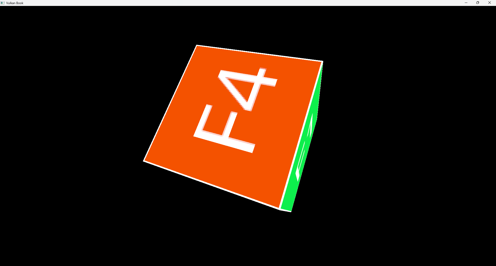

# Chapter 08 - Complex models and textures

In this chapter we will add support for loading complex 3D models which may include textures.

You can find the complete source code for this chapter [here](../../booksamples/chapter-08).

## Assimp

Up to now, we have been manually defining the 3D models directly in the code. In order to be able to load more complex 3D models we will use the well known Open Asset Import Library ([Assimp](https://www.assimp.org/)).
We will also use [Jcommander](https://jcommander.org/) library to parse command line options and GSON to generate JSOn files.
In order to use that library we need to setup a specific dependencies in  our `pom.xml` file:

```xml
<?xml version="1.0" encoding="UTF-8"?>
<project xmlns:xsi="http://www.w3.org/2001/XMLSchema-instance"
         xmlns="http://maven.apache.org/POM/4.0.0"
         xsi:schemaLocation="http://maven.apache.org/POM/4.0.0 http://maven.apache.org/xsd/maven-4.0.0.xsd">
...
    <dependencies>
...
        <dependency>
            <groupId>org.lwjgl</groupId>
            <artifactId>lwjgl-assimp</artifactId>
            <version>${lwjgl.version}</version>
        </dependency>
        <dependency>
            <groupId>org.jcommander</groupId>
            <artifactId>jcommander</artifactId>
            <version>${jcommander.version}</version>
        </dependency>
        <dependency>
            <groupId>com.google.code.gson</groupId>
            <artifactId>gson</artifactId>
            <version>${gson.version}</version>
        </dependency>
...
        <dependency>
            <groupId>org.lwjgl</groupId>
            <artifactId>lwjgl-assimp</artifactId>
            <version>${lwjgl.version}</version>
            <classifier>${native.target}</classifier>
            <scope>runtime</scope>
        </dependency>
...
    </dependencies>
</project>
```

In order to load complex 3D models, we will develop a pre-processing stage to transform models using assimp into an
intermediate format which will be ready to be loaded into the GPU. We will create a class that loads these models,
process them using assimp and ump the results to a JSOn file. It is a little bit overkill for a tutorial like this,
but it will prevent you to process models again and again and will simplify the loading process at the end.
The class used to preprocess 3D models is named `ModelGenerator`. It starts like this:

```java
package org.vulkanb.eng.model;

import com.beust.jcommander.*;
import com.google.gson.*;
import org.joml.Vector4f;
import org.lwjgl.PointerBuffer;
import org.lwjgl.assimp.*;
import org.lwjgl.system.MemoryStack;
import org.tinylog.Logger;
import org.vulkanb.eng.graph.vk.VkUtils;

import java.io.*;
import java.nio.IntBuffer;
import java.nio.channels.FileChannel;
import java.nio.file.*;
import java.util.*;
import java.util.regex.*;

import static org.lwjgl.assimp.Assimp.*;

public class ModelGenerator {

    private static final Pattern EMBED_TEXT_ID = Pattern.compile("\\*([0-9]+)");
    private static final int FLAGS = aiProcess_GenSmoothNormals | aiProcess_JoinIdenticalVertices |
            aiProcess_Triangulate | aiProcess_FixInfacingNormals | aiProcess_CalcTangentSpace |
            aiProcess_PreTransformVertices;

    @Parameter(names = "-m", description = "Model path", required = true)
    private String modelPath;

    public static void main(String[] args) {
        var main = new ModelGenerator();
        var jCmd = JCommander.newBuilder().addObject(main).build();
        try {
            jCmd.parse(args);
            main.mainProcessing();
        } catch (ParameterException excp) {
            jCmd.usage();
        } catch (IOException excp) {
            Logger.error("Error generating model", excp);
        }
    }
    ...
}
```

The class provides a `main`method which expects to receives a parameter ("-m") which sets the path to the model to be transformed.
By using JCommander we get automatic command line arguments parsing through annotations (@Parameter) and automatic help text
generation. The `FLAGS` constant defines some processing flags that will be used by assimp:
- `aiProcess_GenSmoothNormals`: This will try to generate smooth normals for all the vertices in the mesh.
- `aiProcess_JoinIdenticalVertices`: This will try to identify and combine duplicated vertices.
- `aiProcess_Triangulate`: This will transform each face of the mesh into a triangle (which is what we need when loading the data into the GPU). If a face is made up of more than three indices, it will split that face into as many triangles as needed.
- `aiProcess_FixInfacingNormals`: This tries to identify normals that point inwards and reverse their direction.
- `aiProcess_CalcTangentSpace`: This calculates the tangents a bitangets for each mesh. We will not use these data immediately, but we will need it when we apply light effects later on.
- `aiProcess_PreTransformVertices`: This removes the node graph and pre-transforms all vertices with the local transformation matrices of their nodes. Keep in mind that this flag cannot be used with animations.

We also define the constant `EMBED_TEXT_ID` to detect embedded textures.

Let's review the code of the  `mainProcessing` method first:

```java
public class ModelGenerator {
    ...
    private void mainProcessing() throws IOException {
        Logger.debug("Loading model data [{}]", modelPath);
        var modelFile = new File(modelPath);
        if (!modelFile.exists()) {
            throw new RuntimeException("Model path does not exist [" + modelPath + "]");
        }

        AIScene aiScene = aiImportFile(modelPath, FLAGS);
        if (aiScene == null) {
            throw new RuntimeException("Error loading model [modelPath: " + modelPath + "]");
        }

        String modelId = modelFile.getName();
        if (modelId.contains(".")) {
            modelId = modelId.substring(0, modelId.lastIndexOf('.'));
        }

        ModelBinData modelBinData = new ModelBinData(modelPath);

        int numMaterials = aiScene.mNumMaterials();
        Logger.debug("Number of materials: {}", numMaterials);
        List<MaterialData> matList = new ArrayList<>();
        File parentDirectory = modelFile.getParentFile();
        for (int i = 0; i < numMaterials; i++) {
            var aiMaterial = AIMaterial.create(aiScene.mMaterials().get(i));
            MaterialData material = processMaterial(aiScene, aiMaterial, modelId, parentDirectory.getPath(), i);
            matList.add(material);
        }

        int numMeshes = aiScene.mNumMeshes();
        PointerBuffer aiMeshes = aiScene.mMeshes();
        List<MeshData> meshList = new ArrayList<>();
        for (int i = 0; i < numMeshes; i++) {
            AIMesh aiMesh = AIMesh.create(aiMeshes.get(i));
            MeshData meshData = processMesh(aiMesh, matList, i, modelBinData);
            meshList.add(meshData);
        }

        var model = new ModelData(modelId, meshList, modelBinData.getVtxFilePath(), modelBinData.getIdxFilePath());
        
        String outModelFile = modelPath.substring(0, modelPath.lastIndexOf('.')) + ".json";
        Writer writer = new FileWriter(outModelFile);
        var gson = new GsonBuilder().setFieldNamingPolicy(FieldNamingPolicy.LOWER_CASE_WITH_UNDERSCORES).setPrettyPrinting().create();
        gson.toJson(model, writer);
        writer.flush();
        writer.close();
        Logger.info("Generated model file [{}]", outModelFile);

        String outMaterialFile = modelPath.substring(0, modelPath.lastIndexOf('.')) + "_mat.json";
        writer = new FileWriter(outMaterialFile);
        gson.toJson(matList, writer);
        writer.flush();
        writer.close();
        Logger.info("Generated materials file [{}]", outMaterialFile);

        modelBinData.close();
        aiReleaseImport(aiScene);
        Logger.info("Generated vtx file [{}]", modelBinData.getVtxFilePath());
        Logger.info("Generated idx file [{}]", modelBinData.getIdxFilePath());
    }
    ...
}
```

We are generating four files per model:
- One file which contains model information, such as its identifier, the list of meshes and the path to the binary files
which contain vertices and indices information.
- One file which contains materials information.
- One file which contains all the vertices used in all the meshes.
- One file which contains all the indices used in all the meshes.

In the model information file, each mesh will define the offsets within vertices and indices files and its size.
At the end of the method we also release the `AIScene` by calling the `aiReleaseImport` function.

Let's review the `processMaterial` method:

```java
public class ModelGenerator {
    ...
    private MaterialData processMaterial(AIScene aiScene, AIMaterial aiMaterial, String modelName, String baseDir, int pos)
            throws IOException {
        Vector4f diffuse = new Vector4f();
        AIColor4D color = AIColor4D.create();

        int result = aiGetMaterialColor(aiMaterial, AI_MATKEY_COLOR_DIFFUSE, aiTextureType_NONE, 0,
                color);
        if (result == aiReturn_SUCCESS) {
            diffuse.set(color.r(), color.g(), color.b(), color.a());
        }

        String diffuseTexture = processTexture(aiScene, aiMaterial, baseDir, aiTextureType_DIFFUSE);
        return new MaterialData(modelName + "-mat-" + pos, diffuseTexture, diffuse);
    }
    ...
}
```

This method is execute for each of the materials found in the model file.
First we retrieve the material diffuse color by calling the `aiGetMaterialColor` function. After that we try to get the texture
associated to the material by calling the `processTexture` method:

```java
public class ModelGenerator {
    ...
    private String processTexture(AIScene aiScene, AIMaterial aiMaterial, String baseDir, int textureType) throws IOException {
        String texturePath;
        try (var stack = MemoryStack.stackPush()) {
            int numEmbeddedTextures = aiScene.mNumTextures();
            AIString aiTexturePath = AIString.calloc(stack);
            aiGetMaterialTexture(aiMaterial, textureType, 0, aiTexturePath, (IntBuffer) null,
                    null, null, null, null, null);
            texturePath = aiTexturePath.dataString();
            if (texturePath != null && !texturePath.isEmpty()) {
                Matcher matcher = EMBED_TEXT_ID.matcher(texturePath);
                int embeddedTextureIdx = matcher.matches() && matcher.groupCount() > 0 ? Integer.parseInt(matcher.group(1)) : -1;
                if (embeddedTextureIdx >= 0 && embeddedTextureIdx < numEmbeddedTextures) {
                    // Embedded texture
                    var aiTexture = AITexture.create(aiScene.mTextures().get(embeddedTextureIdx));
                    String baseFileName = aiTexture.mFilename().dataString() + ".png";
                    texturePath = baseDir + File.separator + baseFileName;
                    Logger.info("Dumping texture file to [{}]", texturePath);
                    var channel = FileChannel.open(Path.of(texturePath), StandardOpenOption.CREATE, StandardOpenOption.WRITE);
                    channel.write(aiTexture.pcDataCompressed());
                } else {
                    texturePath = baseDir + File.separator + new File(texturePath).getName();
                }
            }
        }

        return texturePath;
    }
    ...
}

```
 We first try to retrieve the texture of the material by calling the `aiGetMaterialTexture` function. This function receives as a parameter an instance of an `AIString` that will be used to return the texture path. If the path is present (if it is not null or empty) we insert the path where the textures for this model will reside. 
 We first check if the path corresponds to an embedded texture using the `EMBED_TEXT_ID` regular expression.
 Embedded textures start with '*' followed by a number. If it is an embedded texture we extract its contents to a file
 using the `pcDataCompressed` function (we assume it is in PNG format). If it is not an embedded texture, we jus transform the path. 
 Many models use absolute paths, which probably won't fit with the path were you store the model. This is the reason why get just the file name, without the possible path (either absolute or relative) that could be used in the model. We assume the textures will
 be placed in the same directory as the model file.
 
 Material information is stored in an instance of the `MaterialData` class which is defined like this:
 
 ```java
 package org.vulkanb.eng.model;

import org.joml.Vector4f;

public record MaterialData(String id, String texturePath, Vector4f diffuseColor) {
}
 ```

Going back to the `ModelGenerator` class, the `processMesh` is defined like this:

```java
public class ModelGenerator {
    ...
    private MeshData processMesh(AIMesh aiMesh, List<MaterialData> materialList, int meshPosition,
                                 ModelBinData modelBinData) throws IOException {
        List<Float> vertices = processVertices(aiMesh);
        List<Float> textCoords = processTextCoords(aiMesh);
        List<Integer> indices = processIndices(aiMesh);

        int vtxSize = vertices.size();
        if (textCoords.isEmpty()) {
            textCoords = Collections.nCopies((vtxSize / 3) * 2, 0.0f);
        }

        DataOutputStream vtxOutput = modelBinData.getVtxOutput();
        int rows = vtxSize / 3;
        int vtxInc = (vtxSize + textCoords.size()) * VkUtils.FLOAT_SIZE;
        for (int row = 0; row < rows; row++) {
            int startPos = row * 3;
            int startTextCoord = row * 2;
            vtxOutput.writeFloat(vertices.get(startPos));
            vtxOutput.writeFloat(vertices.get(startPos + 1));
            vtxOutput.writeFloat(vertices.get(startPos + 2));
            vtxOutput.writeFloat(textCoords.get(startTextCoord));
            vtxOutput.writeFloat(textCoords.get(startTextCoord + 1));
        }

        DataOutputStream idxOutput = modelBinData.getIdxOutput();
        int idxSize = indices.size();
        int idxInc = idxSize * VkUtils.INT_SIZE;
        for (int idx = 0; idx < idxSize; idx++) {
            idxOutput.writeInt(indices.get(idx));
        }

        // Add position to mesh id to ensure unique ids
        String id = aiMesh.mName().dataString() + "_" + meshPosition;
        int materialIdx = aiMesh.mMaterialIndex();
        String materialId = "";
        if (materialIdx >= 0 && materialIdx < materialList.size()) {
            materialId = materialList.get(materialIdx).id();
        }

        var meshData = new MeshData(id, materialId, modelBinData.getVtxOffset(), vtxInc, modelBinData.getIdxOffset(),
                idxInc);

        modelBinData.incVtxOffset(vtxInc);
        modelBinData.incIdxOffset(idxInc);
        return meshData;
    }

    ...
}
```

This method delegates the vertices, indices and texture coordinates extraction to the `processVertices`, `processIndices` and
`processTextCoords` methods respectively. Once that data has been loaded, we check if the model defined texture coordinates.
If not, we create an empty placeholder for them. The buffers that we will create later on will assume that all of them will
have position and texture coordinates so we need to reserve space for them. After that, we dump vertices and indices to
binary files which are handled by the `ModelBinData` instance. The next step is to get the material index associated with
this mesh by calling the `mMaterialIndex` method over the `aiMesh` instance we are processing. By using that index, we can
associate the mesh with the previously processed materials. For each mesh we register the offset in the binary files
(for vertices and indices) and the size within them as you can see in its definition:


```java
package org.vulkanb.eng.model;

public record MeshData(String id, String materialId, int offsetVtx, int vtxSize, int offsetIdx, int idxSize) {
}
```

The `ModelBinData` class is defined like this:

```java
package org.vulkanb.eng.model;

import java.io.*;

public class ModelBinData {

    private final String idxFilePath;
    private final DataOutputStream idxOutput;
    private final String vtxFilePath;
    private final DataOutputStream vtxOutput;
    private int idxOffset;
    private int vtxOffset;

    public ModelBinData(String modelPath) throws FileNotFoundException {
        vtxFilePath = modelPath.substring(0, modelPath.lastIndexOf('.')) + ".vtx";
        vtxOutput = new DataOutputStream(new BufferedOutputStream(new FileOutputStream(vtxFilePath)));
        idxFilePath = modelPath.substring(0, modelPath.lastIndexOf('.')) + ".idx";
        idxOutput = new DataOutputStream(new BufferedOutputStream(new FileOutputStream(idxFilePath)));
    }

    public void close() throws IOException {
        vtxOutput.close();
        idxOutput.close();
    }

    public String getIdxFilePath() {
        return idxFilePath;
    }

    public int getIdxOffset() {
        return idxOffset;
    }

    public DataOutputStream getIdxOutput() {
        return idxOutput;
    }

    public String getVtxFilePath() {
        return vtxFilePath;
    }

    public int getVtxOffset() {
        return vtxOffset;
    }

    public DataOutputStream getVtxOutput() {
        return vtxOutput;
    }

    public void incIdxOffset(int inc) {
        idxOffset += inc;
    }

    public void incVtxOffset(int inc) {
        vtxOffset += inc;
    }
}
```

It just creates two binary files to store vertices and indices information while providing a `DataOutputStream` so binary
data can be written when processing meshes. It also keeps track of the current offset in both files.

Going back to the `ModelGenerator` class, the remaining methods are quite simple, we just extract the position and texture coordinates and the indices:

```java
public class ModelGenerator {
    ...
    private static List<Float> processTextCoords(AIMesh aiMesh) {
        List<Float> textCoords = new ArrayList<>();
        AIVector3D.Buffer aiTextCoords = aiMesh.mTextureCoords(0);
        int numTextCoords = aiTextCoords != null ? aiTextCoords.remaining() : 0;
        for (int i = 0; i < numTextCoords; i++) {
            AIVector3D textCoord = aiTextCoords.get();
            textCoords.add(textCoord.x());
            textCoords.add(1 - textCoord.y());
        }
        return textCoords;
    }
    ...
    private List<Integer> processIndices(AIMesh aiMesh) {
        List<Integer> indices = new ArrayList<>();
        int numFaces = aiMesh.mNumFaces();
        AIFace.Buffer aiFaces = aiMesh.mFaces();
        for (int i = 0; i < numFaces; i++) {
            AIFace aiFace = aiFaces.get(i);
            IntBuffer buffer = aiFace.mIndices();
            while (buffer.remaining() > 0) {
                indices.add(buffer.get());
            }
        }
        return indices;
    }
    ...
    private List<Float> processVertices(AIMesh aiMesh) {
        List<Float> vertices = new ArrayList<>();
        AIVector3D.Buffer aiVertices = aiMesh.mVertices();
        while (aiVertices.remaining() > 0) {
            AIVector3D aiVertex = aiVertices.get();
            vertices.add(aiVertex.x());
            vertices.add(aiVertex.y());
            vertices.add(aiVertex.z());
        }
        return vertices;
    }
}
```

We need to update the `ModelData` class to contain the path to the binary files which contain vertices and indices:

```java
package org.vulkanb.eng.model;

import java.util.List;

public record ModelData(String id, List<MeshData> meshes, String vtxPath, String idxPath) {
}
```

Finally, we will create an utility class, to load and deserialize preprocessed models and material files:

```java
package org.vulkanb.eng.model;

import com.google.gson.*;
import org.tinylog.Logger;

import java.nio.file.*;
import java.util.*;

public class ModelLoader {

    private ModelLoader() {
        // Utility class
    }

    public static List<MaterialData> loadMaterials(String path) {
        Logger.debug("Loading materials from [{}]", path);
        var result = new ArrayList<MaterialData>();
        try {
            var gson = new GsonBuilder().setFieldNamingPolicy(FieldNamingPolicy.LOWER_CASE_WITH_UNDERSCORES).create();
            String content = new String(Files.readAllBytes(Paths.get(path)));
            result.addAll(Arrays.asList(gson.fromJson(content, MaterialData[].class)));
        } catch (Exception e) {
            throw new RuntimeException(e);
        }
        return result;
    }

    public static ModelData loadModel(String path) {
        Logger.debug("Loading model from [{}]", path);
        ModelData result;
        try {
            String content = new String(Files.readAllBytes(Paths.get(path)));
            var gson = new GsonBuilder().setFieldNamingPolicy(FieldNamingPolicy.LOWER_CASE_WITH_UNDERSCORES).create();
            result = gson.fromJson(content, ModelData.class);
        } catch (Exception e) {
            throw new RuntimeException(e);
        }
        return result;
    }
}
```

## Textures

We have already created the classes that support images and image views, however, we need to be able to load texture context from image files and to properly copy its contents to a buffer setting up the adequate layout. We will create a new class named `Texture` to support this. To load image files we will use the [stb]([GitHub - nothings/stb: stb single-file public domain libraries for C/C++](https://github.com/nothings/stb)) library, so we need to setup the following dependencies to the `pom.xml` file:

```xml
<?xml version="1.0" encoding="UTF-8"?>
<project xmlns:xsi="http://www.w3.org/2001/XMLSchema-instance"
         xmlns="http://maven.apache.org/POM/4.0.0"
         xsi:schemaLocation="http://maven.apache.org/POM/4.0.0 http://maven.apache.org/xsd/maven-4.0.0.xsd">
...
    <dependencies>
...
        <dependency>
            <groupId>org.lwjgl</groupId>
            <artifactId>lwjgl-stb</artifactId>
            <version>${lwjgl.version}</version>
        </dependency>
...
        <dependency>
            <groupId>org.lwjgl</groupId>
            <artifactId>lwjgl-stb</artifactId>
            <version>${lwjgl.version}</version>
            <classifier>${native.target}</classifier>
            <scope>runtime</scope>
        </dependency>
...
    </dependencies>
</project>
```

We will create a a few classes that will help us in the process of managing textures. The First one is named `ImageSrc` and
it is just a record to hold the decoded image data (raw data), its width and height  nd the number of channels.

```java
package org.vulkanb.eng.graph.vk;

import java.nio.ByteBuffer;

public record ImageSrc(ByteBuffer data, int width, int height, int channels) {
}
```

The next one is called `GraphUtils` and provides utility methods to load a texture form disk using stb library and to free resources.
It is defined like this:

```java
package org.vulkanb.eng.graph;

import org.lwjgl.system.MemoryStack;
import org.vulkanb.eng.graph.vk.ImageSrc;

import java.io.IOException;
import java.nio.*;

import static org.lwjgl.stb.STBImage.*;

public class GraphUtils {

    private GraphUtils() {
        // Utility class
    }

    public static void cleanImageData(ImageSrc srcImage) {
        stbi_image_free(srcImage.data());
    }

    public static ImageSrc loadImage(String fileName) throws IOException {
        ImageSrc srcImage;
        ByteBuffer buf;
        try (var stack = MemoryStack.stackPush()) {
            IntBuffer w = stack.mallocInt(1);
            IntBuffer h = stack.mallocInt(1);
            IntBuffer channels = stack.mallocInt(1);

            buf = stbi_load(fileName, w, h, channels, 4);
            if (buf == null) {
                throw new IOException("Image file [" + fileName + "] not loaded: " + stbi_failure_reason());
            }

            srcImage = new ImageSrc(buf, w.get(0), h.get(0), channels.get(0));
        }

        return srcImage;
    }
}
```

In the `loadImage` method, we use the stb function `stbi_load` function to load an image from disk. This function receives as a parameter the path of the image file, three `IntBuffer`s to return the width , the height and the  color components of the image. It also receives the desired number of color components (`4` in our case, which represents RGBA). This function returns a `ByteBuffer` with the contents of the image if it has success and fills up the `IntBuffer` used as output parameters. The `cleanImageData` is just
to free up resources used when loading and image by just invoking `stbi_image_free`.

We will review now the `Texture` class constructor is defined like this:

```java
package org.vulkanb.eng.graph.vk;

import org.lwjgl.system.*;
import org.lwjgl.vulkan.*;

import java.nio.ByteBuffer;

import static org.lwjgl.vulkan.VK13.*;

public class Texture {

    private final int height;
    private final String id;
    private final Image image;
    private final ImageView imageView;
    private final int width;
    private boolean recordedTransition;
    private VkBuffer stgBuffer;

    public Texture(VkCtx vkCtx, String id, ImageSrc srcImage, int imageFormat) {
        this.id = id;
        recordedTransition = false;
        width = srcImage.width();
        height = srcImage.height();

        createStgBuffer(vkCtx, srcImage.data());
        var imageData = new Image.ImageData().width(width).height(height).
                usage(VK_IMAGE_USAGE_TRANSFER_SRC_BIT | VK_IMAGE_USAGE_TRANSFER_DST_BIT | VK_IMAGE_USAGE_SAMPLED_BIT).
                format(imageFormat);
        image = new Image(vkCtx, imageData);
        var imageViewData = new ImageView.ImageViewData().format(image.getFormat()).
                aspectMask(VK_IMAGE_ASPECT_COLOR_BIT);
        imageView = new ImageView(vkCtx.getDevice(), image.getVkImage(), imageViewData, false);
    }
    ...
}
```

In the constructor, besides the context, we receive an identifier which  shall be unique for the whole application, an instance
of `ImageSrc` which contains the image data and the Vulkan image format. The `Texture` class creates first a staging buffer 
which is CPU accessible to copy image contents. It also defines the `recordedTransition` attribute to control if the texture has already been recorded to transition to the final layout or not (more on this later). In the constructor, we also create aVulkan Image. It is interesting to review the usage flags we are using in in this case:

- `VK_IMAGE_USAGE_TRANSFER_DST_BIT`: The image can be used as a destination of a transfer command. We need this, because in our case, we will copy from a staging buffer to the image.
- `VK_IMAGE_USAGE_SAMPLED_BIT`: The image can be used to occupy a descriptor set (more on this later). In our case, the image needs to be used by a sampler in a fragment shader, so we need to set this flag.

At the end of the constructor we create an `ImageView` associated to the image.

The `createStgBuffer` method is defined like this:
```java
  public class Texture {
    ...
    private void createStgBuffer(VkCtx vkCtx, ByteBuffer data) {
        int size = data.remaining();
        stgBuffer = new VkBuffer(vkCtx, size, VK_BUFFER_USAGE_TRANSFER_SRC_BIT,
                VK_MEMORY_PROPERTY_HOST_VISIBLE_BIT | VK_MEMORY_PROPERTY_HOST_COHERENT_BIT);
        long mappedMemory = stgBuffer.map(vkCtx);
        ByteBuffer buffer = MemoryUtil.memByteBuffer(mappedMemory, (int) stgBuffer.getRequestedSize());
        buffer.put(data);
        data.flip();

        stgBuffer.unMap(vkCtx);
    }    ...
  }
```

We just create a new `VulkanBuffer` instance which will accommodate the `data` instance. The buffer will be used to transfer the image data, this is why we use the `VK_BUFFER_USAGE_TRANSFER_SRC_BIT` flag and the `VK_MEMORY_PROPERTY_HOST_VISIBLE_BIT` (we will be loading the image from our application). We do not want to perform any flush operation while transferring the data so we also use the `VK_MEMORY_PROPERTY_HOST_COHERENT_BIT` flag. After the buffer has been created, we just map the memory associated to it and copy the image contents.

The `Texture` class defines a `cleanup` method to free the resources and special method named `cleanupStgBuffer` to free the staging buffer when is no longer needed. It also provides some *getters* to get the path to the file used to load the texture, the
image view and the image dimensions.

```java
public class Texture {
    ...
    public void cleanup(VkCtx vkCtx) {
        cleanupStgBuffer(vkCtx);
        imageView.cleanup(vkCtx.getDevice());
        image.cleanup(vkCtx);
    }

    public void cleanupStgBuffer(VkCtx vkCtx) {
        if (stgBuffer != null) {
            stgBuffer.cleanup(vkCtx);
            stgBuffer = null;
        }
    }
    ...
    public int getHeight() {
        return height;
    }

    public String getId() {
        return id;
    }

    public ImageView getImageView() {
        return imageView;
    }

    public int getWidth() {
        return width;
    }
    ...
}
```

In order for Vulkan to correctly use the image, we need to perform the following steps:
- We need to set the image into `VK_IMAGE_LAYOUT_TRANSFER_DST_OPTIMAL` layout to be ready to be in transfer state so
we can copy the contents of the buffer.
- Record a copy operation from the buffer to the image.
- Set the image into `VK_IMAGE_LAYOUT_SHADER_READ_ONLY_OPTIMAL` so it can be used in shaders.

We will be done all of this operations by recording image memory barriers and copy operations inside a command buffer in a
method called `recordTextureTransition`, which is defined like this:

```java
public class Texture {
    ...
    public void recordTextureTransition(CmdBuffer cmd) {
        if (stgBuffer != null && !recordedTransition) {
            recordedTransition = true;
            try (var stack = MemoryStack.stackPush()) {
                VkUtils.imageBarrier(stack, cmd.getVkCommandBuffer(), image.getVkImage(),
                        VK_IMAGE_LAYOUT_UNDEFINED, VK_IMAGE_LAYOUT_TRANSFER_DST_OPTIMAL,
                        VK_PIPELINE_STAGE_TOP_OF_PIPE_BIT, VK_PIPELINE_STAGE_TRANSFER_BIT,
                        VK_ACCESS_2_NONE, VK_ACCESS_TRANSFER_WRITE_BIT,
                        VK_IMAGE_ASPECT_COLOR_BIT);
                recordCopyBuffer(stack, cmd, stgBuffer);
                VkUtils.imageBarrier(stack, cmd.getVkCommandBuffer(), image.getVkImage(),
                        VK_IMAGE_LAYOUT_TRANSFER_DST_OPTIMAL, VK_IMAGE_LAYOUT_SHADER_READ_ONLY_OPTIMAL,
                        VK_PIPELINE_STAGE_TRANSFER_BIT, VK_PIPELINE_STAGE_FRAGMENT_SHADER_BIT,
                        VK_ACCESS_TRANSFER_WRITE_BIT, VK_ACCESS_SHADER_READ_BIT,
                        VK_IMAGE_ASPECT_COLOR_BIT);
            }
        }
    }
    ...
}
```

This method first checks that if the texture has already been transitioned (`stgBuffer` will be null) or the command to perform that transition have already been recorded (`recordedTransition` would be true). It is important to keep in mind that models may share the same texture for different areas, so it is important to control this to avoid executing useless commands. If this this not the case, it records the transition of the image layout to one where we can copy the staging buffer contents. That is, we transition from `VK_IMAGE_LAYOUT_UNDEFINED` to `VK_IMAGE_LAYOUT_TRANSFER_DST_OPTIMAL` layout by setting an image memory barrier. After that, it records the commands to copy the staging buffer contents to the image, by calling the `recordCopyBuffer`. Finally, we record the commands to transition the layout from `VK_IMAGE_LAYOUT_TRANSFER_DST_OPTIMAL` to `VK_IMAGE_LAYOUT_SHADER_READ_ONLY_OPTIMAL` by
setting again an image memory barrier. The texture will be used in a shader, no one will be writing to it after we have finished with the staging buffer, therefore, the `VK_IMAGE_LAYOUT_SHADER_READ_ONLY_OPTIMAL` is the appropriate state.

An important issue to highlight is that we are recording commands that can be submitted to a queue. In this way, we can group the commands associated to several textures and submit them using a single call, instead of going one by one. This should  reduce the loading time when dealing with several textures.

The only missing method in the `Texture` class is the `recordCopyBuffer`:

```java
public class Texture {
    ...
    private void recordCopyBuffer(MemoryStack stack, CmdBuffer cmd, VkBuffer bufferData) {

        VkBufferImageCopy.Buffer region = VkBufferImageCopy.calloc(1, stack)
                .bufferOffset(0)
                .bufferRowLength(0)
                .bufferImageHeight(0)
                .imageSubresource(it ->
                        it.aspectMask(VK_IMAGE_ASPECT_COLOR_BIT)
                                .mipLevel(0)
                                .baseArrayLayer(0)
                                .layerCount(1)
                )
                .imageOffset(it -> it.x(0).y(0).z(0))
                .imageExtent(it -> it.width(width).height(height).depth(1));

        vkCmdCopyBufferToImage(cmd.getVkCommandBuffer(), bufferData.getBuffer(), image.getVkImage(),
                VK_IMAGE_LAYOUT_TRANSFER_DST_OPTIMAL, region);
    }
    ...
}
```

This method invokes the `vkCmdCopyBufferToImage` to record the command which will copy the contents of the staging buffer into an image. The parameters are more or less self explanatory, in this case, we are expecting the image to be in the `VK_IMAGE_LAYOUT_TRANSFER_DST_OPTIMAL` layout, this is the reason we need to perform an initial layout transition. This command accepts to restrict the copy to a set of regions, in our case we will use the full extent of the image.

Now that the `Texture` class is complete, we are ready to to use it. In 3D models, it is common that multiple meshes share the same texture file, we want to control that to avoid loading the same resource multiple times. We will create a new class named `TextureCache` to control this:

```java
package org.vulkanb.eng.graph;

import org.tinylog.Logger;
import org.vulkanb.eng.EngCfg;
import org.vulkanb.eng.graph.vk.*;
import org.vulkanb.eng.graph.vk.Queue;

import java.io.IOException;
import java.util.*;

import static org.lwjgl.vulkan.VK10.VK_FORMAT_R8G8B8A8_SRGB;

public class TextureCache {

    public static final int MAX_TEXTURES = 100;
    private final IndexedLinkedHashMap<String, Texture> textureMap;

    public TextureCache() {
        textureMap = new IndexedLinkedHashMap<>();
    }   
    ...
}
```

This class will store in a `IndexedLinkedHashMap` the textures indexed by the path to the file use to load them. The reason for this structure is to be able to recover the texture by its path (like in a `Map`) while maintaining the insertion order. Although by now, we will be accessing by path, later on we will need to get the textures by the position they were loaded. The `TextureCache` class defines a method to add a `Texture` named `addTexture`. That method will check if the texture has been already created, to avoid creating multiple textures for the same file. If it does not exists it will just instantiate a new `Texture` and store it in the map.
We have two variants, one receiving a path to a texture and another one receiving an `ImgaSrc` instance (we will need this variant
in the future):

```java
public class TextureCache {
    ...
    public Texture addTexture(VkCtx vkCtx, String id, ImageSrc srcImage, int format) {
        if (textureMap.size() > MAX_TEXTURES) {
            throw new IllegalArgumentException("Texture cache is full");
        }
        Texture texture = textureMap.get(id);
        if (texture == null) {
            texture = new Texture(vkCtx, id, srcImage, format);
            textureMap.put(id, texture);
        }
        return texture;
    }

    public Texture addTexture(VkCtx vkCtx, String id, String texturePath, int format) {
        ImageSrc srcImage = null;
        Texture result = null;
        try {
            srcImage = GraphUtils.loadImage(texturePath);
            result = addTexture(vkCtx, id, srcImage, format);
        } catch (IOException excp) {
            Logger.error("Could not load texture [{}], {}", texturePath, excp);
        } finally {
            if (srcImage != null) {
                GraphUtils.cleanImageData(srcImage);
            }
        }
        return result;
    }
    ...
}
```

We will add also the classical `cleanup` method to free the images and the a method to get the position of a texture using its
identifier and the list itself.

```java
public class TextureCache {
    ...
    public void cleanup(VkCtx vkCtx) {
        textureMap.forEach((k, t) -> t.cleanup(vkCtx));
        textureMap.clear();
    }

    public List<Texture> getAsList() {
        return new ArrayList<>(textureMap.values());
    }

    public int getPosition(String id) {
        int result = -1;
        if (id != null) {
            result = textureMap.getIndexOf(id);
        }
        return result;
    }
    ...
}
```

The only missing method is `transitionTexts` which performs layout transitions over all  the textures stored in the cache.
It is defined like this:

```java
public class TextureCache {
    ...
    public void transitionTexts(VkCtx vkCtx, CmdPool cmdPool, Queue queue) {
        Logger.debug("Recording texture transitions");
        int numTextures = textureMap.size();
        if (numTextures < MAX_TEXTURES) {
            int numPaddingTexts = MAX_TEXTURES - numTextures;
            String defaultTexturePath = EngCfg.getInstance().getDefaultTexturePath();
            for (int i = 0; i < numPaddingTexts; i++) {
                addTexture(vkCtx, UUID.randomUUID().toString(), defaultTexturePath, VK_FORMAT_R8G8B8A8_SRGB);
            }
        }
        var cmdBuf = new CmdBuffer(vkCtx, cmdPool, true, true);
        cmdBuf.beginRecording();
        textureMap.forEach((k, v) -> v.recordTextureTransition(cmdBuf));
        cmdBuf.endRecording();
        cmdBuf.submitAndWait(vkCtx, queue);
        cmdBuf.cleanup(vkCtx, cmdPool);
        textureMap.forEach((k, v) -> v.cleanupStgBuffer(vkCtx));
        Logger.debug("Recorded texture transitions");
    }
    ...
}
```

We first check if we have reached the maximum number of textures. If we do not have reached that size, we will add empty slots
with a default texture. The reason behind this code is that we will be using arrays of textures in the shaders. When using
those arrays, the size needs to be set upfront and it expects to have valid images (empty slots will not work). We will see later
on how this works. After that we just create a command buffer, iterate over the textures calling `recordTextureTransition` and
submit the work and wait it to be completed. Using arrays of textures is also the reason  why we need to keeping track of the
position of each texture is important. This is why we use the `IndexedLinkedHashMap`class which basically keeps insertion order on a HashMap and allow us to access elements by their positions:

```java
package org.vulkanb.eng.graph;

import java.util.*;

public class IndexedLinkedHashMap<K, V> extends LinkedHashMap<K, V> {

    private final List<K> indexList = new ArrayList<>();

    public int getIndexOf(K key) {
        return indexList.indexOf(key);
    }

    public V getValueAtIndex(int i) {
        return super.get(indexList.get(i));
    }

    @Override
    public V put(K key, V val) {
        if (!super.containsKey(key)) indexList.add(key);
        return super.put(key, val);
    }
}
```

## Models and Materials

The next step is to update the `VulkanMesh` material to hold a reference to the material identifier it is associated:

```java
package org.vulkanb.eng.graph;

import org.vulkanb.eng.graph.vk.*;

public record VulkanMesh(String id, VkBuffer verticesBuffer, VkBuffer indicesBuffer, int numIndices,
                         String materialdId) {
    public void cleanup(VkCtx vkCtx) {
        verticesBuffer.cleanup(vkCtx);
        indicesBuffer.cleanup(vkCtx);
    }
}
```

We will also add a new `VulkanMaterial` class which will just store an identifier by now:

```java
package org.vulkanb.eng.graph;

public record VulkanMaterial(String id) {
}
```

Let's update now the `ModelsCache` cache to be able to load preprocessed models. Remember that prior to use any model you
need to preprocess it by using the `ModelGenerator` class. Let's start with the `loadModels` class:

```java
public class ModelsCache {
    ...
    public void loadModels(VkCtx vkCtx, List<ModelData> models, CmdPool cmdPool, Queue queue) {
        try {
            List<VkBuffer> stagingBufferList = new ArrayList<>();

            var cmd = new CmdBuffer(vkCtx, cmdPool, true, true);
            cmd.beginRecording();

            for (ModelData modelData : models) {
                VulkanModel vulkanModel = new VulkanModel(modelData.id());
                modelsMap.put(vulkanModel.getId(), vulkanModel);

                DataInputStream vtxInput = new DataInputStream(new BufferedInputStream(new FileInputStream(modelData.vtxPath())));
                DataInputStream idxInput = new DataInputStream(new BufferedInputStream(new FileInputStream(modelData.idxPath())));
                // Transform meshes loading their data into GPU buffers
                for (MeshData meshData : modelData.meshes()) {
                    TransferBuffer verticesBuffers = createVerticesBuffers(vkCtx, meshData, vtxInput);
                    TransferBuffer indicesBuffers = createIndicesBuffers(vkCtx, meshData, idxInput);
                    stagingBufferList.add(verticesBuffers.srcBuffer());
                    stagingBufferList.add(indicesBuffers.srcBuffer());
                    verticesBuffers.recordTransferCommand(cmd);
                    indicesBuffers.recordTransferCommand(cmd);

                    VulkanMesh vulkanMesh = new VulkanMesh(meshData.id(), verticesBuffers.dstBuffer(),
                            indicesBuffers.dstBuffer(), meshData.idxSize() / VkUtils.INT_SIZE, meshData.materialId());
                    vulkanModel.getVulkanMeshList().add(vulkanMesh);
                }
            }

            cmd.endRecording();
            cmd.submitAndWait(vkCtx, queue);
            cmd.cleanup(vkCtx, cmdPool);

            stagingBufferList.forEach(b -> b.cleanup(vkCtx));
        } catch (Exception excp) {
            throw new RuntimeException(excp);
        }
    }
    ...
}
```

Since we will be loading data for vertices and indices from files, we need to deal with `IOException`s, if such an event
happens we just crash. The method is almost exactly the same as previous versions, but we load the data from the files
referred in the model JSON files using `DataInputStream`s. This will require to modify also the `createIndicesBuffers` and
`createVerticesBuffers` to get the data from those input streams:

```java
public class ModelsCache {
    ...
    private static TransferBuffer createIndicesBuffers(VkCtx vkCtx, MeshData meshData, DataInputStream idxInput)
            throws IOException {
        int bufferSize = meshData.idxSize();
        var srcBuffer = new VkBuffer(vkCtx, bufferSize,
                VK_BUFFER_USAGE_TRANSFER_SRC_BIT, VK_MEMORY_PROPERTY_HOST_VISIBLE_BIT | VK_MEMORY_PROPERTY_HOST_COHERENT_BIT);
        var dstBuffer = new VkBuffer(vkCtx, bufferSize,
                VK_BUFFER_USAGE_TRANSFER_DST_BIT | VK_BUFFER_USAGE_INDEX_BUFFER_BIT, VK_MEMORY_PROPERTY_DEVICE_LOCAL_BIT);

        long mappedMemory = srcBuffer.map(vkCtx);
        IntBuffer data = MemoryUtil.memIntBuffer(mappedMemory, (int) srcBuffer.getRequestedSize());

        int valuesToRead = meshData.idxSize() / VkUtils.INT_SIZE;
        while (valuesToRead > 0) {
            data.put(idxInput.readInt());
            valuesToRead--;
        }

        srcBuffer.unMap(vkCtx);

        return new TransferBuffer(srcBuffer, dstBuffer);
    }

    private static TransferBuffer createVerticesBuffers(VkCtx vkCtx, MeshData meshData, DataInputStream vtxInput)
            throws IOException {
        int bufferSize = meshData.vtxSize();
        var srcBuffer = new VkBuffer(vkCtx, bufferSize,
                VK_BUFFER_USAGE_TRANSFER_SRC_BIT, VK_MEMORY_PROPERTY_HOST_VISIBLE_BIT | VK_MEMORY_PROPERTY_HOST_COHERENT_BIT);
        var dstBuffer = new VkBuffer(vkCtx, bufferSize,
                VK_BUFFER_USAGE_TRANSFER_DST_BIT | VK_BUFFER_USAGE_VERTEX_BUFFER_BIT, VK_MEMORY_PROPERTY_DEVICE_LOCAL_BIT);

        long mappedMemory = srcBuffer.map(vkCtx);
        FloatBuffer data = MemoryUtil.memFloatBuffer(mappedMemory, (int) srcBuffer.getRequestedSize());

        int valuesToRead = meshData.vtxSize() / VkUtils.FLOAT_SIZE;
        while (valuesToRead > 0) {
            data.put(vtxInput.readFloat());
            valuesToRead--;
        }

        srcBuffer.unMap(vkCtx);

        return new TransferBuffer(srcBuffer, dstBuffer);
    }
    ...
}
```

In order to manage materials we will need to create a new class `MaterialsCache` which starts like this:

```java
package org.vulkanb.eng.graph;

import org.lwjgl.system.MemoryUtil;
import org.tinylog.Logger;
import org.vulkanb.eng.graph.vk.*;
import org.vulkanb.eng.model.MaterialData;

import java.nio.ByteBuffer;
import java.util.List;

import static org.lwjgl.vulkan.VK13.*;

public class MaterialsCache {

    private static final int MATERIAL_SIZE = VkUtils.VEC4_SIZE + VkUtils.INT_SIZE * 4;
    private final IndexedLinkedHashMap<String, VulkanMaterial> materialsMap;
    private VkBuffer materialsBuffer;

    public MaterialsCache() {
        materialsMap = new IndexedLinkedHashMap<>();
    }

    public void cleanup(VkCtx vkCtx) {
        if (materialsBuffer != null) {
            materialsBuffer.cleanup(vkCtx);
        }
    }

    public VulkanMaterial getMaterial(String id) {
        return materialsMap.get(id);
    }

    public VkBuffer getMaterialsBuffer() {
        return materialsBuffer;
    }

    public int getPosition(String id) {
        int result = -1;
        if (id != null) {
            result = materialsMap.getIndexOf(id);
        } else {
            Logger.warn("Could not find material with id [{}]", id);
        }
        return result;
    }
    ...
}
```

This class, will create as single `VkBuffer` which will store all the materials information for all the models, which in our case
will be:
- The diffuse color (for non textured materials), stored as a vector of 4 elements.
- If the material has a texture associated or not.
- The texture index associated to the material.

Therefore, the `MATERIAL_SIZE` constant, will allow use to know how much a material occupies in the buffer. Combined with the index
of the material we can access any material form a single buffer. This is why we use again a `IndexedLinkedHashMap` to store
`VulkanMaterial` instances. By doing so, we will keep insertion order and can get the associated position in the buffer for 
a specific material. 

New we need a method to load the materials:

```java
public class MaterialsCache {
    ...
    public void loadMaterials(VkCtx vkCtx, List<MaterialData> materials, TextureCache textureCache, CmdPool cmdPool,
                              Queue queue) {
        int numMaterials = materials.size();
        int bufferSize = MATERIAL_SIZE * numMaterials;

        var srcBuffer = new VkBuffer(vkCtx, bufferSize,
                VK_BUFFER_USAGE_TRANSFER_SRC_BIT, VK_MEMORY_PROPERTY_HOST_VISIBLE_BIT | VK_MEMORY_PROPERTY_HOST_COHERENT_BIT);
        materialsBuffer = new VkBuffer(vkCtx, bufferSize,
                VK_BUFFER_USAGE_TRANSFER_DST_BIT | VK_BUFFER_USAGE_STORAGE_BUFFER_BIT, VK_MEMORY_PROPERTY_DEVICE_LOCAL_BIT);

        var cmd = new CmdBuffer(vkCtx, cmdPool, true, true);
        cmd.beginRecording();

        TransferBuffer transferBuffer = new TransferBuffer(srcBuffer, materialsBuffer);
        long mappedMemory = srcBuffer.map(vkCtx);
        ByteBuffer data = MemoryUtil.memByteBuffer(mappedMemory, (int) srcBuffer.getRequestedSize());

        int offset = 0;
        for (int i = 0; i < numMaterials; i++) {
            var material = materials.get(i);
            String texturePath = material.texturePath();
            boolean hasTexture = texturePath != null && !texturePath.isEmpty();
            if (hasTexture) {
                textureCache.addTexture(vkCtx, texturePath, texturePath, VK_FORMAT_R8G8B8A8_SRGB);
            }
            VulkanMaterial vulkanMaterial = new VulkanMaterial(material.id());
            materialsMap.put(vulkanMaterial.id(), vulkanMaterial);

            material.diffuseColor().get(offset, data);
            data.putInt(offset + VkUtils.VEC4_SIZE, hasTexture ? 1 : 0);
            data.putInt(offset + VkUtils.VEC4_SIZE + VkUtils.INT_SIZE, textureCache.getPosition(texturePath));

            // Padding
            data.putInt(offset + VkUtils.VEC4_SIZE + VkUtils.INT_SIZE * 2, 0);
            data.putInt(offset + VkUtils.VEC4_SIZE + VkUtils.INT_SIZE * 3, 0);

            offset += MATERIAL_SIZE;
        }
        srcBuffer.unMap(vkCtx);

        transferBuffer.recordTransferCommand(cmd);

        cmd.endRecording();
        cmd.submitAndWait(vkCtx, queue);
        cmd.cleanup(vkCtx, cmdPool);

        transferBuffer.srcBuffer().cleanup(vkCtx);
    }
}
```

As in the case of the models, we create a staging buffer and a GPU only accessible buffer for the materials. We iterate over
the materials populating the buffer. We also populate the texture cache with the textures that we find associated to the materials. 
Keep in mind that we may use more textures than the ones strictly used by models. You will see that We need to add padding data,
because due to the layout rules used in shaders, the minimum size of data will be multiples of `vec4`, therefore since we
initially only need 6 bytes, we need to compensate with two more. At the end of the loop, we just record the transfer command,
submit it to the queue, and wait for it to be finished. 

## Descriptors

Descriptors represent shader resources such us buffers, images or samplers. We will need to use descriptors in order to access the textures from the shaders and also for uniforms (in Vulkan uniforms are just the way to access buffers in the shaders). Descriptors are grouped in descriptor sets, whose general structure is defined through descriptor layouts. Descriptors are like handles to access resources from shaders, and they are created through a descriptor pool.

Managing descriptors is often a tedious tasks, you need to define, for each pool the number of descriptor sets that it will be able
to hold for each of the supported types. Each descriptor needs to be associated to a descriptor set layout, which are tightly
related to how they wll be used in the shaders, etc. In order to facilitate this process, we are going to use the following approach:

- We will create descriptor pools which will support the descriptor sets we are going to use, size to the maximum number
of elements supported by the driver.
- If we reach the limit in a specific descriptor pool, we will create just a new pool.
- We will store descriptor sets by name, so we can easily access them by an identifier.

We will centralize all of above in a class named `DescAllocator` in order to isolate other parts of the code from the complexity
of managing descriptor sets.

Let's start first by defining a new class to handle a descriptor pool. This is the constructor of the `DescPool` class:

```java
package org.vulkanb.eng.graph.vk;

import org.lwjgl.system.MemoryStack;
import org.lwjgl.vulkan.*;
import org.tinylog.Logger;

import java.nio.LongBuffer;
import java.util.List;

import static org.lwjgl.vulkan.VK13.*;
import static org.vulkanb.eng.graph.vk.VkUtils.vkCheck;

public class DescPool {

    private final long vkDescPool;

    private List<DescTypeCount> descTypeCounts;

    public DescPool(Device device, List<DescTypeCount> descTypeCounts) {
        Logger.debug("Creating descriptor pool");
        this.descTypeCounts = descTypeCounts;
        try (var stack = MemoryStack.stackPush()) {
            int maxSets = 0;
            int numTypes = descTypeCounts.size();
            var typeCounts = VkDescriptorPoolSize.calloc(numTypes, stack);
            for (int i = 0; i < numTypes; i++) {
                maxSets += descTypeCounts.get(i).count();
                typeCounts.get(i)
                        .type(descTypeCounts.get(i).descType())
                        .descriptorCount(descTypeCounts.get(i).count());
            }

            var descriptorPoolInfo = VkDescriptorPoolCreateInfo.calloc(stack)
                    .sType$Default()
                    .flags(VK_DESCRIPTOR_POOL_CREATE_FREE_DESCRIPTOR_SET_BIT)
                    .pPoolSizes(typeCounts)
                    .maxSets(maxSets);

            LongBuffer pDescriptorPool = stack.mallocLong(1);
            vkCheck(vkCreateDescriptorPool(device.getVkDevice(), descriptorPoolInfo, null, pDescriptorPool),
                    "Failed to create descriptor pool");
            vkDescPool = pDescriptorPool.get(0);
        }
    }
    ...
    public record DescTypeCount(int descType, int count) {
    }
}
```

A descriptor pool is just a place holder for descriptor set handles. When it is created, it just allocates different descriptor sets according to their types. Vulkan defines several types for the descriptor sets, uniforms, texture samplers, etc. We can specify how many descriptors we want to pre-create for each type. Therefore, the `DescriptorPool` constructor receives, besides a reference to the device, a list of `DescriptorTypeCount` which specifies how many descriptor sets should be allocated for each type. With that information we will fill up a buffer of `VkDescriptorPoolSize` structures which will be used in `VkDescriptorPoolCreateInfo` structure that requires the `vkCreateDescriptorPool`. One important topic to highlight is that in the `VkDescriptorPoolCreateInfo` we have set the flag `VK_DESCRIPTOR_POOL_CREATE_FREE_DESCRIPTOR_SET_BIT`. This flag will allow us to return descriptor sets to the pool when they are no longer used. They can be returned by calling the `freeDescriptorSet` method:

```java
public class DescPool {
    ...
    public void freeDescriptorSet(Device device, long vkDescriptorSet) {
        try (var stack = MemoryStack.stackPush()) {
            LongBuffer longBuffer = stack.mallocLong(1);
            longBuffer.put(0, vkDescriptorSet);

            vkCheck(vkFreeDescriptorSets(device.getVkDevice(), vkDescPool, longBuffer),
                    "Failed to free descriptor set");
        }
    }
    ...
}
```

The rest of the methods of this class are the classical cleanup and getter to obtain the descriptor pool handle and the descriptor
type counts:

```java
public class DescPool {
    ...
    public void cleanup(Device device) {
        Logger.debug("Destroying descriptor pool");
        vkDestroyDescriptorPool(device.getVkDevice(), vkDescPool, null);
    }
    ...    
    public List<DescTypeCount> getDescTypeCounts() {
        return descTypeCounts;
    }

    public long getVkDescPool() {
        return vkDescPool;
    }
    ...
}
```

Prior to continue with more code, let us clarify some concepts. Imagine we have, in GLSL, a definition of the following descriptor
sets:
```glsl
layout(set = 0, binding = 0) uniform A {
    vec4 data;
} a;
layout(set = 0, binding = 1) uniform B {
    vec4 data;
} b;
layout(set = 1, binding = 0) uniform C {
    vec4 data;
} c;
```

In the fragment above we have two descriptor sets. The first one is composed by two uniforms (`a` and `b`), each of them located
in a different binding point `0` and `1`. The second descriptor set just defines a single uniform (`c`) located at binding `0`.
Descriptor set layouts are used to define that structure. In fact, we can have several descriptor sets sharing the same layout.
In the example above we can above two descriptor sets using different buffers associated to the same layout, for example,
the layout shown for "c". 

We will create a class to help us create descriptor set layouts:

```java
package org.vulkanb.eng.graph.vk;

import org.lwjgl.system.MemoryStack;
import org.lwjgl.vulkan.*;
import org.tinylog.Logger;

import java.nio.LongBuffer;

import static org.lwjgl.vulkan.VK13.*;
import static org.vulkanb.eng.graph.vk.VkUtils.vkCheck;

public class DescSetLayout {

    private final LayoutInfo[] layoutInfos;
    protected long vkDescLayout;

    public DescSetLayout(VkCtx vkCtx, LayoutInfo layoutInfo) {
        this(vkCtx, new DescSetLayout.LayoutInfo[]{layoutInfo});
    }

    public DescSetLayout(VkCtx vkCtx, LayoutInfo[] layoutInfos) {
        this.layoutInfos = layoutInfos;
        try (var stack = MemoryStack.stackPush()) {
            int count = layoutInfos.length;
            var layoutBindings = VkDescriptorSetLayoutBinding.calloc(count, stack);
            for (int i = 0; i < count; i++) {
                LayoutInfo layoutInfo = layoutInfos[i];
                layoutBindings.get(i)
                        .binding(layoutInfo.binding())
                        .descriptorType(layoutInfo.descType())
                        .descriptorCount(layoutInfo.descCount())
                        .stageFlags(layoutInfo.stage());
            }

            var vkLayoutInfo = VkDescriptorSetLayoutCreateInfo.calloc(stack).sType$Default().pBindings(layoutBindings);

            LongBuffer pSetLayout = stack.mallocLong(1);
            vkCheck(vkCreateDescriptorSetLayout(vkCtx.getDevice().getVkDevice(), vkLayoutInfo, null, pSetLayout),
                    "Failed to create descriptor set layout");
            vkDescLayout = pSetLayout.get(0);
        }
    }

    public void cleanup(VkCtx vkCtx) {
        Logger.debug("Destroying descriptor set layout");
        vkDestroyDescriptorSetLayout(vkCtx.getDevice().getVkDevice(), vkDescLayout, null);
    }

    public LayoutInfo getLayoutInfo() {
        return getLayoutInfos()[0];
    }

    public LayoutInfo[] getLayoutInfos() {
        return layoutInfos;
    }

    public long getVkDescLayout() {
        return vkDescLayout;
    }

    public record LayoutInfo(int descType, int binding, int descCount, int stage) {
    }
}
```

We will receiving an array of `LayoutInfo`, because a descriptor set, as it name implies is a list of descriptors, each of them
belong to a specific type and assigned to a binding point. We define their structure, in terms of types and binding points though 
descriptor set layout. We start by defining the binding point (given a descriptor set, each of the descriptors will be assigned to a unique binding number). This is done by filling up a buffer of `VkDescriptorSetLayoutBinding` structures (one for each type). In our case we will just be using one descriptor, that will be associated to the binding point passed as the `binding` parameter. This binding number shall match the one used in the shader for this specific descriptor. In addition to that, we specify the stage where it will be used. That information is used to create the descriptor set layout by instantiating a `VkDescriptorSetLayoutCreateInfo` structure that will be used in the `vkCreateDescriptorSetLayout` function. The class is completed by the classical `cleanup` method
and some *getters* to access the information from which this descriptor set layout was created.

Prior to getting deep dive with descriptor sets, let's review texture samplers. Images are not usually accessed directly when used as textures. When we access a texture, we usually want to apply some type of filters, we may have mip levels and maybe specify some repetition patterns. All that is handled through a sampler. We have already created images and image views, but in order to access
them in shaders we will need texture samplers. Therefore we will create a new class named `TextureSampler`: 

```java
package org.vulkanb.eng.graph.vk;

import org.lwjgl.system.MemoryStack;
import org.lwjgl.vulkan.VkSamplerCreateInfo;

import java.nio.LongBuffer;

import static org.lwjgl.vulkan.VK13.*;
import static org.vulkanb.eng.graph.vk.VkUtils.vkCheck;

public class TextureSampler {

    private static final int MAX_ANISOTROPY = 16;

    private final long vkSampler;

    public TextureSampler(VkCtx vkCtx, TextureSamplerInfo textureSamplerInfo) {
        try (var stack = MemoryStack.stackPush()) {
            var samplerInfo = VkSamplerCreateInfo.calloc(stack)
                    .sType$Default()
                    .magFilter(VK_FILTER_NEAREST)
                    .minFilter(VK_FILTER_NEAREST)
                    .addressModeU(textureSamplerInfo.addressMode())
                    .addressModeV(textureSamplerInfo.addressMode())
                    .addressModeW(textureSamplerInfo.addressMode())
                    .borderColor(textureSamplerInfo.borderColor())
                    .unnormalizedCoordinates(false)
                    .compareEnable(false)
                    .compareOp(VK_COMPARE_OP_NEVER)
                    .mipmapMode(VK_SAMPLER_MIPMAP_MODE_NEAREST)
                    .minLod(0.0f)
                    .maxLod(textureSamplerInfo.mipLevels())
                    .mipLodBias(0.0f);
            if (textureSamplerInfo.anisotropy() && vkCtx.getDevice().isSamplerAnisotropy()) {
                samplerInfo
                        .anisotropyEnable(true)
                        .maxAnisotropy(MAX_ANISOTROPY);
            }

            LongBuffer lp = stack.mallocLong(1);
            vkCheck(vkCreateSampler(vkCtx.getDevice().getVkDevice(), samplerInfo, null, lp), "Failed to create sampler");
            vkSampler = lp.get(0);
        }
    }

    public void cleanup(VkCtx vkCtx) {
        vkDestroySampler(vkCtx.getDevice().getVkDevice(), vkSampler, null);
    }

    public long getVkSampler() {
        return vkSampler;
    }
}
```

 In order to create a sampler, we need to invoke the `vkCreateSampler` function which requires a `VkSamplerCreateInfo` structure, defined by the following fields:

- `magFilter` and `minFilter`: control how magnification and magnification filter work while performing a texture lookup. In this case, we are using a `VK_FILTER_NEAREST` filter, which just picks the closest value in the lookup. You can use other options
such as `VK_FILTER_LINEAR` which  is the value for a linear filter (for a 2D texture, it combines for values of four pixels weighted)
or `VK_FILTER_CUBIC_EXT` to apply cubic filtering (it uses 16 values for 2D textures).
- `addressModeU`, `addressModeV` and `addressModeW`: This will control what will be returned for a texture lookup when the coordinates lay out of the texture size. The `U`, `V` and `W` refer to the `x`, `y` and `z` axis (for 3D images). You can set several options such
as `VK_SAMPLER_ADDRESS_MODE_REPEAT` which means that the texture is repeated endlessly over all the axis or  `VK_SAMPLER_ADDRESS_MODE_MIRRORED_REPEAT` which repeats in a mirrored way or `VK_SAMPLER_ADDRESS_MODE_CLAMP_TO_EDGE` which just uses
the latest edge value.
- `borderColor`: This sets the color for the border that will be used for texture lookups beyond bounds when `VK_SAMPLER_ADDRESS_MODE_CLAMP_TO_BORDER` is used in the `addressModeX` attributes.
- `unnormalizedCoordinates`: Texture coordinates cover the [0, 1] range. When this parameter is set to `true` the coordinates will cover the ranges [0, width], [0, height].
- `compareEnable`: It enables a comparison when performing texture lookups.
- `compareOp`: It specifies the comparison operation. We will not be using this at this moment.
- `mipmapMode`: This is used to specify the mipmap filter to apply in lookups. We will address that in later chapters.
- `minLod`, `maxLod` and `mipLoadBias`: These parameters are used for mip mapping, so we will review them later on.

Finally, we enable anisotropic filter if the device supports it. With all that information we just call the `vkCreateSampler` function and complete the class with the usual `cleanup` and the getter methods. Anisotropic filtering is used to eliminate aliasing effects when sampling from a texture. The classes completes with classical `cleanup` method and a *getter* to access the texture sampler handle.

The sampler anisotropy attribute, requires some changes in the `Device` class. We need to first query if sampler anisotropy is supported and
then enabled it, storing that capability as an attribute of the `Device` class:

```java
public class Device {

    private final boolean samplerAnisotropy;
    ...
    public Device(PhysDevice physDevice) {
        ...
            var features2 = VkPhysicalDeviceFeatures2.calloc(stack).sType$Default();
            var features = features2.features();

            VkPhysicalDeviceFeatures supportedFeatures = physDevice.getVkPhysicalDeviceFeatures();
            samplerAnisotropy = supportedFeatures.samplerAnisotropy();
            if (samplerAnisotropy) {
                features.samplerAnisotropy(true);
            }
            features2.pNext(features13.address());
        ...
    }
    ...
    public boolean isSamplerAnisotropy() {
        return samplerAnisotropy;
    }
    ...
}
```

In order to construct `TextureSampler` instances we use a build helper class named `TextureSamplerInfo` which basically groups
all the configurable parameters:

```java
package org.vulkanb.eng.graph.vk;

public record TextureSamplerInfo(int addressMode, int borderColor, int mipLevels, boolean anisotropy) {
}
```

It is turn now to create the a class to model descriptor sets. The class `DescSet` starts like this:

```java
package org.vulkanb.eng.graph.vk;

import org.lwjgl.system.MemoryStack;
import org.lwjgl.vulkan.*;

import java.nio.LongBuffer;
import java.util.*;

import static org.lwjgl.vulkan.VK13.*;
import static org.vulkanb.eng.graph.vk.VkUtils.vkCheck;

public class DescSet {

    protected long vkDescriptorSet;

    public DescSet(Device device, DescPool descPool, DescSetLayout descSetLayout) {
        try (var stack = MemoryStack.stackPush()) {
            LongBuffer pDescriptorSetLayout = stack.mallocLong(1);
            pDescriptorSetLayout.put(0, descSetLayout.getVkDescLayout());
            var allocInfo = VkDescriptorSetAllocateInfo.calloc(stack)
                    .sType$Default()
                    .descriptorPool(descPool.getVkDescPool())
                    .pSetLayouts(pDescriptorSetLayout);

            LongBuffer pDescriptorSet = stack.mallocLong(1);
            vkCheck(vkAllocateDescriptorSets(device.getVkDevice(), allocInfo, pDescriptorSet),
                    "Failed to create descriptor set");

            vkDescriptorSet = pDescriptorSet.get(0);
        }
    }

    public long getVkDescriptorSet() {
        return vkDescriptorSet;
    }
    ...
}
```

In the constructor we allocate a Vulkan descriptor set. In order to that, we need to invoke the `vkAllocateDescriptorSets` Vulkan function which requires a `VkDescriptorSetAllocateInfo` structure. This structure needs a handle to a descriptor pool and a handle to the layout which describes the descriptor set.

Now let's add some methods to associate a descriptor set with buffers or images, so we can use them in our shaders. Let's start with the
`setBuffer` method:

```java
public class DescSet {
    ...
    public void setBuffer(Device device, VkBuffer buffer, long range, int binding, int type) {
        try (var stack = MemoryStack.stackPush()) {
            var bufferInfo = VkDescriptorBufferInfo.calloc(1, stack)
                    .buffer(buffer.getBuffer())
                    .offset(0)
                    .range(range);

            var descrBuffer = VkWriteDescriptorSet.calloc(1, stack);

            descrBuffer.get(0)
                    .sType$Default()
                    .dstSet(vkDescriptorSet)
                    .dstBinding(binding)
                    .descriptorType(type)
                    .descriptorCount(1)
                    .pBufferInfo(bufferInfo);

            vkUpdateDescriptorSets(device.getVkDevice(), descrBuffer, null);
        }
    }
    ...
}
```

We first create a `VkDescriptorBufferInfo` structure that refers to the `VkBuffer` that we want to associate to, setting the offset and the
range. Then we update the descriptor set by calling the `vkUpdateDescriptorSets` using a `VkWriteDescriptorSet` which expects the 
following attributes:
- `dstSet`: The handle to the descriptor set.
- `dstBinding`: The binding point to which write operation refers to. Remember that a descriptor set cana have many descriptors, each of
them in a different binding point.
- `descriptorType`: The type of the descriptor (For example `VK_BUFFER_USAGE_UNIFORM_BUFFER_BIT` for uniforms).
- `descriptorCount`: The number of descriptors.
- `pBufferInfo`: A pointer to the `VkDescriptorBufferInfo` structure created before.


Let's add now some methods to associate a descriptor set with an image view or a list of image views:

```java
public class DescSet {
    ...
    public void setImage(Device device, ImageView imageView, TextureSampler textureSampler, int binding) {
        List<ImageView> imageViews = new ArrayList<>();
        imageViews.add(imageView);
        setImages(device, imageViews, textureSampler, binding);
    }

    public void setImages(Device device, List<ImageView> imgViews, TextureSampler textureSampler, int baseBinding) {
        try (var stack = MemoryStack.stackPush()) {
            int numImages = imgViews.size();
            var descrBuffer = VkWriteDescriptorSet.calloc(numImages, stack);
            for (int i = 0; i < numImages; i++) {
                ImageView iv = imgViews.get(i);
                var imageInfo = VkDescriptorImageInfo.calloc(1, stack)
                        .imageView(iv.getVkImageView())
                        .sampler(textureSampler.getVkSampler());

                if (iv.isDepthImage()) {
                    imageInfo.imageLayout(VK_IMAGE_LAYOUT_DEPTH_STENCIL_READ_ONLY_OPTIMAL);
                } else {
                    imageInfo.imageLayout(VK_IMAGE_LAYOUT_SHADER_READ_ONLY_OPTIMAL);
                }

                descrBuffer.get(i)
                        .sType$Default()
                        .dstSet(vkDescriptorSet)
                        .dstBinding(baseBinding + i)
                        .descriptorType(VK_DESCRIPTOR_TYPE_COMBINED_IMAGE_SAMPLER)
                        .descriptorCount(1)
                        .pImageInfo(imageInfo);
            }

            vkUpdateDescriptorSets(device.getVkDevice(), descrBuffer, null);
        }
    }
    ...
}
```

In this case, the process is quite similar, but we use a `VkDescriptorImageInfo` to associate with an image view instead of
a buffer and use the `pImageInfo` when writing to a descriptor set. In this case, we provide a method to associate to a single
image view or a list. In the later case, you see that each descriptor within the set will have a different image view, and will
use an incremental binding point starting at `baseBinding`. We can update all of them at once by calling also `vkUpdateDescriptorSets`.
In both cases we need to use a `TextureSampler`, which if you recall will specify how we will access to the image. For simplicity
we just use the same sampler, but we could combining different `TextureSampler` depending on our needs.

Finally, let's add a new method to associate an array of images to a descriptor set:

```java
public class DescSet {
    ...
    public void setImagesArr(Device device, List<ImageView> imgViews, TextureSampler textureSampler, int baseBinding) {
        try (var stack = MemoryStack.stackPush()) {
            int numImages = imgViews.size();
            VkDescriptorImageInfo.Buffer imageInfos = VkDescriptorImageInfo.calloc(numImages, stack);
            for (int i = 0; i < numImages; i++) {
                ImageView iv = imgViews.get(i);
                VkDescriptorImageInfo imageInfo = imageInfos.get(i);
                imageInfo.imageView(iv.getVkImageView())
                        .sampler(textureSampler.getVkSampler());

                if (iv.isDepthImage()) {
                    imageInfo.imageLayout(VK_IMAGE_LAYOUT_DEPTH_STENCIL_READ_ONLY_OPTIMAL);
                } else {
                    imageInfo.imageLayout(VK_IMAGE_LAYOUT_SHADER_READ_ONLY_OPTIMAL);
                }
            }

            var descrBuffer = VkWriteDescriptorSet.calloc(1, stack);
            descrBuffer.get(0)
                    .sType$Default()
                    .dstSet(vkDescriptorSet)
                    .dstBinding(baseBinding)
                    .dstArrayElement(0)
                    .descriptorType(VK_DESCRIPTOR_TYPE_COMBINED_IMAGE_SAMPLER)
                    .descriptorCount(numImages)
                    .pImageInfo(imageInfos);
            vkUpdateDescriptorSets(device.getVkDevice(), descrBuffer, null);
        }
    }
    ...
}
```

Please note that an array of images is different just requires a single descriptor. In the `setImages` we used as many descriptor
as image views. In this case we are just using one. As you can see the loop is used just to iterate over the `VkDescriptorImageInfo` instances,
but we keep a single `VkWriteDescriptorSet` with a single binding point. We will use this to associate an array of textures for the materials.

Maybe you have already noticed, but the `ImageView` class has a new method named `isDepthImage` which we use to properly select the
layout when associating images to a descriptor set. This requires the modification of `ImageView` class:

```java
public class ImageView {
    ...
    private final boolean depthImage;
    ...
    public ImageView(Device device, long vkImage, ImageViewData imageViewData, boolean depthImage) {
        ...
        this.depthImage = depthImage;
        ...
    }
    ...
    public boolean isDepthImage() {
        return depthImage;
    }
    ...
}
```

This change requires also to modify `Attachment` and `SwapChain` classes:

```java
public class Attachment {
    ...
    public Attachment(VkCtx vkCtx, int width, int height, int format, int usage) {
        ...
        imageView = new ImageView(vkCtx.getDevice(), image.getVkImage(), imageViewData, depthAttachment);
    }
    ...
}
```

```java
public class SwapChain {
    ...
    private static ImageView[] createImageViews(MemoryStack stack, Device device, long swapChain, int format) {
        ...
        for (int i = 0; i < numImages; i++) {
            result[i] = new ImageView(device, swapChainImages.get(i), imageViewData, false);
        }
        ...
    }
    ...
}
```

Now it is the turn to put everything in place in the `DescAllocator` class which starts like this:

```java
package org.vulkanb.eng.graph.vk;

import org.lwjgl.vulkan.VkPhysicalDeviceLimits;
import org.tinylog.Logger;
import org.vulkanb.eng.EngCfg;

import java.util.*;

import static org.lwjgl.vulkan.VK13.*;

public class DescAllocator {

    private final Map<Integer, Integer> descLimits;
    private final List<DescPoolInfo> descPoolList;
    private final Map<String, DescSetInfo> descSetInfoMap;

    public DescAllocator(PhysDevice physDevice, Device device) {
        Logger.debug("Creating descriptor allocator");
        descPoolList = new ArrayList<>();
        descLimits = createDescLimits(physDevice);
        descPoolList.add(createDescPoolInfo(device, descLimits));
        descSetInfoMap = new HashMap<>();
    }
    ...

    record DescPoolInfo(Map<Integer, Integer> descCount, DescPool descPool) {
    }

    record DescSetInfo(DescSet[] descSets, int poolPos) {
    }
}
```

The `descLimits` attribute stores the limits of the device per supported descriptor type. The `descPoolList` will store the list of 
descriptor pools. Remember that we will create new pools as long as we exhaust existing ones. The `descSetInfoMap` will just contain
the references of the descriptor sets to the pool used to create it (using the pool position).

The `createDescLimits` method is defined like this:

```java
public class DescAllocator {
    ...
    private static Map<Integer, Integer> createDescLimits(PhysDevice physDevice) {
        var engCfg = EngCfg.getInstance();
        int maxDescs = engCfg.getMaxDescs();
        VkPhysicalDeviceLimits limits = physDevice.getVkPhysicalDeviceProperties().properties().limits();
        Map<Integer, Integer> descLimits = new HashMap<>();
        descLimits.put(VK_DESCRIPTOR_TYPE_UNIFORM_BUFFER, Math.min(maxDescs, limits.maxDescriptorSetUniformBuffers()));
        descLimits.put(VK_DESCRIPTOR_TYPE_COMBINED_IMAGE_SAMPLER, Math.min(maxDescs, limits.maxDescriptorSetSamplers()));
        descLimits.put(VK_DESCRIPTOR_TYPE_STORAGE_BUFFER, Math.min(maxDescs, limits.maxDescriptorSetStorageBuffers()));
        return descLimits;
    }
    ...
}
```

In this method, we get, through physical device properties, the maximum number of descriptor sets per descriptor type (uniforms, samplers,
and storage buffers).

The `createDescPoolInfo` is defined like this:

```java
public class DescAllocator {
    ...
    private static DescPoolInfo createDescPoolInfo(Device device, Map<Integer, Integer> descLimits) {
        Map<Integer, Integer> descCount = new HashMap<>();
        List<DescPool.DescTypeCount> descTypeCounts = new ArrayList<>();
        descLimits.forEach((k, v) -> {
            descCount.put(k, v);
            descTypeCounts.add(new DescPool.DescTypeCount(k, v));
        });
        var descPool = new DescPool(device, descTypeCounts);
        return new DescPoolInfo(descCount, descPool);
    }    
    ...
}
```

As you can see we get the physical device descriptor limits. The `descCount` will contain a copy of the descriptor set limits,
we will use this in the `DescPoolInfo` as a register of the descriptor sets that we can still use per type. The `descTypeCounts` 
variable will store also the maximum number of descriptor sets per type so we can pass it to the `DescriptorPool` constructor
so it gets initialized with those limits.

Let's review the methods to add a single an multiple descriptor sets:

```java
public class DescAllocator {
    ...
    public synchronized DescSet addDescSet(Device device, String id, DescSetLayout descSetLayout) {
        return addDescSets(device, id, 1, descSetLayout)[0];
    }

    public synchronized DescSet[] addDescSets(Device device, String id, int count, DescSetLayout descSetLayout) {
        // Check if we have room for the sets in any descriptor pool
        DescPoolInfo targetPool = null;
        int poolPos = 0;
        for (DescPoolInfo descPoolInfo : descPoolList) {
            for (DescSetLayout.LayoutInfo layoutInfo : descSetLayout.getLayoutInfos()) {
                int descType = layoutInfo.descType();
                Integer available = descPoolInfo.descCount.get(descType);
                if (available == null) {
                    throw new RuntimeException("Unknown type [" + descType + "]");
                }
                Integer maxTotal = descLimits.get(descType);
                if (count > maxTotal) {
                    throw new RuntimeException("Cannot create more than [" + maxTotal + "] for descriptor type [" + descType + "]");
                }
                if (available < count) {
                    targetPool = null;
                    break;
                } else {
                    targetPool = descPoolInfo;
                }
            }
            poolPos++;
        }

        if (targetPool == null) {
            targetPool = createDescPoolInfo(device, descLimits);
            descPoolList.add(targetPool);
            poolPos++;
        }

        var result = new DescSet[count];
        for (int i = 0; i < count; i++) {
            DescSet descSet = new DescSet(device, targetPool.descPool(), descSetLayout);
            result[i] = descSet;
        }
        descSetInfoMap.put(id, new DescSetInfo(result, poolPos));

        // Update consumed descriptors
        for (DescSetLayout.LayoutInfo layoutInfo : descSetLayout.getLayoutInfos()) {
            int descType = layoutInfo.descType();
            targetPool.descCount.put(descType, targetPool.descCount.get(descType) - count);
        }

        return result;
    }
    ...
}
```

The process is as follows:
- We iterate over all the created descriptor pools.
- After that, we iterate over the descriptor set layout descriptor types. Remember that a descriptor set layout can reference several
descriptor types.
- For each of the types we get the available descriptors in the current pool.
- If we do no recognize the descriptor type or we are requesting more descriptors than a single pool can handle (exceeding the physical
device limits), we just abort.
- If we detect that we need more descriptors than we set the `targetPool` to `null` and break to continue with the next descriptor pool.
- If we have finished iterating over tha available descriptor pools and `targetPool` this means that we need to create another pool.
- Once we have a pool, either because on of the existing ones have enough spare space or because we have created a new one, we create
the descriptor sets, and update the available space in the associated pool.

The process can still be improved to reduce fragmentation, But I did not want to complicate the code even more. In any case, you get the
idea and can modify it to be more efficient easily.

The rest of the methods of the class are as follows:

```java
public class DescAllocator {
    ...
    public synchronized void cleanup(Device device) {
        Logger.debug("Destroying descriptor allocator");
        descSetInfoMap.clear();
        descPoolList.forEach(d -> d.descPool.cleanup(device));
    }

    public synchronized void freeDescSet(Device device, String id) {
        DescSetInfo descSetInfo = descSetInfoMap.get(id);
        if (descSetInfo == null) {
            Logger.info("Could not find descriptor set with id [{}]", id);
            return;
        }
        if (descSetInfo.poolPos >= descPoolList.size()) {
            Logger.info("Could not find descriptor pool associated to set with id [{}]", id);
            return;
        }
        DescPoolInfo descPoolInfo = descPoolList.get(descSetInfo.poolPos);
        Arrays.asList(descSetInfo.descSets).forEach(d -> descPoolInfo.descPool.freeDescriptorSet(device, d.getVkDescriptorSet()));
    }

    public synchronized DescSet getDescSet(String id, int pos) {
        DescSet result = null;
        DescSetInfo descSetInfo = descSetInfoMap.get(id);
        if (descSetInfo != null) {
            result = descSetInfo.descSets()[pos];
        }
        return result;
    }

    public synchronized DescSet getDescSet(String id) {
        return getDescSet(id, 0);
    }
}
```

The `cleanup` method just iterates over the created pools and destroys them. The `freeDescSet` is used to free a descriptor set, using
its unique identifier, in the associated pool. The `getDescSet` just returns a descriptor set using its identifier. We have two variants,
since we can create several descriptor sets using the same layout, we use in this case the position to get the proper descriptor set.

We will instantiate the `DescAllocator` class in the `VkCtx` class so it can be used along the code:

```java
public class VkCtx {

    private final DescAllocator descAllocator;
    ...
    public VkCtx(Window window) {
        ...
        descAllocator = new DescAllocator(physDevice, device);
    }

    public void cleanup() {
        descAllocator.cleanup(device);
        ...
    }

    public DescAllocator getDescAllocator() {
        return descAllocator;
    }
    ...    
}
```

## Completing the changes

We are almost finishing, we just need to put all the pieces together. First, we need to update the `Pipeline` class to take descriptor set
layouts into consideration. We will first update the `PipelineBuildInfo` to be able to store and an array of descriptor set layouts:

```java
public class PipelineBuildInfo {
    ...
    private DescSetLayout[] descSetLayouts;
    ...
    public DescSetLayout[] getDescSetLayouts() {
        return descSetLayouts;
    }
    ...
    public PipelineBuildInfo setDescSetLayouts(DescSetLayout[] descSetLayouts) {
        this.descSetLayouts = descSetLayouts;
        return this;
    }
    ...
}
```

With that information, we can update the `Pipeline` class:

```java
public class Pipeline {
    ...
    public Pipeline(VkCtx vkCtx, PipelineBuildInfo buildInfo) {
        ...
            DescSetLayout[] descSetLayouts = buildInfo.getDescSetLayouts();
            int numLayouts = descSetLayouts != null ? descSetLayouts.length : 0;
            LongBuffer ppLayout = stack.mallocLong(numLayouts);
            for (int i = 0; i < numLayouts; i++) {
                ppLayout.put(i, descSetLayouts[i].getVkDescLayout());
            }
        ...
            var pPipelineLayoutCreateInfo = VkPipelineLayoutCreateInfo.calloc(stack)
                    .sType$Default()
                    .pSetLayouts(ppLayout)
                    .pPushConstantRanges(vpcr);
        ...
    }
    ...
}
```

With the descriptor layouts passed as a parameter (inside the `PipelineBuildInfo` class), we fill up a `LongBuffer` that will contain the handles to the descriptor layouts. This information is passed to the  `VkPipelineLayoutCreateInfo` structure using the `pSetLayouts` attribute.

Prior to see what the changes will be in the `ScnRender` class, let's update first the shaders. This is the source code of the vertex shader
(`scn_vtx.glsl`):

```glsl
#version 450

layout(location = 0) in vec3 inPos;
layout(location = 1) in vec2 inTextCoords;

layout(location = 0) out vec2 outTextCoords;

layout(set = 0, binding = 0) uniform ProjUniform {
    mat4 matrix;
} projUniform;

layout(push_constant) uniform pc {
    mat4 modelMatrix;
} push_constants;

void main()
{
    gl_Position   = projUniform.matrix * push_constants.modelMatrix * vec4(inPos, 1);
    outTextCoords = inTextCoords;
}
```

In the vertex shader, we are using a uniform to hold the value of the projection matrix as a uniform. Therefore, we will need a descriptor
set for this. The push constant just holds the model matrix. By changing this, we do not need to store the projection matrix in the push
constants for each mesh. It will be set just once.

The fragment shader source code (`scn_frg.glsl`) looks like this:

```glsl
#version 450

// Keep in sync manually with Java code
const int MAX_TEXTURES = 100;

layout(location = 0) in vec2 inTextCoords;

layout(location = 0) out vec4 outFragColor;

struct Material {
    vec4 diffuseColor;
    uint hasTexture;
    uint textureIdx;
    uint padding[2];
};

layout(set = 1, binding = 0) readonly buffer MaterialUniform {
    Material materials[];
} matUniform;

layout(set = 2, binding = 0) uniform sampler2D textSampler[MAX_TEXTURES];

layout(push_constant) uniform pc {
    layout(offset = 64) uint materialIdx;
} push_constants;

void main()
{
    Material material = matUniform.materials[push_constants.materialIdx];
    if (material.hasTexture == 1) {
        outFragColor = texture(textSampler[material.textureIdx], inTextCoords);
    } else {
        outFragColor = material.diffuseColor;
    }
}
```

We first define a constant (`MAX_TEXTURES`) which sets the maximum number of textures that we will support. We will be using n array
of `sampler2D` uniform to perform texture lookups. This array needs to be sized at compile time. So make sure that you are in sync
with this constant in `GLSL` code and the one in Java side. In next chapters we will see how to use specialization constants,
which allows us to modify constants when loading shader modules, but this should bot be used in these array of uniforms.

Then we define a read only buffer which holds an array of materials, which is a struct that maps material information (diffuse color, 
if it has texture and the associated index). Remember, that due to `std140` layout constraints (the default), we need to take into
consideration extra padding. This will be a storage buffer, and does not need to be sized.

We will receive the position of the associated material in the buffer through a push constant. With all that information we can get
the outout color either form the associated texture or the material diffuse color.

Now it's the moment to use all these concepts together in the `ScnRender` class:

```java
public class ScnRender {
    ...
    private static final String DESC_ID_MAT = "SCN_DESC_ID_MAT";
    private static final String DESC_ID_PRJ = "SCN_DESC_ID_PRJ";
    private static final String DESC_ID_TEXT = "SCN_DESC_ID_TEXT";
    ...
    private static final int PUSH_CONSTANTS_SIZE = VkUtils.MAT4X4_SIZE + VkUtils.INT_SIZE;
    ...
    private final VkBuffer buffProjMatrix;
    ...
    private final DescSetLayout descLayoutFrgStorage;
    private final DescSetLayout descLayoutTexture;
    private final DescSetLayout descLayoutVtxUniform;
    ...
    private final TextureSampler textureSampler;
    ...
    public ScnRender(VkCtx vkCtx, EngCtx engCtx) {
        ...
        pushConstBuff = MemoryUtil.memAlloc(PUSH_CONSTANTS_SIZE);

        descLayoutVtxUniform = new DescSetLayout(vkCtx, new DescSetLayout.LayoutInfo(VK_DESCRIPTOR_TYPE_UNIFORM_BUFFER,
                0, 1, VK_SHADER_STAGE_VERTEX_BIT));
        buffProjMatrix = VkUtils.createHostVisibleBuff(vkCtx, VkUtils.MAT4X4_SIZE, VK_BUFFER_USAGE_UNIFORM_BUFFER_BIT,
                DESC_ID_PRJ, descLayoutVtxUniform);
        VkUtils.copyMatrixToBuffer(vkCtx, buffProjMatrix, engCtx.scene().getProjection().getProjectionMatrix(), 0);

        descLayoutFrgStorage = new DescSetLayout(vkCtx, new DescSetLayout.LayoutInfo(VK_DESCRIPTOR_TYPE_STORAGE_BUFFER,
                0, 1, VK_SHADER_STAGE_FRAGMENT_BIT));

        var textureSamplerInfo = new TextureSamplerInfo(VK_SAMPLER_ADDRESS_MODE_REPEAT,
                VK_BORDER_COLOR_INT_OPAQUE_BLACK, 1, true);
        textureSampler = new TextureSampler(vkCtx, textureSamplerInfo);
        descLayoutTexture = new DescSetLayout(vkCtx, new DescSetLayout.LayoutInfo(VK_DESCRIPTOR_TYPE_COMBINED_IMAGE_SAMPLER,
                0, TextureCache.MAX_TEXTURES, VK_SHADER_STAGE_FRAGMENT_BIT));

        pipeline = createPipeline(vkCtx, shaderModules, new DescSetLayout[]{descLayoutVtxUniform, descLayoutFrgStorage,
                descLayoutTexture});
        Arrays.asList(shaderModules).forEach(s -> s.cleanup(vkCtx));
    }
    ...
}
```

First we need to modify the push constants size to have the size of a 4x4 matrix and an integer (for the material index). Then we create
a descriptor set layout for the projection matrix (`VK_DESCRIPTOR_TYPE_UNIFORM_BUFFER`) which will be used in the vertex shader
(`VK_SHADER_STAGE_VERTEX_BIT`). We then call a new method of `VkUtils` class, `createHostVisibleBuff`, to create a host visible buffer, a descriptor set and link them together. After that we call also a new method of `VkUtils` class, `copyMatrixToBuffer` to dump the matrix
buffer into the aforementioned buffer. Here's the code:

```java
public class VkUtils {
    ...
    public static final int VEC4_SIZE = 4 * FLOAT_SIZE;
    ...
    public static void copyMatrixToBuffer(VkCtx vkCtx, VkBuffer vkBuffer, Matrix4f matrix, int offset) {
        long mappedMemory = vkBuffer.map(vkCtx);
        ByteBuffer matrixBuffer = MemoryUtil.memByteBuffer(mappedMemory, (int) vkBuffer.getRequestedSize());
        matrix.get(offset, matrixBuffer);
        vkBuffer.unMap(vkCtx);
    }

    public static VkBuffer createHostVisibleBuff(VkCtx vkCtx, long buffSize, int usage, String id, DescSetLayout layout) {
        var buff = new VkBuffer(vkCtx, buffSize, usage, VK_MEMORY_PROPERTY_HOST_VISIBLE_BIT | VK_MEMORY_PROPERTY_HOST_COHERENT_BIT);
        Device device = vkCtx.getDevice();
        DescSet descSet = vkCtx.getDescAllocator().addDescSet(device, id, layout);
        descSet.setBuffer(device, buff, buff.getRequestedSize(), layout.getLayoutInfo().binding(),
                layout.getLayoutInfo().descType());
        return buff;
    }
    ...
}
```

Back in the `ScnRender` constructor, we create the descriptor set layout for the storage buffer (`VK_DESCRIPTOR_TYPE_STORAGE_BUFFER`) that we will use in the fragment shader (`VK_SHADER_STAGE_FRAGMENT_BIT`), the texture sampler that we will use and the associated descriptor set 
layout.

The `createPipeline` method needs also to be updated to set the two constant ranges, one for the vertex shader and the other one for the
fragment shader. Also the cleanup` method needs also to free the new resources:

```java
public class ScnRender {
    ...
    private static Pipeline createPipeline(VkCtx vkCtx, ShaderModule[] shaderModules, DescSetLayout[] descSetLayouts) {
        var vtxBuffStruct = new VtxBuffStruct();
        var buildInfo = new PipelineBuildInfo(shaderModules, vtxBuffStruct.getVi(),
                vkCtx.getSurface().getSurfaceFormat().imageFormat())
                .setDepthFormat(DEPTH_FORMAT)
                .setPushConstRanges(
                        new PushConstRange[]{
                                new PushConstRange(VK_SHADER_STAGE_VERTEX_BIT, 0, VkUtils.MAT4X4_SIZE),
                                new PushConstRange(VK_SHADER_STAGE_FRAGMENT_BIT, VkUtils.MAT4X4_SIZE, VkUtils.INT_SIZE),
                        })
                .setDescSetLayouts(descSetLayouts);
        var pipeline = new Pipeline(vkCtx, buildInfo);
        vtxBuffStruct.cleanup();
        return pipeline;
    }
    ...
    public void cleanup(VkCtx vkCtx) {
        ...
        buffProjMatrix.cleanup(vkCtx);
        descLayoutVtxUniform.cleanup(vkCtx);
        descLayoutFrgStorage.cleanup(vkCtx);
        descLayoutTexture.cleanup(vkCtx);
        textureSampler.cleanup(vkCtx);
        ...
    }
    ...
}
```

We will add a new method named `loadMaterials`. This method will create a descriptor set for the storage buffer that contains material
data, and associate to the buffer we created in the `MaterialsCache` class. We will also create the array of samplers descriptor set
with the textures loaded in `TextureCache` class. This method will need to be invoked uring initialization so descriptor sets are ready
during render process.

```java
public class ScnRender {
    ...
    public void loadMaterials(VkCtx vkCtx, MaterialsCache materialsCache, TextureCache textureCache) {
        DescAllocator descAllocator = vkCtx.getDescAllocator();
        Device device = vkCtx.getDevice();
        DescSet descSet = descAllocator.addDescSet(device, DESC_ID_MAT, descLayoutFrgStorage);
        DescSetLayout.LayoutInfo layoutInfo = descLayoutFrgStorage.getLayoutInfo();
        var buffer = materialsCache.getMaterialsBuffer();
        descSet.setBuffer(device, buffer, buffer.getRequestedSize(), layoutInfo.binding(), layoutInfo.descType());

        List<ImageView> imageViews = textureCache.getAsList().stream().map(Texture::getImageView).toList();
        descSet = vkCtx.getDescAllocator().addDescSet(device, DESC_ID_TEXT, descLayoutTexture);
        descSet.setImagesArr(device, imageViews, textureSampler, 0);
    }
    ...
}
```

We will need also to update the `render` method to use the descriptor sets:

```java
public class ScnRender {
    ...
    public void render(EngCtx engCtx, VkCtx vkCtx, CmdBuffer cmdBuffer, ModelsCache modelsCache,
                       MaterialsCache materialsCache, int imageIndex) {
        ...
            DescAllocator descAllocator = vkCtx.getDescAllocator();
            LongBuffer descriptorSets = stack.mallocLong(3)
                    .put(0, descAllocator.getDescSet(DESC_ID_PRJ).getVkDescriptorSet())
                    .put(1, descAllocator.getDescSet(DESC_ID_MAT).getVkDescriptorSet())
                    .put(2, descAllocator.getDescSet(DESC_ID_TEXT).getVkDescriptorSet());
            vkCmdBindDescriptorSets(cmdHandle, VK_PIPELINE_BIND_POINT_GRAPHICS, pipeline.getVkPipelineLayout(),
                    0, descriptorSets, null);
            ...
            for (int i = 0; i < numEntities; i++) {
                var entity = entities.get(i);
                VulkanModel model = modelsCache.getModel(entity.getModelId());
                List<VulkanMesh> vulkanMeshList = model.getVulkanMeshList();
                int numMeshes = vulkanMeshList.size();
                for (int j = 0; j < numMeshes; j++) {
                    var vulkanMesh = vulkanMeshList.get(j);
                    String materialId = vulkanMesh.materialdId();
                    int materialIdx = materialsCache.getPosition(materialId);
                    VulkanMaterial vulkanMaterial = materialsCache.getMaterial(materialId);
                    if (vulkanMaterial == null) {
                        Logger.warn("Mesh [{}] in model [{}] does not have material", j, model.getId());
                        continue;
                    }
                    setPushConstants(cmdHandle, entity.getModelMatrix(), materialIdx);
                    vertexBuffer.put(0, vulkanMesh.verticesBuffer().getBuffer());
                    vkCmdBindVertexBuffers(cmdHandle, 0, vertexBuffer, offsets);
                    vkCmdBindIndexBuffer(cmdHandle, vulkanMesh.indicesBuffer().getBuffer(), 0, VK_INDEX_TYPE_UINT32);
                    vkCmdDrawIndexed(cmdHandle, vulkanMesh.numIndices(), 1, 0, 0, 0);
                }
            }
        ...
    }
    ...
}
```

By using the `DescAllocator` class, we can fill up a `LongBuffer` with the descriptor sets handles retrieving them by their id. In
order to use them we need to bind them those descriptor sets while rendering by calling the `vkCmdBindDescriptorSets` Vulkan function.
While iterating over the meshes, we get the material index and set the push constants.

The `setPushConstants` needs also to be changed:

```java
public class ScnRender {
    ...
    private void setPushConstants(VkCommandBuffer cmdHandle, Matrix4f modelMatrix, int materialIdx) {
        modelMatrix.get(0, pushConstBuff);
        pushConstBuff.putInt(VkUtils.MAT4X4_SIZE, materialIdx);
        vkCmdPushConstants(cmdHandle, pipeline.getVkPipelineLayout(), VK_SHADER_STAGE_VERTEX_BIT, 0,
                pushConstBuff.slice(0, VkUtils.MAT4X4_SIZE));
        vkCmdPushConstants(cmdHandle, pipeline.getVkPipelineLayout(), VK_SHADER_STAGE_FRAGMENT_BIT, VkUtils.MAT4X4_SIZE,
                pushConstBuff.slice(VkUtils.MAT4X4_SIZE, VkUtils.INT_SIZE));
    }
    ...
}
```

Finally, in the `resize` method, we need to update the buffer which contains the projection matrix (we do not need to do it in each rnder
cycle, just when the dimensions change):

```java
public class ScnRender {
    ...
    public void resize(EngCtx engCtx, VkCtx vkCtx) {
        ...
        VkUtils.copyMatrixToBuffer(vkCtx, buffProjMatrix, engCtx.scene().getProjection().getProjectionMatrix(), 0);
    }
    ...
}
```

The changes required in the `Render` class are smaller, we basically instantiate the `MaterialsCache` and `TextureCache` classes and adapt some methods invocations to the new parameters added:

```java
public class Render {
    ...
    private final MaterialsCache materialsCache;
    ...
    private TextureCache textureCache;
    ...
    public Render(EngCtx engCtx) {
        ...
        scnRender = new ScnRender(vkCtx, engCtx);
        ...
        textureCache = new TextureCache();
        materialsCache = new MaterialsCache();
    }

    public void cleanup() {
        ...
        textureCache.cleanup(vkCtx);
        materialsCache.cleanup(vkCtx);
        ...
    }

    public void init(InitData initData) {
        List<MaterialData> materials = initData.materials();
        Logger.debug("Loading {} material(s)", materials.size());
        materialsCache.loadMaterials(vkCtx, materials, textureCache, cmdPools[0], graphQueue);
        Logger.debug("Loaded {} material(s)", materials.size());

        Logger.debug("Transitioning textures");
        textureCache.transitionTexts(vkCtx, cmdPools[0], graphQueue);
        Logger.debug("Textures transitioned");

        List<ModelData> models = initData.models();
        Logger.debug("Loading {} model(s)", models.size());
        modelsCache.loadModels(vkCtx, models, cmdPools[0], graphQueue);
        Logger.debug("Loaded {} model(s)", models.size());

        scnRender.loadMaterials(vkCtx, materialsCache, textureCache);
    }
    ...
    public void render(EngCtx engCtx) {
        ...
        scnRender.render(engCtx, vkCtx, cmdBuffer, modelsCache, materialsCache, imageIndex);
        ...
    }

    private void resize(EngCtx engCtx) {
        ...
        scnRender.resize(engCtx, vkCtx);
    }
    ...
}
```

The `init` method, also loads materials, textures,m models and ends up invoking `loadMaterials` in the `ScnRender` class to create
the proper descriptor sets. `InitData` class needs to be updated to support the addition of materials like this:

```java
package org.vulkanb.eng;

import org.vulkanb.eng.model.*;

import java.util.List;

public record InitData(List<ModelData> models, List<MaterialData> materials) {
}
```

We need to change we load the models in the `Main` class. Instead of defining the data in the `init` method we just use the `ModelLoader`
`loadModel` and `loadMaterials` methods to load the data:

```java
public class Main implements IGameLogic {
    ...
    @Override
    public InitData init(EngCtx engCtx) {
        Scene scene = engCtx.scene();
        List<ModelData> models = new ArrayList<>();

        ModelData cubeModel = ModelLoader.loadModel("resources/models/cube/cube.json");
        models.add(cubeModel);
        cubeEntity = new Entity("CubeEntity", cubeModel.id(), new Vector3f(0.0f, 0.0f, -2.0f));
        scene.addEntity(cubeEntity);

        List<MaterialData> materials = new ArrayList<>(ModelLoader.loadMaterials("resources/models/cube/cube_mat.json"));

        return new InitData(models, materials);
    }
    ...
}
```

We need to add the new configuration attributes in theE`EngCfg` class:

```java
public class EngCfg {
    ...
    private String defaultTexturePath;
    ...
    private int maxDescs;
    ...
    private EngCfg() {
        ...
            maxDescs = Integer.parseInt(props.getOrDefault("maxDescs", 1000).toString());
            defaultTexturePath = props.getProperty("defaultTexturePath");
        ...
    }
    ...
    public String getDefaultTexturePath() {
        return defaultTexturePath;
    }
    ...
    public int getMaxDescs() {
        return maxDescs;
    }
    ...
}
```

With all of these changes you will be able to see a nice rotating cube with a texture:



[Next chapter](../chapter-09/chapter-09.md)
