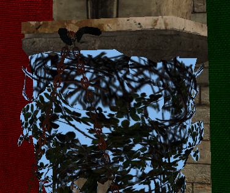

# Visual improvements and camera support

This is transition chapter. We will add small improvements and present some new concepts to prepare more relevant changes in the next chapters (therefore, it will be a shorter chapter). We will improve the visuals by adding support for transparent objects and mipmaps. We will also add support for a camera to move inside the 3D scene. Finally, we will complement the usage of descriptors by showing how to use dynamic uniforms.

You can find the complete source code for this chapter [here](../../booksamples/chapter-09).

## Transparent objects

We need to add support to draw transparent objects by first modifying the pipeline. Specifically, we need to configure the color blending that we are using in the `Pipeline` class in this way:

```java
public class Pipeline {
    ...
    public Pipeline(PipelineCache pipelineCache, Pipeline.PipeLineCreationInfo pipeLineCreationInfo) {
       ...
            VkPipelineColorBlendAttachmentState.Buffer blendAttState = VkPipelineColorBlendAttachmentState.calloc(
                    pipeLineCreationInfo.numColorAttachments(), stack);
            for (int i = 0; i < pipeLineCreationInfo.numColorAttachments(); i++) {
                blendAttState.get(i)
                        .colorWriteMask(VK_COLOR_COMPONENT_R_BIT | VK_COLOR_COMPONENT_G_BIT | VK_COLOR_COMPONENT_B_BIT | VK_COLOR_COMPONENT_A_BIT)
                        .blendEnable(pipeLineCreationInfo.useBlend());
                if (pipeLineCreationInfo.useBlend()) {
                    blendAttState.get(i).colorBlendOp(VK_BLEND_OP_ADD)
                            .alphaBlendOp(VK_BLEND_OP_ADD)
                            .srcColorBlendFactor(VK_BLEND_FACTOR_SRC_ALPHA)
                            .dstColorBlendFactor(VK_BLEND_FACTOR_ONE_MINUS_SRC_ALPHA)
                            .srcAlphaBlendFactor(VK_BLEND_FACTOR_ONE)
                            .dstAlphaBlendFactor(VK_BLEND_FACTOR_ZERO);
                }
            }
       ...
    }
    ...
}
```

For each of the output color attachments, we need to setup the blending by filing up a `VkPipelineColorBlendAttachmentState` structure. Up to now, we just had set up the `colorWriteMask`. Now we need to set up the following attributes:

- `blendEnable`: We need to enable blending to support transparent objects. By setting this attribute to `true` the colors are mixed when rendering.
- `colorBlendOp`: Defines the blending operation for the RGB components. In this case, we are adding source and destination colors, so the resulting color components will be calculated according to this formula: `R = Rs0 × Sr + Rd × Dr`, `G = Gs0 × Sg + Gd × Dg` and `B = Bs0 × Sb + Bd × Db`. As you can see, source and destination colors are added modulated by some factors (`Sx` for source colors and `Dx` for destination colors). Source color is the new color to be mixed, and destination color is the one already present in the color attachment.
- `alphaBlendOp`: Defines the blending operation for the alpha components. In this case we are also adding source and destination colors: `As0 × Sa + Ad × Da`. As you can see, again, source and destination colors are added modulated by some factors (`Sa` for source and `Da` for destination). 
- `srcColorBlendFactor`: This controls the blend factor to be used for the RGB source factors (`Sr`, `Sg` and `Sb`). In our case we are using the `VK_BLEND_FACTOR_SRC_ALPHA` value, which sets those factors to the alpha value of the source color.
- `destColorBlendFactor`: This controls the blend factor to be used for the RGB source factors (`Dr`, `Dg` and `Db`). In our case we are using the `VK_BLEND_FACTOR_ONE_MINUS_SRC_ALPHA` value, which sets those factors to one minus the alpha value of the destination color.
- `srcAlphaBlendFactor`: This controls the blend factor to be used for the alpha source component (`Sa`). In our case, we set it to the value `VK_BLEND_FACTOR_ONE`, that is, it will have a one.
- `dstAlphaBlendFactor`: This controls the blend factor to be used for the alpha destination component (`Da`). In our case, we set it to the value `VK_BLEND_FACTOR_ZERO`, that is, it will have a zero, ignoring the alpha value of the destination color.

You can try different factors and operations to better match your needs, but, in principle, this is all what is needed to support color blending. This change requires also a modification of the `PipeLineCreationInfo` record. We need to add a new attribute to activate / deactivate the blending named `useBlend`:

```java
    public record PipeLineCreationInfo(long vkRenderPass, ShaderProgram shaderProgram, int numColorAttachments,
                                       boolean hasDepthAttachment, boolean useBlend,
                                       int pushConstantsSize, VertexInputStateInfo viInputStateInfo,
                                       DescriptorSetLayout[] descriptorSetLayouts) {
        public void cleanup() {
            viInputStateInfo.cleanup();
        }
    }
```

However, if you rendered a scene with just these changes, you may experience strange artifacts. Depending on the order that objects are rendering, you may have a transparent object, closer to the camera that gets rendered first than objects that are behind. This will make that the transparent object gets blended with the background, because the distant objects will be discarded in the depth test. The next figure shows this effect.



In order to solve that, we are going to apply an easy fix, we will first draw non transparent objects to force transparent objects to blend with non transparent ones. This method still can make some artifacts (if we have may transparent objects that overlap between them), but it is simple enough and produces good results. In order to apply that, we need first to have a way to check if an object is transparent or not. We will add this support in the `Texture` class. We will add a new attribute named `hasTransparencies` that will hold `true` if the texture has transparent values. We will set up this attribute in the constructor by calling a new method named `setHasTransparencies`.

```java
public class Texture {
    ...
    private boolean hasTransparencies;
    ...
    public Texture(Device device, String fileName, int imageFormat) {
        ...
            setHasTransparencies(buf);        
        ...
    }
    ...
    public boolean hasTransparencies() {
        return hasTransparencies;
    }
    ...
    private void setHasTransparencies(ByteBuffer buf) {
        int numPixels = buf.capacity() / 4;
        int offset = 0;
        hasTransparencies = false;
        for (int i = 0; i < numPixels; i++) {
            int a = (0xFF & buf.get(offset + 3));
            if (a < 255) {
                hasTransparencies = true;
                break;
            }
            offset += 4;
        }
    }
    ...
}
```

This new method basically, iterates over the image contents, checking if the alpha component has a value different than `255` (one in normalized color components). If so, we consider that the texture has transparencies. With that information, we will add a new method to the `VulkanModel.VulkanMaterial` class which states if the material is transparent:
```java
public class VulkanModel {
    ...
    public record VulkanMaterial(Vector4f diffuseColor, Texture texture, boolean hasTexture,
                                 List<VulkanMesh> vulkanMeshList) {

        public boolean isTransparent() {
            return texture.hasTransparencies();
        }
    }
    ...
}
```

Now, when loading the models in the `Render` class, we will re-order the material list of each model to start first with the non transparent ones. We will also re-order the list of models to leave the transparent ones at the end:

```java
public class Render {
    ...
    public void loadModels(List<ModelData> modelDataList) {
        Logger.debug("Loading {} model(s)", modelDataList.size());
        vulkanModels.addAll(VulkanModel.transformModels(modelDataList, textureCache, commandPool, graphQueue));
        Logger.debug("Loaded {} model(s)", modelDataList.size());

        // Reorder materials inside models
        vulkanModels.forEach(m -> {
            Collections.sort(m.getVulkanMaterialList(), (a, b) -> Boolean.compare(a.isTransparent(), b.isTransparent()));
        });

        // Reorder models
        Collections.sort(vulkanModels, (a, b) -> {
            boolean aHasTransparentMt = a.getVulkanMaterialList().stream().filter(m -> m.isTransparent()).findAny().isPresent();
            boolean bHasTransparentMt = b.getVulkanMaterialList().stream().filter(m -> m.isTransparent()).findAny().isPresent();

            return Boolean.compare(aHasTransparentMt, bHasTransparentMt);
        });

        fwdRenderActivity.registerModels(vulkanModels);
    }
    ...
}
```

This method is called whenever new meshes are loaded, so, once we have processed them, we just reorder the list that holds them to set the ones which have non-transparent textures first.

## Mipmapping

Mipmaps are a sequence of lower scale versions of an original image frequently used in textures. They are used to increase performance, higher resolution images are used when the objects are close to the camera an lower resolution ones are used when the object is far away. Each of those versions is power of two smaller than the previous version.

The following image shows a mipmap image (obtained from the [Wikipedia]([File:MipMap Example STS101.jpg - Wikipedia](https://en.wikipedia.org/wiki/File:MipMap_Example_STS101.jpg)), Created by [en:User:Mulad](https://en.wikipedia.org/wiki/User:Mulad) based on [File:ISS from Atlantis - Sts101-714-016.jpg](https://commons.wikimedia.org/wiki/File:ISS_from_Atlantis_-_Sts101-714-016.jpg)).


Usually, those mipmaps are pre-generated when creating the game assets using specific texture formats which allow the storage of mipmaps. The Khronos group has defined the [KTX](http://github.khronos.org/KTX-Specification/) file format which supports mipmaps and direct image compression in the GPU. However, there's no library, at this moment, which LWJGL provides a binding to that allows us to load these files in Java. Therefore, we will support the dynamic generation of mipmaps at application startup.

Let's go back to the `Texture` class constructor. This first we are going to do is calculate the number of mipmap levels that we need for a specific image:

```java
public class Texture {
    ...
    public Texture(Device device, String fileName, int imageFormat) {
        ...
            width = w.get();
            height = h.get();
            mipLevels = (int) Math.floor(log2(Math.min(width, height))) + 1;
        ...
            Image.ImageData imageData = new Image.ImageData().width(width).height(height).
                    usage(VK_IMAGE_USAGE_TRANSFER_SRC_BIT | VK_IMAGE_USAGE_TRANSFER_DST_BIT | VK_IMAGE_USAGE_SAMPLED_BIT).
                    format(imageFormat).mipLevels(mipLevels);
            image = new Image(device, imageData);
        ...
    }
    ...
    private double log2(int n) {
        return Math.log(n) / Math.log(2);
    }
    ...
}
```

Since the number of images get scaled down by the power of two, we use the logarithm in base `2` to calculate the number of levels using the minimum value of the width, height of the image. Java does not provide a method to calculate base `2` logarithms, so we calculate it using logarithms in base `10`. We will be generating reduced versions of the original image iteratively, using the last scaled image as the source for the next one. This is the reason why you will see that we are using another usage flag for the `Image`. We are setting the `VK_IMAGE_USAGE_TRANSFER_SRC_BIT` flag, since we will be using the image itself as a source to generate the different levels.

The next step is to modify the `recordTextureTransition`:

```java
public class Texture {
    ...
    public void recordTextureTransition(CommandBuffer cmd) {
        if (stgBuffer != null && !recordedTransition) {
            Logger.debug("Recording transition for texture [{}]", fileName);
            recordedTransition = true;
            try (MemoryStack stack = MemoryStack.stackPush()) {
                recordImageTransition(stack, cmd, VK_IMAGE_LAYOUT_UNDEFINED, VK_IMAGE_LAYOUT_TRANSFER_DST_OPTIMAL);
                recordCopyBuffer(stack, cmd, stgBuffer);
                recordGenerateMipMaps(stack, cmd);
            }
        } else {
            Logger.debug("Texture [{}] has already been transitioned", fileName);
        }
    }
    ...
}
```

We have replaced the last transition after the buffer copy to a new method called `recordGenerateMipMaps`. This method will use the `vkCmdBlitImage` Vulkan command to copy and transform the different mipmap levels of the image. Let's analyze that method:

```java
public class Texture {
    ...
    private void recordGenerateMipMaps(MemoryStack stack, CommandBuffer cmd) {
        VkImageSubresourceRange subResourceRange = VkImageSubresourceRange.calloc(stack)
                .aspectMask(VK_IMAGE_ASPECT_COLOR_BIT)
                .baseArrayLayer(0)
                .levelCount(1)
                .layerCount(1);

        VkImageMemoryBarrier.Buffer barrier = VkImageMemoryBarrier.calloc(1, stack)
                .sType(VK_STRUCTURE_TYPE_IMAGE_MEMORY_BARRIER)
                .image(image.getVkImage())
                .srcQueueFamilyIndex(VK_QUEUE_FAMILY_IGNORED)
                .dstQueueFamilyIndex(VK_QUEUE_FAMILY_IGNORED)
                .subresourceRange(subResourceRange);

        int mipWidth = width;
        int mipHeight = height;
        ...
    }
    ...
}
```

First we define a `VkImageSubresourceRange` structure to define the range of the image that will be affected by the scaling operations. We will be modifying these values, but there are some of them that are common, such as the number of layers and levels. After that, we create a barrier to control the transition layouts, at this moment we just associate it to the image and the resource range. After this, we define the loop that will be generating the different levels:

```java
public class Texture {
    ...
    private void recordGenerateMipMaps(MemoryStack stack, CommandBuffer cmd) {
        ...
        for (int i = 1; i < mipLevels; i++) {
            subResourceRange.baseMipLevel(i - 1);
            barrier.subresourceRange(subResourceRange)
                    .oldLayout(VK_IMAGE_LAYOUT_TRANSFER_DST_OPTIMAL)
                    .newLayout(VK_IMAGE_LAYOUT_TRANSFER_SRC_OPTIMAL)
                    .srcAccessMask(VK_ACCESS_TRANSFER_WRITE_BIT)
                    .dstAccessMask(VK_ACCESS_TRANSFER_READ_BIT);

            vkCmdPipelineBarrier(cmd.getVkCommandBuffer(),
                    VK_PIPELINE_STAGE_TRANSFER_BIT, VK_PIPELINE_STAGE_TRANSFER_BIT, 0,
                    null, null, barrier);
            ...
        }
        ...
    }
    ...
}
```

We set the barrier parameters to wait for the image to transition from `VK_IMAGE_LAYOUT_TRANSFER_DST_OPTIMAL` to `VK_IMAGE_LAYOUT_TRANSFER_SRC_OPTIMAL` in order to read from it. Remember that first we transitioned the image to the `VK_IMAGE_LAYOUT_TRANSFER_DST_OPTIMAL`, we need now to read from that image to generate the different levels. The sub-resource range will refer to a specific mip level. In the first iteration, it will be set to mip level `0`. With that information we can record the transition by calling the `vkCmdPipelineBarrier` function. Going back to the loop:

```java
public class Texture {
    ...
    private void recordGenerateMipMaps(MemoryStack stack, CommandBuffer cmd) {
        ...
        for (int i = 1; i < mipLevels; i++) {
            ...
            int auxi = i;
            VkOffset3D srcOffset0 = VkOffset3D.calloc(stack).x(0).y(0).z(0);
            VkOffset3D srcOffset1 = VkOffset3D.calloc(stack).x(mipWidth).y(mipHeight).z(1);
            VkOffset3D dstOffset0 = VkOffset3D.calloc(stack).x(0).y(0).z(0);
            VkOffset3D dstOffset1 = VkOffset3D.calloc(stack)
                    .x(mipWidth > 1 ? mipWidth / 2 : 1).y(mipHeight > 1 ? mipHeight / 2 : 1).z(1);
            VkImageBlit.Buffer blit = VkImageBlit.calloc(1, stack)
                    .srcOffsets(0, srcOffset0)
                    .srcOffsets(1, srcOffset1)
                    .srcSubresource(it -> it
                            .aspectMask(VK_IMAGE_ASPECT_COLOR_BIT)
                            .mipLevel(auxi - 1)
                            .baseArrayLayer(0)
                            .layerCount(1))
                    .dstOffsets(0, dstOffset0)
                    .dstOffsets(1, dstOffset1)
                    .dstSubresource(it -> it
                            .aspectMask(VK_IMAGE_ASPECT_COLOR_BIT)
                            .mipLevel(auxi)
                            .baseArrayLayer(0)
                            .layerCount(1));

            vkCmdBlitImage(cmd.getVkCommandBuffer(),
                    image.getVkImage(), VK_IMAGE_LAYOUT_TRANSFER_SRC_OPTIMAL,
                    image.getVkImage(), VK_IMAGE_LAYOUT_TRANSFER_DST_OPTIMAL,
                    blit, VK_FILTER_LINEAR);
            ...
        }
        ....
    }
    ...
}
```

As we mentioned before, we are using the `vkCmdBlitImage` function to create the mip levels. This function copies regions of a source image into a destination image and is able to perform format conversions. The parameters are:

- The command buffer where will be recording this operation.
- The source image.
- The layout where that source image should be.
- The destination image.
- The layout where that destination image should be. We are using the same image as a source and as a destination. - The regions to blit.
- The filter to apply if the blit operation requires scaling. In or case, we select the `VK_FILTER_LINEAR` filter.

Prior to invoking the `vkCmdBlitImage` function we need to define the regions by defining a `VkImageBlit` buffer. This structure defines the following parameters:

- `srcOffsets`: This parameter defines the boundaries to be used in the blit operation for the source image. In our case, in the first iteration is the width and height of the image. In the next executions of the loop it will be progressively divided by two. It shall contain two elements.
- `srcSubresource`: It defines the sub-resource to blit from. In the first iteration it will be the base level, the level `0`. Then it will be progressively augmented, using the level constructed in the previous iteration as the source for the current one. in its `srcSubresource` the sub-resource to blit from into the sub-resource defined by the `dstSubresource
- `dstOffsets`: This parameter defines the boundaries to be used in the blit operation for the destination image. As you can see is the same size as the source image divided by two.
- `dstSubresource`: t defines the sub-resource to blit to.

To finalize the loop, we transition the image to the `VK_IMAGE_LAYOUT_SHADER_READ_ONLY_OPTIMAL` in order to be able to access that from a shader:

```java
public class Texture {
    ...
    private void recordGenerateMipMaps(MemoryStack stack, CommandBuffer cmd) {
        ...
        for (int i = 1; i < mipLevels; i++) {
            ...
            barrier.oldLayout(VK_IMAGE_LAYOUT_TRANSFER_SRC_OPTIMAL)
                    .newLayout(VK_IMAGE_LAYOUT_SHADER_READ_ONLY_OPTIMAL)
                    .srcAccessMask(VK_ACCESS_TRANSFER_READ_BIT)
                    .dstAccessMask(VK_ACCESS_SHADER_READ_BIT);

            vkCmdPipelineBarrier(cmd.getVkCommandBuffer(),
                    VK_PIPELINE_STAGE_TRANSFER_BIT, VK_PIPELINE_STAGE_FRAGMENT_SHADER_BIT, 0,
                    null, null, barrier);

            if (mipWidth > 1) mipWidth /= 2;
            if (mipHeight > 1) mipHeight /= 2;
        }
        ...
    }
    ...
}
```

When we finalize the loop we need to transition the layout of the last mip level:

```java
public class Texture {
    ...
    private void recordGenerateMipMaps(MemoryStack stack, CommandBuffer cmd) {
        ...
        barrier.subresourceRange(it -> it
                .baseMipLevel(mipLevels - 1))
                .oldLayout(VK_IMAGE_LAYOUT_TRANSFER_DST_OPTIMAL)
                .newLayout(VK_IMAGE_LAYOUT_SHADER_READ_ONLY_OPTIMAL)
                .srcAccessMask(VK_ACCESS_TRANSFER_WRITE_BIT)
                .dstAccessMask(VK_ACCESS_SHADER_READ_BIT);

        vkCmdPipelineBarrier(cmd.getVkCommandBuffer(),
                VK_PIPELINE_STAGE_TRANSFER_BIT, VK_PIPELINE_STAGE_FRAGMENT_SHADER_BIT, 0,
                null, null, barrier);
    }
    ...
}
```

## Camera

We will create a new class named `Camera` to support moving around the scene. The definition is quite simple:

```java
package org.vulkanb.eng.scene;

import org.joml.*;

public class Camera {

    private Vector3f direction;
    private Vector3f position;
    private Vector3f right;
    private Vector2f rotation;
    private Vector3f up;
    private Matrix4f viewMatrix;

    public Camera() {
        direction = new Vector3f();
        right = new Vector3f();
        up = new Vector3f();
        position = new Vector3f();
        viewMatrix = new Matrix4f();
        rotation = new Vector2f();
    }

    public void addRotation(float x, float y) {
        rotation.add(x, y);
        recalculate();
    }

    public Vector3f getPosition() {
        return position;
    }
    
    public Matrix4f getViewMatrix() {
        return viewMatrix;
    }

    public void moveBackwards(float inc) {
        viewMatrix.positiveZ(direction).negate().mul(inc);
        position.sub(direction);
        recalculate();
    }

    public void moveDown(float inc) {
        viewMatrix.positiveY(up).mul(inc);
        position.sub(up);
        recalculate();
    }

    public void moveForward(float inc) {
        viewMatrix.positiveZ(direction).negate().mul(inc);
        position.add(direction);
        recalculate();
    }

    public void moveLeft(float inc) {
        viewMatrix.positiveX(right).mul(inc);
        position.sub(right);
        recalculate();
    }

    public void moveRight(float inc) {
        viewMatrix.positiveX(right).mul(inc);
        position.add(right);
        recalculate();
    }

    public void moveUp(float inc) {
        viewMatrix.positiveY(up).mul(inc);
        position.add(up);
        recalculate();
    }

    private void recalculate() {
        viewMatrix.identity()
                .rotateX(rotation.x)
                .rotateY(rotation.y)
                .translate(-position.x, -position.y, -position.z);
    }

    public void setPosition(float x, float y, float z) {
        position.set(x, y, z);
        recalculate();
    }

    public void setRotation(float x, float y) {
        rotation.set(x, y);
        recalculate();
    }
}
```

This class, in essence, stores the view matrix, which can be modified by the different methods that it provides to change its position, to apply rotation or to displace around the scene. It uses the JOML library to calculate up and forward vectors to displace.

The camera is now part of the scene:

```java
public class Scene {
    ...
    private Camera camera;
    ...
    public Scene(Window window) {
        ...
        camera = new Camera();
    }
    ...
    public Camera getCamera() {
        return camera;
    }
    ...
}
```

We will see later on how to use the camera while recording the render commands.

## Dynamic uniform buffers

Up to now, we have created the buffers associated to uniforms though descriptor sets of `VK_DESCRIPTOR_TYPE_UNIFORM_BUFFER` type. There is another type which can use a single buffer and a descriptor set, passing a region of that buffer to the shaders when binding the descriptor sets. These are called dynamic uniform buffers. They can be used to reduce the number of individual buffers an descriptor sets, for example when passing material properties to the shaders. This is the showcase we will use to explain its usage. Therefore, we will start by including the diffuse color in the fragment shader:

```glsl
#version 450

layout(location = 0) in vec2 textCoords;
layout(location = 0) out vec4 uFragColor;

layout(set = 2, binding = 0) uniform sampler2D textSampler;

layout(set = 3, binding = 0) uniform MaterialUniform {
    vec4 diffuseColor;
} material;

void main()
{
    uFragColor = material.diffuseColor + texture(textSampler, textCoords);
}
```

As you can see, we have created a new uniform named `material` which defines a structure with a single field to store the diffuse color. The uniform definition does not need to be modified if we are using dynamic uniforms, this will need to be set up in the application code.

In the shader, we are combining the color obtained from the texture with the diffuse color. We will modify the `ModelLoader` class to set the diffuse color to `0` if the mesh defines a texture:

```java
public class ModelLoader {
    ...
    private static ModelData.Material processMaterial(AIMaterial aiMaterial, String texturesDir) {
        ...
            if (texturePath != null && texturePath.length() > 0) {
                texturePath = texturesDir + File.separator + new File(texturePath).getName();
                diffuse = new Vector4f(0.0f, 0.0f, 0.0f, 0.0f);
            }
        ...
    }
    ...
}
```

With these changes we need to define a new descriptor set layout for the material structure. We will not use regular frame buffers as in previous examples, we will use dynamic uniform buffers. Therefore, we will create a new class that extends the `SimpleDescriptorSetLayout`, named `DynUniformDescriptorSetLayout`:

```java
public abstract class DescriptorSetLayout {
    ...
    public static class DynUniformDescriptorSetLayout extends SimpleDescriptorSetLayout {
        public DynUniformDescriptorSetLayout(Device device, int binding, int stage) {
            super(device, VK_DESCRIPTOR_TYPE_UNIFORM_BUFFER_DYNAMIC, binding, stage);
        }
    }
    ...
}
```

A dynamic uniform buffer will allow us to create a single buffer which will hold all the data for all the possible materials, while passing a specific window to that buffer to the shaders for the specific material to be used while rendering. These descriptor sets use the `VK_DESCRIPTOR_TYPE_UNIFORM_BUFFER_DYNAMIC` type. As you can image we will need also a new descriptor set type that we will use for the materials. We will create a new class named `DynUniformDescriptorSet` which will inherit from `SimpleDescriptorSet`. This class will use the `VK_DESCRIPTOR_TYPE_UNIFORM_BUFFER_DYNAMIC` type and will have an extra parameter for the `size`. If you remember from previous descriptor sets, we just used the size of the buffer that holds the uniform values. In this case is different, the buffer will hold the values for all the materials, but this new `size` parameter will not be the size of that large buffer. It will be be the size in bytes of the data associated to a single material. You can think about it as the size of one of the slices of that buffer that we can associate to a uniform. We will see later on how to calculate these slices.
```java
public abstract class DescriptorSet {
    ...
    public static class DynUniformDescriptorSet extends SimpleDescriptorSet {
        public DynUniformDescriptorSet(DescriptorPool descriptorPool, DescriptorSetLayout descriptorSetLayout,
                                       VulkanBuffer buffer, int binding, long size) {
            super(descriptorPool, descriptorSetLayout, buffer, binding, VK_DESCRIPTOR_TYPE_UNIFORM_BUFFER_DYNAMIC, size);
        }
    }
    ...
}
```

## Completing the changes

Now it is the turn to modify the `ForwardRenderActivity` class. We start be fining new attributes for the descriptors associated to the materials, and a new descriptor set for the uniforms that will hold the view matrices associated to the camera. As it has been described before, the `Pipeline.PipeLineCreationInfo pipeLineCreationInfo` record has also been modified to control if we will use blending or not.

```java
public class ForwardRenderActivity {
    ...
    private DescriptorSetLayout.DynUniformDescriptorSetLayout materialDescriptorSetLayout;
    private int materialSize;
    private VulkanBuffer materialsBuffer;
    private  DescriptorSet.DynUniformDescriptorSet materialsDescriptorSet;
    ....
    private VulkanBuffer[] viewMatricesBuffer;
    private DescriptorSet.UniformDescriptorSet[] viewMatricesDescriptorSets;
    ...
    public ForwardRenderActivity(SwapChain swapChain, CommandPool commandPool, PipelineCache pipelineCache, Scene scene) {
        ...
        materialSize = calcMaterialsUniformSize();
        ...
        createDescriptorSets(numImages);

        Pipeline.PipeLineCreationInfo pipeLineCreationInfo = new Pipeline.PipeLineCreationInfo(
                renderPass.getVkRenderPass(), fwdShaderProgram, 1, true, true, GraphConstants.MAT4X4_SIZE,
                new VertexBufferStructure(), descriptorSetLayouts);
        ...
    }
    ...
    private int calcMaterialsUniformSize() {
        PhysicalDevice physDevice = device.getPhysicalDevice();
        long minUboAlignment = physDevice.getVkPhysicalDeviceProperties().limits().minUniformBufferOffsetAlignment();
        long mult = (GraphConstants.VEC4_SIZE * 9) / minUboAlignment + 1;
        return (int) (mult * minUboAlignment);
    }
    ...
}
```
This class also defines a new attribute named `materialSize`. This will hold the value of on of the slices of the materials buffer that we mentioned previously. This size, will not be strictly the size of the data contained in the material uniform for one material. Those slices need to be aligned in multiples of a minimum allocation size defined by the `minUniformBufferOffsetAlignment` property of the physical device. Therefore, we have created a new method named `calcMaterialsUniformSize` which calculates that size.

The next step is to modify the `createDescriptorSets` method:
```java
public class ForwardRenderActivity {
    ...
    private void createDescriptorSets(int numImages) {
        uniformDescriptorSetLayout = new DescriptorSetLayout.UniformDescriptorSetLayout(device, 0, VK_SHADER_STAGE_VERTEX_BIT);
        textureDescriptorSetLayout = new DescriptorSetLayout.SamplerDescriptorSetLayout(device, 0, VK_SHADER_STAGE_FRAGMENT_BIT);
        materialDescriptorSetLayout = new DescriptorSetLayout.DynUniformDescriptorSetLayout(device, 0, VK_SHADER_STAGE_FRAGMENT_BIT);
        descriptorSetLayouts = new DescriptorSetLayout[]{
                uniformDescriptorSetLayout,
                uniformDescriptorSetLayout,
                textureDescriptorSetLayout,
                materialDescriptorSetLayout,
        };

        EngineProperties engineProps = EngineProperties.getInstance();
        List<DescriptorPool.DescriptorTypeCount> descriptorTypeCounts = new ArrayList<>();
        descriptorTypeCounts.add(new DescriptorPool.DescriptorTypeCount(swapChain.getNumImages() + 1, VK_DESCRIPTOR_TYPE_UNIFORM_BUFFER));
        descriptorTypeCounts.add(new DescriptorPool.DescriptorTypeCount(engineProps.getMaxMaterials(), VK_DESCRIPTOR_TYPE_COMBINED_IMAGE_SAMPLER));
        descriptorTypeCounts.add(new DescriptorPool.DescriptorTypeCount(1, VK_DESCRIPTOR_TYPE_UNIFORM_BUFFER_DYNAMIC));
        descriptorPool = new DescriptorPool(device, descriptorTypeCounts);
        descriptorSetMap = new HashMap<>();
        textureSampler = new TextureSampler(device, 1);
        projMatrixUniform = new VulkanBuffer(device, GraphConstants.MAT4X4_SIZE, VK_BUFFER_USAGE_UNIFORM_BUFFER_BIT,
                VK_MEMORY_PROPERTY_HOST_VISIBLE_BIT);
        projMatrixDescriptorSet = new DescriptorSet.UniformDescriptorSet(descriptorPool, uniformDescriptorSetLayout, projMatrixUniform, 0);

        viewMatricesDescriptorSets = new DescriptorSet.UniformDescriptorSet[numImages];
        viewMatricesBuffer = new VulkanBuffer[numImages];
        materialsBuffer = new VulkanBuffer(device, (long) materialSize * engineProps.getMaxMaterials(), VK_BUFFER_USAGE_UNIFORM_BUFFER_BIT,
                VK_MEMORY_PROPERTY_HOST_VISIBLE_BIT);
        materialsDescriptorSet = new DescriptorSet.DynUniformDescriptorSet(descriptorPool, materialDescriptorSetLayout,
                materialsBuffer, 0, materialSize);
        for (int i = 0; i < numImages; i++) {
            viewMatricesBuffer[i] = new VulkanBuffer(device, GraphConstants.MAT4X4_SIZE, VK_BUFFER_USAGE_UNIFORM_BUFFER_BIT,
                    VK_MEMORY_PROPERTY_HOST_VISIBLE_BIT);
            viewMatricesDescriptorSets[i] = new DescriptorSet.UniformDescriptorSet(descriptorPool, uniformDescriptorSetLayout,
                    viewMatricesBuffer[i], 0);
        }
    }
    ...
}
```

We will be using four descriptor sets now, the first one for the perspective projection matrix, the second one will be used for the view matrix, the third one for the texture sampler and, finally, the fourth one for the materials uniform. Therefore, we need to update the descriptor sets layouts that will be used in the pipeline. After that, we setup the number of descriptor sets we need according to their type:

- We will use the `VK_DESCRIPTOR_TYPE_UNIFORM_BUFFER` descriptor sets for the uniforms associated to the perspective projection matrix and the view matrix. We just need one descriptor set for the projection uniform, since we will not be changing it while drawing a frame. However, the view matrix can be modified while rendering, so we will create separate descriptor sets (and also the associated buffers), one per swap chain image.
- We will use the `VK_DESCRIPTOR_TYPE_COMBINED_IMAGE_SAMPLER` descriptor sets for the combined texture samplers. We will need as many descriptor sets as textures we will have. Here we are defining a new property to configure the maximum number of supported materials. As explained in the previous chapter, we don't need separate descriptor sets per swap chain image. Textures here are read only.
- We will use the `VK_DESCRIPTOR_TYPE_UNIFORM_BUFFER_DYNAMIC` descriptor sets for the uniform associated to the material data. If we were not using dynamic uniform buffers, we would need at least one per material. We are using a single descriptor set to hold all the material data, since we will not be updating them while rendering.

In the final part of the method, we create the descriptor sets and the associated buffers. Please note, that the buffer size for the materials data is the size of the material uniform (aligned) multiplied by the maximum number of materials.

As we have just said, we have defined a new property to configure the maximum number of supported materials:

```java
public class EngineProperties {
    ...
    private static final int DEFAULT_MAX_MATERIALS = 500;
    ...
    private int maxMaterials;
    ...
    private EngineProperties() {
        ...
            maxMaterials = Integer.parseInt(props.getOrDefault("maxMaterials", DEFAULT_MAX_MATERIALS).toString());
        ...
    }
    ...
    public int getMaxMaterials() {
        return maxMaterials;
    }
    ...
}
```

Going back to the `ForwardRenderActivity` class, we need to modify the `cleanUp` method to free the new resources created (we do not remove the list of descriptor sets layout, since we are reusing some of them, we need to remove them one by one):

```java
public class ForwardRenderActivity {
    ...
    public void cleanup() {
        materialsBuffer.cleanup();
        Arrays.asList(viewMatricesBuffer).forEach(VulkanBuffer::cleanup);
        ...
        materialDescriptorSetLayout.cleanup();
        ...
    }
    ...
}
```

We will also modify the `registerModels` method, to update the buffer that holds the materials data:

```java
public class ForwardRenderActivity {
    ...
    public void registerModels(List<VulkanModel> vulkanModelList) {
        device.waitIdle();
        int materialCount = 0;
        for (VulkanModel vulkanModel : vulkanModelList) {
            for (VulkanModel.VulkanMaterial vulkanMaterial : vulkanModel.getVulkanMaterialList()) {
                int materialOffset = materialCount * materialSize;
                updateTextureDescriptorSet(vulkanMaterial.texture());
                updateMaterialsBuffer(materialsBuffer, vulkanMaterial, materialOffset);
                materialCount++;
            }
        }
    }
    ...
}
```

As you can see, we calculate the offset in the buffer, to update the material data by calling the `updateMaterialsBuffer` data:

```java
public class ForwardRenderActivity {
    ...
    private void updateMaterialsBuffer(VulkanBuffer vulkanBuffer, VulkanModel.VulkanMaterial material, int offset) {
        long mappedMemory = vulkanBuffer.map();
        ByteBuffer materialBuffer = MemoryUtil.memByteBuffer(mappedMemory, (int) vulkanBuffer.getRequestedSize());
        material.diffuseColor().get(offset, materialBuffer);
        vulkanBuffer.unMap();
    }
    ...
}
```

In the `updateMaterialsBuffer` method, we just map the buffer and dump the material diffuse color to the appropriate offset. 

Finally, we just need to update a little bit the way we record the commands to bind the additional descriptor sets and to use the dynamic uniform buffers. We have also extracted the part of the code which rendered the models to a new method called `recordEntities`:

```java
public class ForwardRenderActivity {
    ...
    public void recordCommandBuffer(List<VulkanModel> vulkanModelList) {
        ...
            LongBuffer descriptorSets = stack.mallocLong(4)
                    .put(0, projMatrixDescriptorSet.getVkDescriptorSet())
                    .put(1, viewMatricesDescriptorSets[idx].getVkDescriptorSet())
                    .put(3, materialsDescriptorSet.getVkDescriptorSet());
            VulkanUtils.copyMatrixToBuffer(viewMatricesBuffer[idx], scene.getCamera().getViewMatrix());

            recordEntities(stack, cmdHandle, descriptorSets, vulkanModelList);

            vkCmdEndRenderPass(cmdHandle);
            commandBuffer.endRecording();
        }
        ...
    }

    private void recordEntities(MemoryStack stack, VkCommandBuffer cmdHandle, LongBuffer descriptorSets,
                                List<VulkanModel> vulkanModelList) {
        LongBuffer offsets = stack.mallocLong(1);
        offsets.put(0, 0L);
        LongBuffer vertexBuffer = stack.mallocLong(1);
        IntBuffer dynDescrSetOffset = stack.callocInt(1);
        int materialCount = 0;
        for (VulkanModel vulkanModel : vulkanModelList) {
            String modelId = vulkanModel.getModelId();
            List<Entity> entities = scene.getEntitiesByModelId(modelId);
            if (entities.isEmpty()) {
                materialCount += vulkanModel.getVulkanMaterialList().size();
                continue;
            }
            for (VulkanModel.VulkanMaterial material : vulkanModel.getVulkanMaterialList()) {
                if (material.vulkanMeshList().isEmpty()) {
                    materialCount++;
                    continue;
                }

                int materialOffset = materialCount * materialSize;
                dynDescrSetOffset.put(0, materialOffset);
                TextureDescriptorSet textureDescriptorSet = descriptorSetMap.get(material.texture().getFileName());
                descriptorSets.put(2, textureDescriptorSet.getVkDescriptorSet());

                for (VulkanModel.VulkanMesh mesh : material.vulkanMeshList()) {
                    vertexBuffer.put(0, mesh.verticesBuffer().getBuffer());
                    vkCmdBindVertexBuffers(cmdHandle, 0, vertexBuffer, offsets);
                    vkCmdBindIndexBuffer(cmdHandle, mesh.indicesBuffer().getBuffer(), 0, VK_INDEX_TYPE_UINT32);

                    for (Entity entity : entities) {
                        vkCmdBindDescriptorSets(cmdHandle, VK_PIPELINE_BIND_POINT_GRAPHICS,
                                pipeLine.getVkPipelineLayout(), 0, descriptorSets, dynDescrSetOffset);

                        VulkanUtils.setMatrixAsPushConstant(pipeLine, cmdHandle, entity.getModelMatrix());
                        vkCmdDrawIndexed(cmdHandle, mesh.numIndices(), 1, 0, 0, 0);
                    }
                }
                materialCount++;
            }
        }
    }
    ...
}
```

As you can see, we create a buffer of for positions to hold the descriptor sets. We setup the view matrix descriptor set and the materials descriptor set. The `dynDescrSetOffset` attribute will hold the offset inside the materials buffer used to refer to the proper uniform data. This will be used in the `vkCmdBindDescriptorSets` function. In that function we use the regular descriptor sets, which was partially filled up in the `recordCommandBuffer` method for the decsriptor sets which do not change per entity. In this method, we will fill up the per-material descriptor set, the texture, at the position `2` (the one that is expected in the shader for that element).

The vertex shader (`fwd_vertex.glsl`) needs to be updated to use the uniform that contains the view matrix:
```glsl
#version 450

layout(location = 0) in vec3 entityPos;
layout(location = 1) in vec2 entityTextCoords;

layout(location = 0) out vec2 textCoords;

layout(set = 0, binding = 0) uniform ProjUniform {
    mat4 projectionMatrix;
} projUniform;
layout(set = 1, binding = 0) uniform ViewUniform {
    mat4 viewMatrix;
} viewUniform;

layout(push_constant) uniform matrices {
    mat4 modelMatrix;
} push_constants;

void main()
{
    gl_Position = projUniform.projectionMatrix * viewUniform.viewMatrix * push_constants.modelMatrix * vec4(entityPos, 1);
    textCoords = entityTextCoords;
}
```

The fragment shader (`fwd_fragment.glsl`) needs to be updated to use the material information:
```glsl
#version 450

layout(location = 0) in vec2 textCoords;
layout(location = 0) out vec4 uFragColor;

layout(set = 2, binding = 0) uniform sampler2D textSampler;

layout(set = 3, binding = 0) uniform MaterialUniform {
    vec4 diffuseColor;
} material;

void main()
{
    uFragColor = material.diffuseColor + texture(textSampler, textCoords);
}
```

The last step is to change the `Main` class to use the camera and a new model. In this case we will be using the famous Sponza model (we are using the models from [GitHub - KhronosGroup/glTF-Sample-Models: glTF Sample Models](https://github.com/KhronosGroup/glTF-Sample-Models)). We have modified the `input` to update the camera position with the mouse movement when pressing the right button:

```java
public class Main implements IAppLogic {
    ...
    private static final float MOUSE_SENSITIVITY = 0.1f;
    private static final float MOVEMENT_SPEED = 0.01f;
    ...
    public void input(Window window, Scene scene, long diffTimeMillis) {
        float move = diffTimeMillis * MOVEMENT_SPEED;
        Camera camera = scene.getCamera();
        if (window.isKeyPressed(GLFW_KEY_W)) {
            camera.moveForward(move);
        } else if (window.isKeyPressed(GLFW_KEY_S)) {
            camera.moveBackwards(move);
        }
        if (window.isKeyPressed(GLFW_KEY_A)) {
            camera.moveLeft(move);
        } else if (window.isKeyPressed(GLFW_KEY_D)) {
            camera.moveRight(move);
        }
        if (window.isKeyPressed(GLFW_KEY_UP)) {
            camera.moveUp(move);
        } else if (window.isKeyPressed(GLFW_KEY_DOWN)) {
            camera.moveDown(move);
        }

        MouseInput mouseInput = window.getMouseInput();
        if (mouseInput.isRightButtonPressed()) {
            Vector2f displVec = mouseInput.getDisplVec();
            camera.addRotation((float) Math.toRadians(-displVec.x * MOUSE_SENSITIVITY),
                    (float) Math.toRadians(-displVec.y * MOUSE_SENSITIVITY));
        }
    }
    ...
}
```

The `init` method has also been modified to load the new model:

```java
public class Main implements IAppLogic {
    ...
    @Override
    public void init(Window window, Scene scene, Render render) {
        List<ModelData> modelDataList = new ArrayList<>();

        String sponzaModelId = "sponza-model";
        ModelData sponzaModelData = ModelLoader.loadModel(sponzaModelId, "resources/models/sponza/Sponza.gltf",
                "resources/models/sponza");
        modelDataList.add(sponzaModelData);
        Entity sponzaEntity = new Entity("SponzaEntity", sponzaModelId, new Vector3f(0.0f, 0.0f, 0.0f));
        scene.addEntity(sponzaEntity);

        render.loadModels(modelDataList);

        Camera camera = scene.getCamera();
        camera.setPosition(0.0f, 5.0f, -0.0f);
        camera.setRotation((float) Math.toRadians(20.0f), (float) Math.toRadians(90.f));
    }
    ...
}
```

With all of these changes you will be able to see the Sponza model. You will be able to move around the scene, and you can check that transparent objects are properly rendered.


[Next chapter](../chapter-10/chapter-10.md)
