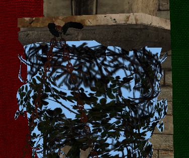
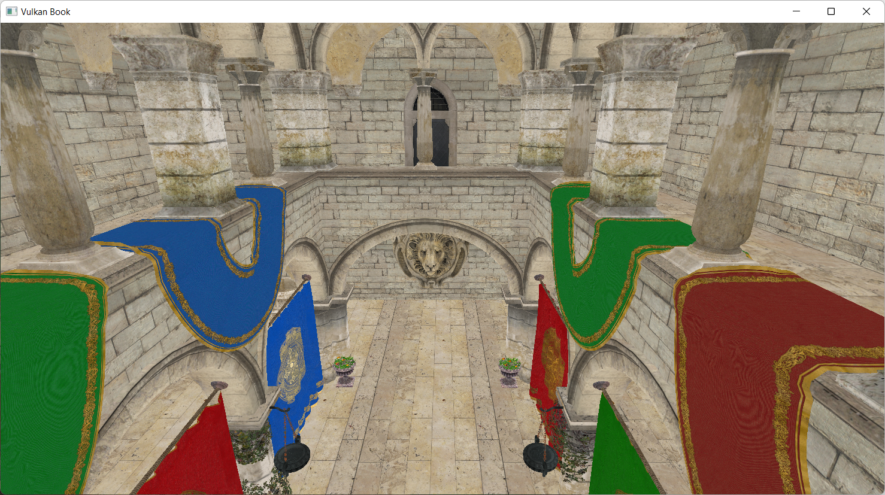

# Chapter 09 - Visual improvements and camera support

This is transition chapter. We will add small improvements and present some new concepts to prepare more relevant changes in the next chapters (therefore, it will be a shorter chapter). We will improve the visuals by adding support for transparent objects and mipmaps. We will also add support for a camera to move inside the 3D scene.

You can find the complete source code for this chapter [here](../../booksamples/chapter-09).

## Transparent objects

We need to add support to draw transparent objects by first modifying the pipeline. Specifically, we need to configure the color blending that we are using in the `Pipeline` class in this way:

```java
public class Pipeline {
    ...
    public Pipeline(VkCtx vkCtx, PipelineBuildInfo buildInfo) {
       ...
            var blendAttState = VkPipelineColorBlendAttachmentState.calloc(1, stack)
                    .colorWriteMask(VK_COLOR_COMPONENT_R_BIT | VK_COLOR_COMPONENT_G_BIT | VK_COLOR_COMPONENT_B_BIT | VK_COLOR_COMPONENT_A_BIT)
                    .blendEnable(buildInfo.isUseBlend());
            if (buildInfo.isUseBlend()) {
                blendAttState.get(0).colorBlendOp(VK_BLEND_OP_ADD)
                        .alphaBlendOp(VK_BLEND_OP_ADD)
                        .srcColorBlendFactor(VK_BLEND_FACTOR_SRC_ALPHA)
                        .dstColorBlendFactor(VK_BLEND_FACTOR_ONE_MINUS_SRC_ALPHA)
                        .srcAlphaBlendFactor(VK_BLEND_FACTOR_SRC_ALPHA)
                        .dstAlphaBlendFactor(VK_BLEND_FACTOR_ZERO);
            }
       ...
    }
    ...
}
```

We need to setup the blending by filing up a `VkPipelineColorBlendAttachmentState` structure. Up to now, we just had set up the `colorWriteMask`. Now we need to set up the following attributes:

- `blendEnable`: We need to enable blending to support transparent objects. By setting this attribute to `true` the colors are mixed when rendering.
- `colorBlendOp`: Defines the blending operation for the RGB components. In this case, we are adding source and destination colors, so the resulting color components will be calculated according to this formula: `R = Rs0 × Sr + Rd × Dr`, `G = Gs0 × Sg + Gd × Dg` and `B = Bs0 × Sb + Bd × Db`. As you can see, source and destination colors are added modulated by some factors (`Sx` for source colors and `Dx` for destination colors). Source color is the new color to be mixed, and destination color is the one already present in the color attachment.
- `alphaBlendOp`: Defines the blending operation for the alpha components. In this case we are also adding source and destination colors: `As0 × Sa + Ad × Da`. As you can see, again, source and destination colors are added modulated by some factors (`Sa` for source and `Da` for destination). 
- `srcColorBlendFactor`: This controls the blend factor to be used for the RGB source factors (`Sr`, `Sg` and `Sb`). In our case we are using the `VK_BLEND_FACTOR_SRC_ALPHA` value, which sets those factors to the alpha value of the source color.
- `destColorBlendFactor`: This controls the blend factor to be used for the RGB source factors (`Dr`, `Dg` and `Db`). In our case we are using the `VK_BLEND_FACTOR_ONE_MINUS_SRC_ALPHA` value, which sets those factors to one minus the alpha value of the destination color.
- `srcAlphaBlendFactor`: This controls the blend factor to be used for the alpha source component (`Sa`). In our case, we set it to the value `VK_BLEND_FACTOR_ONE`, that is, it will have a one.
- `dstAlphaBlendFactor`: This controls the blend factor to be used for the alpha destination component (`Da`). In our case, we set it to the value `VK_BLEND_FACTOR_ZERO`, that is, it will have a zero, ignoring the alpha value of the destination color.

You can try different factors and operations to better match your needs, but, in principle, this is all what is needed to support color blending. This change requires also a modification of the `PipelineBuildInfo` class. We need to add a new attribute to activate / deactivate the blending named `useBlend`:

```java
public class PipelineBuildInfo {
    ...
    private boolean useBlend;

    public PipelineBuildInfo(ShaderModule[] shaderModules, VkPipelineVertexInputStateCreateInfo vi, int colorFormat) {
        ...
        useBlend = false;
    }
    ...
    public boolean isUseBlend() {
        return useBlend;
    }
    ...
    public PipelineBuildInfo setUseBlend(boolean useBlend) {
        this.useBlend = useBlend;
        return this;
    }
}
```

However, if you rendered a scene with just these changes, you may experience strange artifacts. Depending on the order that objects are rendering, you may have a transparent object, closer to the camera that gets rendered first than objects that are behind. This will make that the transparent object gets blended with the background, because the distant objects will be discarded in the depth test. The next figure shows this effect.



In order to solve that, we are going to apply an easy fix, we will first draw non transparent objects to force transparent objects to blend with non transparent ones. This method still can make some artifacts (if we have may transparent objects that overlap between them), but it is simple enough and produces good results. In order to apply that, we need first to have a way to check if an object is transparent or not. We will add this support in the `Texture` class. We will add a new attribute named `transparent` that will hold `true` if the texture has transparent values. We will set up this attribute in the constructor by calling a new method named `setTransparent`.

```java
public class Texture {
    ...
    private boolean transparent;
    ...
    public Texture(VkCtx vkCtx, String id, ImageSrc srcImage, int imageFormat) {
        ...
        setTransparent(srcImage.data());
        ...
    }
    ...
    public boolean isTransparent() {
        return transparent;
    }
    ...
    private void setTransparent(ByteBuffer data) {
        int numPixels = data.capacity() / 4;
        int offset = 0;
        transparent = false;
        for (int i = 0; i < numPixels; i++) {
            int a = (0xFF & data.get(offset + 3));
            if (a < 255) {
                transparent = true;
                break;
            }
            offset += 4;
        }
    }
    ...
}
```

This new method basically, iterates over the image contents, checking if the alpha component has a value different than `255` (one in normalized color components). If so, we consider that the texture has transparencies. With that information, we will add a new field to the `VulkanMaterial` class which states if the material is transparent:

```java
package org.vulkanb.eng.graph;

public record VulkanMaterial(String id, boolean isTransparent) {
}
```

We need also to update the `MaterialsCache` to adapt to `VulkanMaterial` changes:

```java
public class MaterialsCache {
    ...
    public void loadMaterials(VkCtx vkCtx, List<MaterialData> materials, TextureCache textureCache, CmdPool cmdPool,
                              Queue queue) {
        ...
        for (int i = 0; i < numMaterials; i++) {
            ...
            boolean isTransparent;
            if (hasTexture) {
                Texture texture = textureCache.addTexture(vkCtx, texturePath, texturePath, VK_FORMAT_R8G8B8A8_SRGB);
                isTransparent = texture.isTransparent();
            } else {
                isTransparent = material.diffuseColor().w < 1.0f;
            }
            VulkanMaterial vulkanMaterial = new VulkanMaterial(material.id(), isTransparent);
            ...
        }
        ...
    }
    ...
}
```

When rendering the models, we will render materials that are transparent in last place. We will see the changes later on.

## Mipmapping

Mipmaps are a sequence of lower scale versions of an original image frequently used in textures. They are used to increase performance, higher resolution images are used when the objects are close to the camera an lower resolution ones are used when the object is far away. Each of those versions is power of two smaller than the previous version.

The following image shows a mipmap image (obtained from the [Wikipedia]([File:MipMap Example STS101.jpg - Wikipedia](https://en.wikipedia.org/wiki/File:MipMap_Example_STS101.jpg)), Created by [en:User:Mulad](https://en.wikipedia.org/wiki/User:Mulad) based on [File:ISS from Atlantis - Sts101-714-016.jpg](https://commons.wikimedia.org/wiki/File:ISS_from_Atlantis_-_Sts101-714-016.jpg)).


Usually, those mipmaps are pre-generated when creating the game assets using specific texture formats which allow the storage of mipmaps. The Khronos group has defined the [KTX](http://github.khronos.org/KTX-Specification/) file format which supports mipmaps and direct image compression in the GPU. However, there's no library, at this moment, which LWJGL provides a binding to that allows us to load these files in Java. Therefore, we will support the dynamic generation of mipmaps at application startup.

Let's go back to the `Texture` class constructor. This first we are going to do is calculate the number of mipmap levels that we need for a specific image:

```java
public class Texture {
    ...
    public Texture(VkCtx vkCtx, String id, ImageSrc srcImage, int imageFormat) {
        ...
        int mipLevels = (int) Math.floor(log2(Math.min(width, height))) + 1;
        var imageData = new Image.ImageData().width(width).height(height).
                usage(VK_IMAGE_USAGE_TRANSFER_SRC_BIT | VK_IMAGE_USAGE_TRANSFER_DST_BIT | VK_IMAGE_USAGE_SAMPLED_BIT).
                format(imageFormat).mipLevels(mipLevels);
        ...
        var imageViewData = new ImageView.ImageViewData().format(image.getFormat()).
                aspectMask(VK_IMAGE_ASPECT_COLOR_BIT).mipLevels(mipLevels);
        ...
    }
    ...
    private double log2(int n) {
        return Math.log(n) / Math.log(2);
    }
    ...
}
```

Since the number of images get scaled down by the power of two, we use the logarithm in base `2` to calculate the number of levels using the minimum value of the width, height of the image. Java does not provide a method to calculate base `2` logarithms, so we calculate it using logarithms in base `10`. We will be generating reduced versions of the original image iteratively, using the last scaled image as the source for the next one. This is the reason why you will see that we are using another usage flag for the `Image`. We are setting the `VK_IMAGE_USAGE_TRANSFER_SRC_BIT` flag, since we will be using the image itself as a source to generate the different levels.

The next step is to modify the `recordTextureTransition`:

```java
public class Texture {
    ...
    public void recordTextureTransition(CmdBuffer cmd) {
        if (stgBuffer != null && !recordedTransition) {
            recordedTransition = true;
            try (var stack = MemoryStack.stackPush()) {
                VkUtils.imageBarrier(stack, cmd.getVkCommandBuffer(), image.getVkImage(),
                        VK_IMAGE_LAYOUT_UNDEFINED, VK_IMAGE_LAYOUT_TRANSFER_DST_OPTIMAL,
                        VK_PIPELINE_STAGE_TOP_OF_PIPE_BIT, VK_PIPELINE_STAGE_TRANSFER_BIT,
                        VK_ACCESS_2_NONE, VK_ACCESS_TRANSFER_WRITE_BIT,
                        VK_IMAGE_ASPECT_COLOR_BIT);
                recordCopyBuffer(stack, cmd, stgBuffer);
                recordGenerateMipMaps(stack, cmd);
            }
        }
    }
    ...
}
```

We have replaced the last transition after the buffer copy to a new method called `recordGenerateMipMaps`. This method will use the `vkCmdBlitImage` Vulkan command to copy and transform the different mipmap levels of the image. Let's analyze that method:

```java
public class Texture {
    ...
    private void recordGenerateMipMaps(MemoryStack stack, CmdBuffer cmd) {
        VkImageSubresourceRange subResourceRange = VkImageSubresourceRange.calloc(stack)
                .aspectMask(VK_IMAGE_ASPECT_COLOR_BIT)
                .baseArrayLayer(0)
                .levelCount(1)
                .layerCount(1);

        VkImageMemoryBarrier2.Buffer barrier = VkImageMemoryBarrier2.calloc(1, stack)
                .sType$Default()
                .image(image.getVkImage())
                .srcQueueFamilyIndex(VK_QUEUE_FAMILY_IGNORED)
                .dstQueueFamilyIndex(VK_QUEUE_FAMILY_IGNORED)
                .subresourceRange(subResourceRange);

        VkDependencyInfo depInfo = VkDependencyInfo.calloc(stack)
                .sType$Default()
                .pImageMemoryBarriers(barrier);

        int mipWidth = width;
        int mipHeight = height;
        ...
    }
    ...
}
```

First we define a `VkImageSubresourceRange` structure to define the range of the image that will be affected by the scaling operations. We will be modifying these values, but there are some of them that are common, such as the number of layers and levels. After that, we create a barrier to control the transition layouts, at this moment we just associate it to the image and the resource range. After this, we define the loop that will be generating the different levels:

```java
public class Texture {
    ...
    private void recordGenerateMipMaps(MemoryStack stack, CmdBuffer cmd) {
        ...
        int mipLevels = image.getMipLevels();
        for (int i = 1; i < mipLevels; i++) {
            subResourceRange.baseMipLevel(i - 1);
            barrier.subresourceRange(subResourceRange)
                    .oldLayout(VK_IMAGE_LAYOUT_TRANSFER_DST_OPTIMAL)
                    .newLayout(VK_IMAGE_LAYOUT_TRANSFER_SRC_OPTIMAL)
                    .srcStageMask(VK_PIPELINE_STAGE_TRANSFER_BIT)
                    .dstStageMask(VK_PIPELINE_STAGE_TRANSFER_BIT)
                    .srcAccessMask(VK_ACCESS_TRANSFER_WRITE_BIT)
                    .dstAccessMask(VK_ACCESS_TRANSFER_READ_BIT);

            vkCmdPipelineBarrier2(cmd.getVkCommandBuffer(), depInfo);
        ...
    }
    ...
}
```

We set the barrier parameters to wait for the image to transition from `VK_IMAGE_LAYOUT_TRANSFER_DST_OPTIMAL` to `VK_IMAGE_LAYOUT_TRANSFER_SRC_OPTIMAL` in order to read from it. Remember that first we transitioned the image to the `VK_IMAGE_LAYOUT_TRANSFER_DST_OPTIMAL`, we need now to read from that image to generate the different levels. The sub-resource range will refer to a specific mip level. In the first iteration, it will be set to mip level `0`. With that information we can record the transition by calling the `vkCmdPipelineBarrier2` function. Going back to the loop:

```java
public class Texture {
    ...
    private void recordGenerateMipMaps(MemoryStack stack, CmdBuffer cmd) {
        ...
        for (int i = 1; i < mipLevels; i++) {
            ...
            int auxi = i;
            VkOffset3D srcOffset0 = VkOffset3D.calloc(stack).x(0).y(0).z(0);
            VkOffset3D srcOffset1 = VkOffset3D.calloc(stack).x(mipWidth).y(mipHeight).z(1);
            VkOffset3D dstOffset0 = VkOffset3D.calloc(stack).x(0).y(0).z(0);
            VkOffset3D dstOffset1 = VkOffset3D.calloc(stack)
                    .x(mipWidth > 1 ? mipWidth / 2 : 1).y(mipHeight > 1 ? mipHeight / 2 : 1).z(1);
            VkImageBlit.Buffer blit = VkImageBlit.calloc(1, stack)
                    .srcOffsets(0, srcOffset0)
                    .srcOffsets(1, srcOffset1)
                    .srcSubresource(it -> it
                            .aspectMask(VK_IMAGE_ASPECT_COLOR_BIT)
                            .mipLevel(auxi - 1)
                            .baseArrayLayer(0)
                            .layerCount(1))
                    .dstOffsets(0, dstOffset0)
                    .dstOffsets(1, dstOffset1)
                    .dstSubresource(it -> it
                            .aspectMask(VK_IMAGE_ASPECT_COLOR_BIT)
                            .mipLevel(auxi)
                            .baseArrayLayer(0)
                            .layerCount(1));

            vkCmdBlitImage(cmd.getVkCommandBuffer(),
                    image.getVkImage(), VK_IMAGE_LAYOUT_TRANSFER_SRC_OPTIMAL,
                    image.getVkImage(), VK_IMAGE_LAYOUT_TRANSFER_DST_OPTIMAL,
                    blit, VK_FILTER_LINEAR);
            ...
        }
        ....
    }
    ...
}
```

As we mentioned before, we are using the `vkCmdBlitImage` function to create the mip levels. This function copies regions of a source image into a destination image and is able to perform format conversions. The parameters are:

- The command buffer where will be recording this operation.
- The source image.
- The layout where that source image should be.
- The destination image.
- The layout where that destination image should be. We are using the same image as a source and as a destination. - The regions to blit.
- The filter to apply if the blit operation requires scaling. In or case, we select the `VK_FILTER_LINEAR` filter.

Prior to invoking the `vkCmdBlitImage` function we need to define the regions by defining a `VkImageBlit` buffer. This structure defines the following parameters:

- `srcOffsets`: This parameter defines the boundaries to be used in the blit operation for the source image. In our case, in the first iteration is the width and height of the image. In the next executions of the loop it will be progressively divided by two. It shall contain two elements.
- `srcSubresource`: It defines the sub-resource to blit from. In the first iteration it will be the base level, the level `0`. Then it will be progressively augmented, using the level constructed in the previous iteration as the source for the current one. in its `srcSubresource` the sub-resource to blit from into the sub-resource defined by the `dstSubresource
- `dstOffsets`: This parameter defines the boundaries to be used in the blit operation for the destination image. As you can see is the same size as the source image divided by two.
- `dstSubresource`: t defines the sub-resource to blit to.

To finalize the loop, we transition the image to the `VK_IMAGE_LAYOUT_SHADER_READ_ONLY_OPTIMAL` in order to be able to access that from a shader:

```java
public class Texture {
    ...
    private void recordGenerateMipMaps(MemoryStack stack, CmdBuffer cmd) {
        ...
        for (int i = 1; i < mipLevels; i++) {
            ...
            barrier.oldLayout(VK_IMAGE_LAYOUT_TRANSFER_SRC_OPTIMAL)
                    .newLayout(VK_IMAGE_LAYOUT_SHADER_READ_ONLY_OPTIMAL)
                    .srcAccessMask(VK_ACCESS_TRANSFER_READ_BIT)
                    .dstAccessMask(VK_ACCESS_SHADER_READ_BIT);

            barrier.srcStageMask(VK_PIPELINE_STAGE_TRANSFER_BIT)
                    .dstStageMask(VK_PIPELINE_STAGE_FRAGMENT_SHADER_BIT);

            vkCmdPipelineBarrier2(cmd.getVkCommandBuffer(), depInfo);

            if (mipWidth > 1) mipWidth /= 2;
            if (mipHeight > 1) mipHeight /= 2;
        }
        ...
    }
    ...
}
```

When we finalize the loop we need to transition the layout of the last mip level:

```java
public class Texture {
    ...
    private void recordGenerateMipMaps(MemoryStack stack, CommandBuffer cmd) {
        ...
        barrier.subresourceRange(it -> it
                        .baseMipLevel(mipLevels - 1))
                .oldLayout(VK_IMAGE_LAYOUT_TRANSFER_DST_OPTIMAL)
                .newLayout(VK_IMAGE_LAYOUT_SHADER_READ_ONLY_OPTIMAL)
                .srcStageMask(VK_PIPELINE_STAGE_TRANSFER_BIT)
                .dstStageMask(VK_PIPELINE_STAGE_FRAGMENT_SHADER_BIT)
                .srcAccessMask(VK_ACCESS_TRANSFER_WRITE_BIT)
                .dstAccessMask(VK_ACCESS_SHADER_READ_BIT);

        vkCmdPipelineBarrier2(cmd.getVkCommandBuffer(), depInfo);
    }
    ...
}
```

## Camera

We will create a new class named `Camera` to support moving around the scene. The definition is quite simple:

```java
package org.vulkanb.eng.scene;

import org.joml.*;

public class Camera {

    private final Vector3f direction;
    private final Vector3f position;
    private final Vector3f right;
    private final Vector2f rotation;
    private final Vector3f up;
    private final Matrix4f viewMatrix;

    public Camera() {
        direction = new Vector3f();
        right = new Vector3f();
        up = new Vector3f();
        position = new Vector3f();
        viewMatrix = new Matrix4f();
        rotation = new Vector2f();
    }

    public void addRotation(float x, float y) {
        rotation.add(x, y);
        recalculate();
    }

    public Vector3f getPosition() {
        return position;
    }

    public Matrix4f getViewMatrix() {
        return viewMatrix;
    }

    public void moveBackwards(float inc) {
        viewMatrix.positiveZ(direction).negate().mul(inc);
        position.sub(direction);
        recalculate();
    }

    public void moveDown(float inc) {
        viewMatrix.positiveY(up).mul(inc);
        position.sub(up);
        recalculate();
    }

    public void moveForward(float inc) {
        viewMatrix.positiveZ(direction).negate().mul(inc);
        position.add(direction);
        recalculate();
    }

    public void moveLeft(float inc) {
        viewMatrix.positiveX(right).mul(inc);
        position.sub(right);
        recalculate();
    }

    public void moveRight(float inc) {
        viewMatrix.positiveX(right).mul(inc);
        position.add(right);
        recalculate();
    }

    public void moveUp(float inc) {
        viewMatrix.positiveY(up).mul(inc);
        position.add(up);
        recalculate();
    }

    private void recalculate() {
        viewMatrix.identity()
                .rotateX(rotation.x)
                .rotateY(rotation.y)
                .translate(-position.x, -position.y, -position.z);
    }

    public void setPosition(float x, float y, float z) {
        position.set(x, y, z);
        recalculate();
    }

    public void setRotation(float x, float y) {
        rotation.set(x, y);
        recalculate();
    }
}
```

This class, in essence, stores the view matrix, which can be modified by the different methods that it provides to change its position, to apply rotation or to displace around the scene. It uses the JOML library to calculate up and forward vectors to displace.

The camera is now part of the scene:

```java
public class Scene {
    ...
    private final Camera camera;
    ...
    public Scene(Window window) {
        ...
        camera = new Camera();
    }
    ...
    public Camera getCamera() {
        return camera;
    }
    ...
}
```

We will see later on how to use the camera while recording the render commands.

## Completing the changes

Now it is time to modify the `ScnRender` class. We start by defining new attributes for the data associated to the camera. We will new
camera view matrix in the vertex shader:

```java
public class ScnRender {
    ...
    private static final String DESC_ID_VIEW = "SCN_DESC_ID_VIEW";
    ....
    private final VkBuffer[] buffViewMatrices;
    ...
    public ScnRender(VkCtx vkCtx, EngCtx engCtx) {
        ...
        buffViewMatrices = VkUtils.createHostVisibleBuffs(vkCtx, VkUtils.MAT4X4_SIZE, VkUtils.MAX_IN_FLIGHT,
                VK_BUFFER_USAGE_UNIFORM_BUFFER_BIT, DESC_ID_VIEW, descLayoutVtxUniform);
        ...
        pipeline = createPipeline(vkCtx, shaderModules, new DescSetLayout[]{descLayoutVtxUniform, descLayoutVtxUniform,
                descLayoutFrgStorage, descLayoutTexture});
        ...
    }
    ...
    public void cleanup(VkCtx vkCtx) {
        ...
        Arrays.asList(buffViewMatrices).forEach(b -> b.cleanup(vkCtx));
        ...
    }
}
```

We will need a buffer per swap chain image to store view matrices. Unlike the projection matrix, the contents of the view matrix will change
from frame to frame so to avoid modifying the data while we render, we need this array. We need to included these buffers also in the
`cleanup` method. The `createHostVisibleBuffs` is similar to the  `createHostVisibleBuff` but returning an array of buffers and creating a
descriptor set for each of them:

```java
public class VkUtils {
    ...
    public static VkBuffer[] createHostVisibleBuffs(VkCtx vkCtx, long buffSize, int numBuffs, int usage,
                                                    String id, DescSetLayout layout) {
        DescAllocator descAllocator = vkCtx.getDescAllocator();
        Device device = vkCtx.getDevice();
        VkBuffer[] result = new VkBuffer[numBuffs];
        descAllocator.addDescSets(device, id, numBuffs, layout);
        DescSetLayout.LayoutInfo layoutInfo = layout.getLayoutInfo();
        for (int i = 0; i < numBuffs; i++) {
            result[i] = new VkBuffer(vkCtx, buffSize, usage, VK_MEMORY_PROPERTY_HOST_VISIBLE_BIT | VK_MEMORY_PROPERTY_HOST_COHERENT_BIT);
            DescSet descSet = descAllocator.getDescSet(id, i);
            descSet.setBuffer(device, result[i], result[i].getRequestedSize(), layoutInfo.binding(), layoutInfo.descType());
        }
        return result;
    }
    ...
}
```

Back to the `ScnRender` class, we need to modify the `createPipeline` method to state that we want to use blending:

```java
public class ScnRender {
    ...
    private static Pipeline createPipeline(VkCtx vkCtx, ShaderModule[] shaderModules, DescSetLayout[] descSetLayouts) {
        var vtxBuffStruct = new VtxBuffStruct();
        var buildInfo = new PipelineBuildInfo(shaderModules, vtxBuffStruct.getVi(),
                vkCtx.getSurface().getSurfaceFormat().imageFormat())
                .setDepthFormat(DEPTH_FORMAT)
                .setPushConstRanges(
                        new PushConstRange[]{
                                new PushConstRange(VK_SHADER_STAGE_VERTEX_BIT, 0, VkUtils.MAT4X4_SIZE),
                                new PushConstRange(VK_SHADER_STAGE_FRAGMENT_BIT, VkUtils.MAT4X4_SIZE, VkUtils.INT_SIZE),
                        })
                .setDescSetLayouts(descSetLayouts)
                .setUseBlend(true);
        var pipeline = new Pipeline(vkCtx, buildInfo);
        vtxBuffStruct.cleanup();
        return pipeline;
    }
    ...
}
```

We need also to modify the render class to use the view matrices and to render transparent objects in the last place.
```java
public class ScnRender {
    ...
    public void render(EngCtx engCtx, VkCtx vkCtx, CmdBuffer cmdBuffer, ModelsCache modelsCache,
                       MaterialsCache materialsCache, int imageIndex, int currentFrame) {
        try (var stack = MemoryStack.stackPush()) {
            SwapChain swapChain = vkCtx.getSwapChain();
            long swapChainImage = swapChain.getImageView(imageIndex).getVkImage();
            VkCommandBuffer cmdHandle = cmdBuffer.getVkCommandBuffer();

            VkUtils.imageBarrier(stack, cmdHandle, swapChainImage,
                    VK_IMAGE_LAYOUT_UNDEFINED, VK_IMAGE_LAYOUT_COLOR_ATTACHMENT_OPTIMAL,
                    VK_PIPELINE_STAGE_2_COLOR_ATTACHMENT_OUTPUT_BIT, VK_PIPELINE_STAGE_2_COLOR_ATTACHMENT_OUTPUT_BIT,
                    VK_ACCESS_2_NONE, VK_ACCESS_2_COLOR_ATTACHMENT_WRITE_BIT,
                    VK_IMAGE_ASPECT_COLOR_BIT);
            VkUtils.imageBarrier(stack, cmdHandle, depthAttachments[imageIndex].getImage().getVkImage(),
                    VK_IMAGE_LAYOUT_UNDEFINED, VK_IMAGE_LAYOUT_DEPTH_ATTACHMENT_OPTIMAL,
                    VK_PIPELINE_STAGE_2_EARLY_FRAGMENT_TESTS_BIT | VK_PIPELINE_STAGE_2_LATE_FRAGMENT_TESTS_BIT,
                    VK_PIPELINE_STAGE_2_EARLY_FRAGMENT_TESTS_BIT | VK_PIPELINE_STAGE_2_LATE_FRAGMENT_TESTS_BIT,
                    VK_ACCESS_2_DEPTH_STENCIL_ATTACHMENT_WRITE_BIT, VK_ACCESS_2_DEPTH_STENCIL_ATTACHMENT_READ_BIT | VK_ACCESS_2_DEPTH_STENCIL_ATTACHMENT_WRITE_BIT,
                    VK_IMAGE_ASPECT_DEPTH_BIT);

            vkCmdBeginRendering(cmdHandle, renderInfo[imageIndex]);

            vkCmdBindPipeline(cmdHandle, VK_PIPELINE_BIND_POINT_GRAPHICS, pipeline.getVkPipeline());

            VkExtent2D swapChainExtent = swapChain.getSwapChainExtent();
            int width = swapChainExtent.width();
            int height = swapChainExtent.height();
            var viewport = VkViewport.calloc(1, stack)
                    .x(0)
                    .y(height)
                    .height(-height)
                    .width(width)
                    .minDepth(0.0f)
                    .maxDepth(1.0f);
            vkCmdSetViewport(cmdHandle, 0, viewport);

            var scissor = VkRect2D.calloc(1, stack)
                    .extent(it -> it.width(width).height(height))
                    .offset(it -> it.x(0).y(0));
            vkCmdSetScissor(cmdHandle, 0, scissor);

            VkUtils.copyMatrixToBuffer(vkCtx, buffViewMatrices[currentFrame], engCtx.scene().getCamera().getViewMatrix(), 0);
            DescAllocator descAllocator = vkCtx.getDescAllocator();
            LongBuffer descriptorSets = stack.mallocLong(4)
                    .put(0, descAllocator.getDescSet(DESC_ID_PRJ).getVkDescriptorSet())
                    .put(1, descAllocator.getDescSet(DESC_ID_VIEW, currentFrame).getVkDescriptorSet())
                    .put(2, descAllocator.getDescSet(DESC_ID_MAT).getVkDescriptorSet())
                    .put(3, descAllocator.getDescSet(DESC_ID_TEXT).getVkDescriptorSet());
            vkCmdBindDescriptorSets(cmdHandle, VK_PIPELINE_BIND_POINT_GRAPHICS, pipeline.getVkPipelineLayout(),
                    0, descriptorSets, null);

            renderEntities(engCtx, cmdHandle, modelsCache, materialsCache, false);
            renderEntities(engCtx, cmdHandle, modelsCache, materialsCache, true);

            vkCmdEndRendering(cmdHandle);

            VkUtils.imageBarrier(stack, cmdHandle, swapChainImage,
                    VK_IMAGE_LAYOUT_COLOR_ATTACHMENT_OPTIMAL, VK_IMAGE_LAYOUT_PRESENT_SRC_KHR,
                    VK_PIPELINE_STAGE_2_COLOR_ATTACHMENT_OUTPUT_BIT, VK_PIPELINE_STAGE_2_BOTTOM_OF_PIPE_BIT,
                    VK_ACCESS_2_COLOR_ATTACHMENT_READ_BIT | VK_ACCESS_2_COLOR_ATTACHMENT_WRITE_BIT, VK_PIPELINE_STAGE_2_NONE,
                    VK_IMAGE_ASPECT_COLOR_BIT);
        }
    }
    ...
}
```

You can see that we get the buffer associated to the correct frame to dump the view matrix, and include the associated descriptor set in
the list of bindings. You may notice that we are using the `getDescSet` method that requires an index to retrieve the proper descriptor set
(remember that we created a list of them). The recording of drawing commands for the entities has now been extract to the `renderEntities`
which last parameters is a lag to control which entities we draw, the ones hat have transparent materials or the ones that not.

The `renderEntities` code is similar to the one used in previous chapter, we simply just filter entities according to this transparency
criteria:

```java
public class ScnRender {
    ...
    private void renderEntities(EngCtx engCtx, VkCommandBuffer cmdHandle, ModelsCache modelsCache,
                                MaterialsCache materialsCache, boolean transparent) {
        try (var stack = MemoryStack.stackPush()) {
            LongBuffer vertexBuffer = stack.mallocLong(1);
            LongBuffer offsets = stack.mallocLong(1).put(0, 0L);

            Scene scene = engCtx.scene();
            List<Entity> entities = scene.getEntities();
            int numEntities = entities.size();
            for (int i = 0; i < numEntities; i++) {
                var entity = entities.get(i);
                VulkanModel model = modelsCache.getModel(entity.getModelId());
                List<VulkanMesh> vulkanMeshList = model.getVulkanMeshList();
                int numMeshes = vulkanMeshList.size();
                for (int j = 0; j < numMeshes; j++) {
                    var vulkanMesh = vulkanMeshList.get(j);
                    String materialId = vulkanMesh.materialdId();
                    int materialIdx = materialsCache.getPosition(materialId);
                    VulkanMaterial vulkanMaterial = materialsCache.getMaterial(materialId);
                    if (vulkanMaterial == null) {
                        Logger.warn("Mesh [{}] in model [{}] does not have material", j, model.getId());
                        continue;
                    }
                    if (vulkanMaterial.isTransparent() == transparent) {
                        setPushConstants(cmdHandle, entity.getModelMatrix(), materialIdx);
                        vertexBuffer.put(0, vulkanMesh.verticesBuffer().getBuffer());
                        vkCmdBindVertexBuffers(cmdHandle, 0, vertexBuffer, offsets);
                        vkCmdBindIndexBuffer(cmdHandle, vulkanMesh.indicesBuffer().getBuffer(), 0, VK_INDEX_TYPE_UINT32);
                        vkCmdDrawIndexed(cmdHandle, vulkanMesh.numIndices(), 1, 0, 0, 0);
                    }
                }
            }
        }
    }
    ...
}
```

The vertex shader (`scn_vtx.glsl`) needs to be updated to use the uniform that contains the view matrix:
```glsl
#version 450

layout(location = 0) in vec3 inPos;
layout(location = 1) in vec2 inTextCoords;

layout(location = 0) out vec2 outTextCoords;

layout(set = 0, binding = 0) uniform ProjUniform {
    mat4 matrix;
} projUniform;
layout(set = 1, binding = 0) uniform ViewUniform {
    mat4 matrix;
} viewUniform;

layout(push_constant) uniform pc {
    mat4 modelMatrix;
} push_constants;

void main()
{
    gl_Position   = projUniform.matrix * viewUniform.matrix * push_constants.modelMatrix * vec4(inPos, 1);
    outTextCoords = inTextCoords;
}
```

The fragment shader (`fwd_fragment.glsl`) needs to be updated because we need to update descriptor sets numbers:
```glsl
#version 450

// Keep in sync manually with Java code
const int MAX_TEXTURES = 100;

layout(location = 0) in vec2 inTextCoords;

layout(location = 0) out vec4 outFragColor;

struct Material {
    vec4 diffuseColor;
    uint hasTexture;
    uint textureIdx;
    uint padding[2];
};

layout(set = 2, binding = 0) readonly buffer MaterialUniform {
    Material materials[];
} matUniform;

layout(set = 3, binding = 0) uniform sampler2D textSampler[MAX_TEXTURES];

layout(push_constant) uniform pc {
    layout(offset = 64) uint materialIdx;
} push_constants;

void main()
{
    Material material = matUniform.materials[push_constants.materialIdx];
    if (material.hasTexture == 1) {
        outFragColor = texture(textSampler[material.textureIdx], inTextCoords);
    } else {
        outFragColor = material.diffuseColor;
    }
}
```

The `render` method of the `ScnRender` class now needs to get access to the `currentFrame` so we need to update the `Render` class:

```java
public class Render {
    ...
    public void render(EngCtx engCtx) {
        ...
        scnRender.render(engCtx, vkCtx, cmdBuffer, modelsCache, materialsCache, imageIndex, currentFrame);
        ...
    }
    ...
}
```

The last step is to change the `Main` class to use the camera and a new model. In this case we will be using the famous Sponza model (we are using the models from [GitHub - KhronosGroup/glTF-Sample-Models: glTF Sample Models](https://github.com/KhronosGroup/glTF-Sample-Models)). We have modified the `input` to update the camera position with the mouse movement when pressing the right button:

```java
public class Main implements IGameLogic {
    ...
    private static final float MOUSE_SENSITIVITY = 0.1f;
    private static final float MOVEMENT_SPEED = 0.01f;
    ...
    @Override
    public void input(EngCtx engCtx, long diffTimeMillis) {
        Scene scene = engCtx.scene();
        Window window = engCtx.window();

        KeyboardInput ki = window.getKeyboardInput();
        float move = diffTimeMillis * MOVEMENT_SPEED;
        Camera camera = scene.getCamera();
        if (ki.keyPressed(GLFW_KEY_W)) {
            camera.moveForward(move);
        } else if (ki.keyPressed(GLFW_KEY_S)) {
            camera.moveBackwards(move);
        }
        if (ki.keyPressed(GLFW_KEY_A)) {
            camera.moveLeft(move);
        } else if (ki.keyPressed(GLFW_KEY_D)) {
            camera.moveRight(move);
        }
        if (ki.keyPressed(GLFW_KEY_UP)) {
            camera.moveUp(move);
        } else if (ki.keyPressed(GLFW_KEY_DOWN)) {
            camera.moveDown(move);
        }

        MouseInput mi = window.getMouseInput();
        if (mi.isRightButtonPressed()) {
            Vector2f deltaPos = mi.getDeltaPos();
            camera.addRotation((float) Math.toRadians(-deltaPos.y * MOUSE_SENSITIVITY),
                    (float) Math.toRadians(-deltaPos.x * MOUSE_SENSITIVITY));
        }
    }
    ...
}
```

The `init` method has also been modified to load the new model. The `update` method is empty now:

```java
public class Main implements IGameLogic {
    ...
    @Override
    public InitData init(EngCtx engCtx) {
        Scene scene = engCtx.scene();
        List<ModelData> models = new ArrayList<>();

        ModelData sponzaModel = ModelLoader.loadModel("resources/models/sponza/Sponza.json");
        models.add(sponzaModel);
        Entity sponzaEntity = new Entity("SponzaEntity", sponzaModel.id(), new Vector3f(0.0f, 0.0f, 0.0f));
        scene.addEntity(sponzaEntity);

        List<MaterialData> materials = new ArrayList<>(ModelLoader.loadMaterials("resources/models/sponza/Sponza_mat.json"));

        Camera camera = scene.getCamera();
        camera.setPosition(0.0f, 5.0f, 0.0f);
        camera.setRotation((float) Math.toRadians(20.0f), (float) Math.toRadians(90.f));

        return new InitData(models, materials);
    }
    ...

    @Override
    public void update(EngCtx engCtx, long diffTimeMillis) {
        // To be implemented
    }
}
```

With all of these changes you will be able to see the Sponza model. You will be able to move around the scene, and you can check that transparent objects are properly rendered.



[Next chapter](../chapter-10/chapter-10.md)
