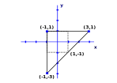
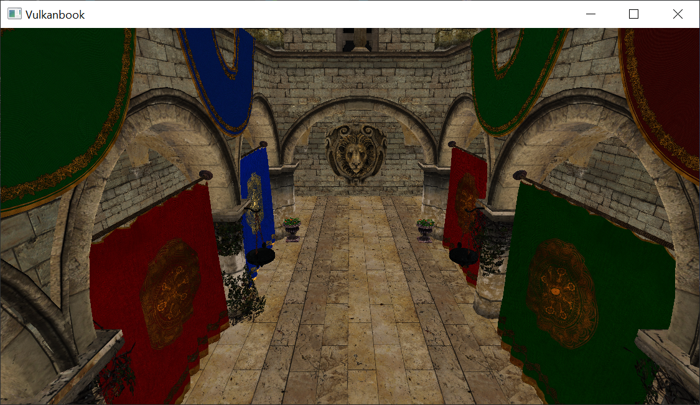

# Deferred shading (I)

In this chapter we will setup the basis to implement deferred shading. We will split the rendering into two phases, one to render the geometry and relevant parameters of the scene and another one to apply lighting. In this chapter we will only setup the basis, leaving the changes required to apply lighting for the next chapter. We will not be introducing new Vulkan concepts, just combine the ones we have described previously to support deferred shading. Therefore, you will see larger chunks of code with an explanatory overview, focusing on the key concepts of Vulkan that need to be applied to implement deferred shading.

You can find the complete source code for this chapter [here](../../booksamples/chapter-10).

## Deferred shading

Up to now the way that we are rendering a 3D scene is called forward rendering. Deferred rendering is frequently used when having multiple lights and usually consists of two phases. In the first phase data that is required for shading computation is generated (depth values, albedo colors, material properties, etc.). In the second phase, taking all that information as inputs lighting is applied to each fragment. 

Hence, with deferred shading we perform two rendering phases. The first one, is the geometry pass, where we render the scene to several attachments that will contain the following information:

- The diffuse colors for each position. We call this the albedo.
- The normals at each position.
- Depth values.
- Other materials information,
  
All that information is stored in attachments, as the depth attachment used in previous chapters.

The second pass is called the lighting phase. This phase takes a shape that fills up all the screen and generates the final color information, using lighting,  for each fragment using as inputs the attachment outputs generated in the previous phase. When are will performing the lighting pass, the depth test in the geometry phase will have already removed all the scene data that is not be seen. Hence, the number of operations to be done are restricted to what will be displayed on the screen.

## Attachments

We will start by encapsulating the attachments that we will use as outputs in the geometry pass and as inputs in the lighting pass. We will do this in a new class named `GeometryAttachments` which is defined like this:

```java
package org.vulkanb.eng.graph.geometry;

import org.vulkanb.eng.graph.vk.*;

import java.util.Arrays;

import static org.lwjgl.vulkan.VK11.*;

public class GeometryAttachments {

    public static final int NUMBER_ATTACHMENTS = 2;
    public static final int NUMBER_COLOR_ATTACHMENTS = NUMBER_ATTACHMENTS - 1;
    private Attachment[] attachments;
    private int depthAttachmentPos;
    private int height;
    private int width;

    public GeometryAttachments(Device device, int width, int height) {
        this.width = width;
        this.height = height;
        attachments = new Attachment[NUMBER_ATTACHMENTS];

        int i = 0;
        // Albedo attachment
        Attachment attachment = new Attachment(device, width, height,
                VK_FORMAT_R16G16B16A16_SFLOAT, VK_IMAGE_USAGE_COLOR_ATTACHMENT_BIT);
        attachments[i] = attachment;
        i++;

        // Depth attachment
        attachment = new Attachment(device, width, height,
                VK_FORMAT_D32_SFLOAT, VK_IMAGE_USAGE_DEPTH_STENCIL_ATTACHMENT_BIT);
        attachments[i] = attachment;
        depthAttachmentPos = i;
    }

    public void cleanup() {
        Arrays.stream(attachments).forEach(Attachment::cleanup);
    }

    public Attachment[] getAttachments() {
        return attachments;
    }

    public Attachment getDepthAttachment() {
        return attachments[depthAttachmentPos];
    }

    public int getHeight() {
        return height;
    }

    public int getWidth() {
        return width;
    }
}
```

As you can see, we initialize an array of `Attachment` instances which is composed by the following elements:

- The first attachment will store the albedo of the scene. We will store that information using an image of `VK_FORMAT_R16G16B16A16_SFLOAT` format (16 bits per each RGBA channel). We state that this a color attachment by using the `VK_IMAGE_USAGE_COLOR_ATTACHMENT_BIT` flag.
- The second and last attachment (by now) just stores the depth information, and uses the same formats as the depth attachment used in previous chapters.

The class provides methods to access the attachments, to get the size of them, to free the resources and  to get the reference to the depth attachment.

## Geometry render pass

The next step is to define the render pass used to render the geometry. We will create a new class named `GeometryRenderPass` for that. The class starts like this:

```java
public class GeometryRenderPass {

    private static final int MAX_SAMPLES = 1;
    private Device device;
    private long vkRenderPass;

    public GeometryRenderPass(Device device, Attachment[] attachments) {
        this.device = device;
        try (MemoryStack stack = MemoryStack.stackPush()) {
            int numAttachments = attachments.length;
            VkAttachmentDescription.Buffer attachmentsDesc = VkAttachmentDescription.callocStack(numAttachments, stack);
            int depthAttachmentPos = 0;
            for (int i = 0; i < numAttachments; i++) {
                attachmentsDesc.get(i)
                        .format(attachments[i].getImage().getFormat())
                        .loadOp(VK_ATTACHMENT_LOAD_OP_CLEAR)
                        .storeOp(VK_ATTACHMENT_STORE_OP_STORE)
                        .stencilLoadOp(VK_ATTACHMENT_LOAD_OP_DONT_CARE)
                        .stencilStoreOp(VK_ATTACHMENT_STORE_OP_DONT_CARE)
                        .samples(MAX_SAMPLES)
                        .initialLayout(VK_IMAGE_LAYOUT_UNDEFINED);
                if (attachments[i].isDepthAttachment()) {
                    depthAttachmentPos = i;
                    attachmentsDesc.get(i).finalLayout(VK_IMAGE_LAYOUT_DEPTH_STENCIL_READ_ONLY_OPTIMAL);
                } else {
                    attachmentsDesc.get(i).finalLayout(VK_IMAGE_LAYOUT_SHADER_READ_ONLY_OPTIMAL);
                }
            }
            ...
        }
    }
    ...
}
```

We need to create a `VkAttachmentDescription` structure to describe each of the output attachments. The format used will be the same format as the one of the underlying image. We want each attachment to be cleared at the beginning of the subpass, so we use the `VK_ATTACHMENT_LOAD_OP_CLEAR` for the `loadOp` attribute. The contents of the attachments will be used in the lighting render pass, therefore, we need those contents to be preserved at the end of the subpass. This is why we use the `VK_ATTACHMENT_STORE_OP_STORE` value for the `storeOp` attribute. Since we don't care about the stencil components so we use the `VK_ATTACHMENT_LOAD_OP_DONT_CARE` flag. When this render pass finishes, the attachments will be used as read only inputs in the lighting render pass. This is why we set the `VK_IMAGE_LAYOUT_DEPTH_STENCIL_READ_ONLY_OPTIMAL` for color attachments and `VK_IMAGE_LAYOUT_SHADER_READ_ONLY_OPTIMAL` for the depth attachment as the final layout to transition into when the render pass finishes.

The next step is to define the color and depth references that will be used in the render subpasses. In our case, we will be using just one subpass. As explained in previous chapters, we should provide the reference to the attachments that will be used with the layout used during that subpass:

```java
public class GeometryRenderPass {
    ...
    public GeometryRenderPass(Device device, Attachment[] attachments) {
        this.device = device;
        try (MemoryStack stack = MemoryStack.stackPush()) {
            ...
            VkAttachmentReference.Buffer colorReferences = VkAttachmentReference.callocStack(GeometryAttachments.NUMBER_COLOR_ATTACHMENTS,
                    stack);
            for (int i = 0; i < GeometryAttachments.NUMBER_COLOR_ATTACHMENTS; i++) {
                colorReferences.get(i)
                        .attachment(i)
                        .layout(VK_IMAGE_LAYOUT_COLOR_ATTACHMENT_OPTIMAL);
            }

            VkAttachmentReference depthReference = VkAttachmentReference.callocStack(stack)
                    .attachment(depthAttachmentPos)
                    .layout(VK_IMAGE_LAYOUT_DEPTH_STENCIL_ATTACHMENT_OPTIMAL);

            // Render subpass
            VkSubpassDescription.Buffer subpass = VkSubpassDescription.callocStack(1, stack)
                    .pipelineBindPoint(VK_PIPELINE_BIND_POINT_GRAPHICS)
                    .pColorAttachments(colorReferences)
                    .colorAttachmentCount(colorReferences.capacity())
                    .pDepthStencilAttachment(depthReference);
            ...
        }
    }
    ...
}
```

During the subpass, the color attachments will be in the `VK_IMAGE_LAYOUT_COLOR_ATTACHMENT_OPTIMAL` layout while the depth attachment will be in the `VK_IMAGE_LAYOUT_DEPTH_STENCIL_ATTACHMENT_OPTIMAL` layout. With that information we can describe the subpass by filling up a `VkSubpassDescription` structure.

Now we need to define the subpass dependencies. Prior to describing them, we will clarify some concepts. We will not be creating separate sets of attachments per swap chain image. This would consume too much memory in our GPU. Therefore, we need to prevent the output attachments to be written concurrently per different render loops. While we are using the attachments in the lighting render phase, we do not want them to be modified by the next loop in the geometry render phase. Let's review how the dependencies are defined:

```java
public class GeometryRenderPass {
    ...
    public GeometryRenderPass(Device device, Attachment[] attachments) {
        this.device = device;
        try (MemoryStack stack = MemoryStack.stackPush()) {
            ...
            // Subpass dependencies
            VkSubpassDependency.Buffer subpassDependencies = VkSubpassDependency.callocStack(2, stack);
            subpassDependencies.get(0)
                    .srcSubpass(VK_SUBPASS_EXTERNAL)
                    .dstSubpass(0)
                    .srcStageMask(VK_PIPELINE_STAGE_BOTTOM_OF_PIPE_BIT)
                    .dstStageMask(VK_PIPELINE_STAGE_COLOR_ATTACHMENT_OUTPUT_BIT)
                    .srcAccessMask(VK_ACCESS_MEMORY_READ_BIT)
                    .dstAccessMask(VK_ACCESS_COLOR_ATTACHMENT_READ_BIT | VK_ACCESS_COLOR_ATTACHMENT_WRITE_BIT)
                    .dependencyFlags(VK_DEPENDENCY_BY_REGION_BIT);

            subpassDependencies.get(1)
                    .srcSubpass(0)
                    .dstSubpass(VK_SUBPASS_EXTERNAL)
                    .srcStageMask(VK_PIPELINE_STAGE_COLOR_ATTACHMENT_OUTPUT_BIT)
                    .dstStageMask(VK_PIPELINE_STAGE_BOTTOM_OF_PIPE_BIT)
                    .srcAccessMask(VK_ACCESS_COLOR_ATTACHMENT_READ_BIT | VK_ACCESS_COLOR_ATTACHMENT_WRITE_BIT)
                    .dstAccessMask(VK_ACCESS_MEMORY_READ_BIT)
                    .dependencyFlags(VK_DEPENDENCY_BY_REGION_BIT);
            ...
        }
    }
    ...
}
```

The first dependency, defines an external dependency for the subpass at position `0` (the only subpass that we have). It states that any in-flight command shall reach the `VK_PIPELINE_STAGE_BOTTOM_OF_PIPE_BIT` stage. That is, shall complete its journey through the pipeline when performing read memory accesses (`VK_ACCESS_MEMORY_READ_BIT`). This will block any command reaching the `VK_PIPELINE_STAGE_COLOR_ATTACHMENT_OUTPUT_BIT` pipeline stage for read and write access. This dependency, prevents the geometry rendering phase to write to the output attachments if there are previous commands in-flight, that is, if the lighting render phase commands are still in use.

The second dependency, its used to control the layout transition of the attachments to `VK_IMAGE_LAYOUT_COLOR_ATTACHMENT_OPTIMAL` and `VK_IMAGE_LAYOUT_DEPTH_STENCIL_READ_ONLY_OPTIMAL`. These layout transitions must not happen until the in-flight commands have completed the `VK_PIPELINE_STAGE_COLOR_ATTACHMENT_OUTPUT_BIT` stage. Note that we are note preventing the lighting phase to start before the geometry phase has finished with this configuration. We will do this later on.

With that information we can create the render pass:

```java
public class GeometryRenderPass {
    ...
    public GeometryRenderPass(Device device, Attachment[] attachments) {
        this.device = device;
        try (MemoryStack stack = MemoryStack.stackPush()) {
            ...
            // Render pass
            VkRenderPassCreateInfo renderPassInfo = VkRenderPassCreateInfo.callocStack(stack)
                    .sType(VK_STRUCTURE_TYPE_RENDER_PASS_CREATE_INFO)
                    .pAttachments(attachmentsDesc)
                    .pSubpasses(subpass)
                    .pDependencies(subpassDependencies);

            LongBuffer lp = stack.mallocLong(1);
            vkCheck(vkCreateRenderPass(device.getVkDevice(), renderPassInfo, null, lp),
                    "Failed to create render pass");
            vkRenderPass = lp.get(0);
        }
    }            

    public void cleanup() {
        vkDestroyRenderPass(device.getVkDevice(), vkRenderPass, null);
    }

    public long getVkRenderPass() {
        return vkRenderPass;
    }
}
```

We now have all the components required for defining the frame buffer used in the geometry render phase. We will do this inside a new class named `GeometryFrameBuffer`, which is defined like this:

```java
package org.vulkanb.eng.graph.geometry;

import org.apache.logging.log4j.*;
import org.lwjgl.system.MemoryStack;
import org.lwjgl.vulkan.VkExtent2D;
import org.vulkanb.eng.graph.vk.*;

import java.nio.LongBuffer;

public class GeometryFrameBuffer {

    private static final Logger LOGGER = LogManager.getLogger();

    private FrameBuffer frameBuffer;
    private GeometryAttachments geometryAttachments;
    private GeometryRenderPass geometryRenderPass;

    public GeometryFrameBuffer(SwapChain swapChain) {
        LOGGER.debug("Creating GeometryFrameBuffer");
        createAttachments(swapChain);
        geometryRenderPass = new GeometryRenderPass(swapChain.getDevice(), geometryAttachments.getAttachments());
        createFrameBuffer(swapChain);
    }

    public void cleanup() {
        LOGGER.debug("Destroying Geometry FrameBuffer");
        geometryRenderPass.cleanup();
        geometryAttachments.cleanup();
        frameBuffer.cleanup();
    }

    private void createAttachments(SwapChain swapChain) {
        VkExtent2D extent2D = swapChain.getSwapChainExtent();
        int width = extent2D.width();
        int height = extent2D.height();
        geometryAttachments = new GeometryAttachments(swapChain.getDevice(), width, height);
    }

    private void createFrameBuffer(SwapChain swapChain) {
        try (MemoryStack stack = MemoryStack.stackPush()) {
            Attachment[] attachments = geometryAttachments.getAttachments();
            int numAttachments = attachments.length;
            LongBuffer attachmentsBuff = stack.mallocLong(numAttachments);
            for (int i = 0; i < numAttachments; i++) {
                attachmentsBuff.put(i, attachments[i].getImageView().getVkImageView());
            }

            frameBuffer = new FrameBuffer(swapChain.getDevice(), geometryAttachments.getWidth(), geometryAttachments.getHeight(),
                    attachmentsBuff, geometryRenderPass.getVkRenderPass());
        }
    }

    public GeometryAttachments geometryAttachments() {
        return geometryAttachments;
    }

    public FrameBuffer getFrameBuffer() {
        return frameBuffer;
    }

    public GeometryRenderPass getRenderPass() {
        return geometryRenderPass;
    }

    public void resize(SwapChain swapChain) {
        frameBuffer.cleanup();
        geometryAttachments.cleanup();
        createAttachments(swapChain);
        createFrameBuffer(swapChain);
    }
}
```

This class creates in its constructor (by calling the `createAttachments` method) the output attachments, the render pass and the frame buffer itself (by calling the `createFrameBuffer` method). The reference to the `SwapChain`, received in the constructor is used to get the size of the rendering area. Remember that there are no separate sets per swap chain image. It also provides a method to support resizing (`resize`), which recreates the attachments and the frame buffer. There is no need to recreate the render pass since the format and the number of attachments will not change.

We will create a new class responsible of rendering the first render pass (geometry phase) named `GeometryRenderActivity` which starts like this:

```java
public class GeometryRenderActivity {

    private static final String GEOMETRY_FRAGMENT_SHADER_FILE_GLSL = "resources/shaders/geometry_fragment.glsl";
    private static final String GEOMETRY_FRAGMENT_SHADER_FILE_SPV = GEOMETRY_FRAGMENT_SHADER_FILE_GLSL + ".spv";
    private static final String GEOMETRY_VERTEX_SHADER_FILE_GLSL = "resources/shaders/geometry_vertex.glsl";
    private static final String GEOMETRY_VERTEX_SHADER_FILE_SPV = GEOMETRY_VERTEX_SHADER_FILE_GLSL + ".spv";
    ...
    public GeometryRenderActivity(SwapChain swapChain, CommandPool commandPool, PipelineCache pipelineCache, Scene scene) {
        this.swapChain = swapChain;
        this.pipelineCache = pipelineCache;
        device = swapChain.getDevice();
        geometryFrameBuffer = new GeometryFrameBuffer(swapChain);
        int numImages = swapChain.getNumImages();
        createShaders();
        createDescriptorPool();
        createDescriptorSets(numImages);
        createPipeline();
        createCommandBuffers(commandPool, numImages);
        VulkanUtils.copyMatrixToBuffer(device, projMatrixUniform, scene.getPerspective().getPerspectiveMatrix());
    }

    public void cleanup() {
        pipeLine.cleanup();
        materialsBuffer.cleanup();
        Arrays.stream(viewMatricesBuffer).forEach(VulkanBuffer::cleanup);
        projMatrixUniform.cleanup();
        textureSampler.cleanup();
        materialDescriptorSetLayout.cleanup();
        textureDescriptorSetLayout.cleanup();
        matrixDescriptorSetLayout.cleanup();
        descriptorPool.cleanup();
        shaderProgram.cleanup();
        geometryFrameBuffer.cleanup();
        Arrays.stream(commandBuffers).forEach(CommandBuffer::cleanup);
        Arrays.stream(fences).forEach(Fence::cleanup);
    }
    ...
    public Attachment[] getAttachments() {
        return geometryFrameBuffer.geometryAttachments().getAttachments();
    }
    ...
}
```

We will be using a new pair of shaders (which we will see later on), and create them in the constructor. The constructor also instantiates the `GeometryFrameBuffer` which contains the attachments and the render pass,  along with the descriptor pool, the descriptor sets, the pipeline, the command buffers and update the projection matrix uniform buffer in the constructor. The class also provides a `cleanup` method to free the allocated resources when they are no longer needed.

The `createShaders` method just checks if the shaders need to be recompiled an loads them:

```java
public class GeometryRenderActivity {
    ...
    private void createShaders() {
        EngineProperties engineProperties = EngineProperties.getInstance();
        if (engineProperties.isShaderRecompilation()) {
            ShaderCompiler.compileShaderIfChanged(GEOMETRY_VERTEX_SHADER_FILE_GLSL, Shaderc.shaderc_glsl_vertex_shader);
            ShaderCompiler.compileShaderIfChanged(GEOMETRY_FRAGMENT_SHADER_FILE_GLSL, Shaderc.shaderc_glsl_fragment_shader);
        }
        shaderProgram = new ShaderProgram(device, new ShaderProgram.ShaderModuleData[]
                {
                        new ShaderProgram.ShaderModuleData(VK_SHADER_STAGE_VERTEX_BIT, GEOMETRY_VERTEX_SHADER_FILE_SPV),
                        new ShaderProgram.ShaderModuleData(VK_SHADER_STAGE_FRAGMENT_BIT, GEOMETRY_FRAGMENT_SHADER_FILE_SPV),
                });
    }
    ...
}
```

The `createDescriptorPool` method just creates the descriptor pool. We will need:

- Uniform buffers (`VK_DESCRIPTOR_TYPE_UNIFORM_BUFFER`): one for the perspective matrix and one per swap chain image for the view matrix.

- Texture samples (`VK_DESCRIPTOR_TYPE_COMBINED_IMAGE_SAMPLER`): one for the textures of each of the potential materials.

- Dynamic uniform buffers (`VK_DESCRIPTOR_TYPE_UNIFORM_BUFFER_DYNAMIC`): One dynamic buffer will hold all the materials data.
  
  Therefore the `createDescriptorPool` method is defined like this:

```java
  public class GeometryRenderActivity {
    ...
    private void createDescriptorPool() {
        EngineProperties engineProps = EngineProperties.getInstance();
        List<DescriptorPool.DescriptorTypeCount> descriptorTypeCounts = new ArrayList<>();
        descriptorTypeCounts.add(new DescriptorPool.DescriptorTypeCount(swapChain.getNumImages() + 1, VK_DESCRIPTOR_TYPE_UNIFORM_BUFFER));
        descriptorTypeCounts.add(new DescriptorPool.DescriptorTypeCount(engineProps.getMaxMaterials(), VK_DESCRIPTOR_TYPE_COMBINED_IMAGE_SAMPLER));
        descriptorTypeCounts.add(new DescriptorPool.DescriptorTypeCount(1, VK_DESCRIPTOR_TYPE_UNIFORM_BUFFER_DYNAMIC));
        descriptorPool = new DescriptorPool(device, descriptorTypeCounts);
    }
    ...
  }
```

The `createDescriptorSets` method is defined like this:

```java
public class GeometryRenderActivity {
    ...
    private void createDescriptorSets(int numImages) {
        matrixDescriptorSetLayout = new MatrixDescriptorSetLayout(device, 0, VK_SHADER_STAGE_VERTEX_BIT);
        textureDescriptorSetLayout = new TextureDescriptorSetLayout(device, 0);
        materialDescriptorSetLayout = new MaterialDescriptorSetLayout(device, 0);
        geometryDescriptorSetLayouts = new DescriptorSetLayout[]{
                matrixDescriptorSetLayout,
                matrixDescriptorSetLayout,
                textureDescriptorSetLayout,
                materialDescriptorSetLayout,
        };

        EngineProperties engineProps = EngineProperties.getInstance();
        descriptorSetMap = new HashMap<>();
        textureSampler = new TextureSampler(device, 1);
        projMatrixUniform = new VulkanBuffer(device, GraphConstants.MAT4X4_SIZE, VK_BUFFER_USAGE_UNIFORM_BUFFER_BIT,
                VK_MEMORY_PROPERTY_HOST_VISIBLE_BIT);
        projMatrixDescriptorSet = new MatrixDescriptorSet(descriptorPool, matrixDescriptorSetLayout, projMatrixUniform, 0);

        viewMatricesDescriptorSets = new MatrixDescriptorSet[numImages];
        viewMatricesBuffer = new VulkanBuffer[numImages];
        materialsBuffer = new VulkanBuffer(device, (long) materialDescriptorSetLayout.getMaterialSize() * engineProps.getMaxMaterials(), VK_BUFFER_USAGE_UNIFORM_BUFFER_BIT,
                VK_MEMORY_PROPERTY_HOST_VISIBLE_BIT);
        materialsDescriptorSet = new MaterialDescriptorSet(descriptorPool, materialDescriptorSetLayout,
                materialsBuffer, 0);
        for (int i = 0; i < numImages; i++) {
            viewMatricesBuffer[i] = new VulkanBuffer(device, GraphConstants.MAT4X4_SIZE, VK_BUFFER_USAGE_UNIFORM_BUFFER_BIT,
                    VK_MEMORY_PROPERTY_HOST_VISIBLE_BIT);
            viewMatricesDescriptorSets[i] = new MatrixDescriptorSet(descriptorPool, matrixDescriptorSetLayout,
                    viewMatricesBuffer[i], 0);
        }
    }
    ...
}
```

This method is similar to the one used in previous chapters. We start by creating the descriptor layouts, instantiating the usual ones for matrix buffers, texture samplers and materials uniform. Then we create the different descriptor sets needed.

The `createPipeline` is quite similar to the code used previously. It is defined like this:

```java
public class GeometryRenderActivity {
    ...
    private void createPipeline() {
        Pipeline.PipeLineCreationInfo pipeLineCreationInfo = new Pipeline.PipeLineCreationInfo(
                geometryFrameBuffer.getRenderPass().getVkRenderPass(), shaderProgram, GeometryAttachments.NUMBER_COLOR_ATTACHMENTS,
                true, true, GraphConstants.MAT4X4_SIZE,
                new VertexBufferStructure(), geometryDescriptorSetLayouts);
        pipeLine = new Pipeline(pipelineCache, pipeLineCreationInfo);
        pipeLineCreationInfo.cleanup();
    }
    ...
}
```

To finish with the methods called in the constructor, the `createCommandBuffers` is also similar to the code in the previous chapters, we just instantiate one command buffer and their associated fences per swap chain image:

```java
public class GeometryRenderActivity {
    ...
    private void createCommandBuffers(CommandPool commandPool, int numImages) {
        commandBuffers = new CommandBuffer[numImages];
        fences = new Fence[numImages];

        for (int i = 0; i < numImages; i++) {
            commandBuffers[i] = new CommandBuffer(commandPool, true, false);
            fences[i] = new Fence(device, true);
        }
    }
    ...
}
```

This class also will be notified when meshes are loaded and unloaded. As you can see, the `GeometryRenderActivity` is quiet similar to the `ForwardRenderActivity` class in previous chapter

```java
public class GeometryRenderActivity {
    ...
    public void meshUnLoaded(VulkanMesh vulkanMesh) {
        TextureDescriptorSet textureDescriptorSet = descriptorSetMap.remove(vulkanMesh.getTexture().getFileName());
        if (textureDescriptorSet != null) {
            descriptorPool.freeDescriptorSet(textureDescriptorSet.getVkDescriptorSet());
        }
    }

    public void meshesLoaded(VulkanMesh[] meshes) {
        device.waitIdle();
        int meshCount = 0;
        for (VulkanMesh vulkanMesh : meshes) {
            int materialOffset = meshCount * materialDescriptorSetLayout.getMaterialSize();
            updateTextureDescriptorSet(vulkanMesh.getTexture());
            updateMaterial(device, materialsBuffer, vulkanMesh.getMaterial(), materialOffset);
            meshCount++;
        }
    }
    ...
    private void updateMaterial(Device device, VulkanBuffer vulkanBuffer, Material material, int offset) {
        try (MemoryStack stack = MemoryStack.stackPush()) {
            PointerBuffer pointerBuffer = stack.mallocPointer(1);
            vkCheck(vkMapMemory(device.getVkDevice(), vulkanBuffer.getMemory(), offset,
                    materialDescriptorSetLayout.getMaterialSize(), 0, pointerBuffer), "Failed to map UBO memory");
            long data = pointerBuffer.get(0);
            ByteBuffer materialBuffer = MemoryUtil.memByteBuffer(data, (int) vulkanBuffer.getAllocationSize());
            material.getDiffuseColor().get(0, materialBuffer);
            vkUnmapMemory(device.getVkDevice(), vulkanBuffer.getMemory());
        }
    }
    ...
    private void updateTextureDescriptorSet(Texture texture) {
        String textureFileName = texture.getFileName();
        TextureDescriptorSet textureDescriptorSet = descriptorSetMap.get(textureFileName);
        if (textureDescriptorSet == null) {
            textureDescriptorSet = new TextureDescriptorSet(descriptorPool, textureDescriptorSetLayout,
                    texture, textureSampler, 0);
            descriptorSetMap.put(textureFileName, textureDescriptorSet);
        }
    }
}
```

The `updateMaterial` method is used to update material descriptor sets when new meshes are loaded. The `updateTextureDescriptorSet` method is used to associate the texture descriptor set with a concrete texture sampler.

The `GeometryRenderActivity` also provides a method to record the command buffers which will be invoked in the render loop. This is the definition of that method:

```java
public class GeometryRenderActivity {
    ...
    public void recordCommandBuffers(List<VulkanMesh> meshes, Scene scene) {
        try (MemoryStack stack = MemoryStack.stackPush()) {
            VkExtent2D swapChainExtent = swapChain.getSwapChainExtent();
            int width = swapChainExtent.width();
            int height = swapChainExtent.height();
            int idx = swapChain.getCurrentFrame();

            FrameBuffer frameBuffer = geometryFrameBuffer.getFrameBuffer();
            Fence fence = fences[idx];
            CommandBuffer commandBuffer = commandBuffers[idx];

            fence.fenceWait();
            fence.reset();

            commandBuffer.reset();
            Attachment[] attachments = geometryFrameBuffer.geometryAttachments().getAttachments();
            int numAttachments = attachments.length;
            VkClearValue.Buffer clearValues = VkClearValue.callocStack(numAttachments, stack);
            for (int i = 0; i < numAttachments; i++) {
                if (attachments[i].isDepthAttachment()) {
                    clearValues.apply(i, v -> v.depthStencil().depth(1.0f));
                } else {
                    clearValues.apply(i, v -> v.color().float32(0, 0.0f).float32(1, 0.0f).float32(2, 0.0f).float32(3, 1));
                }
            }

            VkRenderPassBeginInfo renderPassBeginInfo = VkRenderPassBeginInfo.callocStack(stack)
                    .sType(VK_STRUCTURE_TYPE_RENDER_PASS_BEGIN_INFO)
                    .renderPass(geometryFrameBuffer.getRenderPass().getVkRenderPass())
                    .pClearValues(clearValues)
                    .renderArea(a -> a.extent().set(width, height))
                    .framebuffer(frameBuffer.getVkFrameBuffer());

            commandBuffer.beginRecording();
            VkCommandBuffer cmdHandle = commandBuffer.getVkCommandBuffer();
            vkCmdBeginRenderPass(cmdHandle, renderPassBeginInfo, VK_SUBPASS_CONTENTS_INLINE);

            vkCmdBindPipeline(cmdHandle, VK_PIPELINE_BIND_POINT_GRAPHICS, pipeLine.getVkPipeline());

            VkViewport.Buffer viewport = VkViewport.callocStack(1, stack)
                    .x(0)
                    .y(height)
                    .height(-height)
                    .width(width)
                    .minDepth(0.0f)
                    .maxDepth(1.0f);
            vkCmdSetViewport(cmdHandle, 0, viewport);

            VkRect2D.Buffer scissor = VkRect2D.callocStack(1, stack)
                    .extent(it -> it
                            .width(width)
                            .height(height))
                    .offset(it -> it
                            .x(0)
                            .y(0));
            vkCmdSetScissor(cmdHandle, 0, scissor);

            LongBuffer offsets = stack.mallocLong(1);
            offsets.put(0, 0L);
            LongBuffer vertexBuffer = stack.mallocLong(1);
            ByteBuffer pushConstantBuffer = stack.malloc(GraphConstants.MAT4X4_SIZE);
            LongBuffer descriptorSets = stack.mallocLong(4)
                    .put(0, projMatrixDescriptorSet.getVkDescriptorSet())
                    .put(1, viewMatricesDescriptorSets[idx].getVkDescriptorSet())
                    .put(3, materialsDescriptorSet.getVkDescriptorSet());
            VulkanUtils.copyMatrixToBuffer(device, viewMatricesBuffer[idx], scene.getCamera().getViewMatrix());
            IntBuffer dynDescrSetOffset = stack.callocInt(1);
            int meshCount = 0;
            for (VulkanMesh mesh : meshes) {
                int materialOffset = meshCount * materialDescriptorSetLayout.getMaterialSize();
                dynDescrSetOffset.put(0, materialOffset);
                vertexBuffer.put(0, mesh.getVerticesBuffer().getBuffer());
                vkCmdBindVertexBuffers(cmdHandle, 0, vertexBuffer, offsets);
                vkCmdBindIndexBuffer(cmdHandle, mesh.getIndicesBuffer().getBuffer(), 0, VK_INDEX_TYPE_UINT32);

                TextureDescriptorSet textureDescriptorSet = descriptorSetMap.get(mesh.getTexture().getFileName());
                List<Entity> entities = scene.getEntitiesByMeshId(mesh.getId());
                for (Entity entity : entities) {
                    descriptorSets.put(2, textureDescriptorSet.getVkDescriptorSet());
                    vkCmdBindDescriptorSets(cmdHandle, VK_PIPELINE_BIND_POINT_GRAPHICS,
                            pipeLine.getVkPipelineLayout(), 0, descriptorSets, dynDescrSetOffset);

                    setPushConstants(cmdHandle, entity.getModelMatrix(), pushConstantBuffer);
                    vkCmdDrawIndexed(cmdHandle, mesh.getIndicesCount(), 1, 0, 0, 0);
                }

                meshCount++;
            }

            vkCmdEndRenderPass(cmdHandle);
            commandBuffer.endRecording();
        }
    }
    ...
}
```

This method is almost identical than the one used in the `ForwardRenderActivity`. class in previous chapters. We have just changed a little bit the way we set the clear values to prepare it for the next chapters when we will have more than one color attachment. This class also provides a method to support window resizing, in this case, besides updating the perspective matrix, we just simply call the `resize` method in the `GeometryFrameBuffer` class which recreates the attachments and the frame buffer. This will ensure that the output attachments will match the screen size. The method to set the model matrix, thorough a push constant is also identical to the one used in the `ForwardRenderActivity` class.

```java
public class GeometryRenderActivity {
    ...
    public void resize(SwapChain swapChain, Scene scene) {
        VulkanUtils.copyMatrixToBuffer(device, projMatrixUniform, scene.getPerspective().getPerspectiveMatrix());
        this.swapChain = swapChain;
        geometryFrameBuffer.resize(swapChain);
    }

    private void setPushConstants(VkCommandBuffer cmdHandle, Matrix4f modelMatrix, ByteBuffer pushConstantBuffer) {
        modelMatrix.get(0, pushConstantBuffer);
        vkCmdPushConstants(cmdHandle, pipeLine.getVkPipelineLayout(),
                VK_SHADER_STAGE_VERTEX_BIT, 0, pushConstantBuffer);
    }
    ...
}
```

Finally, the `GeometryRenderActivity` also defines a method to submit the recorded commands which is defined like this:

```java
public class GeometryRenderActivity {
    ...
    public void submit(Queue queue) {
        try (MemoryStack stack = MemoryStack.stackPush()) {
            int idx = swapChain.getCurrentFrame();
            CommandBuffer commandBuffer = commandBuffers[idx];
            Fence currentFence = fences[idx];
            SwapChain.SyncSemaphores syncSemaphores = swapChain.getSyncSemaphoresList()[idx];
            queue.submit(stack.pointers(commandBuffer.getVkCommandBuffer()),
                    stack.longs(syncSemaphores.imgAcquisitionSemaphore().getVkSemaphore()),
                    stack.ints(VK_PIPELINE_STAGE_COLOR_ATTACHMENT_OUTPUT_BIT),
                    stack.longs(syncSemaphores.geometryCompleteSemaphore().getVkSemaphore()), currentFence);
        }
    }
    ...
}
```

There's a subtle, but important, change in this method with respect to the similar method used in the `ForwardRenderActivity` class. We are using a new semaphore to be signaled when the commands submitted finishes. Instead of signalling a semaphore that  blocks image presentation, we have introduced a new one. This semaphore will be used for waiting when submitting the commands for the lighting phase. This is what will prevent the lighting phase to start reading the attachments while they are still being generated. Since we have defined new semaphores, we have updated the synchronization semaphores hosted in the `SwapChain` class to add this new element:

```java
public class SwapChain {
    ...
    public record SyncSemaphores(Semaphore imgAcquisitionSemaphore, Semaphore geometryCompleteSemaphore,
                                 Semaphore renderCompleteSemaphore) {

        public SyncSemaphores(Device device) {
            this(new Semaphore(device), new Semaphore(device), new Semaphore(device));
        }

        public void cleanup() {
            imgAcquisitionSemaphore.cleanup();
            geometryCompleteSemaphore.cleanup();
            renderCompleteSemaphore.cleanup();
        }
    ...
}
```

The final step are thew new shaders for the geometry phase. The vertex shader (`geometry_vertex.glsl`). By now, it is exactly the same code than in t he previous chapter:

```glsl
#version 450

layout(location = 0) in vec3 entityPos;
layout(location = 1) in vec2 entityTextCoords;

layout(location = 0) out vec2 textCoords;

layout(set = 0, binding = 0) uniform ProjUniform {
    mat4 projectionMatrix;
} projUniform;
layout(set = 1, binding = 0) uniform ViewUniform {
    mat4 viewMatrix;
} viewUniform;

layout(push_constant) uniform matrices {
    mat4 modelMatrix;
} push_constants;

void main()
{
    gl_Position = projUniform.projectionMatrix * viewUniform.viewMatrix * push_constants.modelMatrix * vec4(entityPos, 1);
    textCoords = entityTextCoords;
}
```

The fragment shader is also identical (we have just changed the output attachment name by `outAlbedo`). If you think a little bit about it, it makes sense. From the geometry phase point of view, we have not changed anything. We have just changed the swap chain image output attachment by another image  that can be sampled later one, but we are rendering everything in the same way.

```glsl
#version 450

layout(location = 0) in vec2 textCoords;
layout(location = 0) out vec4 outAlbedo;

layout(set = 2, binding = 0) uniform sampler2D textSampler;

layout(set = 3, binding = 0) uniform MaterialUniform {
    vec4 diffuseColor;
} material;

void main()
{
    outAlbedo = material.diffuseColor + texture(textSampler, textCoords);
}
```

## Lighting render pass

We are ready now to develop the code needed to support the lighting phase. As a first step, we will create a new class named `LightingRenderPass` to manage the definition and creation of the render pass used in this phase. The class is defined like this:

```java
package org.vulkanb.eng.graph.lighting;

import org.lwjgl.system.MemoryStack;
import org.lwjgl.vulkan.*;
import org.vulkanb.eng.graph.vk.*;

import java.nio.LongBuffer;

import static org.lwjgl.vulkan.VK11.*;
import static org.vulkanb.eng.graph.vk.VulkanUtils.vkCheck;

public class LightingRenderPass {

    private Device device;
    private long vkRenderPass;

    public LightingRenderPass(SwapChain swapChain) {
        device = swapChain.getDevice();
        try (MemoryStack stack = MemoryStack.stackPush()) {
            VkAttachmentDescription.Buffer attachments = VkAttachmentDescription.callocStack(1, stack);

            // Color attachment
            attachments.get(0)
                    .format(swapChain.getSurfaceFormat().imageFormat())
                    .samples(VK_SAMPLE_COUNT_1_BIT)
                    .loadOp(VK_ATTACHMENT_LOAD_OP_CLEAR)
                    .storeOp(VK_ATTACHMENT_STORE_OP_STORE)
                    .stencilLoadOp(VK_ATTACHMENT_LOAD_OP_DONT_CARE)
                    .stencilStoreOp(VK_ATTACHMENT_STORE_OP_DONT_CARE)
                    .initialLayout(VK_IMAGE_LAYOUT_UNDEFINED)
                    .finalLayout(KHRSwapchain.VK_IMAGE_LAYOUT_PRESENT_SRC_KHR);

            VkAttachmentReference.Buffer colorReference = VkAttachmentReference.callocStack(1, stack)
                    .attachment(0)
                    .layout(VK_IMAGE_LAYOUT_COLOR_ATTACHMENT_OPTIMAL);

            VkSubpassDescription.Buffer subPass = VkSubpassDescription.calloc(1)
                    .pipelineBindPoint(VK_PIPELINE_BIND_POINT_GRAPHICS)
                    .colorAttachmentCount(colorReference.remaining())
                    .pColorAttachments(colorReference);

            VkSubpassDependency.Buffer subpassDependencies = VkSubpassDependency.callocStack(1, stack);
            subpassDependencies.get(0)
                    .srcSubpass(VK_SUBPASS_EXTERNAL)
                    .dstSubpass(0)
                    .srcStageMask(VK_PIPELINE_STAGE_COLOR_ATTACHMENT_OUTPUT_BIT)
                    .dstStageMask(VK_PIPELINE_STAGE_COLOR_ATTACHMENT_OUTPUT_BIT)
                    .srcAccessMask(0)
                    .dstAccessMask(VK_ACCESS_COLOR_ATTACHMENT_WRITE_BIT);

            VkRenderPassCreateInfo renderPassInfo = VkRenderPassCreateInfo.calloc()
                    .sType(VK_STRUCTURE_TYPE_RENDER_PASS_CREATE_INFO)
                    .pAttachments(attachments)
                    .pSubpasses(subPass)
                    .pDependencies(subpassDependencies);

            LongBuffer lp = stack.mallocLong(1);
            vkCheck(vkCreateRenderPass(device.getVkDevice(), renderPassInfo, null, lp),
                    "Failed to create render pass");
            vkRenderPass = lp.get(0);
        }
    }

    public void cleanup() {
        vkDestroyRenderPass(device.getVkDevice(), vkRenderPass, null);
    }

    public long getVkRenderPass() {
        return vkRenderPass;
    }
}
```

In this case, we use a single output attachment, a color attachment, which will be backed by a swap chain image. In this case, unlike previous chapters, we are not using an output attachment for depth values, we do not need it as we will see later on. We are still setting the same dependencies as in the render pass used for forward rendering (`SwapChainRenderPass`) to properly control the layout transition.

The next step is to define a class to manage the frame buffer used in this lighting phase:

```java
package org.vulkanb.eng.graph.lighting;

import org.apache.logging.log4j.*;
import org.lwjgl.system.MemoryStack;
import org.lwjgl.vulkan.VkExtent2D;
import org.vulkanb.eng.graph.vk.*;

import java.nio.LongBuffer;
import java.util.Arrays;

public class LightingFrameBuffer {
    private static final Logger LOGGER = LogManager.getLogger();
    private FrameBuffer[] frameBuffers;
    private LightingRenderPass lightingRenderPass;

    public LightingFrameBuffer(SwapChain swapChain) {
        LOGGER.debug("Creating Lighting FrameBuffer");
        lightingRenderPass = new LightingRenderPass(swapChain);
        createFrameBuffers(swapChain);
    }

    public void cleanup() {
        LOGGER.debug("Destroying Lighting FrameBuffer");
        Arrays.stream(frameBuffers).forEach(FrameBuffer::cleanup);
        lightingRenderPass.cleanup();
    }

    private void createFrameBuffers(SwapChain swapChain) {
        try (MemoryStack stack = MemoryStack.stackPush()) {
            VkExtent2D extent2D = swapChain.getSwapChainExtent();
            int width = extent2D.width();
            int height = extent2D.height();

            int numImages = swapChain.getNumImages();
            frameBuffers = new FrameBuffer[numImages];
            LongBuffer attachmentsBuff = stack.mallocLong(1);
            for (int i = 0; i < numImages; i++) {
                attachmentsBuff.put(0, swapChain.getImageViews()[i].getVkImageView());
                frameBuffers[i] = new FrameBuffer(swapChain.getDevice(), width, height,
                        attachmentsBuff, lightingRenderPass.getVkRenderPass());
            }
        }
    }

    public FrameBuffer[] getFrameBuffers() {
        return frameBuffers;
    }

    public LightingRenderPass getLightingRenderPass() {
        return lightingRenderPass;
    }

    public void resize(SwapChain swapChain) {
        Arrays.stream(frameBuffers).forEach(FrameBuffer::cleanup);
        createFrameBuffers(swapChain);
    }
}
```

We just link the render pass and each of the swap chain images to create a frame buffer for each of them. Nothing new here.

The rendering tasks of the lighting phase will be done in a new class named `LightingRenderActivity` which starts like this:

```java
public class LightingRenderActivity {

    private static final String LIGHTING_FRAGMENT_SHADER_FILE_GLSL = "resources/shaders/lighting_fragment.glsl";
    private static final String LIGHTING_FRAGMENT_SHADER_FILE_SPV = LIGHTING_FRAGMENT_SHADER_FILE_GLSL + ".spv";
    private static final String LIGHTING_VERTEX_SHADER_FILE_GLSL = "resources/shaders/lighting_vertex.glsl";
    private static final String LIGHTING_VERTEX_SHADER_FILE_SPV = LIGHTING_VERTEX_SHADER_FILE_GLSL + ".spv";
    ...
    public LightingRenderActivity(SwapChain swapChain, CommandPool commandPool, PipelineCache pipelineCache,
                                  Attachment[] attachments) {
        this.swapChain = swapChain;
        device = swapChain.getDevice();
        this.pipelineCache = pipelineCache;

        lightingFrameBuffer = new LightingFrameBuffer(swapChain);
        int numImages = swapChain.getNumImages();
        createShaders();
        createDescriptorPool();
        createDescriptorSets(attachments);
        createPipeline();
        createCommandBuffers(commandPool, numImages);

        for (int i = 0; i < numImages; i++) {
            preRecordCommandBuffer(i);
        }
    }

    public void cleanup() {
        pipeLine.cleanup();
        materialsBuffer.cleanup();
        Arrays.stream(viewMatricesBuffer).forEach(VulkanBuffer::cleanup);
        projMatrixUniform.cleanup();
        textureSampler.cleanup();
        materialDescriptorSetLayout.cleanup();
        textureDescriptorSetLayout.cleanup();
        matrixDescriptorSetLayout.cleanup();
        descriptorPool.cleanup();
        shaderProgram.cleanup();
        geometryFrameBuffer.cleanup();
        Arrays.stream(commandBuffers).forEach(CommandBuffer::cleanup);
        Arrays.stream(fences).forEach(Fence::cleanup);
    }
    ...
}
```

The constructor is similar to the one used in `GeometryRenderActivity`, we create the lighting buffer and then proceed to initialize the shaders, the descriptor pool, the descriptor sets, the pipeline and the command buffers. At the end of the constructor, we prerecord the command buffers (we will see later on why we can do this in this phase). The class, as usual, provides a `cleanup` method to free the resources when finished.

The `createShaders` method, as in the `GeometryRenderActivity` class, just checks if the shaders need to be recompiled an loads them:

```java
public class LightingRenderActivity {
    ...
    private void createShaders() {
        EngineProperties engineProperties = EngineProperties.getInstance();
        if (engineProperties.isShaderRecompilation()) {
            ShaderCompiler.compileShaderIfChanged(LIGHTING_VERTEX_SHADER_FILE_GLSL, Shaderc.shaderc_glsl_vertex_shader);
            ShaderCompiler.compileShaderIfChanged(LIGHTING_FRAGMENT_SHADER_FILE_GLSL, Shaderc.shaderc_glsl_fragment_shader);
        }
        shaderProgram = new ShaderProgram(device, new ShaderProgram.ShaderModuleData[]
                {
                        new ShaderProgram.ShaderModuleData(VK_SHADER_STAGE_VERTEX_BIT, LIGHTING_VERTEX_SHADER_FILE_SPV),
                        new ShaderProgram.ShaderModuleData(VK_SHADER_STAGE_FRAGMENT_BIT, LIGHTING_FRAGMENT_SHADER_FILE_SPV),
                });
    }
    ...
}
```

In the `createDescriptorPool` method, we initialize the descriptor pool properly sized to the different types of descriptor sets:

```java
public class LightingRenderActivity {
    ...
    private void createDescriptorPool() {
        List<DescriptorPool.DescriptorTypeCount> descriptorTypeCounts = new ArrayList<>();
        descriptorTypeCounts.add(new DescriptorPool.DescriptorTypeCount(GeometryAttachments.NUMBER_ATTACHMENTS, VK_DESCRIPTOR_TYPE_COMBINED_IMAGE_SAMPLER));
        descriptorPool = new DescriptorPool(device, descriptorTypeCounts);
    }
    ...
}
```
We will need texture samplers to access the attachments filled up in the geometry phase, therefore we will need as many samplers as input attachments we have (Remember that the input attachments in this phase are the output attachments in the previous one).

The `createDescriptorSets` method just creates the descriptor set layout and the descriptor set that defines the samplers needed to access the attachments in the lighting phase:

```java
public class LightingRenderActivity {
    ...
    private void createDescriptorSets(Attachment[] attachments) {
        attachmentsLayout = new AttachmentsLayout(device, GeometryAttachments.NUMBER_ATTACHMENTS);
        descriptorSetLayouts = new DescriptorSetLayout[]{
                attachmentsLayout,
        };

        attachmentsDescriptorSet = new AttachmentsDescriptorSet(descriptorPool, attachmentsLayout,
                attachments, 0);
    }
    ...
}
```

We are using two new classes, `AttachmentsLayout` to manage the descriptor set layout for the attachments and `AttachmentsDescriptorSet` for management of the descriptor set itself. Let's start with the `AttachmentsLayout` class:

```java
package org.vulkanb.eng.graph.lighting;

import org.apache.logging.log4j.*;
import org.lwjgl.system.MemoryStack;
import org.lwjgl.vulkan.*;
import org.vulkanb.eng.graph.vk.*;

import java.nio.LongBuffer;

import static org.lwjgl.vulkan.VK11.*;
import static org.vulkanb.eng.graph.vk.VulkanUtils.vkCheck;

public class AttachmentsLayout extends DescriptorSetLayout {
    private static final Logger LOGGER = LogManager.getLogger();

    public AttachmentsLayout(Device device, int numAttachments) {
        super(device);

        LOGGER.debug("Creating Attachments Layout");
        try (MemoryStack stack = MemoryStack.stackPush()) {
            VkDescriptorSetLayoutBinding.Buffer layoutBindings = VkDescriptorSetLayoutBinding.callocStack(numAttachments, stack);
            for (int i = 0; i < numAttachments; i++) {
                layoutBindings.get(i)
                        .binding(i)
                        .descriptorType(VK_DESCRIPTOR_TYPE_COMBINED_IMAGE_SAMPLER)
                        .descriptorCount(1)
                        .stageFlags(VK_SHADER_STAGE_FRAGMENT_BIT);
            }
            VkDescriptorSetLayoutCreateInfo layoutInfo = VkDescriptorSetLayoutCreateInfo.callocStack(stack)
                    .sType(VK_STRUCTURE_TYPE_DESCRIPTOR_SET_LAYOUT_CREATE_INFO)
                    .pBindings(layoutBindings);

            LongBuffer lp = stack.mallocLong(1);
            vkCheck(vkCreateDescriptorSetLayout(device.getVkDevice(), layoutInfo, null, lp),
                    "Failed to create descriptor set layout");
            super.vkDescriptorLayout = lp.get(0);
        }
    }
}
```

We need to create as many `VkDescriptorSetLayoutBinding` structures as attachments we will have. By now, we just have the color and depth attachments. Their contents will be accessed by a texture sampler in the lighting fragment shader.

The `AttachmentsDescriptorSet` class is defined like this:

```java
package org.vulkanb.eng.graph.lighting;

import org.lwjgl.system.MemoryStack;
import org.lwjgl.vulkan.*;
import org.vulkanb.eng.graph.vk.*;

import java.nio.LongBuffer;

import static org.lwjgl.vulkan.VK11.*;
import static org.vulkanb.eng.graph.vk.VulkanUtils.vkCheck;

public class AttachmentsDescriptorSet extends DescriptorSet {

    private int binding;
    private Device device;
    private TextureSampler textureSampler;

    public AttachmentsDescriptorSet(DescriptorPool descriptorPool, AttachmentsLayout descriptorSetLayout,
                                    Attachment[] attachments, int binding) {
        try (MemoryStack stack = MemoryStack.stackPush()) {
            device = descriptorPool.getDevice();
            this.binding = binding;
            LongBuffer pDescriptorSetLayout = stack.mallocLong(1);
            pDescriptorSetLayout.put(0, descriptorSetLayout.getVkDescriptorLayout());
            VkDescriptorSetAllocateInfo allocInfo = VkDescriptorSetAllocateInfo.callocStack(stack)
                    .sType(VK_STRUCTURE_TYPE_DESCRIPTOR_SET_ALLOCATE_INFO)
                    .descriptorPool(descriptorPool.getVkDescriptorPool())
                    .pSetLayouts(pDescriptorSetLayout);

            LongBuffer pDescriptorSet = stack.mallocLong(1);
            vkCheck(vkAllocateDescriptorSets(device.getVkDevice(), allocInfo, pDescriptorSet),
                    "Failed to create descriptor set");

            vkDescriptorSet = pDescriptorSet.get(0);

            textureSampler = new TextureSampler(device, 1);

            update(attachments);
        }
    }

    public void cleanup() {
        textureSampler.cleanup();
    }

    @Override
    public long getVkDescriptorSet() {
        return vkDescriptorSet;
    }

    public void update(Attachment[] attachments) {
        try (MemoryStack stack = MemoryStack.stackPush()) {
            int numAttachments = attachments.length;
            VkWriteDescriptorSet.Buffer descrBuffer = VkWriteDescriptorSet.callocStack(numAttachments, stack);
            for (int i = 0; i < numAttachments; i++) {
                Attachment attachment = attachments[i];
                VkDescriptorImageInfo.Buffer imageInfo = VkDescriptorImageInfo.callocStack(1, stack)
                        .sampler(textureSampler.getVkSampler())
                        .imageView(attachment.getImageView().getVkImageView());
                if (attachment.isDepthAttachment()) {
                    imageInfo.imageLayout(VK_IMAGE_LAYOUT_DEPTH_STENCIL_READ_ONLY_OPTIMAL);
                } else {
                    imageInfo.imageLayout(VK_IMAGE_LAYOUT_SHADER_READ_ONLY_OPTIMAL);
                }

                descrBuffer.get(i)
                        .sType(VK_STRUCTURE_TYPE_WRITE_DESCRIPTOR_SET)
                        .dstSet(vkDescriptorSet)
                        .dstBinding(binding + i)
                        .descriptorType(VK_DESCRIPTOR_TYPE_COMBINED_IMAGE_SAMPLER)
                        .descriptorCount(1)
                        .pImageInfo(imageInfo);
            }

            vkUpdateDescriptorSets(device.getVkDevice(), descrBuffer, null);
        }
    }
}
```

Nothing new here, we are just creating a single descriptor composed by two images that will allow to access the attachments. We also create the sampler used to control how we are going to access the texture in this class for convenience (although this is not a descriptor set, it is handy to have it here). In the `update` method we link the descriptor set elements with each of the attachments and the texture sampler.

Going back to the `LightingRenderActivity` class, the `createPipeline` is almost identical than the one used in the `GeometryRenderActivity` class:

```java
public class LightingRenderActivity {
    ...
    private void createPipeline() {
        Pipeline.PipeLineCreationInfo pipeLineCreationInfo = new Pipeline.PipeLineCreationInfo(
                lightingFrameBuffer.getLightingRenderPass().getVkRenderPass(), shaderProgram, 1, false, false, 0,
                new EmptyVertexBufferStructure(), descriptorSetLayouts);
        pipeline = new Pipeline(pipelineCache, pipeLineCreationInfo);
        pipeLineCreationInfo.cleanup();
    }
    ...
}
```

The only differences, with the obvious exception that we are using different shaders, are that we are not using depth testing and have disabled blending. We are not using depth testing, because what we will do is render a shape that covers the whole screen and sample the input attachments for each of the fragments applying lighting to them. There is no need to depth test for that. We don't need also to enable blending since this has already been done in the geometry phase. However, we are still using the depth attachment as an input because we will use it in the next chapter, but not for depth testing. You may also have noticed that we are using a different class to describe the structure of the vertex buffer, an instance of the `EmptyVertexBufferStructure` class. Let's put this aside at this moment, we will explain it when we describe how we are going to render the shape that fills the whole screen later on.

The `createCommandBuffers` just creates one command buffer and fence per swap chain image, as in previous chapters:

```java
public class LightingRenderActivity {
    ...
    private void createCommandBuffers(CommandPool commandPool, int numImages) {
        commandBuffers = new CommandBuffer[numImages];
        fences = new Fence[numImages];

        for (int i = 0; i < numImages; i++) {
            commandBuffers[i] = new CommandBuffer(commandPool, true, false);
            fences[i] = new Fence(device, true);
        }
    }
    ...
}
```

How are we going to render in the lighting phase? We have mentioned it briefly before, we are going to draw a shape that fills the whole screen, for example a quad or two triangles whose coordinates math the vertices of the screen. Therefore, let's create a mesh for a quad with the proper coordinates and that's it, right? Not so fast, we can do it even better. We can achieve the same result drawing a single triangle with the following position coordinates (z coordinates have been omitted since they will be constant):



As you can see in the triangle covers the whole screen (represented as a dashed square in the range [-1, 1], [1, -1]. The texture coordinates for each of the vertices of that triangle will be (0, 0), (2, 0) and (0, 2), which will result in the quad that forms the screen to have the coordinates in the range [0, 0] and [1, 1] (Remember that upper left corner has coordinates (0,0) in texture space).


Let's view the `preRecordCommandBuffer` method:

```java
public class LightingRenderActivity {
    ...
    public void preRecordCommandBuffer(int idx) {
        try (MemoryStack stack = MemoryStack.stackPush()) {
            VkExtent2D swapChainExtent = swapChain.getSwapChainExtent();
            int width = swapChainExtent.width();
            int height = swapChainExtent.height();

            FrameBuffer frameBuffer = lightingFrameBuffer.getFrameBuffers()[idx];
            CommandBuffer commandBuffer = commandBuffers[idx];

            commandBuffer.reset();
            VkClearValue.Buffer clearValues = VkClearValue.callocStack(1, stack);
            clearValues.apply(0, v -> v.color().float32(0, 0.0f).float32(1, 0.0f).float32(2, 0.0f).float32(3, 1));

            VkRect2D renderArea = VkRect2D.callocStack(stack);
            renderArea.offset().set(0, 0);
            renderArea.extent().set(width, height);

            VkRenderPassBeginInfo renderPassBeginInfo = VkRenderPassBeginInfo.callocStack(stack)
                    .sType(VK_STRUCTURE_TYPE_RENDER_PASS_BEGIN_INFO)
                    .renderPass(lightingFrameBuffer.getLightingRenderPass().getVkRenderPass())
                    .pClearValues(clearValues)
                    .framebuffer(frameBuffer.getVkFrameBuffer())
                    .renderArea(renderArea);

            commandBuffer.beginRecording();
            VkCommandBuffer cmdHandle = commandBuffer.getVkCommandBuffer();
            vkCmdBeginRenderPass(cmdHandle, renderPassBeginInfo,
                    VK_SUBPASS_CONTENTS_INLINE);

            vkCmdBindPipeline(cmdHandle, VK_PIPELINE_BIND_POINT_GRAPHICS, pipeline.getVkPipeline());

            VkViewport.Buffer viewport = VkViewport.callocStack(1, stack)
                    .x(0)
                    .y(height)
                    .height(-height)
                    .width(width)
                    .minDepth(0.0f)
                    .maxDepth(1.0f);
            vkCmdSetViewport(cmdHandle, 0, viewport);

            VkRect2D.Buffer scissor = VkRect2D.callocStack(1, stack)
                    .extent(it -> it
                            .width(width)
                            .height(height))
                    .offset(it -> it
                            .x(0)
                            .y(0));
            vkCmdSetScissor(cmdHandle, 0, scissor);

            LongBuffer descriptorSets = stack.mallocLong(1)
                    .put(0, attachmentsDescriptorSet.getVkDescriptorSet());
            vkCmdBindDescriptorSets(cmdHandle, VK_PIPELINE_BIND_POINT_GRAPHICS,
                    pipeline.getVkPipelineLayout(), 0, descriptorSets, null);

            vkCmdDraw(cmdHandle, 3, 1, 0, 0);

            vkCmdEndRenderPass(cmdHandle);
            commandBuffer.endRecording();
        }
    }
    ...
}
```

We just reset the command buffer, clear the color output attachment (the swap chain image), begin the render pass, set up the viewport and the scissor size and bind the descriptor set which contains the input attachments. The main difference is how we are drawing. Instead of binding a vertex buffer and the associated indices and invoking the `vkCmdDrawIndexed` function, we call the `vkCmdDraw` function. This function is used to draw a non indexed draw call, we are basically saying that we want to draw three vertices, without passing any coordinates. After that, we finish the render pass and the recording. How are we going to handle the drawing of three vertices without coordinates will be explained later on in the lighting vertex shader. What you can clearly see now is that, in each render loop, we are just rendering a single triangle. We are rendering the same triangle again and again. This is the reason why we can prerecord the command buffers. We will just need to update some buffers for the uniforms (next chapter), but the rendering commands will always be the same.

If you recall, when creating the pipeline, we defined a new class for the vertex structure, `EmptyVertexBufferStructure`, which is defined like this:

```java
package org.vulkanb.eng.graph.lighting;

import org.lwjgl.vulkan.VkPipelineVertexInputStateCreateInfo;
import org.vulkanb.eng.graph.vk.VertexInputStateInfo;

import static org.lwjgl.vulkan.VK11.VK_STRUCTURE_TYPE_PIPELINE_VERTEX_INPUT_STATE_CREATE_INFO;

public class EmptyVertexBufferStructure extends VertexInputStateInfo {

    public EmptyVertexBufferStructure() {
        vi = VkPipelineVertexInputStateCreateInfo.calloc();
        vi.sType(VK_STRUCTURE_TYPE_PIPELINE_VERTEX_INPUT_STATE_CREATE_INFO)
                .pVertexBindingDescriptions(null)
                .pVertexAttributeDescriptions(null);
    }

    @Override
    public void cleanup() {
        vi.free();
    }
}
```

We are just defining what the name of the class suggests, an empty definition of the structure of the vertex buffer, because we are not going to pass anything while rendering.

Since we are prerecording the commands, the equivalent to the `recordCommandBuffers` has been transformed in a method that just blocks in the associated fences and renamed to to `prepareCommandBuffers`:

```java
public class LightingRenderActivity {
    ...
    public void prepareCommandBuffers() {
        int idx = swapChain.getCurrentFrame();
        Fence fence = fences[idx];

        fence.fenceWait();
        fence.reset();
    }
    ...
}
```

The `LightingRenderActivity` class also defines a resize method. This method invokes the `resize` method on the `LightingFrameBuffer` class because the output attachments, the swap chain images, have changed. It also need to prerecord the command buffers again because the viewport size has also changed.

```java
public class LightingRenderActivity {
    ...
    public void resize(SwapChain swapChain, Attachment[] attachments) {
        this.swapChain = swapChain;
        attachmentsDescriptorSet.update(attachments);
        lightingFrameBuffer.resize(swapChain);
        int numImages = swapChain.getNumImages();
        for (int i = 0; i < numImages; i++) {
            preRecordCommandBuffer(i);
        }
    }
    ...
}
```

To finalize with the `LightingRenderActivity` class, we need a method to submit the command buffers. In this case, we need to wait on the semaphore that will be signaled when the geometry phase finishes (`geometryCompleteSemaphore`) and signal the semaphore that will be used to block the presentation of the swap chain image (`renderCompleteSemaphore`).

```java
public class LightingRenderActivity {
    ...
    public void submit(Queue queue) {
        try (MemoryStack stack = MemoryStack.stackPush()) {
            int idx = swapChain.getCurrentFrame();
            CommandBuffer commandBuffer = commandBuffers[idx];
            Fence currentFence = fences[idx];
            SwapChain.SyncSemaphores syncSemaphores = swapChain.getSyncSemaphoresList()[idx];
            queue.submit(stack.pointers(commandBuffer.getVkCommandBuffer()),
                    stack.longs(syncSemaphores.geometryCompleteSemaphore().getVkSemaphore()),
                    stack.ints(VK_PIPELINE_STAGE_COLOR_ATTACHMENT_OUTPUT_BIT),
                    stack.longs(syncSemaphores.renderCompleteSemaphore().getVkSemaphore()),
                    currentFence);
        }
    }
    ...
}
```

It is the turn now to view the shaders used in the lighting phase, this is the vertex shader (`lighting_vertex.glsl`):

```glsl
#version 450

layout(location = 0) out vec2 outTextCoord;

void main()
{
    outTextCoord = vec2((gl_VertexIndex << 1) & 2, gl_VertexIndex & 2);
    gl_Position = vec4(outTextCoord.x * 2.0f - 1.0f, outTextCoord.y * -2.0f + 1.0f, 0.0f, 1.0f);
}
```

Here you can see how we are able to draw a triangle even if we are not passing the coordinates to the shader. We use the `gl_VertexIndex` builtin variable that will have the number of the vertex that we are drawing. In our case it will have the values `0`, `1` and `3`. You can check that for the first vertex, index `0`,  we will get `(-1, 1, 0, 1)` as the position coordinates and `(0, 0)` as the texture coordinates. For the second vertex we will get `(3, 1, 0, 1)` as the position coordinates and `(2, 0)` as the texture coordinates. For the third vertex we will get `(-1, -3, 0, 1)`  as the position coordinates and `(0, 2)` as the texture coordinates.

The fragment shader (`lighting_fragment.glsl`) is defined like this:

```glsl
#version 450

layout(location = 0) in vec2 inTextCoord;

layout(location = 0) out vec4 outFragColor;

layout(set = 0, binding = 0) uniform sampler2D albedoSampler;
layout(set = 0, binding = 1) uniform sampler2D depthSampler;

void main() {
    outFragColor = texture(albedoSampler, inTextCoord);
}
```

Since we are not applying lighting we just return the albedo color associated to the current coordinates sampling the attachment that contains albedo information. We are still not using the depth attachment but it will be needed in the next chapter.

Finally, we just need to update the `Render` class to use the `GeometryRenderActivity` and the `LightingRenderActivity` classes instead of the `ForwardRenderActivity` class:

```java
public class Render {
    ...
    private GeometryRenderActivity geometryRenderActivity;
    ...
    private LightingRenderActivity lightingRenderActivity;
    ...
    public void cleanup() {
        ...
        lightingRenderActivity.cleanup();
        geometryRenderActivity.cleanup();
        ...
    }

    public void init(Window window, Scene scene) {
        ...
        geometryRenderActivity = new GeometryRenderActivity(swapChain, commandPool, pipelineCache, scene);
        lightingRenderActivity = new LightingRenderActivity(swapChain, commandPool, pipelineCache,
                geometryRenderActivity.getAttachments());
    }

    public void loadMeshes(MeshData[] meshDataList) {
        ...
        geometryRenderActivity.meshesLoaded(meshes);
    }

    public void render(Window window, Scene scene) {
        ...
        geometryRenderActivity.recordCommandBuffers(meshList, scene);
        geometryRenderActivity.submit(graphQueue);
        lightingRenderActivity.prepareCommandBuffers();
        lightingRenderActivity.submit(graphQueue);
        ...
    }

    private void resize(Window window, Scene scene) {
        ...
        geometryRenderActivity.resize(swapChain, scene);
        lightingRenderActivity.resize(swapChain, geometryRenderActivity.getAttachments());
    }

    public void unloadMesh(String id) {
        Iterator<VulkanMesh> it = meshList.iterator();
        while (it.hasNext()) {
            VulkanMesh mesh = it.next();
            if (mesh.getId().equals(id)) {
                geometryRenderActivity.meshUnLoaded(mesh);
                mesh.cleanup();
                it.remove();
            }
        }
    }

    public void unloadMeshes() {
        device.waitIdle();
        for (VulkanMesh vulkanMesh : meshList) {
            geometryRenderActivity.meshUnLoaded(vulkanMesh);
            vulkanMesh.cleanup();
        }
        meshList.clear();
    }
}
```

With all these changes, you will get something  like this:



Do not despair, it is exactly the same result as in the previous chapter, you will see in next chapter how we will dramatically improve the visuals. In this chapter we have just set the basis for deferred rendering.

[Next chapter](../chapter-11/chapter-11.md)