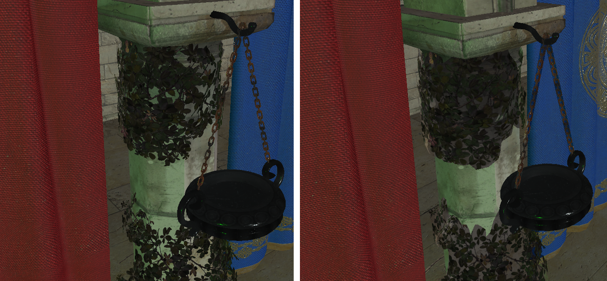
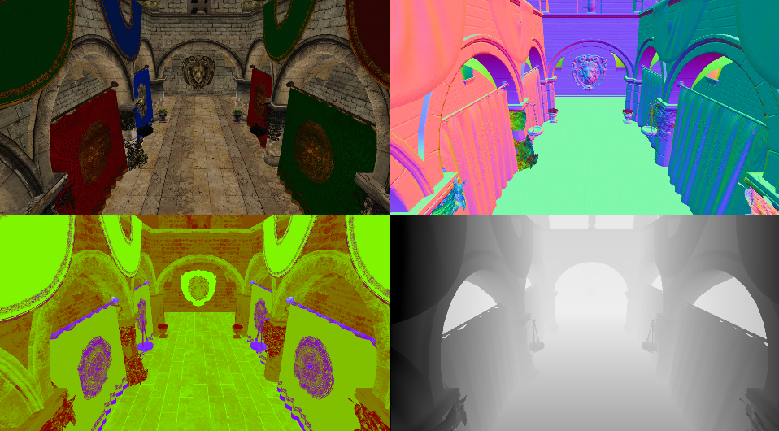
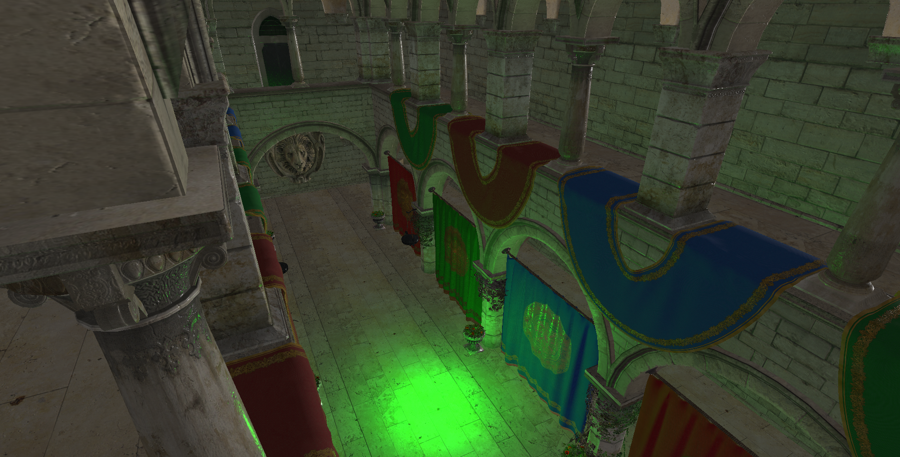

# Deferred rendering (II)

In this chapter we will complete deferred shading example by adding support for lights and PBR (Physically based rendering) to improve the visuals.

You can find the complete source code for this chapter [here](../../booksamples/chapter-11).

## PBR

PBR tries to bring a more realistic way of handling lights, compared with simpler models such as Phong or Blinn-Phon models, but still keeping it simple enough so it can be applied in real time. Instead of trying to summarize here what PBR consists of I will link to the best tutorial I've found about this: [https://learnopengl.com/PBR/Theory](https://learnopengl.com/PBR/Theory). In that link you will be able to read about the theory and to see how it can be implemented. In fact, most of the PBR computation functions lighting fragment shader source code are a copy of the ones defined in that page (developed by [Joey de Vries](https://twitter.com/JoeyDeVriez) and licensed under the terms of the [CC BY-NC 4.0](https://creativecommons.org/licenses/by-nc/4.0/legalcode)).

## Material changes

We will need to modify the `ModelLoader` class to load normal maps and PBR related material information. We will start with the `processMaterial` method, in which we will add the following code:

```java
public class ModelLoader {
    ...
    private static void processMaterial(AIMaterial aiMaterial, List<Material> materials, String texturesDir) {
        ...
            AIString aiNormalMapPath = AIString.callocStack(stack);
            Assimp.aiGetMaterialTexture(aiMaterial, aiTextureType_NORMALS, 0, aiNormalMapPath, (IntBuffer) null,
                    null, null, null, null, null);
            String normalMapPath = aiNormalMapPath.dataString();
            if (normalMapPath != null && normalMapPath.length() > 0) {
                normalMapPath = texturesDir + File.separator + new File(normalMapPath).getName();
            }

            AIString aiMetallicRoughnessPath = AIString.callocStack(stack);
            Assimp.aiGetMaterialTexture(aiMaterial, AI_MATKEY_GLTF_PBRMETALLICROUGHNESS_METALLICROUGHNESS_TEXTURE, 0, aiMetallicRoughnessPath, (IntBuffer) null,
                    null, null, null, null, null);
            String metallicRoughnessPath = aiMetallicRoughnessPath.dataString();
            if (metallicRoughnessPath != null && metallicRoughnessPath.length() > 0) {
                metallicRoughnessPath = texturesDir + File.separator + new File(metallicRoughnessPath).getName();
            }

            float[] metallicArr = new float[]{0.0f};
            int[] pMax = new int[]{1};
            result = aiGetMaterialFloatArray(aiMaterial, aiAI_MATKEY_GLTF_PBRMETALLICROUGHNESS_METALLIC_FACTOR, aiTextureType_NONE, 0, metallicArr, pMax);
            if (result != aiReturn_SUCCESS) {
                metallicArr[0] = 1.0f;
            }

            float[] roughnessArr = new float[]{0.0f};
            result = aiGetMaterialFloatArray(aiMaterial, aiAI_MATKEY_GLTF_PBRMETALLICROUGHNESS_ROUGHNESS_FACTOR, aiTextureType_NONE, 0, roughnessArr, pMax);
            if (result != aiReturn_SUCCESS) {
                roughnessArr[0] = 1.0f;
            }

            Material material = new Material(texturePath, normalMapPath, metallicRoughnessPath, diffuse,
                    roughnessArr[0], metallicArr[0]);
            materials.add(material);
    }
    ...
}
```

We first check if the model defines a path to a normals map texture by calling the `aiGetMaterialTexture` assimp function specifying the `aiTextureType_NORMALS` flag. After that, we check if there is also a texture which defines the material roughness and metallic factors (as in the case of the normal maps) by calling the same function using the `AI_MATKEY_GLTF_PBRMETALLICROUGHNESS_METALLICROUGHNESS_TEXTURE` flag. If the model does not define a specific texture for those values, we try to get those factors by getting material properties calling the `aiGetMaterialFloatArray` assimp function setting the flag `aiAI_MATKEY_GLTF_PBRMETALLICROUGHNESS_METALLIC_FACTOR` for the metallic factor and `aiAI_MATKEY_GLTF_PBRMETALLICROUGHNESS_ROUGHNESS_FACTOR` for the roughness factor. With all the information we can create a `Material` instance, which now receives new parameters for the normals map path, the metallic roughness texture and the metallic and roughness factors. These are the changes in the `Material` class:

```java
public class Material {
    ...
    private boolean hasMetalRoughMap;
    private boolean hasNormalMap;
    ...
    private String metalRoughMap;
    private float metallicFactor;
    private String normalMapPath;
    private float roughnessFactor;
    private String texturePath;

    public Material() {
        this(null, null, null, DEFAULT_COLOR, 0.0f, 0.0f);
    }

    public Material(String texturePath, String normalMapPath, String metalRoughMap, Vector4f diffuseColor,
                    float roughnessFactor, float metallicFactor) {
        ...
        setNormalMapPath(normalMapPath);
        setMetalRoughMap(metalRoughMap);
        this.roughnessFactor = roughnessFactor;
        this.metallicFactor = metallicFactor;
        ...
    }
    ...
    public String getMetalRoughPath() {
        return metalRoughMap;
    }

    public float getMetallicFactor() {
        return metallicFactor;
    }

    public String getNormalMapPath() {
        return normalMapPath;
    }

    public float getRoughnessFactor() {
        return roughnessFactor;
    }
    ...
    public boolean hasMetalRoughMap() {
        return hasMetalRoughMap;
    }

    public boolean hasNormalMap() {
        return hasNormalMap;
    }
    ...
    public void setMetalRoughMap(String metalRoughMap) {
        this.metalRoughMap = metalRoughMap;
        hasMetalRoughMap = this.metalRoughMap != null && this.metalRoughMap.trim().length() > 0;
    }

    public void setNormalMapPath(String normalMapPath) {
        this.normalMapPath = normalMapPath;
        hasNormalMap = this.normalMapPath != null && this.normalMapPath.trim().length() > 0;
    }
    ...
}
```

We basically have defined new attributes to hold the new parameters passed in the constructor, added new `getter`'s and methods to check if a normals map texture or a metallic roughness texture have been defined.

Going back to the `ModelLoader` class, we need to get also the normals of the model and the tangent and bitangent data (normals maps are defined in the so called tangent space. The tangent space is a coordinate system that is local to each triangle of the model. In that coordinate space the `z` axis always points out of the surface. This is the reason why a normal map is usually bluish, even for complex models with opposing faces). In order to work with that coordinate system we need the normals, tangent and bitangent. You can check a great tutorial on this aspect [here](https://learnopengl.com/Advanced-Lighting/Normal-Mapping).

Therefore, we will modify the `processMesh` method:

```java
public class ModelLoader {
    ...
    private static MeshData processMesh(String id, AIMesh aiMesh, List<Material> materials) {
        ...
        List<Float> normals = processNormals(aiMesh);
        List<Float> tangents = processTangents(aiMesh);
        List<Float> biTangents = processBitangents(aiMesh);
        ...

        return new MeshData(id, listToArray(vertices), listToArray(normals), listToArray(tangents),
                listToArray(biTangents), listToArray(textCoords), listIntToArray(indices), material);
    }
    ...
}
```

We have defined new methods to get the normals, tangents and bitangents and pass that data the `MeshData` record. This class has also been modified to accommodate this new data:

```java
package org.vulkanb.eng.scene;

public record MeshData(String id, float[] positions, float[] normals, float[] tangents, float[] biTangents,
                       float[] textCoords, int[] indices, Material material) {
}
```

Going back to the `ModelLoader` class, the new methods are quite straight forward:

```java
public class ModelLoader {
    ...
    private static List<Float> processBitangents(AIMesh aiMesh) {
        List<Float> biTangents = new ArrayList<>();
        AIVector3D.Buffer aiBitangents = aiMesh.mBitangents();
        while (aiBitangents != null && aiBitangents.remaining() > 0) {
            AIVector3D aiBitangent = aiBitangents.get();
            biTangents.add(aiBitangent.x());
            biTangents.add(aiBitangent.y());
            biTangents.add(aiBitangent.z());
        }
        return biTangents;
    }
    ...
    private static List<Float> processNormals(AIMesh aiMesh) {
        List<Float> normals = new ArrayList<>();

        AIVector3D.Buffer aiNormals = aiMesh.mNormals();
        while (aiNormals != null && aiNormals.remaining() > 0) {
            AIVector3D aiNormal = aiNormals.get();
            normals.add(aiNormal.x());
            normals.add(aiNormal.y());
            normals.add(aiNormal.z());
        }
        return normals;
    }

    private static List<Float> processTangents(AIMesh aiMesh) {
        List<Float> tangents = new ArrayList<>();
        AIVector3D.Buffer aiTangents = aiMesh.mTangents();
        while (aiTangents != null && aiTangents.remaining() > 0) {
            AIVector3D aiTangent = aiTangents.get();
            tangents.add(aiTangent.x());
            tangents.add(aiTangent.y());
            tangents.add(aiTangent.z());
        }
        return tangents;
    }
    ...
}
```

In order to get that data, we just call the `mNormals`, `mTangents` and `mBitangents` methods over an `AIMesh` instance to get those coordinates. Keep in mind that when we are loading that model using assimp, we are using the `aiProcess_CalcTangentSpace` so the tangents and bitangents are automatically calculated even if they are not present in the model.

The next step is to modify how the Vulkan buffer gets populated to include the new data. This is done in the `VulkanMesh` class:

```java
public class VulkanMesh {
    ...
    private Texture metalRoughTexture;
    private Texture normalMapTexture;
    ...
    public VulkanMesh(String id, VulkanBuffer verticesBuffer, VulkanBuffer indicesBuffer, int indicesCount,
                      Texture texture, Texture normalMapTexture, Texture metalRoughTexture, Material material) {
        ...
        this.normalMapTexture = normalMapTexture;
        this.metalRoughTexture = metalRoughTexture;
        ...
    }
    ...
    private static TransferBuffers createVerticesBuffers(Device device, MeshData meshData) {
        float[] positions = meshData.positions();
        float[] normals = meshData.normals();
        float[] tangents = meshData.tangents();
        float[] biTangents = meshData.biTangents();
        float[] textCoords = meshData.textCoords();
        ...
        int numElements = positions.length + normals.length + +tangents.length + biTangents.length + textCoords.length;
        ...
        try (MemoryStack stack = MemoryStack.stackPush()) {
            ...
            for (int row = 0; row < rows; row++) {
                int startPos = row * 3;
                int startTextCoord = row * 2;
                data.put(positions[startPos]);
                data.put(positions[startPos + 1]);
                data.put(positions[startPos + 2]);
                data.put(normals[startPos]);
                data.put(normals[startPos + 1]);
                data.put(normals[startPos + 2]);
                data.put(tangents[startPos]);
                data.put(tangents[startPos + 1]);
                data.put(tangents[startPos + 2]);
                data.put(biTangents[startPos]);
                data.put(biTangents[startPos + 1]);
                data.put(biTangents[startPos + 2]);
                data.put(textCoords[startTextCoord]);
                data.put(textCoords[startTextCoord + 1]);
            }
            ...
        }
    }
    ...
    public static VulkanMesh[] loadMeshes(TextureCache textureCache, CommandPool commandPool, Queue queue, MeshData[] meshDataList) {
        ...
        try (MemoryStack stack = MemoryStack.stackPush()) {
            ...
            for (int i = 0; i < numMeshes; i++) {
                ...
                String normalMapPath = material != null ? material.getNormalMapPath() : null;
                Texture normalMapTexture = textureCache.createTexture(device, normalMapPath, VK_FORMAT_R8G8B8A8_UNORM);

                String metalRoughPath = material != null ? material.getMetalRoughPath() : null;
                Texture metalRougTexture = textureCache.createTexture(device, metalRoughPath, VK_FORMAT_R8G8B8A8_SRGB);

                meshes[i] = new VulkanMesh(meshData.id(), verticesBuffers.dstBuffer(), indicesBuffers.dstBuffer(),
                        meshData.indices().length, texture, normalMapTexture, metalRougTexture, material);
                recordTransferCommand(cmd, verticesBuffers);
                recordTransferCommand(cmd, indicesBuffers);
                texture.recordTextureTransition(cmd);
                normalMapTexture.recordTextureTransition(cmd);
                metalRougTexture.recordTextureTransition(cmd);
            }
            ...
        }
        ...
    }
    ...
    public Texture getMetalRoughTexture() {
        return metalRoughTexture;
    }

    public Texture getNormalMapTexture() {
        return normalMapTexture;
    }
    ...
}
```

We define two new attributes to hold the associated textures for the normals map and the roughness metallic map. The `createVerticesBuffers` has also been modified to load into the buffer the coordinates for the normals, tangents and bitangents. Finally, in the `loadMeshes` method, we construct the textures of the normals and roughness metallic maps. We need to transition also these textures to their final layout as with the regular textures.

The last step is to modify the vertex structure, therefore we need to modify the `VertexBufferStructure` class to include the normals, tangents and bitangents as new input attributes:

```java
public class VertexBufferStructure extends VertexInputStateInfo {
    ...
    private static final int NORMAL_COMPONENTS = 3;
    private static final int NUMBER_OF_ATTRIBUTES = 5;
    ...
    public VertexBufferStructure() {
        ...
        // Normal
        i++;
        viAttrs.get(i)
                .binding(0)
                .location(i)
                .format(VK_FORMAT_R32G32B32_SFLOAT)
                .offset(POSITION_COMPONENTS * GraphConstants.FLOAT_LENGTH);

        // Tangent
        i++;
        viAttrs.get(i)
                .binding(0)
                .location(i)
                .format(VK_FORMAT_R32G32B32_SFLOAT)
                .offset(NORMAL_COMPONENTS * GraphConstants.FLOAT_LENGTH + POSITION_COMPONENTS * GraphConstants.FLOAT_LENGTH);

        // BiTangent
        i++;
        viAttrs.get(i)
                .binding(0)
                .location(i)
                .format(VK_FORMAT_R32G32B32_SFLOAT)
                .offset(NORMAL_COMPONENTS * GraphConstants.FLOAT_LENGTH * 2 + POSITION_COMPONENTS * GraphConstants.FLOAT_LENGTH);
        // Texture coordinates
        i++;
        viAttrs.get(i)
                .binding(0)
                .location(i)
                .format(VK_FORMAT_R32G32_SFLOAT)
                .offset(NORMAL_COMPONENTS * GraphConstants.FLOAT_LENGTH * 3 + POSITION_COMPONENTS * GraphConstants.FLOAT_LENGTH);

        viBindings.get(0)
                .binding(0)
                .stride(POSITION_COMPONENTS * GraphConstants.FLOAT_LENGTH +
                        NORMAL_COMPONENTS * GraphConstants.FLOAT_LENGTH * 3 +
                        TEXT_COORD_COMPONENTS * GraphConstants.FLOAT_LENGTH)
                .inputRate(VK_VERTEX_INPUT_RATE_VERTEX);
        ...
    }
    ...
}
```

We need to define new `VkVertexInputAttributeDescription` structures for the normals, tangents and bitangents. The offset of the texture coordinates also change and the stride size, since of the new components has three floats.

## Lights

In order to apply lighting we need to add support for lights. Therefore, the first thing we should do is create new class named `Light` which models a light:

```java
package org.vulkanb.eng.scene;

import org.joml.Vector4f;

public class Light {

    private Vector4f color;
    /**
     * For directional lights, the "w" coordinate will be 1. For point lights it will be "0". For directional lights
     * this attribute should be read as a direction.
     */
    private Vector4f position;

    public Light() {
        color = new Vector4f(0.0f, 0.0f, 0.0f, 0.0f);
        position = new Vector4f(0.0f, 0.0f, 0.0f, 0.0f);
    }

    public Vector4f getColor() {
        return color;
    }

    public Vector4f getPosition() {
        return position;
    }
}
```

We will support directional and point lights. A light is defined by a position (in the case of a point light) or a directional (in the case of a directional light, for example the sun light). Since we are using `Vector4f` for positions / directions we will use `w` component to state if it as point light (the `w` component will be `0`) or a directional light (the `w` component will be `1`). A light will also define a color. In addition to that, we need also to add support for ambient light (a color that will be added to all the fragments independently of their position and normals). We will add this in the `Scene` class along with the list of lights.

```java
public class Scene {
    ...
    private Vector4f ambientLight;
    ...
    private Light[] lights;
    ...
    public Scene(Window window) {
        ...
        ambientLight = new Vector4f();
    }
    ...
    public Vector4f getAmbientLight() {
        return ambientLight;
    }
    ...
    public Light[] getLights() {
        return this.lights;
    }
    ...
    public void setLights(Light[] lights) {
        int numLights = lights != null ? lights.length : 0;
        if (numLights > GraphConstants.MAX_LIGHTS) {
            throw new RuntimeException("Maximum number of lights set to: " + GraphConstants.MAX_LIGHTS);
        }
        this.lights = lights;
    }
}
```

We also added a new constant in the `GraphConstants` class to setup the maximum number of supported lights:

```java
public final class GraphConstants {
    ...
    public static final int MAX_LIGHTS = 10;
    ...
}
```

We will see how we will use lighting information when viewing the modifications in the lighting phase.

## Geometry phase modifications

We will start by modifying the attachments that we will use as outputs in the geometry pass and as inputs in the lighting pass. This is done in the `GeometryAttachments`:

```java
package org.vulkanb.eng.graph.geometry;

import org.vulkanb.eng.graph.vk.*;

import java.util.Arrays;

import static org.lwjgl.vulkan.VK11.*;

public class GeometryAttachments {

    public static final int NUMBER_ATTACHMENTS = 4;
    ...

    public GeometryAttachments(Device device, int width, int height) {
        ...
        // Normals attachment
        attachment = new Attachment(device, width, height,
                VK_FORMAT_A2B10G10R10_UNORM_PACK32, VK_IMAGE_USAGE_COLOR_ATTACHMENT_BIT);
        attachments[i] = attachment;
        i++;

        // PBR attachment
        attachment = new Attachment(device, width, height,
                VK_FORMAT_R16G16B16A16_SFLOAT, VK_IMAGE_USAGE_COLOR_ATTACHMENT_BIT);
        attachments[i] = attachment;
        i++;
        ...
    }
    ...
}
```

We have defined two new attachments:

- The normals attachment will hold normals data. Although they can be packed in a more efficient format, we will use the `VK_FORMAT_A2B10G10R10_UNORM_PACK32` flag to store the information as a 32 bit package where the normals will be stored unsigned.
- The PBR attachment will hold information used for PBR shading (more on this later on). That is it will store information about the roughness and metal factors of the materials.

The next step is to modify the `GeometryRenderActivity` class. Let's review the changes one by one:

```java
public class GeometryRenderActivity {
    ...
    private void createDescriptorPool() {
        ...
        descriptorTypeCounts.add(new DescriptorPool.DescriptorTypeCount(engineProps.getMaxMaterials() * 3, VK_DESCRIPTOR_TYPE_COMBINED_IMAGE_SAMPLER));
        ...
    }
    ...
}
```

Previously we just had one texture descriptor set per material for each of the potential textures. Now we have two more potential textures, one for the normals map and the other one for the roughness metallic map. Therefore, in the fragment shader of the geometry pass we will need more texture samples so we have to modify the `createDescriptorSets` method like this:

```java
public class GeometryRenderActivity {
    ...
    private void createDescriptorSets(int numImages) {
        ...
        geometryDescriptorSetLayouts = new DescriptorSetLayout[]{
                matrixDescriptorSetLayout,
                matrixDescriptorSetLayout,
                textureDescriptorSetLayout,
                textureDescriptorSetLayout,
                textureDescriptorSetLayout,
                materialDescriptorSetLayout,
        };
        ...
    }
    ...
}
```

As you can see we add two more descriptor set layouts for the normals an roughness metallic texture maps which will use descriptors `3` and `4` respectively. The descriptor set used for the material data has been pushed to descriptor number `5`.

The `GeometryRenderActivity` class also will be notified when meshes are loaded and unloaded. The only modifications here is that we have to free normals map and roughness metallic map descriptor sets. When loading new meshes we need to take into consideration these new textures for the descriptor sets update.

```java
public class GeometryRenderActivity {
    ...
    public void meshUnLoaded(VulkanMesh vulkanMesh) {
        TextureDescriptorSet textureDescriptorSet = descriptorSetMap.remove(vulkanMesh.getTexture().getFileName());
        if (textureDescriptorSet != null) {
            descriptorPool.freeDescriptorSet(textureDescriptorSet.getVkDescriptorSet());
        }
        textureDescriptorSet = descriptorSetMap.remove(vulkanMesh.getNormalMapTexture().getFileName());
        if (textureDescriptorSet != null) {
            descriptorPool.freeDescriptorSet(textureDescriptorSet.getVkDescriptorSet());
        }
        textureDescriptorSet = descriptorSetMap.remove(vulkanMesh.getMetalRoughTexture().getFileName());
        if (textureDescriptorSet != null) {
            descriptorPool.freeDescriptorSet(textureDescriptorSet.getVkDescriptorSet());
        }
    }

    public void meshesLoaded(VulkanMesh[] meshes) {
        device.waitIdle();
        int meshCount = 0;
        for (VulkanMesh vulkanMesh : meshes) {
            int materialOffset = meshCount * materialDescriptorSetLayout.getMaterialSize();
            updateTextureDescriptorSet(vulkanMesh.getTexture());
            updateTextureDescriptorSet(vulkanMesh.getNormalMapTexture());
            updateTextureDescriptorSet(vulkanMesh.getMetalRoughTexture());
            updateMaterial(materialsBuffer, vulkanMesh.getMaterial(), materialOffset);
            meshCount++;
        }
    }
    ...
}
```

The next change is to put the new descriptors into work by allowing them to be accessed in the shaders. Therefore we need to modify the `recordCommandBuffers` in the `GeometryRenderActivity` class:

```java
public class GeometryRenderActivity {
    ...
    public void recordCommandBuffers(List<VulkanMesh> meshes, Scene scene) {
        ...
            LongBuffer descriptorSets = stack.mallocLong(6)
                    .put(0, projMatrixDescriptorSet.getVkDescriptorSet())
                    .put(1, viewMatricesDescriptorSets[idx].getVkDescriptorSet())
                    .put(5, materialsDescriptorSet.getVkDescriptorSet());
            VulkanUtils.copyMatrixToBuffer(device, viewMatricesBuffer[idx], scene.getCamera().getViewMatrix());
            IntBuffer dynDescrSetOffset = stack.callocInt(1);
            int meshCount = 0;
            for (VulkanMesh mesh : meshes) {
                int materialOffset = meshCount * materialDescriptorSetLayout.getMaterialSize();
                dynDescrSetOffset.put(0, materialOffset);
                vertexBuffer.put(0, mesh.getVerticesBuffer().getBuffer());
                vkCmdBindVertexBuffers(cmdHandle, 0, vertexBuffer, offsets);
                vkCmdBindIndexBuffer(cmdHandle, mesh.getIndicesBuffer().getBuffer(), 0, VK_INDEX_TYPE_UINT32);

                TextureDescriptorSet textureDescriptorSet = descriptorSetMap.get(mesh.getTexture().getFileName());
                TextureDescriptorSet normalMapDescriptorSet = descriptorSetMap.get(mesh.getNormalMapTexture().getFileName());
                TextureDescriptorSet metalRoughDescriptorSet = descriptorSetMap.get(mesh.getMetalRoughTexture().getFileName());
                List<Entity> entities = scene.getEntitiesByMeshId(mesh.getId());
                for (Entity entity : entities) {
                    descriptorSets.put(2, textureDescriptorSet.getVkDescriptorSet());
                    descriptorSets.put(3, normalMapDescriptorSet.getVkDescriptorSet());
                    descriptorSets.put(4, metalRoughDescriptorSet.getVkDescriptorSet());
                    vkCmdBindDescriptorSets(cmdHandle, VK_PIPELINE_BIND_POINT_GRAPHICS,
                            pipeLine.getVkPipelineLayout(), 0, descriptorSets, dynDescrSetOffset);

                    setPushConstants(cmdHandle, entity.getModelMatrix(), pushConstantBuffer);
                    vkCmdDrawIndexed(cmdHandle, mesh.getIndicesCount(), 1, 0, 0, 0);
                }

                meshCount++;
            }
        ...
    }
    ...
}
```

As we have mentioned before, we have now two more descriptor sets, so we pass from `4` descriptor sets to `6`. The material uniform has also moved from the descriptor set number `3` to number `5`. The texture descriptor sets for the normals and roughness metallic maps are set in numbers `3` and `4`.

Finally, the `updateMaterial` method needs also to be updated to handle the changes in the `Material` class which need to be passed to the uniform used in the geometry fragment shader. We need to pass the flags that indicate if the material has defined a normals map or a roughness metallic map along with the roughness and metallic factors (for the case when no textures are used).

```java
public class GeometryRenderActivity {
    ...
    private void updateMaterial(VulkanBuffer vulkanBuffer, Material material, int offset) {
        long mappedMemory = vulkanBuffer.map();
        ByteBuffer materialBuffer = MemoryUtil.memByteBuffer(mappedMemory, (int) vulkanBuffer.getRequestedSize());
        material.getDiffuseColor().get(offset, materialBuffer);
        materialBuffer.putFloat(offset + GraphConstants.FLOAT_LENGTH * 4, material.hasTexture() ? 1.0f : 0.0f);
        materialBuffer.putFloat(offset + GraphConstants.FLOAT_LENGTH * 5, material.hasNormalMap() ? 1.0f : 0.0f);
        materialBuffer.putFloat(offset + GraphConstants.FLOAT_LENGTH * 6, material.hasMetalRoughMap() ? 1.0f : 0.0f);
        materialBuffer.putFloat(offset + GraphConstants.FLOAT_LENGTH * 7, material.getRoughnessFactor());
        materialBuffer.putFloat(offset + GraphConstants.FLOAT_LENGTH * 8, material.getMetallicFactor());
        vulkanBuffer.unMap();
    }
    ...
}
```

It is turn now to examine the shaders. The `geometry_vertex.gls` vertex shader is defined like this:

```glsl
#version 450

layout(location = 0) in vec3 entityPos;
layout(location = 1) in vec3 entityNormal;
layout(location = 2) in vec3 entityTangent;
layout(location = 3) in vec3 entityBitangent;
layout(location = 4) in vec2 entityTextCoords;

layout(location = 0) out vec3 outNormal;
layout(location = 1) out vec3 outTangent;
layout(location = 2) out vec3 outBitangent;
layout(location = 3) out vec2 outTextCoords;

layout(set = 0, binding = 0) uniform ProjUniform {
    mat4 projectionMatrix;
} projUniform;
layout(set = 1, binding = 0) uniform ViewUniform {
    mat4 viewMatrix;
} viewUniform;

layout(push_constant) uniform matrices {
    mat4 modelMatrix;
} push_constants;

void main()
{
    mat4 modelViewMatrix = viewUniform.viewMatrix * push_constants.modelMatrix;
    outNormal     = normalize(modelViewMatrix * vec4(entityNormal, 0)).xyz;
    outTangent    = normalize(modelViewMatrix * vec4(entityTangent, 0)).xyz;
    outBitangent  = normalize(modelViewMatrix * vec4(entityBitangent, 0)).xyz;
    outTextCoords = entityTextCoords;
    gl_Position   =  projUniform.projectionMatrix * modelViewMatrix * vec4(entityPos, 1);
}
```

As you can see, since we have modified the vertex buffer structure, we need to define the new input attributes for the normal, tangent and bitangent coordinates. We will transform these values in this shader and pass them to the fragment shader (to dump them in the output attachments). As you can see the normals, tangents and bitangents are transformed to be in view space. This is because we will perform all the calculations related to lighting (which will use these values) in view space. This improves the precision of calculations with lights closer to the view.

The `geometry_fragment.gls` fragment shader is defined like this:

```glsl
#version 450

layout(location = 0) in vec3 inNormal;
layout(location = 1) in vec3 inTangent;
layout(location = 2) in vec3 inBitangent;
layout(location = 3) in vec2 inTextCoords;

layout(location = 0) out vec4 outAlbedo;
layout(location = 1) out vec4 outNormal;
layout(location = 2) out vec4 outPBR;

layout(set = 2, binding = 0) uniform sampler2D textSampler;
layout(set = 3, binding = 0) uniform sampler2D normalSampler;
layout(set = 4, binding = 0) uniform sampler2D metRoughSampler;

layout(set = 5, binding = 0) uniform MaterialUniform {
    vec4 diffuseColor;
    float hasNormalMap;
    float hasMetalRoughMap;
    float roughnessFactor;
    float metallicFactor;
} material;

vec3 calcNormal(float hasNormalMap, vec3 normal, vec2 textCoords, mat3 TBN)
{
    vec3 newNormal = normal;
    if (hasNormalMap > 0)
    {
        newNormal = texture(normalSampler, textCoords).rgb;
        newNormal = normalize(newNormal * 2.0 - 1.0);
        newNormal = normalize(TBN * newNormal);
    }
    return newNormal;
}

void main()
{
    outAlbedo = material.diffuseColor + texture(textSampler, inTextCoords);

    // Hack to avoid transparent PBR artifacts
    if (outAlbedo.a < 0.5) {
        discard;
    }

    mat3 TBN = mat3(inTangent, inBitangent, inNormal);
    vec3 newNormal = calcNormal(material.hasNormalMap, inNormal, inTextCoords, TBN);
    // Transform normals from [-1, 1] to [0, 1]
    outNormal = vec4(0.5 * newNormal + 0.5, 1.0);

    float ao = 0.5f;
    float roughnessFactor = 0.0f;
    float metallicFactor = 0.0f;
    if (material.hasMetalRoughMap > 0) {
        vec4 metRoughValue = texture(metRoughSampler, inTextCoords);
        roughnessFactor = metRoughValue.g;
        metallicFactor = metRoughValue.b;
    } else {
        roughnessFactor = material.roughnessFactor;
        metallicFactor = material.metallicFactor;
    }

    outPBR = vec4(ao, roughnessFactor, metallicFactor, 1.0f);
}
```

This shader defines two new output attachments, one for the normals and the other one for the PBR data (ambient occlusion, roughness factor and metallic factor). The material uniform has also been modified to hold the new attributes. The `calcNormal` function is used to transform the normals if a normal map has been defined. If the material has defined a normals map, we sample from it using the texture coordinates and transform it to the range [-1, 1] (Texture values are defined in the range [0, 1]). After that, we multiply the normal by the TBN matrix. What is the reason for this? Normal maps are usually built so the normal coordinates point in the positive z direction (that is why the usually have that blueish color). They are expressed in tangent space. We need to transform them to world coordinates space, this is why we multiply them by the TBN (Tangent Bitangent Normal) matrix. You can find an excellent explanation about the calculations [Normal mapping](https://learnopengl.com/Advanced-Lighting/Normal-Mapping). 

The main block gets the albedo color as in the previous chapter, but, after that, we discard fragments with an alpha value below a certain threshold. This is a trick to avoid apply lighting to transparent fragments. It is quick trick to improve the visuals, although the proper way is to render transparent objects separately (we are not doing this right now to simplify). If we were not doing this, we would get strange artifacts in transparent regions. The next figure shows in the left a region of the scene which contains transparent  objects discarding the ones below a threshold and on the right, the same region without discarding them. You can see, in the right side, that transparent fragments get somehow highlighted. Again, this is not the proper way to handle this, it is a quite hack to keep the examples simple.



The normal, once updated, is converted to be in the range [0, 1] since it is going to be stored in an image with the format `VK_FORMAT_A2B10G10R10_UNORM_PACK32` (`U` means unsigned). The we try to get the ambient occlusion (`ao`), roughness and metallic factors either from the respective texture maps or from the material uniform. We are using gltf models, and ambient occlusion is not present in the roughness metallic map and cannot be extracted via assimp properties, so we leave it fixed by this moment. Albedo, normals and PBR factors are stored in their respective output attachments. The following picture shows how the output attachments look like (including depth attachment) when the geometry phase finishes.



## Lighting phase modifications

In order to use lights in the shaders we need to pass that information using new descriptor sets. Therefore, we need first to define the layout of the descriptor set that will contain light information. In our case, we will use a single uniform that will contain the ambient light color, the number of point an directional lights and an array with the position and color for each of those lights. We will do this in a new class named `LightsDescriptorSetLayout` which is defined like this:

```java
package org.vulkanb.eng.graph.lighting;

import org.apache.logging.log4j.*;
import org.lwjgl.system.MemoryStack;
import org.lwjgl.vulkan.*;
import org.vulkanb.eng.graph.vk.*;

import java.nio.LongBuffer;

import static org.lwjgl.vulkan.VK11.*;
import static org.vulkanb.eng.graph.vk.VulkanUtils.vkCheck;

public class LightsDescriptorSetLayout extends DescriptorSetLayout {
    private static final Logger LOGGER = LogManager.getLogger();

    public LightsDescriptorSetLayout(Device device) {
        super(device);

        LOGGER.debug("Creating Lights descriptor set Layout");
        try (MemoryStack stack = MemoryStack.stackPush()) {
            VkDescriptorSetLayoutBinding.Buffer layoutBindings = VkDescriptorSetLayoutBinding.callocStack(1, stack);
            layoutBindings.get(0)
                    .binding(0)
                    .descriptorType(VK_DESCRIPTOR_TYPE_UNIFORM_BUFFER)
                    .descriptorCount(1)
                    .stageFlags(VK_SHADER_STAGE_FRAGMENT_BIT);
            VkDescriptorSetLayoutCreateInfo layoutInfo = VkDescriptorSetLayoutCreateInfo.callocStack(stack)
                    .sType(VK_STRUCTURE_TYPE_DESCRIPTOR_SET_LAYOUT_CREATE_INFO)
                    .pBindings(layoutBindings);

            LongBuffer lp = stack.mallocLong(1);
            vkCheck(vkCreateDescriptorSetLayout(device.getVkDevice(), layoutInfo, null, lp),
                    "Failed to create descriptor set layout");
            vkDescriptorLayout = lp.get(0);
        }
    }
}
```

Again, nothing new here. We just define a uniform that will be used in the fragment shader. The next step is to define the descriptor set:

```java
package org.vulkanb.eng.graph.lighting;

import org.lwjgl.system.MemoryStack;
import org.lwjgl.vulkan.*;
import org.vulkanb.eng.graph.vk.*;

import java.nio.LongBuffer;

import static org.lwjgl.vulkan.VK11.*;
import static org.vulkanb.eng.graph.vk.VulkanUtils.vkCheck;

public class LightsDescriptorSet extends DescriptorSet {

    public LightsDescriptorSet(DescriptorPool descriptorPool, LightsDescriptorSetLayout lightsDescriptorSetLayout,
                               VulkanBuffer lightsBuffer, int binding) {
        try (MemoryStack stack = MemoryStack.stackPush()) {
            Device device = descriptorPool.getDevice();
            LongBuffer pDescriptorSetLayout = stack.mallocLong(1);
            pDescriptorSetLayout.put(0, lightsDescriptorSetLayout.getVkDescriptorLayout());
            VkDescriptorSetAllocateInfo allocInfo = VkDescriptorSetAllocateInfo.callocStack(stack)
                    .sType(VK_STRUCTURE_TYPE_DESCRIPTOR_SET_ALLOCATE_INFO)
                    .descriptorPool(descriptorPool.getVkDescriptorPool())
                    .pSetLayouts(pDescriptorSetLayout);

            LongBuffer pDescriptorSet = stack.mallocLong(1);
            vkCheck(vkAllocateDescriptorSets(device.getVkDevice(), allocInfo, pDescriptorSet),
                    "Failed to create descriptor set");

            vkDescriptorSet = pDescriptorSet.get(0);

            VkDescriptorBufferInfo.Buffer descrLights = VkDescriptorBufferInfo.callocStack(1, stack)
                    .buffer(lightsBuffer.getBuffer())
                    .offset(0)
                    .range(lightsBuffer.getRequestedSize());

            VkWriteDescriptorSet.Buffer descrBuffer = VkWriteDescriptorSet.callocStack(1, stack);

            descrBuffer.get(0)
                    .sType(VK_STRUCTURE_TYPE_WRITE_DESCRIPTOR_SET)
                    .dstSet(vkDescriptorSet)
                    .dstBinding(binding)
                    .dstArrayElement(0)
                    .descriptorType(VK_DESCRIPTOR_TYPE_UNIFORM_BUFFER)
                    .descriptorCount(1)
                    .pBufferInfo(descrLights);

            vkUpdateDescriptorSets(device.getVkDevice(), descrBuffer, null);
        }
    }
}
```

In this case, we define a single descriptor set associated to a Vulkan buffer that will hold all the data related to lights. Now we can put all these elements to work in the `LightingRenderActivity` class:

```java
public class LightingRenderActivity {
    ...
    private Vector4f auxVec;
    ...
    private VulkanBuffer invProjBuffer;
    private MatrixDescriptorSet invProjMatrixDescriptorSet;
    ...
    private VulkanBuffer[] lightsBuffers;
    private LightsDescriptorSetLayout lightsDescriptorSetLayout;
    private LightsDescriptorSet[] lightsDescriptorSets;
    private MatrixDescriptorSetLayout matrixDescriptorSetLayout;
    ...
    public LightingRenderActivity(SwapChain swapChain, CommandPool commandPool, PipelineCache pipelineCache,
                                  Attachment[] attachments, Scene scene) {
        ...
        auxVec = new Vector4f();
        ...

        createUniforms(numImages);
        createDescriptorSets(attachments, numImages);
        ...
        updateInvProjMatrix(scene);
        ...
    }

    public void cleanup() {
        matrixDescriptorSetLayout.cleanup();
        lightsDescriptorSetLayout.cleanup();
        ...
        Arrays.stream(lightsBuffers).forEach(VulkanBuffer::cleanup);
        ...
        invProjBuffer.cleanup();
        ...
    }
    ...
}
```

We have added anew buffers to hold lighting data along with their associated descriptor sets and layout. We have also added a new uniform for a matrix that will hold the inverse projection matrix (we will see in the shader why it is needed). All these resources are instantiated in a new method called `createUniforms` and  freed in the `cleanup` method.

The `createUniforms` method is defined like this:

```java
public class LightingRenderActivity {
    ...
    private void createUniforms(int numImages) {
        invProjBuffer = new VulkanBuffer(device, GraphConstants.MAT4X4_SIZE, VK_BUFFER_USAGE_UNIFORM_BUFFER_BIT,
                VK_MEMORY_PROPERTY_HOST_VISIBLE_BIT);

        lightsBuffers = new VulkanBuffer[numImages];
        for (int i = 0; i < numImages; i++) {
            lightsBuffers[i] = new VulkanBuffer(device,
                    GraphConstants.INT_LENGTH * 4 + GraphConstants.VEC4_SIZE * 2 * GraphConstants.MAX_LIGHTS +
                            GraphConstants.VEC4_SIZE, VK_BUFFER_USAGE_UNIFORM_BUFFER_BIT,
                    VK_MEMORY_PROPERTY_HOST_VISIBLE_BIT);
        }
    }
    ...
}
```

As it has been mentioned just before, we create a uniform to store the inverse of the perspective matrix. We create just one buffer, not one per swap image, because it is only updated when the window is resized. After that we create the buffers for the lighting information. In this case we create one buffer per swap chain image because that information can change while rendering. The buffer will hold information for the ambient light color (a `vec4` in the shader), the number of lights (an `int`), and an array of positions (`vec4`) and colors (`vec4`).

The `createDescriptorPool` needs also to be updated to reserve space for the inverse projection uniform and the lights uniforms:

```java
public class LightingRenderActivity {
    ...
    private void createDescriptorPool() {
        ...
        descriptorTypeCounts.add(new DescriptorPool.DescriptorTypeCount(swapChain.getNumImages() + 1, VK_DESCRIPTOR_TYPE_UNIFORM_BUFFER));
        ...
    }
    ...
}
```

The next step is to update the `createDescriptorSets` method:

```java
public class LightingRenderActivity {
    ...
    private void createDescriptorSets(Attachment[] attachments, int numImages) {
        attachmentsLayout = new AttachmentsLayout(device, GeometryAttachments.NUMBER_ATTACHMENTS);
        lightsDescriptorSetLayout = new LightsDescriptorSetLayout(device);
        matrixDescriptorSetLayout = new MatrixDescriptorSetLayout(device, 0, VK_SHADER_STAGE_FRAGMENT_BIT);
        descriptorSetLayouts = new DescriptorSetLayout[]{
                attachmentsLayout,
                lightsDescriptorSetLayout,
                matrixDescriptorSetLayout,
        };

        attachmentsDescriptorSet = new AttachmentsDescriptorSet(descriptorPool, attachmentsLayout,
                attachments, 0);
        invProjMatrixDescriptorSet = new MatrixDescriptorSet(descriptorPool, matrixDescriptorSetLayout,
                invProjBuffer, 0);

        lightsDescriptorSets = new LightsDescriptorSet[numImages];
        for (int i = 0; i < numImages; i++) {
            lightsDescriptorSets[i] = new LightsDescriptorSet(descriptorPool, lightsDescriptorSetLayout,
                    lightsBuffers[i], 0);
        }
    }
    ...
}
```

By examining the layouts you can see that the input attachments will still use descriptor set `0` but we added the lights descriptor set (`1`) and the inverse projection matrix (`2`). After that, we just instantiate the new descriptor sets. The only change required in the `preRecordCommandBuffer` is to pass the new descriptor sets:

```java
public class LightingRenderActivity {
    ...
    public void preRecordCommandBuffer(int idx) {
        ...
            LongBuffer descriptorSets = stack.mallocLong(3)
                    .put(0, attachmentsDescriptorSet.getVkDescriptorSet())
                    .put(1, lightsDescriptorSets[idx].getVkDescriptorSet())
                    .put(2, invProjMatrixDescriptorSet.getVkDescriptorSet());
            vkCmdBindDescriptorSets(cmdHandle, VK_PIPELINE_BIND_POINT_GRAPHICS,
                    pipeline.getVkPipelineLayout(), 0, descriptorSets, null);
        ...
    }
    ...
}
```

In the `prepareCommandBuffers` method we will update the current lights buffer in each render loop (they can be dynamically changed), while in the `resize` method we need just to update the inverse projection matrix (by calling a new method named `updateInvProjMatrix`):

```java
public class LightingRenderActivity {
    ...
    public void prepareCommandBuffers(Scene scene) {
        int idx = swapChain.getCurrentFrame();
        Fence fence = fences[idx];

        fence.fenceWait();
        fence.reset();

        updateLights(scene.getAmbientLight(), scene.getLights(), scene.getCamera().getViewMatrix(),
                lightsBuffers[idx]);
    }

    public void resize(SwapChain swapChain, Attachment[] attachments, Scene scene) {
        this.swapChain = swapChain;
        attachmentsDescriptorSet.update(attachments);
        lightingFrameBuffer.resize(swapChain);

        updateInvProjMatrix(scene);

        int numImages = swapChain.getNumImages();
        for (int i = 0; i < numImages; i++) {
            preRecordCommandBuffer(i);
        }
    }
    ...
}
```

Finally, we need to add two new methods to update the inverse projection matrix and the lights uniform:

```java
public class LightingRenderActivity {
    ...
    private void updateInvProjMatrix(Scene scene) {
        Matrix4f invProj = new Matrix4f(scene.getProjection().getProjectionMatrix()).invert();
        VulkanUtils.copyMatrixToBuffer(device, invProjBuffer, invProj);
    }

    private void updateLights(Vector4f ambientLight, Light[] lights, Matrix4f viewMatrix,
                              VulkanBuffer lightsBuffer) {
        long mappedMemory = lightsBuffer.map();
        ByteBuffer uniformBuffer = MemoryUtil.memByteBuffer(mappedMemory, (int) lightsBuffer.getRequestedSize());

        ambientLight.get(0, uniformBuffer);
        int offset = GraphConstants.VEC4_SIZE;
        int numLights = lights != null ? lights.length : 0;
        uniformBuffer.putInt(offset, numLights);
        offset += GraphConstants.VEC4_SIZE;
        for (int i = 0; i < numLights; i++) {
            Light light = lights[i];
            auxVec.set(light.getPosition());
            auxVec.mul(viewMatrix);
            auxVec.w = light.getPosition().w;
            auxVec.get(offset, uniformBuffer);
            offset += GraphConstants.VEC4_SIZE;
            light.getColor().get(offset, uniformBuffer);
            offset += GraphConstants.VEC4_SIZE;
        }

        lightsBuffer.unMap();
    }
    ...
```

The lighting vertex shader (`geometry_vertex.glsl`) has not been modified at all. However, the lighting fragment shader (`geometry_fragment.glsl`) has been heavily changed. It starts like this:

```glsl
#version 450
// CREDITS: Most of the functions here have been obtained from this link: https://learnopengl.com/PBR
// developed by Joey de Vries, https://twitter.com/JoeyDeVriez, and licensed under the terms of the CC BY-NC 4.0,
// https://creativecommons.org/licenses/by-nc/4.0/legalcode

const int MAX_LIGHTS = 10;
const float PI = 3.14159265359;

// Always use vec4 (minimum alighnment)
struct Light {
    vec4 position;
    vec4 color;
};

layout(location = 0) in vec2 inTextCoord;

layout(location = 0) out vec4 outFragColor;

layout(set = 0, binding = 0) uniform sampler2D albedoSampler;
layout(set = 0, binding = 1) uniform sampler2D normalsSampler;
layout(set = 0, binding = 2) uniform sampler2D pbrSampler;
layout(set = 0, binding = 3) uniform sampler2D depthSampler;
layout(set = 1, binding = 0) uniform UBO {
    vec4 ambientLightColor;
    uint count;
    Light lights[MAX_LIGHTS];
} lights;
layout(set = 2, binding = 0) uniform ProjUniform {
    mat4 invProjectionMatrix;
} projUniform;
...
```

We first define some constants and then the structure to hold lights information (a position and  color). The fragment shader still only receives the texture coordinates and generates an output color (that will be dumped in a swap chain image). It uses four input attachments that will be sampled as textures. These are the outputs generated in the geometry phase. After that it defines a uniform for holding lights information and the inverse projection matrix. The next functions apply the PBR techniques to modify the fargment color associated to each light. As it has been said before, you can find a great explanation here: [PBR](https://learnopengl.com/PBR/Theory) (It makes no sense to repeat that here):

```glsl
...
vec3 fresnelSchlick(float cosTheta, vec3 F0)
{
    return F0 + (1.0 - F0) * pow(1.0 - cosTheta, 5.0);
}

float DistributionGGX(vec3 N, vec3 H, float roughness)
{
    float a      = roughness*roughness;
    float a2     = a*a;
    float NdotH  = max(dot(N, H), 0.0);
    float NdotH2 = NdotH*NdotH;

    float num   = a2;
    float denom = (NdotH2 * (a2 - 1.0) + 1.0);
    denom = PI * denom * denom;

    return num / denom;
}

float GeometrySchlickGGX(float NdotV, float roughness)
{
    float r = (roughness + 1.0);
    float k = (r*r) / 8.0;

    float num   = NdotV;
    float denom = NdotV * (1.0 - k) + k;

    return num / denom;
}
float GeometrySmith(vec3 N, vec3 V, vec3 L, float roughness)
{
    float NdotV = max(dot(N, V), 0.0);
    float NdotL = max(dot(N, L), 0.0);
    float ggx2  = GeometrySchlickGGX(NdotV, roughness);
    float ggx1  = GeometrySchlickGGX(NdotL, roughness);

    return ggx1 * ggx2;
}

vec3 calculateLight(Light light, vec3 lightDirection, vec3 position, vec3 normal, vec3 albedo,
float metallic, float roughness, float attenuation) {
    vec3 result;

    vec3 N = normalize(normal);
    vec3 L = normalize(lightDirection);
    vec3 V = normalize(-position);
    vec3 H = normalize(L + V);

    vec3 F0 = vec3(0.04);
    F0 = mix(F0, albedo, metallic);

    vec3 Lo = vec3(0.0);
    vec3 radiance = light.color.rgb * attenuation;

    // cook-torrance brdf
    float NDF = DistributionGGX(N, H, roughness);
    float G   = GeometrySmith(N, V, L, roughness);
    vec3 F    = fresnelSchlick(max(dot(H, V), 0.0), F0);

    vec3 kS = F;
    vec3 kD = vec3(1.0) - kS;
    kD *= 1.0 - metallic;

    vec3 numerator    = NDF * G * F;
    float denominator = 4.0 * max(dot(N, V), 0.0) * max(dot(N, L), 0.0);
    vec3 specular     = numerator / max(denominator, 0.001);

    // add to outgoing radiance Lo
    float NdotL = max(dot(N, L), 0.0);
    Lo += (kD * albedo / PI + specular) * radiance * NdotL;

    return Lo;
}
...
```

We have two types of light, directional (which are defined by a direction) and point lights (which are defined by a position). In the case of directional lights, there will be no attenuation and will use its direction as the position in the `calculateLight` function. In the case of point lights we calculate the attenuation based on the distance with the fragment position (always in light space coordinates):

```glsl
...
vec3 calculateDirectionalLight(Light light, vec3 position, vec3 normal, vec3 color,
float metallic, float roughness) {
    float attenuation = 1.0;
    return calculateLight(light, light.position.xyz, position, normal, color, metallic, roughness,
    attenuation);
}

vec3 calculatePointLight(Light light, vec3 position, vec3 normal, vec3 color,
float metallic, float roughness) {
    vec3 lightDirection = light.position.xyz - position;
    float dist = length(lightDirection) * 0.2;
    float attenuation = 1.0 / (dist * dist);
    return calculateLight(light, lightDirection, position, normal, color, metallic, roughness,
    attenuation);
}
...
```

The main block is defined like this:

```glsl
...
void main() {
    vec3 albedo = texture(albedoSampler, inTextCoord).rgb;
    vec3 normal = normalize(2.0 * texture(normalsSampler, inTextCoord).rgb  - 1.0);
    vec3 pbrSampledValue = texture(pbrSampler, inTextCoord).rgb;
    float ao = pbrSampledValue.r;
    float roughness = pbrSampledValue.g;
    float metallic = pbrSampledValue.b;

    // Retrieve position from depth
    vec4 clip    = vec4(inTextCoord.x * 2.0 - 1.0, inTextCoord.y * -2.0 + 1.0, texture(depthSampler, inTextCoord).x, 1.0);
    vec4 world_w = projUniform.invProjectionMatrix * clip;
    vec3 pos     = world_w.xyz / world_w.w;

    // Calculate lighting
    vec3 lightColor = vec3(0.0);
    vec3 ambientColor = vec3(0.5);
    for (uint i = 0U; i < lights.count; i++)
    {
        Light light = lights.lights[i];
        if (light.position.w == 0)
        {
            lightColor += calculateDirectionalLight(light, pos, normal, albedo, metallic, roughness);
        }
        else
        {
            lightColor += calculatePointLight(light, pos, normal, albedo, metallic, roughness);
        }
    }

    vec3 ambient = lights.ambientLightColor.rgb * albedo * ao;

    outFragColor = vec4(pow(ambient + lightColor, vec3(0.4545)), 1.0);
}
```

We first sample the albedo, normal map (converting from [0, -1] to [-1, 1] range) and the PBR attachment according to current fragment coordinates. As it has been explained before, we need the fragment position to perform the light calculations. But, we have no position attachments. This is where the depth attachment and the inverse projection matrix comes into play. With that information we can reconstruct the world position (view space coordinates) without requiring to have another attachment which stores the position. You will see in other tutorials, that they set yup a specific attachment for positions, but it is much more efficient to do it this way. Always remember, that, the less memory consumed by the deferred attachments, the better. With all that information we just simply iterate over the lights to calculate the light contribution to the final color.

## Setting up some lights

The last step is to setup some lights in our scene. We will define the ambient light color, a directional light (we can change the direction of that light with left and  right arrows) and one green point light:

```java
public class Main implements IAppLogic {
    ...
    private float angleInc;
    private Light directionalLight;
    private float lightAngle;
    ...
    public void handleInput(Window window, Scene scene, long diffTimeMilisec) {
        ...
        if (window.isKeyPressed(GLFW_KEY_LEFT)) {
            angleInc -= 0.05f;
        } else if (window.isKeyPressed(GLFW_KEY_RIGHT)) {
            angleInc += 0.05f;
        } else {
            angleInc = 0;
        }
        ...
        lightAngle += angleInc;
        if (lightAngle < 0) {
            lightAngle = 0;
        } else if (lightAngle > 180) {
            lightAngle = 180;
        }
        float zValue = (float) Math.cos(Math.toRadians(lightAngle));
        float yValue = (float) Math.sin(Math.toRadians(lightAngle));
        Vector4f lightDirection = directionalLight.getPosition();
        lightDirection.x = 0;
        lightDirection.y = yValue;
        lightDirection.z = zValue;
        lightDirection.normalize();
        lightDirection.w = 0.0f;
    }
    ...
    public void init(Window window, Scene scene, Render render) {
        ...
        scene.getAmbientLight().set(0.2f, 0.2f, 0.2f, 1.0f);
        List<Light> lights = new ArrayList<>();
        directionalLight = new Light();
        directionalLight.getPosition().set(0.0f, 1.0f, 0.0f, 0.0f);
        directionalLight.getColor().set(1.0f, 1.0f, 1.0f, 1.0f);
        lights.add(directionalLight);

        Light light = new Light();
        light.getPosition().set(0, 1, 0, 1.0f);
        light.getColor().set(0.0f, 1.0f, 0.0f, 1.0f);
        lights.add(light);

        Light[] lightArr = new Light[lights.size()];
        lightArr = lights.toArray(lightArr);
        scene.setLights(lightArr);
        ...
    }
}
```

With all these changes, you will get something  like this:



[Next chapter](../chapter-12/chapter-12.md)