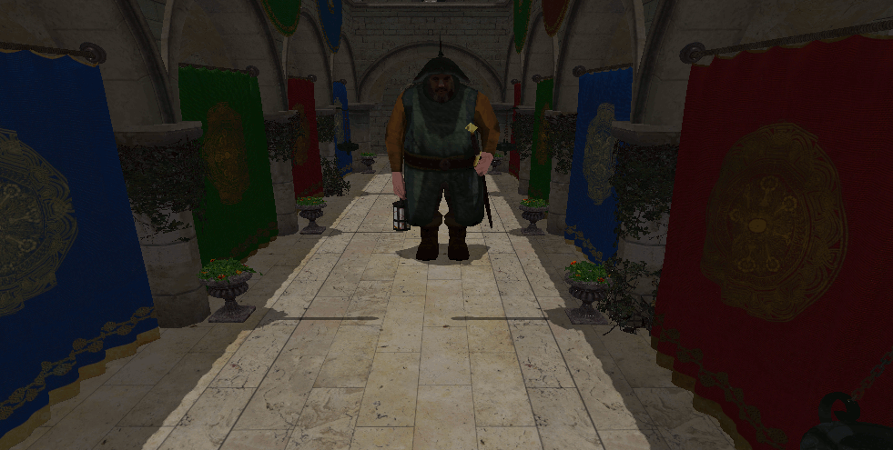

# Chapter 14 - Deferred Rendering (I)

In this chapter we will setup the basis to implement deferred shading. We will split the rendering into two phases, one to render the geometry and relevant parameters of the
scene and another one to apply lighting. In this chapter we will only setup the basis, leaving the changes required to apply lighting for the next chapter. We will not be
introducing new Vulkan concepts, just combine the ones we have described previously to support deferred shading. Therefore, you will see larger chunks of code with an
explanatory overview, focusing on the key concepts of Vulkan that need to be applied to implement deferred shading.

You can find the complete source code for this chapter [here](../../booksamples/chapter-14).

## Deferred shading

Up to now the way that we are rendering a 3D scene is called forward rendering. Deferred rendering is frequently used when having multiple lights and usually consists of two phases. In the first phase data that is required for shading computation is generated (depth values, albedo colors, material properties, etc.). In the second phase, taking all that information as inputs lighting is applied to each fragment. 

Hence, with deferred shading we perform two rendering phases. The first one, is the geometry pass, where we render the scene to several attachments that will contain the following information:

- The diffuse colors for each position. We call this the albedo.
- The normals at each position.
- Depth values.
- Other materials information,

All that information is stored in attachments, as the depth attachment used in previous chapters.

The second pass is called the lighting phase. This phase takes a shape that fills up all the screen and generates the final color information, using lighting, for each
fragment using as inputs the attachment outputs generated in the previous phase. When performing the lighting pass, the depth test in the geometry phase will have already
removed all the scene data that is not be seen. Hence, the number of operations to be done are restricted to what will be displayed on the screen.

## Attachments

We will start by encapsulating the attachments that we will use as outputs in the scene render stage and as inputs in the lighting pass. We will do this in a new class named `MrtAttachments` which is defined like this:

```java
package org.vulkanb.eng.graph.scn;

import org.lwjgl.vulkan.VkExtent2D;
import org.vulkanb.eng.graph.vk.*;

import java.util.*;

import static org.lwjgl.vulkan.VK13.*;

public class MrtAttachments {

    public static final int ALBEDO_FORMAT = VK_FORMAT_R16G16B16A16_SFLOAT;
    public static final int DEPTH_FORMAT = VK_FORMAT_D16_UNORM;
    private final List<Attachment> colorAttachments;
    private final Attachment deptAttachment;
    private final int height;
    private final int width;

    public MrtAttachments(VkCtx vkCtx) {
        VkExtent2D extent2D = vkCtx.getSwapChain().getSwapChainExtent();
        width = extent2D.width();
        height = extent2D.height();
        colorAttachments = new ArrayList<>();

        // Albedo attachment
        var attachment = new Attachment(vkCtx, width, height, ALBEDO_FORMAT, VK_IMAGE_USAGE_COLOR_ATTACHMENT_BIT);
        colorAttachments.add(attachment);

        // Depth attachment
        deptAttachment = new Attachment(vkCtx, width, height, DEPTH_FORMAT, VK_IMAGE_USAGE_DEPTH_STENCIL_ATTACHMENT_BIT);
    }

    public void cleanup(VkCtx vkCtx) {
        colorAttachments.forEach(a -> a.cleanup(vkCtx));
        deptAttachment.cleanup(vkCtx);
    }

    public List<Attachment> getAllAttachments() {
        List<Attachment> result = new ArrayList<>(colorAttachments);
        result.add(deptAttachment);
        return result;
    }

    public List<Attachment> getColorAttachments() {
        return colorAttachments;
    }

    public Attachment getDepthAttachment() {
        return deptAttachment;
    }

    public int getHeight() {
        return height;
    }

    public int getWidth() {
        return width;
    }
}
```

As you can see, we initialize an array of `Attachment` instances which is composed by the following elements:

- The first attachment will store the albedo of the scene. We will store that information using an image of `VK_FORMAT_R16G16B16A16_SFLOAT` format (16 bits per each RGBA channel). We state that this a color attachment by using the `VK_IMAGE_USAGE_COLOR_ATTACHMENT_BIT` flag.
- The second and last attachment (by now) just stores the depth information, and uses the same formats as the depth attachment used in previous chapters.

The class provides methods to access the attachments, to get the size of them, to free the resources and to get the reference to the depth attachment.

We will need to sample the attachments where we render the scene, therefore we will modify the `Attachment` class to support this:

```java
public class Attachment {
    ...
    public Attachment(VkCtx vkCtx, int width, int height, int format, int usage) {
        ...
        if ((usage & VK_IMAGE_USAGE_COLOR_ATTACHMENT_BIT) > 0) {
            aspectMask = VK_IMAGE_ASPECT_COLOR_BIT;
            imageData.usage(usage | VK_IMAGE_USAGE_SAMPLED_BIT | VK_IMAGE_USAGE_COLOR_ATTACHMENT_BIT);
            depthAttachment = false;
        }
        if ((usage & VK_IMAGE_USAGE_DEPTH_STENCIL_ATTACHMENT_BIT) > 0) {
            imageData.usage(usage | VK_IMAGE_USAGE_SAMPLED_BIT);
            aspectMask = VK_IMAGE_ASPECT_DEPTH_BIT;
            depthAttachment = true;
        }
        image = new Image(vkCtx, imageData);
        ...
    }
    ...
}
```

## Scene render modifications

We need to modify the `SceneRender` class to use the `MrtAttachment` class:

```java
public class ScnRender {
    ...
    private final VkBuffer buffProjMatrix;
    private final VkBuffer[] buffViewMatrices;
    private final VkClearValue clrValueColor;
    private final VkClearValue clrValueDepth;
    private final DescSetLayout descLayoutFrgStorage;
    private final DescSetLayout descLayoutTexture;
    private final DescSetLayout descLayoutVtxUniform;
    private final Pipeline pipeline;
    private final ByteBuffer pushConstBuff;
    private final TextureSampler textureSampler;
    private VkRenderingAttachmentInfo.Buffer attInfoColor;
    private VkRenderingAttachmentInfo attInfoDepth;
    private MrtAttachments mrtAttachments;
    private VkRenderingInfo renderInfo;

    public ScnRender(VkCtx vkCtx, EngCtx engCtx) {
        ...
        mrtAttachments = new MrtAttachments(vkCtx);
        attInfoColor = createColorAttachmentsInfo(mrtAttachments, clrValueColor);
        attInfoDepth = createDepthAttachmentInfo(mrtAttachments, clrValueDepth);
        renderInfo = createRenderInfo(vkCtx, attInfoColor, attInfoDepth);
        ...
    }
    ...
}
```

We will not be creating the color and depth attachments but using the `MrtAttachments`. In next chapters we will see that we will need more than color (albedo)
and depth attachment but one also for normals, etc. We need to modify several methods to adapt to this change:

```java
public class ScnRender {
    ...
    private static VkRenderingAttachmentInfo.Buffer createColorAttachmentsInfo(MrtAttachments mrtAttachments, VkClearValue clearValue) {
        List<Attachment> colorAttachments = mrtAttachments.getColorAttachments();
        int numAttachments = colorAttachments.size();
        VkRenderingAttachmentInfo.Buffer result = VkRenderingAttachmentInfo.calloc(numAttachments);
        for (int i = 0; i < numAttachments; ++i) {
            result.get(i)
                    .sType$Default()
                    .imageView(colorAttachments.get(i).getImageView().getVkImageView())
                    .imageLayout(VK_IMAGE_LAYOUT_COLOR_ATTACHMENT_OPTIMAL)
                    .loadOp(VK_ATTACHMENT_LOAD_OP_CLEAR)
                    .storeOp(VK_ATTACHMENT_STORE_OP_STORE)
                    .clearValue(clearValue);
        }
        return result;
    }

    private static VkRenderingAttachmentInfo createDepthAttachmentInfo(MrtAttachments mrtAttachments, VkClearValue clearValue) {
        return VkRenderingAttachmentInfo.calloc()
                .sType$Default()
                .imageView(mrtAttachments.getDepthAttachment().getImageView().getVkImageView())
                .imageLayout(VK_IMAGE_LAYOUT_DEPTH_STENCIL_ATTACHMENT_OPTIMAL)
                .loadOp(VK_ATTACHMENT_LOAD_OP_CLEAR)
                .storeOp(VK_ATTACHMENT_STORE_OP_DONT_CARE)
                .clearValue(clearValue);
    }

    private static Pipeline createPipeline(VkCtx vkCtx, ShaderModule[] shaderModules, DescSetLayout[] descSetLayouts) {
        var vtxBuffStruct = new VtxBuffStruct();
        var buildInfo = new PipelineBuildInfo(shaderModules, vtxBuffStruct.getVi(), MrtAttachments.ALBEDO_FORMAT)
                .setDepthFormat(MrtAttachments.DEPTH_FORMAT)
                .setPushConstRanges(
                        new PushConstRange[]{
                                new PushConstRange(VK_SHADER_STAGE_VERTEX_BIT, 0, VkUtils.MAT4X4_SIZE),
                                new PushConstRange(VK_SHADER_STAGE_FRAGMENT_BIT, VkUtils.MAT4X4_SIZE, VkUtils.INT_SIZE),
                        })
                .setDescSetLayouts(descSetLayouts)
                .setUseBlend(true);
        var pipeline = new Pipeline(vkCtx, buildInfo);
        vtxBuffStruct.cleanup();
        return pipeline;
    }

    private static VkRenderingInfo createRenderInfo(VkCtx vkCtx, VkRenderingAttachmentInfo.Buffer colorAttachments,
                                                    VkRenderingAttachmentInfo depthAttachments) {
        SwapChain swapChain = vkCtx.getSwapChain();
        VkExtent2D extent = swapChain.getSwapChainExtent();
        VkRenderingInfo result = VkRenderingInfo.calloc();
        try (var stack = MemoryStack.stackPush()) {
            var renderArea = VkRect2D.calloc(stack).extent(extent);
            result.sType$Default()
                    .renderArea(renderArea)
                    .layerCount(1)
                    .pColorAttachments(colorAttachments)
                    .pDepthAttachment(depthAttachments);
        }
        return result;
    }
    ...
}
```

We are preparing the `createColorAttachmentsInfo` to use more than one attachments. By now, we will be using just one for the color (albedo). The `createPipeline` needs
also to be slightly modify because the output formats are now defined as constants in the `MrtAttachments` class. We need tup date also the `cleanup`method to take into
consideration the changes and will provide a *getter* to access the attachments:

```java
public class ScnRender {
    ...
    public void cleanup(VkCtx vkCtx) {
        pipeline.cleanup(vkCtx);
        Arrays.asList(buffViewMatrices).forEach(b -> b.cleanup(vkCtx));
        descLayoutTexture.cleanup(vkCtx);
        textureSampler.cleanup(vkCtx);
        descLayoutFrgStorage.cleanup(vkCtx);
        buffProjMatrix.cleanup(vkCtx);
        descLayoutVtxUniform.cleanup(vkCtx);
        renderInfo.free();
        attInfoDepth.free();
        mrtAttachments.cleanup(vkCtx);
        attInfoColor.free();
        MemoryUtil.memFree(pushConstBuff);
        clrValueDepth.free();
        clrValueColor.free();
    }

    public MrtAttachments getMrtAttachments() {
        return mrtAttachments;
    }
    ...
}
```

The `render` method needs also to be modified:
```java
public class ScnRender {
    ...
    public void render(EngCtx engCtx, VkCtx vkCtx, CmdBuffer cmdBuffer, ModelsCache modelsCache,
                       MaterialsCache materialsCache, int currentFrame) {
        try (var stack = MemoryStack.stackPush()) {
            VkCommandBuffer cmdHandle = cmdBuffer.getVkCommandBuffer();

            List<Attachment> attachments = mrtAttachments.getColorAttachments();
            int numAttachments = attachments.size();
            for (int i = 0; i < numAttachments; i++) {
                Attachment attachment = attachments.get(i);
                VkUtils.imageBarrier(stack, cmdHandle, attachment.getImage().getVkImage(),
                        VK_IMAGE_LAYOUT_UNDEFINED, VK_IMAGE_LAYOUT_COLOR_ATTACHMENT_OPTIMAL,
                        VK_PIPELINE_STAGE_2_TOP_OF_PIPE_BIT, VK_PIPELINE_STAGE_2_COLOR_ATTACHMENT_OUTPUT_BIT,
                        VK_ACCESS_NONE, VK_ACCESS_2_COLOR_ATTACHMENT_WRITE_BIT,
                        VK_IMAGE_ASPECT_COLOR_BIT);
            }
            ...
            int width = mrtAttachments.getWidth();
            int height = mrtAttachments.getHeight();
            ...
        }
    }
    ...
}
```
 Changes are minimal, we just change how we set image barriers, because the attachments are now retrieved through `MrtAttachments` class. We also prepare the method
 to handle more than one color attachment (although bny now juw ill have just one). The resize method also needs to be updated:

```java
public class ScnRender {
    ...
    public void resize(EngCtx engCtx, VkCtx vkCtx) {
        renderInfo.free();
        attInfoDepth.free();
        mrtAttachments.cleanup(vkCtx);
        Arrays.asList(attInfoColor).forEach(VkRenderingAttachmentInfo.Buffer::free);

        mrtAttachments = new MrtAttachments(vkCtx);
        attInfoColor = createColorAttachmentsInfo(mrtAttachments, clrValueColor);
        attInfoDepth = createDepthAttachmentInfo(mrtAttachments, clrValueDepth);
        renderInfo = createRenderInfo(vkCtx, attInfoColor, attInfoDepth);

        VkUtils.copyMatrixToBuffer(vkCtx, buffProjMatrix, engCtx.scene().getProjection().getProjectionMatrix(), 0);
    }
    ...
}
```

The vertex shader, does not need to be changed, however the fragment shader (`scn_frg.glsl`) is slightly modified:

```glsl
#version 450

// Keep in sync manually with Java code
const int MAX_TEXTURES = 100;

layout(location = 0) in vec2 inTextCoords;

layout(location = 0) out vec4 outAlbedo;

struct Material {
    vec4 diffuseColor;
    uint hasTexture;
    uint textureIdx;
    uint padding[2];
};

layout(set = 2, binding = 0) readonly buffer MaterialUniform {
    Material materials[];
} matUniform;

layout(set = 3, binding = 0) uniform sampler2D textSampler[MAX_TEXTURES];

layout(push_constant) uniform pc {
    layout(offset = 64) uint materialIdx;
} push_constants;

void main()
{
    Material material = matUniform.materials[push_constants.materialIdx];
    if (material.hasTexture == 1) {
        outAlbedo = texture(textSampler[material.textureIdx], inTextCoords);
    } else {
        outAlbedo = material.diffuseColor;
    }
}
```

The fragment shader is almost identical, we have changed the output attachment name by `outAlbedo`.

## Light render

We are ready now to develop the code needed to support the lighting phase. The rendering tasks of the lighting phase will be done in a new class named `LightRender` which
starts like this:

```java
public class LightRender {

    private static final int COLOR_FORMAT = VK_FORMAT_R32G32B32A32_SFLOAT;
    private static final String DESC_ID_ATT = "LIGHT_DESC_ID_ATT";
    private static final String FRAGMENT_SHADER_FILE_GLSL = "resources/shaders/light_frg.glsl";
    private static final String FRAGMENT_SHADER_FILE_SPV = FRAGMENT_SHADER_FILE_GLSL + ".spv";
    private static final String VERTEX_SHADER_FILE_GLSL = "resources/shaders/light_vtx.glsl";
    private static final String VERTEX_SHADER_FILE_SPV = VERTEX_SHADER_FILE_GLSL + ".spv";

    private final DescSetLayout attDescSetLayout;
    private final VkClearValue clrValueColor;
    private final Pipeline pipeline;
    private final TextureSampler textureSampler;
    private Attachment attColor;
    private VkRenderingAttachmentInfo.Buffer attInfoColor;
    private VkRenderingInfo renderInfo;

    public LightRender(VkCtx vkCtx, List<Attachment> attachments) {
        clrValueColor = VkClearValue.calloc().color(
                c -> c.float32(0, 0.0f).float32(1, 0.0f).float32(2, 0.0f).float32(3, 0.0f));

        attColor = createColorAttachment(vkCtx);
        attInfoColor = createColorAttachmentInfo(attColor, clrValueColor);
        renderInfo = createRenderInfo(attColor, attInfoColor);

        ShaderModule[] shaderModules = createShaderModules(vkCtx);

        var textureSamplerInfo = new TextureSamplerInfo(VK_SAMPLER_ADDRESS_MODE_REPEAT,
                VK_BORDER_COLOR_INT_OPAQUE_BLACK, 1, true);
        textureSampler = new TextureSampler(vkCtx, textureSamplerInfo);
        int numAttachments = attachments.size();
        DescSetLayout.LayoutInfo[] descSetLayouts = new DescSetLayout.LayoutInfo[numAttachments];
        for (int i = 0; i < numAttachments; i++) {
            descSetLayouts[i] = new DescSetLayout.LayoutInfo(VK_DESCRIPTOR_TYPE_COMBINED_IMAGE_SAMPLER, i, 1, VK_SHADER_STAGE_FRAGMENT_BIT);
        }
        attDescSetLayout = new DescSetLayout(vkCtx, descSetLayouts);

        createAttDescSet(vkCtx, attDescSetLayout, attachments, textureSampler);

        pipeline = createPipeline(vkCtx, shaderModules, new DescSetLayout[]{attDescSetLayout});
        Arrays.asList(shaderModules).forEach(s -> s.cleanup(vkCtx));
    }
    ...
}
```

The constructor is similar to the one used in `PostRender` class. We will be rendering to an image just dumping color. We will use a quad to cover the whole clip area
and sample from the output attachments used while rendering the scene. This is why we create as many descriptor set layouts as attachments we will have. Helper methods

```java
public class LightRender {
    ...
    private static void createAttDescSet(VkCtx vkCtx, DescSetLayout descSetLayout, List<Attachment> attachments,
                                         TextureSampler sampler) {
        DescAllocator descAllocator = vkCtx.getDescAllocator();
        Device device = vkCtx.getDevice();
        DescSet descSet = descAllocator.addDescSet(device, DESC_ID_ATT, descSetLayout);
        List<ImageView> imageViews = new ArrayList<>();
        attachments.forEach(a -> imageViews.add(a.getImageView()));
        descSet.setImages(device, imageViews, sampler, 0);
    }

    private static Attachment createColorAttachment(VkCtx vkCtx) {
        SwapChain swapChain = vkCtx.getSwapChain();
        VkExtent2D swapChainExtent = swapChain.getSwapChainExtent();
        return new Attachment(vkCtx, swapChainExtent.width(), swapChainExtent.height(),
                COLOR_FORMAT, VK_IMAGE_USAGE_COLOR_ATTACHMENT_BIT);
    }

    private static VkRenderingAttachmentInfo.Buffer createColorAttachmentInfo(Attachment attachment, VkClearValue clearValue) {
        return VkRenderingAttachmentInfo.calloc(1)
                .sType$Default()
                .imageView(attachment.getImageView().getVkImageView())
                .imageLayout(VK_IMAGE_LAYOUT_COLOR_ATTACHMENT_OPTIMAL)
                .loadOp(VK_ATTACHMENT_LOAD_OP_CLEAR)
                .storeOp(VK_ATTACHMENT_STORE_OP_STORE)
                .clearValue(clearValue);
    }

    private static Pipeline createPipeline(VkCtx vkCtx, ShaderModule[] shaderModules, DescSetLayout[] descSetLayouts) {
        var vtxBuffStruct = new EmptyVtxBuffStruct();
        var buildInfo = new PipelineBuildInfo(shaderModules, vtxBuffStruct.getVi(), COLOR_FORMAT)
                .setDescSetLayouts(descSetLayouts)
                .setUseBlend(true);
        var pipeline = new Pipeline(vkCtx, buildInfo);
        vtxBuffStruct.cleanup();
        return pipeline;
    }

    private static VkRenderingInfo createRenderInfo(Attachment colorAttachment, VkRenderingAttachmentInfo.Buffer colorAttachmentInfo) {
        VkRenderingInfo result;
        try (var stack = MemoryStack.stackPush()) {
            VkExtent2D extent = VkExtent2D.calloc(stack);
            extent.width(colorAttachment.getImage().getWidth());
            extent.height(colorAttachment.getImage().getHeight());
            var renderArea = VkRect2D.calloc(stack).extent(extent);

            result = VkRenderingInfo.calloc()
                    .sType$Default()
                    .renderArea(renderArea)
                    .layerCount(1)
                    .pColorAttachments(colorAttachmentInfo);
        }
        return result;
    }

    private static ShaderModule[] createShaderModules(VkCtx vkCtx) {
        if (EngCfg.getInstance().isShaderRecompilation()) {
            ShaderCompiler.compileShaderIfChanged(VERTEX_SHADER_FILE_GLSL, Shaderc.shaderc_glsl_vertex_shader);
            ShaderCompiler.compileShaderIfChanged(FRAGMENT_SHADER_FILE_GLSL, Shaderc.shaderc_glsl_fragment_shader);
        }
        return new ShaderModule[]{
                new ShaderModule(vkCtx, VK_SHADER_STAGE_VERTEX_BIT, VERTEX_SHADER_FILE_SPV, null),
                new ShaderModule(vkCtx, VK_SHADER_STAGE_FRAGMENT_BIT, FRAGMENT_SHADER_FILE_SPV, null),
        };
    }
    ...
}
```

We define also a `cleanup` method and a *getter* to access the output attachment:

```java
public class LightRender {
    ...
    public void cleanup(VkCtx vkCtx) {
        pipeline.cleanup(vkCtx);
        attDescSetLayout.cleanup(vkCtx);
        textureSampler.cleanup(vkCtx);
        renderInfo.free();
        attColor.cleanup(vkCtx);
        attInfoColor.free();
        clrValueColor.free();
    }

    public Attachment getAttachment() {
        return attColor;
    }
    ...
}
```

The `render` method is quite similar also as the one used in the `GuiRender` class:

```java
public class LightRender {
    ...
    public void render(VkCtx vkCtx, CmdBuffer cmdBuffer, MrtAttachments mrtAttachments) {
        try (var stack = MemoryStack.stackPush()) {
            VkCommandBuffer cmdHandle = cmdBuffer.getVkCommandBuffer();

            VkUtils.imageBarrier(stack, cmdHandle, attColor.getImage().getVkImage(),
                    VK_IMAGE_LAYOUT_UNDEFINED, VK_IMAGE_LAYOUT_COLOR_ATTACHMENT_OPTIMAL,
                    VK_PIPELINE_STAGE_2_TOP_OF_PIPE_BIT, VK_PIPELINE_STAGE_2_COLOR_ATTACHMENT_OUTPUT_BIT,
                    VK_ACCESS_2_NONE, VK_ACCESS_2_COLOR_ATTACHMENT_WRITE_BIT,
                    VK_IMAGE_ASPECT_COLOR_BIT);

            List<Attachment> attachments = mrtAttachments.getColorAttachments();
            int numAttachments = attachments.size();
            for (int i = 0; i < numAttachments; i++) {
                Attachment attachment = attachments.get(i);
                VkUtils.imageBarrier(stack, cmdHandle, attachment.getImage().getVkImage(),
                        VK_IMAGE_LAYOUT_COLOR_ATTACHMENT_OPTIMAL, VK_IMAGE_LAYOUT_SHADER_READ_ONLY_OPTIMAL,
                        VK_PIPELINE_STAGE_2_COLOR_ATTACHMENT_OUTPUT_BIT, VK_PIPELINE_STAGE_2_FRAGMENT_SHADER_BIT,
                        VK_ACCESS_2_COLOR_ATTACHMENT_WRITE_BIT, VK_ACCESS_2_SHADER_READ_BIT,
                        VK_IMAGE_ASPECT_COLOR_BIT);
            }

            vkCmdBeginRendering(cmdHandle, renderInfo);

            vkCmdBindPipeline(cmdHandle, VK_PIPELINE_BIND_POINT_GRAPHICS, pipeline.getVkPipeline());

            Image colorImage = attColor.getImage();
            int width = colorImage.getWidth();
            int height = colorImage.getHeight();
            var viewport = VkViewport.calloc(1, stack)
                    .x(0)
                    .y(height)
                    .height(-height)
                    .width(width)
                    .minDepth(0.0f)
                    .maxDepth(1.0f);
            vkCmdSetViewport(cmdHandle, 0, viewport);

            var scissor = VkRect2D.calloc(1, stack)
                    .extent(it -> it.width(width).height(height))
                    .offset(it -> it.x(0).y(0));
            vkCmdSetScissor(cmdHandle, 0, scissor);

            DescAllocator descAllocator = vkCtx.getDescAllocator();
            LongBuffer descriptorSets = stack.mallocLong(1)
                    .put(0, descAllocator.getDescSet(DESC_ID_ATT).getVkDescriptorSet());
            vkCmdBindDescriptorSets(cmdHandle, VK_PIPELINE_BIND_POINT_GRAPHICS,
                    pipeline.getVkPipelineLayout(), 0, descriptorSets, null);

            vkCmdDraw(cmdHandle, 3, 1, 0, 0);

            vkCmdEndRendering(cmdHandle);
        }
    }
    ...
}
```

We just set the barriers associated to the output attachments used while rendering the scene. We need all the previous commands to have finished writing to those images. 
After that we just set up the view port and the scissor and just draw a quad as in the post processing stage.

We also define a resize method:

```java
public class LightRender {
    ...
    public void resize(VkCtx vkCtx, List<Attachment> attachments) {
        renderInfo.free();
        attInfoColor.free();
        attColor.cleanup(vkCtx);

        attColor = createColorAttachment(vkCtx);
        attInfoColor = createColorAttachmentInfo(attColor, clrValueColor);
        renderInfo = createRenderInfo(attColor, attInfoColor);

        DescSet descSet = vkCtx.getDescAllocator().getDescSet(DESC_ID_ATT);
        var imageViews = new ArrayList<ImageView>();
        attachments.forEach(a -> imageViews.add(a.getImageView()));
        descSet.setImages(vkCtx.getDevice(), imageViews, textureSampler, 0);
    }    ...
}
```

It is the turn now to view the shaders used in the lighting phase, this is the vertex shader (`light_vtx.glsl`):

```glsl
#version 450

layout(location = 0) out vec2 outTextCoord;

void main()
{
    outTextCoord = vec2((gl_VertexIndex << 1) & 2, gl_VertexIndex & 2);
    gl_Position = vec4(outTextCoord.x * 2.0f - 1.0f, outTextCoord.y * - 2.0f + 1.0f, 0.0f, 1.0f);
}
```

You can see that it is identical as the one used in the post processing stage. The fragment shader (`light_frg.glsl`) is defined like this:

```glsl
#version 450

layout(location = 0) in vec2 inTextCoord;

layout(location = 0) out vec4 outFragColor;

layout(set = 0, binding = 0) uniform sampler2D albedoSampler;
layout(set = 0, binding = 1) uniform sampler2D depthSampler;

void main() {
    outFragColor = vec4(texture(albedoSampler, inTextCoord).rgb, 1.0);
}
```

By now we will not apply lighting, we will just return the albedo color associated to the current coordinates sampling the attachment that contains albedo information.

Finally, we just need to update the `Render` class to use the new render class:

```java
public class Render {
    ...
    private final LightRender lightRender;
    ...
    public Render(EngCtx engCtx) {
        ...
        lightRender = new LightRender(vkCtx, scnRender.getMrtAttachments().getAllAttachments());
        postRender = new PostRender(vkCtx, lightRender.getAttachment());
        ...
    }

    public void cleanup() {
        ...
        lightRender.cleanup(vkCtx);
        ...
    }
    ...
    public void render(EngCtx engCtx) {
        ...
        lightRender.render(vkCtx, cmdBuffer, scnRender.getMrtAttachments());
        postRender.render(vkCtx, cmdBuffer, lightRender.getAttachment());
        ...
    }

    private void resize(EngCtx engCtx) {
        ...
        lightRender.resize(vkCtx, scnRender.getMrtAttachments().getAllAttachments());
        postRender.resize(vkCtx, lightRender.getAttachment());
        ...
    }
    ...
}
```

As you can see, the input attachment of the GUI render class is now the output attachment used to render the light stage.

In the `Main` class we just remove sound effects:

```java
package org.vulkanb;

import org.joml.*;
import org.tinylog.Logger;
import org.vulkanb.eng.*;
import org.vulkanb.eng.model.*;
import org.vulkanb.eng.scene.*;
import org.vulkanb.eng.wnd.*;

import java.lang.Math;
import java.util.*;

import static org.lwjgl.glfw.GLFW.*;

public class Main implements IGameLogic {

    private static final float MOUSE_SENSITIVITY = 0.1f;
    private static final float MOVEMENT_SPEED = 0.01f;

    public static void main(String[] args) {
        Logger.info("Starting application");
        var engine = new Engine("Vulkan Book", new Main());
        Logger.info("Started application");
        engine.run();
    }

    @Override
    public void cleanup() {
        // To be implemented
    }

    @Override
    public InitData init(EngCtx engCtx) {
        Scene scene = engCtx.scene();
        List<ModelData> models = new ArrayList<>();

        ModelData sponzaModel = ModelLoader.loadModel("resources/models/sponza/Sponza.json");
        models.add(sponzaModel);
        Entity sponzaEntity = new Entity("SponzaEntity", sponzaModel.id(), new Vector3f(0.0f, 0.0f, 0.0f));
        scene.addEntity(sponzaEntity);

        List<MaterialData> materials = new ArrayList<>(ModelLoader.loadMaterials("resources/models/sponza/Sponza_mat.json"));

        Camera camera = scene.getCamera();
        camera.setPosition(0.0f, 5.0f, 0.0f);
        camera.setRotation((float) Math.toRadians(20.0f), (float) Math.toRadians(90.f));

        return new InitData(models, materials, null);
    }

    @Override
    public void input(EngCtx engCtx, long diffTimeMillis) {
        Scene scene = engCtx.scene();
        Window window = engCtx.window();

        KeyboardInput ki = window.getKeyboardInput();
        float move = diffTimeMillis * MOVEMENT_SPEED;
        Camera camera = scene.getCamera();
        if (ki.keyPressed(GLFW_KEY_W)) {
            camera.moveForward(move);
        } else if (ki.keyPressed(GLFW_KEY_S)) {
            camera.moveBackwards(move);
        }
        if (ki.keyPressed(GLFW_KEY_A)) {
            camera.moveLeft(move);
        } else if (ki.keyPressed(GLFW_KEY_D)) {
            camera.moveRight(move);
        }
        if (ki.keyPressed(GLFW_KEY_UP)) {
            camera.moveUp(move);
        } else if (ki.keyPressed(GLFW_KEY_DOWN)) {
            camera.moveDown(move);
        }

        MouseInput mi = window.getMouseInput();
        if (mi.isRightButtonPressed()) {
            Vector2f deltaPos = mi.getDeltaPos();
            camera.addRotation((float) Math.toRadians(-deltaPos.y * MOUSE_SENSITIVITY),
                    (float) Math.toRadians(-deltaPos.x * MOUSE_SENSITIVITY));
        }
    }

    @Override
    public void update(EngCtx engCtx, long diffTimeMillis) {
        // To be implemented
    }
}
```

With all these changes, you will get something  like this:



Do not despair, it is exactly the same result as in the previous chapter, you will see in next chapter how we will dramatically improve the visuals. In this chapter we have just set the basis for deferred rendering.

[Next chapter](../chapter-15/chapter-15.md)
