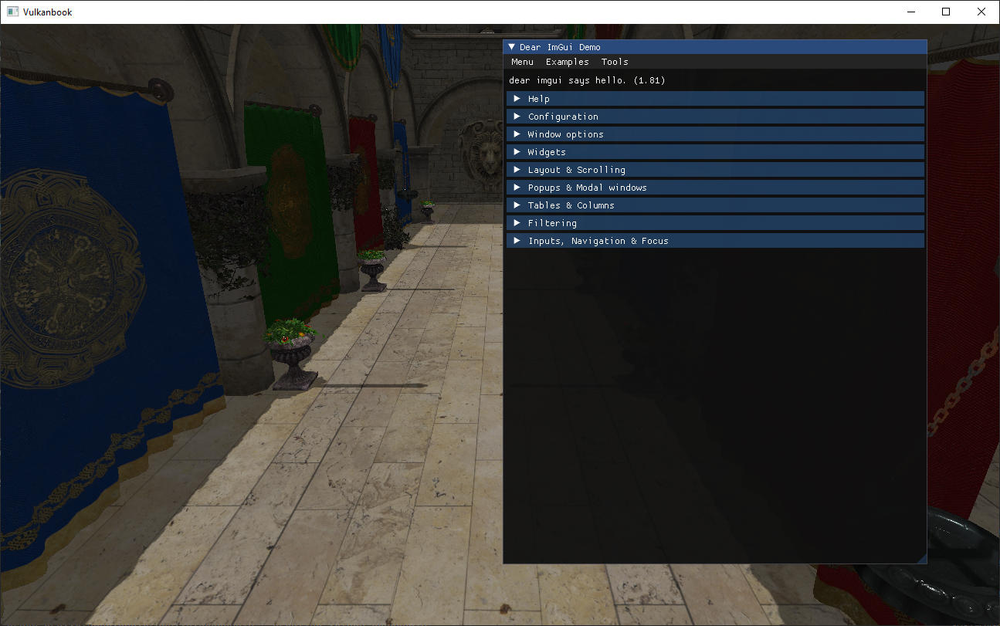

# GUI

In this chapter we will add the capability to display Graphical User Interfaces (GUI) on top of the rendered scene. We will use the [Dear ImGui library](https://github.com/ocornut/imgui) through the [imgui-java](https://github.com/SpaiR/imgui-java) wrapper. ImGui is a light-weight GUI library render-agnostic which can be used with OpenGL, DirectX or Vulkan. We can construct complex GUIs, capable of reacting to user input, and get its output as vertex buffers which we can render in our application as other regular shape. The purpose of this chapter is not to explain ImGui deeply, but to show how can be integrated with our Vulkan based render pipeline.

You can find the complete source code for this chapter [here](../../booksamples/chapter-15).

## Imgui-java dependencies

The first step is to add the [imgui-java](https://github.com/SpaiR/imgui-java) dependencies in the project's `pom.xml` file (The `imgui-java.version` property is defined in the root project `poml.xml` file):

```xml
<?xml version="1.0" encoding="UTF-8"?>
    ...
    <dependencies>
        ...
        <dependency>
            <groupId>io.github.spair</groupId>
            <artifactId>imgui-java-binding</artifactId>
            <version>${imgui-java.version}</version>
        </dependency>
        ...
        <dependency>
            <groupId>io.github.spair</groupId>
            <artifactId>imgui-java-${native.target}</artifactId>
            <version>${imgui-java.version}</version>
            <scope>runtime</scope>
        </dependency>
    </dependencies>
</project>
```

## Render the GUI

In this case, we will be rendering the GUI elements over the scene. Since we will not be applying any post effects to the GUI, such as lighting, we will render them just after the lighting phase has been completed. In order to do that, we will handle GUI rendering in a new class named `GuiRenderActivity`, which starts like this:
```java
public class GuiRenderActivity {

    private static final String GUI_FRAGMENT_SHADER_FILE_GLSL = "resources/shaders/gui_fragment.glsl";
    private static final String GUI_FRAGMENT_SHADER_FILE_SPV = GUI_FRAGMENT_SHADER_FILE_GLSL + ".spv";
    private static final String GUI_VERTEX_SHADER_FILE_GLSL = "resources/shaders/gui_vertex.glsl";
    private static final String GUI_VERTEX_SHADER_FILE_SPV = GUI_VERTEX_SHADER_FILE_GLSL + ".spv";

    private DescriptorPool descriptorPool;
    private DescriptorSetLayout[] descriptorSetLayouts;
    private Device device;
    private Texture fontsTexture;
    private TextureSampler fontsTextureSampler;
    private VulkanBuffer[] indicesBuffers;
    private Pipeline pipeline;
    private ShaderProgram shaderProgram;
    private SwapChain swapChain;
    private TextureDescriptorSet textureDescriptorSet;
    private DescriptorSetLayout.SamplerDescriptorSetLayout textureDescriptorSetLayout;
    private VulkanBuffer[] vertexBuffers;

    public GuiRenderActivity(SwapChain swapChain, CommandPool commandPool, Queue queue, PipelineCache pipelineCache,
                             long vkRenderPass) {
        this.swapChain = swapChain;
        device = swapChain.getDevice();

        createShaders();
        createUIResources(swapChain, commandPool, queue);
        createDescriptorPool();
        createDescriptorSets();
        createPipeline(pipelineCache, vkRenderPass);
    }

    public void cleanup() {
        textureDescriptorSetLayout.cleanup();
        fontsTextureSampler.cleanup();
        descriptorPool.cleanup();
        fontsTexture.cleanup();
        Arrays.stream(vertexBuffers).filter(Objects::nonNull).forEach(VulkanBuffer::cleanup);
        Arrays.stream(indicesBuffers).filter(Objects::nonNull).forEach(VulkanBuffer::cleanup);
        ImGui.destroyContext();
        pipeline.cleanup();
        shaderProgram.cleanup();
    }
    ...
}
```

The constructor is quite similar to the other `*Activity` classes. In order to render the GUI, we need specific shaders, so we create a `ShaderProgram` in the `createShaders` method:
```java
public class GuiRenderActivity {
    ...
    private void createShaders() {
        EngineProperties engineProperties = EngineProperties.getInstance();
        if (engineProperties.isShaderRecompilation()) {
            ShaderCompiler.compileShaderIfChanged(GUI_VERTEX_SHADER_FILE_GLSL, Shaderc.shaderc_glsl_vertex_shader);
            ShaderCompiler.compileShaderIfChanged(GUI_FRAGMENT_SHADER_FILE_GLSL, Shaderc.shaderc_glsl_fragment_shader);
        }
        shaderProgram = new ShaderProgram(device, new ShaderProgram.ShaderModuleData[]
                {
                        new ShaderProgram.ShaderModuleData(VK_SHADER_STAGE_VERTEX_BIT, GUI_VERTEX_SHADER_FILE_SPV),
                        new ShaderProgram.ShaderModuleData(VK_SHADER_STAGE_FRAGMENT_BIT, GUI_FRAGMENT_SHADER_FILE_SPV),
                });
    }
    ...
}
```

In the `createUIResources` method, we initialize the resources required by ImGui:
```java
public class GuiRenderActivity {
    ...
    private void createUIResources(SwapChain swapChain, CommandPool commandPool, Queue queue) {
        ImGui.createContext();

        ImGuiIO imGuiIO = ImGui.getIO();
        imGuiIO.setIniFilename(null);
        VkExtent2D swapChainExtent = swapChain.getSwapChainExtent();
        imGuiIO.setDisplaySize(swapChainExtent.width(), swapChainExtent.height());
        imGuiIO.setDisplayFramebufferScale(1.0f, 1.0f);

        ImInt texWidth = new ImInt();
        ImInt texHeight = new ImInt();
        ByteBuffer buf = imGuiIO.getFonts().getTexDataAsRGBA32(texWidth, texHeight);
        fontsTexture = new Texture(device, buf, texWidth.get(), texHeight.get(), VK_FORMAT_R8G8B8A8_SRGB);

        CommandBuffer cmd = new CommandBuffer(commandPool, true, true);
        cmd.beginRecording();
        fontsTexture.recordTextureTransition(cmd);
        cmd.endRecording();
        cmd.submitAndWait(device, queue);
        cmd.cleanup();

        vertexBuffers = new VulkanBuffer[swapChain.getNumImages()];
        indicesBuffers = new VulkanBuffer[swapChain.getNumImages()];
    }
    ...
}
```
In the `createUIResources` method, we first need to call the `ImGui` `createContext` function. This should be the very first call prior to invoking any other ImGui functions. After that, we retrieve a reference to the `ImGuiIO`, and call the `setIniFilename` method. The reason for doing that, is that ImGui, by default, will create a file named `imgui.ini` when the context is destroyed. This `imgui.ini` file will hold the position and size of the GUI elements, so they can be restored to their last positions. We will not be using that feature, so we set `null` as the parameter of the `setIniFilename` to deactivate that feature. After that, we set the display size and a scale. The next step is to load the texture that will be used to render fonts in a `Texture` instance, which will be transitioned to the adequate final layout. The final step is to create buffer arrays that will hold the vertices data and their indices (we will use sepparate buffers per swapchain image to be able to change them when they are being accessed by the previous image).

In order to load the texture, we need to modify the `Texture` class to be able to receive the texture data directly in a `ByteBuffer`. The common code used in both constructors has been extracted to the `createTextureResources` method.
```java
public class Texture {
    ...
    public Texture(Device device, String fileName, int imageFormat) {
        Logger.debug("Creating texture [{}]", fileName);
        recordedTransition = false;
        this.fileName = fileName;
        ByteBuffer buf;
        try (MemoryStack stack = MemoryStack.stackPush()) {
            IntBuffer w = stack.mallocInt(1);
            IntBuffer h = stack.mallocInt(1);
            IntBuffer channels = stack.mallocInt(1);

            buf = stbi_load(fileName, w, h, channels, 4);
            if (buf == null) {
                throw new RuntimeException("Image file [" + fileName + "] not loaded: " + stbi_failure_reason());
            }
            setHasTransparencies(buf);

            width = w.get();
            height = h.get();
            mipLevels = (int) Math.floor(log2(Math.min(width, height))) + 1;

            createTextureResources(device, buf, imageFormat);
        }

        stbi_image_free(buf);
    }

    public Texture(Device device, ByteBuffer buf, int width, int height, int imageFormat) {
        this.width = width;
        this.height = height;
        mipLevels = 1;

        createTextureResources(device, buf, imageFormat);
    }
    ...
    private void createTextureResources(Device device, ByteBuffer buf, int imageFormat) {
        createStgBuffer(device, buf);
        Image.ImageData imageData = new Image.ImageData().width(width).height(height).
                usage(VK_IMAGE_USAGE_TRANSFER_SRC_BIT | VK_IMAGE_USAGE_TRANSFER_DST_BIT | VK_IMAGE_USAGE_SAMPLED_BIT).
                format(imageFormat).mipLevels(mipLevels);
        image = new Image(device, imageData);
        ImageView.ImageViewData imageViewData = new ImageView.ImageViewData().format(image.getFormat()).
                aspectMask(VK_IMAGE_ASPECT_COLOR_BIT).mipLevels(mipLevels);
        imageView = new ImageView(device, image.getVkImage(), imageViewData);
    }
    ...
}
```

The `CommandBuffer` class has also been modified by adding a new method, called `submitAndWait` that allow us to submit it to a queue and wait for its execution to finish by waiting on a fence. It is used in the `GuiRenderActivity` class to submit the image layout transition.
```java
public class CommandBuffer {
    ...
    public void submitAndWait(Device device, Queue queue) {
        Fence fence = new Fence(device, true);
        fence.reset();
        try (MemoryStack stack = MemoryStack.stackPush()) {
            queue.submit(stack.pointers(vkCommandBuffer), null, null, null, fence);
        }
        fence.fenceWait();
        fence.cleanup();
    }
}
```

Going back to the `GuiRenderActivity` class, the `createDescriptorPool` and the `createDescriptorSets` are quite simple. In this specific case, we will just be using one descriptor set for the font texture.
```java
public class GuiRenderActivity {
    ...
    private void createDescriptorPool() {
        List<DescriptorPool.DescriptorTypeCount> descriptorTypeCounts = new ArrayList<>();
        descriptorTypeCounts.add(new DescriptorPool.DescriptorTypeCount(1, VK_DESCRIPTOR_TYPE_COMBINED_IMAGE_SAMPLER));
        descriptorPool = new DescriptorPool(device, descriptorTypeCounts);
    }

    private void createDescriptorSets() {
        textureDescriptorSetLayout = new DescriptorSetLayout.SamplerDescriptorSetLayout(device, 0, VK_SHADER_STAGE_FRAGMENT_BIT);
        descriptorSetLayouts = new DescriptorSetLayout[]{
                textureDescriptorSetLayout,
        };
        fontsTextureSampler = new TextureSampler(device, 1);
        textureDescriptorSet = new TextureDescriptorSet(descriptorPool, textureDescriptorSetLayout, fontsTexture,
                fontsTextureSampler, 0);
    }    
    ...
}
```

In the `createPipeline` we just set up the pipeline used for rendering the GUI:
```java
public class GuiRenderActivity {
    ...
    private void createPipeline(PipelineCache pipelineCache, long vkRenderPass) {
        Pipeline.PipeLineCreationInfo pipeLineCreationInfo = new Pipeline.PipeLineCreationInfo(vkRenderPass,
                shaderProgram, 1, false, true, GraphConstants.FLOAT_LENGTH * 2,
                new ImGuiVertexBufferStructure(), descriptorSetLayouts);
        pipeline = new Pipeline(pipelineCache, pipeLineCreationInfo);
        pipeLineCreationInfo.cleanup();
    }
    ...
}
```
As we will see when examining the GUI shaders, we will use push constants to pass a scaling factor (composed by two floats). We need also to use a different vertex buffer structure, which will be defined in the `ImGuiVertexBufferStructure` class. ImGui vertices are defined by two coordinates (`x` and `y`), the texture coordinates and a color (in RGBA format), therefore we cannot use the same structure used for the scene models (defined in the `VertexBufferStructure` class). The `ImGuiVertexBufferStructure` class is defined like this:
```java
package org.vulkanb.eng.graph.gui;

import org.lwjgl.vulkan.*;
import org.vulkanb.eng.graph.vk.*;

import static org.lwjgl.vulkan.VK10.*;

public class ImGuiVertexBufferStructure extends VertexInputStateInfo {

    public static final int VERTEX_SIZE = GraphConstants.FLOAT_LENGTH * 5;
    private static final int NUMBER_OF_ATTRIBUTES = 3;
    private VkVertexInputAttributeDescription.Buffer viAttrs;
    private VkVertexInputBindingDescription.Buffer viBindings;

    public ImGuiVertexBufferStructure() {
        viAttrs = VkVertexInputAttributeDescription.calloc(NUMBER_OF_ATTRIBUTES);
        viBindings = VkVertexInputBindingDescription.calloc(1);
        vi = VkPipelineVertexInputStateCreateInfo.calloc();

        int i = 0;
        // Position
        viAttrs.get(i)
                .binding(0)
                .location(i)
                .format(VK_FORMAT_R32G32_SFLOAT)
                .offset(0);

        // Texture coordinates
        i++;
        viAttrs.get(i)
                .binding(0)
                .location(i)
                .format(VK_FORMAT_R32G32_SFLOAT)
                .offset(GraphConstants.FLOAT_LENGTH * 2);

        // Color
        i++;
        viAttrs.get(i)
                .binding(0)
                .location(i)
                .format(VK_FORMAT_R8G8B8A8_UNORM)
                .offset(GraphConstants.FLOAT_LENGTH * 4);

        viBindings.get(0)
                .binding(0)
                .stride(VERTEX_SIZE)
                .inputRate(VK_VERTEX_INPUT_RATE_VERTEX);

        vi
                .sType(VK_STRUCTURE_TYPE_PIPELINE_VERTEX_INPUT_STATE_CREATE_INFO)
                .pVertexBindingDescriptions(viBindings)
                .pVertexAttributeDescriptions(viAttrs);
    }

    @Override
    public void cleanup() {
        super.cleanup();
        viBindings.free();
        viAttrs.free();
    }
}
```

Going back to the `GuiRenderActivity`, it is the turn now to examine the `recordCommandBuffer` method which will record the drawing commands that will render the GUI:
```java
public class GuiRenderActivity {
    ...
    public void recordCommandBuffer(Scene scene, CommandBuffer commandBuffer) {
        try (MemoryStack stack = MemoryStack.stackPush()) {
            int idx = swapChain.getCurrentFrame();

            IGuiInstance guiInstance = scene.getGuiInstance();
            if (guiInstance == null) {
                return;
            }
            guiInstance.drawGui();
            updateBuffers(idx);

            VkExtent2D swapChainExtent = swapChain.getSwapChainExtent();
            int width = swapChainExtent.width();
            int height = swapChainExtent.height();
            if (vertexBuffers[idx] == null) {
                return;
            }

            VkCommandBuffer cmdHandle = commandBuffer.getVkCommandBuffer();

            vkCmdBindPipeline(cmdHandle, VK_PIPELINE_BIND_POINT_GRAPHICS, pipeline.getVkPipeline());

            VkViewport.Buffer viewport = VkViewport.calloc(1, stack)
                    .x(0)
                    .y(height)
                    .height(-height)
                    .width(width)
                    .minDepth(0.0f)
                    .maxDepth(1.0f);
            vkCmdSetViewport(cmdHandle, 0, viewport);

            LongBuffer vtxBuffer = stack.mallocLong(1);
            vtxBuffer.put(0, vertexBuffers[idx].getBuffer());
            LongBuffer offsets = stack.mallocLong(1);
            offsets.put(0, 0L);
            vkCmdBindVertexBuffers(cmdHandle, 0, vtxBuffer, offsets);
            vkCmdBindIndexBuffer(cmdHandle, indicesBuffers[idx].getBuffer(), 0, VK_INDEX_TYPE_UINT16);

            ImGuiIO io = ImGui.getIO();
            FloatBuffer pushConstantBuffer = stack.mallocFloat(2);
            pushConstantBuffer.put(0, 2.0f / io.getDisplaySizeX());
            pushConstantBuffer.put(1, -2.0f / io.getDisplaySizeY());
            vkCmdPushConstants(cmdHandle, pipeline.getVkPipelineLayout(),
                    VK_SHADER_STAGE_VERTEX_BIT, 0, pushConstantBuffer);

            LongBuffer descriptorSets = stack.mallocLong(1)
                    .put(0, this.textureDescriptorSet.getVkDescriptorSet());
            vkCmdBindDescriptorSets(cmdHandle, VK_PIPELINE_BIND_POINT_GRAPHICS,
                    pipeline.getVkPipelineLayout(), 0, descriptorSets, null);

            ImVec4 imVec4 = new ImVec4();
            VkRect2D.Buffer rect = VkRect2D.calloc(1, stack);
            ImDrawData imDrawData = ImGui.getDrawData();
            int numCmdLists = imDrawData.getCmdListsCount();
            int offsetIdx = 0;
            int offsetVtx = 0;
            for (int i = 0; i < numCmdLists; i++) {
                int cmdBufferSize = imDrawData.getCmdListCmdBufferSize(i);
                for (int j = 0; j < cmdBufferSize; j++) {
                    imDrawData.getCmdListCmdBufferClipRect(i, j, imVec4);
                    rect.offset(it -> it.x((int) Math.max(imVec4.x, 0)).y((int) Math.max(imVec4.y, 1)));
                    rect.extent(it -> it.width((int) (imVec4.z - imVec4.x)).height((int) (imVec4.w - imVec4.y)));
                    vkCmdSetScissor(cmdHandle, 0, rect);
                    int numElements = imDrawData.getCmdListCmdBufferElemCount(i, j);
                    vkCmdDrawIndexed(cmdHandle, numElements, 1, offsetIdx, offsetVtx, 0);
                    offsetIdx += numElements;
                }
                offsetVtx += imDrawData.getCmdListVtxBufferSize(i);
            }
        }
    }
    ...
}
```

The first thing you may notice is that we receive a reference to a `CommandBuffer` instance where we will record the drawing commands. As it has been said before, we will use the same command buffer used in the lighting phase, therefore, we need that as a parameter. The first thing we do in the `recordCommandBuffer`, method is retrieve the current image and access the `Scene` class to retrieve the GUI instance. This is a new attribute in the `Scene` class which will hold an implementation responsible of actually invoking ImGui functions that will define the GUI elements (the calls to construct the GUI). Depending on the application state, the GUI elements will be different, therefore that construction cannot reside in the `GuiRenderActivity` class, this should be done in the application which will properly set the `IGuiInstance` instance which needs to be used in each instant through that new attribute in the `Scene` class. If there is a GUI implementation we call the `drawGui` method. If there is no value for that, it means that we should not display any GUI and we just need to return. We will see later on some sample implementations for the `IGuiInstance` interface, which just defines a single method to draw the GUI elements:
```java
package org.vulkanb.eng.scene;

public interface IGuiInstance {
    void drawGui();
}
```

Going back to the the `recordCommandBuffer` of the `GuiRenderActivity` class, after calling the `drawGui` method, ImGui will have updated its internal buffers that will hold the vertices and indices data required to render the GUI. After that we need to be able to use that data in our GPU. This is what the `updateBuffers` method do, it copies ImGui data to Vulkan buffers that can be used for rendering the GUI. We will see the implementation later on, but it is important to keep in mind what this method does. Yo may notice that we add an extra check about updating the buffers to see if they are null for the current frame. The reason for this is that ImGui may need a frame to figure out the proper size of the elements if the windows do not have a fixed size. Therefore, buffers may not have been populated, and we will need to wait for the next frame.

The next step is to bind the pipeline, set the view port and bind the buffers that will hold the GUI vertices and indices. After that, we setup a push constants buffer which will have a scale factor. ImGui will use a coordinate system which sets `(0, 0)` at the top left corner of the screen and `(width, height)` as the the bottom right corner, being `width` and `height` the values set in the `ImGuiIO` `setDisplaySize` method call. We need to transform from that coordinate system to one in the range of `[-1, 1]` for x and y axis, which will be done in the vertex shader with the help of that scaling factor. After that, we iterate over the buffer subsets defined by ImGui, applying a start and end offset along with a scissor area to limit the drawing region. For each of those regions, we submit a drawing command.

Let us review now the `updateBuffers` method:
```java
public class GuiRenderActivity {
    ...
    private void updateBuffers(int idx) {
        ImDrawData imDrawData = ImGui.getDrawData();

        int vertexBufferSize = imDrawData.getTotalVtxCount() * ImGuiVertexBufferStructure.VERTEX_SIZE;
        int indexBufferSize = imDrawData.getTotalIdxCount() * GraphConstants.SHORT_LENGTH;

        if (vertexBufferSize == 0 || indexBufferSize == 0) {
            return;
        }
        VulkanBuffer vertexBuffer = vertexBuffers[idx];
        if (vertexBuffer == null || vertexBufferSize != vertexBuffer.getRequestedSize()) {
            if (vertexBuffer != null) {
                vertexBuffer.cleanup();
            }
            vertexBuffer = new VulkanBuffer(device, vertexBufferSize, VK_BUFFER_USAGE_VERTEX_BUFFER_BIT,
                    VK_MEMORY_PROPERTY_HOST_VISIBLE_BIT, 0);
            vertexBuffers[idx] = vertexBuffer;
        }

        VulkanBuffer indicesBuffer = indicesBuffers[idx];
        if (indicesBuffer == null || indexBufferSize != indicesBuffer.getRequestedSize()) {
            if (indicesBuffer != null) {
                indicesBuffer.cleanup();
            }
            indicesBuffer = new VulkanBuffer(device, indexBufferSize, VK_BUFFER_USAGE_INDEX_BUFFER_BIT,
                    VK_MEMORY_PROPERTY_HOST_VISIBLE_BIT, 0);
            indicesBuffers[idx] = indicesBuffer;
        }

        ByteBuffer dstVertexBuffer = MemoryUtil.memByteBuffer(vertexBuffer.map(), vertexBufferSize);
        ByteBuffer dstIdxBuffer = MemoryUtil.memByteBuffer(indicesBuffer.map(), indexBufferSize);

        int numCmdLists = imDrawData.getCmdListsCount();
        for (int i = 0; i < numCmdLists; i++) {
            ByteBuffer imguiVertexBuffer = imDrawData.getCmdListVtxBufferData(i);
            dstVertexBuffer.put(imguiVertexBuffer);

            // Always get the indices buffer after finishing with the vertices buffer
            ByteBuffer imguiIndicesBuffer = imDrawData.getCmdListIdxBufferData(i);
            dstIdxBuffer.put(imguiIndicesBuffer);
        }

        vertexBuffer.flush();
        indicesBuffer.flush();

        vertexBuffer.unMap();
        indicesBuffer.unMap();
    }
    ...
}
```

As it has been shown above, we will have two set of buffers, one for the vertices and the other one for the indices. We will have as many buffers as swap chain images we have, to be able to update them while they are being used in the render process of the previous image. The first thing we do in the `updateBuffers` method is to retrieve the total number of vertices and indices required by the GUI defined by the `IGuiInstance` implementation. If the buffers have not been created yet or the number of vertices and indices they hold are different (this means that the GUI elements have changed), we create new Vulkan buffers. The buffers need to have the `VK_MEMORY_PROPERTY_HOST_VISIBLE_BIT` flag so we can access them from both the GPU and the application. After that, we just copy the vertices and indices data to those buffers. Once the data has been copied, we call a new method in the `VulkanBuffer` class named `flush`. The rationale for that is that we have not used the `VK_MEMORY_PROPERTY_HOST_COHERENT_BIT` flag when creating the Vulkan buffers. Therefore, we need to ensure that the buffer data is available to the GPU (For this type of frequent writes to host visible buffers, this should be the preferred approach according to [this reference](https://gpuopen.com/learn/vulkan-device-memory/)). The new `flush` method in the `VulkanBuffer` class is defined like this (when not using Vma, we should just call the `vkFlushMappedMemoryRanges` function. Since we are using Vma, we need to call the equivalent function `vmaFlushAllocation`):
```java
public class VulkanBuffer {
    ...
    public void flush() {
        vmaFlushAllocation(device.getMemoryAllocator().getVmaAllocator(), allocation, 0, this.requestedSize);
    }
    ...
}
```

Indices values are stored as unsigned shorts, therefore, we have defined a new constant to define the number of bytes of a short in the `GraphConstants` class (which is used in the `updateBuffers` method from the `GuiRenderActivity` class):
```java
public final class GraphConstants {
    ...
    public static final int SHORT_LENGTH = 2;
    ...
}
``` 

Finally, the `GuiRenderActivity` class, defines a `resize` method that should be invoked when the render area changes its size. In this methods, we just update the ImGui display size:
```java
public class GuiRenderActivity {
    ...
    public void resize(SwapChain swapChain) {
        this.swapChain = swapChain;
        ImGuiIO imGuiIO = ImGui.getIO();
        VkExtent2D swapChainExtent = swapChain.getSwapChainExtent();
        imGuiIO.setDisplaySize(swapChainExtent.width(), swapChainExtent.height());
    }    
    ...
}
```

The vertex shader used for rendering the GUI is quite simple, we just transform the coordinates so they are in the `[-1, 1]` range and output the texture coordinates and color so they can be used in the fragment shader:
```glsl
#version 450

layout (location = 0) in vec2 inPos;
layout (location = 1) in vec2 inTextCoords;
layout (location = 2) in vec4 inColor;

layout (push_constant) uniform PushConstants {
    vec2 scale;
} pushConstants;

layout (location = 0) out vec2 outTextCoords;
layout (location = 1) out vec4 outColor;

out gl_PerVertex
{
    vec4 gl_Position;
};

void main()
{
    outTextCoords = inTextCoords;
    outColor = inColor;
    gl_Position = vec4(inPos * pushConstants.scale + vec2(-1.0, 1.0), 0.0, 1.0);
}
```

In the fragment shader we just output the combination of the vertex color and the texture color associated to its texture coordinates:
```glsl
#version 450

layout (location = 0) in vec2 inTextCoords;
layout (location = 1) in vec4 inColor;

layout (binding = 0) uniform sampler2D fontsSampler;

layout (location = 0) out vec4 outColor;

void main()
{
    outColor = inColor  * texture(fontsSampler, inTextCoords);
}
```

## Complete the changes

Now we need to put the new `GuiRenderActivity` class into play, so we will start with the changes in the `Render` class:
```java
public class Render {
    ...
    private final GuiRenderActivity guiRenderActivity;
    ...
    public Render(Window window, Scene scene) {
        ...
        guiRenderActivity = new GuiRenderActivity(swapChain, commandPool, graphQueue, pipelineCache,
                lightingRenderActivity.getLightingFrameBuffer().getLightingRenderPass().getVkRenderPass());
    }

    public void cleanup() {
        ...
        guiRenderActivity.cleanup();
        ...
    }
    ...
    public void render(Window window, Scene scene) {
        ...
        commandBuffer = lightingRenderActivity.beginRecording(shadowRenderActivity.getShadowCascades());
        lightingRenderActivity.recordCommandBuffer(commandBuffer);
        guiRenderActivity.recordCommandBuffer(scene, commandBuffer);
        lightingRenderActivity.endRecording(commandBuffer);
        ...
    }

    private void resize(Window window) {
        ...
        guiRenderActivity.resize(swapChain);
    }
}
```

We need to instantiate the `GuiRenderActivity` class in the `Render` constructor and free it in the `cleanup` method. The biggest changes are in the `render` method, where, because we use the same command buffer in the lighting and GUI rendering classes, we need to split the code previously contained in the `LightingRenderActivity` `recordCommandBuffer` method. We have created the `beginRecording` method in the `LightingRenderActivity` class that prepares and returns the command buffer to be used for a specific frame. Once we have recorded all the drawing commands, we finish the recording by calling the new `endRecording` methods in that same `LightingRenderActivity` class. Finally, in the `resize` method we need to propagate the call also to the `GuiRenderActivity` class.

Here are the changes in the `LightingRenderActivity` class:
```java
public class LightingRenderActivity {
    ...
    public CommandBuffer beginRecording(List<CascadeShadow> cascadeShadows) {
        int idx = swapChain.getCurrentFrame();

        Fence fence = fences[idx];
        CommandBuffer commandBuffer = commandBuffers[idx];

        fence.fenceWait();
        fence.reset();

        updateLights(scene.getAmbientLight(), scene.getLights(), scene.getCamera().getViewMatrix(), lightsBuffers[idx]);
        updateInvMatrices(invMatricesBuffers[idx]);
        updateCascadeShadowMatrices(cascadeShadows, shadowsMatricesBuffers[idx]);

        commandBuffer.reset();
        commandBuffer.beginRecording();

        return commandBuffer;
    }
    ...
    public void endRecording(CommandBuffer commandBuffer) {
        vkCmdEndRenderPass(commandBuffer.getVkCommandBuffer());
        commandBuffer.endRecording();
    }

    public LightingFrameBuffer getLightingFrameBuffer() {
        return lightingFrameBuffer;
    }
    ...
    public void recordCommandBuffer(CommandBuffer commandBuffer) {
        try (MemoryStack stack = MemoryStack.stackPush()) {
            int idx = swapChain.getCurrentFrame();
            VkExtent2D swapChainExtent = swapChain.getSwapChainExtent();
            int width = swapChainExtent.width();
            int height = swapChainExtent.height();

            FrameBuffer frameBuffer = lightingFrameBuffer.getFrameBuffers()[idx];

            commandBuffer.reset();
            VkClearValue.Buffer clearValues = VkClearValue.calloc(1, stack);
            clearValues.apply(0, v -> v.color().float32(0, 0.0f).float32(1, 0.0f).float32(2, 0.0f).float32(3, 1));

            VkRect2D renderArea = VkRect2D.calloc(stack);
            renderArea.offset().set(0, 0);
            renderArea.extent().set(width, height);

            VkRenderPassBeginInfo renderPassBeginInfo = VkRenderPassBeginInfo.calloc(stack)
                    .sType(VK_STRUCTURE_TYPE_RENDER_PASS_BEGIN_INFO)
                    .renderPass(lightingFrameBuffer.getLightingRenderPass().getVkRenderPass())
                    .pClearValues(clearValues)
                    .framebuffer(frameBuffer.getVkFrameBuffer())
                    .renderArea(renderArea);

            commandBuffer.beginRecording();
            VkCommandBuffer cmdHandle = commandBuffer.getVkCommandBuffer();
            vkCmdBeginRenderPass(cmdHandle, renderPassBeginInfo, VK_SUBPASS_CONTENTS_INLINE);

            vkCmdBindPipeline(cmdHandle, VK_PIPELINE_BIND_POINT_GRAPHICS, pipeline.getVkPipeline());

            VkViewport.Buffer viewport = VkViewport.calloc(1, stack)
                    .x(0)
                    .y(height)
                    .height(-height)
                    .width(width)
                    .minDepth(0.0f)
                    .maxDepth(1.0f);
            vkCmdSetViewport(cmdHandle, 0, viewport);

            VkRect2D.Buffer scissor = VkRect2D.calloc(1, stack)
                    .extent(it -> it
                            .width(width)
                            .height(height))
                    .offset(it -> it
                            .x(0)
                            .y(0));
            vkCmdSetScissor(cmdHandle, 0, scissor);

            LongBuffer descriptorSets = stack.mallocLong(4)
                    .put(0, attachmentsDescriptorSet.getVkDescriptorSet())
                    .put(1, lightsDescriptorSets[idx].getVkDescriptorSet())
                    .put(2, invMatricesDescriptorSets[idx].getVkDescriptorSet())
                    .put(3, shadowsMatricesDescriptorSets[idx].getVkDescriptorSet());
            vkCmdBindDescriptorSets(cmdHandle, VK_PIPELINE_BIND_POINT_GRAPHICS,
                    pipeline.getVkPipelineLayout(), 0, descriptorSets, null);

            vkCmdDraw(cmdHandle, 3, 1, 0, 0);
        }
    }

    public void resize(SwapChain swapChain, List<Attachment> attachments) {
        this.swapChain = swapChain;
        attachmentsDescriptorSet.update(attachments);
        lightingFrameBuffer.resize(swapChain);
    }
    ...
}
```

The `Scene` class needs to be modified to store a reference to the active `IGuiInstance`:
```java
public class Scene {
    ...
    private IGuiInstance guiInstance;
    ...
    public IGuiInstance getGuiInstance() {
        return guiInstance;
    }
    ...
    public void setGuiInstance(IGuiInstance guiInstance) {
        this.guiInstance = guiInstance;
    }
    ...
}
```

We will modify also the `Engine` class to check if the input has been handled by ImGui prior to delegating the input handling to the `IAppLogic` instance. By doing so, the application can opt to not respond to user input.
```java
public class Engine {
    ...
    private boolean handleInputGui() {
        ImGuiIO imGuiIO = ImGui.getIO();
        MouseInput mouseInput = window.getMouseInput();
        Vector2f mousePos = mouseInput.getCurrentPos();
        imGuiIO.setMousePos(mousePos.x, mousePos.y);
        imGuiIO.setMouseDown(0, mouseInput.isLeftButtonPressed());
        imGuiIO.setMouseDown(1, mouseInput.isRightButtonPressed());

        return imGuiIO.getWantCaptureMouse() || imGuiIO.getWantCaptureKeyboard();
    }

    public void run() {
        ...
        while (running && !window.shouldClose()) {
            ...
            if (deltaU >= 1) {
                ...
                long diffTimeNanos = currentTime - updateTime;
                boolean inputConsumed = handleInputGui();
                appLogic.handleInput(window, scene, diffTimeNanos, inputConsumed);
                ...
            }
            ...
        }
        ...
    }
    ...
}
```

This change requires to modify the `IAppLogic` `handleInput` method to receive an extra `boolean` parameter which flags that the input has been consumed by the GUI.
```java
public interface IAppLogic {
    ...
    void handleInput(Window window, Scene scene, long diffTimeMillis, boolean inputConsumed);
    ...
}
```

To complete the minor changes, the `VulkanModel` class has also been modified to use the new `CommandBuffer` method `submitAndWait`:
```java
public class VulkanModel {
    ...
    public static List<VulkanModel> transformModels(List<ModelData> modelDataList, TextureCache textureCache,
                                                    CommandPool commandPool, Queue queue) {
        ...
        cmd.endRecording();
        cmd.submitAndWait(device, queue);
        cmd.cleanup();
        ...
    }
    ...
}
```

The final step is to modify the `Main` class to set different GUIs depending on the key pressed by the user. We define two implementations of the `IGuiInstance` interface that will show ImGui demo window and an empty window as inner classes.
```java
public class Main implements IAppLogic {
    ...
    @Override
    public void handleInput(Window window, Scene scene, long diffTimeMillis, boolean inputConsumed) {
        ...
        if (window.isKeyPressed(GLFW_KEY_0)) {
            scene.setGuiInstance(null);
        } else if (window.isKeyPressed(GLFW_KEY_1)) {
            scene.setGuiInstance(new DemoGui());
        } else if (window.isKeyPressed(GLFW_KEY_2)) {
            scene.setGuiInstance(new SimpleGui());
        }
        ...
    }

    @Override
    public void init(Window window, Scene scene, Render render) {
        ...
        scene.setGuiInstance(new DemoGui());
        ...
    }
    ...
}
```

The final result is shown in the next figure.



[Next chapter](../chapter-16/chapter-16.md)