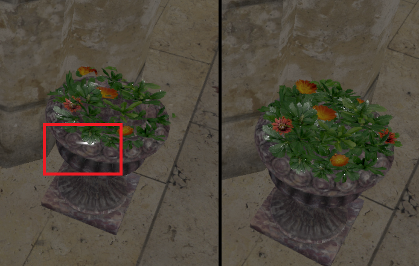
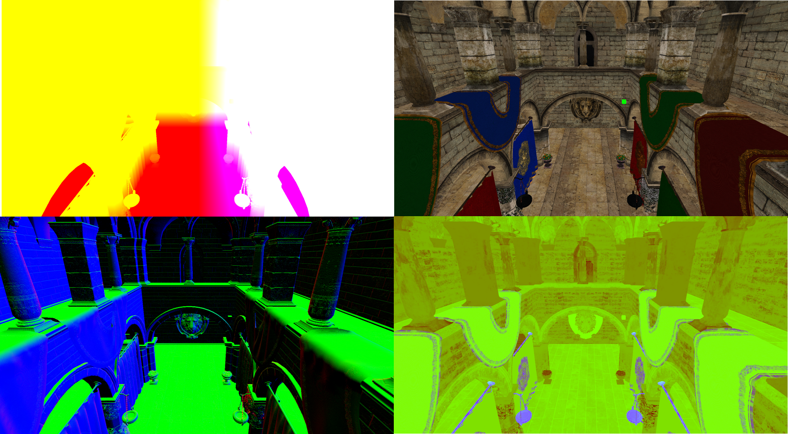
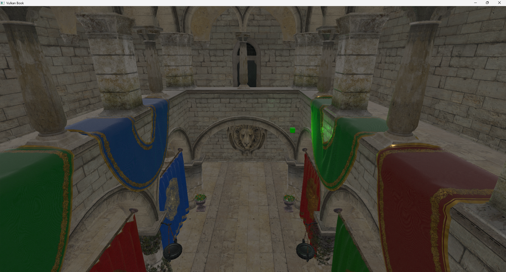

# Chapter 15 - Deferred Rendering (II)

In this chapter we will complete deferred shading example by adding support for lights and PBR (Physically based rendering) to improve the visuals.

You can find the complete source code for this chapter [here](../../booksamples/chapter-15).

## PBR

PBR tries to bring a more realistic way of handling lights, compared with simpler models such as Phong or Blinn-Phon models, but still keeping it simple enough so it can be applied in real time. Instead of trying to summarize here what PBR consists of I will link to the best tutorial I've found about this: [https://learnopengl.com/PBR/Theory](https://learnopengl.com/PBR/Theory). In that link you will be able to read about theory and to see how it can be implemented. In fact, most of the PBR computation functions lighting fragment shader source code are a copy of the ones defined in that page (developed by [Joey de Vries](https://twitter.com/JoeyDeVriez) and licensed under the terms of the [CC BY-NC 4.0](https://creativecommons.org/licenses/by-nc/4.0/legalcode)).

## Material changes

We will need to modify the `ModelGenerator` class to load normal maps and PBR related material information from the models and dump it to generated files.
We will start with the `processMaterial` method, in which we will add the following code:

```java
public class ModelGenerator {
    ...
    private MaterialData processMaterial(AIScene aiScene, AIMaterial aiMaterial, String modelName, String baseDir, int pos)
            throws IOException {
        ...
        String diffuseTexture = processTexture(aiScene, aiMaterial, baseDir, aiTextureType_DIFFUSE);
        String normalTexture = processTexture(aiScene, aiMaterial, baseDir, aiTextureType_NORMALS);
        String metallicRoughTexture = processTexture(aiScene, aiMaterial, baseDir, AI_MATKEY_GLTF_PBRMETALLICROUGHNESS_METALLICROUGHNESS_TEXTURE);

        float[] metallicArr = new float[]{0.0f};
        int[] pMax = new int[]{1};
        result = aiGetMaterialFloatArray(aiMaterial, AI_MATKEY_METALLIC_FACTOR, aiTextureType_NONE, 0, metallicArr, pMax);
        if (result != aiReturn_SUCCESS) {
            metallicArr[0] = 0.0f;
        }

        float[] roughnessArr = new float[]{0.0f};
        result = aiGetMaterialFloatArray(aiMaterial, AI_MATKEY_ROUGHNESS_FACTOR, aiTextureType_NONE, 0, roughnessArr, pMax);
        if (result != aiReturn_SUCCESS) {
            roughnessArr[0] = 1.0f;
        }

        return new MaterialData(modelName + "-mat-" + pos, diffuseTexture, normalTexture, metallicRoughTexture, diffuse,
                roughnessArr[0], metallicArr[0]);
    }
    ...
}
```

We try to get normals map texture and PBR metallic roughness using existing `processTexture` method using `aiTextureType_NORMALS` and
`AI_MATKEY_GLTF_PBRMETALLICROUGHNESS_METALLICROUGHNESS_TEXTURE` texture types. We try to get metallic and roughness factors from material properties, in case, they do not
define a texture map by calling the `aiGetMaterialFloatArray` assimp function setting the flag `AI_MATKEY_METALLIC_FACTOR` for the metallic factor and
`AI_MATKEY_ROUGHNESS_FACTOR` for the roughness factor one. With all the information we can create the `MaterialData` instance, which now receives new parameters for the
normals map path, the metallic roughness texture and the metallic and roughness factors. These are the changes in the `MaterialData` class:

```java
package org.vulkanb.eng.model;

import org.joml.Vector4f;

public record MaterialData(String id, String texturePath, String normalMapPath, String metalRoughMap,
                           Vector4f diffuseColor, float roughnessFactor, float metallicFactor) {
}
```

Going back to the `ModelGenerator` class, we need to get also the normals of the model and the tangent and bitangent data (normals maps are defined in the so called tangent space. The tangent space is a coordinate system that is local to each triangle of the model. In that coordinate space the `z` axis always points out of the surface. This is the reason why a normal map is usually bluish, even for complex models with opposing faces). In order to work with that coordinate system we need the normals, tangent and bitangent. You can check a great tutorial on this aspect [here](https://learnopengl.com/Advanced-Lighting/Normal-Mapping).

Therefore, we will modify the `processMesh` method:

```java
public class ModelGenerator {
    ...
    private MeshData processMesh(AIMesh aiMesh, List<MaterialData> materialList, int meshPosition,
                                 ModelBinData modelBinData) throws IOException {
        List<Float> vertices = processVertices(aiMesh);
        List<Float> normals = processNormals(aiMesh);
        List<Float> tangents = processTangents(aiMesh, normals);
        List<Float> biTangents = processBitangents(aiMesh, normals);
        ...
        int vtxInc = (vtxSize + normals.size() + tangents.size() + biTangents.size() + textCoords.size()) * VkUtils.FLOAT_SIZE;
        for (int row = 0; row < rows; row++) {
            int startPos = row * 3;
            int startTextCoord = row * 2;
            vtxOutput.writeFloat(vertices.get(startPos));
            vtxOutput.writeFloat(vertices.get(startPos + 1));
            vtxOutput.writeFloat(vertices.get(startPos + 2));
            vtxOutput.writeFloat(normals.get(startPos));
            vtxOutput.writeFloat(normals.get(startPos + 1));
            vtxOutput.writeFloat(normals.get(startPos + 2));
            vtxOutput.writeFloat(tangents.get(startPos));
            vtxOutput.writeFloat(tangents.get(startPos + 1));
            vtxOutput.writeFloat(tangents.get(startPos + 2));
            vtxOutput.writeFloat(biTangents.get(startPos));
            vtxOutput.writeFloat(biTangents.get(startPos + 1));
            vtxOutput.writeFloat(biTangents.get(startPos + 2));
            vtxOutput.writeFloat(textCoords.get(startTextCoord));
            vtxOutput.writeFloat(textCoords.get(startTextCoord + 1));
        }
        ...
    }
    ...
}
```

We have defined new methods to get the normals, tangents and bitangents and use that data to write it in the binary output file which contains vertex information. The new methods are quite straight forward:

```java
public class ModelGenerator {
    ...
    private static List<Float> processBitangents(AIMesh aiMesh, List<Float> normals) {
        List<Float> biTangents = new ArrayList<>();
        AIVector3D.Buffer aiBitangents = aiMesh.mBitangents();
        while (aiBitangents != null && aiBitangents.remaining() > 0) {
            AIVector3D aiBitangent = aiBitangents.get();
            biTangents.add(aiBitangent.x());
            biTangents.add(aiBitangent.y());
            biTangents.add(aiBitangent.z());
        }

        // Assimp may not calculate tangents with models that do not have texture coordinates. Just create empty values
        if (biTangents.isEmpty()) {
            biTangents = new ArrayList<>(Collections.nCopies(normals.size(), 0.0f));
        }
        return biTangents;
    }

    private static List<Float> processNormals(AIMesh aiMesh) {
        List<Float> normals = new ArrayList<>();

        AIVector3D.Buffer aiNormals = aiMesh.mNormals();
        while (aiNormals != null && aiNormals.remaining() > 0) {
            AIVector3D aiNormal = aiNormals.get();
            normals.add(aiNormal.x());
            normals.add(aiNormal.y());
            normals.add(aiNormal.z());
        }
        return normals;
    }

    private static List<Float> processTangents(AIMesh aiMesh, List<Float> normals) {
        List<Float> tangents = new ArrayList<>();
        AIVector3D.Buffer aiTangents = aiMesh.mTangents();
        while (aiTangents != null && aiTangents.remaining() > 0) {
            AIVector3D aiTangent = aiTangents.get();
            tangents.add(aiTangent.x());
            tangents.add(aiTangent.y());
            tangents.add(aiTangent.z());
        }

        // Assimp may not calculate tangents with models that do not have texture coordinates. Just create empty values
        if (tangents.isEmpty()) {
            tangents = new ArrayList<>(Collections.nCopies(normals.size(), 0.0f));
        }
        return tangents;
    }
    ...
}
```

In order to get that data, we just call the `mNormals`, `mTangents` and `mBitangents` methods over an `AIMesh` instance to get those coordinates. Keep in mind that when we are loading that model using Assimp, we are using the `aiProcess_CalcTangentSpace` so the tangents and bitangents are automatically calculated even if they are not present in the model. The `ModelsCache` does not need to be modified since we just load the binary file which contains vertex information and dump it into a buffer. We will need to 
modify, however, `VtxBuffStruct` class to be able to include the normals, tangents and bitangents as new input attributes sop they can accessed in shaders:

```java
public class VtxBuffStruct {
    ...
    private static final int NORMAL_COMPONENTS = 3;
    private static final int NUMBER_OF_ATTRIBUTES = 5;
    ...
    public VtxBuffStruct() {
        ...
        // Normal
        i++;
        offset += POSITION_COMPONENTS * VkUtils.FLOAT_SIZE;
        viAttrs.get(i)
                .binding(0)
                .location(i)
                .format(VK_FORMAT_R32G32B32_SFLOAT)
                .offset(offset);

        // Tangent
        i++;
        offset += NORMAL_COMPONENTS * VkUtils.FLOAT_SIZE;
        viAttrs.get(i)
                .binding(0)
                .location(i)
                .format(VK_FORMAT_R32G32B32_SFLOAT)
                .offset(offset);

        // BiTangent
        i++;
        offset += NORMAL_COMPONENTS * VkUtils.FLOAT_SIZE;
        viAttrs.get(i)
                .binding(0)
                .location(i)
                .format(VK_FORMAT_R32G32B32_SFLOAT)
                .offset(offset);

        // Texture coordinates
        i++;
        offset += NORMAL_COMPONENTS * VkUtils.FLOAT_SIZE;
        ...
    }
    ...
}
```

We need to modify the `MaterialsCache` class to to hold the associated information for normal map and metallic-roughness textures and metallic and roughness factors.

```java
public class MaterialsCache {

    private static final int MATERIAL_SIZE = VkUtils.VEC4_SIZE + VkUtils.INT_SIZE * 4;
    ...
    public void loadMaterials(VkCtx vkCtx, List<MaterialData> materials, TextureCache textureCache, CmdPool cmdPool,
                              Queue queue) {
        ...
        for (int i = 0; i < numMaterials; i++) {
            ...
            material.diffuseColor().get(offset, data);
            offset += VkUtils.VEC4_SIZE;
            data.putInt(offset, hasTexture ? 1 : 0);
            offset += VkUtils.INT_SIZE;
            data.putInt(offset, textureCache.getPosition(texturePath));
            offset += VkUtils.INT_SIZE;

            String normalMapPath = material.normalMapPath();
            boolean hasNormalMap = normalMapPath != null && !normalMapPath.isEmpty();
            if (hasNormalMap) {
                textureCache.addTexture(vkCtx, normalMapPath, normalMapPath, VK_FORMAT_R8G8B8A8_UNORM);
            }
            data.putInt(offset, hasNormalMap ? 1 : 0);
            offset += VkUtils.INT_SIZE;
            data.putInt(offset, textureCache.getPosition(normalMapPath));
            offset += VkUtils.INT_SIZE;

            String roughMapPath = material.metalRoughMap();
            boolean hasRoughMap = roughMapPath != null && !roughMapPath.isEmpty();
            if (hasRoughMap) {
                textureCache.addTexture(vkCtx, roughMapPath, roughMapPath, VK_FORMAT_R8G8B8A8_UNORM);
            }
            data.putInt(offset, hasRoughMap ? 1 : 0);
            offset += VkUtils.INT_SIZE;
            data.putInt(offset, textureCache.getPosition(roughMapPath));
            offset += VkUtils.INT_SIZE;

            data.putFloat(offset, material.roughnessFactor());
            offset += VkUtils.FLOAT_SIZE;
            data.putFloat(offset, material.metallicFactor());
            offset += VkUtils.FLOAT_SIZE;
        }
        ...
    }
    ...
}
```

## Lights

In order to apply lighting we need to add support for lights. Therefore, the first thing we should do is create new class named `Light` which models a light:

```java
package org.vulkanb.eng.scene;

import org.joml.Vector3f;

public class Light {
    private final Vector3f color;
    private final boolean directional;
    private final Vector3f position;
    private float intensity;

    public Light(Vector3f position, boolean directional, float intensity, Vector3f color) {
        this.position = position;
        this.directional = directional;
        this.intensity = intensity;
        this.color = color;
    }

    public Vector3f getColor() {
        return color;
    }

    public float getIntensity() {
        return intensity;
    }

    public Vector3f getPosition() {
        return position;
    }

    public boolean isDirectional() {
        return directional;
    }

    public void setIntensity(float intensity) {
        this.intensity = intensity;
    }
}

```
We will support directional and point lights. A light is defined by a position (in the case of a point light) or a directional (in the case of a directional light, for example the sun light). When using directional lights, the `position` attribute 
will be the direction from the light source to the scene. Lights will also have a color and an intensity.

We will need also to add support for ambient light (a color that will be added to all the fragments independently of their position and normals). We will need a color for that light and an intensity. We will add this in the `Scene` class along with the list of lights.

```java
public class Scene {
    ...
    public static final int MAX_LIGHTS = 10;

    private final Vector3f ambientLightColor;
    ...
    private float ambientLightIntensity;
    private Light[] lights;
    ...
    public Scene(Window window) {
        ...
        ambientLightColor = new Vector3f();
        ambientLightIntensity = 0.0f;
    }
    ...
    public Vector3f getAmbientLightColor() {
        return ambientLightColor;
    }

    public float getAmbientLightIntensity() {
        return ambientLightIntensity;
    }
    ...
    public Light[] getLights() {
        return lights;
    }
    ...
    public void setAmbientLightIntensity(float ambientLightIntensity) {
        this.ambientLightIntensity = ambientLightIntensity;
    }

    public void setLights(Light[] lights) {
        int numLights = lights != null ? lights.length : 0;
        if (numLights > GraphConstants.MAX_LIGHTS) {
            throw new RuntimeException("Maximum number of lights set to: " + GraphConstants.MAX_LIGHTS);
        }
        this.lights = lights;
    }
}
```

We will see how we will use lighting information when viewing the modifications in the lighting stage.

## Scene render modifications

We will start by modifying the attachments that we will use as outputs in the scene render stage and as inputs in the lighting stage. This is done in the `MrtAttachments` class:

```java
public class MrtAttachments {
    ...
    public static final int DEPTH_FORMAT = VK_FORMAT_D32_SFLOAT;
    public static final int NORMAL_FORMAT = VK_FORMAT_R16G16B16A16_SFLOAT;
    public static final int PBR_FORMAT = VK_FORMAT_R16G16B16A16_SFLOAT;
    public static final int POSITION_FORMAT = VK_FORMAT_R16G16B16A16_SFLOAT;
    ...
    public MrtAttachments(VkCtx vkCtx) {
        VkExtent2D extent2D = vkCtx.getSwapChain().getSwapChainExtent();
        width = extent2D.width();
        height = extent2D.height();
        colorAttachments = new ArrayList<>();

        // Position attachment
        var attachment = new Attachment(vkCtx, width, height, POSITION_FORMAT, VK_IMAGE_USAGE_COLOR_ATTACHMENT_BIT);
        colorAttachments.add(attachment);

        // Albedo attachment
        attachment = new Attachment(vkCtx, width, height, ALBEDO_FORMAT, VK_IMAGE_USAGE_COLOR_ATTACHMENT_BIT);
        colorAttachments.add(attachment);

        // Normals attachment
        attachment = new Attachment(vkCtx, width, height,
                NORMAL_FORMAT, VK_IMAGE_USAGE_COLOR_ATTACHMENT_BIT);
        colorAttachments.add(attachment);

        // PBR attachment
        attachment = new Attachment(vkCtx, width, height,
                PBR_FORMAT, VK_IMAGE_USAGE_COLOR_ATTACHMENT_BIT);
        colorAttachments.add(attachment);

        // Depth attachment
        deptAttachment = new Attachment(vkCtx, width, height, DEPTH_FORMAT, VK_IMAGE_USAGE_DEPTH_STENCIL_ATTACHMENT_BIT);
    }
    ...
}
```

We will be using the following output attachments:
- Position attachment, where we will write world position of each of the fragments (we will need this for lighting). You can save this attachment by reconstructing
world position in the lighting stage from existing information playing with inverse projection matrices. In our case, we will use it for simplicity. However,
it is always a good idea to reduce the size of the attachments used in deferred render.
- Albedo attachment: the same attachment used in previous chapter where we just dump albedo color.
- Normals attachment which will hold normals data. Although they can be packed in a more efficient format, we will use the `VK_FORMAT_R16G16B16A16_SFLOAT` flag to store them. 
- The PBR attachment will hold information used for PBR shading (more on this later on). That is it will store information about the roughness and metal factors of the materials.

We also have modified the format of the depth format to use `VK_FORMAT_D32_SFLOAT` since it provides better precision.

We see now that we have multiple attachments, each of them with different formats. We need to take this into consideration while defining the pipeline, starting with the
`PipelineBuildInfo` class:

```java
public class PipelineBuildInfo {

    private final int[] colorFormats;
    ...
    public PipelineBuildInfo(ShaderModule[] shaderModules, VkPipelineVertexInputStateCreateInfo vi, int[] colorFormats) {
        ...
        this.colorFormats = colorFormats;
        ...
    }

    public int[] getColorFormats() {
        return colorFormats;
    }
    ...
}
```

We now store an array of `int`s to store the different format of the color attachments (attachments that do not store depth information). In the `Pipeline` class we need
to consider that we may have more than one color attachment:

```java
public class Pipeline {
    ...
    public Pipeline(VkCtx vkCtx, PipelineBuildInfo buildInfo) {
        ...
            int[] colorFormats = buildInfo.getColorFormats();
            int numColors = colorFormats.length;
            IntBuffer colorFormatsBuff = stack.mallocInt(numColors);
            colorFormatsBuff.put(0, colorFormats);
            var rendCreateInfo = VkPipelineRenderingCreateInfo.calloc(stack)
                    .sType$Default()
                    .colorAttachmentCount(numColors)
                    .pColorAttachmentFormats(colorFormatsBuff);
            if (ds != null) {
                rendCreateInfo.depthAttachmentFormat(buildInfo.getDepthFormat());
            }

            VkPipelineColorBlendAttachmentState.Buffer blendAttState = VkPipelineColorBlendAttachmentState.calloc(numColors, stack);
            for (int i = 0; i < numColors; i++) {
                blendAttState.get(i)
                        .colorWriteMask(VK_COLOR_COMPONENT_R_BIT | VK_COLOR_COMPONENT_G_BIT | VK_COLOR_COMPONENT_B_BIT | VK_COLOR_COMPONENT_A_BIT)
                        .blendEnable(buildInfo.isUseBlend());
                if (buildInfo.isUseBlend()) {
                    blendAttState.get(i).colorBlendOp(VK_BLEND_OP_ADD)
                            .alphaBlendOp(VK_BLEND_OP_ADD)
                            .srcColorBlendFactor(VK_BLEND_FACTOR_SRC_ALPHA)
                            .dstColorBlendFactor(VK_BLEND_FACTOR_ONE_MINUS_SRC_ALPHA)
                            .srcAlphaBlendFactor(VK_BLEND_FACTOR_SRC_ALPHA)
                            .dstAlphaBlendFactor(VK_BLEND_FACTOR_ZERO);
                }
            }
            var colorBlendState = VkPipelineColorBlendStateCreateInfo.calloc(stack)
                    .sType$Default()
                    .pAttachments(blendAttState);
        ...
    }
    ...
}
```

It is turn now to examine the shaders. The `scn_vtx.glsl` vertex shader is defined like this:

```glsl
#version 450

layout(location = 0) in vec3 inPos;
layout(location = 1) in vec3 inNormal;
layout(location = 2) in vec3 inTangent;
layout(location = 3) in vec3 inBitangent;
layout(location = 4) in vec2 inTextCoords;

layout(location = 0) out vec4 outPos;
layout(location = 1) out vec3 outNormal;
layout(location = 2) out vec3 outTangent;
layout(location = 3) out vec3 outBitangent;
layout(location = 4) out vec2 outTextCoords;

layout(set = 0, binding = 0) uniform ProjUniform {
    mat4 matrix;
} projUniform;
layout(set = 1, binding = 0) uniform ViewUniform {
    mat4 matrix;
} viewUniform;

layout(push_constant) uniform pc {
    mat4 modelMatrix;
} push_constants;

void main()
{
    vec4 worldPos = push_constants.modelMatrix * vec4(inPos, 1);
    gl_Position   = projUniform.matrix * viewUniform.matrix * worldPos;
    mat3 mNormal  = transpose(inverse(mat3(push_constants.modelMatrix)));
    outPos        = worldPos;
    outNormal     = mNormal * normalize(inNormal);
    outTangent    = mNormal * normalize(inTangent);
    outBitangent  = mNormal * normalize(inBitangent);
    outTextCoords = inTextCoords;
}
```

As you can see, since we have modified the vertex buffer structure, we need to define the new input attributes for the normal, tangent and bitangent coordinates. We will transform these values in this shader and pass them to the fragment shader (to dump them in the output attachments). As you can see the normals, tangents and bitangents are transformed transposing and inverting the model matrix since they are directional vectors and we need to preserve their orthogonality.

The `scn_frg.glsl` fragment shader is defined like this:

```glsl
#version 450

// Keep in sync manually with Java code
const int MAX_TEXTURES = 100;

layout(location = 0) in vec4 inPos;
layout(location = 1) in vec3 inNormal;
layout(location = 2) in vec3 inTangent;
layout(location = 3) in vec3 inBitangent;
layout(location = 4) in vec2 inTextCoords;

layout(location = 0) out vec4 outPos;
layout(location = 1) out vec4 outAlbedo;
layout(location = 2) out vec4 outNormal;
layout(location = 3) out vec4 outPBR;

struct Material {
    vec4 diffuseColor;
    uint hasTexture;
    uint textureIdx;
    uint hasNormalMap;
    uint normalMapIdx;
    uint hasRoughMap;
    uint roughMapIdx;
    float roughnessFactor;
    float metallicFactor;
};
layout(set = 2, binding = 0) readonly buffer MaterialUniform {
    Material materials[];
} matUniform;
layout(set = 3, binding = 0) uniform sampler2D textSampler[MAX_TEXTURES];

vec3 calcNormal(Material material, vec3 normal, vec2 textCoords, mat3 TBN)
{
    vec3 newNormal = normal;
    if (material.hasNormalMap > 0)
    {
        newNormal = texture(textSampler[material.normalMapIdx], textCoords).rgb;
        newNormal = normalize(newNormal * 2.0 - 1.0);
        newNormal = normalize(TBN * newNormal);
    }
    return newNormal;
}

layout(push_constant) uniform pc {
    layout(offset = 64) uint materialIdx;
} push_constants;

void main()
{
    outPos = inPos;

    Material material = matUniform.materials[push_constants.materialIdx];
    if (material.hasTexture == 1) {
        outAlbedo = texture(textSampler[material.textureIdx], inTextCoords);
    } else {
        outAlbedo = material.diffuseColor;
    }

    // Hack to avoid transparent PBR artifacts
    if (outAlbedo.a < 0.5) {
        discard;
    }

    mat3 TBN = mat3(inTangent, inBitangent, inNormal);
    vec3 newNormal = calcNormal(material, inNormal, inTextCoords, TBN);
    outNormal = vec4(newNormal, 1.0);

    float ao = 0.5f;
    float roughnessFactor = 0.0f;
    float metallicFactor = 0.0f;
    if (material.hasRoughMap > 0) {
        vec4 metRoughValue = texture(textSampler[material.roughMapIdx], inTextCoords);
        roughnessFactor = metRoughValue.g;
        metallicFactor = metRoughValue.b;
    } else {
        roughnessFactor = material.roughnessFactor;
        metallicFactor = material.metallicFactor;
    }

    outPBR = vec4(ao, roughnessFactor, metallicFactor, 1.0f);
}
```

This shader defines three new output attachments, one for the world position, the normals and the other one for the PBR data (ambient occlusion, roughness factor and metallic factor). The `Material` structure has also been modified to hold the new attributes. The `calcNormal` function is used to transform the normals if a normal map has been defined. If the material has defined a normals map, we sample from it using the texture coordinates and transform it to the range [-1, 1] (Texture values are defined in the range [0, 1]). After that, we multiply the normal by the TBN matrix. What is the reason for this? Normal maps are usually built so the normal coordinates point in the positive z direction (that is why the usually have that blueish color). They are expressed in tangent space. We need to transform them to world coordinates space, this is why we multiply them by the TBN (Tangent Bitangent Normal) matrix. You can find an excellent explanation about the calculations [Normal mapping](https://learnopengl.com/Advanced-Lighting/Normal-Mapping). 

The main block gets the albedo color as in the previous chapter, but, after that, we discard fragments with an alpha value below a certain threshold. This is a trick to avoid apply lighting to transparent fragments. But, why do we do that? We are already rendering first non transparent objects. The reason for that, is that we are outputting not
only color information but normals and PBR data, which will be used in the lighting stage to calculate final color. And by doing so, we are blending, not only color
information (which would work ok just by rendering non transparent objects first), but all this additional information (normals, etc.). We would be getting normals that are
a mix of the non transparent fragment with the transparent ones. You can see in next figure the effect of applying and not applying this fix, when examining some transparent
objects:



So, why not just simply apply blending to just the albedo attachment? If we would do that, we would have another problem, which normal information we would get? We would
be viewing albedo information which is a mix of the different fragments with the normal information of the less distant one, which may be the transparent one. The
solution we apply, although is not ideal, it is good enough. The fact is that deferred rendering does not deal very well with transparencies. In fact, the recommended
approach is to render transparent objects in a separate render stage with a "forward" render approach.

The following picture shows how the output attachments look like (excluding depth attachment) when the scene render finishes.



## Light stage modifications

In order to use lights in the shaders we need modify the `LightRender` class:

```java
public class LightRender {
    ...
    private static final String DESC_ID_LIGHTS = "LIGHT_DESC_ID_LIGHTS";
    private static final String DESC_ID_SCENE = "LIGHT_DESC_ID_SCENE ";
    ...
    private final VkBuffer[] lightsBuffs;
    ...
    private final VkBuffer[] sceneBuffs;
    private final DescSetLayout sceneDescSetLayout;
    private final DescSetLayout storageDescSetLayout;
    ...
    public LightRender(VkCtx vkCtx, List<Attachment> attachments) {
        ...
        storageDescSetLayout = new DescSetLayout(vkCtx, new DescSetLayout.LayoutInfo(VK_DESCRIPTOR_TYPE_STORAGE_BUFFER, 0, 1,
                VK_SHADER_STAGE_FRAGMENT_BIT));
        long buffSize = (long) (VkUtils.VEC3_SIZE * 2 + VkUtils.INT_SIZE + VkUtils.FLOAT_SIZE) * Scene.MAX_LIGHTS;
        lightsBuffs = VkUtils.createHostVisibleBuffs(vkCtx, buffSize, VkUtils.MAX_IN_FLIGHT,
                VK_BUFFER_USAGE_STORAGE_BUFFER_BIT, DESC_ID_LIGHTS, storageDescSetLayout);

        sceneDescSetLayout = new DescSetLayout(vkCtx, new DescSetLayout.LayoutInfo(VK_DESCRIPTOR_TYPE_UNIFORM_BUFFER, 0, 1,
                VK_SHADER_STAGE_FRAGMENT_BIT));
        buffSize = VkUtils.VEC3_SIZE * 2 + VkUtils.FLOAT_SIZE + VkUtils.INT_SIZE;
        sceneBuffs = VkUtils.createHostVisibleBuffs(vkCtx, buffSize, VkUtils.MAX_IN_FLIGHT,
                VK_BUFFER_USAGE_UNIFORM_BUFFER_BIT, DESC_ID_SCENE, sceneDescSetLayout);

        pipeline = createPipeline(vkCtx, shaderModules, new DescSetLayout[]{attDescSetLayout, storageDescSetLayout,
                sceneDescSetLayout});
        ...
    }
    ...
    private static Pipeline createPipeline(VkCtx vkCtx, ShaderModule[] shaderModules, DescSetLayout[] descSetLayouts) {
        var vtxBuffStruct = new EmptyVtxBuffStruct();
        var buildInfo = new PipelineBuildInfo(shaderModules, vtxBuffStruct.getVi(), new int[]{COLOR_FORMAT})
        ...
    }
    ...
    public void cleanup(VkCtx vkCtx) {
        storageDescSetLayout.cleanup(vkCtx);
        Arrays.asList(lightsBuffs).forEach(b -> b.cleanup(vkCtx));
        sceneDescSetLayout.cleanup(vkCtx);
        Arrays.asList(sceneBuffs).forEach(b -> b.cleanup(vkCtx));
        ...
    }
    ...
}
```

We wil use two no descriptor sets, on to store light information and the other to store general scene information (ambient light,
total number of active lights, and the camera position which will be used in light computation). Lights information will be exposed to the shader as an storage buffer (it will be basically an array of lights) while scene information will be a uniform. For both descriptor sets we will use buffers. Since the information stored in them may change in each frame we will
use an array of buffers with as many instances as frames in flight. We need to update also the `createPipeline` method since now we expect an array of color formats and the `cleanup` method to free the new resources.

We need to add a new constant to the `VkUtils` class:

```java
public class VkUtils {
    ...
    public static final int VEC3_SIZE = 3 * FLOAT_SIZE;
    ...
}
```

Back to the `LightRender` class, in the `render` method we will use those new descriptor sets and call two `update` methods (`updateSceneInfo` and `updateLights`) to store the proper data in the associated buffers:

```java
public class LightRender {
    ...
    public void render(EngCtx engCtx, VkCtx vkCtx, CmdBuffer cmdBuffer, MrtAttachments mrtAttachments, int currentFrame) {
        ...
            LongBuffer descriptorSets = stack.mallocLong(3)
                    .put(0, descAllocator.getDescSet(DESC_ID_ATT).getVkDescriptorSet())
                    .put(1, descAllocator.getDescSet(DESC_ID_LIGHTS, currentFrame).getVkDescriptorSet())
                    .put(2, descAllocator.getDescSet(DESC_ID_SCENE, currentFrame).getVkDescriptorSet());

            Scene scene = engCtx.scene();
            updateSceneInfo(vkCtx, scene, currentFrame);
            updateLights(vkCtx, scene, currentFrame);
        ...
    }
    ...
}
```

The `updateSceneInfo` is defined like this:

```java
public class LightRender {
    ...
    private void updateSceneInfo(VkCtx vkCtx, Scene scene, int currentFrame) {
        VkBuffer buff = sceneBuffs[currentFrame];
        long mappedMemory = buff.map(vkCtx);
        ByteBuffer dataBuff = MemoryUtil.memByteBuffer(mappedMemory, (int) buff.getRequestedSize());

        int offset = 0;
        scene.getCamera().getPosition().get(offset, dataBuff);
        offset += VkUtils.VEC3_SIZE;

        dataBuff.putFloat(offset, scene.getAmbientLightIntensity());
        offset += VkUtils.FLOAT_SIZE;

        scene.getAmbientLightColor().get(offset, dataBuff);
        offset += VkUtils.VEC3_SIZE;

        Light[] lights = scene.getLights();
        int numLights = lights != null ? lights.length : 0;
        dataBuff.putInt(offset, numLights);
        buff.unMap(vkCtx);
    }
    ...
}
```

We just dump camera position, ambient light values and the number of lights that are active (remember that we have a maximum number of lights, but we can just have
just one or two active). The `updateLights` just iterates over the lights array and dump its data to the buffer associated to current frame:

```java
public class LightRender {
    ...
    private void updateLights(VkCtx vkCtx, Scene scene, int currentFrame) {
        Light[] lights = scene.getLights();
        VkBuffer buff = lightsBuffs[currentFrame];
        long mappedMemory = buff.map(vkCtx);
        ByteBuffer dataBuff = MemoryUtil.memByteBuffer(mappedMemory, (int) buff.getRequestedSize());

        int offset = 0;
        int numLights = lights != null ? lights.length : 0;
        for (int i = 0; i < numLights; i++) {
            Light light = lights[i];
            light.getPosition().get(offset, dataBuff);
            offset += VkUtils.VEC3_SIZE;
            dataBuff.putInt(offset, light.isDirectional() ? 1 : 0);
            offset += VkUtils.INT_SIZE;
            dataBuff.putFloat(offset, light.getIntensity());
            offset += VkUtils.FLOAT_SIZE;
            light.getColor().get(offset, dataBuff);
            offset += VkUtils.VEC3_SIZE;
        }

        buff.unMap(vkCtx);
    }
    ...
}
```

The lighting vertex shader (`light_vtx.glsl`) has not been modified at all. However, the lighting fragment shader (`light_frg.glsl`) has been heavily changed. It starts like this:

```glsl
#version 450
#extension GL_EXT_scalar_block_layout: require

// CREDITS: Most of the functions here have been obtained from this link: https://github.com/SaschaWillems/Vulkan
// developed by Sascha Willems, https://twitter.com/JoeyDeVriez, and licensed under the terms of the MIT License (MIT)

const int MAX_LIGHTS = 10;
const float PI = 3.14159265359;

struct Light {
    vec3 position;
    uint directional;
    float intensity;
    vec3 color;
};

layout(location = 0) in vec2 inTextCoord;

layout(location = 0) out vec4 outFragColor;

layout(set = 0, binding = 0) uniform sampler2D posSampler;
layout(set = 0, binding = 1) uniform sampler2D albedoSampler;
layout(set = 0, binding = 2) uniform sampler2D normalsSampler;
layout(set = 0, binding = 3) uniform sampler2D pbrSampler;

layout(scalar, set = 1, binding = 0) readonly buffer Lights {
    Light lights[];
} lights;
layout(scalar, set = 2, binding = 0) uniform SceneInfo {
    vec3 camPos;
    float ambientLightIntensity;
    vec3 ambientLightColor;
    uint numLights;
} sceneInfo;
...
```

We first define some constants and then the structure to hold lights information (a position and  color). The fragment shader still only receives the texture coordinates and generates an output color. It uses four input attachments that will be sampled as textures. These are the outputs generated in the scne render stage. After that it defines
an storage buffer which sores an array of lights information. Finally there is a uniform that stores camera  position, the ambient color and the number of lights. You may have
noticed that we are using a new layout format in the uniform, the `scalar` one. This layout allows us to use a more flexible layout of data, without having to fulfill
`std140` constraints. Basically it will remove the need to use padding data. In order to use it in the shaders, we will need to enable the `GL_EXT_scalar_block_layout` GLSL
extension to use it, this is why we include the line `#extension GL_EXT_scalar_block_layout: require`. In addition to that, we will need to use a specific Vulkan feature
to support this layout (we will see later on)

The next functions apply the PBR techniques to modify the fragment color associated to each light. As it has been said before, you can find a great explanation here: [PBR](https://learnopengl.com/PBR/Theory) (It makes no sense to repeat that here):

```glsl
...
float distributionGGX(vec3 N, vec3 H, float roughness) {
    float a = roughness * roughness;
    float a2 = a * a;
    float NdotH = max(dot(N, H), 0.0);
    float NdotH2 = NdotH * NdotH;

    float nom = a2;
    float denom = (NdotH2 * (a2 - 1.0) + 1.0);
    denom = PI * denom * denom;

    return nom / denom;
}

float geometrySchlickGGX(float NdotV, float roughness) {
    float r = (roughness + 1.0);
    float k = (r * r) / 8.0;

    float nom = NdotV;
    float denom = NdotV * (1.0 - k) + k;

    return nom / denom;
}

float geometrySmith(vec3 N, vec3 V, vec3 L, float roughness) {
    float NdotV = max(dot(N, V), 0.0);
    float NdotL = max(dot(N, L), 0.0);
    float ggx2 = geometrySchlickGGX(NdotV, roughness);
    float ggx1 = geometrySchlickGGX(NdotL, roughness);

    return ggx1 * ggx2;
}

vec3 fresnelSchlick(float cosTheta, vec3 F0) {
    return F0 + (1.0 - F0) * pow(clamp(1.0 - cosTheta, 0.0, 1.0), 5.0);
}

vec3 calculatePointLight(Light light, vec3 worldPos, vec3 V, vec3 N, vec3 F0, vec3 albedo, float metallic, float roughness) {
    vec3 tmpSub = light.position - worldPos;
    vec3 L = normalize(tmpSub - worldPos);
    vec3 H = normalize(V + L);

    // Calculate distance and attenuation
    float distance = length(tmpSub);
    float attenuation = 1.0 / (distance * distance);
    float intensity = 10.0f;
    vec3 radiance = light.color * light.intensity * attenuation;

    // Cook-Torrance BRDF
    float NDF = distributionGGX(N, H, roughness);
    float G = geometrySmith(N, V, L, roughness);
    vec3 F = fresnelSchlick(max(dot(H, V), 0.0), F0);

    vec3 numerator = NDF * G * F;
    float denominator = 4.0 * max(dot(N, V), 0.0) * max(dot(N, L), 0.0) + 0.0001;
    vec3 specular = numerator / denominator;

    vec3 kS = F;
    vec3 kD = vec3(1.0) - kS;
    kD *= 1.0 - metallic;

    float NdotL = max(dot(N, L), 0.0);
    return (kD * albedo / PI + specular) * radiance * NdotL;
}

vec3 calculateDirectionalLight(Light light, vec3 V, vec3 N, vec3 F0, vec3 albedo, float metallic, float roughness) {
    vec3 L = normalize(-light.position);
    vec3 H = normalize(V + L);

    vec3 radiance = light.color * light.intensity;

    // Cook-Torrance BRDF
    float NDF = distributionGGX(N, H, roughness);
    float G = geometrySmith(N, V, L, roughness);
    vec3 F = fresnelSchlick(max(dot(H, V), 0.0), F0);

    vec3 numerator = NDF * G * F;
    float denominator = 4.0 * max(dot(N, V), 0.0) * max(dot(N, L), 0.0) + 0.0001;
    vec3 specular = numerator / denominator;

    vec3 kS = F;
    vec3 kD = vec3(1.0) - kS;
    kD *= 1.0 - metallic;

    float NdotL = max(dot(N, L), 0.0);
    return (kD * albedo / PI + specular) * radiance * NdotL;
}
...
```

The main block is defined like this:

```glsl
...
void main() {
    vec3 albedo   = texture(albedoSampler, inTextCoord).rgb;
    vec3 normal   = texture(normalsSampler, inTextCoord).rgb;
    vec3 worldPos = texture(posSampler, inTextCoord).rgb;
    vec3 pbr      = texture(pbrSampler, inTextCoord).rgb;

    float roughness = pbr.g;
    float metallic  = pbr.b;

    vec3 N = normalize(normal);
    vec3 V = normalize(sceneInfo.camPos - worldPos);

    vec3 F0 = vec3(0.04);
    F0 = mix(F0, albedo, metallic);

    vec3 Lo = vec3(0.0);
    for (uint i = 0; i < sceneInfo.numLights; i++) {
        Light light = lights.lights[i];
        if (light.directional == 1) {
            Lo += calculateDirectionalLight(light, V, N, F0, albedo, metallic, roughness);
        } else {
            Lo += calculatePointLight(light, worldPos, V, N, F0, albedo, metallic, roughness);
        }
    }
    vec3 ambient = sceneInfo.ambientLightColor * albedo * sceneInfo.ambientLightIntensity;
    vec3 color = ambient + Lo;

    outFragColor = vec4(color, 1.0);
}
```

We first sample the albedo, normal map, world position and the PBR attachment according to current fragment coordinates. With all that information we can perform lighting
calculation. We have two types of light, directional (which are defined by a direction) and point lights (which are defined by a position). In the case of directional lights,
there will be no attenuation and will use its direction as the position. In the case of point lights we calculate the attenuation based on the distance with the fragment position. We calculate how much each light contributes to the final color, which is composed by an ambient factor and the sum of all light contributions.

We have said, that we need to modify some code to support `scalar` layouts. The code that needs to be modified is the `Device` class since we need to activate the scalar
feature:

```java
public class Device {
    ...
    public Device(PhysDevice physDevice) {
        ...
            // Set up required features
            var features12 = VkPhysicalDeviceVulkan12Features.calloc(stack)
                    .sType$Default()
                    .scalarBlockLayout(true);
        ...
            features2.pNext(features13.address());
            features13.pNext(features12.address());
        ...
    }
    ...
}
```

Scalar feature is available in the `VkPhysicalDeviceVulkan12Features` class, so we need to chain that class in the `features13` instance. All the glory details about
shader memory layouts can be found [here](https://docs.vulkan.org/guide/latest/shader_memory_layout.html).

## Other modifications

In the `Render` class, we need to add the `EngCtx` when calling `render` over `LightRender`:

```java
public class Render {
    ...
    public void render(EngCtx engCtx) {
        ...
        lightRender.render(engCtx, vkCtx, cmdBuffer, scnRender.getMrtAttachments(), currentFrame);
        ...
    }
    ...
}
```

We need to update some other `*Render` classes due to the change in the `PipelineBuildInfo` class:

The change in the `PipelineBuildInfo` will affect several classes, such as the `ScnRender` class which needs to be updated:

```java
public class GuiRender {
    ...
    private static Pipeline createPipeline(VkCtx vkCtx, ShaderModule[] shaderModules, DescSetLayout[] descSetLayouts) {
        var vtxBuffStruct = new GuiVtxBuffStruct();
        var buildInfo = new PipelineBuildInfo(shaderModules, vtxBuffStruct.getVi(),
                PostRender.COLOR_FORMAT)
        ...
    }
    ...
}
```

```java
public class PostRender {
    ...
    private static Pipeline createPipeline(VkCtx vkCtx, ShaderModule[] shaderModules, DescSetLayout[] descSetLayouts) {
        var vtxBuffStruct = new EmptyVtxBuffStruct();
        var buildInfo = new PipelineBuildInfo(shaderModules, vtxBuffStruct.getVi(), COLOR_FORMAT)
        ...
    }
    ...
}
```

```java
public class SwapChainRender {
    ...
    private static Pipeline createPipeline(VkCtx vkCtx, ShaderModule[] shaderModules, DescSetLayout[] descSetLayouts) {
        var vtxBuffStruct = new EmptyVtxBuffStruct();
        var buildInfo = new PipelineBuildInfo(shaderModules, vtxBuffStruct.getVi(),
                vkCtx.getSurface().getSurfaceFormat().imageFormat())
        ...
    }
    ...
}
```

## Setting up some lights

The last step is to setup some lights in our scene. We will define the ambient light color, a directional light (we can change the direction of that light with left and  right arrows) and one green point light (we can change its position with `1` to `4` keys):

```java
public class Main implements IGameLogic {
    ...
    private float angleInc;
    private Light dirLight;
    private float lightAngle = 270;
    private Entity lightEntity;
    private Light pointLight;
    ...
    @Override
    public InitData init(EngCtx engCtx) {
        ...
        ModelData cubeModel = ModelLoader.loadModel("resources/models/cube/cube.json");
        models.add(cubeModel);
        lightEntity = new Entity("LightEntity", cubeModel.id(), new Vector3f(0.0f, 0.0f, 0.0f));
        scene.addEntity(lightEntity);
        lightEntity.setScale(0.1f);

        List<MaterialData> materials = new ArrayList<>(ModelLoader.loadMaterials("resources/models/sponza/Sponza_mat.json"));
        materials.addAll(ModelLoader.loadMaterials("resources/models/cube/cube_mat.json"));

        scene.getAmbientLightColor().set(1.0f, 1.0f, 1.0f);
        scene.setAmbientLightIntensity(0.2f);

        List<Light> lights = new ArrayList<>();
        dirLight = new Light(new Vector3f(0.0f, -1.0f, 0.0f), true, 1.0f, new Vector3f(1.0f, 1.0f, 1.0f));
        lights.add(dirLight);

        pointLight = new Light(new Vector3f(5.0f, 3.4f, 1.2f), false, 1.0f, new Vector3f(0.0f, 1.0f, 0.0f));
        lights.add(pointLight);
        Vector3f pointPos = pointLight.getPosition();

        lightEntity.setPosition(pointPos.x, pointPos.y, pointPos.z);
        lightEntity.updateModelMatrix();

        Light[] lightArr = new Light[lights.size()];
        lightArr = lights.toArray(lightArr);
        scene.setLights(lightArr);
        ...
    }

   @Override
    public void input(EngCtx engCtx, long diffTimeMillis) {
        Scene scene = engCtx.scene();
        Window window = engCtx.window();

        KeyboardInput ki = window.getKeyboardInput();
        float move = diffTimeMillis * MOVEMENT_SPEED;
        Camera camera = scene.getCamera();
        if (ki.keyPressed(GLFW_KEY_W)) {
            camera.moveForward(move);
        } else if (ki.keyPressed(GLFW_KEY_S)) {
            camera.moveBackwards(move);
        }
        if (ki.keyPressed(GLFW_KEY_A)) {
            camera.moveLeft(move);
        } else if (ki.keyPressed(GLFW_KEY_D)) {
            camera.moveRight(move);
        }
        if (ki.keyPressed(GLFW_KEY_UP)) {
            camera.moveUp(move);
        } else if (ki.keyPressed(GLFW_KEY_DOWN)) {
            camera.moveDown(move);
        }

        if (ki.keyPressed(GLFW_KEY_LEFT)) {
            angleInc -= 0.05f;
        } else if (ki.keyPressed(GLFW_KEY_RIGHT)) {
            angleInc += 0.05f;
        } else {
            angleInc = 0;
        }

        move = move * 0.1f;
        if (ki.keyPressed(GLFW_KEY_1)) {
            pointLight.getPosition().y += move;
        } else if (ki.keyPressed(GLFW_KEY_2)) {
            pointLight.getPosition().y -= move;
        }
        if (ki.keyPressed(GLFW_KEY_3)) {
            pointLight.getPosition().z -= move;
        } else if (ki.keyPressed(GLFW_KEY_4)) {
            pointLight.getPosition().z += move;
        }

        MouseInput mi = window.getMouseInput();
        if (mi.isRightButtonPressed()) {
            Vector2f deltaPos = mi.getDeltaPos();
            camera.addRotation((float) Math.toRadians(-deltaPos.y * MOUSE_SENSITIVITY),
                    (float) Math.toRadians(-deltaPos.x * MOUSE_SENSITIVITY));
        }

        if (angleInc != 0.0) {
            lightAngle += angleInc;
            if (lightAngle < 180) {
                lightAngle = 180;
            } else if (lightAngle > 360) {
                lightAngle = 360;
            }
            updateDirLight();
        }
    }

    @Override
    public void update(EngCtx engCtx, long diffTimeMillis) {
        Vector3f pointPos = pointLight.getPosition();
        lightEntity.setPosition(pointPos.x, pointPos.y, pointPos.z);
        lightEntity.updateModelMatrix();
    }

    private void updateDirLight() {
        float zValue = (float) Math.cos(Math.toRadians(lightAngle));
        float yValue = (float) Math.sin(Math.toRadians(lightAngle));
        Vector3f lightDirection = dirLight.getPosition();
        lightDirection.x = 0;
        lightDirection.y = yValue;
        lightDirection.z = zValue;
        lightDirection.normalize();
    }
}
```

With all these changes, you will get something like this:



[Next chapter](../chapter-16/chapter-16.md)
