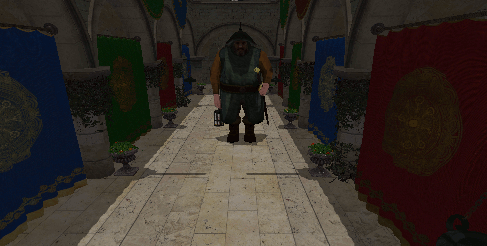

# Indirect drawing

Until this chapter, we have rendered the models by binding their material uniforms, their textures, their vertices and indices buffers and submitting one draw command for each of the meshes they are composed. In this chapter, we will start our way to a more efficient wat of rendering, we will begin the implementation of a bind-less render. This type of rendering does not receive a bunch of draw commands to draw the scene, instead they relay on indirect drawing commands. Indirect draw commands are, in essence, draw commands stored in a buffer that obtain the parameters required to perform the operation from a set of global buffers. This is a more efficient way of drawing because:

- We remove the need to perform several bind operations before drawing each mesh.
- We need just to record a single draw call.
- We can perform in-GPU operations, such as culling, that will operate over the buffer that stores the drawing parameters through compute shaders, reducing the load on the CPU side.

As you can see, the ultimate goal is to maximize the utilization of the GPU while removing potential bottlenecks that may occur at the CPU side and latencies due to CPU to GPU communications.

You can find the complete source code for this chapter [here](../../booksamples/chapter-16).

## Overview

As it has been introduced, we will construct a bind-less render pipeline that will use a buffer to store indirect drawing commands to render a scene with a single draw call. Basically, we will store in a buffer `VkDrawIndexedIndirectCommand` structures, which will contain offsets to the buffers that will hold vertex information, the indices, materials and per instance data (such as model matrices, etc.). This will avoid to constantly record binding operators to per-model buffers, send data through push constants and record per-mesh drawing commands. In order to be able to handle textures, we will use a texture array, that will hold all the textures loaded. Our materials will just simply have an attribute for the index to that array so we can apply textures to models. 


## Global Buffers

The first thing to be done is to check if the device supports multi draw indirect. This is done in the `Device` class when setting up the required features:
```java
public class Device {
    ...
    public Device(Instance instance, PhysicalDevice physicalDevice) {
        ...
            if (!supportedFeatures.multiDrawIndirect()) {
                throw new RuntimeException("Multi draw Indirect not supported");
            }
            features.multiDrawIndirect(true);
        ...
    }
    ...
}
```

We will create a new class named `GlobalBuffers` that will hold the data and command buffers that will be used for rendering. The class defines the following buffers as attributes:
```java
public class GlobalBuffers {
    ...
    private final VulkanBuffer animJointMatricesBuffer;
    private final VulkanBuffer animWeightsBuffer;
    private final VulkanBuffer indicesBuffer;
    private final VulkanBuffer materialsBuffer;
    private final VulkanBuffer verticesBuffer;
    private VulkanBuffer animIndirectBuffer;
    private VulkanBuffer[] animInstanceDataBuffers;
    private VulkanBuffer animVerticesBuffer;
    private VulkanBuffer indirectBuffer;
    private VulkanBuffer[] instanceDataBuffers;
    ...
}
```

Although we will view how these buffers are used during data loading and rendering, here is a brief summary of the purpose of the different buffers:
- `animJointMatricesBuffer`: It will hold the matrices of the joints transformations of all the animated models.
- `animWeightsBuffer`: It will hold the weights of the joints transformations of all the animated models.
- `indicesBuffer`: It will hold the indices of all the models to be rendered.
- `verticesBuffer`: It will hold the vertex information (position, normals, etc) of all the models to be rendered. For the animated models it will contain the data of the binding pose.
- `animIndirectBuffer`: It will hold the indirect drawing commands for the animated models.
- `animInstanceDataBuffers`: This array of buffers will hold instance data for each entity associated to an animated model when rendering. That is, it will hold the model transformation matrix and and index to to the buffer that holds the materials data. It is an array because we will need to update them while rendering, therefore we will need separate buffers for each swap chain image.
- `animVerticesBuffer`: It will hold the vertex information for animated models after animation has been applied (This is the one that will be used for rendering).
- `indirectBuffer`: It will hold the indirect drawing commands for the static models.
- `instanceDataBuffers`: This array is equivalent to the `animInstanceDataBuffers` array for static models.

In the `GlobalBuffers` we initialize some of those buffers along with some other attributes:
```java
public class GlobalBuffers {
    ...
    private static final Logger LOGGER = LogManager.getLogger();
    ...
    public GlobalBuffers(Device device) {
        LOGGER.debug("Creating global buffers");
        EngineProperties engProps = EngineProperties.getInstance();
        verticesBuffer = new VulkanBuffer(device, engProps.getMaxVerticesBuffer(), VK_BUFFER_USAGE_VERTEX_BUFFER_BIT |
                VK_BUFFER_USAGE_STORAGE_BUFFER_BIT | VK_BUFFER_USAGE_TRANSFER_DST_BIT, VK_MEMORY_PROPERTY_DEVICE_LOCAL_BIT, 0);
        indicesBuffer = new VulkanBuffer(device, engProps.getMaxIndicesBuffer(), VK_BUFFER_USAGE_INDEX_BUFFER_BIT | VK_BUFFER_USAGE_TRANSFER_DST_BIT,
                VK_MEMORY_PROPERTY_DEVICE_LOCAL_BIT, 0);
        int maxMaterials = engProps.getMaxMaterials();
        materialsBuffer = new VulkanBuffer(device, (long) maxMaterials * GraphConstants.VEC4_SIZE * 9, VK_BUFFER_USAGE_STORAGE_BUFFER_BIT | VK_BUFFER_USAGE_TRANSFER_DST_BIT,
                VK_MEMORY_PROPERTY_DEVICE_LOCAL_BIT, 0);
        animJointMatricesBuffer = new VulkanBuffer(device, engProps.getMaxJointMatricesBuffer(), VK_BUFFER_USAGE_STORAGE_BUFFER_BIT | VK_BUFFER_USAGE_TRANSFER_DST_BIT,
                VK_MEMORY_PROPERTY_DEVICE_LOCAL_BIT, 0);
        animWeightsBuffer = new VulkanBuffer(device, engProps.getMaxAnimWeightsBuffer(), VK_BUFFER_USAGE_STORAGE_BUFFER_BIT | VK_BUFFER_USAGE_TRANSFER_DST_BIT,
                VK_MEMORY_PROPERTY_DEVICE_LOCAL_BIT, 0);
        numIndirectCommands = 0;
    }
    ...
}
```
One important thing to note is that the buffers are created with the `VK_BUFFER_USAGE_STORAGE_BUFFER_BIT` flag. The reason for that is that we will be accessing vertex and indices through indirect draw calls. Also, we will be accessing buffers directly to access per instance information and materials data (we used uniforms for that previously). Therefore, we need to access unbound buffers from the shaders, so we need to use storage buffers.

We have defined new properties to configure the size of the different buffers in the `EngineProperties` class:
```java
public class EngineProperties {
    ...
    private static final int DEFAULT_JOINT_MATRICES_BUF = 2000000;
    private static final int DEFAULT_MAX_ANIM_WEIGHTS_BUF = 100000;
    private static final int DEFAULT_MAX_INDICES_BUF = 5000000;
    ...
    private static final int DEFAULT_MAX_VERTICES_BUF = 20000000;
    ...
    private int maxAnimWeightsBuffer;
    private int maxIndicesBuffer;
    private int maxJointMatricesBuffer;
    ...
    private int maxTextures;
    private int maxVerticesBuffer;    
    ...
    private EngineProperties() {
        ...
            maxTextures = maxMaterials * 3;
            maxVerticesBuffer = Integer.parseInt(props.getOrDefault("maxVerticesBuffer", DEFAULT_MAX_VERTICES_BUF).toString());
            maxIndicesBuffer = Integer.parseInt(props.getOrDefault("maxIndicesBuffer", DEFAULT_MAX_INDICES_BUF).toString());
            maxAnimWeightsBuffer = Integer.parseInt(props.getOrDefault("maxAnimWeightsBuffer", DEFAULT_MAX_ANIM_WEIGHTS_BUF).toString();
            maxJointMatricesBuffer = Integer.parseInt(props.getOrDefault("maxJointMatricesBuffer", DEFAULT_JOINT_MATRICES_BUF).toString());
        ...
    }
    ...
    public int getMaxAnimWeightsBuffer() {
        return maxAnimWeightsBuffer;
    }

    public int getMaxIndicesBuffer() {
        return maxIndicesBuffer;
    }

    public int getMaxJointMatricesBuffer() {
        return maxJointMatricesBuffer;
    }
    ...
    public int getMaxTextures() {
        return maxTextures;
    }

    public int getMaxVerticesBuffer() {
        return maxVerticesBuffer;
    }
    ...
}
```
Also note that we have removed also the configuration parameter for a default texture. We will not need this anymore.

Back to the `GlobalBuffers` class, the next method is the `cleanup()` method, which frees all the resources that were allocated during the initialization.
```java
public class GlobalBuffers {
    ...
    public void cleanup() {
        LOGGER.debug("Destroying global buffers");
        verticesBuffer.cleanup();
        indicesBuffer.cleanup();
        if (indirectBuffer != null) {
            indirectBuffer.cleanup();
        }
        if (animVerticesBuffer != null) {
            animVerticesBuffer.cleanup();
        }
        if (animIndirectBuffer != null) {
            animIndirectBuffer.cleanup();
        }
        materialsBuffer.cleanup();
        animJointMatricesBuffer.cleanup();
        animWeightsBuffer.cleanup();
        if (instanceDataBuffers != null) {
            Arrays.stream(instanceDataBuffers).forEach(VulkanBuffer::cleanup);
        }
        if (animInstanceDataBuffers != null) {
            Arrays.stream(animInstanceDataBuffers).forEach(VulkanBuffer::cleanup);
        }
    }
    ...
}
```

We will continue now analyzing the `GlobalBuffers` class by starting with the `loadModels` method, which starts like this:
```java
public class GlobalBuffers {
    ...
    public List<VulkanModel> loadModels(List<ModelData> modelDataList, TextureCache textureCache, CommandPool
            commandPool, Queue queue) {
        List<VulkanModel> vulkanModelList = new ArrayList<>();
        List<Texture> textureList = new ArrayList<>();

        Device device = commandPool.getDevice();
        CommandBuffer cmd = new CommandBuffer(commandPool, true, true);

        StgBuffer verticesStgBuffer = new StgBuffer(device, verticesBuffer.getRequestedSize());
        StgBuffer indicesStgBuffer = new StgBuffer(device, indicesBuffer.getRequestedSize());
        StgBuffer materialsStgBuffer = new StgBuffer(device, materialsBuffer.getRequestedSize());
        StgBuffer animJointMatricesStgBuffer = new StgBuffer(device, animJointMatricesBuffer.getRequestedSize());
        StgBuffer animWeightsStgBuffer = new StgBuffer(device, animWeightsBuffer.getRequestedSize());

        cmd.beginRecording();

        // Load a default material
        List<ModelData.Material> defaultMaterialList = Collections.singletonList(new ModelData.Material());
        loadMaterials(device, textureCache, materialsStgBuffer, defaultMaterialList, textureList);
        ...
    }
    ...
}
```

The `loadModels` method starts by creating several `StgBuffer` instances for the vertex data, indices, materials, etc. along with a command buffer to record the transitions. The `StgBuffer` class will manage the creation of a staging buffer, which is accessible by the CPU which contents will later be copied to a GPU only buffer. It also creates a default material which will be used for models which do not define any. One important thing to remark is that we are using a single staging buffer type for all the models (a single one for the vertices, for the indices, etc.). The `loadModels` method continues as follows:
```java
public class GlobalBuffers {
    ...
    public List<VulkanModel> loadModels(List<ModelData> modelDataList, TextureCache textureCache, CommandPool
            commandPool, Queue queue) {
        ...
        for (ModelData modelData : modelDataList) {
            VulkanModel vulkanModel = new VulkanModel(modelData.getModelId());
            vulkanModelList.add(vulkanModel);

            List<VulkanModel.VulkanMaterial> vulkanMaterialList = loadMaterials(device, textureCache, materialsStgBuffer,
                    modelData.getMaterialList(), textureList);
            loadMeshes(verticesStgBuffer, indicesStgBuffer, animWeightsStgBuffer, modelData, vulkanModel, vulkanMaterialList);
            loadAnimationData(modelData, vulkanModel, animJointMatricesStgBuffer);
        }

        // We need to ensure that at least we have one texture
        if (textureList.isEmpty()) {
            EngineProperties engineProperties = EngineProperties.getInstance();
            Texture defaultTexture = textureCache.createTexture(device, engineProperties.getDefaultTexturePath(),
                    VK_FORMAT_R8G8B8A8_SRGB);
            textureList.add(defaultTexture);
        }

        materialsStgBuffer.recordTransferCommand(cmd, materialsBuffer);
        verticesStgBuffer.recordTransferCommand(cmd, verticesBuffer);
        indicesStgBuffer.recordTransferCommand(cmd, indicesBuffer);
        animJointMatricesStgBuffer.recordTransferCommand(cmd, animJointMatricesBuffer);
        animWeightsStgBuffer.recordTransferCommand(cmd, animWeightsBuffer);
        textureList.forEach(t -> t.recordTextureTransition(cmd));
        cmd.endRecording();

        cmd.submitAndWait(device, queue);
        cmd.cleanup();

        verticesStgBuffer.cleanup();
        indicesStgBuffer.cleanup();
        materialsStgBuffer.cleanup();
        animJointMatricesStgBuffer.cleanup();
        animWeightsStgBuffer.cleanup();
        textureList.forEach(Texture::cleanupStgBuffer);

        return vulkanModelList;
    }
    ...
}
```

As it can be seen, we iterate over the meshes that are defined for each model, invoking the `loadMeshes` to properly upload the data into the staging buffers. We also call the `loadAnimationData` method to load the animation data for each model (if present). After that, we check if there are mp textures loaded to load a default one (which is required for simplifying the render). Finally, we record the transfer commands from CPU accessible buffers to GPU only buffers and cleanup the staging buffers.

As it has been commented before, the `StgBuffer` class, a `GlobalBuffers` inner class, allows us to use a temporary CPU accessible to a GPU only buffer:
```java
public class GlobalBuffers {
    ...
    private static class StgBuffer {
        private final ByteBuffer dataBuffer;
        private final VulkanBuffer stgVulkanBuffer;

        public StgBuffer(Device device, long size) {
            stgVulkanBuffer = new VulkanBuffer(device, size, VK_BUFFER_USAGE_TRANSFER_SRC_BIT, VK_MEMORY_PROPERTY_HOST_VISIBLE_BIT, VK_MEMORY_PROPERTY_HOST_COHERENT_BIT);
            long mappedMemory = stgVulkanBuffer.map();
            dataBuffer = MemoryUtil.memByteBuffer(mappedMemory, (int) stgVulkanBuffer.getRequestedSize());
        }

        public void cleanup() {
            stgVulkanBuffer.unMap();
            stgVulkanBuffer.cleanup();
        }

        public ByteBuffer getDataBuffer() {
            return dataBuffer;
        }

        private void recordTransferCommand(CommandBuffer cmd, VulkanBuffer dstBuffer) {
            try (MemoryStack stack = MemoryStack.stackPush()) {
                VkBufferCopy.Buffer copyRegion = VkBufferCopy.callocStack(1, stack)
                        .srcOffset(0).dstOffset(0).size(stgVulkanBuffer.getRequestedSize());
                vkCmdCopyBuffer(cmd.getVkCommandBuffer(), stgVulkanBuffer.getBuffer(), dstBuffer.getBuffer(), copyRegion);
            }
        }
    }
    ...
}
```

While iterating over the models, for each of them we create a `VulkanModel` instance. This class has been completely rewritten since we do not have now independent buffers per mesh:
```java
public class VulkanModel {

    private final String modelId;
    private final List<VulkanAnimationData> vulkanAnimationDataList;
    private final List<VulkanMesh> vulkanMeshList;

    public VulkanModel(String modelId) {
        this.modelId = modelId;
        vulkanMeshList = new ArrayList<>();
        vulkanAnimationDataList = new ArrayList<>();
    }

    public void addVulkanAnimationData(VulkanAnimationData vulkanAnimationData) {
        vulkanAnimationDataList.add(vulkanAnimationData);
    }

    public void addVulkanMesh(VulkanMesh vulkanMesh) {
        vulkanMeshList.add(vulkanMesh);
    }

    public String getModelId() {
        return modelId;
    }

    public List<VulkanAnimationData> getVulkanAnimationDataList() {
        return vulkanAnimationDataList;
    }

    public List<VulkanMesh> getVulkanMeshList() {
        return vulkanMeshList;
    }

    public boolean hasAnimations() {
        return !vulkanAnimationDataList.isEmpty();
    }
    ...
    public static record VulkanMaterial(int globalMaterialIdx) {
    }
    ...
}
```

The `VulkanModel` class just stores the model identifier and two lists. The `vulkanMeshList` contains information about the different meshes that define the model, defined by the `VulkanModel.VulkanMesh` class. The `vulkanAnimationDataList` contains information about the animations that are defined for the model, defined by the `VulkanAnimationData`. Let's review the `VulkanModel.VulkanMesh` definition:
```java
public class VulkanModel {
    ...
    public static record VulkanMesh(int verticesSize, int numIndices, int verticesOffset, int indicesOffset,
                                    int globalMaterialIdx, int weightsOffset) {
    }
    ...
}
```

After loading the mesh data into the global buffer we need to record the size of the data for the vertices, the number indices, the offset of the vertices data and indices data in those global buffers. We meed also to store a reference to the material which this mesh refers to and and offset to the weights buffer (for animated models). This is what is stored in the `VulkanModel.VulkanMesh` class.

The `VulkanAnimationData`. basically contains a list of offsets to a buffer which stores the joint matrices offset to be used for each frame of an animation. It is defined like this:
```java
public class VulkanModel {
    ...
    public static class VulkanAnimationData {
        private List<VulkanAnimationFrame> vulkanAnimationFrameList;

        public VulkanAnimationData() {
            vulkanAnimationFrameList = new ArrayList<>();
        }

        public void addVulkanAnimationFrame(VulkanAnimationFrame vulkanAnimationFrame) {
            vulkanAnimationFrameList.add(vulkanAnimationFrame);
        }

        public List<VulkanAnimationFrame> getVulkanAnimationFrameList() {
            return vulkanAnimationFrameList;
        }
    }

    public static record VulkanAnimationFrame(int jointMatricesOffset) {

    }
    ...
}
```

We can now go back to the `GlobalBuffers` class and examine the `loadMaterials` method:
```java
public class GlobalBuffers {
    ...
    // Handle std430 alignment
    private static final int MATERIAL_PADDING = GraphConstants.FLOAT_LENGTH * 3;
    private static final int MATERIAL_SIZE = GraphConstants.VEC4_SIZE + GraphConstants.INT_LENGTH * 3 +
            GraphConstants.FLOAT_LENGTH * 2 + MATERIAL_PADDING;
    ...
    private List<VulkanModel.VulkanMaterial> loadMaterials(Device device, TextureCache textureCache, StgBuffer
            materialsStgBuffer,
                                                           List<ModelData.Material> materialList, List<Texture> textureList) {
        List<VulkanModel.VulkanMaterial> vulkanMaterialList = new ArrayList<>();
        for (ModelData.Material material : materialList) {
            ByteBuffer dataBuffer = materialsStgBuffer.getDataBuffer();

            Texture texture = textureCache.createTexture(device, material.texturePath(), VK_FORMAT_R8G8B8A8_SRGB);
            if (texture != null) {
                textureList.add(texture);
            }
            int textureIdx = textureCache.getPosition(material.texturePath());

            texture = textureCache.createTexture(device, material.normalMapPath(), VK_FORMAT_R8G8B8A8_UNORM);
            if (texture != null) {
                textureList.add(texture);
            }
            int normalMapIdx = textureCache.getPosition(material.normalMapPath());

            texture = textureCache.createTexture(device, material.metalRoughMap(), VK_FORMAT_R8G8B8A8_SRGB);
            if (texture != null) {
                textureList.add(texture);
            }
            int metalRoughMapIdx = textureCache.getPosition(material.metalRoughMap());

            vulkanMaterialList.add(new VulkanModel.VulkanMaterial(dataBuffer.position() / MATERIAL_SIZE));
            material.diffuseColor().get(dataBuffer);
            dataBuffer.position(dataBuffer.position() + GraphConstants.VEC4_SIZE);
            dataBuffer.putInt(textureIdx);
            dataBuffer.putInt(normalMapIdx);
            dataBuffer.putInt(metalRoughMapIdx);
            dataBuffer.putFloat(material.roughnessFactor());
            dataBuffer.putFloat(material.metallicFactor());
            // Padding due to std430 alignment
            dataBuffer.putFloat(0.0f);
            dataBuffer.putFloat(0.0f);
            dataBuffer.putFloat(0.0f);
        }

        return vulkanMaterialList;
    }
    ...
}
```
The `loadMaterials` will look familiar to you, the only difference is that we will be storing all that information into a single buffer instead of having separate buffers per material. In order to properly access the data for each material in the shaders, we will assign to each material a unique identifier, which in essence will be used as way to calculate the offset to abe applied to the global global materials buffer to access each specific material. One important thing to highlight is that we are applying a padding at the end of each block of material data. The reason for that is that we will using `std430` layout when accessing the material data in the shaders. This means that the data will be aligned to the nearest 4 bytes.

The `loadMeshes` is defined like this:
```java
public class GlobalBuffers {
    ...
    private void loadMeshes(StgBuffer verticesStgBuffer, StgBuffer indicesStgBuffer, StgBuffer animWeightsStgBuffer,
                            ModelData modelData, VulkanModel vulkanModel, List<VulkanModel.VulkanMaterial> vulkanMaterialList) {
        ByteBuffer verticesData = verticesStgBuffer.getDataBuffer();
        ByteBuffer indicesData = indicesStgBuffer.getDataBuffer();
        List<ModelData.MeshData> meshDataList = modelData.getMeshDataList();
        int meshCount = 0;
        for (ModelData.MeshData meshData : meshDataList) {
            float[] positions = meshData.positions();
            float[] normals = meshData.normals();
            float[] tangents = meshData.tangents();
            float[] biTangents = meshData.biTangents();
            float[] textCoords = meshData.textCoords();
            if (textCoords == null || textCoords.length == 0) {
                textCoords = new float[(positions.length / 3) * 2];
            }
            int[] indices = meshData.indices();

            int numElements = positions.length + normals.length + tangents.length + biTangents.length + textCoords.length;
            int verticesSize = numElements * GraphConstants.FLOAT_LENGTH;

            int localMaterialIdx = meshData.materialIdx();
            int globalMaterialIdx = 0;
            if (localMaterialIdx >= 0 && localMaterialIdx < vulkanMaterialList.size()) {
                globalMaterialIdx = vulkanMaterialList.get(localMaterialIdx).globalMaterialIdx();
            }
            vulkanModel.addVulkanMesh(new VulkanModel.VulkanMesh(verticesSize, indices.length,
                    verticesData.position(), indicesData.position(), globalMaterialIdx, animWeightsStgBuffer.getDataBuffer().position()));

            int rows = positions.length / 3;
            for (int row = 0; row < rows; row++) {
                int startPos = row * 3;
                int startTextCoord = row * 2;
                verticesData.putFloat(positions[startPos]);
                verticesData.putFloat(positions[startPos + 1]);
                verticesData.putFloat(positions[startPos + 2]);
                verticesData.putFloat(normals[startPos]);
                verticesData.putFloat(normals[startPos + 1]);
                verticesData.putFloat(normals[startPos + 2]);
                verticesData.putFloat(tangents[startPos]);
                verticesData.putFloat(tangents[startPos + 1]);
                verticesData.putFloat(tangents[startPos + 2]);
                verticesData.putFloat(biTangents[startPos]);
                verticesData.putFloat(biTangents[startPos + 1]);
                verticesData.putFloat(biTangents[startPos + 2]);
                verticesData.putFloat(textCoords[startTextCoord]);
                verticesData.putFloat(textCoords[startTextCoord + 1]);
            }

            Arrays.stream(indices).forEach(indicesData::putInt);

            loadWeightsBuffer(modelData, animWeightsStgBuffer, meshCount);
            meshCount++;
        }
    }
    ...
}
```
This method is quite similar to the one we saw in previous chapters. The difference is that we are now copying the data to a single vertices buffer, a single indices buffer and another one for the vertex weights for all the models. As you can see, we store those offsets for each of the meshes in an instance of the `VulkanMesh` class.

While we are copying the vertex data to the buffer, we also check if the model has animations an copy the weights used for the animation to a common weights buffer. This is done in the `loadWeightsBuffer` method.
```java
public class GlobalBuffers {
    ...
    private void loadWeightsBuffer(ModelData modelData, StgBuffer animWeightsBuffer, int meshCount) {
        List<ModelData.AnimMeshData> animMeshDataList = modelData.getAnimMeshDataList();
        if (animMeshDataList == null || animMeshDataList.isEmpty()) {
            return;
        }

        ModelData.AnimMeshData animMeshData = animMeshDataList.get(meshCount);
        float[] weights = animMeshData.weights();
        int[] boneIds = animMeshData.boneIds();

        ByteBuffer dataBuffer = animWeightsBuffer.getDataBuffer();

        int rows = weights.length / 4;
        for (int row = 0; row < rows; row++) {
            int startPos = row * 4;
            dataBuffer.putFloat(weights[startPos]);
            dataBuffer.putFloat(weights[startPos + 1]);
            dataBuffer.putFloat(weights[startPos + 2]);
            dataBuffer.putFloat(weights[startPos + 3]);
            dataBuffer.putFloat(boneIds[startPos]);
            dataBuffer.putFloat(boneIds[startPos + 1]);
            dataBuffer.putFloat(boneIds[startPos + 2]);
            dataBuffer.putFloat(boneIds[startPos + 3]);
        }
    }
    ...
}
```

Finally, to complete the model loading we need to load the data for each animation frame if the model is animated. That data is basically the transformation matrices for each frame. This is done in the `loadAnimationData` method, which is called in the `loadModels` method while traversing the models.
```java
public class GlobalBuffers {
    ...
    private void loadAnimationData(ModelData modelData, VulkanModel vulkanModel, StgBuffer animJointMatricesStgBuffer) {
        List<ModelData.Animation> animationsList = modelData.getAnimationsList();
        if (!modelData.hasAnimations()) {
            return;
        }
        ByteBuffer dataBuffer = animJointMatricesStgBuffer.getDataBuffer();
        for (ModelData.Animation animation : animationsList) {
            VulkanModel.VulkanAnimationData vulkanAnimationData = new VulkanModel.VulkanAnimationData();
            vulkanModel.addVulkanAnimationData(vulkanAnimationData);
            List<ModelData.AnimatedFrame> frameList = animation.frames();
            for (ModelData.AnimatedFrame frame : frameList) {
                vulkanAnimationData.addVulkanAnimationFrame(new VulkanModel.VulkanAnimationFrame(dataBuffer.position()));
                Matrix4f[] matrices = frame.jointMatrices();
                for (Matrix4f matrix : matrices) {
                    matrix.get(dataBuffer);
                    dataBuffer.position(dataBuffer.position() + GraphConstants.MAT4X4_SIZE);
                }
            }
        }
    }
    ...
}
```

With all the code presented above, we have now all the meshes data in GPU accessible buffers, ready to be used by our shaders. Now it comes the most important part of indirect drawing, we need to create a buffer that will contain the indirect drawing commands that will allow us to render scene. The `GlobalBuffers` class has a method that performs all the necessary steps to create the indirect drawing commands buffer upon a list of entities:
```java
public class GlobalBuffers {
    ...
    public void loadEntities(List<VulkanModel> vulkanModelList, Scene scene, CommandPool commandPool,
                             Queue queue, int numSwapChainImages) {
        loadStaticEntities(vulkanModelList, scene, commandPool, queue, numSwapChainImages);
        loadAnimEntities(vulkanModelList, scene, commandPool, queue, numSwapChainImages);
    }
    ...
}
```

The process of recording indirect draw command is as follows:
- For each of the models, we get the entities that are associated to each model.
- For each model, we get their meshes, and for each mesh we record a draw indirect indexed command.
- Draw indirect indexed commands are modelled by the `VkDrawIndexedIndirectCommand` structure, which defines the following fields:
  - `indexCount`: The number of indices in the index buffer for the draw call. That is, the number of indices of the mesh.
  - `firstIndex`: The offset of the first index in the index buffer for the draw call. Beware, that this is not an offset in bytes but an offset in indices.
  - `instanceCount`: The number of instances to draw. We can draw several instances that share the same mesh with a single command (instanced rendering).
  - `vertexOffset`: The offset to the vertex buffer for the draw call. Beware, that this is not an offset in bytes but an offset in vertices structures.
  - `firstInstance`: The instance identifier of the first instance to draw.

As explained above, we need to record the draw indirect indexed commands in a buffer. We will also use staging buffers to copy the data to a CPU accessible buffer and later on to transfer its contents to a GPU only accessible buffer. In addition to that, we need to create a dedicated buffer to hold instance specific data. In this specific example, we will store he model matrix and the associated material identifier (although this last element is shared between all the instances, it makes things easier to store that information in this buffer). The process described above is implemented in the `loadStaticEntities` method, which is defined as follows:
```java
public class GlobalBuffers {
    public static final int IND_COMMAND_STRIDE = VkDrawIndexedIndirectCommand.SIZEOF;
    ...
    private int numIndirectCommands;
    ...
    private void loadStaticEntities(List<VulkanModel> vulkanModelList, Scene scene, CommandPool commandPool,
                                    Queue queue, int numSwapChainImages) {
        numIndirectCommands = 0;
        try (MemoryStack stack = MemoryStack.stackPush()) {
            Device device = commandPool.getDevice();
            CommandBuffer cmd = new CommandBuffer(commandPool, true, true);

            List<VkDrawIndexedIndirectCommand> indexedIndirectCommandList = new ArrayList<>();
            int numInstances = 0;
            int firstInstance = 0;
            for (VulkanModel vulkanModel : vulkanModelList) {
                List<Entity> entities = scene.getEntitiesByModelId(vulkanModel.getModelId());
                if (entities.isEmpty() || vulkanModel.hasAnimations()) {
                    continue;
                }
                for (VulkanModel.VulkanMesh vulkanMesh : vulkanModel.getVulkanMeshList()) {
                    VkDrawIndexedIndirectCommand indexedIndirectCommand = VkDrawIndexedIndirectCommand.callocStack(stack);
                    indexedIndirectCommand.indexCount(vulkanMesh.numIndices());
                    indexedIndirectCommand.firstIndex(vulkanMesh.indicesOffset() / GraphConstants.INT_LENGTH);
                    indexedIndirectCommand.instanceCount(entities.size());
                    indexedIndirectCommand.vertexOffset(vulkanMesh.verticesOffset() / VertexBufferStructure.SIZE_IN_BYTES);
                    indexedIndirectCommand.firstInstance(firstInstance);
                    indexedIndirectCommandList.add(indexedIndirectCommand);

                    numIndirectCommands++;
                    firstInstance++;
                    numInstances = numInstances + entities.size();
                }
            }
            if (numIndirectCommands > 0) {
                cmd.beginRecording();

                StgBuffer indirectStgBuffer = new StgBuffer(device, (long) IND_COMMAND_STRIDE * numIndirectCommands);
                if (indirectBuffer != null) {
                    indirectBuffer.cleanup();
                }
                indirectBuffer = new VulkanBuffer(device, indirectStgBuffer.stgVulkanBuffer.getRequestedSize(),
                        VK_BUFFER_USAGE_INDIRECT_BUFFER_BIT | VK_BUFFER_USAGE_TRANSFER_DST_BIT,
                        VK_MEMORY_PROPERTY_DEVICE_LOCAL_BIT, 0);
                ByteBuffer dataBuffer = indirectStgBuffer.getDataBuffer();
                VkDrawIndexedIndirectCommand.Buffer indCommandBuffer = new VkDrawIndexedIndirectCommand.Buffer(dataBuffer);

                indexedIndirectCommandList.forEach(indCommandBuffer::put);

                if (instanceDataBuffers != null) {
                    Arrays.stream(instanceDataBuffers).forEach(VulkanBuffer::cleanup);
                }
                instanceDataBuffers = new VulkanBuffer[numSwapChainImages];
                for (int i = 0; i < numSwapChainImages; i++) {
                    instanceDataBuffers[i] = new VulkanBuffer(device, (long) numInstances * (GraphConstants.MAT4X4_SIZE + GraphConstants.INT_LENGTH),
                            VK_BUFFER_USAGE_VERTEX_BUFFER_BIT, VK_MEMORY_PROPERTY_HOST_VISIBLE_BIT, 0);
                }

                indirectStgBuffer.recordTransferCommand(cmd, indirectBuffer);

                cmd.endRecording();
                cmd.submitAndWait(device, queue);
                cmd.cleanup();
                indirectStgBuffer.cleanup();
            }
        }
    }
    ...
}
```

As it can be seen above, the `loadStaticEntities` just record the commands for entities that have no animated models. For animated models, the work is don in the `loadAnimEntities` method. 
```java
public class GlobalBuffers {
    ...
    private int numAnimIndirectCommands;
    ...
    private List<VulkanAnimEntity> vulkanAnimEntityList;
    ...    
    private void loadAnimEntities(List<VulkanModel> vulkanModelList, Scene scene, CommandPool commandPool,
                                  Queue queue, int numSwapChainImages) {
        vulkanAnimEntityList = new ArrayList<>();
        numAnimIndirectCommands = 0;
        try (MemoryStack stack = MemoryStack.stackPush()) {
            Device device = commandPool.getDevice();
            CommandBuffer cmd = new CommandBuffer(commandPool, true, true);

            int bufferOffset = 0;
            int firstInstance = 0;
            List<VkDrawIndexedIndirectCommand> indexedIndirectCommandList = new ArrayList<>();
            for (VulkanModel vulkanModel : vulkanModelList) {
                List<Entity> entities = scene.getEntitiesByModelId(vulkanModel.getModelId());
                if (entities.isEmpty()) {
                    continue;
                }
                for (Entity entity : entities) {
                    if (!entity.hasAnimation()) {
                        continue;
                    }
                    VulkanAnimEntity vulkanAnimEntity = new VulkanAnimEntity(entity, vulkanModel);
                    vulkanAnimEntityList.add(vulkanAnimEntity);
                    List<VulkanAnimEntity.VulkanAnimMesh> vulkanAnimMeshList = vulkanAnimEntity.getVulkanAnimMeshList();
                    for (VulkanModel.VulkanMesh vulkanMesh : vulkanModel.getVulkanMeshList()) {
                        VkDrawIndexedIndirectCommand indexedIndirectCommand = VkDrawIndexedIndirectCommand.callocStack(stack);
                        indexedIndirectCommand.indexCount(vulkanMesh.numIndices());
                        indexedIndirectCommand.firstIndex(vulkanMesh.indicesOffset() / GraphConstants.INT_LENGTH);
                        indexedIndirectCommand.instanceCount(1);
                        indexedIndirectCommand.vertexOffset(bufferOffset / VertexBufferStructure.SIZE_IN_BYTES);
                        indexedIndirectCommand.firstInstance(firstInstance);
                        indexedIndirectCommandList.add(indexedIndirectCommand);

                        vulkanAnimMeshList.add(new VulkanAnimEntity.VulkanAnimMesh(bufferOffset, vulkanMesh));
                        bufferOffset += vulkanMesh.verticesSize();
                        firstInstance++;
                    }
                }
            }
            animVerticesBuffer = new VulkanBuffer(device, bufferOffset, VK_BUFFER_USAGE_VERTEX_BUFFER_BIT |
                    VK_BUFFER_USAGE_STORAGE_BUFFER_BIT, VK_MEMORY_PROPERTY_DEVICE_LOCAL_BIT, 0);

            numAnimIndirectCommands = indexedIndirectCommandList.size();
            if (numAnimIndirectCommands > 0) {
                cmd.beginRecording();

                StgBuffer indirectStgBuffer = new StgBuffer(device, (long) IND_COMMAND_STRIDE * numAnimIndirectCommands);
                if (animIndirectBuffer != null) {
                    animIndirectBuffer.cleanup();
                }
                animIndirectBuffer = new VulkanBuffer(device, indirectStgBuffer.stgVulkanBuffer.getRequestedSize(),
                        VK_BUFFER_USAGE_INDIRECT_BUFFER_BIT | VK_BUFFER_USAGE_TRANSFER_DST_BIT,
                        VK_MEMORY_PROPERTY_DEVICE_LOCAL_BIT, 0);
                ByteBuffer dataBuffer = indirectStgBuffer.getDataBuffer();
                VkDrawIndexedIndirectCommand.Buffer indCommandBuffer = new VkDrawIndexedIndirectCommand.Buffer(dataBuffer);

                indexedIndirectCommandList.forEach(indCommandBuffer::put);

                if (animInstanceDataBuffers != null) {
                    Arrays.stream(animInstanceDataBuffers).forEach(VulkanBuffer::cleanup);
                }
                animInstanceDataBuffers = new VulkanBuffer[numSwapChainImages];
                for (int i = 0; i < numSwapChainImages; i++) {
                    animInstanceDataBuffers[i] = new VulkanBuffer(device,
                            (long) numAnimIndirectCommands * (GraphConstants.MAT4X4_SIZE + GraphConstants.INT_LENGTH),
                            VK_BUFFER_USAGE_VERTEX_BUFFER_BIT, VK_MEMORY_PROPERTY_HOST_VISIBLE_BIT, 0);
                }

                indirectStgBuffer.recordTransferCommand(cmd, animIndirectBuffer);

                cmd.endRecording();
                cmd.submitAndWait(device, queue);
                cmd.cleanup();
                indirectStgBuffer.cleanup();
            }
        }
    }
    ...
}
```

For animated models we cannot use instance rendering, since each entity may be in a different state of the animation. Therefore, we need to record the indirect drawing commands for each specific mesh for each entity. The relevant information is stored in a new class named `VulkanAnimEntity` which stores the relevant information that will be used when calculating the animations. If you recall, when animating we use the static binding pose information and apply a set of transformations over the vertices to update the data according to a specific frame. This is done in a compute shader. The `VulkanAnimEntity` will store the information required to perform that process later on and is defined like this:
```java
package org.vulkanb.eng.graph;

import org.vulkanb.eng.scene.Entity;

import java.util.*;

public class VulkanAnimEntity {
    private Entity entity;
    private List<VulkanAnimMesh> vulkanAnimMeshList;
    private VulkanModel vulkanModel;

    public VulkanAnimEntity(Entity entity, VulkanModel vulkanModel) {
        this.entity = entity;
        this.vulkanModel = vulkanModel;
        vulkanAnimMeshList = new ArrayList<>();
    }

    public Entity getEntity() {
        return entity;
    }

    public List<VulkanAnimMesh> getVulkanAnimMeshList() {
        return vulkanAnimMeshList;
    }

    public VulkanModel getVulkanModel() {
        return vulkanModel;
    }

    public record VulkanAnimMesh(int meshOffset, VulkanModel.VulkanMesh vulkanMesh) {
    }
}
```

In order to complete `GlobalBuffers` class core functionality, we need to provide a function that stores per instance information used for rendering. To store that information, we use separate buffers for static and animated models. We need also separate buffers per swap chain image to avoid updating the buffer while its being used for rendering. We will achieve this in a method named `loadInstanceData` which is defined like this:
```java
public class GlobalBuffers {
    ...
    public void loadInstanceData(Scene scene, List<VulkanModel> vulkanModels, int currentSwapChainIdx) {
        Predicate<VulkanModel> excludeAnimatedEntitiesPredicate = VulkanModel::hasAnimations;
        loadInstanceData(scene, vulkanModels, instanceDataBuffers[currentSwapChainIdx], excludeAnimatedEntitiesPredicate);
        Predicate<VulkanModel> excludedStaticEntitiesPredicate = v -> !v.hasAnimations();
        loadInstanceData(scene, vulkanModels, animInstanceDataBuffers[currentSwapChainIdx], excludedStaticEntitiesPredicate);
    }

    private void loadInstanceData(Scene scene, List<VulkanModel> vulkanModels, VulkanBuffer instanceBuffer,
                                  Predicate<VulkanModel> excludedEntitiesPredicate) {
        if (instanceBuffer == null) {
            return;
        }
        long mappedMemory = instanceBuffer.map();
        ByteBuffer dataBuffer = MemoryUtil.memByteBuffer(mappedMemory, (int) instanceBuffer.getRequestedSize());
        instanceBuffer.map();
        int pos = 0;
        for (VulkanModel vulkanModel : vulkanModels) {
            List<Entity> entities = scene.getEntitiesByModelId(vulkanModel.getModelId());
            if (entities.isEmpty() || excludedEntitiesPredicate.test(vulkanModel)) {
                continue;
            }
            for (VulkanModel.VulkanMesh vulkanMesh : vulkanModel.getVulkanMeshList()) {
                for (Entity entity : entities) {
                    entity.getModelMatrix().get(pos, dataBuffer);
                    pos += GraphConstants.MAT4X4_SIZE;
                    dataBuffer.putInt(pos, vulkanMesh.globalMaterialIdx());
                    pos += GraphConstants.INT_LENGTH;
                }
            }
        }
        instanceBuffer.unMap();
    }
    ...
}
```

As you can see, the `public` `loadInstanceData` method just receives the scene, and the swap chain image index that should be using when loading the data into the buffer and it delegates the work into a `private` `loadInstanceData` method for loading instance data for static models and for animated models. The `private` `loadInstanceData` method receives a predicate that will exclude the entities thats should be ignored when loading the instance data. That is, when loading data for static models, animated entities should be ignored and viceversa. That private method, just iterates over the entities, structuring the layout per model and mesh (as it has been done when storing the draw indirect commands) and dumps the model matrix and the material identifier of reach matrix in the appropriate buffer.

Finally, the `GlobalBuffers` class is completed with some getter methods to access the buffers and other relevant attributes that will be used for rendering.
```java
public class GlobalBuffers {
    ...
    public VulkanBuffer getAnimIndirectBuffer() {
        return animIndirectBuffer;
    }

    public VulkanBuffer[] getAnimInstanceDataBuffers() {
        return animInstanceDataBuffers;
    }

    public VulkanBuffer getAnimJointMatricesBuffer() {
        return animJointMatricesBuffer;
    }

    public VulkanBuffer getAnimVerticesBuffer() {
        return animVerticesBuffer;
    }

    public VulkanBuffer getAnimWeightsBuffer() {
        return animWeightsBuffer;
    }

    public VulkanBuffer getIndicesBuffer() {
        return indicesBuffer;
    }

    public VulkanBuffer getIndirectBuffer() {
        return indirectBuffer;
    }

    public VulkanBuffer[] getInstanceDataBuffers() {
        return instanceDataBuffers;
    }

    public VulkanBuffer getMaterialsBuffer() {
        return materialsBuffer;
    }

    public int getNumAnimIndirectCommands() {
        return numAnimIndirectCommands;
    }

    public int getNumIndirectCommands() {
        return numIndirectCommands;
    }

    public VulkanBuffer getVerticesBuffer() {
        return verticesBuffer;
    }

    public List<VulkanAnimEntity> getVulkanAnimEntityList() {
        return vulkanAnimEntityList;
    }
    ...
}
```

Finally, we will need to add support for texture arrays, therefore, we need to update the descriptor set layout creating to add support mor multiple descriptor sets. The changes are shown below:
```java
public abstract class DescriptorSetLayout {
    ...
    public static class DynUniformDescriptorSetLayout extends SimpleDescriptorSetLayout {
        public DynUniformDescriptorSetLayout(Device device, int binding, int stage) {
            super(device, VK_DESCRIPTOR_TYPE_UNIFORM_BUFFER_DYNAMIC, 1, binding, stage);
        }
    }

    public static class SamplerDescriptorSetLayout extends SimpleDescriptorSetLayout {
        public SamplerDescriptorSetLayout(Device device, int descriptorCount, int binding, int stage) {
            super(device, VK_DESCRIPTOR_TYPE_COMBINED_IMAGE_SAMPLER, descriptorCount, binding, stage);
        }
    }
    ...
    public static class SimpleDescriptorSetLayout extends DescriptorSetLayout {

        public SimpleDescriptorSetLayout(Device device, int descriptorType, int descriptorCount, int binding, int stage) {
            super(device);
            try (MemoryStack stack = MemoryStack.stackPush()) {
                VkDescriptorSetLayoutBinding.Buffer layoutBindings = VkDescriptorSetLayoutBinding.callocStack(1, stack);
                layoutBindings.get(0)
                ...
                        .descriptorCount(descriptorCount)
                ..
            }
        }
    }

    public static class StorageDescriptorSetLayout extends SimpleDescriptorSetLayout {
        public StorageDescriptorSetLayout(Device device, int binding, int stage) {
            super(device, VK_DESCRIPTOR_TYPE_STORAGE_BUFFER, 1, binding, stage);
        }
    }

    public static class UniformDescriptorSetLayout extends SimpleDescriptorSetLayout {
        public UniformDescriptorSetLayout(Device device, int binding, int stage) {
            super(device, VK_DESCRIPTOR_TYPE_UNIFORM_BUFFER, 1, binding, stage);
        }
    }
}
```

# Render process changes

We will examine now the changes that are required in the render process to support the new features. The first major change is that we will store all the indirect drawing commands in the buffer when loading the entities. In addition to that, We can also pre-record the rest of the drawing commands if the window is not resized or no new entities are added or removed. In order to be able to track the last condition we will add a timestamp to the `Scene` class:
```java
public class Scene {
    ...
    private long entitiesLoadedTimeStamp;
    ...
    public void addEntity(Entity entity) {
        ...
        entitiesLoadedTimeStamp = System.currentTimeMillis();
    }
    ...
    public long getEntitiesLoadedTimeStamp() {
        return entitiesLoadedTimeStamp;
    }
    ...
    public void removeAllEntities() {
        ...
        entitiesLoadedTimeStamp = System.currentTimeMillis();
    }    

    public void removeEntity(Entity entity) {
        ...
        entitiesLoadedTimeStamp = System.currentTimeMillis();
    }
    ...
}
```

It is turn now to start reviewing the changes that need to be made at the `Render` class. Let's start with the new attributes and the constructor:
```java
public class Render {
    ...
    private final GlobalBuffers globalBuffers;
    ...
    private CommandBuffer[] commandBuffers;
    private long entitiesLoadedTimeStamp;
    private Fence[] fences;
    ...
    public Render(Window window, Scene scene) {
        ...
        globalBuffers = new GlobalBuffers(device);
        geometryRenderActivity = new GeometryRenderActivity(swapChain, pipelineCache, scene, globalBuffers);
        ...
        animationComputeActivity = new AnimationComputeActivity(commandPool, pipelineCache);
        ...
        entitiesLoadedTimeStamp = 0;
        createCommandBuffers();
    }
    ...
}
```

The `Render` class will have an instance of the `GlobalBuffers` and will also have the command buffers and the fences used to record the render commands for the geometry and shadows passes. Drawing commands will be pre-recorded, by having them in the `Render` class it will be easier to update them. They will be created in the `createCommandBuffers` method:
```java
public class Render {
    ...
    private void createCommandBuffers() {
        int numImages = swapChain.getNumImages();
        commandBuffers = new CommandBuffer[numImages];
        fences = new Fence[numImages];

        for (int i = 0; i < numImages; i++) {
            commandBuffers[i] = new CommandBuffer(commandPool, true, false);
            fences[i] = new Fence(device, true);
        }
    }
    ...
}
```

The `cleanup` method needs a small change to be able to free the new resources:
```java
public class Render {
    ...
    public void cleanup() {
        ...
        Arrays.stream(commandBuffers).forEach(CommandBuffer::cleanup);
        Arrays.stream(fences).forEach(Fence::cleanup);
        ...
        globalBuffers.cleanup();
        ...
    }
    ...
}
```

If you recall the `GlobalBuffers` class, it is responsible of loading the models data into the appropriate buffers, therefore the `loadModels` method in the `Render` class will need to be updated, since that work is already been done. We will review later on what needs to be done now in the `GeometryRenderActivity` class.
```java
public class Render {
    ...
    public void loadModels(List<ModelData> modelDataList) {
        LOGGER.debug("Loading {} model(s)", modelDataList.size());
        vulkanModels.addAll(globalBuffers.loadModels(modelDataList, textureCache, commandPool, graphQueue));
        LOGGER.debug("Loaded {} model(s)", modelDataList.size());

        geometryRenderActivity.loadModels(textureCache);
    }
    ...
}
```

The biggest changes are in the `render` method:
```java
public class Render {
    ...
    public void render(Window window, Scene scene) {
        if (entitiesLoadedTimeStamp < scene.getEntitiesLoadedTimeStamp()) {
            entitiesLoadedTimeStamp = scene.getEntitiesLoadedTimeStamp();
            device.waitIdle();
            globalBuffers.loadEntities(vulkanModels, scene, commandPool, graphQueue, swapChain.getNumImages());
            animationComputeActivity.onAnimatedEntitiesLoaded(globalBuffers);
            recordCommands();
        }
        ...
        globalBuffers.loadInstanceData(scene, vulkanModels, swapChain.getCurrentFrame());

        animationComputeActivity.recordCommandBuffer(globalBuffers);
        animationComputeActivity.submit();

        CommandBuffer commandBuffer = acquireCurrentCommandBuffer();
        geometryRenderActivity.render();
        shadowRenderActivity.render();
        submitSceneCommand(graphQueue, commandBuffer);
        ...
    }
    ...
}
```
As you can see, the first thing we do is check if the entities have changed. If they have, we will need to update the buffers associated with the entities (and their animations) and record the commands. Remember that Now, commands will be pre-recorded. Also, per instance data, such as model matrices, is no longer passed using push constants, but instead they are stored in a dedicated buffer which needs to be updated for each frame by calling `globalBuffers.loadInstanceData`. Since command buffers for geometry and shadow passes are already pre-recorded we just need to updated data that may change each frame (such as view matrices) in the respective `render` method and submit them in each frame by calling the `submitSceneCommand` method.

The `recordCommands` method just iterates over all the command buffers (one per swap chain image), and delegates the recording of the different draw commands to the `GeometryRenderActivity` and `AnimationComputeActivity` instances. We will view what is done in each of these classes in a moment.
```java
public class Render {
    ...
    private void recordCommands() {
        int idx = 0;
        for (CommandBuffer commandBuffer : commandBuffers) {
            commandBuffer.reset();
            commandBuffer.beginRecording();
            geometryRenderActivity.recordCommandBuffer(commandBuffer, globalBuffers, idx);
            shadowRenderActivity.recordCommandBuffer(commandBuffer, globalBuffers, idx);
            commandBuffer.endRecording();
            idx++;
        }
    }
    ...
}
```

The `acquireCurrentCommandBuffer` method will be used to get the current command buffer for the swap chain image:
```java
public class Render {
    ...
    private CommandBuffer acquireCurrentCommandBuffer() {
        int idx = swapChain.getCurrentFrame();

        Fence fence = fences[idx];
        CommandBuffer commandBuffer = commandBuffers[idx];

        fence.fenceWait();
        fence.reset();

        return commandBuffer;
    }
    ...
}
```

The `submitSceneCommand` method will be used to submit the commands to the graphics queue. It is the same as the one used previously in the `GeometryRenderActivity` class.
```java
public class Render {
    ...
    public void submitSceneCommand(Queue queue, CommandBuffer commandBuffer) {
        try (MemoryStack stack = MemoryStack.stackPush()) {
            int idx = swapChain.getCurrentFrame();
            Fence currentFence = fences[idx];
            SwapChain.SyncSemaphores syncSemaphores = swapChain.getSyncSemaphoresList()[idx];
            queue.submit(stack.pointers(commandBuffer.getVkCommandBuffer()),
                    stack.longs(syncSemaphores.imgAcquisitionSemaphore().getVkSemaphore()),
                    stack.ints(VK_PIPELINE_STAGE_COLOR_ATTACHMENT_OUTPUT_BIT),
                    stack.longs(syncSemaphores.geometryCompleteSemaphore().getVkSemaphore()), currentFence);
        }
    }
    ...
}
```

Finally, we need to update `resize` method to call the `recordCommands` method when the window is resized:
```java
public class Render {
    ...
    private void resize(Window window) {
        ...
        recordCommands();
        ...
    }
    ...
}
```

With all the changes above, the `GeometryRenderActivity` class has been simplified a lot. Let's start with the first block:
```java
public class GeometryRenderActivity {
    ...
    private final GeometrySpecConstants geometrySpecConstants;
    ...
    private DescriptorSet.StorageDescriptorSet materialsDescriptorSet;
    ...
    private DescriptorSetLayout.StorageDescriptorSetLayout storageDescriptorSetLayout;
    ...
    private TextureDescriptorSet textureDescriptorSet;
    ...
    public GeometryRenderActivity(SwapChain swapChain, PipelineCache pipelineCache, Scene scene, GlobalBuffers globalBuffers) {
        ...
        geometrySpecConstants = new GeometrySpecConstants(scene);
        ...
        createDescriptorSets(numImages, globalBuffers);
        ...
    }

    public void cleanup() {
        ...
        geometrySpecConstants.cleanup();
        ...
        storageDescriptorSetLayout.cleanup();
        ...
    }
    ...
}
```

The `GeometryRenderActivity` class does not longer have references to command buffer and fences, therefore the `createCommandBuffers` method has been removed. We will not be accessing material information through uniforms but using an storage buffer. Hence, the `calcMaterialsUniformSize` method has also been removed. In addition to that, we will be accessing the textures through and array of textures. Without extensions, the array of textures will need to have a static size in the shaders. Therefore, in order to be able to control the maximum number of textures, we will use a specialization constant, which is modelled in the `GeometrySpecConstants` class.
```java
package org.vulkanb.eng.graph.geometry;

import org.lwjgl.system.MemoryUtil;
import org.lwjgl.vulkan.*;
import org.vulkanb.eng.EngineProperties;
import org.vulkanb.eng.graph.vk.GraphConstants;

import java.nio.ByteBuffer;

public class GeometrySpecConstants {

    private final ByteBuffer data;
    private final VkSpecializationMapEntry.Buffer specEntryMap;
    private final VkSpecializationInfo specInfo;

    public GeometrySpecConstants() {
        EngineProperties engineProperties = EngineProperties.getInstance();
        data = MemoryUtil.memAlloc(GraphConstants.INT_LENGTH);
        data.putInt(engineProperties.getMaxTextures());
        data.flip();

        specEntryMap = VkSpecializationMapEntry.calloc(1);
        specEntryMap.get(0)
                .constantID(0)
                .size(GraphConstants.INT_LENGTH)
                .offset(0);

        specInfo = VkSpecializationInfo.calloc();
        specInfo.pData(data)
                .pMapEntries(specEntryMap);
    }

    public void cleanup() {
        MemoryUtil.memFree(specEntryMap);
        specInfo.free();
        MemoryUtil.memFree(data);
    }

    public VkSpecializationInfo getSpecInfo() {
        return specInfo;
    }
}
```

Back to the `GeometryRenderActivity` class, this specialization constant needs to be used when creating the shaders.
```java
public class GeometryRenderActivity {
    ...
    private void createShaders() {
        EngineProperties engineProperties = EngineProperties.getInstance();
        if (engineProperties.isShaderRecompilation()) {
            ShaderCompiler.compileShaderIfChanged(GEOMETRY_VERTEX_SHADER_FILE_GLSL, Shaderc.shaderc_glsl_vertex_shader);
            ShaderCompiler.compileShaderIfChanged(GEOMETRY_FRAGMENT_SHADER_FILE_GLSL, Shaderc.shaderc_glsl_fragment_shader);
        }
        shaderProgram = new ShaderProgram(device, new ShaderProgram.ShaderModuleData[]
                {
                        new ShaderProgram.ShaderModuleData(VK_SHADER_STAGE_VERTEX_BIT, GEOMETRY_VERTEX_SHADER_FILE_SPV),
                        new ShaderProgram.ShaderModuleData(VK_SHADER_STAGE_FRAGMENT_BIT, GEOMETRY_FRAGMENT_SHADER_FILE_SPV,
                                geometrySpecConstants.getSpecInfo()),
                });
    }    ...
}
```

The methods that create the descriptor sets need also to be modified.
```java
public class GeometryRenderActivity {
    ...
    private void createDescriptorPool() {
        ...
        descriptorTypeCounts.add(new DescriptorPool.DescriptorTypeCount(1, VK_DESCRIPTOR_TYPE_STORAGE_BUFFER));
        ...
    }

    private void createDescriptorSets(int numImages, GlobalBuffers globalBuffers) {
        EngineProperties engineProperties = EngineProperties.getInstance();
        ...
        textureDescriptorSetLayout = new DescriptorSetLayout.SamplerDescriptorSetLayout(device, engineProperties.getMaxTextures(), 0, VK_SHADER_STAGE_FRAGMENT_BIT);
        ...
        storageDescriptorSetLayout = new DescriptorSetLayout.StorageDescriptorSetLayout(device, 0, VK_SHADER_STAGE_FRAGMENT_BIT);
        geometryDescriptorSetLayouts = new DescriptorSetLayout[]{
                uniformDescriptorSetLayout,
                uniformDescriptorSetLayout,
                storageDescriptorSetLayout,
                textureDescriptorSetLayout,
        };
        ...
        materialsDescriptorSet = new DescriptorSet.StorageDescriptorSet(descriptorPool, storageDescriptorSetLayout,
                globalBuffers.getMaterialsBuffer(), 0);
        ...
    }
    ...
}
```

As we will see when describing the changes in the geometry shaders, we will be using as vertex input per instance data, that is, data that only changes between instances, not between vertices. In order to support that, we need to change the vertex structure definition, by creating a new class, named `InstancedVertexBufferStructure`, which is very similar to the `VertexBufferStructure`, but adds definition for per-instance data.
```java
package org.vulkanb.eng.graph.vk;

import org.lwjgl.vulkan.*;

import static org.lwjgl.vulkan.VK10.*;

public class InstancedVertexBufferStructure extends VertexInputStateInfo {

    public static final int TEXT_COORD_COMPONENTS = 2;
    private static final int NORMAL_COMPONENTS = 3;
    private static final int NUMBER_OF_ATTRIBUTES = 10;
    private static final int POSITION_COMPONENTS = 3;
    public static final int SIZE_IN_BYTES = (POSITION_COMPONENTS + NORMAL_COMPONENTS * 3 + TEXT_COORD_COMPONENTS) * GraphConstants.FLOAT_LENGTH;

    private final VkVertexInputAttributeDescription.Buffer viAttrs;
    private final VkVertexInputBindingDescription.Buffer viBindings;

    public InstancedVertexBufferStructure() {
        viAttrs = VkVertexInputAttributeDescription.calloc(NUMBER_OF_ATTRIBUTES);
        viBindings = VkVertexInputBindingDescription.calloc(2);
        vi = VkPipelineVertexInputStateCreateInfo.calloc();

        int i = 0;
        // Position
        viAttrs.get(i)
                .binding(0)
                .location(i)
                .format(VK_FORMAT_R32G32B32_SFLOAT)
                .offset(0);

        // Normal
        i++;
        viAttrs.get(i)
                .binding(0)
                .location(i)
                .format(VK_FORMAT_R32G32B32_SFLOAT)
                .offset(POSITION_COMPONENTS * GraphConstants.FLOAT_LENGTH);

        // Tangent
        i++;
        viAttrs.get(i)
                .binding(0)
                .location(i)
                .format(VK_FORMAT_R32G32B32_SFLOAT)
                .offset(NORMAL_COMPONENTS * GraphConstants.FLOAT_LENGTH + POSITION_COMPONENTS * GraphConstants.FLOAT_LENGTH);

        // BiTangent
        i++;
        viAttrs.get(i)
                .binding(0)
                .location(i)
                .format(VK_FORMAT_R32G32B32_SFLOAT)
                .offset(NORMAL_COMPONENTS * GraphConstants.FLOAT_LENGTH * 2 + POSITION_COMPONENTS * GraphConstants.FLOAT_LENGTH);

        // Texture coordinates
        i++;
        viAttrs.get(i)
                .binding(0)
                .location(i)
                .format(VK_FORMAT_R32G32_SFLOAT)
                .offset(NORMAL_COMPONENTS * GraphConstants.FLOAT_LENGTH * 3 + POSITION_COMPONENTS * GraphConstants.FLOAT_LENGTH);

        // Model Matrix as a set of 4 Vectors
        i++;
        for (int j = 0; j < 4; j++) {
            viAttrs.get(i)
                    .binding(1)
                    .location(i)
                    .format(VK_FORMAT_R32G32B32A32_SFLOAT)
                    .offset(j * GraphConstants.VEC4_SIZE);
            i++;
        }
        viAttrs.get(i)
                .binding(1)
                .location(i)
                .format(VK_FORMAT_R8_UINT)
                .offset(GraphConstants.VEC4_SIZE * 4);

        // Non instanced data
        viBindings.get(0)
                .binding(0)
                .stride(SIZE_IN_BYTES)
                .inputRate(VK_VERTEX_INPUT_RATE_VERTEX);

        // Instanced data
        viBindings.get(1)
                .binding(1)
                .stride(GraphConstants.MAT4X4_SIZE + GraphConstants.INT_LENGTH)
                .inputRate(VK_VERTEX_INPUT_RATE_INSTANCE);

        vi
                .sType(VK_STRUCTURE_TYPE_PIPELINE_VERTEX_INPUT_STATE_CREATE_INFO)
                .pVertexBindingDescriptions(viBindings)
                .pVertexAttributeDescriptions(viAttrs);
    }

    @Override
    public void cleanup() {
        super.cleanup();
        viBindings.free();
        viAttrs.free();
    }
}
```

As you can see, we create an additional `VkVertexInputBindingDescription`. The input rate for this description is not `VK_VERTEX_INPUT_RATE_VERTEX` but `VK_VERTEX_INPUT_RATE_INSTANCE`, which means that this description describes an instance data. This vertex structure definition needs to be used when creating the pipeline in the `GeometryRenderActivity` class.
```java
public class GeometryRenderActivity {
    ...
    private void createPipeline() {
        Pipeline.PipeLineCreationInfo pipeLineCreationInfo = new Pipeline.PipeLineCreationInfo(
                geometryFrameBuffer.getRenderPass().getVkRenderPass(), shaderProgram, GeometryAttachments.NUMBER_COLOR_ATTACHMENTS,
                true, true, 0,
                new InstancedVertexBufferStructure(), geometryDescriptorSetLayouts);
        pipeLine = new Pipeline(pipelineCache, pipeLineCreationInfo);
        pipeLineCreationInfo.cleanup();
    }
    ...
}
```
In this case, we will not be using push constants to pass model matrices to the shader, but we will accessing that through a buffer by using per-instance data.

The `GeometryRenderActivity` class needs also to define a new method `loadModels` which will be invoked by the `Render` instance, when the models are loaded. This class needs to properly create a texture descriptor set which size will be equal to the total number of textures loaded.
```java
public class GeometryRenderActivity {
    ...
    public void loadModels(TextureCache textureCache) {
        device.waitIdle();
        // Size of the descriptor is setup in the layout, we need to fill up the texture list
        // up to the number defined in the layout (reusing last texture)
        List<Texture> textureCacheList = textureCache.getAsList();
        int textureCacheSize = textureCacheList.size();
        List<Texture> textureList = new ArrayList<>(textureCacheList);
        EngineProperties engineProperties = EngineProperties.getInstance();
        int maxTextures = engineProperties.getMaxTextures();
        for (int i = 0; i < maxTextures - textureCacheSize; i++) {
            textureList.add(textureCacheList.get(textureCacheSize - 1));
        }
        textureDescriptorSet = new TextureDescriptorSet(descriptorPool, textureDescriptorSetLayout, textureList,
                textureSampler, 0);
    }
    ...
}
```
In this case, we need to add support for array of textures to the `TextureDescriptorSet` class. We will add a new constructor that accepts a list of textures, and when creating the descriptor set, we will properly set up the `descriptorCount` attribute to the number of images (backed by a `VkDescriptorImageInfo element`).
```java
public class TextureDescriptorSet extends DescriptorSet {
    ...
    public TextureDescriptorSet(DescriptorPool descriptorPool, DescriptorSetLayout descriptorSetLayout,
                                Texture texture, TextureSampler textureSampler, int binding) {
        this(descriptorPool, descriptorSetLayout, Arrays.asList(texture), textureSampler, binding);
    }

    public TextureDescriptorSet(DescriptorPool descriptorPool, DescriptorSetLayout descriptorSetLayout,
                                List<Texture> textureList, TextureSampler textureSampler, int binding) {
        ...
            int numImages = textureList.size();
            VkDescriptorImageInfo.Buffer imageInfo = VkDescriptorImageInfo.callocStack(numImages, stack);
            for (int i = 0; i < numImages; i++) {
                Texture texture = textureList.get(i);
                imageInfo.get(i)
                        .imageLayout(VK_IMAGE_LAYOUT_SHADER_READ_ONLY_OPTIMAL)
                        .imageView(texture.getImageView().getVkImageView())
                        .sampler(textureSampler.getVkSampler());
            }

            VkWriteDescriptorSet.Buffer descrBuffer = VkWriteDescriptorSet.callocStack(1, stack);
            descrBuffer.get(0)
                    .sType(VK_STRUCTURE_TYPE_WRITE_DESCRIPTOR_SET)
                    .dstSet(vkDescriptorSet)
                    .dstBinding(binding)
                    .dstArrayElement(0)
                    .descriptorType(VK_DESCRIPTOR_TYPE_COMBINED_IMAGE_SAMPLER)
                    .descriptorCount(numImages)
                    .pImageInfo(imageInfo);
        ...
    }
    ...
}
```

Back to the `GeometryRenderActivity` class, the most interesting changes are in the `recordCommandBuffer` method. Since the commands are pre-recorded, the `recordCommandBuffer` method needs to receive a new parameter `idx`, to refer to the appropriate structures for each swap chain image. We no longer have to call `swapChain.getCurrentFrame()` to get the current swap chain index. The first commands that we will record, will be exactly the same, we will setup the render pass information, the view port size, etc. The interesting part comes at the end of the method:
```java
public class GeometryRenderActivity {
    ...
    public void recordCommandBuffer(CommandBuffer commandBuffer, GlobalBuffers globalBuffers) {
        ...
            LongBuffer descriptorSets = stack.mallocLong(4)
                    .put(0, projMatrixDescriptorSet.getVkDescriptorSet())
                    .put(1, viewMatricesDescriptorSets[idx].getVkDescriptorSet())
                    .put(2, materialsDescriptorSet.getVkDescriptorSet())
                    .put(3, textureDescriptorSet.getVkDescriptorSet());

            VulkanUtils.copyMatrixToBuffer(viewMatricesBuffer[idx], scene.getCamera().getViewMatrix());

            vkCmdBindDescriptorSets(cmdHandle, VK_PIPELINE_BIND_POINT_GRAPHICS,
                    pipeLine.getVkPipelineLayout(), 0, descriptorSets, null);

            LongBuffer vertexBuffer = stack.mallocLong(1);
            LongBuffer instanceBuffer = stack.mallocLong(1);
            LongBuffer offsets = stack.mallocLong(1).put(0, 0L);

            // Draw commands for non animated entities
            if (globalBuffers.getNumIndirectCommands() > 0) {
                vertexBuffer.put(0, globalBuffers.getVerticesBuffer().getBuffer());
                instanceBuffer.put(0, globalBuffers.getInstanceDataBuffers()[idx].getBuffer());

                vkCmdBindVertexBuffers(cmdHandle, 0, vertexBuffer, offsets);
                vkCmdBindVertexBuffers(cmdHandle, 1, instanceBuffer, offsets);
                vkCmdBindIndexBuffer(cmdHandle, globalBuffers.getIndicesBuffer().getBuffer(), 0, VK_INDEX_TYPE_UINT32);
                VulkanBuffer staticIndirectBuffer = globalBuffers.getIndirectBuffer();
                vkCmdDrawIndexedIndirect(cmdHandle, staticIndirectBuffer.getBuffer(), 0, globalBuffers.getNumIndirectCommands(),
                        GlobalBuffers.IND_COMMAND_STRIDE);
            }

            // Draw commands for animated entities
            if (globalBuffers.getNumAnimIndirectCommands() > 0) {
                vertexBuffer.put(0, globalBuffers.getAnimVerticesBuffer().getBuffer());
                instanceBuffer.put(0, globalBuffers.getAnimInstanceDataBuffers()[idx].getBuffer());

                vkCmdBindVertexBuffers(cmdHandle, 0, vertexBuffer, offsets);
                vkCmdBindVertexBuffers(cmdHandle, 1, instanceBuffer, offsets);
                vkCmdBindIndexBuffer(cmdHandle, globalBuffers.getIndicesBuffer().getBuffer(), 0, VK_INDEX_TYPE_UINT32);
                VulkanBuffer animIndirectBuffer = globalBuffers.getAnimIndirectBuffer();
                vkCmdDrawIndexedIndirect(cmdHandle, animIndirectBuffer.getBuffer(), 0, globalBuffers.getNumAnimIndirectCommands(),
                        GlobalBuffers.IND_COMMAND_STRIDE);
            }

            vkCmdEndRenderPass(cmdHandle);
        }
    }
    ...
}
```

First of all, the number and types of descriptor sets have changed, so we need to update that. After that, we copy the view matrix to the uniform buffer. Finally, for non animated models, we just need to submit a single drawing command by invoking the `vkCmdDrawIndexedIndirect`. This function receives the buffer where we recorded draw indirect commands, the starting position, the number of commands to be used and the size devoted to each command. Although the `VkDrawIndexedIndirectCommand` has a fixed side, we can add additional data after each command to use additional information. The total size of each command is controlled by that last parameter, which in our case, is equal to  `VkDrawIndexedIndirectCommand.SIZEOF`. Prior to invoking the `vkCmdDrawIndexedIndirect`, we need to bind the buffers that will hold per-vertex and per-instance data, and the index buffer. The process for animated models is similar, but we need to bind a different set of buffers. As you can see, we are just binding three buffers and recording a single draw command for non-animated entities, and the same for animated ones. The number of binding operations and the number of drawing commands have been reduced dramatically.

Updating the view matrix is no longer done in the `recordCommandBuffer`, this will be done in the `record` method, one:
```java
public class GeometryRenderActivity {
    ...
    public void render() {
        int idx = swapChain.getCurrentFrame();
        VulkanUtils.copyMatrixToBuffer(viewMatricesBuffer[idx], scene.getCamera().getViewMatrix());
    }
    ...
}
```

The `recordEntities`, `registerModels`, `submit`, `updateMaterialsBuffer` and `updateTextureDescriptorSet` methods have been removed.

The changes in the geometry phase vertex shade (`geometry_vertex.gls`) are:
```glsl
...
// Instanced attributes
layout (location = 5) in mat4 entityModelMatrix;
layout (location = 9) in uint entityMatIdx;
...
layout(location = 4) flat out uint outMatIdx;
...
void main()
{
    mat4 modelViewMatrix = viewUniform.viewMatrix * entityModelMatrix;
    ...
    outMatIdx     = entityMatIdx;
    ...
}
```
First we see new input attributes under locations `5` and `9` that hold per instance data: the model matrix, and the material index. That material index (that is, the position of the material associated to the instance in the materials buffer) is passwd to the fragment shader. Note that we use the `flat` qualifier for the `outMatIdx` attribute to indicate that this value should not be interpolated.

The `geometry_fragment.gls` has been updated like this:
```glsl
#version 450

layout (constant_id = 0) const int MAX_TEXTURES = 100;

layout(location = 0) in vec3 inNormal;
layout(location = 1) in vec3 inTangent;
layout(location = 2) in vec3 inBitangent;
layout(location = 3) in vec2 inTextCoords;
layout(location = 4) flat in uint inMatIdx;

layout(location = 0) out vec4 outAlbedo;
layout(location = 1) out vec4 outNormal;
layout(location = 2) out vec4 outPBR;

struct Material {
    vec4 diffuseColor;
    int textureIdx;
    int normalMapIdx;
    int metalRoughMapIdx;
    float roughnessFactor;
    float metallicFactor;
};

layout (std430, set=2, binding=0) readonly buffer srcBuf {
    Material data[];
} materialsBuf;
layout(set = 3, binding = 0) uniform sampler2D textSampler[MAX_TEXTURES];

vec4 calcAlbedo(Material material) {
    outAlbedo = material.diffuseColor;
    if (material.textureIdx >= 0) {
        outAlbedo = texture(textSampler[material.textureIdx], inTextCoords);
    }
    return outAlbedo;
}

vec3 calcNormal(Material material, vec3 normal, vec2 textCoords, mat3 TBN) {
    vec3 newNormal = normal;
    if (material.normalMapIdx >= 0) {
        newNormal = texture(textSampler[material.normalMapIdx], textCoords).rgb;
        newNormal = normalize(newNormal * 2.0 - 1.0);
        newNormal = normalize(TBN * newNormal);
    }
    return newNormal;
}

vec2 calcRoughnessMetallicFactor(Material material, vec2 textCoords) {
    float roughnessFactor = 0.0f;
    float metallicFactor = 0.0f;
    if (material.metalRoughMapIdx >= 0) {
        vec4 metRoughValue = texture(textSampler[material.metalRoughMapIdx], textCoords);
        roughnessFactor = metRoughValue.g;
        metallicFactor = metRoughValue.b;
    } else {
        roughnessFactor = material.roughnessFactor;
        metallicFactor = material.metallicFactor;
    }

    return vec2(roughnessFactor, metallicFactor);
}

void main()
{
    Material material = materialsBuf.data[inMatIdx];
    outAlbedo = calcAlbedo(material);

    // Hack to avoid transparent PBR artifacts
    if (outAlbedo.a < 0.5) {
        discard;
    }

    mat3 TBN = mat3(inTangent, inBitangent, inNormal);
    vec3 newNormal = calcNormal(material, inNormal, inTextCoords, TBN);
    // Transform normals from [-1, 1] to [0, 1]
    outNormal = vec4(0.5 * newNormal + 0.5, 1.0);

    float ao = 0.5f;
    vec2 roughmetfactor = calcRoughnessMetallicFactor(material, inTextCoords);

    outPBR = vec4(ao, roughmetfactor.x, roughmetfactor.y, 1.0f);
}
```

Besides extracting some of the code previously in the `main` function, we now access a single buffer that has the material information using the material index. We also access an array of textures, using a texture index that is stored in the material information.

`ShadowRenderActivity` class has been simplified even more. We just need to update the pipeline creation to take into consideration the new vertex structure with per-instance attributes and change the drawing commands to submit a draw indirect command for animated and non-animated entities. As in the case of the `GeometryRenderActivity`, the `recordCommandBuffer` receives the index of the current frame in the swap chain. We will no longer be updating the cascade shadow maps and the projection matrices in this method.
```java
public class ShadowRenderActivity {
    ...
    private void createPipeline(PipelineCache pipelineCache) {
        Pipeline.PipeLineCreationInfo pipeLineCreationInfo = new Pipeline.PipeLineCreationInfo(
                shadowsFrameBuffer.getRenderPass().getVkRenderPass(), shaderProgram,
                GeometryAttachments.NUMBER_COLOR_ATTACHMENTS, true, true, 0,
                new InstancedVertexBufferStructure(), descriptorSetLayouts);
        pipeLine = new Pipeline(pipelineCache, pipeLineCreationInfo);
    }
    ...
    public void recordCommandBuffer(CommandBuffer commandBuffer, GlobalBuffers globalBuffers, int idx) {
        ...
            LongBuffer vertexBuffer = stack.mallocLong(1);
            LongBuffer instanceBuffer = stack.mallocLong(1);
            LongBuffer offsets = stack.mallocLong(1).put(0, 0L);

            // Draw commands for non animated models
            if (globalBuffers.getNumIndirectCommands() > 0) {
                vertexBuffer.put(0, globalBuffers.getVerticesBuffer().getBuffer());
                instanceBuffer.put(0, globalBuffers.getInstanceDataBuffers()[idx].getBuffer());

                vkCmdBindVertexBuffers(cmdHandle, 0, vertexBuffer, offsets);
                vkCmdBindVertexBuffers(cmdHandle, 1, instanceBuffer, offsets);
                vkCmdBindIndexBuffer(cmdHandle, globalBuffers.getIndicesBuffer().getBuffer(), 0, VK_INDEX_TYPE_UINT32);

                VulkanBuffer indirectBuffer = globalBuffers.getIndirectBuffer();
                vkCmdDrawIndexedIndirect(cmdHandle, indirectBuffer.getBuffer(), 0, globalBuffers.getNumIndirectCommands(),
                        GlobalBuffers.IND_COMMAND_STRIDE);
            }

            if (globalBuffers.getNumAnimIndirectCommands() > 0) {
                // Draw commands for  animated models
                vertexBuffer.put(0, globalBuffers.getAnimVerticesBuffer().getBuffer());
                instanceBuffer.put(0, globalBuffers.getAnimInstanceDataBuffers()[idx].getBuffer());

                vkCmdBindVertexBuffers(cmdHandle, 0, vertexBuffer, offsets);
                vkCmdBindVertexBuffers(cmdHandle, 1, instanceBuffer, offsets);
                vkCmdBindIndexBuffer(cmdHandle, globalBuffers.getIndicesBuffer().getBuffer(), 0, VK_INDEX_TYPE_UINT32);
                VulkanBuffer animIndirectBuffer = globalBuffers.getAnimIndirectBuffer();
                vkCmdDrawIndexedIndirect(cmdHandle, animIndirectBuffer.getBuffer(), 0, globalBuffers.getNumAnimIndirectCommands(),
                        GlobalBuffers.IND_COMMAND_STRIDE);
            }

            vkCmdEndRenderPass(cmdHandle);
        }
    }
}
```

The new `render` method will contain the code, previously in the `render` method, that will update the shadow maps and the projection matrices:
```java
public class ShadowRenderActivity {
    ...
    public void render() {
        if (scene.isLightChanged() || scene.getCamera().isHasMoved()) {
            CascadeShadow.updateCascadeShadows(cascadeShadows, scene);
        }

        int idx = swapChain.getCurrentFrame();
        int offset = 0;
        for (CascadeShadow cascadeShadow : cascadeShadows) {
            VulkanUtils.copyMatrixToBuffer(shadowsUniforms[idx], cascadeShadow.getProjViewMatrix(), offset);
            offset += GraphConstants.MAT4X4_SIZE;
        }
    }
    ...
}
```

The shadow vertex shader, `shadow_vertex.glsl`, just needs to be updated to use the per-instance data:
```glsl
...
// Instanced attributes
layout (location = 5) in mat4 entityModelMatrix;
layout (location = 9) in uint entityMatIdx;

void main()
{
    gl_Position = entityModelMatrix * vec4(entityPos, 1.0f);
}
```

Since most of the work for animations has already been done in the `GlobalBuffers` class, the `AnimationComputeActivity` class has also been simplified a lot.
```java
public class AnimationComputeActivity {
    ...
    private static final int PUSH_CONSTANTS_SIZE = GraphConstants.INT_LENGTH * 5;
    ...
    private DescriptorSet.StorageDescriptorSet dstVerticesDescriptorSet;
    ...
    private DescriptorSet.StorageDescriptorSet jointMatricesDescriptorSet;
    ...
    private DescriptorSet.StorageDescriptorSet srcVerticesDescriptorSet;
    ...
    private DescriptorSet.StorageDescriptorSet weightsDescriptorSet;
    ...
    public AnimationComputeActivity(CommandPool commandPool, PipelineCache pipelineCache) {
        device = pipelineCache.getDevice();
        computeQueue = new Queue.ComputeQueue(device, 0);
        createDescriptorPool();
        createDescriptorSets();
        createShaders();
        createPipeline(pipelineCache);
        createCommandBuffers(commandPool);
        memoryBarrier = new MemoryBarrier(0, VK_ACCESS_SHADER_WRITE_BIT);
    }

    public void cleanup() {
        computePipeline.cleanup();
        shaderProgram.cleanup();
        commandBuffer.cleanup();
        descriptorPool.cleanup();
        storageDescriptorSetLayout.cleanup();
        fence.cleanup();
    }
    ...
    private void createDescriptorPool() {
        List<DescriptorPool.DescriptorTypeCount> descriptorTypeCounts = new ArrayList<>();
        descriptorTypeCounts.add(new DescriptorPool.DescriptorTypeCount(4, VK_DESCRIPTOR_TYPE_STORAGE_BUFFER));
        descriptorPool = new DescriptorPool(device, descriptorTypeCounts);
    }

    private void createDescriptorSets() {
        storageDescriptorSetLayout = new DescriptorSetLayout.StorageDescriptorSetLayout(device, 0, VK_SHADER_STAGE_COMPUTE_BIT);
        descriptorSetLayouts = new DescriptorSetLayout[]{
                storageDescriptorSetLayout,
                storageDescriptorSetLayout,
                storageDescriptorSetLayout,
                storageDescriptorSetLayout,
        };
    }
    ...
}
```
Instead of having multiple descriptor sets and buffers per model, we will have all that data in combined storage buffers. Therefore, we need to create the new descriptor sets for them, as storage descriptor sets. Those descriptor sets are created when the animated entities are loaded. This will be done in the `onAnimatedEntitiesLoaded` which will be called from the `Render` instance.
```java
public class AnimationComputeActivity {
    ...
    public void onAnimatedEntitiesLoaded(GlobalBuffers globalBuffers) {
        srcVerticesDescriptorSet = new DescriptorSet.StorageDescriptorSet(descriptorPool,
                storageDescriptorSetLayout, globalBuffers.getVerticesBuffer(), 0);
        weightsDescriptorSet = new DescriptorSet.StorageDescriptorSet(descriptorPool,
                storageDescriptorSetLayout, globalBuffers.getAnimWeightsBuffer(), 0);
        dstVerticesDescriptorSet = new DescriptorSet.StorageDescriptorSet(descriptorPool,
                storageDescriptorSetLayout, globalBuffers.getAnimVerticesBuffer(), 0);
        jointMatricesDescriptorSet = new DescriptorSet.StorageDescriptorSet(descriptorPool,
                storageDescriptorSetLayout, globalBuffers.getAnimJointMatricesBuffer(), 0);
    }
    ...
}
```

Finally, since the structures have changed, the `recordCommandBuffer` method needs to be updated:
```java
public class AnimationComputeActivity {
    ...
            descriptorSets.put(srcVerticesDescriptorSet.getVkDescriptorSet());
            descriptorSets.put(weightsDescriptorSet.getVkDescriptorSet());
            descriptorSets.put(dstVerticesDescriptorSet.getVkDescriptorSet());
            descriptorSets.put(jointMatricesDescriptorSet.getVkDescriptorSet());
            descriptorSets.flip();
            vkCmdBindDescriptorSets(cmdHandle, VK_PIPELINE_BIND_POINT_COMPUTE,
                    computePipeline.getVkPipelineLayout(), 0, descriptorSets, null);

            List<VulkanAnimEntity> vulkanAnimEntityList = globalBuffers.getVulkanAnimEntityList();
            for (VulkanAnimEntity vulkanAnimEntity : vulkanAnimEntityList) {
                Entity entity = vulkanAnimEntity.getEntity();
                Entity.EntityAnimation entityAnimation = entity.getEntityAnimation();
                if (!entityAnimation.isStarted()) {
                    continue;
                }

                VulkanModel vulkanModel = vulkanAnimEntity.getVulkanModel();
                int animationIdx = entity.getEntityAnimation().getAnimationIdx();
                int currentFrame = entity.getEntityAnimation().getCurrentFrame();
                int jointMatricesOffset = vulkanModel.getVulkanAnimationDataList().get(animationIdx).getVulkanAnimationFrameList().get(currentFrame).jointMatricesOffset();

                for (VulkanAnimEntity.VulkanAnimMesh vulkanAnimMesh : vulkanAnimEntity.getVulkanAnimMeshList()) {
                    VulkanModel.VulkanMesh mesh = vulkanAnimMesh.vulkanMesh();

                    int groupSize = (int) Math.ceil((mesh.verticesSize() / InstancedVertexBufferStructure.SIZE_IN_BYTES) / (float) LOCAL_SIZE_X);

                    // Push constants
                    ByteBuffer pushConstantBuffer = stack.malloc(PUSH_CONSTANTS_SIZE);
                    pushConstantBuffer.putInt(mesh.verticesOffset() / GraphConstants.FLOAT_LENGTH);
                    pushConstantBuffer.putInt(mesh.verticesSize() / GraphConstants.FLOAT_LENGTH);
                    pushConstantBuffer.putInt(mesh.weightsOffset() / GraphConstants.FLOAT_LENGTH);
                    pushConstantBuffer.putInt(jointMatricesOffset / GraphConstants.MAT4X4_SIZE);
                    pushConstantBuffer.putInt(vulkanAnimMesh.meshOffset() / GraphConstants.FLOAT_LENGTH);
                    pushConstantBuffer.flip();
                    vkCmdPushConstants(cmdHandle, computePipeline.getVkPipelineLayout(),
                            VK_SHADER_STAGE_COMPUTE_BIT, 0, pushConstantBuffer);

                    vkCmdDispatch(cmdHandle, groupSize, 1, 1);
                }
            }
        }
        commandBuffer.endRecording();
    }
    ...
}
```
In order to access the proper offset in the global buffers, we pass all that information through a push constant structure. This is used in the compute shader which calculates the animations and dumps the results into a buffer.
```glsl
...
layout (std430, set=3, binding=0) readonly buffer jointBuf {
    mat4 data[];
} jointMatrices;
...
layout(push_constant) uniform pushConstants {
    uint srcOffset;
    uint srcSize;
    uint weightsOffset;
    uint jointMatricesOffset;
    uint dstOffset;
} push_constants;

void main()
{
    int baseIdx = int(gl_GlobalInvocationID.x) * 14;
    uint baseIdxWeightsBuf  = push_constants.weightsOffset + int(gl_GlobalInvocationID.x) * 8;
    uint baseIdxSrcBuf = push_constants.srcOffset + baseIdx;
    uint baseIdxDstBuf = push_constants.dstOffset + baseIdx;
    if (baseIdx >= push_constants.srcSize) {
        return;
    }

    vec4 weights = vec4(weightsVector.data[baseIdxWeightsBuf], weightsVector.data[baseIdxWeightsBuf + 1], weightsVector.data[baseIdxWeightsBuf + 2], weightsVector.data[baseIdxWeightsBuf + 3]);
    ivec4 joints = ivec4(weightsVector.data[baseIdxWeightsBuf + 4], weightsVector.data[baseIdxWeightsBuf + 5], weightsVector.data[baseIdxWeightsBuf + 6], weightsVector.data[baseIdxWeightsBuf + 7]);

    vec4 position = vec4(srcVector.data[baseIdxSrcBuf], srcVector.data[baseIdxSrcBuf + 1], srcVector.data[baseIdxSrcBuf + 2], 1);
    position =
    weights.x * jointMatrices.data[push_constants.jointMatricesOffset + joints.x] * position +
    weights.y * jointMatrices.data[push_constants.jointMatricesOffset + joints.y] * position +
    weights.z * jointMatrices.data[push_constants.jointMatricesOffset + joints.z] * position +
    weights.w * jointMatrices.data[push_constants.jointMatricesOffset + joints.w] * position;
    dstVector.data[baseIdxDstBuf] = position.x / position.w;
    dstVector.data[baseIdxDstBuf + 1] = position.y / position.w;
    dstVector.data[baseIdxDstBuf + 2] = position.z / position.w;

    baseIdxSrcBuf += 3;
    baseIdxDstBuf += 3;
    vec4 normal = vec4(srcVector.data[baseIdxSrcBuf], srcVector.data[baseIdxSrcBuf + 1], srcVector.data[baseIdxSrcBuf + 2], 0);
    normal =
    weights.x * jointMatrices.data[push_constants.jointMatricesOffset + joints.x] * normal +
    weights.y * jointMatrices.data[push_constants.jointMatricesOffset + joints.y] * normal +
    weights.z * jointMatrices.data[push_constants.jointMatricesOffset + joints.z] * normal +
    weights.w * jointMatrices.data[push_constants.jointMatricesOffset + joints.w] * normal;
    dstVector.data[baseIdxDstBuf] = normal.x;
    dstVector.data[baseIdxDstBuf + 1] = normal.y;
    dstVector.data[baseIdxDstBuf + 2] = normal.z;

    baseIdxSrcBuf += 3;
    baseIdxDstBuf += 3;
    vec4 tangent = vec4(srcVector.data[baseIdxSrcBuf], srcVector.data[baseIdxSrcBuf + 1], srcVector.data[baseIdxSrcBuf + 2], 0);
    tangent =
    weights.x * jointMatrices.data[push_constants.jointMatricesOffset + joints.x] * tangent +
    weights.y * jointMatrices.data[push_constants.jointMatricesOffset + joints.y] * tangent +
    weights.z * jointMatrices.data[push_constants.jointMatricesOffset + joints.z] * tangent +
    weights.w * jointMatrices.data[push_constants.jointMatricesOffset + joints.w] * tangent;
    dstVector.data[baseIdxDstBuf] = tangent.x;
    dstVector.data[baseIdxDstBuf + 1] = tangent.y;
    dstVector.data[baseIdxDstBuf + 2] = tangent.z;

    baseIdxSrcBuf += 3;
    baseIdxDstBuf += 3;
    vec4 bitangent = vec4(srcVector.data[baseIdxSrcBuf], srcVector.data[baseIdxSrcBuf + 1], srcVector.data[baseIdxSrcBuf + 2], 0);
    bitangent =
    weights.x * jointMatrices.data[push_constants.jointMatricesOffset + joints.x] * bitangent +
    weights.y * jointMatrices.data[push_constants.jointMatricesOffset + joints.y] * bitangent +
    weights.z * jointMatrices.data[push_constants.jointMatricesOffset + joints.z] * bitangent +
    weights.w * jointMatrices.data[push_constants.jointMatricesOffset + joints.w] * bitangent;
    dstVector.data[baseIdxDstBuf] = bitangent.x;
    dstVector.data[baseIdxDstBuf + 1] = bitangent.y;
    dstVector.data[baseIdxDstBuf + 2] = bitangent.z;

    baseIdxSrcBuf += 3;
    baseIdxDstBuf += 3;
    vec2 textCoords = vec2(srcVector.data[baseIdxSrcBuf], srcVector.data[baseIdxSrcBuf + 1]);
    dstVector.data[baseIdxDstBuf] = textCoords.x;
    dstVector.data[baseIdxDstBuf + 1] = textCoords.y;
}
```
If you compare that code with the one in previous chapters, you wil notice that we need to apply an offset for each mesh, since the data is now stored in a common buffer. In order to support push constants in the compute shader, we need also to update the `ComputePipeline` class:
```java
public class ComputePipeline {
    ...
    public ComputePipeline(PipelineCache pipelineCache, ComputePipeline.PipeLineCreationInfo pipeLineCreationInfo) {
        ...
            VkPushConstantRange.Buffer vpcr = null;
            if (pipeLineCreationInfo.pushConstantsSize() > 0) {
                vpcr = VkPushConstantRange.callocStack(1, stack)
                        .stageFlags(VK_SHADER_STAGE_COMPUTE_BIT)
                        .offset(0)
                        .size(pipeLineCreationInfo.pushConstantsSize());
            }
        ...
            VkPipelineLayoutCreateInfo pPipelineLayoutCreateInfo = VkPipelineLayoutCreateInfo.callocStack(stack)
                    .sType(VK_STRUCTURE_TYPE_PIPELINE_LAYOUT_CREATE_INFO)
                    .pSetLayouts(ppLayout)
                    .pPushConstantRanges(vpcr);
        ...
    }
    ...
    public record PipeLineCreationInfo(ShaderProgram shaderProgram, DescriptorSetLayout[] descriptorSetLayouts,
                                       int pushConstantsSize) {
    }
}
```

Finally, the `GuiRenderActivity` class, just needs a minor update to reflect the changes in the `DescriptorSetLayout.SamplerDescriptorSetLayout` class.
```java
public class GuiRenderActivity {
    ...
    private void createDescriptorSets() {
        textureDescriptorSetLayout = new DescriptorSetLayout.SamplerDescriptorSetLayout(device, 1, 0, VK_SHADER_STAGE_FRAGMENT_BIT);
        ...
    }
    ...
}
```

The `TextureCache` class needs also to be modified since we do not need a default texture any more:
```java
public class TextureCache {
    ...
    public Texture createTexture(Device device, String texturePath, int format) {
        if (texturePath == null || texturePath.trim().isEmpty()) {
            return null;
        }
        Texture texture = textureMap.get(texturePath);
        if (texture == null) {
            texture = new Texture(device, texturePath, format);
            textureMap.put(texturePath, texture);
        }
        return texture;
    }
    ...
}
```

In the `Main` class, we just need to add again animated models to test all the features.
```java
public class Main implements IAppLogic {
    ...
    private Entity bobEntity;
    ...
    private int maxFrames = 0;
    ...
    public void handleInput(Window window, Scene scene, long diffTimeMillis, boolean inputConsumed) {
        ...
        if (window.isKeyPressed(GLFW_KEY_SPACE)) {
            bobEntity.getEntityAnimation().setStarted(!bobEntity.getEntityAnimation().isStarted());
        }
        ...
        Entity.EntityAnimation entityAnimation = bobEntity.getEntityAnimation();
        if (entityAnimation != null && entityAnimation.isStarted()) {
            int currentFrame = Math.floorMod(entityAnimation.getCurrentFrame() + 1, maxFrames);
            entityAnimation.setCurrentFrame(currentFrame);
        }
    }
    ...
    public void init(Window window, Scene scene, Render render) {
        ...
        String bobModelId = "bob-model";
        ModelData bobModelData = ModelLoader.loadModel(bobModelId, "resources/models/bob/boblamp.md5mesh",
                "resources/models/bob", true);
        maxFrames = bobModelData.getAnimationsList().get(0).frames().size();
        modelDataList.add(bobModelData);
        bobEntity = new Entity("BobEntity", bobModelId, new Vector3f(0.0f, 0.0f, 0.0f));
        bobEntity.setScale(0.04f);
        bobEntity.getRotation().rotateY((float) Math.toRadians(-90.0f));
        bobEntity.updateModelMatrix();
        bobEntity.setEntityAnimation(new Entity.EntityAnimation(true, 0, 0));
        scene.addEntity(bobEntity);
        ...
    }
```

The results will be exactly the same as in chapter 14, but now we have the basis of a bind-less pipeline.

