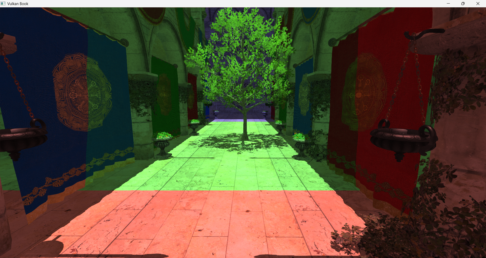

# Chapter 16 - Cascade Shadows

In this chapter, we will add shadows to the scene applying Cascaded Shadow Maps (CSM). This chapter applies the techniques shown by Sascha Willems in his Vulkan examples. Specifically, it uses part of the source code for the examples related to [cascaded shadow mapping](https://github.com/SaschaWillems/Vulkan/blob/master/examples/shadowmappingcascade) and [deferred shadow ](https://github.com/SaschaWillems/Vulkan/blob/master/examples/deferredshadows). I cannot stress enough how good are the examples provided by Sascha Willems, you should carefully have a look at them.

You can find the complete source code for this chapter [here](../../booksamples/chapter-16).

## Cascade shadow mapping overview

In order to render shadows, we just need to render the scene from the light point of view creating a depth map. Later on, when rendering the scene, we transform the coordinates of the fragment being rendered to the light view space and check its depth. If its depth is lower than the depth stored in the depth map for those coordinates, it will mean that the fragment is not in shadows. In our case, we will be calculating shadows for a single directional light, so when rendering the depth map we will be using an orthographic projection (you can think about directional light as a source which casts parallel rays from the infinity. Those rays do not converge at a focal point).


The problem with shadow depth maps is their resolution, we need to cover a wide area, and in order to get high quality visuals we would need huge images to store that information. One possible solution for that are cascade shadow maps. It is based on the fact that, shadows of objects that are closer to the camera need to have a higher quality than shadows for distant objects. The approach that Cascaded Shadow Maps (CSMs) use is to divide the view frustum into several splits. Splits closer to the camera cover a smaller amount of space whilst distant regions cover much wider regions. CSMs use one depth map per split. For each of these splits, the depth map is rendered, adjusting the light view and projection matrices to cover each split.

## Rendering the depth map

We will start by creating a new package, `org.vulkanb.eng.graph.shadows`, that will hold all the code related to calculate and render the shadow maps. The first class in this package will be responsible of calculating the matrices required to render the shadow maps from light perspective. The class is named `CascadeData` and will store the projection view matrix (from light perspective) for a specific cascade shadow split (`projViewMatrix` attribute) and the far plane distance for its ortho-projection matrix (`splitDistance` attribute):

```java
package org.vulkanb.eng.graph.shadow;

import org.joml.Matrix4f;

public class CascadeData {

    private final Matrix4f projViewMatrix;
    private float splitDistance;

    public CascadeData() {
        projViewMatrix = new Matrix4f();
    }

    public Matrix4f getProjViewMatrix() {
        return projViewMatrix;
    }

    public float getSplitDistance() {
        return splitDistance;
    }

    public void setProjViewMatrix(Matrix4f projViewMatrix) {
        this.projViewMatrix.set(projViewMatrix);
    }

    public void setSplitDistance(float splitDistance) {
        this.splitDistance = splitDistance;
    }
}
```

The `CascadeShadows` class groups all the date defined by each shadow cascade:

```java
package org.vulkanb.eng.graph.shadow;

import org.vulkanb.eng.scene.Scene;

import java.util.*;

public class CascadeShadows {

    private final List<CascadeData> cascadeData;

    public CascadeShadows() {
        cascadeData = new ArrayList<>();
        for (int i = 0; i < Scene.SHADOW_MAP_CASCADE_COUNT; i++) {
            cascadeData.add(new CascadeData());
        }
    }

    public List<CascadeData> getCascadeData() {
        return cascadeData;
    }
}
```

Shadow cascades calculation is done in the class `ShadowUtils`which starts like this:

```java
package org.vulkanb.eng.graph.shadow;

import org.joml.*;
import org.vulkanb.eng.EngCfg;
import org.vulkanb.eng.scene.*;

import java.util.List;

public class ShadowUtils {

    private static final float LAMBDA = 0.95f;
    private static final Vector3f UP = new Vector3f(0.0f, 1.0f, 0.0f);
    private static final Vector3f UP_ALT = new Vector3f(0.0f, 0.0f, 1.0f);

    private ShadowUtils() {
        // Utility class
    }

    // Function are derived from Vulkan examples from Sascha Willems, and licensed under the MIT License:
    // https://github.com/SaschaWillems/Vulkan/tree/master/examples/shadowmappingcascade, which are based on
    // https://johanmedestrom.wordpress.com/2016/03/18/opengl-cascaded-shadow-maps/
    // combined with this source: https://github.com/TheRealMJP/Shadows
    public static void updateCascadeShadows(CascadeShadows cascadeShadows, Scene scene) {
        Camera camera = scene.getCamera();
        Matrix4f viewMatrix = camera.getViewMatrix();
        Projection projection = scene.getProjection();
        Matrix4f projMatrix = projection.getProjectionMatrix();
        Light[] lights = scene.getLights();
        int numLights = lights.length;
        Light dirLight = null;
        for (int i = 0; i < numLights; i++) {
            if (lights[i].position().w == 0) {
                dirLight = lights[i];
                break;
            }
        }
        if (dirLight == null) {
            throw new RuntimeException("Could not find directional light");
        }
        Vector4f lightPos = dirLight.position();

        float[] cascadeSplits = new float[Scene.SHADOW_MAP_CASCADE_COUNT];

        float nearClip = projection.getZNear();
        float farClip = projection.getZFar();
        float clipRange = farClip - nearClip;

        float minZ = nearClip;
        float maxZ = nearClip + clipRange;

        float range = maxZ - minZ;
        float ratio = maxZ / minZ;

        ...
    }
    ...
}
```

We start by retrieving the matrices that we will need to calculate the splits data, the view and projection matrices, the light position and the near and far clips of the perspective projection we are using to render the scene. With that information we can calculate the split distances for each of the shadow cascades:

```java
public class ShadowUtils {
    ...
    public static void updateCascadeShadows(CascadeShadows cascadeShadows, Scene scene) {
        ...
        List<CascadeData> cascadeDataList = cascadeShadows.getCascadeData();
        int numCascades = cascadeDataList.size();

        // Calculate split depths based on view camera frustum
        // Based on method presented in https://developer.nvidia.com/gpugems/GPUGems3/gpugems3_ch10.html
        for (int i = 0; i < numCascades; i++) {
            float p = (i + 1) / (float) (Scene.SHADOW_MAP_CASCADE_COUNT);
            float log = (float) (minZ * java.lang.Math.pow(ratio, p));
            float uniform = minZ + range * p;
            float d = LAMBDA * (log - uniform) + uniform;
            cascadeSplits[i] = (d - nearClip) / clipRange;
        }
        ...
    }
    ...
}
```

The algorithm used to calculate the split positions, uses a logarithm schema to better distribute the distances. We could just use other different approaches, such as splitting the cascades evenly, or according to a pre-set proportion,. The advantage of the logarithm schema is that it uses less space for near view splits, achieving a higher resolution for the elements closer to the camera. You can check the [NVIDIA article](https://developer.nvidia.com/gpugems/GPUGems3/gpugems3_ch10.html) for the math details. The `cascadeSplits` array will have a set of values in the range [0, 1] which we will use later on to perform the required calculations to get the split distances and the projection matrices for each cascade.

Now we define a loop to calculate all the data for the cascade splits. In that loop, we first create the frustum corners in NDC (Normalized Device Coordinates) space. After that, we project those coordinates into world space by using the inverse of the view and perspective matrices. Since we are using directional lights, we will use ortographic projection matrices for rendering the shadow maps, this is the reason why we set, as the NDC coordinates, just the limits of the cube that contains the visible volume (distant objects will not be rendered smaller, as in the perspective projection).

```java
public class ShadowUtils {
    ...
    public static void updateCascadeShadows(CascadeShadows cascadeShadows, Scene scene) {
        ...
        // Calculate orthographic projection matrix for each cascade
        float lastSplitDist = 0.0f;
        for (int i = 0; i < numCascades; i++) {
            float splitDist = cascadeSplits[i];

            Vector3f[] frustumCorners = new Vector3f[]{
                    new Vector3f(-1.0f, 1.0f, 0.0f),
                    new Vector3f(1.0f, 1.0f, 0.0f),
                    new Vector3f(1.0f, -1.0f, 0.0f),
                    new Vector3f(-1.0f, -1.0f, 0.0f),
                    new Vector3f(-1.0f, 1.0f, 1.0f),
                    new Vector3f(1.0f, 1.0f, 1.0f),
                    new Vector3f(1.0f, -1.0f, 1.0f),
                    new Vector3f(-1.0f, -1.0f, 1.0f),
            };

            // Project frustum corners into world space
            var invCam = (new Matrix4f(projMatrix).mul(viewMatrix)).invert();
            for (int j = 0; j < 8; j++) {
                Vector4f invCorner = new Vector4f(frustumCorners[j], 1.0f).mul(invCam);
                frustumCorners[j] = new Vector3f(invCorner.x, invCorner.y, invCorner.z).div(invCorner.w);
            }
            ...
        }
        ...
    }
    ...
}
```

At this point, `frustumCorners` variable has the coordinates of a cube which contains the visible space, but we need the world coordinates for this specific cascade split. Therefore, the next step is to put the cascade distances calculated at the beginning of them method into work. We adjust the coordinates of near and far planes for this specific split according to the pre-calculated distances:

```java
public class ShadowUtils {
    ...
    public static void updateCascadeShadows(CascadeShadows cascadeShadows, Scene scene) {
        ...
        for (int i = 0; i < numCascades; i++) {
            ...
            for (int j = 0; j < 4; j++) {
                var dist = new Vector3f(frustumCorners[j + 4]).sub(frustumCorners[j]);
                frustumCorners[j + 4] = new Vector3f(frustumCorners[j]).add(new Vector3f(dist).mul(splitDist));
                frustumCorners[j] = new Vector3f(frustumCorners[j]).add(new Vector3f(dist).mul(lastSplitDist));
            }
            ...
        }
        ...
    }
    ...
}
```

After that, we calculate the coordinates of the center of that split (still working in world coordinates), and the radius of that split:

```java
public class ShadowUtils {
    ...
    public static void updateCascadeShadows(CascadeShadows cascadeShadows, Scene scene) {
        ...
        for (int i = 0; i < numCascades; i++) {
            ...
            // Get frustum center
            var frustumCenter = new Vector3f(0.0f);
            for (int j = 0; j < 8; j++) {
                frustumCenter.add(frustumCorners[j]);
            }
            frustumCenter.div(8.0f);

            var up = UP;
            float sphereRadius = 0.0f;
            for (int j = 0; j < 8; j++) {
                float dist = new Vector3f(frustumCorners[j]).sub(frustumCenter).length();
                sphereRadius = java.lang.Math.max(sphereRadius, dist);
            }
            sphereRadius = (float) java.lang.Math.ceil(sphereRadius * 16.0f) / 16.0f;
            ...
        }
        ...
    }
    ...
}
```

With that information, we can now calculate the view matrix, from the light point of view and the orthographic projection matrix as well as the split distance (in camera view coordinates):

```java
public class ShadowUtils {
    ...
    public static void updateCascadeShadows(CascadeShadows cascadeShadows, Scene scene) {
        ...
        for (int i = 0; i < numCascades; i++) {
            ...
            var maxExtents = new Vector3f(sphereRadius, sphereRadius, sphereRadius);
            var minExtents = new Vector3f(maxExtents).mul(-1.0f);

            var lightDir = new Vector3f(lightPos.x, lightPos.y, lightPos.z);
            // Get position of the shadow camera
            var shadowCameraPos = new Vector3f(frustumCenter).add(lightDir.mul(minExtents.z));

            float dot = java.lang.Math.abs(new Vector3f(lightPos.x, lightPos.y, lightPos.z).dot(up));
            if (dot == 1.0f) {
                up = UP_ALT;
            }

            var lightViewMatrix = new Matrix4f().lookAt(shadowCameraPos, frustumCenter, up);
            var lightOrthoMatrix = new Matrix4f().ortho
                    (minExtents.x, maxExtents.x, minExtents.y, maxExtents.y, 0.0f, maxExtents.z - minExtents.z, true);

            // Stabilize shadow
            int shadowMapSize = EngCfg.getInstance().getShadowMapSize();
            Vector4f shadowOrigin = new Vector4f(0.0f, 0.0f, 0.0f, 1.0f);
            lightViewMatrix.transform(shadowOrigin);
            shadowOrigin.mul(shadowMapSize / 2.0f);

            Vector4f roundedOrigin = new Vector4f(shadowOrigin).round();
            Vector4f roundOffset = roundedOrigin.sub(shadowOrigin);
            roundOffset.mul(2.0f / shadowMapSize);
            roundOffset.z = 0.0f;
            roundOffset.w = 0.0f;

            lightOrthoMatrix.m30(lightOrthoMatrix.m30() + roundOffset.x);
            lightOrthoMatrix.m31(lightOrthoMatrix.m31() + roundOffset.y);
            lightOrthoMatrix.m32(lightOrthoMatrix.m32() + roundOffset.z);
            lightOrthoMatrix.m33(lightOrthoMatrix.m33() + roundOffset.w);

            // Store split distance and matrix in cascade
            CascadeData cascadeData = cascadeDataList.get(i);
            cascadeData.setSplitDistance((nearClip + splitDist * clipRange) * -1.0f);
            cascadeData.setProjViewMatrix(lightOrthoMatrix.mul(lightViewMatrix));

            lastSplitDist = cascadeSplits[i];
        }
        ...
    }
    ...
}
```

The next step is to create a new class that will control the rendering of the shadow maps. The class will be named `ShadowRender` and will render the scene from the light point of view for each shadow split. That information will be stored as a depth map, which in our case, will be a multi-layered image. One approach to achieve this is to render the scene, from the light point of view for each of the cascades individually. We would be rendering the scene as many times as cascade splits we have, storing the depth information for each split in a layer. We can do this much better, we could achieve the same results just submitting the drawing commands for the scene elements once, by using a geometry shader. Geometry shaders are executed between vertex and fragment shaders, allowing us to transform the primitives. In this specific case, we will use them to generate new primitives, one for each of the cascade splits taking as an input the original primitives which are generated in the vertex shader while rendering the scene. That is, taking a single triangle we will be generating three triangles, one per cascade split. We will see the details when examining the shaders, however, keep in mind that in this case we will be using a set of vertex-geometry-fragment shaders, instead of the usual vertex-fragment shaders pair that we have been employing on previous chapters.

The `ShadowRender` class starts like this:

```java
package org.vulkanb.eng.graph.shadow;

import org.joml.Matrix4f;
import org.lwjgl.system.*;
import org.lwjgl.util.shaderc.Shaderc;
import org.lwjgl.vulkan.*;
import org.tinylog.Logger;
import org.vulkanb.eng.*;
import org.vulkanb.eng.graph.*;
import org.vulkanb.eng.graph.scn.VtxBuffStruct;
import org.vulkanb.eng.graph.vk.*;
import org.vulkanb.eng.scene.*;

import java.nio.*;
import java.util.*;

import static org.lwjgl.vulkan.VK13.*;

public class ShadowRender {

    public static final int DEPTH_FORMAT = VK_FORMAT_D32_SFLOAT;
    private static final String DESC_ID_MAT = "SHADOW_DESC_ID_MAT";
    private static final String DESC_ID_PRJ = "SHADOW_DESC_ID_PRJ";
    private static final String DESC_ID_TEXT = "SHADOW_SCN_DESC_ID_TEXT";
    private static final String FRAGMENT_SHADER_FILE_GLSL = "resources/shaders/shadow_frg.glsl";
    private static final String FRAGMENT_SHADER_FILE_SPV = FRAGMENT_SHADER_FILE_GLSL + ".spv";
    private static final int PUSH_CONSTANTS_SIZE = VkUtils.MAT4X4_SIZE + VkUtils.INT_SIZE;
    private static final String SHADOW_GEOMETRY_SHADER_FILE_GLSL = "resources/shaders/shadow_geom.glsl";
    private static final String SHADOW_GEOMETRY_SHADER_FILE_SPV = SHADOW_GEOMETRY_SHADER_FILE_GLSL + ".spv";
    private static final String VERTEX_SHADER_FILE_GLSL = "resources/shaders/shadow_vtx.glsl";
    private static final String VERTEX_SHADER_FILE_SPV = VERTEX_SHADER_FILE_GLSL + ".spv";

    private final CascadeShadows[] cascadeShadows;
    private final VkClearValue clrValueDepth;
    private final Attachment depthAttachment;
    private final VkRenderingAttachmentInfo depthAttachmentInfo;
    private final DescSetLayout descLayoutFrgStorage;
    private final Pipeline pipeline;
    private final VkBuffer[] prjBuffers;
    private final ByteBuffer pushConstBuff;
    private final VkRenderingInfo renderingInfo;
    private final DescSetLayout textDescSetLayout;
    private final TextureSampler textureSampler;
    private final DescSetLayout uniformGeomDescSetLayout;

    public ShadowRender(VkCtx vkCtx) {
        clrValueDepth = VkClearValue.calloc();
        clrValueDepth.color(c -> c.float32(0, 1.0f));
        depthAttachment = createDepthAttachment(vkCtx);
        depthAttachmentInfo = createDepthAttachmentInfo(depthAttachment, clrValueDepth);

        pushConstBuff = MemoryUtil.memAlloc(PUSH_CONSTANTS_SIZE);

        renderingInfo = createRenderInfo(depthAttachmentInfo);
        ShaderModule[] shaderModules = createShaderModules(vkCtx);

        uniformGeomDescSetLayout = new DescSetLayout(vkCtx, new DescSetLayout.LayoutInfo(VK_DESCRIPTOR_TYPE_UNIFORM_BUFFER,
                0, 1, VK_SHADER_STAGE_GEOMETRY_BIT));
        long buffSize = (long) VkUtils.MAT4X4_SIZE * Scene.SHADOW_MAP_CASCADE_COUNT;
        prjBuffers = VkUtils.createHostVisibleBuffs(vkCtx, buffSize, VkUtils.MAX_IN_FLIGHT,
                VK_BUFFER_USAGE_UNIFORM_BUFFER_BIT, DESC_ID_PRJ, uniformGeomDescSetLayout);

        descLayoutFrgStorage = new DescSetLayout(vkCtx, new DescSetLayout.LayoutInfo(VK_DESCRIPTOR_TYPE_STORAGE_BUFFER,
                0, 1, VK_SHADER_STAGE_FRAGMENT_BIT));

        var textureSamplerInfo = new TextureSamplerInfo(VK_SAMPLER_ADDRESS_MODE_REPEAT,
                VK_BORDER_COLOR_INT_OPAQUE_BLACK, 1, true);
        textureSampler = new TextureSampler(vkCtx, textureSamplerInfo);
        textDescSetLayout = new DescSetLayout(vkCtx, new DescSetLayout.LayoutInfo(VK_DESCRIPTOR_TYPE_COMBINED_IMAGE_SAMPLER,
                0, TextureCache.MAX_TEXTURES, VK_SHADER_STAGE_FRAGMENT_BIT));

        pipeline = createPipeline(vkCtx, shaderModules, new DescSetLayout[]{uniformGeomDescSetLayout, textDescSetLayout,
                descLayoutFrgStorage});
        Arrays.asList(shaderModules).forEach(s -> s.cleanup(vkCtx));

        cascadeShadows = new CascadeShadows[VkUtils.MAX_IN_FLIGHT];
        for (int i = 0; i < VkUtils.MAX_IN_FLIGHT; i++) {
            cascadeShadows[i] = new CascadeShadows();
        }
    }
    ...
}
```

As you can see, its definition is quite similar to other render classes defined before, we will render to a depth attachment, and will use some descriptor sets in the
shaders. We need tio define a constant in the `Scene` class to set yup the maximum number of cascade shadow maps:

```java
public class Scene {
    ...
    public static final int SHADOW_MAP_CASCADE_COUNT = 3;
    ...
}
```

Let's review the methods used in the constructor:

```java
public class ShadowRender {
    ...
    private static Attachment createDepthAttachment(VkCtx vkCtx) {
        int shadowMapSize = EngCfg.getInstance().getShadowMapSize();
        return new Attachment(vkCtx, shadowMapSize, shadowMapSize,
                DEPTH_FORMAT, VK_IMAGE_USAGE_DEPTH_STENCIL_ATTACHMENT_BIT, Scene.SHADOW_MAP_CASCADE_COUNT);
    }

    private static VkRenderingAttachmentInfo createDepthAttachmentInfo(Attachment depthAttachment, VkClearValue clearValue) {
        return VkRenderingAttachmentInfo.calloc()
                .sType$Default()
                .imageView(depthAttachment.getImageView().getVkImageView())
                .imageLayout(VK_IMAGE_LAYOUT_DEPTH_STENCIL_ATTACHMENT_OPTIMAL)
                .loadOp(VK_ATTACHMENT_LOAD_OP_CLEAR)
                .storeOp(VK_ATTACHMENT_STORE_OP_STORE)
                .clearValue(clearValue);
    }

    private static Pipeline createPipeline(VkCtx vkCtx, ShaderModule[] shaderModules, DescSetLayout[] descSetLayouts) {
        var vtxBuffStruct = new VtxBuffStruct();
        var buildInfo = new PipelineBuildInfo(shaderModules, vtxBuffStruct.getVi(), new int[]{})
                .setDepthFormat(DEPTH_FORMAT)
                .setPushConstRanges(
                        new PushConstRange[]{
                                new PushConstRange(VK_SHADER_STAGE_VERTEX_BIT, 0, PUSH_CONSTANTS_SIZE)
                        })
                .setDescSetLayouts(descSetLayouts)
                .setDescSetLayouts(descSetLayouts)
                .setUseBlend(true)
                .setDepthClamp(vkCtx.getDevice().getDepthClamp());
        var pipeline = new Pipeline(vkCtx, buildInfo);
        vtxBuffStruct.cleanup();
        return pipeline;
    }

    private static VkRenderingInfo createRenderInfo(VkRenderingAttachmentInfo depthAttachments) {
        VkRenderingInfo result = VkRenderingInfo.calloc();
        try (var stack = MemoryStack.stackPush()) {
            int shadowMapSize = EngCfg.getInstance().getShadowMapSize();
            VkExtent2D extent = VkExtent2D.calloc(stack);
            extent.width(shadowMapSize);
            extent.height(shadowMapSize);
            var renderArea = VkRect2D.calloc(stack).extent(extent);
            result.sType$Default()
                    .renderArea(renderArea)
                    .layerCount(Scene.SHADOW_MAP_CASCADE_COUNT)
                    .pDepthAttachment(depthAttachments);
        }
        return result;
    }

    private static ShaderModule[] createShaderModules(VkCtx vkCtx) {
        if (EngCfg.getInstance().isShaderRecompilation()) {
            ShaderCompiler.compileShaderIfChanged(VERTEX_SHADER_FILE_GLSL, Shaderc.shaderc_glsl_vertex_shader);
            ShaderCompiler.compileShaderIfChanged(SHADOW_GEOMETRY_SHADER_FILE_GLSL, Shaderc.shaderc_glsl_geometry_shader);
            ShaderCompiler.compileShaderIfChanged(FRAGMENT_SHADER_FILE_GLSL, Shaderc.shaderc_glsl_fragment_shader);
        }
        return new ShaderModule[]{
                new ShaderModule(vkCtx, VK_SHADER_STAGE_VERTEX_BIT, VERTEX_SHADER_FILE_SPV, null),
                new ShaderModule(vkCtx, VK_SHADER_STAGE_GEOMETRY_BIT, SHADOW_GEOMETRY_SHADER_FILE_SPV, null),
                new ShaderModule(vkCtx, VK_SHADER_STAGE_FRAGMENT_BIT, FRAGMENT_SHADER_FILE_SPV, null),
        };
    }
    ...
}
```

We create the depth attachment in the `createDepthAttachment` information. In this case it will be a single image but with as many layers as cascade shadows will be. We
will see how this modifies the creation of attachments. The size of the depth image will not be dependant on the screen size, it weill be a configurable value.
The rest of the methods to crate attachment information, render information and shader and pipeline are quite similar.
In this case, we are using three shader modules for vertex, geometry and fragment shading.

The `ShadowRender` class defines also a `cleanup` method to free the resources and some getters to retrieve the depth attachment and the cascade shadows.

```java
public class ShadowRender {
    ...
    public void cleanup(VkCtx vkCtx) {
        pipeline.cleanup(vkCtx);
        uniformGeomDescSetLayout.cleanup(vkCtx);
        descLayoutFrgStorage.cleanup(vkCtx);
        textDescSetLayout.cleanup(vkCtx);
        textureSampler.cleanup(vkCtx);
        Arrays.asList(prjBuffers).forEach(b -> b.cleanup(vkCtx));
        renderingInfo.free();
        depthAttachmentInfo.free();
        depthAttachment.cleanup(vkCtx);
        MemoryUtil.memFree(pushConstBuff);
        clrValueDepth.free();
    }

    public CascadeShadows getCascadeShadows(int currentFrame) {
        return cascadeShadows[currentFrame];
    }

    public Attachment getDepthAttachment() {
        return depthAttachment;
    }
    ...
}
```

We will provide also a method to load material information, that is to create associated descriptor sets to be able to access materials buffer. We need this in order
to prevent rendering depth information for transparent objects. This will be done in the `loadMaterials` method:

```java
public class ShadowRender {
    ...
    public void loadMaterials(VkCtx vkCtx, MaterialsCache materialsCache, TextureCache textureCache) {
        DescAllocator descAllocator = vkCtx.getDescAllocator();
        Device device = vkCtx.getDevice();
        DescSet descSet = descAllocator.addDescSet(device, DESC_ID_MAT, descLayoutFrgStorage);
        DescSetLayout.LayoutInfo layoutInfo = descLayoutFrgStorage.getLayoutInfo();
        var buffer = materialsCache.getMaterialsBuffer();
        descSet.setBuffer(device, buffer, buffer.getRequestedSize(), layoutInfo.binding(), layoutInfo.descType());

        List<ImageView> imageViews = textureCache.getAsList().stream().map(Texture::getImageView).toList();
        descSet = vkCtx.getDescAllocator().addDescSet(device, DESC_ID_TEXT, textDescSetLayout);
        descSet.setImagesArr(device, imageViews, textureSampler, 0);
    }
    ...
}
```

Let's examine now the `render` method which renders the scene to generate the depth maps:

```java
public class ShadowRender {
    ...
    public void render(EngCtx engCtx, VkCtx vkCtx, CmdBuffer cmdBuffer, ModelsCache modelsCache,
                       MaterialsCache materialsCache, int currentFrame) {
        try (var stack = MemoryStack.stackPush()) {
            Scene scene = engCtx.scene();

            ShadowUtils.updateCascadeShadows(cascadeShadows[currentFrame], scene);

            VkCommandBuffer cmdHandle = cmdBuffer.getVkCommandBuffer();

            VkUtils.imageBarrier(stack, cmdHandle, depthAttachment.getImage().getVkImage(),
                    VK_IMAGE_LAYOUT_UNDEFINED, VK_IMAGE_LAYOUT_DEPTH_STENCIL_ATTACHMENT_OPTIMAL,
                    VK_PIPELINE_STAGE_2_EARLY_FRAGMENT_TESTS_BIT | VK_PIPELINE_STAGE_2_LATE_FRAGMENT_TESTS_BIT,
                    VK_PIPELINE_STAGE_2_EARLY_FRAGMENT_TESTS_BIT | VK_PIPELINE_STAGE_2_LATE_FRAGMENT_TESTS_BIT,
                    VK_ACCESS_2_NONE, VK_ACCESS_2_DEPTH_STENCIL_ATTACHMENT_WRITE_BIT,
                    VK_IMAGE_ASPECT_DEPTH_BIT);

            vkCmdBeginRendering(cmdHandle, renderingInfo);

            vkCmdBindPipeline(cmdHandle, VK_PIPELINE_BIND_POINT_GRAPHICS, pipeline.getVkPipeline());

            int shadowMapSize = EngCfg.getInstance().getShadowMapSize();
            int width = shadowMapSize;
            int height = shadowMapSize;
            var viewport = VkViewport.calloc(1, stack)
                    .x(0)
                    .y(height)
                    .height(-height)
                    .width(width)
                    .minDepth(0.0f)
                    .maxDepth(1.0f);
            vkCmdSetViewport(cmdHandle, 0, viewport);

            var scissor = VkRect2D.calloc(1, stack)
                    .extent(it -> it.width(width).height(height))
                    .offset(it -> it.x(0).y(0));
            vkCmdSetScissor(cmdHandle, 0, scissor);

            updateProjBuffer(vkCtx, currentFrame);
            DescAllocator descAllocator = vkCtx.getDescAllocator();
            LongBuffer descriptorSets = stack.mallocLong(3)
                    .put(0, descAllocator.getDescSet(DESC_ID_PRJ, currentFrame).getVkDescriptorSet())
                    .put(1, descAllocator.getDescSet(DESC_ID_TEXT).getVkDescriptorSet())
                    .put(2, descAllocator.getDescSet(DESC_ID_MAT).getVkDescriptorSet());
            vkCmdBindDescriptorSets(cmdHandle, VK_PIPELINE_BIND_POINT_GRAPHICS, pipeline.getVkPipelineLayout(),
                    0, descriptorSets, null);

            LongBuffer vertexBuffer = stack.mallocLong(1);
            LongBuffer offsets = stack.mallocLong(1).put(0, 0L);

            List<Entity> entities = scene.getEntities();
            int numEntities = entities.size();
            for (int i = 0; i < numEntities; i++) {
                var entity = entities.get(i);
                VulkanModel model = modelsCache.getModel(entity.getModelId());
                List<VulkanMesh> vulkanMeshList = model.getVulkanMeshList();
                int numMeshes = vulkanMeshList.size();
                for (int j = 0; j < numMeshes; j++) {
                    var vulkanMesh = vulkanMeshList.get(j);
                    String materialId = vulkanMesh.materialdId();
                    int materialIdx = materialsCache.getPosition(materialId);
                    VulkanMaterial vulkanMaterial = materialsCache.getMaterial(materialId);
                    if (vulkanMaterial == null) {
                        Logger.warn("Mesh [{}] in model [{}] does not have material", j, model.getId());
                        continue;
                    }
                    setPushConstants(cmdHandle, entity.getModelMatrix(), materialIdx);
                    vertexBuffer.put(0, vulkanMesh.verticesBuffer().getBuffer());

                    vkCmdBindVertexBuffers(cmdHandle, 0, vertexBuffer, offsets);
                    vkCmdBindIndexBuffer(cmdHandle, vulkanMesh.indicesBuffer().getBuffer(), 0, VK_INDEX_TYPE_UINT32);
                    vkCmdDrawIndexed(cmdHandle, vulkanMesh.numIndices(), 1, 0, 0, 0);
                }
            }

            vkCmdEndRendering(cmdHandle);
        }
    }
    ...
}
```

The method is quite similar to the one used in the `ScneRender` class, with the following differences:

- We update cascade shadow maps information.
- We do not need to render opaque elements first since we will not be using blending, we will just discard fragments below a certain transparent threshold.
- We need to setup an image barrier over the depth image. We need to wait for any previous command in fragment test stage to finish, and we need to ensure that the image
is in the `VK_IMAGE_LAYOUT_DEPTH_STENCIL_ATTACHMENT_OPTIMAL` layout.

We will need two methods to se tup push constants and upload cascade shadows projection matrices:
```java
public class ShadowRender {
    ...
    private void setPushConstants(VkCommandBuffer cmdHandle, Matrix4f modelMatrix, int materialIdx) {
        modelMatrix.get(0, pushConstBuff);
        pushConstBuff.putInt(VkUtils.MAT4X4_SIZE, materialIdx);
        vkCmdPushConstants(cmdHandle, pipeline.getVkPipelineLayout(), VK_SHADER_STAGE_VERTEX_BIT, 0, pushConstBuff);
    }

    private void updateProjBuffer(VkCtx vkCtx, int currentFrame) {
        int offset = 0;
        List<CascadeData> cascadeDataList = cascadeShadows[currentFrame].getCascadeData();
        int numCascades = cascadeDataList.size();
        VkBuffer vkBuffer = prjBuffers[currentFrame];
        long mappedMemory = vkBuffer.map(vkCtx);
        ByteBuffer buff = MemoryUtil.memByteBuffer(mappedMemory, (int) vkBuffer.getRequestedSize());
        for (int i = 0; i < numCascades; i++) {
            CascadeData cascadeData = cascadeDataList.get(i);
            cascadeData.getProjViewMatrix().get(offset, buff);
            offset += VkUtils.MAT4X4_SIZE;
        }
        vkBuffer.unMap(vkCtx);
    }
}
```

Since the image used to update shadow maps does not depend on the screen size, we do not need to provide a `resize` method.

The vertex shader (`shadow_vtx.glsl`) is quite simple, we just apply the model matrix, passed as a push constant, to transform the input coordinates. We need also to pass the texture coordinates to the next shader (geometry).

```glsl
#version 450

layout(location = 0) in vec3 entityPos;
layout(location = 1) in vec3 entityNormal;
layout(location = 2) in vec3 entityTangent;
layout(location = 3) in vec3 entityBitangent;
layout(location = 4) in vec2 entityTextCoords;

layout(push_constant) uniform matrices {
    mat4 modelMatrix;
    uint materialIdx;
} push_constants;

layout (location = 0) out vec2 outTextCoord;
layout (location = 1) out flat uint outMaterialIdx;

void main()
{
    outTextCoord   = entityTextCoords;
    outMaterialIdx = push_constants.materialIdx;

    gl_Position = push_constants.modelMatrix * vec4(entityPos, 1.0f);
}
```

The interesting part comes in the geometry shader (`shadow_geom.glsl`):

```glsl
#version 450

// You should change this manually if GraphConstants.SHADOW_MAP_CASCADE_COUNT changes
#define SHADOW_MAP_CASCADE_COUNT 3

layout (triangles, invocations = SHADOW_MAP_CASCADE_COUNT) in;
layout (triangle_strip, max_vertices = 3) out;

layout (location = 0) in vec2 inTextCoords[];
layout (location = 1) in flat uint inMaterialIdx[];

layout (location = 0) out vec2 outTextCoords;
layout (location = 1) out flat uint outMaterialIdx;

layout(set = 0, binding = 0) uniform ProjUniforms {
    mat4 projViewMatrices[SHADOW_MAP_CASCADE_COUNT];
} projUniforms;


void main()
{
    for (int i = 0; i < 3; i++)
    {
        outTextCoords = inTextCoords[i];
        outMaterialIdx = inMaterialIdx[i];
        gl_Layer = gl_InvocationID;
        gl_Position = projUniforms.projViewMatrices[gl_InvocationID] * gl_in[i].gl_Position;
        EmitVertex();
    }
    EndPrimitive();
}
```

First of all, unfortunately, we cannot pass the number of cascade splits as a specialization constant or as an uniform. The geometry shader will be instanced (please do not mix this with instanced rendering, which is a different concept), that is we will be generating multiple primitives (triangles) for a single input primitive. That is, the geometry shader will be executed, instanced, many times for each input triangle. This is controlled by the `invocations` parameter in the layout qualifier. This parameter requires a literal integer, therefore, we cannot use uniforms or specialization constants to pass the number of splits. Please keep this in mind if you want to modify that number, you will need to update the geometry shader manually. Taking all of this into consideration, the main method, contains a loop that will generate as many vertices as vertices has the input primitive multiplied by the number of invocations. For each of them, we will apply the projection view matrix associated to one of the cascade splits, storing that information in a specific layer of the depth image used as an output attachment. The geometry shader will be executed three times for each input primitive, therefore, a single triangle will generate three. 

If we do not want to use geometry shaders, we could get the same results using a fragment shader. In this case, however, we would need to record the commands to draw the scene items as many times as cascade splits we have. In this approach we would need also dedicated image views (one per split) to dump the results to a specific layer of the output attachment. In a fragment shader we cannot specify the layer where we should dump the results. In the geometry shader, we are setting this by using the `gl_Layer` pre-built variable, which is assigned to the iteration of the geometry shader (from `0` to `invocations`).

Another important aspect is that we receive the texture coordinates in the `inTextCoords` input variable. This is declared as an array, which is mandatory for input variables in geometry shaders. We use that input variable to pass it to the fragment shader stage using the `outTextCoords` variable.

The fragment shader, `shadow_frg.glsl`, is defined like this:
```glsl
#version 450

// Keep in sync manually with Java code
const int MAX_TEXTURES = 100;

layout (location = 0) in vec2 inTextCoords;
layout (location = 1) in flat uint inMaterialIdx;

struct Material {
    vec4 diffuseColor;
    uint hasTexture;
    uint textureIdx;
    uint hasNormalMap;
    uint normalMapIdx;
    uint hasRoughMap;
    uint roughMapIdx;
    float roughnessFactor;
    float metallicFactor;
};

layout(set = 1, binding = 0) uniform sampler2D textSampler[MAX_TEXTURES];
layout(set = 2, binding = 0) readonly buffer MaterialUniform {
    Material materials[];
} matUniform;

void main()
{
    Material material = matUniform.materials[inMaterialIdx];
    vec4 albedo;
    if (material.hasTexture == 1) {
        albedo = texture(textSampler[material.textureIdx], inTextCoords);
    } else {
        albedo = material.diffuseColor;
    }
    if (albedo.a < 0.5) {
        discard;
    }
}
```

As you can see, we use the texture coordinates to check the level of transparency of the fragment and discard the ones below `0.5`. By doing so, we will control that transparent fragments will not cast any shadow. Keep in mind that if you do not need to support transparent elements, you can remove the fragment shader, depth values would be generated correctly just form the output of the geometry shader. In this case, there is no need to have even an empty fragment shader. You can just remove it.

We have modified the `Attachment` class to be able to set up the image layers:

```java
public class Attachment {
    ...
    public Attachment(VkCtx vkCtx, int width, int height, int format, int usage, int layers) {
        ...
        if (layers > 0) {
            imageData.arrayLayers(layers);
        }
        image = new Image(vkCtx, imageData);

        var imageViewData = new ImageView.ImageViewData().format(image.getFormat()).aspectMask(aspectMask);
        if (layers > 1) {
            imageViewData.viewType(VK_IMAGE_VIEW_TYPE_2D_ARRAY);
            imageViewData.layerCount(layers);
        }
        imageView = new ImageView(vkCtx.getDevice(), image.getVkImage(), imageViewData, depthAttachment);
    }
    ...
}
```

## Changes in light stage

Prior to reviewing the changes in the `LightingRender` class, we will examine the changes in the shaders so we can better understand the modifications required in that class. The vertex shader (`light_vtx.glsl`) does not need to be modified at all, the changes will affect the fragment shader (`light_frg.glsl`). Let's dissect the changes. First, we will define a set of specialization constants:

```glsl
...
layout (constant_id = 0) const int SHADOW_MAP_CASCADE_COUNT = 3;
layout (constant_id = 1) const int USE_PCF = 0;
layout (constant_id = 2) const float BIAS = 0.0005;
layout (constant_id = 3) const int DEBUG_SHADOWS = 0;
...
const float SHADOW_FACTOR = 0.25;
...
```

Description of the constants:

- `SHADOW_MAP_CASCADE_COUNT`: It will hold the number of splits we are going to have. 
- `USE_PCF`: It will control if we apply Percentage Closer Filter (`1`) or not (`0`) to the shadows.
- `BIAS`: The depth bias to apply when estimating if a fragment is affected by a shadow or not. This is used to reduce shadow artifacts, such as shadow acne.
- `DEBUG_SHADOWS`: This will control if we apply a color to the fragments to identify the cascade split to which they will assigned (it will need to have the value `1` to activate this).

We will need also to pass cascade shadows information as long as the view matrix to perform how shadows affect final fragment color:

```glsl
...
struct CascadeShadow {
    mat4 projViewMatrix;
    vec4 splitDistance;
};
...
layout(set = 2, binding = 0) readonly buffer Shadows {
    CascadeShadow cascadeshadows[];
} shadows;
layout(scalar, set = 3, binding = 0) uniform SceneInfo {
    vec3 camPos;
    vec3 ambientLightColor;
    uint numLights;
    mat4 viewMatrix;
} sceneInfo;
```

We will create a new function, named `calcShadow`, which given a world position an a cascade split index, will return a shadow factor that will be applied to the final fragment color. If the fragment is not affected by a shadow, the result will be `1`, it will not affect the final color:
```glsl
float calcShadow(vec4 worldPosition, uint cascadeIndex, float bias)
{
    vec4 shadowMapPosition = shadows.cascadeshadows[cascadeIndex].projViewMatrix * worldPosition;

    float shadow = 1.0;
    vec4 shadowCoord = shadowMapPosition / shadowMapPosition.w;
    shadowCoord.x = shadowCoord.x * 0.5 + 0.5;
    shadowCoord.y = (-shadowCoord.y) * 0.5 + 0.5;

    if (USE_PCF == 1) {
        shadow = filterPCF(shadowCoord, cascadeIndex, bias);
    } else {
        shadow = textureProj(shadowCoord, vec2(0, 0), cascadeIndex, bias);
    }
    return shadow;
}
```
This function, transforms from world coordinates space to the NDC space of the directional light, for a specific cascade split, using its ortographic projection. That is, we multiply world space by the projection view matrix of the specified cascade split. After that, we need to transform those coordinates to texture coordinates (that is in the range [0, 1], starting at the top left corner). With that information, we can apply PCF or not. If not, we will call the `textureProj` function which just calculates the shadow factor without applying any filtering and is defined like this:
```glsl
float textureProj(vec4 shadowCoord, vec2 offset, uint cascadeIndex, float bias)
{
    float shadow = 1.0;

    if (shadowCoord.z > -1.0 && shadowCoord.z < 1.0) {
        float dist = texture(shadowSampler, vec3(shadowCoord.st + offset, cascadeIndex)).r;
        if (shadowCoord.w > 0 && dist < shadowCoord.z - bias) {
            shadow = SHADOW_FACTOR;
        }
    }
    return shadow;
}
```

This function just samples the depth maps, generated previously, with the texture coordinates and setting the layer associated to the proper cascade index. If the retrieved depth value is lower than the fragment `z` value , this will mean that this fragment is in a shadow. This function receives an `offset` parameter which purpose will be understood when examining the `filterPCF` function:

```glsl
float filterPCF(vec4 sc, uint cascadeIndex, float bias)
{
    ivec2 texDim = textureSize(shadowSampler, 0).xy;
    float scale = 0.75;
    float dx = scale * 1.0 / float(texDim.x);
    float dy = scale * 1.0 / float(texDim.y);

    float shadowFactor = 0.0;
    int count = 0;
    int range = 2;

    for (int x = -range; x <= range; x++) {
        for (int y = -range; y <= range; y++) {
            shadowFactor += textureProj(sc, vec2(dx*x, dy*y), cascadeIndex, bias);
            count++;
        }
    }
    return shadowFactor / count;
}
```

This purpose of this function to return an average shadow factor calculated using the values obtained from the fragments that surround the current one. It just calculates this, retrieving the shadow factor for each of them, calling the `textureProj` function, by passing an offset that will be used when sampling the shadow map.

In the `main` function is defined like this:

```glsl
void main() {
    vec3 albedo    = texture(albedoSampler, inTextCoord).rgb;
    vec3 normal    = texture(normalsSampler, inTextCoord).rgb;
    vec4 worldPosW = texture(posSampler, inTextCoord);
    vec3 worldPos  = worldPosW.xyz;
    vec3 pbr       = texture(pbrSampler, inTextCoord).rgb;

    float roughness = pbr.g;
    float metallic  = pbr.b;

    vec3 N = normalize(normal);
    vec3 V = normalize(sceneInfo.camPos - worldPos);

    vec3 F0 = vec3(0.04);
    F0 = mix(F0, albedo, metallic);

    vec3 Lo = vec3(0.0);
    float bias = BIAS;
    for (uint i = 0U; i < sceneInfo.numLights; i++) {
        Light light = lights.lights[i];
        // calculate per-light radiance
        vec3 L;
        float attenuation;
        if (light.position.w == 0) {
            // Directional
            L = normalize(-light.position.xyz);
            attenuation = 1.0;
            bias = max(BIAS * 5 * (1.0 - dot(N, L)), BIAS);
        } else {
            vec3 tmpSub = light.position.xyz - worldPos;
            L = normalize(tmpSub);
            float distance = length(tmpSub);
            attenuation = 1.0 / (distance * distance);
        }
        Lo += BRDF(albedo, light.color.rgb * attenuation, L, V, N, metallic, roughness);
    }

    uint cascadeIndex = 0;
    vec4 viewPos = sceneInfo.viewMatrix * worldPosW;
    for (uint i = 0; i < SHADOW_MAP_CASCADE_COUNT - 1; ++i) {
        if (viewPos.z < shadows.cascadeshadows[i].splitDistance.x) {
            cascadeIndex = i + 1;
        }
    }

    float shadowFactor = calcShadow(vec4(worldPos, 1), cascadeIndex, bias);

    vec3 ambient = sceneInfo.ambientLightColor.rgb * albedo;
    vec3 color = ambient + Lo;

    if ( shadowFactor < 0.3) {
        shadowFactor *= shadowFactor;
    }
    outFragColor = vec4(color * shadowFactor, 1.0);

    if (DEBUG_SHADOWS == 1) {
        switch (cascadeIndex) {
            case 0:
            outFragColor.rgb *= vec3(1.0f, 0.25f, 0.25f);
            break;
            case 1:
            outFragColor.rgb *= vec3(0.25f, 1.0f, 0.25f);
            break;
            case 2:
            outFragColor.rgb *= vec3(0.25f, 0.25f, 1.0f);
            break;
            default :
            outFragColor.rgb *= vec3(1.0f, 1.0f, 0.25f);
            break;
        }
    }
}
```

Basically, we cascade shadows splits to select the one that matches the view distance and use that index. With that information we invoke the `calcShadow` function. We
also adapt the bias to take into consideration the direction of the light and the normal to provide better quality. The final fragment color is modulated by the shadow factor.
Finally, if the debug mode is activated we apply a color to that fragment to identify the cascades we are using.

Before examining the changes in the `LightingRender` class we will create a new class named `LightSpecConsts` which will cerate the required structures that will hold specialization constants information. The class is defined like this:

```java
package org.vulkanb.eng.graph.light;

import org.lwjgl.system.MemoryUtil;
import org.lwjgl.vulkan.*;
import org.vulkanb.eng.EngCfg;
import org.vulkanb.eng.graph.vk.VkUtils;
import org.vulkanb.eng.scene.Scene;

import java.nio.ByteBuffer;

public class LightSpecConsts {

    private final ByteBuffer data;
    private final VkSpecializationMapEntry.Buffer specEntryMap;
    private final VkSpecializationInfo specInfo;

    public LightSpecConsts() {
        var engCfg = EngCfg.getInstance();
        data = MemoryUtil.memAlloc(VkUtils.INT_SIZE * 3 + VkUtils.FLOAT_SIZE);
        data.putInt(Scene.SHADOW_MAP_CASCADE_COUNT);
        data.putInt(engCfg.isShadowPcf() ? 1 : 0);
        data.putFloat(engCfg.getShadowBias());
        data.putInt(engCfg.isShadowDebug() ? 1 : 0);
        data.flip();

        specEntryMap = VkSpecializationMapEntry.calloc(4);
        int offset = 0;
        int pos = 0;
        int size = VkUtils.INT_SIZE;
        specEntryMap.get(pos)
                .constantID(pos)
                .size(size)
                .offset(offset);
        offset += size;
        pos++;

        size = VkUtils.INT_SIZE;
        specEntryMap.get(pos)
                .constantID(pos)
                .size(size)
                .offset(offset);
        offset += size;
        pos++;

        size = VkUtils.FLOAT_SIZE;
        specEntryMap.get(pos)
                .constantID(pos)
                .size(size)
                .offset(offset);
        offset += size;
        pos++;

        size = VkUtils.INT_SIZE;
        specEntryMap.get(pos)
                .constantID(pos)
                .size(size)
                .offset(offset);

        specInfo = VkSpecializationInfo.calloc();
        specInfo.pData(data)
                .pMapEntries(specEntryMap);
    }

    public void cleanup() {
        MemoryUtil.memFree(specEntryMap);
        specInfo.free();
        MemoryUtil.memFree(data);
    }

    public VkSpecializationInfo getSpecInfo() {
        return specInfo;
    }
}
```

First, we create a buffer that will hold the specialization constants data, which will be the number of cascade shadows, if we will use PCF, the value of shadow bias and the
debug flag. We need to create one `VkSpecializationMapEntry` for each specialization constant. The `VkSpecializationMapEntry` defines  the numerical identifier used by the constant, the size of the data and the offset in the buffer that holds the data for all the constants. With all that information, we create the `VkSpecializationInfo` structure.

Now we can examine the changes in the `LightingRender` class. First, we will create new attributes for the specialization constants and the cascade shadows data (we will
need one buffer per frame in flight in this case to be able to update it in each frame). This will require new descriptor sets. We will also need more space for
scene information:

```java
public class LightRender {
    ...
    private static final String DESC_ID_SHADOW_MATRICES = "LIGHT_DESC_ID_SHADOW_MATRICES";
    ...
    private final LightSpecConsts lightSpecConsts;
    ...
    private final VkBuffer[] shadowMatrices;
    ...
    public LightRender(VkCtx vkCtx, List<Attachment> attachments) {
        ...
        lightSpecConsts = new LightSpecConsts();
        ShaderModule[] shaderModules = createShaderModules(vkCtx, lightSpecConsts);
        ...
        DescSetLayout.LayoutInfo[] descSetLayouts = new DescSetLayout.LayoutInfo[numAttachments + 1];
        for (int i = 0; i < numAttachments + 1; i++) {
            descSetLayouts[i] = new DescSetLayout.LayoutInfo(VK_DESCRIPTOR_TYPE_COMBINED_IMAGE_SAMPLER, i, 1, VK_SHADER_STAGE_FRAGMENT_BIT);
        }
        attDescSetLayout = new DescSetLayout(vkCtx, descSetLayouts);
        ...
        buffSize = VkUtils.VEC3_SIZE * 2 + VkUtils.INT_SIZE + VkUtils.MAT4X4_SIZE;
        sceneBuffs = VkUtils.createHostVisibleBuffs(vkCtx, buffSize, VkUtils.MAX_IN_FLIGHT,
                VK_BUFFER_USAGE_UNIFORM_BUFFER_BIT, DESC_ID_SCENE, sceneDescSetLayout);

        shadowMatrices = createShadowMatBuffers(vkCtx, storageDescSetLayout);

        pipeline = createPipeline(vkCtx, shaderModules, new DescSetLayout[]{attDescSetLayout, storageDescSetLayout,
                storageDescSetLayout, sceneDescSetLayout});
        ...
    }
    ...
    private static Attachment createColorAttachment(VkCtx vkCtx) {
        ...
        return new Attachment(vkCtx, swapChainExtent.width(), swapChainExtent.height(),
                COLOR_FORMAT, VK_IMAGE_USAGE_COLOR_ATTACHMENT_BIT, 1);
    }
    ...
    private static ShaderModule[] createShaderModules(VkCtx vkCtx, LightSpecConsts lightSpecConsts) {
        if (EngCfg.getInstance().isShaderRecompilation()) {
            ShaderCompiler.compileShaderIfChanged(VERTEX_SHADER_FILE_GLSL, Shaderc.shaderc_glsl_vertex_shader);
            ShaderCompiler.compileShaderIfChanged(FRAGMENT_SHADER_FILE_GLSL, Shaderc.shaderc_glsl_fragment_shader);
        }
        return new ShaderModule[]{
                new ShaderModule(vkCtx, VK_SHADER_STAGE_VERTEX_BIT, VERTEX_SHADER_FILE_SPV, null),
                new ShaderModule(vkCtx, VK_SHADER_STAGE_FRAGMENT_BIT, FRAGMENT_SHADER_FILE_SPV, lightSpecConsts.getSpecInfo()),
        };
    }

    private static VkBuffer[] createShadowMatBuffers(VkCtx vkCtx, DescSetLayout layout) {
        int numBuffs = VkUtils.MAX_IN_FLIGHT;
        VkBuffer[] buffers = new VkBuffer[numBuffs];
        Device device = vkCtx.getDevice();
        DescSet[] descSets = vkCtx.getDescAllocator().addDescSets(device, DESC_ID_SHADOW_MATRICES, numBuffs, layout);
        for (int i = 0; i < numBuffs; i++) {
            long buffSize = (long) (VkUtils.MAT4X4_SIZE + VkUtils.VEC4_SIZE) * Scene.SHADOW_MAP_CASCADE_COUNT;
            buffers[i] = new VkBuffer(vkCtx, buffSize,
                    VK_BUFFER_USAGE_STORAGE_BUFFER_BIT, VMA_MEMORY_USAGE_AUTO_PREFER_DEVICE,
                    VMA_ALLOCATION_CREATE_HOST_ACCESS_SEQUENTIAL_WRITE_BIT, VK_MEMORY_PROPERTY_HOST_VISIBLE_BIT);
            descSets[i].setBuffer(device, buffers[i], buffers[i].getRequestedSize(),
                    layout.getLayoutInfo().binding(), layout.getLayoutInfo().descType());
        }
        return buffers;
    }
    
    public void cleanup() {
        ...
        Arrays.asList(shadowMatrices).forEach(b -> b.cleanup(vkCtx));
        ...
        lightSpecConsts.cleanup();
        ...
    }
    ...
}
```

We will be sampling the light depth map, so we need an extra descriptor set layout for that. The `render` method needs also to be updated:

```java
public class LightRender {
    ...
    public void render(EngCtx engCtx, VkCtx vkCtx, CmdBuffer cmdBuffer, MrtAttachments mrtAttachments,
                       Attachment depthAttachment, CascadeShadows cascadeShadows, int currentFrame) {
        try (var stack = MemoryStack.stackPush()) {
            Scene scene = engCtx.scene();
            ...
            VkUtils.imageBarrier(stack, cmdHandle, depthAttachment.getImage().getVkImage(),
                    VK_IMAGE_LAYOUT_DEPTH_STENCIL_ATTACHMENT_OPTIMAL, VK_IMAGE_LAYOUT_DEPTH_STENCIL_READ_ONLY_OPTIMAL,
                    VK_PIPELINE_STAGE_2_LATE_FRAGMENT_TESTS_BIT, VK_PIPELINE_STAGE_2_FRAGMENT_SHADER_BIT,
                    VK_ACCESS_2_DEPTH_STENCIL_ATTACHMENT_WRITE_BIT, VK_ACCESS_2_SHADER_READ_BIT,
                    VK_IMAGE_ASPECT_DEPTH_BIT);

            updateCascadeShadowMatrices(vkCtx, cascadeShadows, currentFrame);
            ...
            LongBuffer descriptorSets = stack.mallocLong(4)
                    .put(0, descAllocator.getDescSet(DESC_ID_ATT).getVkDescriptorSet())
                    .put(1, descAllocator.getDescSet(DESC_ID_LIGHTS, currentFrame).getVkDescriptorSet())
                    .put(2, descAllocator.getDescSet(DESC_ID_SHADOW_MATRICES, currentFrame).getVkDescriptorSet())
                    .put(3, descAllocator.getDescSet(DESC_ID_SCENE, currentFrame).getVkDescriptorSet());
            ...
        }
    }
    ...
}
```

We now need to receive as a parameter the depth attachment. We will need also to set up an image barrier to en sure that the shadow stage has finished. We need to
ensure that there are no tasks writing to it in the `VK_PIPELINE_STAGE_2_LATE_FRAGMENT_TESTS_BIT` when we reach also that stage to read from it. We need also
to bind the the new descriptor set for the cascade shadow map data. We need to create a new method to write in a buffer cascade shadows map data:

```java
public class LightRender {
    ...
    private void updateCascadeShadowMatrices(VkCtx vkCtx, CascadeShadows cascadeShadows, int currentFrame) {
        VkBuffer buff = shadowMatrices[currentFrame];
        long mappedMemory = buff.map(vkCtx);
        ByteBuffer dataBuff = MemoryUtil.memByteBuffer(mappedMemory, (int) buff.getRequestedSize());
        int offset = 0;
        List<CascadeData> cascadeDataList = cascadeShadows.getCascadeData();
        int numCascades = cascadeDataList.size();
        for (int i = 0; i < numCascades; i++) {
            CascadeData cascadeData = cascadeDataList.get(i);
            cascadeData.getProjViewMatrix().get(offset, dataBuff);
            dataBuff.putFloat(offset + VkUtils.MAT4X4_SIZE, cascadeData.getSplitDistance());
            offset += VkUtils.MAT4X4_SIZE + VkUtils.VEC4_SIZE;
        }
        buff.unMap(vkCtx);
    }
    ...
}
```

Finally, we need to update the `updateSceneInfo` method to include the view matrix:

```java
public class LightRender {
    ...
    private void updateSceneInfo(VkCtx vkCtx, Scene scene, int currentFrame) {
        VkBuffer buff = sceneBuffs[currentFrame];
        long mappedMemory = buff.map(vkCtx);
        ByteBuffer dataBuff = MemoryUtil.memByteBuffer(mappedMemory, (int) buff.getRequestedSize());

        int offset = 0;
        scene.getCamera().getPosition().get(offset, dataBuff);
        offset += VkUtils.VEC3_SIZE;

        scene.getAmbientLight().get(offset, dataBuff);
        offset += VkUtils.VEC3_SIZE;

        Light[] lights = scene.getLights();
        int numLights = lights != null ? lights.length : 0;
        dataBuff.putInt(offset, numLights);
        offset += VkUtils.INT_SIZE;

        scene.getCamera().getViewMatrix().get(offset, dataBuff);

        buff.unMap(vkCtx);
    }
    ...
}
```

## Changes in the rest of the code

We will store the number of layers in the `ImageView` class:

```java
public class ImageView {
    ...
    private final int layerCount;
    ...
    public ImageView(Device device, long vkImage, ImageViewData imageViewData, boolean depthImage) {
        ...
        this.layerCount = imageViewData.layerCount;
        ...
    }
    ...
    public int getLayerCount() {
        return layerCount;
    }
    ...
}
```

Due to the changes in the `Attachment` class constructor we need to update the `MrtAttachments` class:

```java
public class MrtAttachments {
    ...
    public MrtAttachments(VkCtx vkCtx) {
        ...
        // Position attachment
        var attachment = new Attachment(vkCtx, width, height, POSITION_FORMAT, VK_IMAGE_USAGE_COLOR_ATTACHMENT_BIT, 1);
        ...
        // Albedo attachment
        attachment = new Attachment(vkCtx, width, height, ALBEDO_FORMAT, VK_IMAGE_USAGE_COLOR_ATTACHMENT_BIT, 1);
        ...
        // Normals attachment
        attachment = new Attachment(vkCtx, width, height, NORMAL_FORMAT, VK_IMAGE_USAGE_COLOR_ATTACHMENT_BIT, 1);
        ...
        // PBR attachment
        attachment = new Attachment(vkCtx, width, height, PBR_FORMAT, VK_IMAGE_USAGE_COLOR_ATTACHMENT_BIT, 1);
        ...
        // Depth attachment
        deptAttachment = new Attachment(vkCtx, width, height, DEPTH_FORMAT, VK_IMAGE_USAGE_DEPTH_STENCIL_ATTACHMENT_BIT, 1);
        ...
    }
    ...
}
```

The `PostRender` class needs also to be updated:

```java
public class PostRender {
    ...
    private static Attachment createColorAttachment(VkCtx vkCtx) {
        ...
        return new Attachment(vkCtx, swapChainExtent.width(), swapChainExtent.height(),
                COLOR_FORMAT, VK_IMAGE_USAGE_COLOR_ATTACHMENT_BIT, 1);
    }
    ...
}
```

We need to use the new `ShadowRender` class in the `Render` class:

```java
public class Render {
    ...
    private final ShadowRender shadowRender;
    ...
    public Render(EngCtx engCtx) {
        ...
        shadowRender = new ShadowRender(vkCtx);
        List<Attachment> attachments = new ArrayList<>(scnRender.getMrtAttachments().getColorAttachments());
        attachments.add(shadowRender.getDepthAttachment());
        lightRender = new LightRender(vkCtx, attachments);
        ...
    }

    public void cleanup() {
        ...
        shadowRender.cleanup(vkCtx);
        ...
    }

    public void init(InitData initData) {
        ...
        shadowRender.loadMaterials(vkCtx, materialsCache, textureCache);
        ...
    }
    ...
    public void render(EngCtx engCtx) {
        ...
        shadowRender.render(engCtx, vkCtx, cmdBuffer, modelsCache, materialsCache, currentFrame);
        lightRender.render(engCtx, vkCtx, cmdBuffer, scnRender.getMrtAttachments(), shadowRender.getDepthAttachment(),
                shadowRender.getCascadeShadows(currentFrame), currentFrame);
        ...
    }

    private void resize(EngCtx engCtx) {
        ...
        List<Attachment> attachments = new ArrayList<>(scnRender.getMrtAttachments().getColorAttachments());
        attachments.add(shadowRender.getDepthAttachment());
        lightRender.resize(vkCtx, attachments);
        ...
    }
    ...
}
```

`LightRender` class now needs the depth attachment to sample it during shadow calculations, therefore we need to take this into consideration while instantiating it
or when resizing.

The `EngCfg` class needs also to be updated to read the additional properties that control depth map generation:

```java
public class EngCfg {
    ...
    private float shadowBias;
    private boolean shadowDebug;
    private int shadowMapSize;
    private boolean shadowPcf;
    ...
    private EngCfg() {
        ...
            shadowPcf = Boolean.parseBoolean(props.getOrDefault("shadowPcf", false).toString());
            shadowBias = Float.parseFloat(props.getOrDefault("shadowBias", 0.00005f).toString());
            shadowMapSize = Integer.parseInt(props.getOrDefault("shadowMapSize", 2048).toString());
            shadowDebug = Boolean.parseBoolean(props.getOrDefault("shadowDebug", false).toString());
        ...
    }
    ...
    public float getShadowBias() {
        return shadowBias;
    }

    public int getShadowMapSize() {
        return shadowMapSize;
    }
    ...
    public boolean isShadowDebug() {
        return shadowDebug;
    }

    public boolean isShadowPcf() {
        return shadowPcf;
    }
    ...
}
```

In the `Main` class we just will make some changes to add another model, for a tree, remove the point light and the associated keyboard controls. We will also modify camera position:

```java
public class Main implements IGameLogic {
    ...
    @Override
    public InitData init(EngCtx engCtx) {
        Scene scene = engCtx.scene();
        List<ModelData> models = new ArrayList<>();

        ModelData sponzaModel = ModelLoader.loadModel("resources/models/sponza/Sponza.json");
        models.add(sponzaModel);
        Entity sponzaEntity = new Entity("SponzaEntity", sponzaModel.id(), new Vector3f(0.0f, 0.0f, 0.0f));
        scene.addEntity(sponzaEntity);

        List<MaterialData> materials = new ArrayList<>(ModelLoader.loadMaterials("resources/models/sponza/Sponza_mat.json"));

        ModelData treeModel = ModelLoader.loadModel("resources/models/tree/tree.json");
        models.add(treeModel);
        Entity treeEntity = new Entity("treeEntity", treeModel.id(), new Vector3f(0.0f, 0.0f, 0.0f));
        treeEntity.setScale(0.005f);
        scene.addEntity(treeEntity);

        materials.addAll(ModelLoader.loadMaterials("resources/models/tree/tree_mat.json"));

        scene.getAmbientLight().set(0.8f, 0.8f, 0.8f);
        List<Light> lights = new ArrayList<>();
        dirLight = new Light(new Vector4f(0.0f, -1.0f, 0.0f, 0.0f), new Vector4f(5.0f, 5.0f, 5.0f, 1.0f));
        lights.add(dirLight);

        Light[] lightArr = new Light[lights.size()];
        lightArr = lights.toArray(lightArr);
        scene.setLights(lightArr);

        Camera camera = scene.getCamera();
        camera.setPosition(-5.0f, 5.0f, 0.0f);
        camera.setRotation((float) Math.toRadians(20.0f), (float) Math.toRadians(90.f));

        return new InitData(models, materials, null);
    }
    ...
    @Override
    public void update(EngCtx engCtx, long diffTimeMillis) {
        // To be implemented
    }
    ...
}
```

Finally, to complete all the changes, we have to enable depth clamp to avoid near plane clipping and also enable support for geometry shaders:
```java
public class Device {
    ...
    private final boolean depthClamp;
    ...
    public Device(PhysDevice physDevice) {
        ...
            var features2 = VkPhysicalDeviceFeatures2.calloc(stack).sType$Default();
            var features = features2.features();

            VkPhysicalDeviceFeatures supportedFeatures = physDevice.getVkPhysicalDeviceFeatures();
            samplerAnisotropy = supportedFeatures.samplerAnisotropy();
            if (samplerAnisotropy) {
                features.samplerAnisotropy(true);
            }
            features.geometryShader(true);
            depthClamp = supportedFeatures.depthClamp();
            features.depthClamp(depthClamp);
            features2.pNext(features12.address());
            features12.pNext(features13.address());
        ...
    }
    ...
    public boolean getDepthClamp() {
        return depthClamp;
    }
    ...
}
```

We will modify `Pipeline` and `PipelineBuildInfo` classes to enable / disable depth clamp:

```java
public class PipelineBuildInfo {
    ...
    private boolean depthClamp;
    ...
    public PipelineBuildInfo(ShaderModule[] shaderModules, VkPipelineVertexInputStateCreateInfo vi, int[] colorFormats) {
        ...
        depthClamp = false;
    }
    ...
    public boolean isDepthClamp() {
        return depthClamp;
    }
    ...
    public PipelineBuildInfo setDepthClamp(boolean depthClamp) {
        this.depthClamp = depthClamp;
        return this;
    }
    ...

}
```

```java
public class Pipeline {
    ...
    public Pipeline(VkCtx vkCtx, PipelineBuildInfo buildInfo) {
        ...
            var vkPipelineRasterizationStateCreateInfo = VkPipelineRasterizationStateCreateInfo.calloc(stack)
                    .sType$Default()
                    .polygonMode(VK_POLYGON_MODE_FILL)
                    .cullMode(VK_CULL_MODE_NONE)
                    .frontFace(VK_FRONT_FACE_CLOCKWISE)
                    .depthClampEnable(buildInfo.isDepthClamp())
                    .lineWidth(1.0f);
        ...
    }
    ...
}
```

We are now done with the changes, you should now be able to see the scene with shadows applied, as in the following screenshot (you can move also light direction with left and right arrows):


As a bonus, you can try to activate the cascade shadow debug to show the cascade splits (parameters have been tweaked to better show the splits):



[Next chapter](../chapter-17/chapter-17.md)

