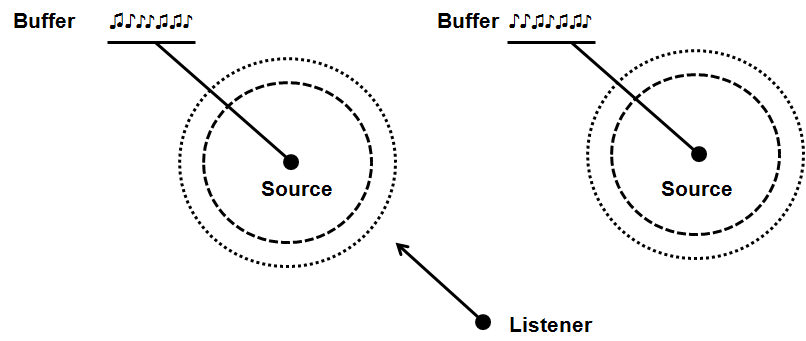

# Chapter 17 - Sound with OpenAL

Until this moment we have been dealing with graphics, but another key aspect of every game is audio. In this chapter we will add sound support.

You can find the complete source code for this chapter [here](../../booksamples/chapter-17).

## OpenAL

Audio capability is going to be addressed in this chapter with the help of [OpenAL](https://www.openal.org "OpenAL") (Open Audio Library). OpenAL is the OpenGL counterpart for audio, it allows us to play sounds through an abstraction layer. That layer isolates us from the underlying complexities of the audio subsystem. Besides that, it allows us to “render” sounds in a 3D scene, where sounds can be set up in specific locations, attenuated with the distance and modified according to their velocity (simulating [Doppler effect](https://en.wikipedia.org/wiki/Doppler_effect)\)

Before start coding we need to present the main elements involved when dealing with OpenAL, which are:

* Buffers.
* Sources.
* Listener.

Buffers store audio data, such as music or sound effects. They are similar to the textures in the OpenGL domain. OpenAL expects audio data to be in PCM (Pulse Coded Modulation) format (either in mono or in stereo), so we cannot just dump MP3 or OGG files without converting them first to PCM.

The next element are sources, which represent a location in a 3D space (a point) that emits sound. A source is associated to a buffer (only one at time) and can be defined by the following attributes:

* A position, the location of the source ($$x$$, $$y$$ and $$z$$ coordinates). By the way, OpenAL uses a right handed Cartesian coordinate system as OpenGL, so you can assume (to simplify things) that your world coordinates are equivalent to the ones in the sound space coordinate system.
* A velocity, which specifies how fast the source is moving. This is used to simulate Doppler effect.
* A gain, which is used to modify the intensity of the sound (it’s like an amplifier factor).

A source has additional attributes which will be shown later when describing the source code.

And last, but no least, a listener which is where the generated sounds are supposed to be heard. The Listener represents were the microphone is set in a 3D audio scene to receive the sounds. There is only one listener. Thus, it’s often said that audio rendering is done from the listener’s perspective. A listener shares some the attributes but it has some additional ones such as the orientation. The orientation represents where the listener is facing.

So an audio 3D scene is composed by a set of sound sources which emit sound and a listener that receives them. The final perceived sound will depend on the distance of the listener to the different sources, their relative speed and the selected propagation models. Sources can share buffers and play the same data. The following figure depicts a sample 3D scene with the different element types involved.



## Implementation

In order to use OpenAL, the first thing is adding maven dependencies to the project pom.xml. We need to add compile time and runtime dependencies.

```xml
...
<dependency>
   <groupId>org.lwjgl</groupId>
   <artifactId>lwjgl-openal</artifactId>
   <version>${lwjgl.version}</version>
</dependency>
...
<dependency>
   <groupId>org.lwjgl</groupId>
   <artifactId>lwjgl-openal</artifactId>
   <version>${lwjgl.version}</version>
   <classifier>${native.target}</classifier>
   <scope>runtime</scope>
</dependency>
...
```

So, let's start coding. We will create a new package under the name ```org.vulkanb.engine.sound``` that will host all the classes responsible for handling audio. We will first start with a class, named ```SoundBuffer``` that will represent an OpenAL buffer. The definition of that class is shown below.

```java
package org.vulkanb.eng.sound;

import org.lwjgl.stb.STBVorbisInfo;
import org.lwjgl.system.*;

import java.nio.*;

import static org.lwjgl.openal.AL10.*;
import static org.lwjgl.stb.STBVorbis.*;
import static org.lwjgl.system.MemoryUtil.NULL;

public class SoundBuffer {
    private final int bufferId;

    private final ShortBuffer pcm;

    public SoundBuffer(String filePath) {
        this.bufferId = alGenBuffers();
        try (STBVorbisInfo info = STBVorbisInfo.malloc()) {
            pcm = readVorbis(filePath, info);

            // Copy to buffer
            alBufferData(bufferId, info.channels() == 1 ? AL_FORMAT_MONO16 : AL_FORMAT_STEREO16, pcm, info.sample_rate());
        }
    }

    public void cleanup() {
        alDeleteBuffers(this.bufferId);
        if (pcm != null) {
            MemoryUtil.memFree(pcm);
        }
    }

    public int getBufferId() {
        return this.bufferId;
    }

    private ShortBuffer readVorbis(String filePath, STBVorbisInfo info) {
        try (MemoryStack stack = MemoryStack.stackPush()) {
            IntBuffer error = stack.mallocInt(1);
            long decoder = stb_vorbis_open_filename(filePath, error, null);
            if (decoder == NULL) {
                throw new RuntimeException("Failed to open Ogg Vorbis file. Error: " + error.get(0));
            }

            stb_vorbis_get_info(decoder, info);

            int channels = info.channels();

            int lengthSamples = stb_vorbis_stream_length_in_samples(decoder);

            ShortBuffer result = MemoryUtil.memAllocShort(lengthSamples * channels);

            result.limit(stb_vorbis_get_samples_short_interleaved(decoder, channels, result) * channels);
            stb_vorbis_close(decoder);

            return result;
        }
    }
}
```

The constructor of the class expects a sound file path  and creates a new buffer from it. The first thing that we do is create an OpenAL buffer with the call to ```alGenBuffers```. At the end our sound buffer will be identified by an integer which is like a pointer to the data it holds. Once the buffer has been created we dump the audio data in it. The constructor expects a file in OGG format, so we need to transform it to PCM format. This is done in the `readVorbis ` method.

Previous versions of LWJGL had a helper class named ```WaveData``` which was used to load audio files in WAV format. This class is no longer present in LWJGL 3. Nevertheless, you may get the source code from that class and use it in your games (maybe without requiring any changes).

The ```SoundBuffer``` class also provides a `cleanup` method to free the resources when we are done with it.

Let's continue by modelling an OpenAL, which will be implemented by class named ```SoundSource```. The class is defined below.

```java
package org.vulkanb.eng.sound;

import org.joml.Vector3f;

import static org.lwjgl.openal.AL10.*;

public class SoundSource {

    private final int sourceId;

    public SoundSource(boolean loop, boolean relative) {
        this.sourceId = alGenSources();
        alSourcei(sourceId, AL_LOOPING, loop ? AL_TRUE : AL_FALSE);
        alSourcei(sourceId, AL_SOURCE_RELATIVE, relative ? AL_TRUE : AL_FALSE);
    }

    public void cleanup() {
        stop();
        alDeleteSources(sourceId);
    }

    public boolean isPlaying() {
        return alGetSourcei(sourceId, AL_SOURCE_STATE) == AL_PLAYING;
    }

    public void pause() {
        alSourcePause(sourceId);
    }

    public void play() {
        alSourcePlay(sourceId);
    }

    public void setBuffer(int bufferId) {
        stop();
        alSourcei(sourceId, AL_BUFFER, bufferId);
    }

    public void setGain(float gain) {
        alSourcef(sourceId, AL_GAIN, gain);
    }

    public void setPosition(Vector3f position) {
        alSource3f(sourceId, AL_POSITION, position.x, position.y, position.z);
    }

    public void stop() {
        alSourceStop(sourceId);
    }
}
```

The sound source class provides some methods to setup its position, the gain, and control methods for playing, stopping, and pausing it. Keep in mind that sound control actions are made over a source (not over the buffer), remember that several sources can share the same buffer. As in the ```SoundBuffer``` class, a ```SoundSource``` is identified by an identifier, which is used in each operation. This class also provides a ```cleanup``` method to free the reserved resources. But let’s examine the constructor. The first thing that we do is to create the source with the ```alGenSources``` call. Then, we set up some interesting properties using the constructor parameters.

The first parameter, ```loop```, indicates if the sound to be played should be in loop mode or not. By default, when a play action is invoked over a source the playing stops when the audio data is consumed. This is fine for some sounds, but some others, like background music, need to be played over and over again. Instead of manually controlling when the audio has stopped and re-launch the play process, we just simply set the looping property to true: “```alSourcei(sourceId, AL_LOOPING, AL_TRUE);```”.

The other parameter, ```relative```, controls if the position of the source is relative to the listener or not. In this case, when we set the position for a source, we basically are defining the distance (with a vector) to the listener, not the position in the OpenAL 3D scene, not the world position. This activated by the “```alSourcei(sourceId, AL_SOURCE_RELATIVE, AL_TRUE);”``` call. But, What can we use this for? This property is interesting, for instance, for background sounds that shouldn't be affected (attenuated) by the distance to the listener. Think, for instance, in background music or sound effects related to player controls. If we set these sources as relative, and set their position to $$(0, 0, 0)$$ they will not be attenuated.

Now it’s turn for the listener which, surprise, is modelled by a class named ```SoundListener```. Here’s the definition for that class.

```java
package org.vulkanb.eng.sound;

import org.joml.Vector3f;

import static org.lwjgl.openal.AL10.*;

public class SoundListener {

    public SoundListener(Vector3f position) {
        alListener3f(AL_POSITION, position.x, position.y, position.z);
        alListener3f(AL_VELOCITY, 0, 0, 0);
    }

    public void setOrientation(Vector3f at, Vector3f up) {
        float[] data = new float[6];
        data[0] = at.x;
        data[1] = at.y;
        data[2] = at.z;
        data[3] = up.x;
        data[4] = up.y;
        data[5] = up.z;
        alListenerfv(AL_ORIENTATION, data);
    }

    public void setPosition(Vector3f position) {
        alListener3f(AL_POSITION, position.x, position.y, position.z);
    }

    public void setSpeed(Vector3f speed) {
        alListener3f(AL_VELOCITY, speed.x, speed.y, speed.z);
    }
}
```

A difference you will notice from the previous classes is that there’s no need to create a listener. There will always be one listener, so no need to create one, it’s already there for us. Thus, in the constructor we just simply set its initial position. For the same reason there’s no need for a ```cleanup``` method. The class has methods also for setting listener position and velocity, as in the ```SoundSource``` class, but we have an extra method for changing the listener orientation. Let’s review what orientation is all about. Listener orientation is defined by two vectors, “at” vector and “up” one, which are shown in the next figure.


The “at” vector basically points where the listener is facing, and by default its coordinates are $$(0, 0, -1)$$. The “up” vector determines which direction is up for the listener, and by default it points to $$(0, 1, 0)$$. So the three components of each of those two vectors are what are set in the ```alListenerfv``` method call. This method is used to transfer a set of floats (a variable number of floats) to a property, in this case, the orientation.

Before continuing, it's necessary to stress out some concepts in relation to source and listener speeds. The relative speed between sources and listener will cause OpenAL to simulate Doppler effect. In case you don’t know, Doppler effect is what causes that a moving object that is getting closer to you seems to emit in a higher frequency than it seems to emit when it is moving away. The thing is, that simply by setting a source or listener velocity, OpenAL will not update their position for you. It will use the relative velocity to calculate the Doppler effect, but the positions won’t be modified. So, if you want to simulate a moving source or listener, you must take care of updating their positions in the game loop.

Now that we have modelled the key elements, we can set them up to work; we need to initialize the OpenAL library, so we will create a new class named ```SoundManager``` that will handle this and starts like this:

```java
package org.vulkanb.eng.sound;

import org.joml.*;
import org.lwjgl.openal.*;
import org.tinylog.Logger;
import org.vulkanb.eng.scene.Camera;

import java.nio.*;
import java.util.*;

import static org.lwjgl.openal.AL10.alDistanceModel;
import static org.lwjgl.openal.ALC10.*;
import static org.lwjgl.system.MemoryUtil.NULL;

public class SoundManager {

    private final long context;
    private final long device;
    private final Map<String, SoundBuffer> soundBufferMap;
    private final Map<String, SoundSource> soundSourceMap;
    private SoundListener listener;

    public SoundManager() {
        soundBufferMap = new HashMap<>();
        soundSourceMap = new HashMap<>();

        device = alcOpenDevice((ByteBuffer) null);
        if (device == NULL) {
            throw new IllegalStateException("Failed to open the default OpenAL device.");
        }
        ALCCapabilities deviceCaps = ALC.createCapabilities(device);
        this.context = alcCreateContext(device, (IntBuffer) null);
        if (context == NULL) {
            throw new IllegalStateException("Failed to create OpenAL context.");
        }
        alcMakeContextCurrent(context);
        AL.createCapabilities(deviceCaps);
    }
    ...
}
```

This class holds references to the ```SoundBuffer``` and ```SoundSource``` instances to track and later cleanup them properly. SoundBuffers and SoundSources are stored in in a ```Map``` so they can be retrieved by an identifier. Although a `SoundSource` will be bound always only to a single `SoundBuffer` we do not need to create a sound source for each possible sound. In fact, we can have a few sound sources depending on their characteristics, for example if they are relative or not, or their position, and change the buffer which they are bound to dynamically. The constructor initializes the OpenAL subsystem:

* Opens the default device.
* Create the capabilities for that device.
* Create a sound context, like the OpenGL one, and set it as the current one.

The `SoundManager` class defines methods to add sound sources and buffers and a `cleanup` method to free all the resources:

```java
public class SoundManager {
    ...
    public SoundListener getListener() {
        return this.listener;
    }

    public SoundSource getSoundSource(String name) {
        return this.soundSourceMap.get(name);
    }

    public void pause(String sourceId) {
        SoundSource soundSource = soundSourceMap.get(sourceId);
        if (soundSource == null) {
            Logger.warn("Unknown source [{}]", sourceId);
            return;
        }
        soundSource.pause();
    }

    public void play(String sourceId, String bufferId) {
        SoundSource soundSource = soundSourceMap.get(sourceId);
        if (soundSource == null) {
            Logger.warn("Unknown source [{}]", sourceId);
            return;
        }
        SoundBuffer soundBuffer = soundBufferMap.get(bufferId);
        if (soundBuffer == null) {
            Logger.warn("Unknown buffer [{}]", bufferId);
            return;
        }
        soundSource.setBuffer(soundBuffer.getBufferId());
        soundSource.play();
    }

    public void playSoundSource(String name) {
        SoundSource soundSource = this.soundSourceMap.get(name);
        if (soundSource != null && !soundSource.isPlaying()) {
            soundSource.play();
        }
    }

    public void removeSoundSource(String name) {
        this.soundSourceMap.remove(name);
    }

    public void setAttenuationModel(int model) {
        alDistanceModel(model);
    }

    public void setListener(SoundListener listener) {
        this.listener = listener;
    }

    public void stop(String sourceId) {
        SoundSource soundSource = soundSourceMap.get(sourceId);
        if (soundSource == null) {
            Logger.warn("Unknown source [{}]", sourceId);
            return;
        }
        soundSource.stop();
    }
    ...
}
```
The ```SoundManager``` class also has a method to update the listener orientation given a camera position. In our case, the listener will be placed whenever the camera is. So, given camera position and rotation information, how do we calculate the “at” and “up” vectors? The answer is by using the view matrix associated to the camera. We need to transform the “at” $$(0, 0, -1)$$ and “up” $$(0, 1, 0)$$ vectors taking into consideration camera rotation. Let ```cameraMatrix``` be the view matrix associated to the camera. The code to accomplish that is:

```java
public class SoundManager {
    ...
    public void updateListenerPosition(Camera camera) {
        Matrix4f viewMatrix = camera.getViewMatrix();
        listener.setPosition(camera.getPosition());
        Vector3f at = new Vector3f();
        viewMatrix.positiveZ(at).negate();
        Vector3f up = new Vector3f();
        viewMatrix.positiveY(up);
        listener.setOrientation(at, up);
    }
    ...
}
```

The code above is equivalent to the explanation described previously, it’s just a more efficient approach. It uses a faster method, available in [JOML](https://github.com/JOML-CI/JOML) library, that just does not need to calculate the full inverse matrix but achieves the same results. This method was provided by the [JOML author](https://github.com/httpdigest) in a LWJGL forum, so you can check more details [there](http://forum.lwjgl.org/index.php?topic=6080.0). If you check the source code you will see that the ```SoundManager``` class calculates its own copy of the view matrix. 

And that’s all. We have all the infrastructure we need in order to play sounds. We just need to use it in the `Main` class where we set up a background sound and a specific sound whish is activated at a specific animation frame with its intensity relative to listener position:

```java
public class Main implements IAppLogic {
    ..
    private static final String SOUND_BUFFER_PLAYER = "player-sound-buffer";
    private static final String SOUND_SOURCE_PLAYER = "player-sound-source";
    ...
    private SoundManager soundMgr;

    public static void main(String[] args) {
        ...
        Engine gameEng = new Engine("chapter-17", opts, main);
        ...
    }

    @Override
    public void cleanup() {
        soundMgr.cleanup();
    }
    
    @Override
    public void init(Window window, Scene scene, Render render) {
        ...
        initSounds(bobEntity.getPosition(), camera);
    }

    private void initSounds(Vector3f position, Camera camera) {
        soundMgr = new SoundManager();
        soundMgr.setAttenuationModel(AL11.AL_EXPONENT_DISTANCE);
        soundMgr.setListener(new SoundListener(camera.getPosition()));

        SoundBuffer buffer = new SoundBuffer("resources/sounds/creak1.ogg");
        soundMgr.addSoundBuffer(SOUND_BUFFER_PLAYER, buffer);
        SoundSource playerSoundSource = new SoundSource(false, false);
        playerSoundSource.setPosition(position);
        playerSoundSource.setBuffer(buffer.getBufferId());
        soundMgr.addSoundSource(SOUND_SOURCE_PLAYER, playerSoundSource);

        buffer = new SoundBuffer("resources/sounds/woo_scary.ogg");
        soundMgr.addSoundBuffer("MUSIC", buffer);
        SoundSource source = new SoundSource(true, true);
        source.setBuffer(buffer.getBufferId());
        soundMgr.addSoundSource("MUSIC", source);
        source.play();
    }

    @Override
    public void input(Window window, Scene scene, long diffTimeMillis, boolean inputConsumed) {
        ...
        soundMgr.updateListenerPosition(camera);
    }

    @Override
    public void update(Window window, Scene scene, long diffTimeMillis) {
        Entity.EntityAnimation entityAnimation = bobEntity.getEntityAnimation();
        if (entityAnimation != null && entityAnimation.isStarted()) {
            int currentFrame = Math.floorMod(entityAnimation.getCurrentFrame() + 1, maxFrames);
            entityAnimation.setCurrentFrame(currentFrame);
            if (currentFrame == 45) {
                soundMgr.play(SOUND_SOURCE_PLAYER, SOUND_BUFFER_PLAYER);
            }
        }
    }
}
```

A final note. OpenAL also allows you to change the attenuation model by using the alDistanceModel and passing the model you want (```AL11.AL_EXPONENT_DISTANCE```, ```AL_EXPONENT_DISTANCE_CLAMP```, etc.). You can play with them and check the results.